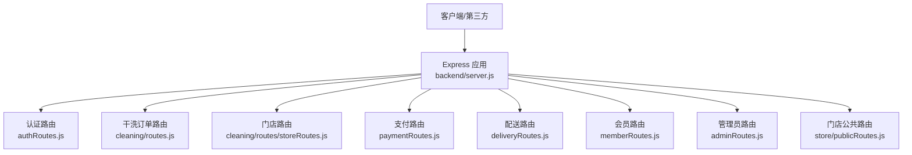
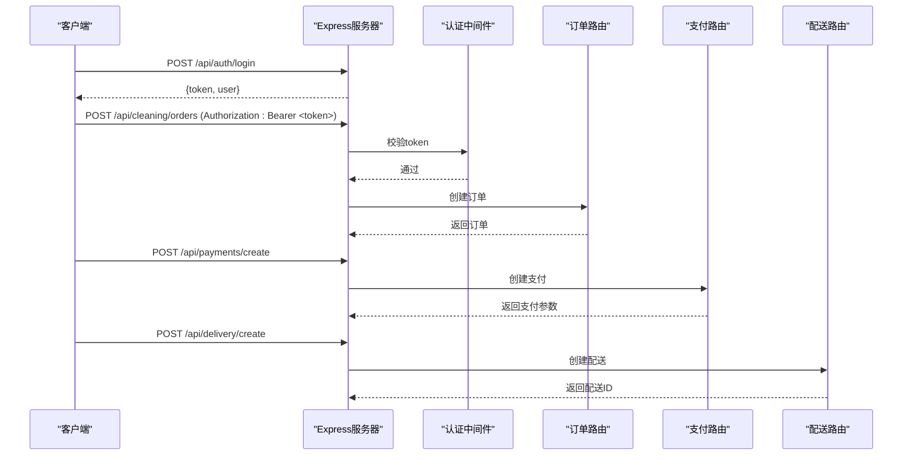
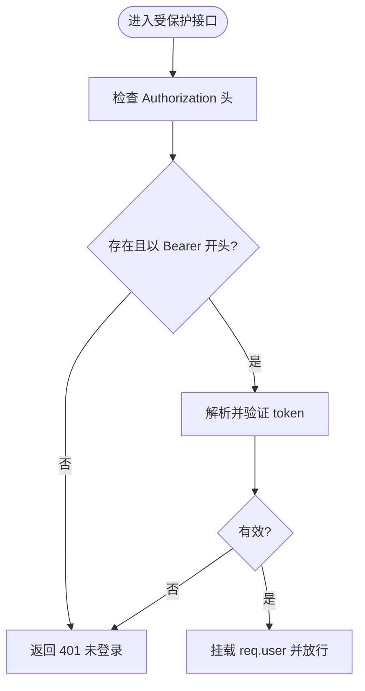
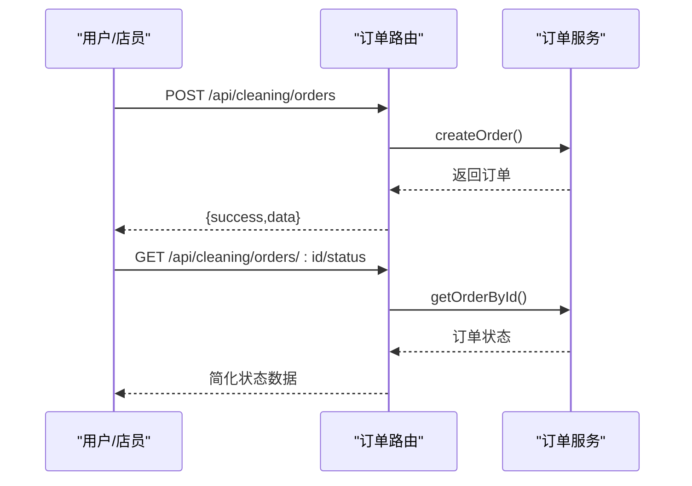
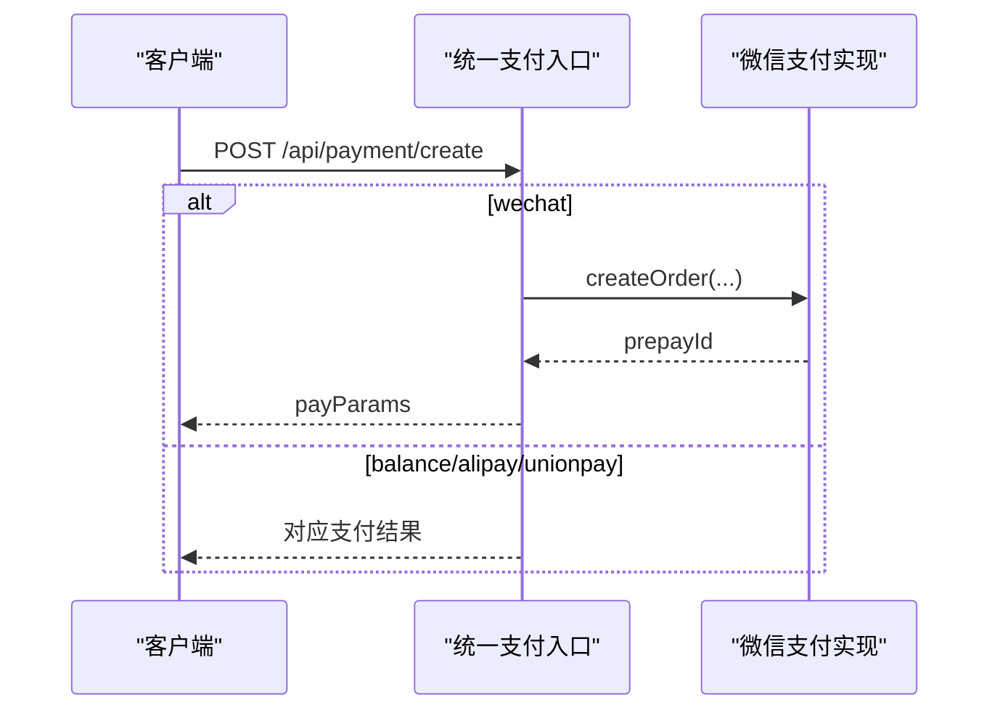
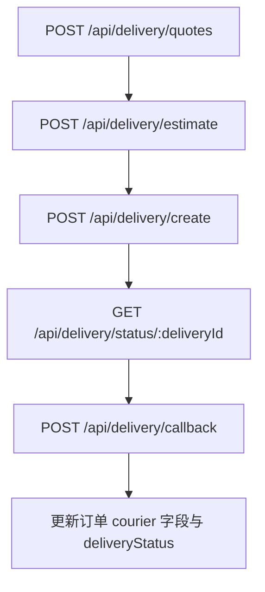
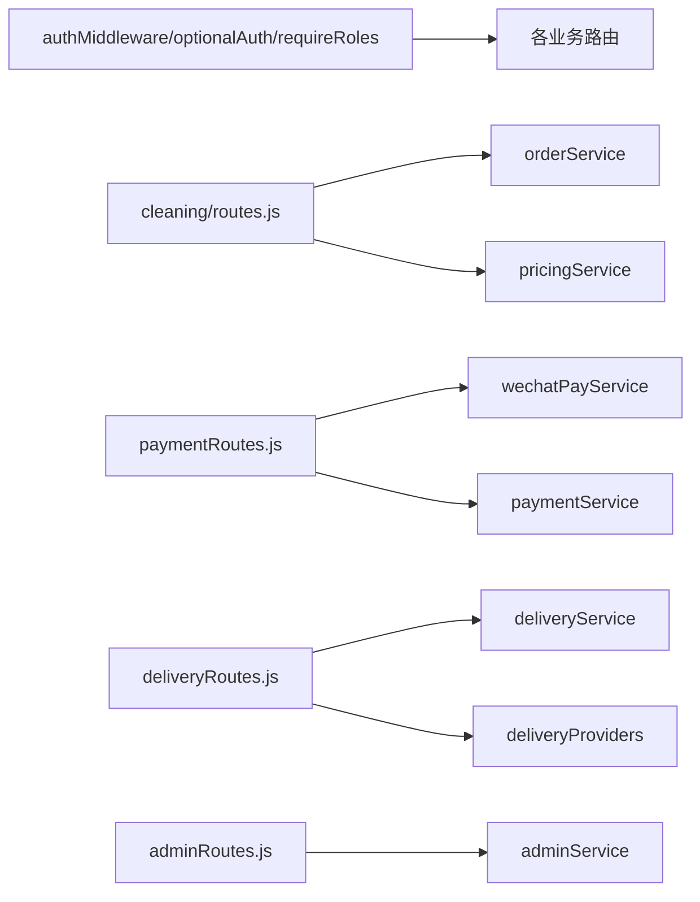

# API接口文档

<cite>
**本文引用的文件**   
- [backend/server.js](file://backend/server.js)
- [backend/modules/common/routes/authRoutes.js](file://backend/modules/common/routes/authRoutes.js)
- [backend/modules/common/middlewares/auth.js](file://backend/modules/common/middlewares/auth.js)
- [backend/modules/cleaning/routes.js](file://backend/modules/cleaning/routes.js)
- [backend/modules/cleaning/routes/storeRoutes.js](file://backend/modules/cleaning/routes/storeRoutes.js)
- [backend/modules/member/routes/memberRoutes.js](file://backend/modules/member/routes/memberRoutes.js)
- [backend/modules/common/routes/paymentRoutes.js](file://backend/modules/common/routes/paymentRoutes.js)
- [backend/modules/common/routes/deliveryRoutes.js](file://backend/modules/common/routes/deliveryRoutes.js)
- [backend/modules/admin/routes/adminRoutes.js](file://backend/modules/admin/routes/adminRoutes.js)
- [backend/modules/store/routes/publicRoutes.js](file://backend/modules/store/routes/publicRoutes.js)
- [api/API_DOCUMENTATION.md](file://api/API_DOCUMENTATION.md)
</cite>

## 目录
1. [简介](#简介)
2. [项目结构](#项目结构)
3. [核心组件](#核心组件)
4. [架构总览](#架构总览)
5. [详细组件分析](#详细组件分析)
6. [依赖关系分析](#依赖关系分析)
7. [性能与限流建议](#性能与限流建议)
8. [安全与鉴权](#安全与鉴权)
9. [错误码与响应规范](#错误码与响应规范)
10. [版本管理与兼容性](#版本管理与兼容性)
11. [故障排查指南](#故障排查指南)
12. [结论](#结论)

## 简介
本文件为干洗店管理系统的完整API接口文档，覆盖认证授权、订单管理、支付处理、配送服务、门店管理等核心能力。文档面向前端开发者与第三方集成商，提供RESTful端点、请求参数、响应格式、错误码说明，以及JWT令牌认证方法、权限控制规则、调试工具推荐与性能优化建议。

## 项目结构
后端采用Express模块化路由组织，按业务域划分模块：
- 认证与权限：common模块中间件与服务
- 干洗订单：cleaning模块（订单生命周期、定价、灯条联动）
- 支付：common模块支付路由 + 统一支付入口
- 配送：common模块配送路由 + 聚合服务商
- 门店：cleaning模块门店管理 + store公共接口
- 会员：member模块
- 管理员后台：admin模块
- 系统健康与模块状态：server根路由

图表来源
- [backend/server.js:96-151](file://backend/server.js#L96-L151)
- [backend/modules/common/routes/authRoutes.js:1-586](file://backend/modules/common/routes/authRoutes.js#L1-L586)
- [backend/modules/cleaning/routes.js:1-800](file://backend/modules/cleaning/routes.js#L1-L800)
- [backend/modules/cleaning/routes/storeRoutes.js:1-194](file://backend/modules/cleaning/routes/storeRoutes.js#L1-L194)
- [backend/modules/common/routes/paymentRoutes.js:1-215](file://backend/modules/common/routes/paymentRoutes.js#L1-L215)
- [backend/modules/common/routes/deliveryRoutes.js:1-323](file://backend/modules/common/routes/deliveryRoutes.js#L1-L323)
- [backend/modules/member/routes/memberRoutes.js:1-48](file://backend/modules/member/routes/memberRoutes.js#L1-L48)
- [backend/modules/admin/routes/adminRoutes.js:1-800](file://backend/modules/admin/routes/adminRoutes.js#L1-L800)
- [backend/modules/store/routes/publicRoutes.js:1-70](file://backend/modules/store/routes/publicRoutes.js#L1-L70)

章节来源
- [backend/server.js:1-702](file://backend/server.js#L1-L702)

## 核心组件
- 认证与鉴权
  - JWT令牌生成与解析，支持开发模式mock token
  - 可选认证与角色校验中间件
- 订单管理
  - 创建、查询、搜索、取消、删除、状态流转、取件方式选择、支付配送费、扫码取件、批量取货、智能灯条控制
- 支付处理
  - 统一支付入口、微信支付回调、余额支付、退款
- 配送服务
  - 服务商列表与报价、创建配送单、状态查询、取消、回调映射、跟踪模拟
- 门店管理
  - 门店CRUD、员工账户管理、服务列表
- 会员信息
  - 获取会员信息（可选认证）
- 管理员后台
  - 仪表盘、用户/门店/订单管理、模块配置、灯条控制、配送管理、会员管理

章节来源
- [backend/modules/common/middlewares/auth.js:1-207](file://backend/modules/common/middlewares/auth.js#L1-L207)
- [backend/modules/cleaning/routes.js:1-800](file://backend/modules/cleaning/routes.js#L1-L800)
- [backend/modules/common/routes/paymentRoutes.js:1-215](file://backend/modules/common/routes/paymentRoutes.js#L1-L215)
- [backend/modules/common/routes/deliveryRoutes.js:1-323](file://backend/modules/common/routes/deliveryRoutes.js#L1-L323)
- [backend/modules/cleaning/routes/storeRoutes.js:1-194](file://backend/modules/cleaning/routes/storeRoutes.js#L1-L194)
- [backend/modules/member/routes/memberRoutes.js:1-48](file://backend/modules/member/routes/memberRoutes.js#L1-L48)
- [backend/modules/admin/routes/adminRoutes.js:1-800](file://backend/modules/admin/routes/adminRoutes.js#L1-L800)

## 架构总览
系统通过Express挂载各模块路由，统一错误处理与健康检查；支付与配送通过独立路由聚合外部平台；门店端公共接口无需认证用于灯条控制等场景。

图表来源
- [backend/server.js:96-151](file://backend/server.js#L96-L151)
- [backend/modules/common/middlewares/auth.js:1-207](file://backend/modules/common/middlewares/auth.js#L1-L207)
- [backend/modules/cleaning/routes.js:1-800](file://backend/modules/cleaning/routes.js#L1-L800)
- [backend/modules/common/routes/paymentRoutes.js:1-215](file://backend/modules/common/routes/paymentRoutes.js#L1-L215)
- [backend/modules/common/routes/deliveryRoutes.js:1-323](file://backend/modules/common/routes/deliveryRoutes.js#L1-L323)

## 详细组件分析

### 认证与授权
- 登录与注册
  - POST /api/auth/send-code
  - POST /api/auth/verify-code
  - POST /api/auth/register
  - POST /api/auth/login
  - POST /api/auth/wechat
  - GET /api/auth/wechat/authorize
  - GET /api/auth/wechat/callback
  - POST /api/auth/staff-login
  - POST /api/auth/dev-staff-login
  - POST /api/auth/wxmini-login
  - POST /api/auth/forgot-password
- 受保护接口
  - GET /api/auth/profile
  - PUT /api/auth/profile
  - POST /api/auth/change-password
  - POST /api/auth/logout
- 鉴权机制
  - 请求头：Authorization: Bearer <token>
  - 中间件：authMiddleware（强制）、optionalAuth（可选）、requireRoles（角色校验）
  - 开发模式支持dev-admin-*、dev-chain-*、mock_token_*前缀的token快速登录

图表来源
- [backend/modules/common/middlewares/auth.js:1-207](file://backend/modules/common/middlewares/auth.js#L1-L207)
- [backend/modules/common/routes/authRoutes.js:1-586](file://backend/modules/common/routes/authRoutes.js#L1-L586)

章节来源
- [backend/modules/common/routes/authRoutes.js:1-586](file://backend/modules/common/routes/authRoutes.js#L1-L586)
- [backend/modules/common/middlewares/auth.js:1-207](file://backend/modules/common/middlewares/auth.js#L1-L207)

### 订单管理（干洗）
- 基础操作
  - POST /api/cleaning/orders
  - GET /api/cleaning/orders
  - GET /api/cleaning/orders/:id
  - POST /api/cleaning/orders/:id/cancel
  - POST /api/cleaning/orders/:id/delete
- 状态流转
  - POST /api/cleaning/orders/:id/receive
  - POST /api/cleaning/orders/:id/processing
  - POST /api/cleaning/orders/:id/complete
  - POST /api/cleaning/orders/:id/delivering
  - POST /api/cleaning/orders/:id/pickup
  - PUT /api/cleaning/orders/:id/status
- 取件与跑腿
  - POST /api/cleaning/orders/:id/pickup-method
  - POST /api/cleaning/orders/:id/select-provider
  - POST /api/cleaning/orders/:id/pay-delivery-fee
  - POST /api/cleaning/orders/:id/scan-pickup
  - POST /api/cleaning/orders/batch-pickup
- 实时状态
  - GET /api/cleaning/orders/:id/status
- 灯条联动
  - POST /api/cleaning/store/:storeId/light-up
  - POST /api/cleaning/store/:storeId/light-off
  - GET /api/cleaning/store/:storeId/light-status
- 定价与配置
  - POST /api/cleaning/pricing
  - GET /api/cleaning/stores/:storeId/services
  - POST /api/cleaning/store-config
  - GET /api/cleaning/store-config/:storeId
  - POST /api/cleaning/stores/pricing

图表来源
- [backend/modules/cleaning/routes.js:1-800](file://backend/modules/cleaning/routes.js#L1-L800)

章节来源
- [backend/modules/cleaning/routes.js:1-800](file://backend/modules/cleaning/routes.js#L1-L800)

### 支付处理
- 统一支付入口
  - POST /api/payment/create
  - GET /api/payment/query/:orderId
  - POST /api/payment/callback
- 微信小程序支付
  - POST /api/payment/wechat/unified
- 余额相关
  - GET /api/balance/:userId
  - POST /api/balance/recharge
- 通用支付路由
  - POST /api/payments/create
  - GET /api/payments/query/:orderId
  - POST /api/payments/wechat/callback
  - POST /api/payments/refund

图表来源
- [backend/server.js:410-523](file://backend/server.js#L410-L523)
- [backend/modules/common/routes/paymentRoutes.js:1-215](file://backend/modules/common/routes/paymentRoutes.js#L1-L215)

章节来源
- [backend/server.js:410-523](file://backend/server.js#L410-L523)
- [backend/modules/common/routes/paymentRoutes.js:1-215](file://backend/modules/common/routes/paymentRoutes.js#L1-L215)

### 配送服务
- 服务商与报价
  - GET /api/delivery/provider-status
  - GET /api/delivery/providers
  - POST /api/delivery/quotes
  - POST /api/delivery/estimate
- 订单管理
  - POST /api/delivery/create
  - GET /api/delivery/status/:deliveryId
  - POST /api/delivery/cancel
- 回调与跟踪
  - POST /api/delivery/callback
  - POST /api/delivery/:orderId/start-tracking
  - GET /api/delivery/tracking/active

图表来源
- [backend/modules/common/routes/deliveryRoutes.js:1-323](file://backend/modules/common/routes/deliveryRoutes.js#L1-L323)

章节来源
- [backend/modules/common/routes/deliveryRoutes.js:1-323](file://backend/modules/common/routes/deliveryRoutes.js#L1-L323)

### 门店管理
- 公开接口
  - GET /api/stores
  - GET /api/stores/:id
  - GET /api/stores/:id/services
- 受保护接口
  - POST /api/stores
  - PUT /api/stores/:id
  - GET /api/stores/owner/my
  - POST /api/stores/:id/staff/create
  - GET /api/stores/:id/staff/detail
  - DELETE /api/stores/:id/staff/:staffId
  - PUT /api/stores/:id/staff/:staffId/role
  - POST /api/stores/:id/staff
  - GET /api/stores/:id/staff

章节来源
- [backend/modules/cleaning/routes/storeRoutes.js:1-194](file://backend/modules/cleaning/routes/storeRoutes.js#L1-L194)

### 会员信息
- GET /api/member/info（可选认证）

章节来源
- [backend/modules/member/routes/memberRoutes.js:1-48](file://backend/modules/member/routes/memberRoutes.js#L1-L48)

### 管理员后台
- 仪表盘与设置
  - GET /api/admin/dashboard
  - GET /api/admin/settings
  - PUT /api/admin/settings
  - GET /api/admin/modules
  - PUT /api/admin/modules/:name
- 用户与门店
  - GET /api/admin/users
  - GET /api/admin/users/:id
  - PUT /api/admin/users/:id/status
  - GET /api/admin/stores
  - POST /api/admin/stores
  - PUT /api/admin/stores/:id
  - GET /api/admin/stores/:id
  - PUT /api/admin/stores/:id/status
  - POST /api/admin/stores/import
- 订单与配送
  - GET /api/admin/orders
  - GET /api/admin/orders/:id
  - GET /api/admin/delivery/orders
  - POST /api/admin/delivery/create
- 灯条与终端
  - GET /api/admin/store/:storeId/light-status
  - POST /api/admin/store/:storeId/light-up
  - POST /api/admin/store/:storeId/light-off
  - POST /api/admin/store/:storeId/light-all-off
  - GET /api/admin/store/:storeId/mqtt-config
  - GET /api/admin/store/:storeId/light-connection
  - GET /api/admin/terminals
  - GET /api/admin/store/:storeId/terminal-lights
- 一键取货
  - GET /api/admin/store/:storeId/orders
  - GET /api/admin/store/:storeId/pending-orders
  - POST /api/admin/store/:storeId/batch-pickup
- 会员管理
  - GET /api/admin/members

章节来源
- [backend/modules/admin/routes/adminRoutes.js:1-800](file://backend/modules/admin/routes/adminRoutes.js#L1-L800)

### 门店端公共接口（无需认证）
- 灯条控制
  - POST /api/store/lights/:storeId/turn-on
  - POST /api/store/lights/:storeId/turn-off
  - POST /api/store/lights/:storeId/turn-on-all
  - POST /api/store/lights/:storeId/turn-off-all
- 终端与状态
  - GET /api/store/terminals
  - GET /api/store/store/:storeId/terminal-lights
  - GET /api/store/status

章节来源
- [backend/modules/store/routes/publicRoutes.js:1-70](file://backend/modules/store/routes/publicRoutes.js#L1-L70)

### 系统接口
- GET /api/system/modules
- GET /api/system/modules/:name
- GET /api/health

章节来源
- [backend/server.js:55-90](file://backend/server.js#L55-L90)

## 依赖关系分析
- 路由层依赖中间件进行鉴权与模块守卫
- 订单路由依赖订单服务与定价服务
- 支付路由依赖微信与支付服务
- 配送路由依赖配送服务与提供商适配器
- 管理员路由依赖管理服务与模块配置

图表来源
- [backend/modules/common/middlewares/auth.js:1-207](file://backend/modules/common/middlewares/auth.js#L1-L207)
- [backend/modules/cleaning/routes.js:1-800](file://backend/modules/cleaning/routes.js#L1-L800)
- [backend/modules/common/routes/paymentRoutes.js:1-215](file://backend/modules/common/routes/paymentRoutes.js#L1-L215)
- [backend/modules/common/routes/deliveryRoutes.js:1-323](file://backend/modules/common/routes/deliveryRoutes.js#L1-L323)
- [backend/modules/admin/routes/adminRoutes.js:1-800](file://backend/modules/admin/routes/adminRoutes.js#L1-L800)

## 性能与限流建议
- 缓存策略
  - 对静态或低频变更数据（如门店列表、服务价格）启用短期缓存与ETag
  - 订单状态轮询接口已禁用缓存，避免前端重复请求造成压力
- 分页与过滤
  - 所有列表接口均支持page/pageSize，建议前端合理设置pageSize
- 异步与批处理
  - 批量取货、批量导入等接口已在服务端做事务与异常隔离
- 限流建议
  - 在网关层或中间件层增加基于IP与用户的速率限制（例如登录、验证码发送）
  - 对高频查询（订单状态轮询）建议前端使用指数退避与最大间隔上限

[本节为通用建议，不直接分析具体文件]

## 安全与鉴权
- 认证方式
  - 使用Authorization: Bearer <token>传递JWT令牌
  - 支持开发模式下的特殊token前缀快速登录
- 权限控制
  - 使用requireRoles指定所需角色（如admin、store_owner、store_staff）
- 敏感信息
  - 用户模型中密码字段在服务层清洗，不在响应中返回
- 回调安全
  - 支付与配送回调需验签与解密，防止伪造请求

章节来源
- [backend/modules/common/middlewares/auth.js:1-207](file://backend/modules/common/middlewares/auth.js#L1-L207)
- [backend/modules/common/routes/paymentRoutes.js:1-215](file://backend/modules/common/routes/paymentRoutes.js#L1-L215)
- [backend/modules/common/routes/deliveryRoutes.js:1-323](file://backend/modules/common/routes/deliveryRoutes.js#L1-L323)

## 错误码与响应规范
- 统一响应结构
  - success: boolean
  - data: any | null
  - error: string | null
  - message: string | null
- 常见HTTP状态码
  - 200 成功
  - 400 参数错误或业务校验失败
  - 401 未登录或认证失败
  - 403 权限不足
  - 404 资源不存在
  - 500 服务器内部错误
- 示例
  - 成功响应
    - { "success": true, "data": { ... } }
  - 错误响应
    - { "success": false, "error": "参数不完整", "message": "请填写手机号和密码" }

章节来源
- [backend/server.js:602-609](file://backend/server.js#L602-L609)
- [backend/modules/common/routes/authRoutes.js:1-586](file://backend/modules/common/routes/authRoutes.js#L1-L586)
- [backend/modules/cleaning/routes.js:1-800](file://backend/modules/cleaning/routes.js#L1-L800)
- [backend/modules/common/routes/paymentRoutes.js:1-215](file://backend/modules/common/routes/paymentRoutes.js#L1-L215)
- [backend/modules/common/routes/deliveryRoutes.js:1-323](file://backend/modules/common/routes/deliveryRoutes.js#L1-L323)

## 版本管理与兼容性
- 当前版本
  - 通过GET /api/system/modules可获取系统版本与模块状态
- 向后兼容
  - 新增字段通常保持可选，旧字段保留一段时间
  - 废弃接口将提前公告并在后续版本移除
- 环境差异
  - 开发环境与生产环境的某些行为可能不同（如模拟支付、开发登录），请根据环境变量区分

章节来源
- [backend/server.js:55-90](file://backend/server.js#L55-L90)

## 故障排查指南
- 常见问题
  - 401未登录：检查Authorization头是否正确携带Bearer token
  - 403权限不足：确认用户角色是否满足requireRoles要求
  - 支付回调失败：检查签名验证与解密逻辑
  - 配送状态不一致：核对回调状态映射与订单courier字段更新
- 诊断工具
  - 使用浏览器网络面板或Postman进行请求/响应调试
  - 查看后端日志定位错误堆栈
  - 使用系统健康检查接口确认服务可用性

章节来源
- [backend/server.js:602-609](file://backend/server.js#L602-L609)
- [backend/modules/common/routes/paymentRoutes.js:1-215](file://backend/modules/common/routes/paymentRoutes.js#L1-L215)
- [backend/modules/common/routes/deliveryRoutes.js:1-323](file://backend/modules/common/routes/deliveryRoutes.js#L1-L323)

## 结论
本系统提供了完整的干洗店管理API，涵盖认证、订单、支付、配送、门店与管理员后台等核心能力。通过统一的响应结构与严格的鉴权中间件，确保接口的一致性与安全性。建议在网关层实施限流与监控，结合前端合理的轮询与重试策略，提升整体稳定性与用户体验。