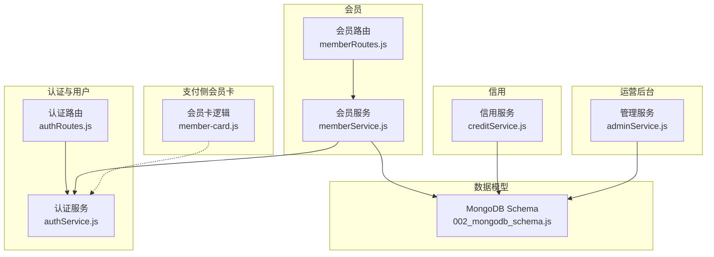
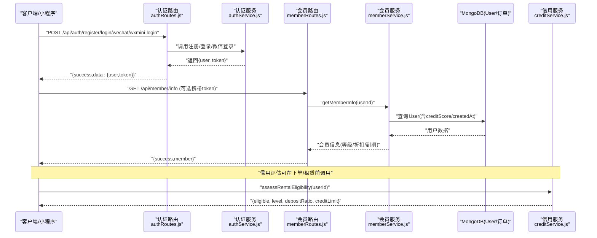
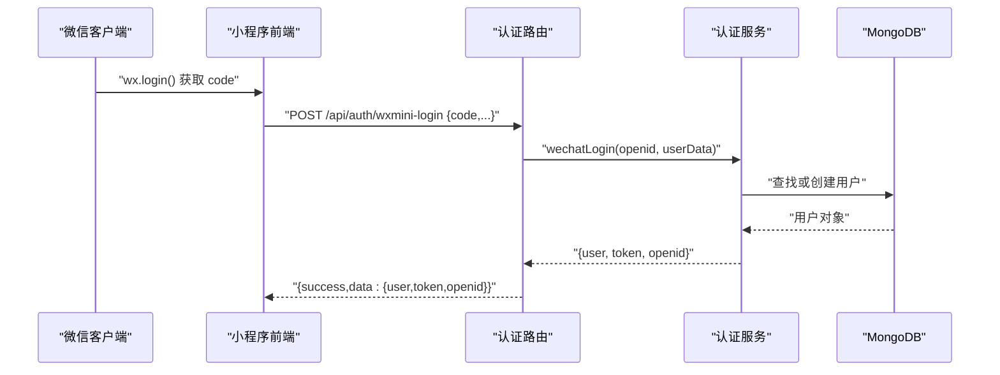
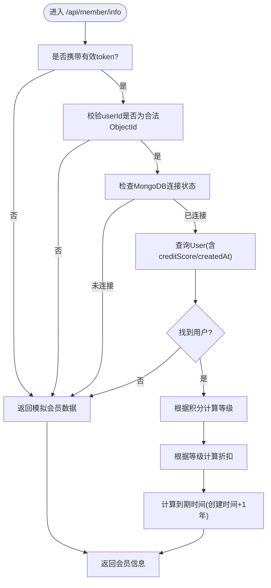
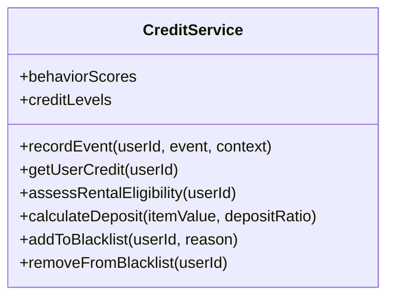
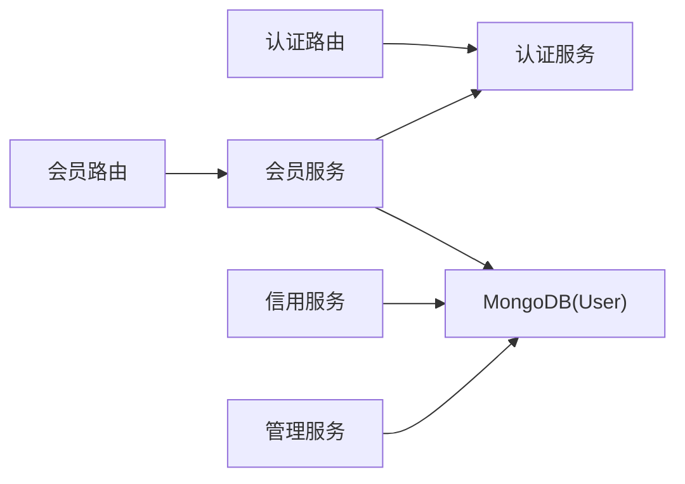

# 会员服务接口

<cite>
**本文引用的文件**   
- [backend/modules/member/routes/memberRoutes.js](file://backend/modules/member/routes/memberRoutes.js)
- [backend/modules/member/services/memberService.js](file://backend/modules/member/services/memberService.js)
- [backend/modules/common/routes/authRoutes.js](file://backend/modules/common/routes/authRoutes.js)
- [backend/modules/common/services/authService.js](file://backend/modules/common/services/authService.js)
- [backend/modules/common/services/creditService.js](file://backend/modules/common/services/creditService.js)
- [backend/migrations/002_mongodb_schema.js](file://backend/migrations/002_mongodb_schema.js)
- [backend/modules/admin/services/adminService.js](file://backend/modules/admin/services/adminService.js)
- [api/payment-server/member-card.js](file://api/payment-server/member-card.js)
</cite>

## 目录
1. [简介](#简介)
2. [项目结构](#项目结构)
3. [核心组件](#核心组件)
4. [架构总览](#架构总览)
5. [详细组件分析](#详细组件分析)
6. [依赖关系分析](#依赖关系分析)
7. [性能与可用性](#性能与可用性)
8. [故障排查指南](#故障排查指南)
9. [结论](#结论)
10. [附录：接口清单与错误码](#附录接口清单与错误码)

## 简介
本文件为干洗店“会员服务系统”的完整API文档，覆盖会员注册、等级体系、积分管理、优惠券使用、信用评估、个人中心集成以及运营后台使用说明。文档面向C端用户、小程序前端、门店运营与连锁管理员，提供清晰的HTTP方法、URL模式、请求参数、响应格式与错误码说明，并给出关键流程的时序图与流程图，帮助快速集成与排障。

## 项目结构
围绕会员能力的相关代码主要分布在以下模块：
- 认证与用户中心：authRoutes.js、authService.js
- 会员信息与服务：memberRoutes.js、memberService.js
- 信用评估：creditService.js
- 数据模型（含会员与信用字段）：002_mongodb_schema.js
- 运营管理（会员列表与统计）：adminService.js
- 支付侧会员卡（可选扩展）：member-card.js

图表来源
- [backend/modules/common/routes/authRoutes.js:1-586](file://backend/modules/common/routes/authRoutes.js#L1-L586)
- [backend/modules/common/services/authService.js:1-498](file://backend/modules/common/services/authService.js#L1-L498)
- [backend/modules/member/routes/memberRoutes.js:1-48](file://backend/modules/member/routes/memberRoutes.js#L1-L48)
- [backend/modules/member/services/memberService.js:1-134](file://backend/modules/member/services/memberService.js#L1-L134)
- [backend/modules/common/services/creditService.js:1-182](file://backend/modules/common/services/creditService.js#L1-L182)
- [backend/migrations/002_mongodb_schema.js:84-128](file://backend/migrations/002_mongodb_schema.js#L84-L128)
- [backend/modules/admin/services/adminService.js:1619-1649](file://backend/modules/admin/services/adminService.js#L1619-L1649)
- [api/payment-server/member-card.js:1-94](file://api/payment-server/member-card.js#L1-L94)

章节来源
- [backend/modules/member/routes/memberRoutes.js:1-48](file://backend/modules/member/routes/memberRoutes.js#L1-L48)
- [backend/modules/member/services/memberService.js:1-134](file://backend/modules/member/services/memberService.js#L1-L134)
- [backend/modules/common/routes/authRoutes.js:1-586](file://backend/modules/common/routes/authRoutes.js#L1-L586)
- [backend/modules/common/services/authService.js:1-498](file://backend/modules/common/services/authService.js#L1-L498)
- [backend/modules/common/services/creditService.js:1-182](file://backend/modules/common/services/creditService.js#L1-L182)
- [backend/migrations/002_mongodb_schema.js:84-128](file://backend/migrations/002_mongodb_schema.js#L84-L128)
- [backend/modules/admin/services/adminService.js:1619-1649](file://backend/modules/admin/services/adminService.js#L1619-L1649)
- [api/payment-server/member-card.js:1-94](file://api/payment-server/member-card.js#L1-L94)

## 核心组件
- 认证与用户中心
  - 提供手机号注册/登录、验证码、微信登录（网页/小程序）、员工登录、个人信息获取与更新等能力。
- 会员信息服务
  - 提供当前会员信息查询（积分/等级/折扣/到期时间），支持无身份时返回模拟数据兜底。
- 信用评估服务
  - 基于行为事件计算履约分，划分信用等级，输出租赁资格与押金策略（预留扩展）。
- 数据模型
  - 在User模型中定义会员字段（level、points、totalSpent、memberSince）与信用字段（fulfillmentScore、completedOrders、cancelledOrders、lateReturns、complaints、depositBalance、creditLimit、blacklisted等）。
- 运营管理
  - 提供按关键词与等级筛选的会员列表与消费统计，用于后台展示与运营决策。
- 支付侧会员卡（可选）
  - 提供平台级与商家专属会员卡创建与交易记录（内存示例实现，便于联调）。

章节来源
- [backend/modules/common/routes/authRoutes.js:1-586](file://backend/modules/common/routes/authRoutes.js#L1-L586)
- [backend/modules/common/services/authService.js:1-498](file://backend/modules/common/services/authService.js#L1-L498)
- [backend/modules/member/routes/memberRoutes.js:1-48](file://backend/modules/member/routes/memberRoutes.js#L1-L48)
- [backend/modules/member/services/memberService.js:1-134](file://backend/modules/member/services/memberService.js#L1-L134)
- [backend/modules/common/services/creditService.js:1-182](file://backend/modules/common/services/creditService.js#L1-L182)
- [backend/migrations/002_mongodb_schema.js:84-128](file://backend/migrations/002_mongodb_schema.js#L84-L128)
- [backend/modules/admin/services/adminService.js:1619-1649](file://backend/modules/admin/services/adminService.js#L1619-L1649)
- [api/payment-server/member-card.js:1-94](file://api/payment-server/member-card.js#L1-L94)

## 架构总览
下图展示了从客户端到后端各层的关键交互路径，包括认证、会员信息、信用评估与后台管理。

图表来源
- [backend/modules/common/routes/authRoutes.js:1-586](file://backend/modules/common/routes/authRoutes.js#L1-L586)
- [backend/modules/common/services/authService.js:1-498](file://backend/modules/common/services/authService.js#L1-L498)
- [backend/modules/member/routes/memberRoutes.js:1-48](file://backend/modules/member/routes/memberRoutes.js#L1-L48)
- [backend/modules/member/services/memberService.js:1-134](file://backend/modules/member/services/memberService.js#L1-L134)
- [backend/modules/common/services/creditService.js:1-182](file://backend/modules/common/services/creditService.js#L1-L182)

## 详细组件分析

### 认证与用户中心（注册/登录/微信登录/个人信息）
- 功能要点
  - 手机号注册/登录、短信验证码发送与校验
  - 微信登录（网页授权与小程序code换取openid）
  - 员工账号登录（支持工号/手机号）
  - 个人信息获取与更新（含跨平台账户合并）
- 关键接口
  - POST /api/auth/send-code
  - POST /api/auth/verify-code
  - POST /api/auth/register
  - POST /api/auth/login
  - POST /api/auth/wechat
  - GET /api/auth/wechat/authorize
  - GET /api/auth/wechat/callback
  - POST /api/auth/staff-login
  - POST /api/auth/dev-staff-login
  - POST /api/auth/wxmini-login
  - GET /api/auth/profile
  - PUT /api/auth/profile
  - POST /api/auth/change-password
  - POST /api/auth/forgot-password
  - POST /api/auth/logout
- 请求/响应约定
  - 成功：{ success: true, data: ... }
  - 失败：{ success: false, error: "错误描述" }，状态码多为400/401
- 安全与权限
  - 需要认证的接口通过中间件校验token；员工登录返回角色与菜单权限
- 典型流程（微信小程序登录）

图表来源
- [backend/modules/common/routes/authRoutes.js:444-490](file://backend/modules/common/routes/authRoutes.js#L444-L490)
- [backend/modules/common/services/authService.js:128-198](file://backend/modules/common/services/authService.js#L128-L198)

章节来源
- [backend/modules/common/routes/authRoutes.js:1-586](file://backend/modules/common/routes/authRoutes.js#L1-L586)
- [backend/modules/common/services/authService.js:1-498](file://backend/modules/common/services/authService.js#L1-L498)

### 会员信息与等级体系
- 功能要点
  - 获取当前会员信息（积分/余额/等级/折扣/到期时间）
  - 无身份时返回模拟数据兜底，保障前端体验
  - 等级由积分（creditScore）计算，折扣随等级变化
- 关键接口
  - GET /api/member/info
- 等级与折扣规则
  - 普通会员：积分 < 2000，折扣 9.5折
  - 白银会员：积分 2000~4999，折扣 9.0折
  - 黄金会员：积分 5000~9999，折扣 8.5折
  - 铂金会员：积分 ≥ 10000，折扣 7.5折
- 数据结构（节选）
  - member.userId / name / level / points / balance / discount / expireDate / phone / avatar / nickname
- 处理流程（获取会员信息）

图表来源
- [backend/modules/member/routes/memberRoutes.js:11-45](file://backend/modules/member/routes/memberRoutes.js#L11-L45)
- [backend/modules/member/services/memberService.js:22-94](file://backend/modules/member/services/memberService.js#L22-L94)

章节来源
- [backend/modules/member/routes/memberRoutes.js:1-48](file://backend/modules/member/routes/memberRoutes.js#L1-L48)
- [backend/modules/member/services/memberService.js:1-134](file://backend/modules/member/services/memberService.js#L1-L134)

### 积分管理与升级
- 积分来源
  - 业务侧可通过事件驱动更新用户creditScore（例如完成订单、评价、绑定等正向行为）
- 等级升级
  - 当用户creditScore达到阈值自动升级，折扣随之调整
- 建议实现（概念性）
  - 在订单完成、评价提交、身份认证等事件触发后，调用信用服务记录行为并累加分数
  - 同步刷新会员信息缓存（如有）

章节来源
- [backend/modules/common/services/creditService.js:1-182](file://backend/modules/common/services/creditService.js#L1-L182)
- [backend/migrations/002_mongodb_schema.js:94-100](file://backend/migrations/002_mongodb_schema.js#L94-L100)

### 优惠券管理系统（发放/领取/核销/过期）
- 现状说明
  - 当前仓库未提供独立的优惠券API；建议在订单报价与结算链路中引入优惠券维度，结合门店促销配置进行抵扣
- 建议设计（概念性）
  - 发放：批量生成券模板，指定适用门店/品类/门槛/有效期
  - 领取：用户领取后写入用户券包，标记可用状态
  - 核销：下单时选择可用券，结算阶段扣减金额并记录流水
  - 过期：定时任务扫描过期券，更新状态
- 与现有能力的衔接
  - 可复用认证与用户中心、订单与定价服务（门店促销折扣已在定价链路中体现）

[本节为概念性设计，不直接分析具体文件]

### 会员信用评估机制
- 行为评分
  - 正向：完成订单、准时付款、归还租赁物品、提交评价、完成绑定/认证
  - 负向：取消订单、多次不取件、延迟付款、租赁逾期/损坏、被举报欺诈、辱骂员工、虚假评价
- 信用等级
  - 较差/一般/良好/优秀，对应不同租赁资格与押金比例
- 风险控制
  - 黑名单、逾期次数、取消率阈值控制
- 接口（预留）
  - assessRentalEligibility(userId) → { eligible, level, depositRatio, creditLimit }
  - getUserCredit(userId) → { score, level, history }

图表来源
- [backend/modules/common/services/creditService.js:1-182](file://backend/modules/common/services/creditService.js#L1-L182)

章节来源
- [backend/modules/common/services/creditService.js:1-182](file://backend/modules/common/services/creditService.js#L1-L182)
- [backend/migrations/002_mongodb_schema.js:102-114](file://backend/migrations/002_mongodb_schema.js#L102-L114)

### 个人中心集成指南（C端/小程序）
- 登录态建立
  - 使用手机号或微信登录后保存token至本地存储
- 常用接口
  - 获取个人信息：GET /api/auth/profile
  - 更新个人信息：PUT /api/auth/profile
  - 修改密码：POST /api/auth/change-password
  - 退出登录：POST /api/auth/logout
- 会员信息
  - GET /api/member/info（可选携带token，无token返回模拟数据）
- 注意事项
  - 更新个人信息可能触发跨平台账户合并，若返回__merged=true需刷新token

章节来源
- [backend/modules/common/routes/authRoutes.js:518-583](file://backend/modules/common/routes/authRoutes.js#L518-L583)
- [backend/modules/common/services/authService.js:222-310](file://backend/modules/common/services/authService.js#L222-L310)
- [backend/modules/member/routes/memberRoutes.js:11-45](file://backend/modules/member/routes/memberRoutes.js#L11-L45)

### 运营后台接口使用说明（会员管理）
- 会员列表与筛选
  - 支持关键字搜索（姓名/手机号）、等级过滤
  - 返回分页、统计数据与会员明细（含等级、积分、订单数、累计消费）
- 数据来源
  - 基于User与Order聚合统计，等级由积分换算
- 典型用法
  - 后台页面加载时调用会员列表接口，渲染表格与统计卡片
  - 切换筛选条件时重新拉取数据

章节来源
- [backend/modules/admin/services/adminService.js:1619-1649](file://backend/modules/admin/services/adminService.js#L1619-L1649)

### 支付侧会员卡（可选扩展）
- 能力概览
  - 支持平台级与商家专属会员卡创建、初始余额、有效期、交易流水等
- 适用场景
  - 预付费储值、跨商家通用卡、单店限定卡
- 注意
  - 当前为内存示例实现，生产环境需替换为持久化存储与并发安全

章节来源
- [api/payment-server/member-card.js:1-94](file://api/payment-server/member-card.js#L1-L94)

## 依赖关系分析
- 耦合与内聚
  - 认证与用户中心高度内聚，对外暴露统一接口
  - 会员服务依赖认证服务解析用户ID，依赖数据库读取用户基础信息与积分
  - 信用服务独立于会员信息，但共享User模型中的信用字段
- 外部依赖
  - MongoDB（User/Order等集合）
  - 微信开放平台API（网页/小程序登录）
- 潜在循环依赖
  - 当前未见循环引用；会员路由仅依赖会员服务，会员服务依赖认证服务与数据库

图表来源
- [backend/modules/common/routes/authRoutes.js:1-586](file://backend/modules/common/routes/authRoutes.js#L1-L586)
- [backend/modules/member/routes/memberRoutes.js:1-48](file://backend/modules/member/routes/memberRoutes.js#L1-L48)
- [backend/modules/member/services/memberService.js:1-134](file://backend/modules/member/services/memberService.js#L1-L134)
- [backend/modules/common/services/creditService.js:1-182](file://backend/modules/common/services/creditService.js#L1-L182)
- [backend/modules/admin/services/adminService.js:1619-1649](file://backend/modules/admin/services/adminService.js#L1619-L1649)

## 性能与可用性
- 数据库超时保护
  - 会员信息读取设置5秒超时，避免慢查询阻塞
- 降级策略
  - 非ObjectId、MongoDB未连接、查询为空时返回模拟数据，保证前端可用
- 索引优化
  - User模型对phone、openid、roles、storeId、status建索引，提升查询效率
- 建议
  - 引入Redis缓存热点会员信息（如top N活跃用户）
  - 对会员列表查询增加分页与必要字段投影，减少传输体积

章节来源
- [backend/modules/member/services/memberService.js:46-50](file://backend/modules/member/services/memberService.js#L46-L50)
- [backend/modules/common/services/authService.js:48-51](file://backend/modules/common/services/authService.js#L48-L51)

## 故障排查指南
- 常见问题
  - 微信登录失败：检查AppID/Secret配置与回调域名
  - 会员信息异常：确认userId是否为合法ObjectId、MongoDB连接状态
  - 验证码错误/过期：检查服务端内存存储是否重启导致丢失
- 定位步骤
  - 查看服务端日志（认证/会员/信用服务均有日志输出）
  - 核对请求参数与Token有效性
  - 检查数据库连接与索引命中情况

章节来源
- [backend/modules/common/routes/authRoutes.js:127-192](file://backend/modules/common/routes/authRoutes.js#L127-L192)
- [backend/modules/member/routes/memberRoutes.js:38-44](file://backend/modules/member/routes/memberRoutes.js#L38-L44)
- [backend/modules/member/services/memberService.js:86-93](file://backend/modules/member/services/memberService.js#L86-L93)

## 结论
本会员服务系统以认证与用户中心为基础，提供会员信息查询、等级与折扣计算、信用评估与风控能力，并通过运营后台接口支撑日常会员管理。后续可扩展优惠券系统与个性化推荐，进一步提升会员运营效率与用户体验。

## 附录：接口清单与错误码

### 认证与用户中心
- POST /api/auth/send-code
  - 请求体：{ phone, type? }
  - 响应：{ success, data }
  - 错误：400 参数不完整/发送失败
- POST /api/auth/verify-code
  - 请求体：{ phone, code }
  - 响应：{ success, data: { verified: true } }
  - 错误：400 验证码错误或过期
- POST /api/auth/register
  - 请求体：{ phone, password, code?, name? }
  - 响应：{ success, data: { user, token } }
  - 错误：400 重复注册/参数不完整
- POST /api/auth/login
  - 请求体：{ phone, password }
  - 响应：{ success, data: { user, token } }
  - 错误：401 用户不存在或密码错误
- POST /api/auth/wechat
  - 请求体：{ openid, nickname?, headimgurl?, sex? }
  - 响应：{ success, data: { user, token, openid } }
  - 错误：401 openid缺失/登录失败
- GET /api/auth/wechat/authorize
  - 响应：{ success, data: { authorizeUrl, appId, isWebAuthorize } }
  - 错误：400 未配置AppID/本地开发限制
- GET /api/auth/wechat/callback
  - 查询：{ code, state }
  - 重定向：/?wechat_login=1&openid=...&token=...
  - 错误：重定向带error参数
- POST /api/auth/staff-login
  - 请求体：{ account, password, openid? }
  - 响应：{ success, data: { token, user, store, permissions, menus, openid } }
  - 错误：401 账号不存在/密码错误
- POST /api/auth/dev-staff-login
  - 请求体：{ storeId?, openid? }
  - 响应：{ success, data: { token, user, openid }, message }
  - 错误：403 生产环境不可用/500 内部错误
- POST /api/auth/wxmini-login
  - 请求体：{ code, nickname?, avatarUrl?, gender? }
  - 响应：{ success, data: { user, token, openid, session_key } }
  - 错误：401 配置缺失/微信API错误
- GET /api/auth/profile（需认证）
  - 响应：{ success, data: user }
  - 错误：400 用户不存在
- PUT /api/auth/profile（需认证）
  - 请求体：{ name?, avatar?, gender?, birthday?, phone?, address? }
  - 响应：{ success, data: { user, __merged? } }
  - 错误：400 参数非法/用户不存在
- POST /api/auth/change-password（需认证）
  - 请求体：{ oldPassword, newPassword }
  - 响应：{ success, data: { message } }
  - 错误：400 原密码错误/参数不完整
- POST /api/auth/forgot-password
  - 请求体：{ phone, code, password }
  - 响应：{ success, data: { message } }
  - 错误：400 参数不完整/验证码错误
- POST /api/auth/logout（需认证）
  - 响应：{ success, data: { message } }

章节来源
- [backend/modules/common/routes/authRoutes.js:1-586](file://backend/modules/common/routes/authRoutes.js#L1-L586)

### 会员信息
- GET /api/member/info（可选认证）
  - 响应：{ success, member: { userId?, name, level, points, balance, discount, expireDate, phone?, avatar?, nickname? } }
  - 错误：500 服务器异常（返回模拟数据兜底）

章节来源
- [backend/modules/member/routes/memberRoutes.js:11-45](file://backend/modules/member/routes/memberRoutes.js#L11-L45)
- [backend/modules/member/services/memberService.js:22-94](file://backend/modules/member/services/memberService.js#L22-L94)

### 信用评估（预留）
- POST /api/credit/assess（示例）
  - 请求体：{ userId }
  - 响应：{ success, data: { eligible, level, levelLabel, depositRatio, creditLimit, minScore } }
  - 错误：400 参数不完整
- GET /api/credit/profile（示例）
  - 查询：{ userId }
  - 响应：{ success, data: { userId, score, level, history } }
  - 错误：400 参数不完整

章节来源
- [backend/modules/common/services/creditService.js:98-143](file://backend/modules/common/services/creditService.js#L98-L143)

### 运营后台（会员列表）
- GET /api/admin/members
  - 查询：{ page, pageSize, keyword?, level? }
  - 响应：{ success, data: { list, pagination, stats } }
  - 错误：401 未授权/500 服务器异常

章节来源
- [backend/modules/admin/services/adminService.js:1619-1649](file://backend/modules/admin/services/adminService.js#L1619-L1649)

### 支付侧会员卡（可选）
- 创建会员卡（示例）
  - 请求体：{ userId, userName, phone, cardType?, storeId?, storeName?, initialBalance? }
  - 响应：{ success, data: { cardId, cardType, cardName, cardLevel, balance, validUntil, status } }
  - 错误：400 参数不完整/500 内部错误

章节来源
- [api/payment-server/member-card.js:67-94](file://api/payment-server/member-card.js#L67-L94)