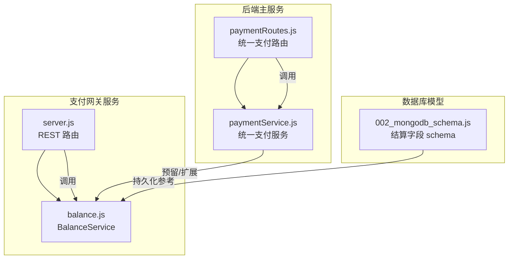
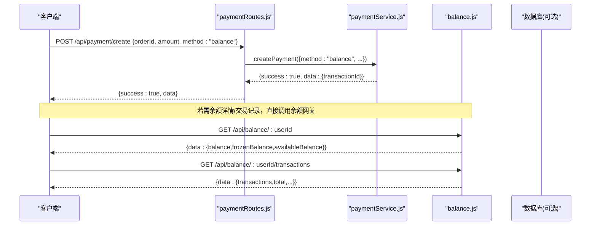
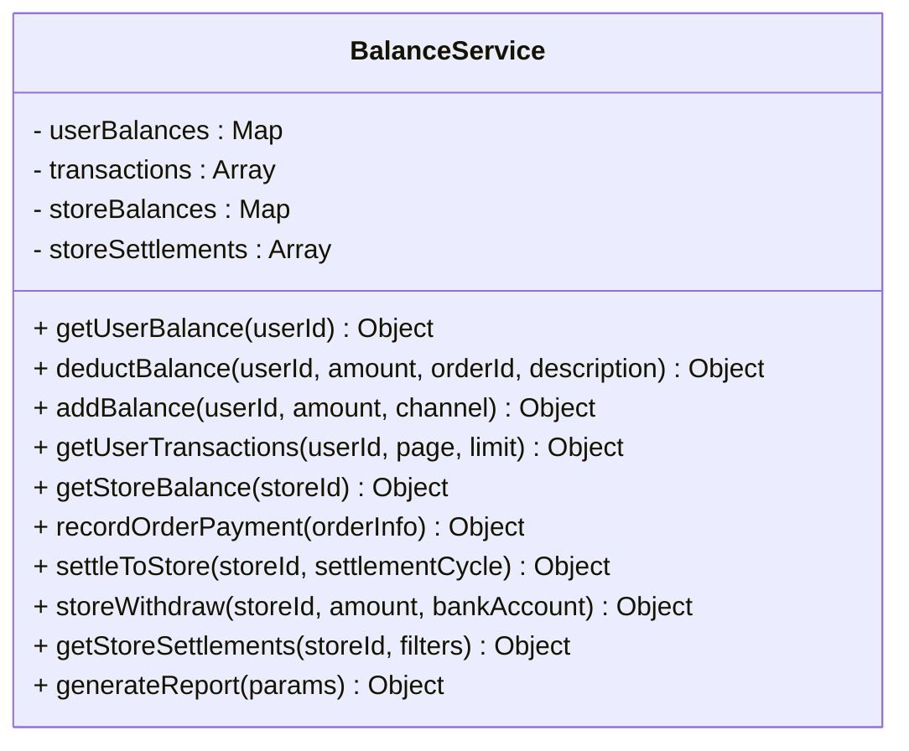
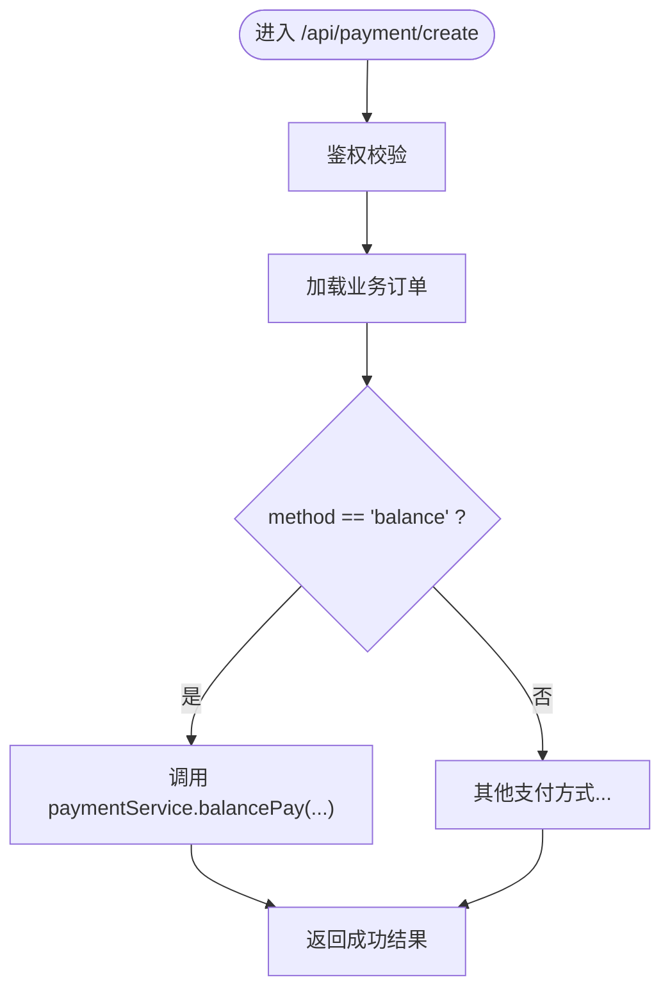
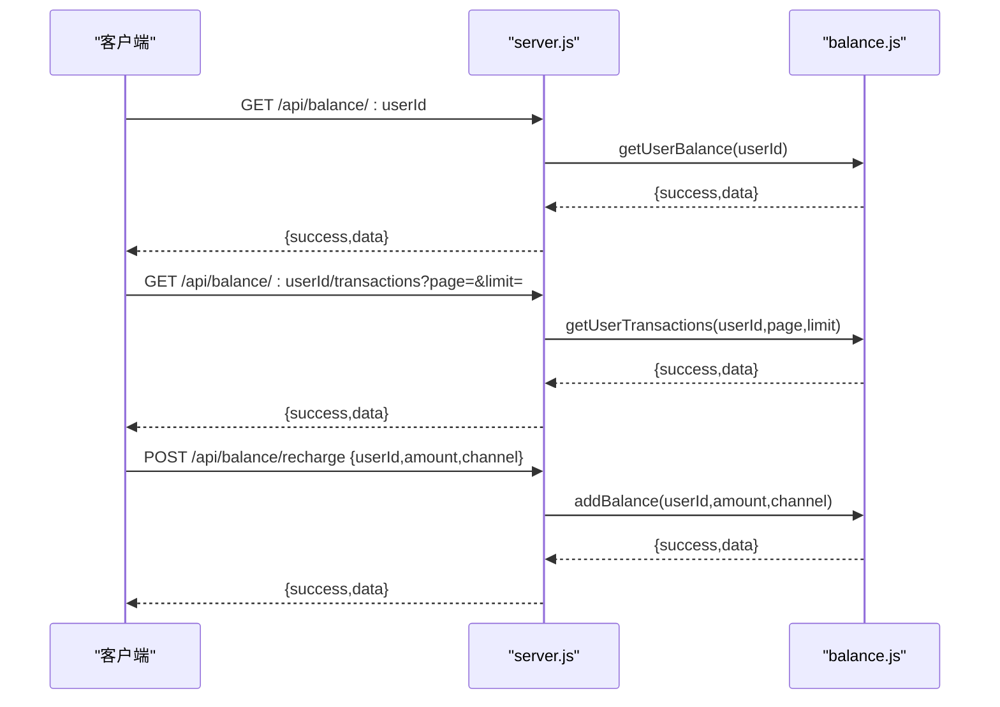
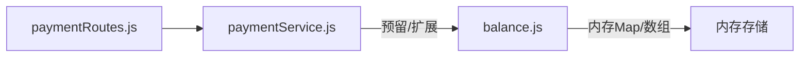

# 余额支付接口

<cite>
**本文引用的文件**   
- [api/payment-server/balance.js](file://api/payment-server/balance.js)
- [api/payment-server/server.js](file://api/payment-server/server.js)
- [backend/modules/common/routes/paymentRoutes.js](file://backend/modules/common/routes/paymentRoutes.js)
- [backend/modules/common/services/paymentService.js](file://backend/modules/common/services/paymentService.js)
- [backend/migrations/002_mongodb_schema.js](file://backend/migrations/002_mongodb_schema.js)
- [PROJECT_COMPLETE.md](file://PROJECT_COMPLETE.md)
</cite>

## 目录
1. [简介](#简介)
2. [项目结构](#项目结构)
3. [核心组件](#核心组件)
4. [架构总览](#架构总览)
5. [详细组件分析](#详细组件分析)
6. [依赖关系分析](#依赖关系分析)
7. [性能与一致性](#性能与一致性)
8. [故障排查指南](#故障排查指南)
9. [结论](#结论)
10. [附录：API 定义](#附录api-定义)

## 简介
本文件为“账户余额支付”相关接口的权威文档，覆盖以下能力：
- 余额查询、余额扣减（消费）、充值
- 交易记录查询（充值与消费明细）
- 冻结与解冻机制（用于预授权与待确认订单场景）
- 原子性与并发控制说明
- 完整业务流程与异常处理方案

## 项目结构
与余额支付相关的代码主要分布在两个位置：
- 独立支付网关服务（测试/演示用）：提供 REST 接口与内存数据模型
- 后端统一支付路由与服务：对外暴露统一支付入口，内部按支付方式分发

图示来源
- [api/payment-server/server.js:460-520](file://api/payment-server/server.js#L460-L520)
- [api/payment-server/balance.js:1-120](file://api/payment-server/balance.js#L1-L120)
- [backend/modules/common/routes/paymentRoutes.js:1-97](file://backend/modules/common/routes/paymentRoutes.js#L1-L97)
- [backend/modules/common/services/paymentService.js:1-91](file://backend/modules/common/services/paymentService.js#L1-L91)
- [backend/migrations/002_mongodb_schema.js:190-206](file://backend/migrations/002_mongodb_schema.js#L190-L206)

章节来源
- [PROJECT_COMPLETE.md:147-177](file://PROJECT_COMPLETE.md#L147-L177)

## 核心组件
- BalanceService：用户余额、门店结算、交易流水的内存实现（含冻结字段）
- paymentRoutes：统一支付路由，支持 balance 方式创建支付订单
- paymentService：统一支付服务，按支付方式分派到具体实现（当前余额支付为占位实现）
- server.js（支付网关）：对外暴露 /api/balance/* 等余额相关 REST 接口

章节来源
- [api/payment-server/balance.js:1-120](file://api/payment-server/balance.js#L1-L120)
- [api/payment-server/server.js:460-520](file://api/payment-server/server.js#L460-L520)
- [backend/modules/common/routes/paymentRoutes.js:1-97](file://backend/modules/common/routes/paymentRoutes.js#L1-L97)
- [backend/modules/common/services/paymentService.js:1-91](file://backend/modules/common/services/paymentService.js#L1-L91)

## 架构总览
从客户端到余额支付的端到端流程如下：

图示来源
- [backend/modules/common/routes/paymentRoutes.js:13-97](file://backend/modules/common/routes/paymentRoutes.js#L13-L97)
- [backend/modules/common/services/paymentService.js:24-91](file://backend/modules/common/services/paymentService.js#L24-L91)
- [api/payment-server/server.js:460-520](file://api/payment-server/server.js#L460-L520)
- [api/payment-server/balance.js:57-139](file://api/payment-server/balance.js#L57-L139)

## 详细组件分析

### 组件A：余额服务 BalanceService
职责
- 用户余额读写（含可用余额计算）
- 余额充值与消费扣减
- 交易流水记录与分页查询
- 门店结算与提现（含冻结逻辑）

关键数据结构（内存 Map/数组）
- 用户余额对象：包含 userId、balance、frozenBalance、totalRecharge、totalConsume、时间戳等
- 交易记录：id、userId、orderId、type、amount、balanceBefore、balanceAfter、description、paymentMethod、status、createdAt
- 门店余额对象：包含 storeId、availableBalance、frozenBalance、pendingSettlement、totalAmount、totalWithdraw 等

图示来源
- [api/payment-server/balance.js:8-18](file://api/payment-server/balance.js#L8-L18)
- [api/payment-server/balance.js:57-139](file://api/payment-server/balance.js#L57-L139)
- [api/payment-server/balance.js:147-191](file://api/payment-server/balance.js#L147-L191)
- [api/payment-server/balance.js:199-218](file://api/payment-server/balance.js#L199-L218)
- [api/payment-server/balance.js:224-238](file://api/payment-server/balance.js#L224-L238)
- [api/payment-server/balance.js:244-283](file://api/payment-server/balance.js#L244-L283)
- [api/payment-server/balance.js:290-337](file://api/payment-server/balance.js#L290-L337)
- [api/payment-server/balance.js:345-409](file://api/payment-server/balance.js#L345-L409)
- [api/payment-server/balance.js:416-453](file://api/payment-server/balance.js#L416-L453)
- [api/payment-server/balance.js:459-520](file://api/payment-server/balance.js#L459-L520)

章节来源
- [api/payment-server/balance.js:1-524](file://api/payment-server/balance.js#L1-L524)

### 组件B：统一支付路由与支付服务
- paymentRoutes：统一入口 /api/payment/create，支持 method=balance 时走余额支付路径
- paymentService：统一支付服务，当前余额支付为占位实现；可扩展对接真实余额扣减逻辑

图示来源
- [backend/modules/common/routes/paymentRoutes.js:13-97](file://backend/modules/common/routes/paymentRoutes.js#L13-L97)
- [backend/modules/common/services/paymentService.js:24-91](file://backend/modules/common/services/paymentService.js#L24-L91)

章节来源
- [backend/modules/common/routes/paymentRoutes.js:1-215](file://backend/modules/common/routes/paymentRoutes.js#L1-215)
- [backend/modules/common/services/paymentService.js:1-185](file://backend/modules/common/services/paymentService.js#L1-L185)

### 组件C：余额网关 REST 接口
- GET /api/balance/:userId：获取用户余额（含 frozenBalance、availableBalance）
- GET /api/balance/:userId/transactions：分页查询交易记录（充值/消费）
- POST /api/balance/recharge：余额充值（模拟流程）

图示来源
- [api/payment-server/server.js:460-520](file://api/payment-server/server.js#L460-L520)
- [api/payment-server/balance.js:57-139](file://api/payment-server/balance.js#L57-L139)
- [api/payment-server/balance.js:147-191](file://api/payment-server/balance.js#L147-L191)
- [api/payment-server/balance.js:199-218](file://api/payment-server/balance.js#L199-L218)

章节来源
- [api/payment-server/server.js:460-520](file://api/payment-server/server.js#L460-L520)

## 依赖关系分析
- paymentRoutes 依赖 paymentService
- paymentService 当前对 balance 支付为占位实现，可替换为调用 BalanceService 或持久化余额服务
- BalanceService 使用内存存储，适合测试/演示；生产应迁移至数据库并引入事务与锁

图示来源
- [backend/modules/common/routes/paymentRoutes.js:1-97](file://backend/modules/common/routes/paymentRoutes.js#L1-L97)
- [backend/modules/common/services/paymentService.js:1-91](file://backend/modules/common/services/paymentService.js#L1-L91)
- [api/payment-server/balance.js:1-18](file://api/payment-server/balance.js#L1-L18)

章节来源
- [backend/modules/common/routes/paymentRoutes.js:1-215](file://backend/modules/common/routes/paymentRoutes.js#L1-215)
- [backend/modules/common/services/paymentService.js:1-185](file://backend/modules/common/services/paymentService.js#L1-L185)
- [api/payment-server/balance.js:1-524](file://api/payment-server/balance.js#L1-L524)

## 性能与一致性
- 原子性保证
  - 当前 BalanceService 在单进程内通过顺序执行更新与写入交易记录，避免中间态不一致。但在多实例部署下，内存状态不共享，无法跨进程保证原子性。
  - 建议：将余额与交易落库，使用数据库事务包裹“扣减余额+写入交易记录”，确保要么全部成功，要么全部回滚。
- 并发控制
  - 当前无显式锁，存在高并发下重复扣减风险。建议：
    - 数据库层：基于用户ID加行级锁（如 SELECT ... FOR UPDATE）或乐观锁（版本号字段），防止超扣。
    - 应用层：对同一用户的写操作串行化（队列/分布式锁）。
- 幂等性
  - 交易记录已包含唯一 id 与关联 orderId，建议在入库前做幂等键校验，避免重复入账/扣账。
- 资金安全
  - 所有金额变更必须伴随不可篡改的交易流水，且保留 balanceBefore/balanceAfter 快照，便于审计与对账。
- 冻结与解冻
  - 冻结字段 frozenBalance 已存在于用户与门店余额结构中，可用于预授权/待确认订单。
  - 建议：冻结/解冻也应在事务中完成，并生成对应类型的交易记录（freeze/unfreeze）。

章节来源
- [api/payment-server/balance.js:57-139](file://api/payment-server/balance.js#L57-L139)
- [api/payment-server/balance.js:147-191](file://api/payment-server/balance.js#L147-L191)
- [backend/migrations/002_mongodb_schema.js:190-206](file://backend/migrations/002_mongodb_schema.js#L190-L206)

## 故障排查指南
- 余额不足
  - 现象：扣减失败，返回错误码与剩余余额提示
  - 处理：引导用户充值或切换支付方式
- 参数缺失/非法
  - 现象：缺少必要参数或金额为非正数
  - 处理：前端校验并给出明确提示
- 交易记录未生成
  - 现象：余额变化但无流水
  - 处理：检查事务边界与日志，核对幂等键是否重复
- 并发超扣
  - 现象：短时间内多次请求导致余额为负
  - 处理：引入行级锁/分布式锁，并对用户维度串行化写操作
- 回调/通知丢失
  - 现象：外部支付成功但未触发后续流程
  - 处理：增加补偿任务与对账机制，定期拉取状态并补齐

章节来源
- [api/payment-server/server.js:489-506](file://api/payment-server/server.js#L489-L506)
- [api/payment-server/balance.js:91-139](file://api/payment-server/balance.js#L91-L139)

## 结论
当前仓库提供了完整的余额支付概念验证：
- 统一的支付路由与余额网关接口
- 余额查询、充值、消费扣减与交易记录
- 冻结字段与门店结算/提现流程
生产落地需补充：
- 持久化与事务、并发锁、幂等设计
- 预授权/待确认订单的冻结与解冻闭环
- 完善的监控、告警与对账体系

## 附录：API 定义

### 余额查询
- 方法：GET
- 路径：/api/balance/:userId
- 路径参数：
  - userId：字符串，必填
- 响应体：
  - success：布尔
  - data：
    - userId：字符串
    - balance：数字（总余额）
    - frozenBalance：数字（冻结余额）
    - availableBalance：数字（可用余额 = balance - frozenBalance）

章节来源
- [api/payment-server/server.js:466-469](file://api/payment-server/server.js#L466-L469)
- [api/payment-server/balance.js:57-82](file://api/payment-server/balance.js#L57-L82)

### 交易记录查询（充值/消费明细）
- 方法：GET
- 路径：/api/balance/:userId/transactions
- 查询参数：
  - page：整数，默认 1
  - limit：整数，默认 20
- 响应体：
  - success：布尔
  - data：
    - transactions：数组（元素包含 id、userId、orderId、type、amount、balanceBefore、balanceAfter、description、paymentMethod、status、createdAt 等）
    - total：总数
    - page：页码
    - limit：每页数量
    - totalPages：总页数

章节来源
- [api/payment-server/server.js:475-483](file://api/payment-server/server.js#L475-L483)
- [api/payment-server/balance.js:199-218](file://api/payment-server/balance.js#L199-L218)

### 余额充值
- 方法：POST
- 路径：/api/balance/recharge
- 请求体：
  - userId：字符串，必填
  - amount：数字，必填，>0
  - channel：字符串，可选，默认 wechat
- 响应体：
  - success：布尔
  - data：
    - transactionId：字符串
    - balance：数字（充值后余额）
    - amount：数字（本次充值金额）

章节来源
- [api/payment-server/server.js:489-506](file://api/payment-server/server.js#L489-L506)
- [api/payment-server/balance.js:147-191](file://api/payment-server/balance.js#L147-L191)

### 统一支付创建（余额支付）
- 方法：POST
- 路径：/api/payment/create
- 请求体：
  - orderId：字符串，必填
  - orderType：字符串，必填
  - amount：数字，必填
  - method：枚举，必填，支持 wechat_jsapi/wechat_app/wechat_h5/balance
  - openid：字符串，按需（微信 JSAPI 需要）
- 响应体：
  - success：布尔
  - data：当 method=balance 时返回 { transactionId } 等支付信息

章节来源
- [backend/modules/common/routes/paymentRoutes.js:13-97](file://backend/modules/common/routes/paymentRoutes.js#L13-L97)
- [backend/modules/common/services/paymentService.js:24-91](file://backend/modules/common/services/paymentService.js#L24-L91)

### 余额变动历史记录（业务侧）
- 交易记录已在余额网关提供分页查询接口，详见“交易记录查询”。
- 如需更丰富的筛选（按类型、时间范围），可在现有基础上扩展查询参数。

章节来源
- [api/payment-server/server.js:475-483](file://api/payment-server/server.js#L475-L483)
- [api/payment-server/balance.js:199-218](file://api/payment-server/balance.js#L199-L218)

### 冻结与解冻机制（预授权/待确认订单）
- 现状
  - 用户与门店余额结构均包含 frozenBalance 字段，可用于冻结/解冻
  - 门店提现流程已演示冻结可用余额并在完成后释放
- 建议流程
  - 预授权：冻结金额 → 生成 freeze 交易记录
  - 待确认：保持冻结
  - 确认支付：解冻并转为消费（consume）→ 生成 consume 交易记录
  - 取消预授权：解冻 → 生成 unfreeze 交易记录
- 注意
  - 冻结/解冻与交易记录需在事务中完成
  - 幂等键需包含 orderId 与操作类型，避免重复冻结/解冻

章节来源
- [api/payment-server/balance.js:24-51](file://api/payment-server/balance.js#L24-L51)
- [api/payment-server/balance.js:345-409](file://api/payment-server/balance.js#L345-L409)
- [backend/migrations/002_mongodb_schema.js:190-206](file://backend/migrations/002_mongodb_schema.js#L190-L206)