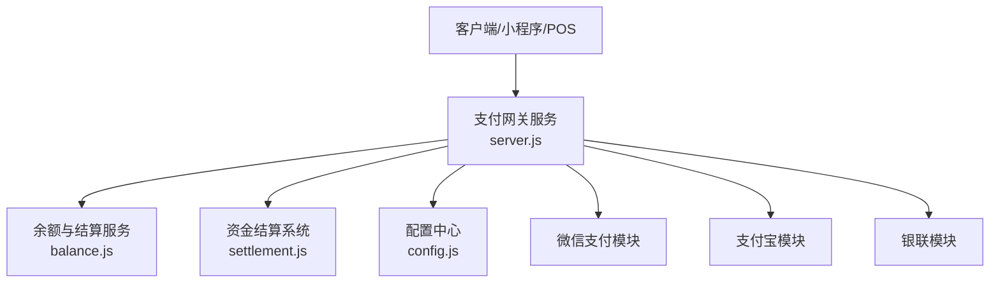
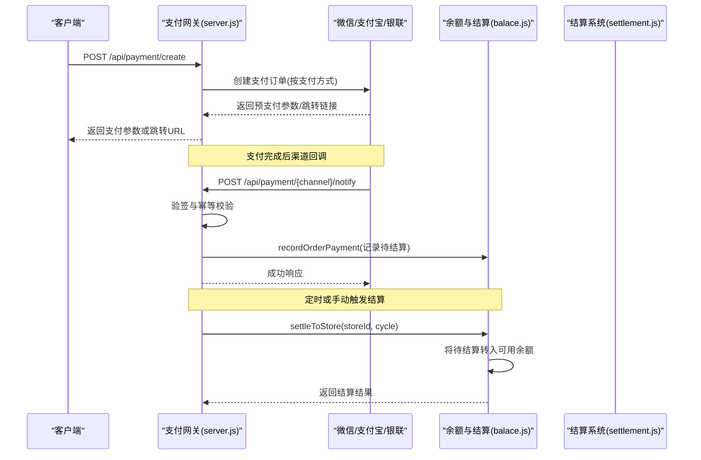
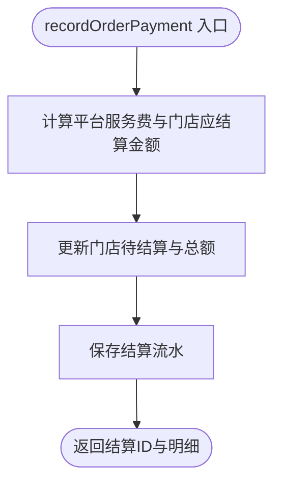
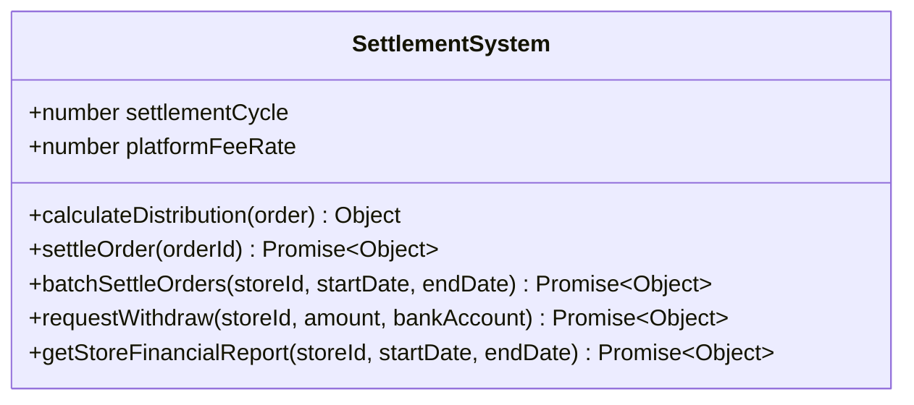
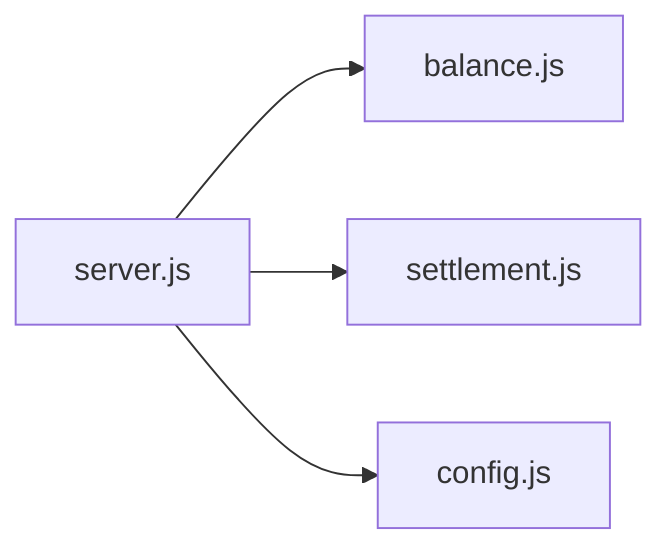
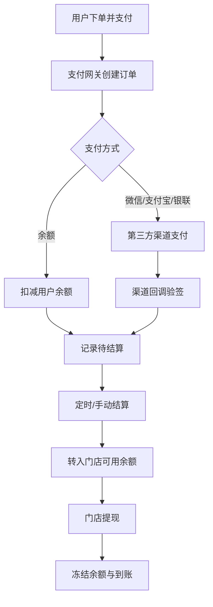

# 分账结算接口

<cite>
**本文引用的文件**   
- [server.js](file://api/payment-server/server.js)
- [balance.js](file://api/payment-server/balance.js)
- [settlement.js](file://api/payment-server/settlement.js)
- [config.js](file://api/payment-server/config.js)
- [README.md](file://api/payment-server/README.md)
</cite>

## 目录
1. [简介](#简介)
2. [项目结构](#项目结构)
3. [核心组件](#核心组件)
4. [架构总览](#架构总览)
5. [详细组件分析](#详细组件分析)
6. [依赖关系分析](#依赖关系分析)
7. [性能与扩展性](#性能与扩展性)
8. [安全机制](#安全机制)
9. [故障排查指南](#故障排查指南)
10. [结论](#结论)
11. [附录：API 清单与示例](#附录api-清单与示例)

## 简介
本文件面向“分账结算系统”的对外 API 文档，覆盖平台抽成计算、门店收益分配、服务商佣金结算（预留扩展点）、分账规则配置、分账执行、结算对账（日结/周结/月结）、分账状态查询与记录管理、报表生成以及安全机制与错误处理。当前实现以支付网关服务为核心，提供统一支付入口、回调落库、订单分账计算、待结算池、T+N 结算周期、门店提现与财务报表等能力。

## 项目结构
支付网关服务位于 api/payment-server，关键文件职责如下：
- server.js：Express 主服务，统一支付入口、各渠道回调、余额与结算相关路由
- balance.js：账户余额与结算服务（用户余额、门店结算、提现、报表）
- settlement.js：资金结算系统（分账计算、批量结算、提现、财务报告）
- config.js：支付与平台配置（费率、结算周期、回调地址等）
- README.md：快速开始、结算流程、接口说明与测试指引

图表来源
- [server.js:1-624](file://api/payment-server/server.js#L1-L624)
- [balance.js:1-524](file://api/payment-server/balance.js#L1-L524)
- [settlement.js:1-389](file://api/payment-server/settlement.js#L1-L389)
- [config.js:1-80](file://api/payment-server/config.js#L1-L80)

章节来源
- [server.js:1-624](file://api/payment-server/server.js#L1-L624)
- [balance.js:1-524](file://api/payment-server/balance.js#L1-L524)
- [settlement.js:1-389](file://api/payment-server/settlement.js#L1-L389)
- [config.js:1-80](file://api/payment-server/config.js#L1-L80)
- [README.md:1-481](file://api/payment-server/README.md#L1-L481)

## 核心组件
- 统一支付入口与回调：负责创建支付订单、查询/关闭订单、接收并验签各渠道回调，成功后触发分账记账
- 余额与结算服务：维护用户余额、门店待结算与可用余额、提现申请与处理、结算记录与报表
- 资金结算系统：封装分账计算、批量结算、提现冻结与到账、财务报告汇总
- 配置中心：集中管理支付渠道开关、回调地址、平台服务费比例、结算周期等

章节来源
- [server.js:36-458](file://api/payment-server/server.js#L36-L458)
- [balance.js:240-524](file://api/payment-server/balance.js#L240-L524)
- [settlement.js:6-389](file://api/payment-server/settlement.js#L6-L389)
- [config.js:64-80](file://api/payment-server/config.js#L64-L80)

## 架构总览
支付到结算的关键时序如下：

图表来源
- [server.js:42-174](file://api/payment-server/server.js#L42-L174)
- [server.js:312-451](file://api/payment-server/server.js#L312-L451)
- [balance.js:244-337](file://api/payment-server/balance.js#L244-L337)

## 详细组件分析

### 统一支付与回调（server.js）
- 统一支付入口
  - 路径：POST /api/payment/create
  - 功能：根据 paymentMethod 路由至微信/支付宝/银联/余额；余额支付直接扣减用户余额
- 支付状态查询/关闭
  - GET /api/payment/query/:orderId
  - POST /api/payment/close/:orderId
- 渠道回调
  - 微信：POST /api/payment/wechat/notify
  - 支付宝：POST /api/payment/alipay/notify
  - 银联：POST /api/payment/unionpay/notify
  - 回调中完成签名验证后，调用余额服务记录待结算

章节来源
- [server.js:42-174](file://api/payment-server/server.js#L42-L174)
- [server.js:180-304](file://api/payment-server/server.js#L180-L304)
- [server.js:312-451](file://api/payment-server/server.js#L312-L451)

### 余额与结算服务（balance.js）
- 用户余额
  - GET /api/balance/:userId
  - GET /api/balance/:userId/transactions
  - POST /api/balance/recharge
- 门店结算
  - GET /api/settlement/store/:storeId
  - GET /api/settlement/store/:storeId/records
  - POST /api/settlement/store/:storeId/settle
  - POST /api/settlement/store/:storeId/withdraw
  - POST /api/settlement/report
- 核心逻辑
  - recordOrderPayment：订单完成后计算平台服务费与门店应结算金额，写入待结算
  - settleToStore：将符合条件的待结算转入门店可用余额
  - storeWithdraw：冻结可用余额，异步模拟提现处理
  - generateReport：按日期聚合统计，支持按门店与时间范围筛选

图表来源
- [balance.js:244-283](file://api/payment-server/balance.js#L244-L283)

章节来源
- [balance.js:57-218](file://api/payment-server/balance.js#L57-L218)
- [balance.js:244-337](file://api/payment-server/balance.js#L244-L337)
- [balance.js:345-409](file://api/payment-server/balance.js#L345-L409)
- [balance.js:416-520](file://api/payment-server/balance.js#L416-L520)

### 资金结算系统（settlement.js）
- 分账计算：calculateDistribution（默认按固定比例抽取平台服务费）
- 单笔结算：settleOrder（校验未结算、计算分账、更新订单与门店余额）
- 批量结算：batchSettleOrders（按门店与时间范围批量结算）
- 提现：requestWithdraw（限额校验、冻结余额、预计到账）
- 财务报告：getStoreFinancialReport（汇总结算与提现，输出可下载数据）

图表来源
- [settlement.js:6-293](file://api/payment-server/settlement.js#L6-L293)

章节来源
- [settlement.js:28-92](file://api/payment-server/settlement.js#L28-L92)
- [settlement.js:101-174](file://api/payment-server/settlement.js#L101-L174)
- [settlement.js:183-235](file://api/payment-server/settlement.js#L183-L235)
- [settlement.js:244-293](file://api/payment-server/settlement.js#L244-L293)

### 配置项（config.js）
- 平台服务费比例：platform.serviceFeeRate
- 结算周期（天）：platform.settlementCycle
- 最低提现金额：platform.minWithdrawAmount
- 各渠道回调地址与证书路径

章节来源
- [config.js:64-80](file://api/payment-server/config.js#L64-L80)

## 依赖关系分析
- server.js 依赖 balance.js 与 settlement.js 提供的业务方法
- balance.js 内部维护内存数据结构（Map/数组），用于演示与联调
- settlement.js 提供独立结算能力，可与 balance.js 协同使用
- config.js 为全局配置源，影响回调地址、费率与周期

图表来源
- [server.js:1-35](file://api/payment-server/server.js#L1-L35)
- [balance.js:1-18](file://api/payment-server/balance.js#L1-L18)
- [settlement.js:1-21](file://api/payment-server/settlement.js#L1-L21)
- [config.js:1-10](file://api/payment-server/config.js#L1-L10)

章节来源
- [server.js:1-35](file://api/payment-server/server.js#L1-L35)
- [balance.js:1-18](file://api/payment-server/balance.js#L1-L18)
- [settlement.js:1-21](file://api/payment-server/settlement.js#L1-L21)
- [config.js:1-10](file://api/payment-server/config.js#L1-L10)

## 性能与扩展性
- 当前使用内存存储，适合开发与联调；生产需替换为持久化数据库与缓存
- 建议引入分布式锁与幂等键，防止重复结算与并发冲突
- 批量结算建议分页拉取与事务提交，避免长事务与内存膨胀
- 报表生成建议异步任务与流式输出，降低请求超时风险

[本节为通用建议，不直接分析具体文件]

## 安全机制
- 回调验签：各渠道回调均进行签名验证，失败直接拒绝
- 幂等控制：回调处理前需校验订单是否已处理，避免重复入账
- 权限控制：结算与提现接口建议增加鉴权中间件（如 RBAC/JWT）
- 审计日志：所有资金变动需记录操作人、IP、时间戳与前后快照
- 异常处理：统一错误码与重试策略，失败交易进入人工复核队列

章节来源
- [server.js:312-451](file://api/payment-server/server.js#L312-L451)
- [README.md:354-410](file://api/payment-server/README.md#L354-L410)

## 故障排查指南
- 回调失败
  - 检查回调 URL 公网可达性与 HTTPS 证书
  - 核对签名密钥与证书路径
- 结算异常
  - 确认订单未重复结算
  - 检查门店可用余额与冻结余额一致性
- 提现失败
  - 校验最低/最高提现额度
  - 查看银行通道返回码与重试次数

章节来源
- [README.md:354-410](file://api/payment-server/README.md#L354-L410)

## 结论
当前支付网关已具备完整的支付接入、回调落库、分账计算、待结算池、T+N 结算与提现能力，并提供基础报表。后续可按需扩展多模式分账规则（比例/固定金额/阶梯）、服务商佣金结算、自动化对账与风控拦截，以满足更复杂的商业场景。

[本节为总结性内容，不直接分析具体文件]

## 附录：API 清单与示例

### 统一支付
- POST /api/payment/create
  - 用途：创建支付订单（支持 wechat/alipay/unionpay/balance）
  - 关键字段：orderId、amount、subject、paymentMethod、userId/openid/returnUrl/clientIp
- GET /api/payment/query/:orderId
  - 用途：查询支付状态
- POST /api/payment/close/:orderId
  - 用途：关闭未支付订单

章节来源
- [server.js:42-174](file://api/payment-server/server.js#L42-L174)
- [server.js:180-304](file://api/payment-server/server.js#L180-L304)

### 渠道回调
- POST /api/payment/wechat/notify
- POST /api/payment/alipay/notify
- POST /api/payment/unionpay/notify
  - 用途：支付成功后回调，验签通过后记录待结算

章节来源
- [server.js:312-451](file://api/payment-server/server.js#L312-L451)

### 账户余额
- GET /api/balance/:userId
- GET /api/balance/:userId/transactions
- POST /api/balance/recharge

章节来源
- [server.js:466-506](file://api/payment-server/server.js#L466-L506)
- [balance.js:57-218](file://api/payment-server/balance.js#L57-L218)

### 门店结算
- GET /api/settlement/store/:storeId
  - 用途：获取门店账户信息（可用/冻结/待结算等）
- GET /api/settlement/store/:storeId/records
  - 用途：获取结算记录（支持 status、startDate、endDate 过滤）
- POST /api/settlement/store/:storeId/settle
  - 用途：发起结算（将待结算转入可用余额）
  - 请求体：{ settlementCycle?: number }
- POST /api/settlement/store/:storeId/withdraw
  - 用途：门店提现
  - 请求体：{ amount: number, bankAccount: string }
- POST /api/settlement/report
  - 用途：生成财务报表
  - 请求体：{ startDate?: string, endDate?: string, storeId?: string, type?: string }

章节来源
- [server.js:514-578](file://api/payment-server/server.js#L514-L578)
- [balance.js:244-520](file://api/payment-server/balance.js#L244-L520)

### 分账规则配置（平台侧）
- 通过配置文件设置
  - 平台服务费比例：platform.serviceFeeRate
  - 结算周期（天）：platform.settlementCycle
  - 最低提现金额：platform.minWithdrawAmount
- 扩展建议
  - 新增分账模式（按比例/固定金额/阶梯）时，可在 balance.recordOrderPayment 与 settlement.calculateDistribution 中扩展策略选择器
  - 引入服务商佣金字段与结算对象，在分账结果中追加佣金项

章节来源
- [config.js:64-80](file://api/payment-server/config.js#L64-L80)
- [balance.js:244-283](file://api/payment-server/balance.js#L244-L283)
- [settlement.js:28-43](file://api/payment-server/settlement.js#L28-L43)

### 分账执行与自动结算
- 自动结算触发
  - 支付回调成功后，balance.recordOrderPayment 将订单计入待结算
  - 定时任务或后台作业调用 balance.settleToStore 完成 T+N 结算
- 手动结算
  - 调用 POST /api/settlement/store/:storeId/settle 立即结算

章节来源
- [server.js:335-343](file://api/payment-server/server.js#L335-L343)
- [balance.js:285-337](file://api/payment-server/balance.js#L285-L337)
- [server.js:537-544](file://api/payment-server/server.js#L537-L544)

### 分账状态查询与记录管理
- 门店结算记录：GET /api/settlement/store/:storeId/records
- 结算状态枚举（参考实现）：pending、processing、completed、failed

章节来源
- [server.js:523-531](file://api/payment-server/server.js#L523-L531)
- [settlement.js:14-20](file://api/payment-server/settlement.js#L14-L20)

### 分账报表生成
- POST /api/settlement/report
  - 支持按门店与时间范围聚合，输出日维度统计与汇总

章节来源
- [server.js:569-578](file://api/payment-server/server.js#L569-L578)
- [balance.js:459-520](file://api/payment-server/balance.js#L459-L520)

### 业务流程图（端到端）

[该图为概念流程图，不直接映射具体代码文件]

### 错误处理方案
- 常见错误
  - 余额不足：返回可用余额与所需金额
  - 订单不存在：返回提示并终止流程
  - 支付方式未启用：返回配置错误
- 处理建议
  - 统一错误码与消息
  - 幂等保护与重试
  - 异常告警与人工介入

章节来源
- [README.md:354-410](file://api/payment-server/README.md#L354-L410)