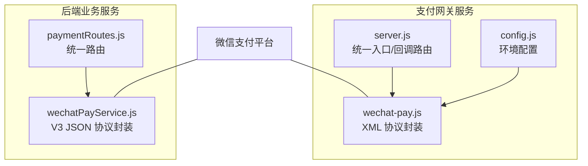
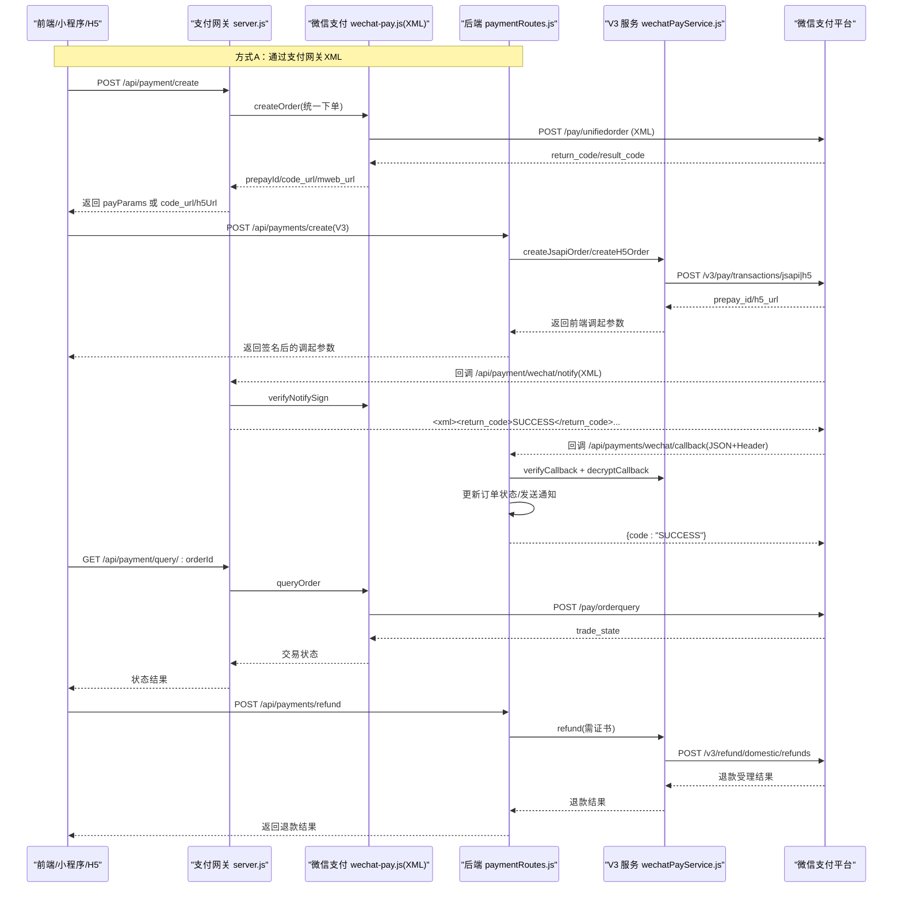
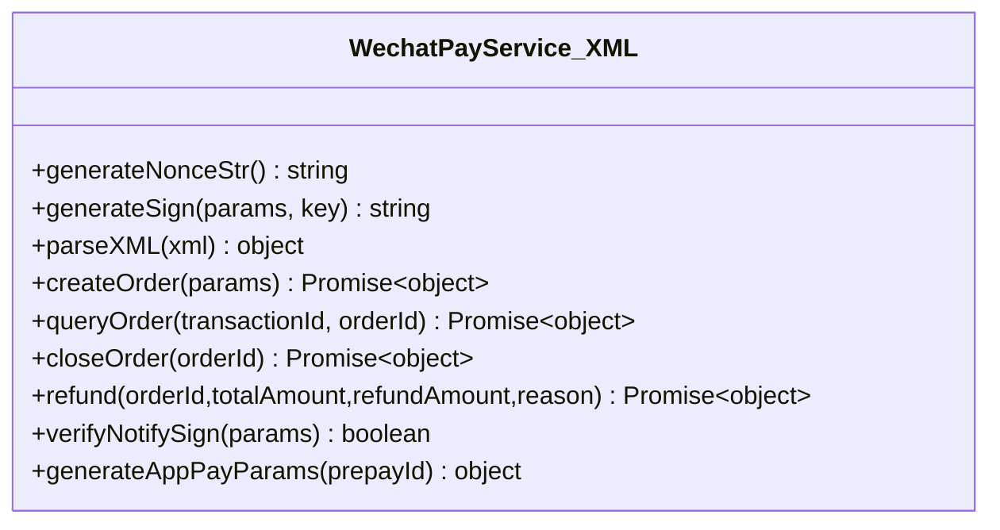
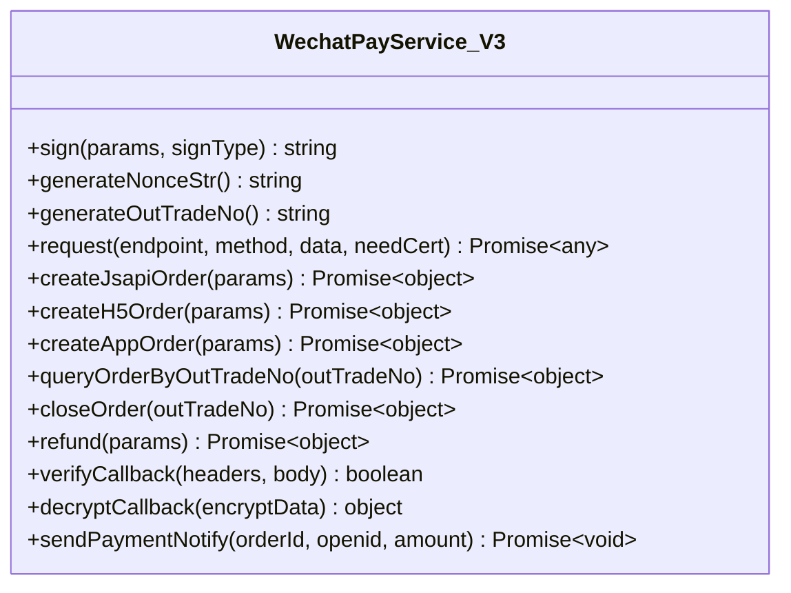
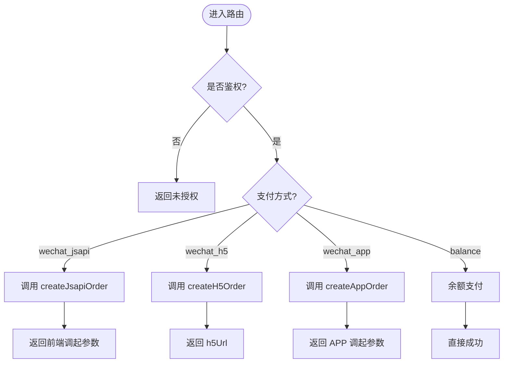
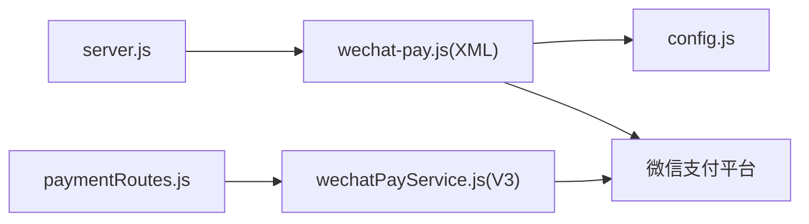

# 微信支付接口

<cite>
**本文引用的文件**   
- [api/payment-server/wechat-pay.js](file://api/payment-server/wechat-pay.js)
- [api/payment-server/config.js](file://api/payment-server/config.js)
- [api/payment-server/server.js](file://api/payment-server/server.js)
- [backend/modules/common/services/wechatPayService.js](file://backend/modules/common/services/wechatPayService.js)
- [backend/modules/common/routes/paymentRoutes.js](file://backend/modules/common/routes/paymentRoutes.js)
</cite>

## 目录
1. [简介](#简介)
2. [项目结构](#项目结构)
3. [核心组件](#核心组件)
4. [架构总览](#架构总览)
5. [详细组件分析](#详细组件分析)
6. [依赖关系分析](#依赖关系分析)
7. [性能与可靠性](#性能与可靠性)
8. [故障排查指南](#故障排查指南)
9. [结论](#结论)
10. [附录：API 规范与安全配置](#附录api-规范与安全配置)

## 简介
本文件面向开发者，提供微信支付在该项目中的完整 API 文档与实现说明。覆盖以下能力：
- 小程序支付（JSAPI）、H5 支付、扫码支付（NATIVE）的统一下单流程
- 支付结果查询与回调通知处理
- 退款申请接口
- 签名与验签机制、证书与密钥配置、防重放与幂等建议
- 错误码与异常处理方案
- 结合后端路由与网关服务的端到端调用序列图

## 项目结构
本项目包含两套微信支付实现：
- 独立支付网关服务（Express），用于演示与快速集成，使用 XML 协议对接旧版微信接口
- 后端业务服务（Express + 模块），基于微信支付 V3 JSON 协议，提供统一路由与回调处理

图表来源
- [api/payment-server/server.js:1-120](file://api/payment-server/server.js#L1-L120)
- [api/payment-server/wechat-pay.js:1-120](file://api/payment-server/wechat-pay.js#L1-L120)
- [api/payment-server/config.js:1-80](file://api/payment-server/config.js#L1-L80)
- [backend/modules/common/routes/paymentRoutes.js:1-120](file://backend/modules/common/routes/paymentRoutes.js#L1-L120)
- [backend/modules/common/services/wechatPayService.js:1-120](file://backend/modules/common/services/wechatPayService.js#L1-L120)

章节来源
- [api/payment-server/server.js:1-120](file://api/payment-server/server.js#L1-L120)
- [api/payment-server/wechat-pay.js:1-120](file://api/payment-server/wechat-pay.js#L1-L120)
- [api/payment-server/config.js:1-80](file://api/payment-server/config.js#L1-L80)
- [backend/modules/common/routes/paymentRoutes.js:1-120](file://backend/modules/common/routes/paymentRoutes.js#L1-L120)
- [backend/modules/common/services/wechatPayService.js:1-120](file://backend/modules/common/services/wechatPayService.js#L1-L120)

## 核心组件
- 支付网关服务（XML 协议）
  - 统一创建订单、查询、关闭、退款、回调验签与处理
  - 生成小程序调起支付参数（MD5 签名）
- 后端业务服务（V3 JSON 协议）
  - JSAPI/H5/App 下单、查询、关闭、退款
  - 回调签名验证与 AES-GCM 解密，更新订单状态并发送通知

章节来源
- [api/payment-server/wechat-pay.js:1-314](file://api/payment-server/wechat-pay.js#L1-L314)
- [api/payment-server/server.js:1-624](file://api/payment-server/server.js#L1-L624)
- [backend/modules/common/services/wechatPayService.js:1-396](file://backend/modules/common/services/wechatPayService.js#L1-L396)
- [backend/modules/common/routes/paymentRoutes.js:1-215](file://backend/modules/common/routes/paymentRoutes.js#L1-L215)

## 架构总览
下图展示从前端到后端再到微信平台的完整调用链路，涵盖统一下单、回调、查询与退款。

图表来源
- [api/payment-server/server.js:42-174](file://api/payment-server/server.js#L42-L174)
- [api/payment-server/server.js:312-350](file://api/payment-server/server.js#L312-L350)
- [api/payment-server/server.js:180-240](file://api/payment-server/server.js#L180-L240)
- [api/payment-server/wechat-pay.js:56-127](file://api/payment-server/wechat-pay.js#L56-L127)
- [api/payment-server/wechat-pay.js:132-184](file://api/payment-server/wechat-pay.js#L132-L184)
- [api/payment-server/wechat-pay.js:230-280](file://api/payment-server/wechat-pay.js#L230-L280)
- [backend/modules/common/routes/paymentRoutes.js:13-97](file://backend/modules/common/routes/paymentRoutes.js#L13-L97)
- [backend/modules/common/routes/paymentRoutes.js:121-171](file://backend/modules/common/routes/paymentRoutes.js#L121-L171)
- [backend/modules/common/routes/paymentRoutes.js:174-212](file://backend/modules/common/routes/paymentRoutes.js#L174-L212)
- [backend/modules/common/services/wechatPayService.js:101-164](file://backend/modules/common/services/wechatPayService.js#L101-L164)
- [backend/modules/common/services/wechatPayService.js:228-270](file://backend/modules/common/services/wechatPayService.js#L228-L270)
- [backend/modules/common/services/wechatPayService.js:313-334](file://backend/modules/common/services/wechatPayService.js#L313-L334)

## 详细组件分析

### 组件一：支付网关服务（XML 协议）
- 职责
  - 统一创建订单（JSAPI/NATIVE/MWEB）
  - 查询订单、关闭订单、申请退款
  - 回调签名校验与订单状态落库（内存 Map）
  - 生成小程序调起支付所需参数（MD5）
- 关键方法
  - 统一下单：createOrder
  - 查询订单：queryOrder
  - 关闭订单：closeOrder
  - 申请退款：refund
  - 回调验签：verifyNotifySign
  - 生成小程序参数：generateAppPayParams
- 数据流
  - 请求体为 XML；响应解析为对象后转换为标准返回结构
  - 金额单位“分”，时间戳与随机串参与签名

图表来源
- [api/payment-server/wechat-pay.js:10-311](file://api/payment-server/wechat-pay.js#L10-L311)

章节来源
- [api/payment-server/wechat-pay.js:10-311](file://api/payment-server/wechat-pay.js#L10-L311)
- [api/payment-server/server.js:42-174](file://api/payment-server/server.js#L42-L174)
- [api/payment-server/server.js:312-350](file://api/payment-server/server.js#L312-L350)
- [api/payment-server/server.js:180-240](file://api/payment-server/server.js#L180-L240)

### 组件二：后端业务服务（V3 JSON 协议）
- 职责
  - 提供统一路由：创建支付、查询、退款、回调处理
  - 封装 V3 下单（JSAPI/H5/App）、查询、关闭、退款
  - 回调签名验证（Header 验签）与资源解密（AES-GCM）
  - 更新订单状态与发送支付成功通知
- 关键方法
  - createJsapiOrder / createH5Order / createAppOrder
  - queryOrderByOutTradeNo / closeOrder
  - refund（需要商户证书）
  - verifyCallback / decryptCallback
- 数据流
  - 请求体为 JSON；金额单位“分”；V3 签名采用 RSA-SHA256 与 HMAC-SHA256 组合

图表来源
- [backend/modules/common/services/wechatPayService.js:21-396](file://backend/modules/common/services/wechatPayService.js#L21-L396)

章节来源
- [backend/modules/common/services/wechatPayService.js:21-396](file://backend/modules/common/services/wechatPayService.js#L21-L396)
- [backend/modules/common/routes/paymentRoutes.js:13-97](file://backend/modules/common/routes/paymentRoutes.js#L13-L97)
- [backend/modules/common/routes/paymentRoutes.js:121-171](file://backend/modules/common/routes/paymentRoutes.js#L121-L171)
- [backend/modules/common/routes/paymentRoutes.js:174-212](file://backend/modules/common/routes/paymentRoutes.js#L174-L212)

### 组件三：路由与控制器（paymentRoutes.js）
- 职责
  - 对外暴露统一接口：POST /api/payments/create、GET /api/payments/query/:orderId、POST /api/payments/refund
  - 处理微信支付回调：POST /api/payments/wechat/callback
  - 鉴权中间件 authMiddleware 保护敏感接口
- 关键流程
  - 根据 method 分发至 V3 服务对应下单方法
  - 回调中先验签再解密，成功后更新订单状态并发送通知

图表来源
- [backend/modules/common/routes/paymentRoutes.js:13-97](file://backend/modules/common/routes/paymentRoutes.js#L13-L97)

章节来源
- [backend/modules/common/routes/paymentRoutes.js:13-97](file://backend/modules/common/routes/paymentRoutes.js#L13-L97)

## 依赖关系分析
- 支付网关服务
  - 依赖 xml2js、axios、crypto、config
  - 通过 HTTP 调用微信旧版 XML 接口
- 后端业务服务
  - 依赖 crypto、https、fs、path
  - 通过原生 https 调用微信 V3 JSON 接口
- 路由层
  - 依赖认证中间件与业务服务

图表来源
- [api/payment-server/server.js:1-120](file://api/payment-server/server.js#L1-L120)
- [api/payment-server/wechat-pay.js:1-120](file://api/payment-server/wechat-pay.js#L1-L120)
- [api/payment-server/config.js:1-80](file://api/payment-server/config.js#L1-L80)
- [backend/modules/common/routes/paymentRoutes.js:1-120](file://backend/modules/common/routes/paymentRoutes.js#L1-L120)
- [backend/modules/common/services/wechatPayService.js:1-120](file://backend/modules/common/services/wechatPayService.js#L1-L120)

章节来源
- [api/payment-server/server.js:1-120](file://api/payment-server/server.js#L1-L120)
- [api/payment-server/wechat-pay.js:1-120](file://api/payment-server/wechat-pay.js#L1-L120)
- [api/payment-server/config.js:1-80](file://api/payment-server/config.js#L1-L80)
- [backend/modules/common/routes/paymentRoutes.js:1-120](file://backend/modules/common/routes/paymentRoutes.js#L1-L120)
- [backend/modules/common/services/wechatPayService.js:1-120](file://backend/modules/common/services/wechatPayService.js#L1-L120)

## 性能与可靠性
- 并发与超时
  - 网关与服务均使用异步 HTTP 请求，建议设置合理的超时与重试策略
- 幂等与去重
  - 统一下单前对 out_trade_no 做唯一性校验；回调处理需幂等（以 out_trade_no 为键）
- 证书与密钥
  - V3 退款需加载商户私钥证书；生产环境务必启用双向 TLS
- 日志与监控
  - 记录关键步骤日志（下单、回调、退款），便于问题定位

[本节为通用指导，不直接分析具体文件]

## 故障排查指南
- 统一下单失败
  - 检查 appId/mchId/apiKey 配置是否正确
  - 确认金额单位为“分”，且非负数
  - 查看返回的 err_code_des/msg 定位原因
- 回调验签失败
  - 确保使用正确的 API Key 与签名算法
  - 注意 V3 回调 Header 字段名与顺序
- 退款失败
  - 确认已上传并正确配置商户证书路径
  - 核对 transaction_id/out_refund_no 与金额一致性
- 查询无结果
  - 确认传入的是正确的 out_trade_no 或 transaction_id
  - 检查网络连通性与域名解析

章节来源
- [api/payment-server/wechat-pay.js:56-127](file://api/payment-server/wechat-pay.js#L56-L127)
- [api/payment-server/wechat-pay.js:132-184](file://api/payment-server/wechat-pay.js#L132-L184)
- [api/payment-server/wechat-pay.js:230-280](file://api/payment-server/wechat-pay.js#L230-L280)
- [backend/modules/common/services/wechatPayService.js:101-164](file://backend/modules/common/services/wechatPayService.js#L101-L164)
- [backend/modules/common/services/wechatPayService.js:313-334](file://backend/modules/common/services/wechatPayService.js#L313-L334)

## 结论
本项目同时提供了基于 XML 的旧版接口封装与基于 V3 的新版接口封装。推荐在生产环境优先采用 V3 协议，以获得更好的安全性与扩展性。通过统一路由与标准化返回结构，可快速接入小程序、H5 与 APP 支付场景，并具备完善的回调验签、退款与查询能力。

[本节为总结性内容，不直接分析具体文件]

## 附录：API 规范与安全配置

### 统一创建支付订单（后端 V3）
- 接口
  - POST /api/payments/create
- 请求头
  - Content-Type: application/json
  - Authorization: Bearer <token>（由 authMiddleware 校验）
- 请求体
  - orderId: string（商户订单号，必填）
  - amount: number（元，必填）
  - subject: string（商品描述，选填）
  - method: string（wechat_jsapi | wechat_h5 | wechat_app | balance，必填）
  - openid: string（JSAPI 必需）
  - notifyUrl: string（可选，默认使用配置）
- 响应体
  - success: boolean
  - data: object（含 prepayId/h5Url/APP 调起参数等）
  - message: string（错误信息）

章节来源
- [backend/modules/common/routes/paymentRoutes.js:13-97](file://backend/modules/common/routes/paymentRoutes.js#L13-L97)
- [backend/modules/common/services/wechatPayService.js:101-164](file://backend/modules/common/services/wechatPayService.js#L101-L164)
- [backend/modules/common/services/wechatPayService.js:228-270](file://backend/modules/common/services/wechatPayService.js#L228-L270)

### 查询支付状态（后端 V3）
- 接口
  - GET /api/payments/query/:orderId
- 路径参数
  - orderId: string（商户订单号）
- 响应体
  - success: boolean
  - data: object（包含交易状态、金额、完成时间等）

章节来源
- [backend/modules/common/routes/paymentRoutes.js:100-118](file://backend/modules/common/routes/paymentRoutes.js#L100-L118)
- [backend/modules/common/services/wechatPayService.js:287-294](file://backend/modules/common/services/wechatPayService.js#L287-L294)

### 微信支付回调（后端 V3）
- 接口
  - POST /api/payments/wechat/callback
- 请求头
  - wechatpay-signature: string
  - wechatpay-timestamp: string
  - wechatpay-nonce: string
  - wechatpay-serial-number: string
- 请求体
  - resource: object（含 ciphertext、nonce、associated_data、algorithm 等）
- 处理流程
  - 验签：verifyCallback
  - 解密：decryptCallback
  - 更新订单状态并发送通知
- 响应体
  - { code: "SUCCESS", message: "成功" }

章节来源
- [backend/modules/common/routes/paymentRoutes.js:121-171](file://backend/modules/common/routes/paymentRoutes.js#L121-L171)
- [backend/modules/common/services/wechatPayService.js:339-375](file://backend/modules/common/services/wechatPayService.js#L339-L375)

### 申请退款（后端 V3）
- 接口
  - POST /api/payments/refund
- 请求体
  - orderId: string（商户订单号）
  - transactionId: string（微信支付交易号）
  - amount: number（退款金额，元）
  - reason: string（退款原因）
- 响应体
  - success: boolean
  - data: object（包含退款单号、金额等）

章节来源
- [backend/modules/common/routes/paymentRoutes.js:174-212](file://backend/modules/common/routes/paymentRoutes.js#L174-L212)
- [backend/modules/common/services/wechatPayService.js:313-334](file://backend/modules/common/services/wechatPayService.js#L313-L334)

### 支付网关服务（XML 协议）参考
- 统一创建订单
  - POST /api/payment/create
  - 支持 paymentMethod=wechat/alipay/unionpay/balance
  - 返回 payParams（小程序）或 code_url/h5Url（扫码/H5）
- 查询订单
  - GET /api/payment/query/:orderId
- 关闭订单
  - POST /api/payment/close/:orderId
- 微信支付回调
  - POST /api/payment/wechat/notify（XML）
  - 验签后更新本地订单状态并返回 SUCCESS

章节来源
- [api/payment-server/server.js:42-174](file://api/payment-server/server.js#L42-L174)
- [api/payment-server/server.js:180-240](file://api/payment-server/server.js#L180-L240)
- [api/payment-server/server.js:312-350](file://api/payment-server/server.js#L312-L350)
- [api/payment-server/wechat-pay.js:56-127](file://api/payment-server/wechat-pay.js#L56-L127)
- [api/payment-server/wechat-pay.js:132-184](file://api/payment-server/wechat-pay.js#L132-L184)
- [api/payment-server/wechat-pay.js:230-280](file://api/payment-server/wechat-pay.js#L230-L280)

### 安全机制与配置要点
- 签名算法
  - XML 协议：MD5 或 HMAC-SHA256（按参数排序拼接后签名）
  - V3 协议：请求签名使用 RSA-SHA256；回调验签使用 HMAC-SHA256
- 证书与密钥
  - V3 退款需加载商户私钥证书（certPath）
  - 生产环境开启双向 TLS，严格保管 API Key 与私钥
- 防重放攻击
  - 使用 nonce_str/nonceStr 与 timestamp 配合
  - 服务端对回调进行幂等处理（以 out_trade_no 为键）
- 金额与时区
  - 金额统一以“分”为单位
  - 时间格式遵循 ISO8601 或平台要求

章节来源
- [api/payment-server/wechat-pay.js:28-43](file://api/payment-server/wechat-pay.js#L28-L43)
- [api/payment-server/wechat-pay.js:285-290](file://api/payment-server/wechat-pay.js#L285-L290)
- [backend/modules/common/services/wechatPayService.js:30-38](file://backend/modules/common/services/wechatPayService.js#L30-L38)
- [backend/modules/common/services/wechatPayService.js:339-375](file://backend/modules/common/services/wechatPayService.js#L339-L375)
- [api/payment-server/config.js:12-33](file://api/payment-server/config.js#L12-L33)
- [backend/modules/common/services/wechatPayService.js:11-19](file://backend/modules/common/services/wechatPayService.js#L11-L19)