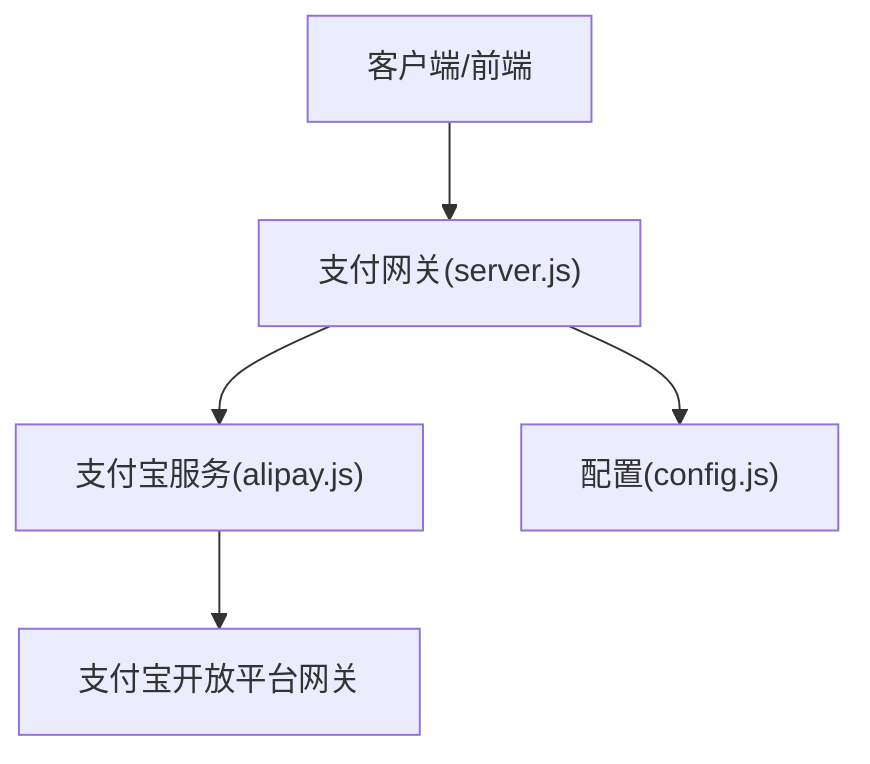
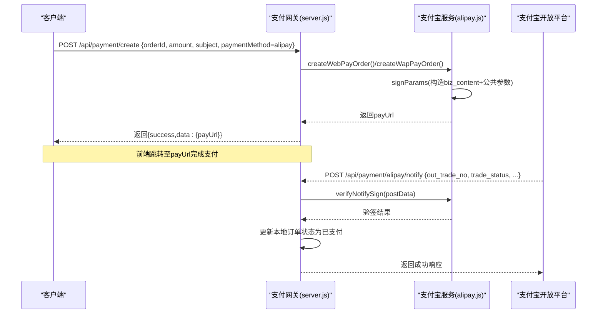
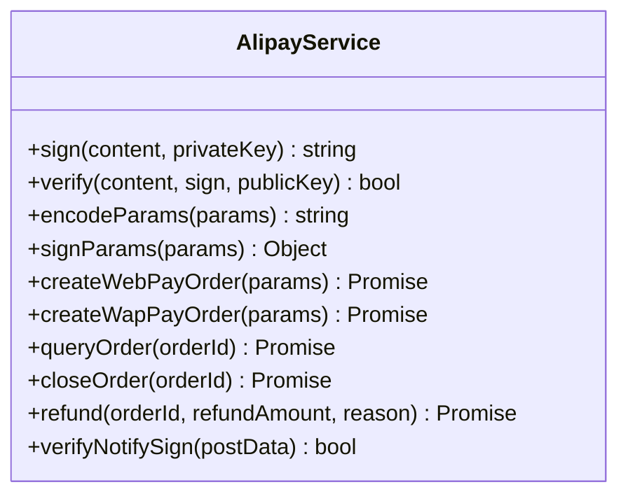
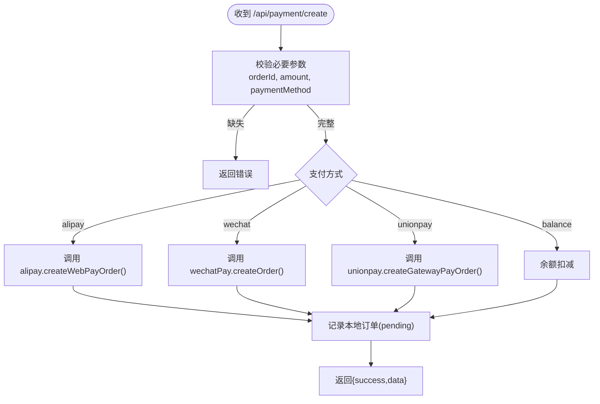
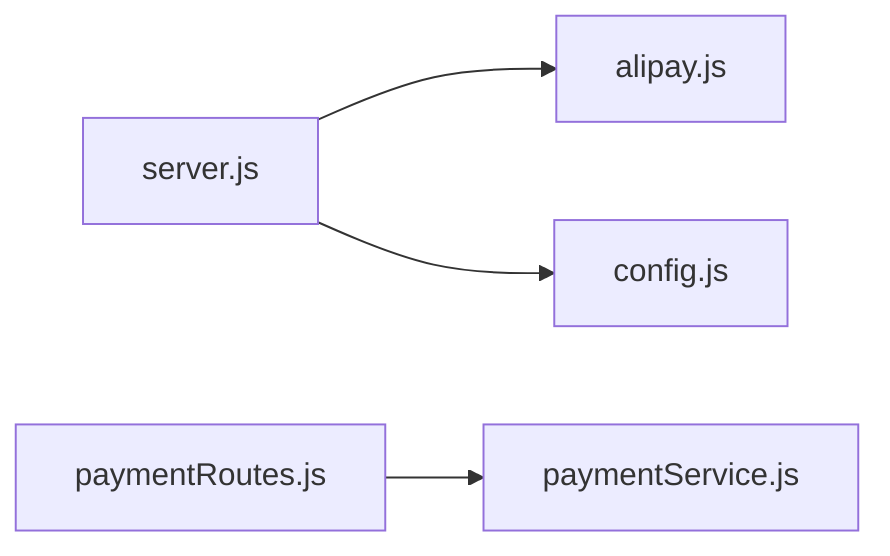

# 支付宝支付接口

<cite>
**本文引用的文件列表**
- [alipay.js](file://api/payment-server/alipay.js)
- [config.js](file://api/payment-server/config.js)
- [server.js](file://api/payment-server/server.js)
- [README.md](file://api/payment-server/README.md)
- [payment-api.js](file://api/payment-api.js)
- [paymentService.js](file://backend/modules/common/services/paymentService.js)
- [paymentRoutes.js](file://backend/modules/common/routes/paymentRoutes.js)
</cite>

## 目录
1. [简介](#简介)
2. [项目结构](#项目结构)
3. [核心组件](#核心组件)
4. [架构总览](#架构总览)
5. [详细组件分析](#详细组件分析)
6. [依赖关系分析](#依赖关系分析)
7. [性能与可靠性建议](#性能与可靠性建议)
8. [故障排查指南](#故障排查指南)
9. [结论](#结论)
10. [附录：集成示例与常见问题](#附录集成示例与常见问题)

## 简介
本文件面向开发者，提供本项目中支付宝支付相关接口的完整说明，覆盖网页支付、手机网站支付、统一收单下单、订单查询、退款申请、异步通知处理与安全配置等。文档基于仓库内实际实现进行梳理，帮助快速完成对接与排障。

## 项目结构
支付网关服务位于 api/payment-server 目录，其中：
- server.js：统一入口，暴露创建支付、查询、关闭、回调等路由
- alipay.js：封装支付宝签名、验签、下单、查询、关闭、退款等能力
- config.js：加载环境变量（应用ID、私钥、公钥、网关、回调地址等）
- README.md：使用说明、测试指引、部署要点

图表来源
- [server.js:1-120](file://api/payment-server/server.js#L1-L120)
- [alipay.js:1-120](file://api/payment-server/alipay.js#L1-L120)
- [config.js:1-80](file://api/payment-server/config.js#L1-L80)

章节来源
- [server.js:1-120](file://api/payment-server/server.js#L1-L120)
- [README.md:1-120](file://api/payment-server/README.md#L1-L120)

## 核心组件
- 支付宝服务类：负责RSA2签名/验签、参数编码、调用支付宝API（网页支付、手机网站支付、交易查询、交易关闭、交易退款）、验证回调签名。
- 支付网关路由：统一对外暴露 /api/payment/create、/api/payment/query/:orderId、/api/payment/close/:orderId，以及支付宝回调 /api/payment/alipay/notify 和返回页 /payment/alipay/return。
- 配置模块：从环境变量读取支付宝 appId、私钥、公钥、网关、回调地址等。

章节来源
- [alipay.js:1-336](file://api/payment-server/alipay.js#L1-L336)
- [server.js:1-200](file://api/payment-server/server.js#L1-L200)
- [config.js:35-47](file://api/payment-server/config.js#L35-L47)

## 架构总览
下图展示了“统一收单下单”的端到端流程：客户端请求网关创建支付，网关根据支付方式选择支付宝服务生成支付链接或参数，并记录本地订单；用户完成支付后，支付宝异步通知网关，网关验签并更新订单状态。

图表来源
- [server.js:42-174](file://api/payment-server/server.js#L42-L174)
- [alipay.js:68-142](file://api/payment-server/alipay.js#L68-L142)
- [alipay.js:303-307](file://api/payment-server/alipay.js#L303-L307)
- [server.js:366-402](file://api/payment-server/server.js#L366-L402)

## 详细组件分析

### 支付宝服务（AlipayService）
职责：
- RSA2签名与验签
- 参数排序与URL编码
- 网页支付、手机网站支付下单
- 交易查询、交易关闭、交易退款
- 回调签名校验

图表来源
- [alipay.js:1-336](file://api/payment-server/alipay.js#L1-L336)

章节来源
- [alipay.js:1-336](file://api/payment-server/alipay.js#L1-L336)

### 统一支付网关路由
职责：
- 统一入口 /api/payment/create 分发到各支付方式
- 查询 /api/payment/query/:orderId
- 关闭 /api/payment/close/:orderId
- 支付宝回调 /api/payment/alipay/notify 与返回页 /payment/alipay/return

图表来源
- [server.js:42-174](file://api/payment-server/server.js#L42-L174)

章节来源
- [server.js:42-174](file://api/payment-server/server.js#L42-L174)

### 统一收单下单接口（支付宝）
- 接口路径：POST /api/payment/create
- 请求体关键字段（支付宝场景）：
  - orderId：商户订单号（必填）
  - amount：金额（元，必填）
  - subject：商品标题（选填，默认值由网关填充）
  - body：商品描述（选填）
  - paymentMethod：alipay（必填）
  - returnUrl：支付完成后浏览器重定向地址（选填，默认由配置决定）
- 业务逻辑：
  - 网关将调用 alipay.createWebPayOrder() 生成支付链接 payUrl
  - 返回给前端，前端直接跳转到 payUrl 完成支付
- 注意：
  - 当前实现未显式设置“支付超时时间”，如需控制请在 biz_content 中补充相应字段（参考支付宝官方文档）

章节来源
- [server.js:85-94](file://api/payment-server/server.js#L85-L94)
- [alipay.js:68-104](file://api/payment-server/alipay.js#L68-L104)
- [config.js:35-47](file://api/payment-server/config.js#L35-L47)

### 手机网站支付（移动端网页）
- 接口路径：POST /api/payment/create（paymentMethod=alipay）
- 差异点：内部使用 alipay.trade.wap.pay 与 product_code=QUICK_WAP_WAY，适合移动端H5环境
- 返回：payUrl，前端在移动端浏览器中打开即可唤起支付宝

章节来源
- [alipay.js:109-142](file://api/payment-server/alipay.js#L109-L142)

### 订单查询接口
- 接口路径：GET /api/payment/query/:orderId
- 行为：
  - 若为支付宝，网关调用 alipay.queryOrder(out_trade_no)
  - 返回包含交易状态、支付宝交易号、实付金额等信息
- 典型用途：轮询确认支付结果，或在回调前兜底查询

章节来源
- [server.js:180-240](file://api/payment-server/server.js#L180-L240)
- [alipay.js:147-199](file://api/payment-server/alipay.js#L147-L199)

### 退款申请接口
- 接口路径：POST /api/payment/refund（后端统一路由，见 backend 模块）
- 行为：
  - 后端路由会调用对应支付服务的退款方法
  - 支付宝退款通过 alipay.refund(out_trade_no, refund_amount, reason) 发起
- 返回值：
  - 成功时返回退款流水号、退款金额等
  - 失败时返回错误码与消息

章节来源
- [paymentRoutes.js:174-212](file://backend/modules/common/routes/paymentRoutes.js#L174-L212)
- [alipay.js:249-298](file://api/payment-server/alipay.js#L249-L298)

### 异步通知处理机制（支付宝）
- 回调路径：POST /api/payment/alipay/notify
- 处理步骤：
  1) 接收支付宝POST数据
  2) 调用 alipay.verifyNotifySign(postData) 验签
  3) 校验 out_trade_no 是否存在于本地订单
  4) 当 trade_status 为 TRADE_SUCCESS 或 TRADE_FINISHED 时，标记订单已支付并记录支付时间
  5) 返回成功响应，避免重复通知
- 重要提醒：
  - 必须严格验签，防止伪造回调
  - 幂等处理：同一笔订单可能多次回调，需保证只处理一次

章节来源
- [server.js:366-402](file://api/payment-server/server.js#L366-L402)
- [alipay.js:303-307](file://api/payment-server/alipay.js#L303-L307)

### 安全配置说明
- 密钥与证书
  - ALIPAY_APP_ID：应用ID
  - ALIPAY_PRIVATE_KEY：应用私钥（用于签名）
  - ALIPAY_PUBLIC_KEY：支付宝公钥（用于验签）
  - ALIPAY_GATEWAY：网关地址（沙箱/生产）
  - ALIPAY_NOTIFY_URL：异步通知回调地址（需公网可达）
- 签名算法：RSA2（SHA256）
- HTTPS要求：生产环境建议使用HTTPS，确保回调可被支付宝访问且传输安全

章节来源
- [config.js:35-47](file://api/payment-server/config.js#L35-L47)
- [alipay.js:19-37](file://api/payment-server/alipay.js#L19-L37)
- [README.md:264-291](file://api/payment-server/README.md#L264-L291)

## 依赖关系分析
- server.js 依赖 alipay.js、config.js
- alipay.js 依赖 crypto、axios、config.js
- 后端统一路由 paymentRoutes.js 依赖 paymentService.js（当前主要实现微信支付，但可作为扩展接入支付宝的统一入口）

图表来源
- [server.js:1-20](file://api/payment-server/server.js#L1-L20)
- [alipay.js:1-10](file://api/payment-server/alipay.js#L1-L10)
- [paymentRoutes.js:1-20](file://backend/modules/common/routes/paymentRoutes.js#L1-L20)
- [paymentService.js:1-20](file://backend/modules/common/services/paymentService.js#L1-L20)

章节来源
- [server.js:1-20](file://api/payment-server/server.js#L1-L20)
- [alipay.js:1-10](file://api/payment-server/alipay.js#L1-L10)
- [paymentRoutes.js:1-20](file://backend/modules/common/routes/paymentRoutes.js#L1-L20)
- [paymentService.js:1-20](file://backend/modules/common/services/paymentService.js#L1-L20)

## 性能与可靠性建议
- 幂等性：对回调处理与查询接口做幂等设计，避免重复入账
- 重试与退避：对网络异常与第三方超时进行指数退避重试
- 日志与追踪：记录关键链路ID、订单号、请求/响应摘要（脱敏），便于定位问题
- 限流与熔断：对高频查询与回调进行限流保护
- 超时控制：合理设置网关与HTTP客户端超时，避免长连接堆积

[本节为通用建议，不直接分析具体文件]

## 故障排查指南
- 回调验签失败
  - 检查 ALIPAY_PUBLIC_KEY 是否正确
  - 确认 notify_url 是否公网可达且未被代理篡改
- 订单不存在
  - 核对 out_trade_no 是否与创建订单一致
  - 检查本地订单存储是否持久化
- 支付状态不一致
  - 优先以异步通知为准，查询作为兜底
  - 增加轮询与延迟重试策略
- 退款失败
  - 检查退款金额是否小于等于原支付金额
  - 关注支付宝返回的错误码与子消息

章节来源
- [server.js:366-402](file://api/payment-server/server.js#L366-L402)
- [alipay.js:303-307](file://api/payment-server/alipay.js#L303-L307)

## 结论
本项目已实现支付宝网页支付与手机网站支付的完整链路，包括签名、下单、查询、关闭、退款与回调验签。通过统一的支付网关路由，前端只需调用 /api/payment/create 即可完成下单与跳转。生产环境需完善安全配置、回调可达性与幂等处理，以确保稳定可靠。

[本节为总结，不直接分析具体文件]

## 附录：集成示例与常见问题

### 集成示例（网页支付）
- 前端调用：
  - POST /api/payment/create
  - 请求体：{ orderId, amount, subject, paymentMethod: 'alipay', returnUrl }
  - 成功后获取 data.payUrl，前端 window.location.href 跳转
- 支付完成后：
  - 支付宝回调 /api/payment/alipay/notify 更新订单状态
  - 前端可通过 GET /api/payment/query/:orderId 轮询最终状态

章节来源
- [server.js:85-94](file://api/payment-server/server.js#L85-L94)
- [alipay.js:68-104](file://api/payment-server/alipay.js#L68-L104)
- [server.js:180-240](file://api/payment-server/server.js#L180-L240)

### 常见问题
- 如何设置支付超时时间？
  - 当前实现未在 biz_content 中显式设置超时字段，可在创建订单时补充对应字段（参考支付宝官方文档）
- 如何支持当面付（扫码支付）？
  - 当前代码未实现 alipay.trade.precreate 预下单与二维码生成逻辑，可按相同模式扩展
- 如何在前端展示支付结果页？
  - 网关提供 /payment/alipay/return 重定向，可结合前端路由显示成功页面

章节来源
- [server.js:407-410](file://api/payment-server/server.js#L407-L410)
- [README.md:91-107](file://api/payment-server/README.md#L91-L107)