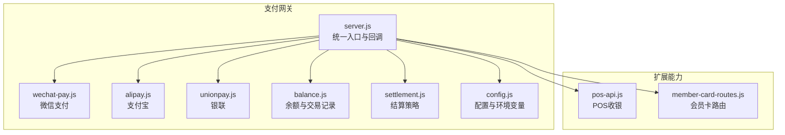
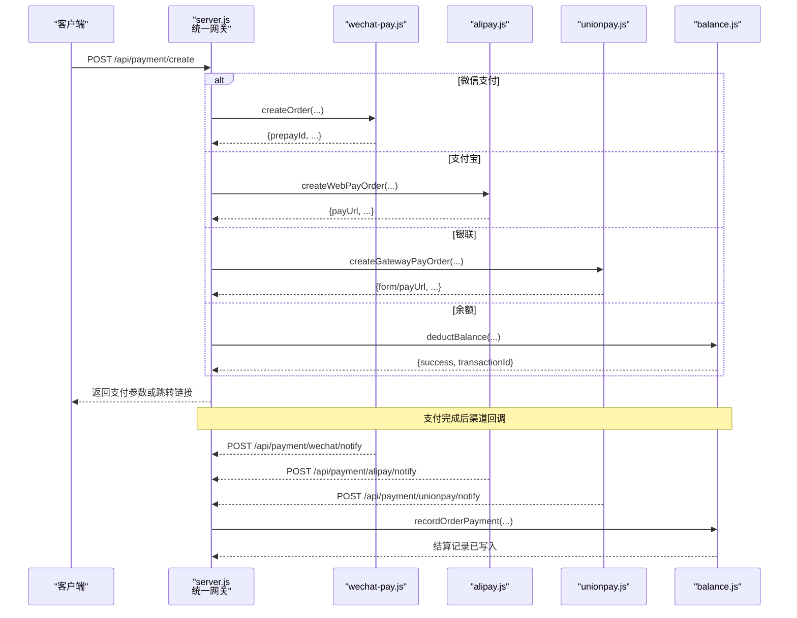
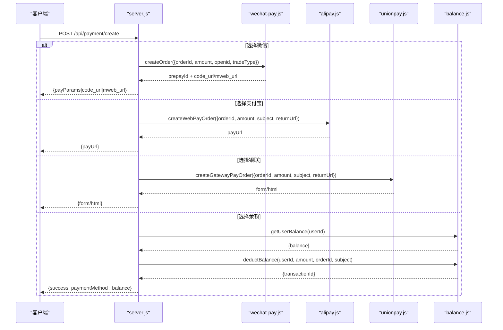
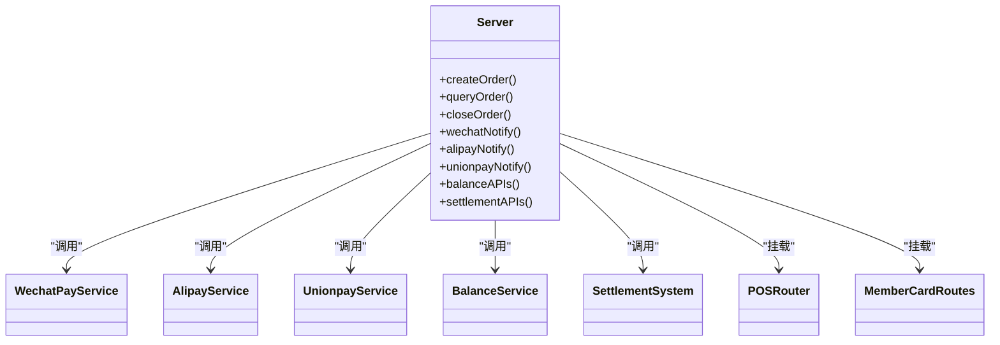

# 支付结算接口

<cite>
**本文引用的文件**   
- [server.js](file://api/payment-server/server.js)
- [wechat-pay.js](file://api/payment-server/wechat-pay.js)
- [alipay.js](file://api/payment-server/alipay.js)
- [unionpay.js](file://api/payment-server/unionpay.js)
- [balance.js](file://api/payment-server/balance.js)
- [settlement.js](file://api/payment-server/settlement.js)
- [config.js](file://api/payment-server/config.js)
- [pos-api.js](file://api/payment-server/pos-api.js)
- [member-card-routes.js](file://api/payment-server/member-card-routes.js)
- [payment-api.js](file://api/payment-api.js)
- [README.md](file://api/payment-server/README.md)
- [QUICK_START.md](file://api/payment-server/QUICK_START.md)
- [PAYMENT_SYSTEM.md](file://PAYMENT_SYSTEM.md)
</cite>

## 目录
1. [简介](#简介)
2. [项目结构](#项目结构)
3. [核心组件](#核心组件)
4. [架构总览](#架构总览)
5. [详细组件分析](#详细组件分析)
6. [依赖关系分析](#依赖关系分析)
7. [性能与可用性](#性能与可用性)
8. [故障排查指南](#故障排查指南)
9. [结论](#结论)
10. [附录：API 参考](#附录api-参考)

## 简介
本文件为“统一支付结算系统”的完整 API 接口文档，覆盖微信支付、支付宝、银联支付、余额支付等支付方式，包含订单创建、状态查询、结果通知、退款处理、分账结算、门店提现、财务报表等能力。同时提供安全机制说明（签名验证、防重放、金额校验）、异常处理方案、第三方集成指南与测试环境使用说明。

## 项目结构
支付网关服务位于 api/payment-server，采用 Express 路由聚合多支付渠道实现，并通过 balance 与 settlement 模块完成账户与结算逻辑。POS 与会员卡作为扩展能力一并接入。

图表来源
- [server.js:1-624](file://api/payment-server/server.js#L1-L624)
- [wechat-pay.js:1-314](file://api/payment-server/wechat-pay.js#L1-L314)
- [alipay.js:1-336](file://api/payment-server/alipay.js#L1-L336)
- [unionpay.js:1-501](file://api/payment-server/unionpay.js#L1-L501)
- [balance.js:1-524](file://api/payment-server/balance.js#L1-L524)
- [settlement.js:1-389](file://api/payment-server/settlement.js#L1-L389)
- [config.js:1-80](file://api/payment-server/config.js#L1-L80)
- [pos-api.js:1-556](file://api/payment-server/pos-api.js#L1-L556)
- [member-card-routes.js:1-281](file://api/payment-server/member-card-routes.js#L1-L281)

章节来源
- [server.js:1-624](file://api/payment-server/server.js#L1-L624)
- [README.md:1-481](file://api/payment-server/README.md#L1-L481)
- [QUICK_START.md:1-371](file://api/payment-server/QUICK_START.md#L1-L371)
- [PAYMENT_SYSTEM.md:1-383](file://PAYMENT_SYSTEM.md#L1-L383)

## 核心组件
- 统一支付网关 server.js：聚合各渠道下单、查询、关闭、回调与结算相关接口。
- 渠道适配层：
  - wechat-pay.js：微信统一下单、查询、关闭、退款、签名与小程序调起参数生成。
  - alipay.js：网页/手机网站支付、查询、关闭、退款、RSA2 验签。
  - unionpay.js：网关支付、查询、撤销、退款、SHA256 签名。
- 资金与结算：
  - balance.js：用户余额、交易流水、门店待结算与可用余额、结算与提现。
  - settlement.js：平台服务费计算、批量结算、提现申请与冻结逻辑。
- 扩展能力：
  - pos-api.js：POS 扫码/现金/会员卡支付与小票打印。
  - member-card-routes.js：会员卡生命周期与消费扣款。
- 配置：
  - config.js：服务器端口、各渠道密钥与回调地址、平台费率与周期。

章节来源
- [server.js:1-624](file://api/payment-server/server.js#L1-L624)
- [wechat-pay.js:1-314](file://api/payment-server/wechat-pay.js#L1-L314)
- [alipay.js:1-336](file://api/payment-server/alipay.js#L1-L336)
- [unionpay.js:1-501](file://api/payment-server/unionpay.js#L1-L501)
- [balance.js:1-524](file://api/payment-server/balance.js#L1-L524)
- [settlement.js:1-389](file://api/payment-server/settlement.js#L1-L389)
- [pos-api.js:1-556](file://api/payment-server/pos-api.js#L1-L556)
- [member-card-routes.js:1-281](file://api/payment-server/member-card-routes.js#L1-L281)
- [config.js:1-80](file://api/payment-server/config.js#L1-L80)

## 架构总览
支付网关对外暴露统一接口，内部按支付方式分发到对应适配器；支付成功后通过异步回调更新订单并触发结算流程。

图表来源
- [server.js:36-458](file://api/payment-server/server.js#L36-L458)
- [wechat-pay.js:56-127](file://api/payment-server/wechat-pay.js#L56-L127)
- [alipay.js:68-104](file://api/payment-server/alipay.js#L68-L104)
- [unionpay.js:78-123](file://api/payment-server/unionpay.js#L78-L123)
- [balance.js:244-283](file://api/payment-server/balance.js#L244-L283)

## 详细组件分析

### 统一支付网关（server.js）
- 统一入口
  - POST /api/payment/create：根据 paymentMethod 路由至具体渠道，返回前端所需支付参数或跳转链接。
  - GET /api/payment/query/:orderId：按渠道查询订单状态并同步本地订单状态。
  - POST /api/payment/close/:orderId：关闭未支付订单。
- 渠道回调
  - POST /api/payment/wechat/notify：XML 回调，验签后更新订单并记录结算。
  - POST /api/payment/alipay/notify：JSON 回调，RSA2 验签后更新订单并记录结算。
  - POST /api/payment/unionpay/notify：表单回调，SHA256 验签后更新订单并记录结算。
- 余额与结算
  - GET /api/balance/:userId、GET /api/balance/:userId/transactions、POST /api/balance/recharge
  - GET /api/settlement/store/:storeId、GET /api/settlement/store/:storeId/records
  - POST /api/settlement/store/:storeId/settle、POST /api/settlement/store/:storeId/withdraw
  - POST /api/settlement/report
- 健康检查
  - GET /api/health

章节来源
- [server.js:36-624](file://api/payment-server/server.js#L36-L624)

#### 统一支付创建时序图

图表来源
- [server.js:42-174](file://api/payment-server/server.js#L42-L174)
- [wechat-pay.js:56-127](file://api/payment-server/wechat-pay.js#L56-L127)
- [alipay.js:68-104](file://api/payment-server/alipay.js#L68-L104)
- [unionpay.js:78-123](file://api/payment-server/unionpay.js#L78-L123)
- [balance.js:91-139](file://api/payment-server/balance.js#L91-L139)

### 微信支付（wechat-pay.js）
- 关键能力
  - 统一下单：支持 JSAPI/NATIVE/MWEB 等 trade_type，自动拼接 XML 请求与 MD5 签名。
  - 订单查询：支持 transaction_id 或 out_trade_no 查询。
  - 关闭订单：支持未支付订单关闭。
  - 退款：提交退款申请（生产需双向证书）。
  - 回调验签：MD5 验签。
  - 小程序调起参数：generateAppPayParams 生成 timeStamp/nonceStr/package/signType/paySign。
- 数据单位
  - 金额以“分”为单位进行传输与存储，返回时转换为元。

章节来源
- [wechat-pay.js:1-314](file://api/payment-server/wechat-pay.js#L1-L314)

### 支付宝（alipay.js）
- 关键能力
  - 电脑网站支付：alipay.trade.page.pay，返回 payUrl。
  - 手机网站支付：alipay.trade.wap.pay。
  - 统一查询：alipay.trade.query。
  - 关闭订单：alipay.trade.close。
  - 退款：alipay.trade.refund。
  - RSA2 签名与验签：使用私钥签名、公钥验签。
- 时间格式
  - 使用 Date.prototype.format 生成 yyyy-MM-dd HH:mm:ss。

章节来源
- [alipay.js:1-336](file://api/payment-server/alipay.js#L1-L336)

### 银联支付（unionpay.js）
- 关键能力
  - 网关支付：frontTrans.do，返回 HTML 表单自动提交。
  - 手机网页支付：txnSubType=02。
  - 银行卡直连支付：backTrans.do（含客户信息加密字段）。
  - 查询：queryTrans.do。
  - 撤销：txnType=31。
  - 退款：txnType=04。
  - SHA256 签名与验签。
- 响应解析
  - 将网关返回的键值对解析为对象。

章节来源
- [unionpay.js:1-501](file://api/payment-server/unionpay.js#L1-L501)

### 余额与交易（balance.js）
- 用户余额
  - 获取余额、充值、消费扣减，维护 totalRecharge/totalConsume 统计。
- 交易流水
  - 记录每次余额变动，支持分页查询。
- 门店结算
  - 记录每笔订单的平台服务费与门店应得，维护 pendingSettlement/availableBalance/frozenBalance。
  - 结算：将待结算转入可用余额。
  - 提现：冻结可用余额，模拟银行到账流程。
  - 报表：按日汇总订单量、金额、平台费与门店收入。

章节来源
- [balance.js:1-524](file://api/payment-server/balance.js#L1-L524)

### 结算策略（settlement.js）
- 平台服务费比例默认 5%，可配置。
- 支持单笔与批量结算，冻结提现金额，生成结算与提现记录。
- 提供门店财务报告接口，汇总结算与提现情况。

章节来源
- [settlement.js:1-389](file://api/payment-server/settlement.js#L1-L389)

### POS 收银（pos-api.js）
- 功能
  - 创建 POS 订单并生成二维码。
  - 扫码支付、现金支付、会员卡支付。
  - 小票数据输出。
  - 与结算中心同步。
- 超时控制
  - 二维码有效期默认 5 分钟，过期自动置为 expired。

章节来源
- [pos-api.js:1-556](file://api/payment-server/pos-api.js#L1-L556)

### 会员卡（member-card-routes.js）
- 功能
  - 创建、查询、充值、消费扣款、密码校验与修改、挂失/解挂、门店可用卡列表、配置查询。
- 与 POS 集成
  - POS 会员卡支付调用 verifyAndDeduct 完成扣款。

章节来源
- [member-card-routes.js:1-281](file://api/payment-server/member-card-routes.js#L1-L281)

### 前端支付 API 封装（payment-api.js）
- 提供统一的支付方式列表与前端方法（创建微信/支付宝/银联订单、余额支付、查询状态、申请退款、余额查询与充值）。
- 当前为预留/模拟实现，便于前端快速联调。

章节来源
- [payment-api.js:1-427](file://api/payment-api.js#L1-L427)

## 依赖关系分析
- server.js 作为路由中枢，依赖各渠道适配器与 balance/settlement 模块。
- 渠道适配器各自负责与第三方支付网关通信及签名/验签。
- balance.js 与 settlement.js 共同维护资金流与分账逻辑。
- pos-api.js 与 member-card-routes.js 作为扩展能力被 server.js 挂载。

图表来源
- [server.js:1-624](file://api/payment-server/server.js#L1-L624)
- [wechat-pay.js:1-314](file://api/payment-server/wechat-pay.js#L1-L314)
- [alipay.js:1-336](file://api/payment-server/alipay.js#L1-L336)
- [unionpay.js:1-501](file://api/payment-server/unionpay.js#L1-L501)
- [balance.js:1-524](file://api/payment-server/balance.js#L1-L524)
- [settlement.js:1-389](file://api/payment-server/settlement.js#L1-L389)
- [pos-api.js:1-556](file://api/payment-server/pos-api.js#L1-L556)
- [member-card-routes.js:1-281](file://api/payment-server/member-card-routes.js#L1-L281)

## 性能与可用性
- 并发与幂等
  - 建议对回调接口实现幂等处理（基于订单号去重），避免重复入账。
- 重试与退避
  - 对外部网关请求增加重试与指数退避，降低网络抖动影响。
- 缓存与查询
  - 高频查询接口可引入短期缓存（如 Redis）减少外部网关压力。
- 资源隔离
  - 不同渠道适配器独立错误边界，避免相互影响。
- 监控与告警
  - 对失败率、延迟、金额不一致等指标设置阈值告警。

[本节为通用建议，不直接分析具体文件]

## 故障排查指南
- 常见错误
  - 余额不足：返回 availableBalance 与 requiredAmount，引导充值或切换支付方式。
  - 订单不存在：检查 orderId 是否一致，确认创建成功。
  - 签名验证失败：核对密钥、参数顺序与编码，确保回调 URL 公网可达。
  - 回调未收到：检查防火墙、反向代理与 HTTPS 证书。
- 日志定位
  - 查看 server.js 中 console.error 输出，结合渠道适配器日志定位问题。
- 金额不一致
  - 对比渠道返回金额与本地记录，必要时发起对账任务。

章节来源
- [server.js:154-174](file://api/payment-server/server.js#L154-L174)
- [server.js:312-451](file://api/payment-server/server.js#L312-L451)
- [balance.js:91-139](file://api/payment-server/balance.js#L91-L139)

## 结论
本支付结算系统提供了统一入口与多渠道适配，具备完善的回调处理、余额管理、分账结算与提现能力。通过严格的签名与验签机制、金额校验与幂等设计，保障资金安全与一致性。配合 POS 与会员卡能力，满足线下与线上全场景支付需求。

[本节为总结性内容，不直接分析具体文件]

## 附录：API 参考

### 统一支付
- 创建支付订单
  - 方法：POST
  - 路径：/api/payment/create
  - 请求体字段：orderId、amount、subject、body、paymentMethod、userId、openid、returnUrl、clientIp
  - 响应：success、data（各渠道支付参数或跳转链接）、error
  - 错误码：缺少必要参数、不支持的支付方式、余额不足等
- 查询支付状态
  - 方法：GET
  - 路径：/api/payment/query/:orderId
  - 响应：success、data（tradeState/tradeStatus 等）、error
- 关闭订单
  - 方法：POST
  - 路径：/api/payment/close/:orderId
  - 响应：success、error

章节来源
- [server.js:36-304](file://api/payment-server/server.js#L36-L304)

### 微信支付
- 统一下单
  - 方法：POST
  - 路径：/api/payment/create（paymentMethod=wechat）
  - 关键参数：openid（JSAPI）、tradeType（JSAPI/NATIVE/MWEB）
  - 返回：payParams（小程序调起参数）或 code_url/mweb_url
- 回调通知
  - 方法：POST
  - 路径：/api/payment/wechat/notify
  - 内容：XML，包含 return_code/result_code/out_trade_no/transaction_id/total_fee/cash_fee
  - 验签：MD5
- 查询/关闭/退款
  - 由 server.js 路由至 wechat-pay.js 对应方法

章节来源
- [server.js:42-174](file://api/payment-server/server.js#L42-L174)
- [server.js:312-350](file://api/payment-server/server.js#L312-L350)
- [wechat-pay.js:56-127](file://api/payment-server/wechat-pay.js#L56-L127)
- [wechat-pay.js:132-184](file://api/payment-server/wechat-pay.js#L132-L184)
- [wechat-pay.js:189-225](file://api/payment-server/wechat-pay.js#L189-L225)
- [wechat-pay.js:230-280](file://api/payment-server/wechat-pay.js#L230-L280)
- [wechat-pay.js:285-310](file://api/payment-server/wechat-pay.js#L285-L310)

### 支付宝
- 网页支付
  - 方法：POST
  - 路径：/api/payment/create（paymentMethod=alipay）
  - 返回：payUrl
- 回调通知
  - 方法：POST
  - 路径：/api/payment/alipay/notify
  - 内容：JSON，包含 out_trade_no/trade_no/total_amount/trade_status
  - 验签：RSA2
- 查询/关闭/退款
  - 由 server.js 路由至 alipay.js 对应方法

章节来源
- [server.js:85-104](file://api/payment-server/server.js#L85-L104)
- [server.js:366-402](file://api/payment-server/server.js#L366-L402)
- [alipay.js:68-104](file://api/payment-server/alipay.js#L68-L104)
- [alipay.js:147-199](file://api/payment-server/alipay.js#L147-L199)
- [alipay.js:204-244](file://api/payment-server/alipay.js#L204-L244)
- [alipay.js:249-298](file://api/payment-server/alipay.js#L249-L298)
- [alipay.js:303-307](file://api/payment-server/alipay.js#L303-L307)

### 银联支付
- 网关支付
  - 方法：POST
  - 路径：/api/payment/create（paymentMethod=unionpay）
  - 返回：HTML 表单（自动提交）或 payUrl
- 回调通知
  - 方法：POST
  - 路径：/api/payment/unionpay/notify
  - 内容：表单，包含 orderId/txnAmt/respCode
  - 验签：SHA256
- 查询/撤销/退款
  - 由 server.js 路由至 unionpay.js 对应方法

章节来源
- [server.js:96-104](file://api/payment-server/server.js#L96-L104)
- [server.js:417-451](file://api/payment-server/server.js#L417-L451)
- [unionpay.js:78-123](file://api/payment-server/unionpay.js#L78-L123)
- [unionpay.js:237-287](file://api/payment-server/unionpay.js#L237-L287)
- [unionpay.js:292-343](file://api/payment-server/unionpay.js#L292-L343)
- [unionpay.js:348-401](file://api/payment-server/unionpay.js#L348-L401)
- [unionpay.js:467-472](file://api/payment-server/unionpay.js#L467-L472)

### 余额支付
- 创建支付订单
  - 方法：POST
  - 路径：/api/payment/create（paymentMethod=balance）
  - 必需：userId、amount
  - 行为：先查询余额，再扣减并记录交易
- 查询余额与交易
  - GET /api/balance/:userId
  - GET /api/balance/:userId/transactions
- 余额充值
  - POST /api/balance/recharge

章节来源
- [server.js:106-174](file://api/payment-server/server.js#L106-L174)
- [server.js:466-506](file://api/payment-server/server.js#L466-L506)
- [balance.js:57-82](file://api/payment-server/balance.js#L57-L82)
- [balance.js:91-139](file://api/payment-server/balance.js#L91-L139)
- [balance.js:147-191](file://api/payment-server/balance.js#L147-L191)
- [balance.js:199-218](file://api/payment-server/balance.js#L199-L218)

### 分账结算与提现
- 获取门店账户信息
  - GET /api/settlement/store/:storeId
- 获取结算记录
  - GET /api/settlement/store/:storeId/records?status&startDate&endDate
- 发起结算
  - POST /api/settlement/store/:storeId/settle?settlementCycle=7
- 门店提现
  - POST /api/settlement/store/:storeId/withdraw{amount,bankAccount}
- 生成财务报表
  - POST /api/settlement/report{startDate,endDate,storeId,type}

章节来源
- [server.js:514-578](file://api/payment-server/server.js#L514-L578)
- [balance.js:244-283](file://api/payment-server/balance.js#L244-L283)
- [balance.js:290-337](file://api/payment-server/balance.js#L290-L337)
- [balance.js:345-409](file://api/payment-server/balance.js#L345-L409)
- [balance.js:416-453](file://api/payment-server/balance.js#L416-L453)
- [balance.js:459-520](file://api/payment-server/balance.js#L459-L520)
- [settlement.js:28-43](file://api/payment-server/settlement.js#L28-L43)
- [settlement.js:50-92](file://api/payment-server/settlement.js#L50-L92)
- [settlement.js:101-174](file://api/payment-server/settlement.js#L101-L174)
- [settlement.js:183-235](file://api/payment-server/settlement.js#L183-L235)
- [settlement.js:244-293](file://api/payment-server/settlement.js#L244-L293)

### POS 收银
- 创建订单
  - POST /api/pos/create
- 查询订单
  - GET /api/pos/query/:orderId
- 扫码支付
  - POST /api/pos/scan
- 现金支付
  - POST /api/pos/cash
- 会员卡支付
  - POST /api/pos/card
- 小票数据
  - GET /api/pos/receipt/:orderId
- 同步结算中心
  - POST /api/pos/settlement/sync

章节来源
- [pos-api.js:25-106](file://api/payment-server/pos-api.js#L25-L106)
- [pos-api.js:112-149](file://api/payment-server/pos-api.js#L112-L149)
- [pos-api.js:155-238](file://api/payment-server/pos-api.js#L155-L238)
- [pos-api.js:244-327](file://api/payment-server/pos-api.js#L244-L327)
- [pos-api.js:333-404](file://api/payment-server/pos-api.js#L333-L404)
- [pos-api.js:447-495](file://api/payment-server/pos-api.js#L447-L495)
- [pos-api.js:501-553](file://api/payment-server/pos-api.js#L501-L553)

### 会员卡
- 创建
  - POST /api/member-card/create
- 查询信息
  - GET /api/member-card/info/:cardId
- 查询用户所有卡
  - GET /api/member-card/user/:userId
- 验证并扣款
  - POST /api/member-card/verify
- 充值
  - POST /api/member-card/recharge
- 交易记录
  - GET /api/member-card/transactions/:cardId
- 密码校验/修改
  - POST /api/member-card/verify-password
  - POST /api/member-card/change-password
- 挂失/解挂
  - POST /api/member-card/toggle-status
- 门店可用卡
  - GET /api/member-card/store/:storeId
- 配置
  - GET /api/member-card/config

章节来源
- [member-card-routes.js:13-50](file://api/payment-server/member-card-routes.js#L13-L50)
- [member-card-routes.js:56-86](file://api/payment-server/member-card-routes.js#L56-L86)
- [member-card-routes.js:92-117](file://api/payment-server/member-card-routes.js#L92-L117)
- [member-card-routes.js:123-147](file://api/payment-server/member-card-routes.js#L123-L147)
- [member-card-routes.js:153-166](file://api/payment-server/member-card-routes.js#L153-L166)
- [member-card-routes.js:172-218](file://api/payment-server/member-card-routes.js#L172-L218)
- [member-card-routes.js:224-244](file://api/payment-server/member-card-routes.js#L224-L244)
- [member-card-routes.js:250-262](file://api/payment-server/member-card-routes.js#L250-L262)
- [member-card-routes.js:268-278](file://api/payment-server/member-card-routes.js#L268-L278)

### 健康检查
- GET /api/health

章节来源
- [server.js:582-592](file://api/payment-server/server.js#L582-L592)

### 安全机制
- 签名与验签
  - 微信：MD5 签名与验签。
  - 支付宝：RSA2 签名与验签。
  - 银联：SHA256 签名与验签。
- 防重放攻击
  - 建议在回调处理器中基于 out_trade_no/transaction_id 做幂等判断，避免重复入账。
- 金额校验
  - 服务端严格校验 amount 与渠道返回金额一致，防止篡改。
- 网络安全
  - 生产环境必须启用 HTTPS，回调 URL 需公网可达。

章节来源
- [wechat-pay.js:28-43](file://api/payment-server/wechat-pay.js#L28-L43)
- [wechat-pay.js:285-290](file://api/payment-server/wechat-pay.js#L285-L290)
- [alipay.js:20-37](file://api/payment-server/alipay.js#L20-L37)
- [alipay.js:303-307](file://api/payment-server/alipay.js#L303-L307)
- [unionpay.js:47-60](file://api/payment-server/unionpay.js#L47-L60)
- [unionpay.js:467-472](file://api/payment-server/unionpay.js#L467-L472)
- [config.js:12-62](file://api/payment-server/config.js#L12-L62)

### 集成与测试指南
- 启动支付服务器
  - npm install && npm start
- 运行测试脚本
  - node test-api.js
- 小程序端对接
  - 在 app.js 配置 paymentServerUrl
  - 调用统一接口创建支付，按渠道返回参数调起支付或跳转 WebView
- 环境变量
  - 配置 WECHAT_*、ALIPAY_*、UNIONPAY_*、PORT、HOST 等

章节来源
- [README.md:19-67](file://api/payment-server/README.md#L19-L67)
- [QUICK_START.md:18-44](file://api/payment-server/QUICK_START.md#L18-L44)
- [QUICK_START.md:205-228](file://api/payment-server/QUICK_START.md#L205-L228)
- [PAYMENT_SYSTEM.md:61-85](file://PAYMENT_SYSTEM.md#L61-L85)