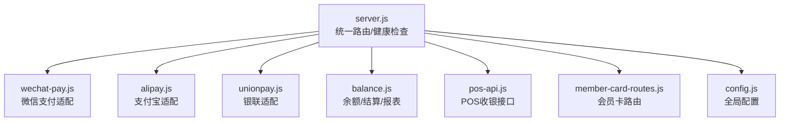
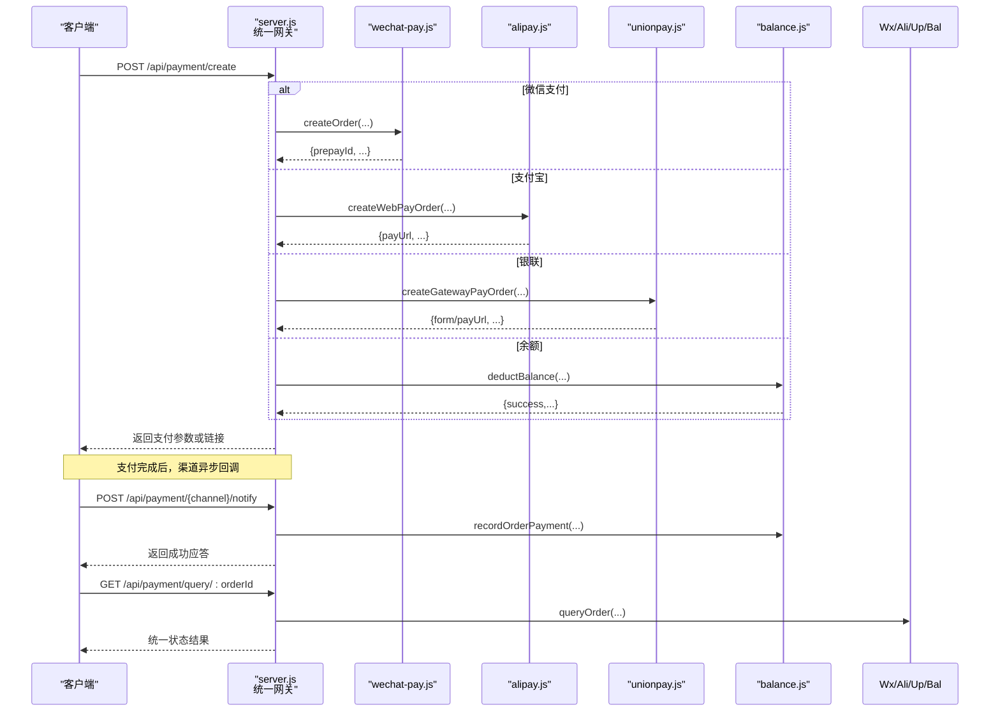
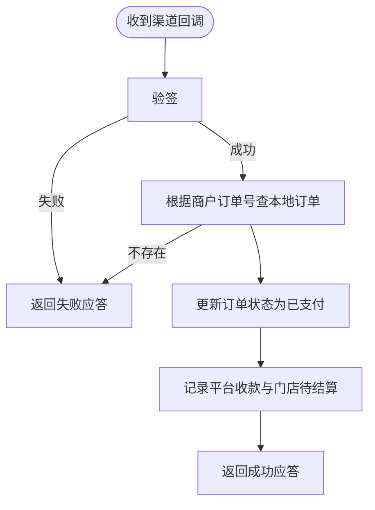
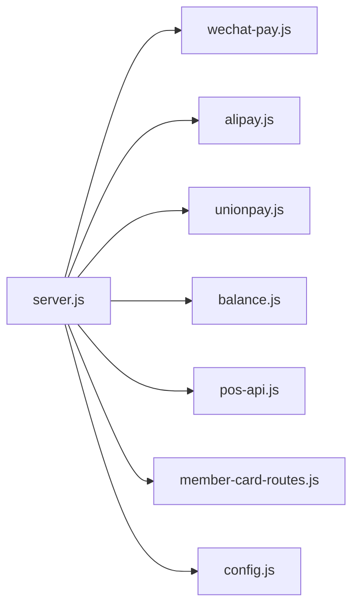

# 支付通用接口

<cite>
**本文引用的文件**   
- [server.js](file://api/payment-server/server.js)
- [config.js](file://api/payment-server/config.js)
- [wechat-pay.js](file://api/payment-server/wechat-pay.js)
- [alipay.js](file://api/payment-server/alipay.js)
- [unionpay.js](file://api/payment-server/unionpay.js)
- [balance.js](file://api/payment-server/balance.js)
- [pos-api.js](file://api/payment-server/pos-api.js)
- [member-card-routes.js](file://api/payment-server/member-card-routes.js)
</cite>

## 目录
1. [简介](#简介)
2. [项目结构](#项目结构)
3. [核心组件](#核心组件)
4. [架构总览](#架构总览)
5. [详细组件分析](#详细组件分析)
6. [依赖关系分析](#依赖关系分析)
7. [性能与可靠性](#性能与可靠性)
8. [故障排查指南](#故障排查指南)
9. [结论](#结论)
10. [附录：API 规范](#附录api-规范)

## 简介
本文件为“支付系统通用接口”的权威文档，覆盖以下能力：
- 支付方式列表查询与动态配置开关
- 统一创建支付、统一查询支付状态（跨渠道）
- 统一回调处理（微信/支付宝/银联）
- 支付配置管理（启用/禁用各渠道）
- 支付日志与流水查询（用户余额交易、门店结算记录）
- 安全验证（签名校验与权限检查）
- 监控指标与健康检查

该文档面向开发者与运维人员，既提供高层概览，也给出可落地的接口定义与调用流程。

## 项目结构
支付网关服务位于 api/payment-server 目录，采用 Express 作为 HTTP 框架，按“路由 + 渠道实现 + 账户与结算”分层组织：
- server.js：HTTP 入口、统一路由、健康检查
- config.js：全局配置（端口、渠道开关、回调地址等）
- wechat-pay.js / alipay.js / unionpay.js：渠道适配层（下单、查询、关闭、退款、验签）
- balance.js：用户余额、门店结算、报表统计
- pos-api.js：POS 收银相关接口（扫码、现金、会员卡）
- member-card-routes.js：会员卡管理路由

图示来源
- [server.js:1-624](file://api/payment-server/server.js#L1-L624)
- [config.js:1-80](file://api/payment-server/config.js#L1-L80)
- [wechat-pay.js:1-314](file://api/payment-server/wechat-pay.js#L1-L314)
- [alipay.js:1-336](file://api/payment-server/alipay.js#L1-L336)
- [unionpay.js:1-501](file://api/payment-server/unionpay.js#L1-L501)
- [balance.js:1-524](file://api/payment-server/balance.js#L1-L524)
- [pos-api.js:1-556](file://api/payment-server/pos-api.js#L1-L556)
- [member-card-routes.js:1-281](file://api/payment-server/member-card-routes.js#L1-L281)

章节来源
- [server.js:1-624](file://api/payment-server/server.js#L1-L624)
- [config.js:1-80](file://api/payment-server/config.js#L1-L80)

## 核心组件
- 统一支付网关：对外暴露统一的创建/查询/关闭订单接口，内部根据 paymentMethod 分发到具体渠道。
- 渠道适配层：封装各支付渠道的签名、请求、响应解析、回调验签。
- 账户与结算：维护用户余额、门店待结算/可用余额、提现、结算周期与报表。
- POS 收银：支持扫码、现金、会员卡等多种线下收银方式。
- 配置中心：集中管理各渠道开关、回调地址、证书路径等。

章节来源
- [server.js:36-304](file://api/payment-server/server.js#L36-L304)
- [balance.js:8-524](file://api/payment-server/balance.js#L8-L524)
- [pos-api.js:1-556](file://api/payment-server/pos-api.js#L1-L556)
- [config.js:1-80](file://api/payment-server/config.js#L1-L80)

## 架构总览
下图展示从客户端发起支付到渠道回调的端到端流程，以及统一查询与关闭的生命周期。

图示来源
- [server.js:42-174](file://api/payment-server/server.js#L42-L174)
- [server.js:180-240](file://api/payment-server/server.js#L180-L240)
- [server.js:312-451](file://api/payment-server/server.js#L312-L451)
- [wechat-pay.js:56-127](file://api/payment-server/wechat-pay.js#L56-L127)
- [alipay.js:68-104](file://api/payment-server/alipay.js#L68-L104)
- [unionpay.js:78-123](file://api/payment-server/unionpay.js#L78-L123)
- [balance.js:244-283](file://api/payment-server/balance.js#L244-L283)

## 详细组件分析

### 统一支付接口
- 创建支付
  - 方法：POST
  - 路径：/api/payment/create
  - 功能：根据 paymentMethod 分发至对应渠道；余额支付直接扣减并返回成功；其他渠道返回调起参数或跳转链接。
  - 关键入参：orderId、amount、subject/body、paymentMethod、userId/openid/returnUrl/clientIp
  - 关键出参：success、data（含 prepayId/payUrl/form 等）、error
  - 错误处理：参数缺失、不支持的支付方式、余额不足、渠道异常
- 查询支付状态
  - 方法：GET
  - 路径：/api/payment/query/:orderId
  - 功能：按渠道查询真实状态并同步本地订单状态
  - 关键出参：success、data（含 tradeState/tradeStatus/status 等）
- 关闭订单
  - 方法：POST
  - 路径：/api/payment/close/:orderId
  - 功能：仅对未支付订单有效；余额/银联由后台处理或无需显式关闭

章节来源
- [server.js:42-174](file://api/payment-server/server.js#L42-L174)
- [server.js:180-240](file://api/payment-server/server.js#L180-L240)
- [server.js:246-304](file://api/payment-server/server.js#L246-L304)

### 渠道适配层

#### 微信支付（JSAPI/NATIVE/H5/APP）
- 下单：生成统一下单 XML，计算 MD5 签名，返回 prepayId 及小程序调起参数
- 查询：通过 transaction_id/out_trade_no 查询
- 关闭：调用关闭订单接口
- 退款：支持部分/全额退款（需双向SSL证书）
- 验签：回调签名校验

章节来源
- [wechat-pay.js:56-127](file://api/payment-server/wechat-pay.js#L56-L127)
- [wechat-pay.js:132-184](file://api/payment-server/wechat-pay.js#L132-L184)
- [wechat-pay.js:189-225](file://api/payment-server/wechat-pay.js#L189-L225)
- [wechat-pay.js:230-280](file://api/payment-server/wechat-pay.js#L230-L280)
- [wechat-pay.js:285-290](file://api/payment-server/wechat-pay.js#L285-L290)

#### 支付宝（网页/手机网站）
- 下单：构造 biz_content 与公共参数，RSA2 签名，返回 payUrl
- 查询：alipay.trade.query
- 关闭：alipay.trade.close
- 退款：alipay.trade.refund
- 验签：使用支付宝公钥验签

章节来源
- [alipay.js:68-104](file://api/payment-server/alipay.js#L68-L104)
- [alipay.js:147-199](file://api/payment-server/alipay.js#L147-L199)
- [alipay.js:204-244](file://api/payment-server/alipay.js#L204-L244)
- [alipay.js:249-298](file://api/payment-server/alipay.js#L249-L298)
- [alipay.js:303-307](file://api/payment-server/alipay.js#L303-L307)

#### 银联（网关/手机网页/银行卡直连）
- 下单：构建表单字段，SHA256 签名，返回 HTML 表单或参数集合
- 查询：queryTrans.do
- 撤销/退款：backTrans.do
- 验签：基于签名内容与密钥进行校验

章节来源
- [unionpay.js:78-123](file://api/payment-server/unionpay.js#L78-L123)
- [unionpay.js:237-287](file://api/payment-server/unionpay.js#L237-L287)
- [unionpay.js:292-343](file://api/payment-server/unionpay.js#L292-L343)
- [unionpay.js:348-401](file://api/payment-server/unionpay.js#L348-L401)
- [unionpay.js:467-472](file://api/payment-server/unionpay.js#L467-L472)

### 统一回调处理
- 微信回调：/api/payment/wechat/notify
- 支付宝回调：/api/payment/alipay/notify
- 银联回调：/api/payment/unionpay/notify
- 处理逻辑：验签 → 查找本地订单 → 更新状态 → 记录平台收款与门店待结算金额 → 返回成功应答

图示来源
- [server.js:312-350](file://api/payment-server/server.js#L312-L350)
- [server.js:366-402](file://api/payment-server/server.js#L366-L402)
- [server.js:417-451](file://api/payment-server/server.js#L417-L451)
- [balance.js:244-283](file://api/payment-server/balance.js#L244-L283)

### 支付配置管理
- 配置项：服务器端口/主机、各渠道 enabled 开关、回调地址、证书路径、费率与结算周期等
- 动态开关：通过 config.js 中 wechat/alipay/unionpay.enabled 控制是否启用某渠道
- 健康检查：/api/health 返回当前启用的服务状态

章节来源
- [config.js:1-80](file://api/payment-server/config.js#L1-L80)
- [server.js:582-592](file://api/payment-server/server.js#L582-L592)

### 支付日志与流水查询
- 用户余额交易记录：/api/balance/:userId/transactions
- 门店结算记录：/api/settlement/store/:storeId/records
- 财务报表：/api/settlement/report（可按日期/门店维度聚合）

章节来源
- [server.js:475-483](file://api/payment-server/server.js#L475-L483)
- [server.js:523-531](file://api/payment-server/server.js#L523-L531)
- [server.js:569-578](file://api/payment-server/server.js#L569-L578)
- [balance.js:199-218](file://api/payment-server/balance.js#L199-L218)
- [balance.js:416-453](file://api/payment-server/balance.js#L416-L453)
- [balance.js:459-520](file://api/payment-server/balance.js#L459-L520)

### 支付安全验证
- 签名算法
  - 微信：MD5 排序拼接 + key
  - 支付宝：RSA2-SHA256
  - 银联：SHA256 签名内容
- 验签入口
  - 微信：verifyNotifySign
  - 支付宝：verifyNotifySign
  - 银联：verifyNotifySign
- 建议
  - 生产环境强制 HTTPS
  - 严格校验回调幂等与金额一致性
  - 限制 IP 白名单与重试次数

章节来源
- [wechat-pay.js:28-43](file://api/payment-server/wechat-pay.js#L28-L43)
- [wechat-pay.js:285-290](file://api/payment-server/wechat-pay.js#L285-L290)
- [alipay.js:20-37](file://api/payment-server/alipay.js#L20-L37)
- [alipay.js:303-307](file://api/payment-server/alipay.js#L303-L307)
- [unionpay.js:47-60](file://api/payment-server/unionpay.js#L47-L60)
- [unionpay.js:467-472](file://api/payment-server/unionpay.js#L467-L472)

### 监控指标与告警
- 健康检查：/api/health
  - 返回 status、timestamp、services（各渠道 enabled 状态）
- 建议指标（结合日志与外部监控）
  - 成功率、失败率、平均耗时、超时率
  - 渠道可用性（enabled/disabled）
  - 回调延迟、重复回调次数
  - 余额不足率、退款成功率
  - 门店结算与提现成功率

章节来源
- [server.js:582-592](file://api/payment-server/server.js#L582-L592)

### POS 收银与会员卡
- POS 接口
  - 创建订单：/api/pos/create
  - 查询订单：/api/pos/query/:orderId
  - 扫码支付：/api/pos/scan
  - 现金支付：/api/pos/cash
  - 会员卡支付：/api/pos/card
  - 小票数据：/api/pos/receipt/:orderId
  - 结算同步：/api/pos/settlement/sync
- 会员卡接口
  - 创建卡：/api/member-card/create
  - 查询信息：/api/member-card/info/:cardId
  - 用户卡片：/api/member-card/user/:userId
  - 消费扣款：/api/member-card/verify
  - 充值：/api/member-card/recharge
  - 交易记录：/api/member-card/transactions/:cardId
  - 密码校验/修改：/api/member-card/verify-password、/api/member-card/change-password
  - 挂失/解挂：/api/member-card/toggle-status
  - 门店可用卡：/api/member-card/store/:storeId
  - 配置获取：/api/member-card/config

章节来源
- [pos-api.js:25-106](file://api/payment-server/pos-api.js#L25-L106)
- [pos-api.js:112-149](file://api/payment-server/pos-api.js#L112-L149)
- [pos-api.js:155-238](file://api/payment-server/pos-api.js#L155-L238)
- [pos-api.js:244-327](file://api/payment-server/pos-api.js#L244-L327)
- [pos-api.js:333-404](file://api/payment-server/pos-api.js#L333-L404)
- [pos-api.js:447-495](file://api/payment-server/pos-api.js#L447-L495)
- [pos-api.js:501-553](file://api/payment-server/pos-api.js#L501-L553)
- [member-card-routes.js:13-50](file://api/payment-server/member-card-routes.js#L13-L50)
- [member-card-routes.js:56-68](file://api/payment-server/member-card-routes.js#L56-L68)
- [member-card-routes.js:74-86](file://api/payment-server/member-card-routes.js#L74-L86)
- [member-card-routes.js:92-117](file://api/payment-server/member-card-routes.js#L92-L117)
- [member-card-routes.js:123-147](file://api/payment-server/member-card-routes.js#L123-L147)
- [member-card-routes.js:153-166](file://api/payment-server/member-card-routes.js#L153-L166)
- [member-card-routes.js:172-192](file://api/payment-server/member-card-routes.js#L172-L192)
- [member-card-routes.js:198-218](file://api/payment-server/member-card-routes.js#L198-L218)
- [member-card-routes.js:224-244](file://api/payment-server/member-card-routes.js#L224-L244)
- [member-card-routes.js:250-262](file://api/payment-server/member-card-routes.js#L250-L262)
- [member-card-routes.js:268-278](file://api/payment-server/member-card-routes.js#L268-L278)

## 依赖关系分析
- server.js 依赖：
  - 渠道模块：wechat-pay.js、alipay.js、unionpay.js
  - 业务模块：balance.js
  - 扩展模块：pos-api.js、member-card-routes.js
  - 配置：config.js
- 渠道模块之间相互独立，通过统一网关聚合
- balance.js 被统一网关与 POS 结算同步间接使用

图示来源
- [server.js:1-31](file://api/payment-server/server.js#L1-L31)

章节来源
- [server.js:1-31](file://api/payment-server/server.js#L1-L31)

## 性能与可靠性
- 幂等性：回调处理需基于商户订单号去重，避免重复入账
- 重试与退避：对第三方 API 调用增加重试与指数退避策略
- 连接池与超时：合理设置 axios 超时与连接池大小
- 限流与熔断：对高频接口（如查询）做限流，对下游不可用快速失败
- 资金安全：金额单位统一（分/元），严格校验回调金额与本地一致
- 可观测性：结构化日志、关键指标上报、链路追踪

[本节为通用指导，不直接分析具体文件]

## 故障排查指南
- 常见错误
  - 缺少必要参数：检查必填字段
  - 不支持的支付方式：确认 paymentMethod 值
  - 余额不足：引导充值或切换支付方式
  - 订单不存在：核对 orderId 与生命周期
  - 签名验证失败：核对密钥、时间戳、参数顺序
- 定位步骤
  - 查看健康检查与各渠道 enabled 状态
  - 核对回调 URL 公网可达性与 HTTPS
  - 比对渠道返回码与本地状态机
  - 拉取用户交易记录与门店结算记录进行交叉验证

章节来源
- [server.js:56-61](file://api/payment-server/server.js#L56-L61)
- [server.js:146-151](file://api/payment-server/server.js#L146-L151)
- [server.js:184-189](file://api/payment-server/server.js#L184-L189)
- [server.js:317-319](file://api/payment-server/server.js#L317-L319)
- [server.js:371-373](file://api/payment-server/server.js#L371-L373)
- [server.js:421-423](file://api/payment-server/server.js#L421-L423)

## 结论
本支付通用接口以统一网关为核心，屏蔽多渠道差异，提供一致的创建/查询/关闭/回调处理能力；配合余额与结算体系，形成完整的收付闭环。通过配置化开关与健壮的验签机制，兼顾灵活性与安全性。建议在生产环境完善监控告警与幂等保障，确保高可用与资金安全。

[本节为总结性内容，不直接分析具体文件]

## 附录：API 规范

### 统一支付
- 创建支付
  - 方法：POST
  - 路径：/api/payment/create
  - 入参：orderId、amount、subject/body、paymentMethod、userId/openid/returnUrl/clientIp
  - 出参：success、data（含 prepayId/payUrl/form 等）、error
- 查询支付状态
  - 方法：GET
  - 路径：/api/payment/query/:orderId
  - 出参：success、data（含 tradeState/tradeStatus/status 等）
- 关闭订单
  - 方法：POST
  - 路径：/api/payment/close/:orderId

章节来源
- [server.js:42-174](file://api/payment-server/server.js#L42-L174)
- [server.js:180-240](file://api/payment-server/server.js#L180-L240)
- [server.js:246-304](file://api/payment-server/server.js#L246-L304)

### 统一回调
- 微信：POST /api/payment/wechat/notify
- 支付宝：POST /api/payment/alipay/notify
- 银联：POST /api/payment/unionpay/notify

章节来源
- [server.js:312-451](file://api/payment-server/server.js#L312-L451)

### 余额与结算
- 用户余额
  - GET /api/balance/:userId
  - GET /api/balance/:userId/transactions
  - POST /api/balance/recharge
- 门店结算
  - GET /api/settlement/store/:storeId
  - GET /api/settlement/store/:storeId/records
  - POST /api/settlement/store/:storeId/settle
  - POST /api/settlement/store/:storeId/withdraw
  - POST /api/settlement/report

章节来源
- [server.js:466-578](file://api/payment-server/server.js#L466-L578)
- [balance.js:57-82](file://api/payment-server/balance.js#L57-L82)
- [balance.js:199-218](file://api/payment-server/balance.js#L199-L218)
- [balance.js:224-238](file://api/payment-server/balance.js#L224-L238)
- [balance.js:416-453](file://api/payment-server/balance.js#L416-L453)
- [balance.js:459-520](file://api/payment-server/balance.js#L459-L520)

### POS 收银
- 创建订单：POST /api/pos/create
- 查询订单：GET /api/pos/query/:orderId
- 扫码支付：POST /api/pos/scan
- 现金支付：POST /api/pos/cash
- 会员卡支付：POST /api/pos/card
- 小票数据：GET /api/pos/receipt/:orderId
- 结算同步：POST /api/pos/settlement/sync

章节来源
- [pos-api.js:25-106](file://api/payment-server/pos-api.js#L25-L106)
- [pos-api.js:112-149](file://api/payment-server/pos-api.js#L112-L149)
- [pos-api.js:155-238](file://api/payment-server/pos-api.js#L155-L238)
- [pos-api.js:244-327](file://api/payment-server/pos-api.js#L244-L327)
- [pos-api.js:333-404](file://api/payment-server/pos-api.js#L333-L404)
- [pos-api.js:447-495](file://api/payment-server/pos-api.js#L447-L495)
- [pos-api.js:501-553](file://api/payment-server/pos-api.js#L501-L553)

### 会员卡
- 创建卡：POST /api/member-card/create
- 查询信息：GET /api/member-card/info/:cardId
- 用户卡片：GET /api/member-card/user/:userId
- 消费扣款：POST /api/member-card/verify
- 充值：POST /api/member-card/recharge
- 交易记录：GET /api/member-card/transactions/:cardId
- 密码校验/修改：POST /api/member-card/verify-password、/api/member-card/change-password
- 挂失/解挂：POST /api/member-card/toggle-status
- 门店可用卡：GET /api/member-card/store/:storeId
- 配置获取：GET /api/member-card/config

章节来源
- [member-card-routes.js:13-278](file://api/payment-server/member-card-routes.js#L13-L278)

### 配置与健康
- 配置管理：config.js（各渠道 enabled、回调地址、证书路径、费率与结算周期）
- 健康检查：GET /api/health

章节来源
- [config.js:1-80](file://api/payment-server/config.js#L1-L80)
- [server.js:582-592](file://api/payment-server/server.js#L582-L592)