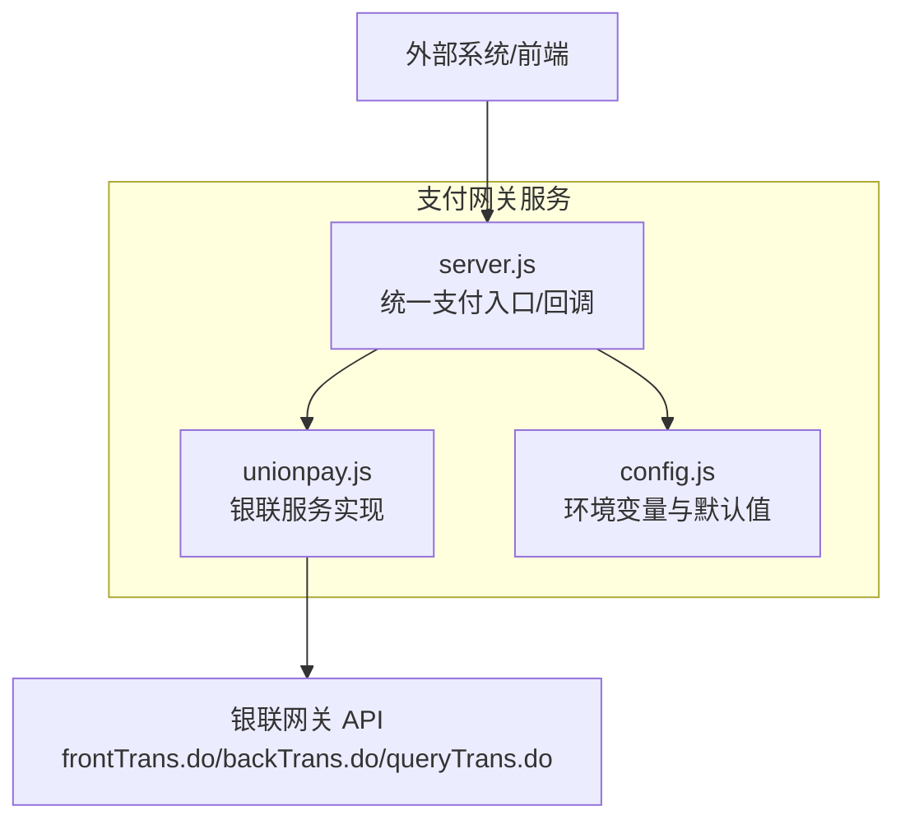
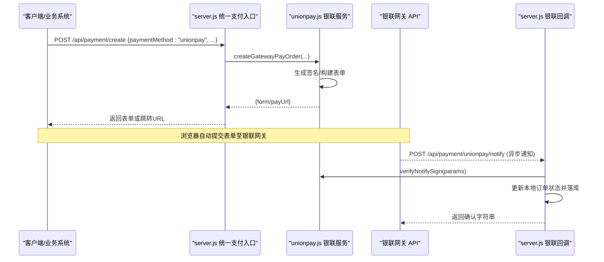
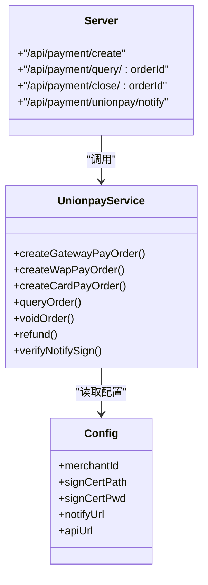

# 银联支付接口

<cite>
**本文引用的文件**
- [unionpay.js](file://api/payment-server/unionpay.js)
- [config.js](file://api/payment-server/config.js)
- [server.js](file://api/payment-server/server.js)
- [README.md](file://api/payment-server/README.md)
</cite>

## 目录
1. [简介](#简介)
2. [项目结构](#项目结构)
3. [核心组件](#核心组件)
4. [架构总览](#架构总览)
5. [详细组件分析](#详细组件分析)
6. [依赖关系分析](#依赖关系分析)
7. [性能与安全考虑](#性能与安全考虑)
8. [故障排查指南](#故障排查指南)
9. [结论](#结论)
10. [附录：集成与测试说明](#附录集成与测试说明)

## 简介
本文件面向开发者，提供本项目中“银联支付”相关接口的完整文档。内容覆盖：
- 交易请求接口（网关支付、手机网页支付、银行卡直连）的参数规范与响应格式
- 交易状态查询接口
- 退货申请接口（撤销与退款）
- 异步通知处理流程
- 安全配置（证书、签名算法、通信协议）
- 集成步骤与测试环境使用说明

## 项目结构
与银联支付相关的代码主要位于支付网关服务中，关键文件如下：
- 银联服务实现：[unionpay.js](file://api/payment-server/unionpay.js)
- 统一支付路由与回调入口：[server.js](file://api/payment-server/server.js)
- 银联配置项：[config.js](file://api/payment-server/config.js)
- 快速开始与示例：[README.md](file://api/payment-server/README.md)

图表来源
- [server.js:1-120](file://api/payment-server/server.js#L1-L120)
- [unionpay.js:1-120](file://api/payment-server/unionpay.js#L1-L120)
- [config.js:48-62](file://api/payment-server/config.js#L48-L62)

章节来源
- [server.js:1-120](file://api/payment-server/server.js#L1-L120)
- [unionpay.js:1-120](file://api/payment-server/unionpay.js#L1-L120)
- [config.js:48-62](file://api/payment-server/config.js#L48-L62)

## 核心组件
- UnionpayService：封装银联网关交互，包括签名、表单构建、参数解析、状态转换等。
- 统一支付路由：在 server.js 中聚合各支付方式，按 paymentMethod 分发到具体实现。
- 配置中心：通过 config.js 暴露银联商户号、证书密码、回调地址、API 地址等。

章节来源
- [unionpay.js:10-73](file://api/payment-server/unionpay.js#L10-L73)
- [server.js:36-174](file://api/payment-server/server.js#L36-L174)
- [config.js:48-62](file://api/payment-server/config.js#L48-L62)

## 架构总览
下图展示了从客户端发起支付到银联网关的端到端流程，以及回调通知的处理路径。

图表来源
- [server.js:96-104](file://api/payment-server/server.js#L96-L104)
- [unionpay.js:78-123](file://api/payment-server/unionpay.js#L78-L123)
- [server.js:416-451](file://api/payment-server/server.js#L416-L451)

## 详细组件分析

### 统一支付创建接口（POST /api/payment/create）
- 用途：创建支付订单，支持多种支付方式；当 paymentMethod 为 unionpay 时走银联网关支付。
- 请求体关键字段
  - orderId：商户订单号（必填）
  - amount：交易金额（元，必填）
  - subject：订单描述（选填）
  - paymentMethod：支付方式，unionpay 表示银联（必填）
  - returnUrl：前台回调地址（选填，不传则使用默认）
- 响应体关键字段
  - success：布尔值
  - data.form：HTML 表单字符串（用于浏览器自动提交）
  - data.payUrl：银联网关提交地址
- 错误码
  - 缺少必要参数、不支持的支付方式等

章节来源
- [server.js:42-174](file://api/payment-server/server.js#L42-L174)
- [server.js:96-104](file://api/payment-server/server.js#L96-L104)

### 银联服务类方法（UnionpayService）
以下方法由统一入口调用或直接对接银联网关。

#### 1) 创建网关支付订单（PC网页支付）
- 方法：createGatewayPayOrder(params)
- 输入参数
  - orderId：商户订单号
  - amount：交易金额（元）
  - subject：订单描述
  - returnUrl：前台回调地址（可选）
- 内部构造字段要点
  - version、encoding、certId、txnType、txnSubType、bizType、signMethod、channelType、accessType、merId、orderId、txnTime、txnAmt、currencyCode、reqReserved、signature 等
  - txnAmt 以“分”为单位
- 输出
  - success/data.form/data.payUrl

章节来源
- [unionpay.js:78-123](file://api/payment-server/unionpay.js#L78-L123)

#### 2) 创建手机网页支付订单
- 方法：createWapPayOrder(params)
- 输入参数
  - orderId、amount、subject、returnUrl
- 内部构造字段要点
  - channelType 设置为移动端标识
  - 其他字段与网关支付类似
- 输出
  - success/data.params/data.payUrl

章节来源
- [unionpay.js:128-161](file://api/payment-server/unionpay.js#L128-L161)

#### 3) 银行卡支付（无跳转直接扣款）
- 方法：createCardPayOrder(params)
- 输入参数
  - orderId、amount、cardNo、cvn2、expiredDate、subject、customerName、phoneNo
- 校验
  - cardNo/cvn2/expiredDate 为必填
- 内部逻辑
  - 组装请求参数，包含银行卡信息与加密后的客户信息
  - 调用 backTrans.do 完成扣款
- 输出
  - 成功：data.orderId/data.txnNo/data.amount
  - 失败：error/code

章节来源
- [unionpay.js:166-232](file://api/payment-server/unionpay.js#L166-L232)

#### 4) 查询订单
- 方法：queryOrder(orderId)
- 输入参数
  - orderId：商户订单号
- 内部逻辑
  - 调用 queryTrans.do 查询交易结果
- 输出
  - 成功：data.orderId/data.txnNo/data.txnAmt/data.status/data.payTime
  - 失败：error/code

章节来源
- [unionpay.js:237-287](file://api/payment-server/unionpay.js#L237-L287)

#### 5) 交易撤销
- 方法：voidOrder(orderId, amount)
- 输入参数
  - orderId：原订单号
  - amount：撤销金额（元）
- 内部逻辑
  - 调用 backTrans.do 执行撤销
- 输出
  - 成功：data.orderId/data.amount
  - 失败：error/code

章节来源
- [unionpay.js:292-343](file://api/payment-server/unionpay.js#L292-L343)

#### 6) 退款
- 方法：refund(orderId, amount, origTxnTime)
- 输入参数
  - orderId：原订单号
  - amount：退款金额（元）
  - origTxnTime：原交易时间
- 内部逻辑
  - 调用 backTrans.do 执行退款
- 输出
  - 成功：data.orderId/data.refundAmount
  - 失败：error/code

章节来源
- [unionpay.js:348-401](file://api/payment-server/unionpay.js#L348-L401)

#### 7) 签名与验签
- 签名算法：HMAC-SHA256，密钥来自配置 signCertPwd
- 签名内容：将非空参数按键名排序后拼接为 key=value&... 形式
- 验签：verifyNotifySign 会剔除 signature/signMethod 后再计算比对

章节来源
- [unionpay.js:47-72](file://api/payment-server/unionpay.js#L47-L72)
- [unionpay.js:467-472](file://api/payment-server/unionpay.js#L467-L472)

#### 8) 辅助方法
- buildPaymentForm：生成 HTML 表单并自动提交
- buildFormData：构建 application/x-www-form-urlencoded 数据
- parseResponse：解析银联返回的键值对
- convertStatus：将银联状态码映射为内部状态

章节来源
- [unionpay.js:406-462](file://api/payment-server/unionpay.js#L406-L462)

### 统一查询接口（GET /api/payment/query/:orderId）
- 用途：根据 orderId 查询支付状态，内部会根据支付方式路由到对应服务商
- 银联分支：调用 unionpay.queryOrder(orderId)
- 响应体：success/data（含订单号、金额、状态、支付时间等）

章节来源
- [server.js:180-240](file://api/payment-server/server.js#L180-L240)
- [unionpay.js:237-287](file://api/payment-server/unionpay.js#L237-L287)

### 关闭订单接口（POST /api/payment/close/:orderId）
- 用途：关闭未支付的订单
- 银联分支：当前实现返回成功占位，实际关闭逻辑由后台处理

章节来源
- [server.js:246-304](file://api/payment-server/server.js#L246-L304)

### 异步通知处理（POST /api/payment/unionpay/notify）
- 触发时机：用户完成支付后，银联向该地址发送异步通知
- 处理流程
  - 验证签名：verifyNotifySign
  - 校验订单是否存在
  - 若 respCode 为成功码，则更新本地订单状态并记录结算
  - 返回确认字符串
- 注意
  - 必须幂等处理，避免重复入账
  - 需保证回调 URL 公网可达且使用 HTTPS

章节来源
- [server.js:416-451](file://api/payment-server/server.js#L416-L451)
- [unionpay.js:467-472](file://api/payment-server/unionpay.js#L467-L472)

### 同步返回页面（GET /payment/unionpay/return）
- 用途：用户在前台完成支付后，银联重定向到此页面
- 行为：跳转到前端订单成功页，并携带 orderId 参数

章节来源
- [server.js:456-458](file://api/payment-server/server.js#L456-L458)

## 依赖关系分析
- server.js 作为统一入口，依赖 unionpay.js 提供的银联能力
- unionpay.js 依赖 config.js 中的银联配置项
- 对外依赖 axios 访问银联网关 API

图表来源
- [server.js:1-120](file://api/payment-server/server.js#L1-L120)
- [unionpay.js:10-73](file://api/payment-server/unionpay.js#L10-L73)
- [config.js:48-62](file://api/payment-server/config.js#L48-L62)

章节来源
- [server.js:1-120](file://api/payment-server/server.js#L1-L120)
- [unionpay.js:10-73](file://api/payment-server/unionpay.js#L10-L73)
- [config.js:48-62](file://api/payment-server/config.js#L48-L62)

## 性能与安全考虑
- 性能
  - 查询与撤销/退款均涉及网络 I/O，建议增加重试与超时控制
  - 回调处理应幂等，避免重复落库
- 安全
  - 所有请求均需签名，验签失败立即拒绝
  - 生产环境强制 HTTPS，回调地址需公网可达
  - 敏感信息（证书密码、商户号）通过环境变量注入，避免硬编码

章节来源
- [unionpay.js:47-72](file://api/payment-server/unionpay.js#L47-L72)
- [config.js:48-62](file://api/payment-server/config.js#L48-L62)
- [README.md:264-291](file://api/payment-server/README.md#L264-L291)

## 故障排查指南
- 常见问题
  - 回调签名失败：检查 signCertPwd 是否正确、参数是否被篡改
  - 订单不存在：确认 orderId 一致且已创建订单
  - 网络异常：检查银联 API 地址与网络连通性
- 定位手段
  - 查看服务日志，关注“支付创建失败/回调处理失败”等关键字
  - 核对环境变量与配置文件

章节来源
- [server.js:167-174](file://api/payment-server/server.js#L167-L174)
- [server.js:447-451](file://api/payment-server/server.js#L447-L451)

## 结论
本项目提供了完整的银联支付接入能力，涵盖网关支付、手机网页支付、银行卡直连、查询、撤销与退款，并通过统一入口与回调机制实现闭环。配合环境变量与证书配置，可快速在生产环境部署。

## 附录：集成与测试说明

### 环境变量与配置
- 必需配置项（通过环境变量注入）
  - UNIONPAY_MERCHANT_ID：商户号
  - UNIONPAY_SIGN_CERT_PATH：签名证书路径
  - UNIONPAY_SIGN_CERT_PWD：签名证书密码
  - UNIONPAY_NOTIFY_URL：异步通知回调地址
  - UNIONPAY_API_URL：银联网关地址（默认 https://gateway.95516.com）
- 参考位置
  - [config.js:48-62](file://api/payment-server/config.js#L48-L62)

章节来源
- [config.js:48-62](file://api/payment-server/config.js#L48-L62)

### 证书与安全要求
- 证书放置
  - 将银联签名证书放入 certs 目录（如 acp_sign.pfx、acp_verify.cer）
- 算法与协议
  - 签名算法：HMAC-SHA256
  - 通信协议：HTTPS
- 参考
  - [README.md:264-291](file://api/payment-server/README.md#L264-L291)

章节来源
- [README.md:264-291](file://api/payment-server/README.md#L264-L291)

### 接口清单与示例
- 统一支付创建
  - POST /api/payment/create
  - 示例请求体（unionpay）
    - paymentMethod: "unionpay"
    - orderId、amount、subject、returnUrl（可选）
  - 参考
    - [server.js:96-104](file://api/payment-server/server.js#L96-L104)
    - [README.md:109-124](file://api/payment-server/README.md#L109-L124)

- 查询支付状态
  - GET /api/payment/query/:orderId
  - 参考
    - [server.js:180-240](file://api/payment-server/server.js#L180-L240)

- 关闭订单
  - POST /api/payment/close/:orderId
  - 参考
    - [server.js:246-304](file://api/payment-server/server.js#L246-L304)

- 异步通知
  - POST /api/payment/unionpay/notify
  - 参考
    - [server.js:416-451](file://api/payment-server/server.js#L416-L451)

- 同步返回
  - GET /payment/unionpay/return
  - 参考
    - [server.js:456-458](file://api/payment-server/server.js#L456-L458)

### 参数规范与响应格式（摘要）
- 交易请求（网关/手机网页/银行卡）
  - 必填：orderId、amount、paymentMethod=unionpay
  - 可选：subject、returnUrl、clientIp（服务端会透传到下游）
  - 金额单位：元（内部转换为分）
- 响应格式
  - success：布尔
  - data：对象，包含 form/payUrl 或 params/payUrl 等
  - error：错误信息（失败时）
- 查询响应
  - data.status：success/processing/failed/unknown（内部映射）
- 撤销/退款响应
  - data.orderId、data.amount/refundAmount

章节来源
- [unionpay.js:78-161](file://api/payment-server/unionpay.js#L78-L161)
- [unionpay.js:237-287](file://api/payment-server/unionpay.js#L237-L287)
- [unionpay.js:292-401](file://api/payment-server/unionpay.js#L292-L401)

### 测试环境使用说明
- 启动服务
  - 安装依赖并启动支付网关服务
- 本地测试
  - 使用 README 提供的测试脚本进行端到端验证
- 注意事项
  - 确保回调地址可公网访问（或使用内网穿透）
  - 生产环境务必启用 HTTPS

章节来源
- [README.md:19-67](file://api/payment-server/README.md#L19-L67)
- [README.md:292-313](file://api/payment-server/README.md#L292-L313)