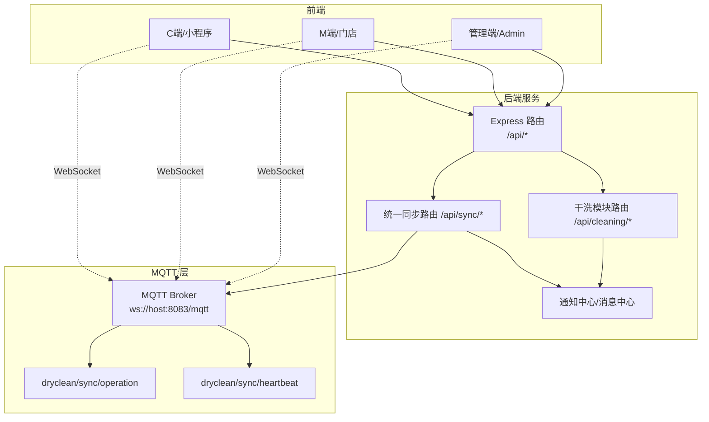
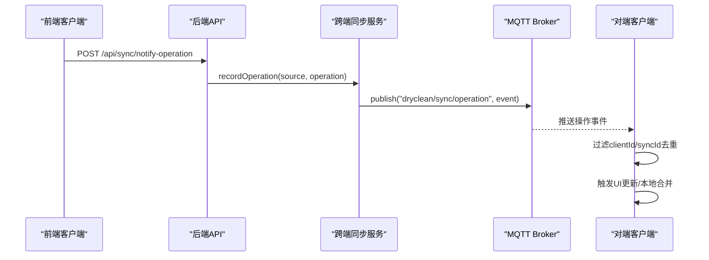
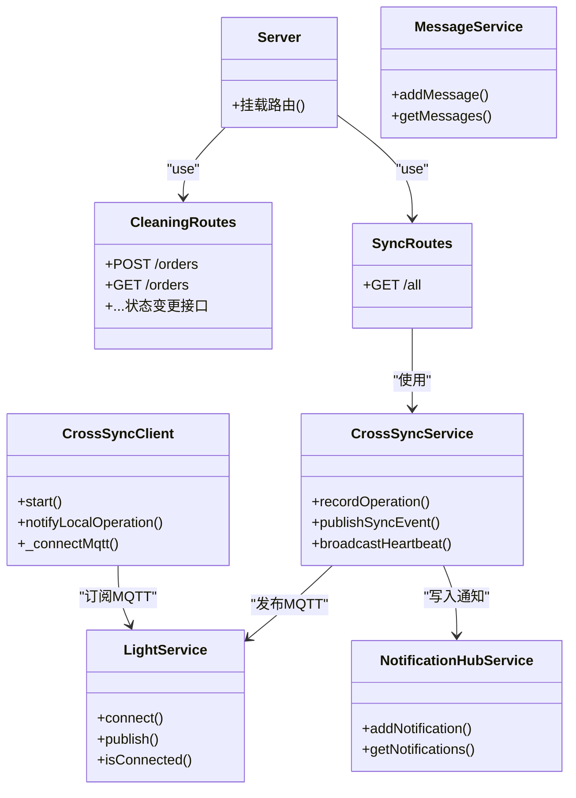

# 数据同步接口

<cite>
**本文引用的文件**
- [backend/server.js](file://backend/server.js)
- [backend/modules/cleaning/routes.js](file://backend/modules/cleaning/routes.js)
- [backend/modules/common/routes/syncRoutes.js](file://backend/modules/common/routes/syncRoutes.js)
- [backend/services/crossSyncService.js](file://backend/services/crossSyncService.js)
- [backend/services/lightService.js](file://backend/services/lightService.js)
- [backend/services/messageService.js](file://backend/services/messageService.js)
- [backend/services/notificationHubService.js](file://backend/services/notificationHubService.js)
- [js/data-sync.js](file://js/data-sync.js)
- [js/unified-sync.js](file://js/unified-sync.js)
- [js/order-sync.js](file://js/order-sync.js)
- [js/cross-sync-client.js](file://js/cross-sync-client.js)
- [DATA-SYNC-GUIDE.md](file://DATA-SYNC-GUIDE.md)
- [DATA-SYNC-TROUBLESHOOTING.md](file://DATA-SYNC-TROUBLESHOOTING.md)
</cite>

## 目录
1. [简介](#简介)
2. [项目结构](#项目结构)
3. [核心组件](#核心组件)
4. [架构总览](#架构总览)
5. [详细组件分析](#详细组件分析)
6. [依赖关系分析](#依赖关系分析)
7. [性能与一致性保障](#性能与一致性保障)
8. [故障排查指南](#故障排查指南)
9. [结论](#结论)
10. [附录：API 参考](#附录api-参考)

## 简介
本文件为跨端数据同步系统的完整 API 接口文档，覆盖基于 MQTT 的实时数据同步机制（订单状态同步、库存实时更新、消息推送等），以及数据版本控制、冲突解决、增量同步等高级特性。文档同时提供面向小程序端、Web 管理端、POS 终端等多端一致性的双向同步说明，并包含离线数据处理与断线重连机制、安全传输与完整性校验、性能优化建议，以及前端集成与调试工具使用说明。

## 项目结构
系统采用“后端 REST + MQTT 广播”的双通道同步架构：
- 后端提供统一数据同步 API，作为权威数据源；
- 通过 MQTT 主题进行跨端操作广播与心跳；
- 前端提供多套同步客户端，负责轮询、合并本地缓存、订阅 MQTT 事件与去重处理。

图表来源
- [backend/server.js:1-200](file://backend/server.js#L1-L200)
- [backend/modules/common/routes/syncRoutes.js:1-190](file://backend/modules/common/routes/syncRoutes.js#L1-L190)
- [backend/modules/cleaning/routes.js:1-200](file://backend/modules/cleaning/routes.js#L1-L200)
- [backend/services/crossSyncService.js:1-336](file://backend/services/crossSyncService.js#L1-L336)
- [backend/services/lightService.js:1-234](file://backend/services/lightService.js#L1-L234)
- [js/cross-sync-client.js:1-399](file://js/cross-sync-client.js#L1-L399)

章节来源
- [backend/server.js:1-200](file://backend/server.js#L1-L200)
- [backend/modules/common/routes/syncRoutes.js:1-190](file://backend/modules/common/routes/syncRoutes.js#L1-L190)
- [backend/modules/cleaning/routes.js:1-200](file://backend/modules/cleaning/routes.js#L1-L200)

## 核心组件
- 统一数据同步路由：提供聚合拉取用户、订单、会员、配送信息的接口，支持按类型增量查询。
- 跨端同步服务：维护在线客户端、操作记录、心跳广播，并通过 MQTT 广播对端操作，避免本地回显。
- 通知中心与消息中心：集中记录业务事件与消息线程，供管理端轮询或 WebSocket 推送。
- 智能灯条 MQTT 服务：连接 Broker，维护终端注册与心跳，支撑设备联动。
- 前端同步客户端：
  - DataSyncManager：统一拉取与合并用户、订单、会员、配送信息到本地存储。
  - UnifiedSync：面向 C/M/Admin 三端的统一同步封装，含本地备份与状态展示。
  - OrderSyncManager：历史兼容的订单同步管理器。
  - CrossSyncClient：MQTT 订阅与心跳、状态轮询、本地操作发布与去重。

章节来源
- [backend/modules/common/routes/syncRoutes.js:1-190](file://backend/modules/common/routes/syncRoutes.js#L1-L190)
- [backend/services/crossSyncService.js:1-336](file://backend/services/crossSyncService.js#L1-L336)
- [backend/services/messageService.js:1-247](file://backend/services/messageService.js#L1-L247)
- [backend/services/notificationHubService.js:1-264](file://backend/services/notificationHubService.js#L1-L264)
- [backend/services/lightService.js:1-234](file://backend/services/lightService.js#L1-L234)
- [js/data-sync.js:1-348](file://js/data-sync.js#L1-L348)
- [js/unified-sync.js:1-420](file://js/unified-sync.js#L1-L420)
- [js/order-sync.js:1-352](file://js/order-sync.js#L1-L352)
- [js/cross-sync-client.js:1-399](file://js/cross-sync-client.js#L1-L399)

## 架构总览
系统以“REST 权威数据源 + MQTT 实时广播”为核心，实现多端一致性与低延迟更新。关键流程包括：
- 全量/增量拉取：前端定时或触发式调用 /api/sync/all 获取最新数据，合并至本地。
- 跨端操作广播：任一端的写操作经后端记录后，通过 MQTT 主题 broadcast 给其他端，客户端根据 clientId/syncId 去重。
- 心跳与在线状态：客户端定期发送心跳，服务端周期性广播在线列表，用于 UI 指示与降级策略。
- 通知与消息：业务事件写入通知中心/消息中心，管理端可轮询或订阅。

图表来源
- [backend/services/crossSyncService.js:143-197](file://backend/services/crossSyncService.js#L143-L197)
- [js/cross-sync-client.js:347-371](file://js/cross-sync-client.js#L347-L371)
- [js/cross-sync-client.js:235-278](file://js/cross-sync-client.js#L235-L278)

## 详细组件分析

### 统一数据同步 API（/api/sync）
- GET /api/sync/all
  - 功能：聚合拉取 user、orders、member、delivery 四类数据，默认全部返回，可通过 types 参数选择。
  - 认证：Authorization: Bearer <token>，也兼容 query 中的 userId/openid/phone 做降级匹配。
  - 请求参数：
    - types: 逗号分隔的数据类型，如 user,orders,member,delivery
    - phone: 可选，跨平台手机号匹配增强
  - 响应格式：
    - success: boolean
    - timestamp: string
    - data: { user?, orders[], member?, delivery? }
  - 错误码：
    - 200: 成功
    - 500: 服务器内部错误

章节来源
- [backend/modules/common/routes/syncRoutes.js:20-187](file://backend/modules/common/routes/syncRoutes.js#L20-L187)

### 干洗订单 API（/api/cleaning）
- POST /api/cleaning/orders
  - 创建订单，支持 openid/userId 统一识别。
- GET /api/cleaning/orders
  - 获取订单列表，支持 JWT 或查询参数（userId/openid/phone）识别用户，支持分页、状态、门店过滤。
- GET /api/cleaning/orders/search/:keyword
  - 按订单号或ID搜索，支持 storeId 过滤。
- GET /api/cleaning/orders/:id
  - 获取订单详情。
- 状态变更相关（示例）：
  - POST /api/cleaning/orders/:id/cancel
  - POST /api/cleaning/orders/:id/receive
  - POST /api/cleaning/orders/:id/processing
  - POST /api/cleaning/orders/:id/complete
  - POST /api/cleaning/orders/:id/delivering
  - POST /api/cleaning/orders/:id/pickup
  - PUT /api/cleaning/orders/:id/status
- 支付与物流（示例）：
  - POST /api/cleaning/orders/:id/pay-delivery-fee
  - POST /api/cleaning/orders/:id/select-provider
  - POST /api/cleaning/orders/:id/scan-pickup
  - POST /api/cleaning/orders/batch-pickup
  - POST /api/cleaning/orders/:id/pay
  - GET /api/cleaning/orders/:id/status

章节来源
- [backend/modules/cleaning/routes.js:21-200](file://backend/modules/cleaning/routes.js#L21-L200)

### 跨端同步服务（CrossSyncService）
- 职责：
  - 记录跨端操作（source、type、action、orderId、orderNo、storeId、data、clientId、timestamp）。
  - 维护在线客户端 Map（type、storeId、lastHeartbeat、connectedAt）。
  - 通过 MQTT 广播操作事件与心跳。
  - 提供操作历史与同步状态摘要。
- 关键方法：
  - registerClient(clientId, clientInfo)
  - updateHeartbeat(clientId)
  - unregisterClient(clientId)
  - getOnlineClients()
  - recordOperation(source, operation)
  - publishSyncEvent(event)
  - broadcastHeartbeat()
  - getOperations(source, limit, since)
  - getSyncStatus()
- 内存限制与清理：
  - MAX_OPERATIONS=200，OPERATION_TTL=30分钟，每60秒清理过期操作与超时客户端。

章节来源
- [backend/services/crossSyncService.js:44-331](file://backend/services/crossSyncService.js#L44-L331)

### 通知中心与消息中心
- 通知中心（NotificationHubService）
  - 聚合订单事件、灯条事件等，支持 per-store 与全局通知，TTL=1小时。
  - 提供 getNotifications(storeId, limit, since)、markAsRead 等接口。
- 消息中心（MessageService）
  - 客户消息、账户消息、系统公告，保留7天，支持线程视图与未读计数。
  - 提供 getMessages(filters)、getThreads(storeId)、markAsRead/markThreadAsRead。

章节来源
- [backend/services/notificationHubService.js:17-264](file://backend/services/notificationHubService.js#L17-L264)
- [backend/services/messageService.js:15-247](file://backend/services/messageService.js#L15-L247)

### 智能灯条 MQTT 服务（LightService）
- 连接配置：从环境变量读取 broker、wsPort、keepalive、reconnectPeriod、clientPrefix。
- 订阅主题：light/status、light/heartbeat、主消息主题。
- 终端注册与心跳：维护 storeId -> lights 映射，HEARTBEAT_TIMEOUT=30s。
- 健康检查：ensureConnected 每30秒尝试重连。

章节来源
- [backend/services/lightService.js:1-234](file://backend/services/lightService.js#L1-L234)

### 前端同步客户端
- DataSyncManager（js/data-sync.js）
  - 启动/停止同步，定时拉取 /api/sync/all，合并用户、会员、订单、配送信息到 localStorage。
  - 自动在页面可见性变化、bfcache恢复、storage事件时触发同步。
- UnifiedSync（js/unified-sync.js）
  - 针对 C/M/Admin 三端分别定义 storageKey、endpoint、token 获取方式。
  - 提供 mergeToLocal、formatOrder、clearAndSync、getStatus 等能力。
- OrderSyncManager（js/order-sync.js）
  - 兼容旧版，按页面路径选择不同 API 端点与 token，支持门店过滤。
- CrossSyncClient（js/cross-sync-client.js）
  - 注册/心跳/注销（/api/sync/register、/api/sync/heartbeat、/api/sync/unregister）。
  - 订阅 dryclean/sync/operation 与 dryclean/sync/heartbeat，处理本地回显抑制与对端上下线回调。
  - 状态轮询 /api/sync/status。

章节来源
- [js/data-sync.js:1-348](file://js/data-sync.js#L1-L348)
- [js/unified-sync.js:1-420](file://js/unified-sync.js#L1-L420)
- [js/order-sync.js:1-352](file://js/order-sync.js#L1-L352)
- [js/cross-sync-client.js:1-399](file://js/cross-sync-client.js#L1-L399)

## 依赖关系分析
- server.js 挂载各模块路由，包括 cleaning、sync、admin、store 等。
- syncRoutes 依赖 authService、memberService、orderService 聚合数据。
- crossSyncService 依赖 lightService（MQTT 发布）、notificationHubService（写入通知）。
- 前端 CrossSyncClient 依赖 mqtt.js 与 /api/sync/* 系列 REST 接口。

图表来源
- [backend/server.js:1-200](file://backend/server.js#L1-L200)
- [backend/modules/cleaning/routes.js:1-200](file://backend/modules/cleaning/routes.js#L1-L200)
- [backend/modules/common/routes/syncRoutes.js:1-190](file://backend/modules/common/routes/syncRoutes.js#L1-L190)
- [backend/services/crossSyncService.js:1-336](file://backend/services/crossSyncService.js#L1-L336)
- [backend/services/lightService.js:1-234](file://backend/services/lightService.js#L1-L234)
- [backend/services/notificationHubService.js:1-264](file://backend/services/notificationHubService.js#L1-L264)
- [backend/services/messageService.js:1-247](file://backend/services/messageService.js#L1-L247)
- [js/cross-sync-client.js:1-399](file://js/cross-sync-client.js#L1-L399)

## 性能与一致性保障
- 增量同步
  - /api/sync/all 支持 types 参数按需拉取；前端 DataSyncManager 仅合并必要字段。
  - CrossSyncService.getOperations 支持 since 时间戳过滤，便于增量回放。
- 冲突解决
  - 前端合并策略以后端数据为准，保留本地特有字段（如 _localUpdated），避免覆盖权威数据。
  - 通过 syncId 与 clientId 去重，防止重复应用同一操作。
- 离线处理与断线重连
  - 前端在 bfcache 恢复、visibilitychange、storage 事件时主动触发同步。
  - CrossSyncClient 内置 MQTT 自动重连与心跳，失败时降级为 REST 轮询。
- 安全与完整性
  - 建议使用 HTTPS/WSS 部署（Broker ws://host:8083/mqtt 在生产环境应启用 TLS）。
  - 认证令牌通过 Authorization: Bearer 传递，敏感接口需鉴权中间件保护。
  - 建议在网关层启用签名校验与速率限制，防止恶意刷接口。

[本节为通用指导，不直接分析具体文件]

## 故障排查指南
- 常见问题定位
  - 端口不一致导致数据隔离：确保前后端与支付系统使用统一端口或正确代理转发。
  - 浏览器隔离：不同端口/域名的 localStorage 相互隔离，需在同一域名下测试。
  - 同步失败：查看控制台日志，确认 API 可达、JWT 有效、MQTT 连接正常。
- 快速诊断
  - 健康检查：GET /api/health
  - 手动触发同步：调用 DataSyncManager.manualSync() 或 UnifiedSync.manualSync()
  - 查看同步状态：DataSyncManager.getStatus() / UnifiedSync.getStatus()
- 日志与监控
  - 前端开启 verbose 日志，观察同步间隔与错误堆栈。
  - 后端关注 MQTT 连接与订阅日志，确认 Broker 可用。

章节来源
- [DATA-SYNC-GUIDE.md:1-251](file://DATA-SYNC-GUIDE.md#L1-L251)
- [DATA-SYNC-TROUBLESHOOTING.md:1-255](file://DATA-SYNC-TROUBLESHOOTING.md#L1-L255)
- [js/data-sync.js:1-348](file://js/data-sync.js#L1-L348)
- [js/unified-sync.js:1-420](file://js/unified-sync.js#L1-L420)
- [backend/server.js:85-90](file://backend/server.js#L85-L90)

## 结论
本系统通过 REST 权威数据源与 MQTT 实时广播相结合，实现了跨端数据的一致性与低延迟更新。前端具备完善的离线与重连策略，后端提供操作去重、心跳与在线状态管理能力。生产环境建议启用 HTTPS/WSS、完善鉴权与限流，并结合监控告警提升稳定性。

[本节为总结，不直接分析具体文件]

## 附录：API 参考

### 统一数据同步
- GET /api/sync/all
  - 请求头：Authorization: Bearer <token>
  - 查询参数：types=user,orders,member,delivery；phone=手机号（可选）
  - 响应体：{ success, timestamp, data: { user?, orders[], member?, delivery? } }
  - 错误码：200 成功；500 服务器错误

章节来源
- [backend/modules/common/routes/syncRoutes.js:20-187](file://backend/modules/common/routes/syncRoutes.js#L20-L187)

### 跨端同步管理（REST）
- POST /api/sync/register
  - 用途：客户端注册上线
  - 请求体：{ clientId, clientType, storeId, userAgent }
- POST /api/sync/heartbeat
  - 用途：心跳上报
  - 请求体：{ clientId }
- POST /api/sync/unregister
  - 用途：客户端下线注销
  - 请求体：{ clientId }
- POST /api/sync/notify-operation
  - 用途：发布本地操作，后端广播到 MQTT
  - 请求体：{ source, clientId, operation: { type, action, orderId, orderNo, storeId, data } }
- GET /api/sync/status
  - 用途：获取同步状态摘要（MQTT 连通、在线客户端、最近操作等）

章节来源
- [js/cross-sync-client.js:111-157](file://js/cross-sync-client.js#L111-L157)
- [js/cross-sync-client.js:314-329](file://js/cross-sync-client.js#L314-L329)
- [js/cross-sync-client.js:347-371](file://js/cross-sync-client.js#L347-L371)
- [backend/services/crossSyncService.js:290-305](file://backend/services/crossSyncService.js#L290-L305)

### 通知中心（Admin 轮询）
- GET /api/admin/notifications/:storeId
  - 查询参数：limit、since
- GET /api/admin/notifications
  - 汇总所有门店通知
- POST /api/admin/notifications/:storeId/mark-read
  - 请求体：{ notificationIds: number[] }

章节来源
- [backend/server.js:160-200](file://backend/server.js#L160-L200)
- [backend/services/notificationHubService.js:163-230](file://backend/services/notificationHubService.js#L163-L230)

### 消息中心
- GET /api/messages
  - 查询参数：storeId、type、threadId、limit、since
- GET /api/messages/threads/:storeId
  - 获取线程列表
- POST /api/messages/mark-read
  - 请求体：{ messageIds: number[] | threadId: string }

章节来源
- [backend/services/messageService.js:114-221](file://backend/services/messageService.js#L114-L221)

### 干洗订单（核心）
- POST /api/cleaning/orders
- GET /api/cleaning/orders
- GET /api/cleaning/orders/search/:keyword
- GET /api/cleaning/orders/:id
- 状态变更：cancel/receive/processing/complete/delivering/pickup/status
- 支付与物流：pay-delivery-fee/select-provider/scan-pickup/batch-pickup/pay/status

章节来源
- [backend/modules/cleaning/routes.js:21-200](file://backend/modules/cleaning/routes.js#L21-L200)

### 前端集成要点
- 引入顺序：先加载 api-config.js（若存在），再加载 cross-sync-client.js。
- 初始化：
  - CrossSyncClient.start({ type:'admin'|'store', onRemoteOperation, onSyncStatusChange })
  - DataSyncManager.start(types?)
  - UnifiedSync.start()
- 事件监听：
  - datasync:user、datasync:orders、datasync:member、datasync:delivery
  - unifiedSyncComplete
- 调试：
  - 控制台输出同步日志，必要时设置 enableLog=true
  - 手动触发：manualSync()
  - 查看状态：getStatus()

章节来源
- [js/cross-sync-client.js:53-96](file://js/cross-sync-client.js#L53-L96)
- [js/data-sync.js:78-106](file://js/data-sync.js#L78-L106)
- [js/unified-sync.js:89-109](file://js/unified-sync.js#L89-L109)