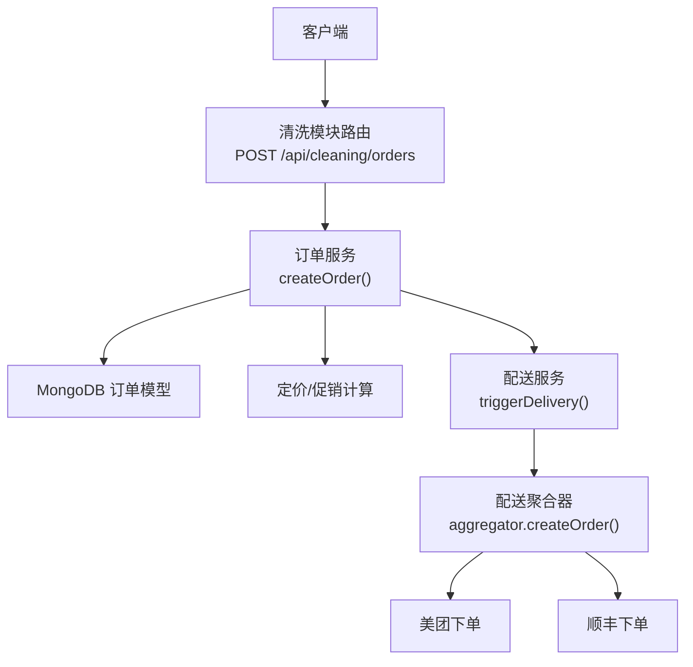
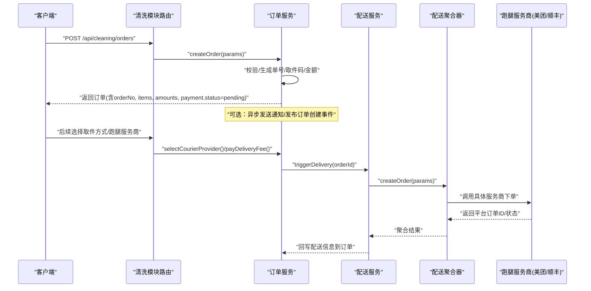
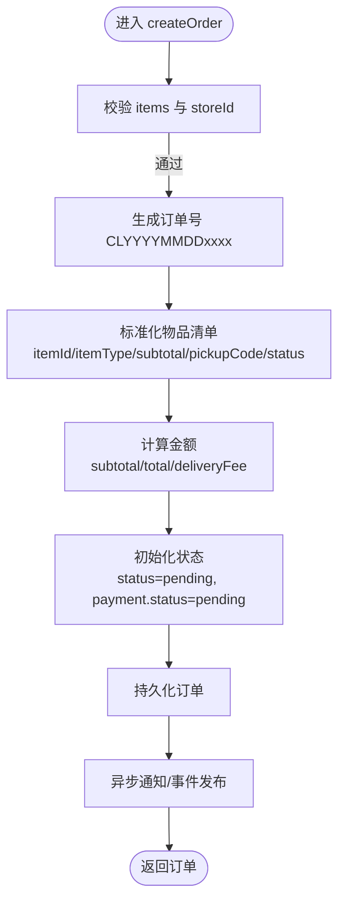
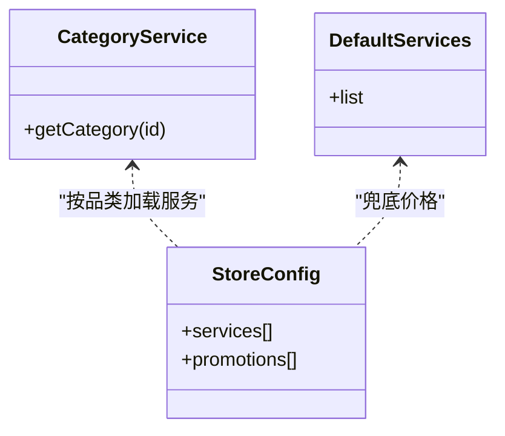
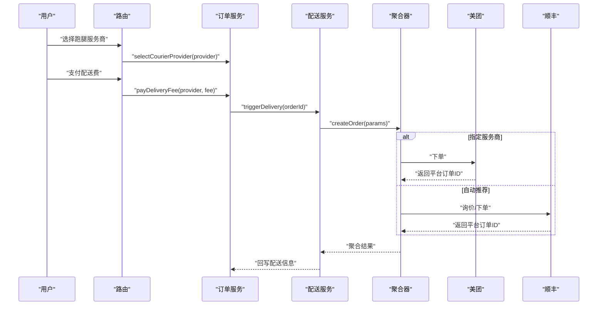
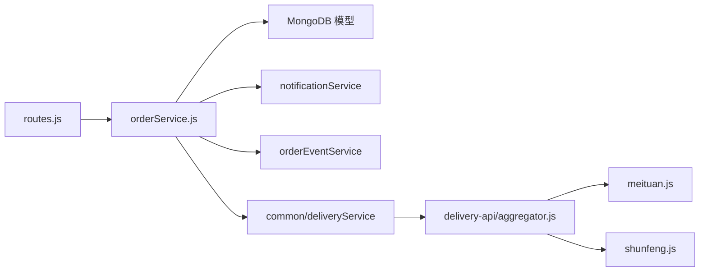

# 订单创建接口

<cite>
**本文引用的文件**   
- [backend/modules/cleaning/routes.js](file://backend/modules/cleaning/routes.js)
- [backend/modules/cleaning/services/orderService.js](file://backend/modules/cleaning/services/orderService.js)
- [backend/modules/common/services/categoryService.js](file://backend/modules/common/services/categoryService.js)
- [backend/data/store-configs/ST001.json](file://backend/data/store-configs/ST001.json)
- [backend/data/store-configs/ST002.json](file://backend/data/store-configs/ST002.json)
- [delivery-api/aggregator.js](file://delivery-api/aggregator.js)
- [delivery-api/providers/meituan.js](file://delivery-api/providers/meituan.js)
- [delivery-api/providers/shunfeng.js](file://delivery-api/providers/shunfeng.js)
- [delivery-api/server.js](file://delivery-api/server.js)
</cite>

## 目录
1. [简介](#简介)
2. [项目结构](#项目结构)
3. [核心组件](#核心组件)
4. [架构总览](#架构总览)
5. [详细组件分析](#详细组件分析)
6. [依赖关系分析](#依赖关系分析)
7. [性能与扩展性](#性能与扩展性)
8. [故障排查指南](#故障排查指南)
9. [结论](#结论)
10. [附录：API 规范与示例](#附录api-规范与示例)

## 简介
本文件面向“干洗店订单创建”场景，聚焦 POST /api/orders/create 的完整实现说明。结合仓库中实际代码路径，给出请求参数校验、订单号生成规则、物品清单处理、配送信息配置、金额计算逻辑、不同服务品类差异、取件码生成、支付状态初始化、门店选择、配送方式（自提/上门取件）、跑腿服务商集成、错误处理机制与常见问题解决方案等关键内容。

注意：仓库中干洗模块对外暴露的创建订单路由为 POST /api/cleaning/orders；若前端统一使用 /api/orders/create，请在网关或反向代理层做路由转发至 /api/cleaning/orders。

## 项目结构
围绕订单创建的核心链路涉及以下层次：
- 路由层：接收并校验请求，调用服务层
- 服务层：构建订单数据、生成单号与取件码、设置初始状态与金额、触发通知与事件
- 定价与品类：按品类与服务项计算价格，支持门店配置与促销折扣
- 配送与跑腿：根据取件方式与服务商配置，创建配送单并回写订单
- 外部集成：聚合器与各跑腿服务商（美团、顺丰等）



图表来源
- [backend/modules/cleaning/routes.js:24-42](file://backend/modules/cleaning/routes.js#L24-L42)
- [backend/modules/cleaning/services/orderService.js:181-291](file://backend/modules/cleaning/services/orderService.js#L181-L291)
- [delivery-api/aggregator.js:137-191](file://delivery-api/aggregator.js#L137-L191)
- [delivery-api/providers/meituan.js:41-77](file://delivery-api/providers/meituan.js#L41-L77)
- [delivery-api/providers/shunfeng.js:93-138](file://delivery-api/providers/shunfeng.js#L93-L138)

章节来源
- [backend/modules/cleaning/routes.js:24-42](file://backend/modules/cleaning/routes.js#L24-L42)
- [backend/modules/cleaning/services/orderService.js:181-291](file://backend/modules/cleaning/services/orderService.js#L181-L291)

## 核心组件
- 路由层：负责参数透传与基础异常捕获，将请求体合并用户标识后交由服务层处理
- 订单服务：实现订单创建主流程，包括参数校验、单号与取件码生成、物品清单标准化、金额汇总、配送与跑腿字段初始化、状态与历史日志写入、异步通知与事件发布
- 定价与品类：提供默认服务列表与门店级价格/促销配置，支持按门店匹配最终价格
- 配送聚合器：统一封装各跑腿服务商下单能力，支持指定服务商或自动推荐最优
- 跑腿服务商：美团、顺丰等具体实现，包含签名、参数映射与下单返回解析

章节来源
- [backend/modules/cleaning/routes.js:24-42](file://backend/modules/cleaning/routes.js#L24-L42)
- [backend/modules/cleaning/services/orderService.js:181-291](file://backend/modules/cleaning/services/orderService.js#L181-L291)
- [backend/modules/cleaning/services/orderService.js:1013-1029](file://backend/modules/cleaning/services/orderService.js#L1013-L1029)
- [backend/modules/common/services/categoryService.js:33-59](file://backend/modules/common/services/categoryService.js#L33-L59)
- [delivery-api/aggregator.js:137-191](file://delivery-api/aggregator.js#L137-L191)
- [delivery-api/providers/meituan.js:41-77](file://delivery-api/providers/meituan.js#L41-L77)
- [delivery-api/providers/shunfeng.js:93-138](file://delivery-api/providers/shunfeng.js#L93-L138)

## 架构总览
订单创建时序如下：



图表来源
- [backend/modules/cleaning/routes.js:24-42](file://backend/modules/cleaning/routes.js#L24-L42)
- [backend/modules/cleaning/services/orderService.js:181-291](file://backend/modules/cleaning/services/orderService.js#L181-L291)
- [backend/modules/cleaning/services/orderService.js:1582-1665](file://backend/modules/cleaning/services/orderService.js#L1582-L1665)
- [delivery-api/aggregator.js:137-191](file://delivery-api/aggregator.js#L137-L191)
- [delivery-api/providers/meituan.js:41-77](file://delivery-api/providers/meituan.js#L41-L77)
- [delivery-api/providers/shunfeng.js:93-138](file://delivery-api/providers/shunfeng.js#L93-L138)

## 详细组件分析

### 路由层：POST /api/cleaning/orders
- 功能：接收请求体，统一用户标识（优先 openid，其次 userId），调用 orderService.createOrder
- 响应：成功返回 { success: true, data: 订单对象 }；失败返回 { success: false, error: 消息 }
- 备注：若需对外暴露 /api/orders/create，请在网关层转发至 /api/cleaning/orders

章节来源
- [backend/modules/cleaning/routes.js:24-42](file://backend/modules/cleaning/routes.js#L24-L42)

### 订单服务：createOrder 主流程
- 必填校验：items 非空、storeId 非空
- 订单号生成：CL + YYYYMMDD + 4位随机数
- 物品清单处理：
  - 标准化 itemId、itemType/serviceType、quantity、subtotal、pickupCode、status
  - 每个物品独立取件码
- 配送与跑腿：
  - deliveryMethod 归一化（'pickup' -> 'store_pickup'）
  - selectedProvider 与 courierTracking 可传入，用于预置跑腿信息
- 金额计算：
  - subtotal 来自 items 汇总
  - total = subtotal + deliveryFee（如存在）
- 初始状态：
  - status: pending
  - payment.status: pending
  - cleaning.returnDate: 当前时间+3天
  - statusHistory: 记录创建事件
- 异步动作：
  - 发送订单创建通知
  - 发布订单创建事件（供 M端/Admin 实时同步）



图表来源
- [backend/modules/cleaning/services/orderService.js:181-291](file://backend/modules/cleaning/services/orderService.js#L181-L291)
- [backend/modules/cleaning/services/orderService.js:1013-1029](file://backend/modules/cleaning/services/orderService.js#L1013-L1029)

章节来源
- [backend/modules/cleaning/services/orderService.js:181-291](file://backend/modules/cleaning/services/orderService.js#L181-L291)
- [backend/modules/cleaning/services/orderService.js:1013-1029](file://backend/modules/cleaning/services/orderService.js#L1013-L1029)

### 定价与品类差异
- 系统默认服务列表：在清洗模块路由中提供默认服务项（如西装干洗、衬衫清洗、羽绒服清洗、鞋子清洗等）
- 门店配置：读取 data/store-configs/{storeId}.json 中的 services 与 promotions，覆盖默认价与促销
- 品类定义：categoryService 定义了多品类（cleaning、shoe_care 等）及其状态流与服务项



图表来源
- [backend/modules/common/services/categoryService.js:33-59](file://backend/modules/common/services/categoryService.js#L33-L59)
- [backend/data/store-configs/ST001.json:1-68](file://backend/data/store-configs/ST001.json#L1-L68)
- [backend/data/store-configs/ST002.json:1-68](file://backend/data/store-configs/ST002.json#L1-L68)
- [backend/modules/cleaning/routes.js:857-943](file://backend/modules/cleaning/routes.js#L857-L943)

章节来源
- [backend/modules/cleaning/routes.js:857-943](file://backend/modules/cleaning/routes.js#L857-L943)
- [backend/data/store-configs/ST001.json:1-68](file://backend/data/store-configs/ST001.json#L1-L68)
- [backend/data/store-configs/ST002.json:1-68](file://backend/data/store-configs/ST002.json#L1-L68)
- [backend/modules/common/services/categoryService.js:33-59](file://backend/modules/common/services/categoryService.js#L33-L59)

### 配送信息与跑腿服务商集成
- 取件方式：
  - 到店自提：deliveryMethod=store_pickup
  - 上门取件：deliveryMethod=courier，需选择跑腿服务商
- 选择跑腿服务商：
  - selectCourierProvider：设置 deliveryMethod、selectedProvider、deliveryFee（内置费率表）
- 支付配送费：
  - payDeliveryFee：标记 deliveryFeePaid=true，设置 deliveryStatus 与 courier.status 为“商家待出库”，触发灯条与配送服务
- 触发配送：
  - triggerDelivery：调用 common/deliveryService.createDelivery，内部走 delivery-api/aggregator
  - aggregator 支持指定服务商或自动询价推荐最优
  - 具体服务商（美团、顺丰）完成下单并返回平台订单ID



图表来源
- [backend/modules/cleaning/services/orderService.js:1509-1577](file://backend/modules/cleaning/services/orderService.js#L1509-L1577)
- [backend/modules/cleaning/services/orderService.js:1303-1438](file://backend/modules/cleaning/services/orderService.js#L1303-L1438)
- [backend/modules/cleaning/services/orderService.js:1582-1665](file://backend/modules/cleaning/services/orderService.js#L1582-L1665)
- [delivery-api/aggregator.js:137-191](file://delivery-api/aggregator.js#L137-L191)
- [delivery-api/providers/meituan.js:41-77](file://delivery-api/providers/meituan.js#L41-L77)
- [delivery-api/providers/shunfeng.js:93-138](file://delivery-api/providers/shunfeng.js#L93-L138)

章节来源
- [backend/modules/cleaning/services/orderService.js:1509-1577](file://backend/modules/cleaning/services/orderService.js#L1509-L1577)
- [backend/modules/cleaning/services/orderService.js:1303-1438](file://backend/modules/cleaning/services/orderService.js#L1303-L1438)
- [backend/modules/cleaning/services/orderService.js:1582-1665](file://backend/modules/cleaning/services/orderService.js#L1582-L1665)
- [delivery-api/aggregator.js:137-191](file://delivery-api/aggregator.js#L137-L191)
- [delivery-api/providers/meituan.js:41-77](file://delivery-api/providers/meituan.js#L41-L77)
- [delivery-api/providers/shunfeng.js:93-138](file://delivery-api/providers/shunfeng.js#L93-L138)

### 不同服务品类的订单创建差异
- 品类维度：cleaning（干洗）、shoe_care（鞋类护理）、luxury_care（奢侈品护理）、pet_grooming（宠物清洗）、electronics_repair（电子产品维修）
- 差异化点：
  - 服务项与价格：由 categoryService 与门店配置决定
  - 状态流：不同品类有各自的状态流转定义（例如洗护、寄养等）
  - 业务字段：如宠物寄养可能包含 petType、days、foodOption 等额外字段
- 建议：在 createOrder 时携带 categoryId 与 categoryType，以便后端正确设置 orderType 与后续流程分支

章节来源
- [backend/modules/common/services/categoryService.js:33-59](file://backend/modules/common/services/categoryService.js#L33-L59)
- [backend/modules/cleaning/services/orderService.js:235-274](file://backend/modules/cleaning/services/orderService.js#L235-L274)

## 依赖关系分析
- 路由层依赖：orderService、pricingService、认证与模块守卫中间件
- 服务层依赖：MongoDB 模型、通知服务、订单事件服务、配送服务
- 配送层依赖：delivery-api/aggregator 与各服务商实现
- 配置依赖：门店服务与促销配置（JSON 文件）



图表来源
- [backend/modules/cleaning/routes.js:24-42](file://backend/modules/cleaning/routes.js#L24-L42)
- [backend/modules/cleaning/services/orderService.js:181-291](file://backend/modules/cleaning/services/orderService.js#L181-L291)
- [delivery-api/aggregator.js:137-191](file://delivery-api/aggregator.js#L137-L191)
- [delivery-api/providers/meituan.js:41-77](file://delivery-api/providers/meituan.js#L41-L77)
- [delivery-api/providers/shunfeng.js:93-138](file://delivery-api/providers/shunfeng.js#L93-L138)

章节来源
- [backend/modules/cleaning/routes.js:24-42](file://backend/modules/cleaning/routes.js#L24-L42)
- [backend/modules/cleaning/services/orderService.js:181-291](file://backend/modules/cleaning/services/orderService.js#L181-L291)
- [delivery-api/aggregator.js:137-191](file://delivery-api/aggregator.js#L137-L191)

## 性能与扩展性
- 批量操作：一键取货接口已支持批量更新状态与关闭灯条
- 异步通知：订单创建与支付成功后异步发送通知与事件，避免阻塞主流程
- 可扩展点：
  - 新增跑腿服务商：在 delivery-api/providers 下实现，并在 aggregator 注册
  - 门店配置：通过 JSON 文件维护服务与促销，便于快速调整价格策略
  - 品类扩展：在 categoryService 中补充品类定义与服务项

[本节为通用指导，无需源码引用]

## 故障排查指南
- 常见错误
  - 缺少必要参数：items 为空或 storeId 缺失
  - 订单不存在：查询 orderId/orderNo 失败
  - 无权操作：非订单所有者或非管理员尝试修改
  - 状态不允许：在非允许状态下进行支付/取消/收件等操作
  - 配送信息不完整：缺少配送地址或联系方式导致无法创建配送单
- 定位方法
  - 查看路由与服务层日志输出（创建订单、支付、配送触发等）
  - 检查 MongoDB 订单文档的 statusHistory 与 payment 字段
  - 核对门店配置 ST001/ST002 的服务与促销是否生效
  - 确认 delivery-api 聚合器与服务商连通性与签名配置

章节来源
- [backend/modules/cleaning/routes.js:24-42](file://backend/modules/cleaning/routes.js#L24-L42)
- [backend/modules/cleaning/services/orderService.js:181-291](file://backend/modules/cleaning/services/orderService.js#L181-L291)
- [backend/modules/cleaning/services/orderService.js:1582-1665](file://backend/modules/cleaning/services/orderService.js#L1582-L1665)
- [backend/data/store-configs/ST001.json:1-68](file://backend/data/store-configs/ST001.json#L1-L68)
- [backend/data/store-configs/ST002.json:1-68](file://backend/data/store-configs/ST002.json#L1-L68)

## 结论
本接口以清洗模块为核心，实现了从订单创建、定价与促销、配送与跑腿集成的端到端流程。通过品类与门店配置驱动的价格体系、灵活的取件方式与跑腿服务商选择、完善的订单状态与事件机制，能够满足干洗、鞋类护理、奢侈品护理、宠物清洗、电子产品维修等多品类的订单创建需求。建议在网关层统一对外暴露 /api/orders/create 并转发至 /api/cleaning/orders，以提升前端接入一致性。

[本节为总结，无需源码引用]

## 附录：API 规范与示例

### 接口定义
- 方法：POST
- 路径：/api/orders/create（需在网关转发至 /api/cleaning/orders）
- 鉴权：可选（支持 openid/userId 识别用户）
- 请求体关键字段
  - userId/openid：用户标识（二选一）
  - storeId：门店编号（如 ST001）
  - items：物品清单数组
    - name：物品名称
    - itemType/serviceType：服务类型（可与 categoryId 一致）
    - material：材质（可选）
    - price：单价
    - quantity：数量（默认 1）
    - specialReq：特殊要求（可选）
  - delivery：配送信息
    - type：pickup | delivery
    - address：配送地址（字符串）
    - contactName：联系人姓名
    - contactPhone：联系人电话
    - fee：配送费（可选）
  - deliveryMethod：store_pickup | courier（pickup 会被归一化为 store_pickup）
  - selectedProvider：跑腿服务商（可选）
    - id：服务商标识（如 meituan/sf/jd/taobao）
  - courierTracking：跑腿跟踪信息（可选）
    - name/phone/orderId/status/progress/distance/eta/assignedAt
  - amounts：金额（可选，未传则服务端计算）
    - subtotal/discount/deliveryFee/total
  - categoryId/categoryType：品类标识（可选）

- 响应体
  - success：布尔
  - data：订单对象
    - orderNo：订单号（CLYYYYMMDDxxxx）
    - items：标准化后的物品清单（含 pickupCode、status、subtotal）
    - amounts：金额明细
    - payment.status：pending
    - status：pending
    - deliveryMethod：store_pickup 或 courier
    - selectedProvider/courier：跑腿信息（如传入）

### 请求示例
```json
{
  "userId": "u_12345",
  "storeId": "ST001",
  "categoryId": "cleaning",
  "categoryType": "cleaning",
  "items": [
    {
      "name": "西装干洗",
      "itemType": "dry_clean",
      "serviceType": "dry_clean",
      "material": "羊毛",
      "price": 50,
      "quantity": 1,
      "specialReq": "请熨烫"
    },
    {
      "name": "运动鞋清洗",
      "itemType": "shoe_clean",
      "serviceType": "shoe_clean",
      "price": 38,
      "quantity": 1
    }
  ],
  "delivery": {
    "type": "delivery",
    "address": "北京市朝阳区某某路123号",
    "contactName": "张三",
    "contactPhone": "13800001111",
    "fee": 12
  },
  "deliveryMethod": "courier",
  "selectedProvider": {
    "id": "meituan"
  },
  "amounts": {
    "subtotal": 88,
    "discount": 0,
    "deliveryFee": 12,
    "total": 100
  }
}
```

### 响应示例
```json
{
  "success": true,
  "data": {
    "orderNo": "CL202605010001",
    "items": [
      {
        "itemId": "ITEM-uuid...",
        "name": "西装干洗",
        "itemType": "dry_clean",
        "serviceType": "dry_clean",
        "material": "羊毛",
        "price": 50,
        "quantity": 1,
        "subtotal": 50,
        "specialReq": "请熨烫",
        "pickupCode": "P000123",
        "status": "pending"
      },
      {
        "itemId": "ITEM-uuid...",
        "name": "运动鞋清洗",
        "itemType": "shoe_clean",
        "serviceType": "shoe_clean",
        "price": 38,
        "quantity": 1,
        "subtotal": 38,
        "pickupCode": "P000456",
        "status": "pending"
      }
    ],
    "amounts": {
      "subtotal": 88,
      "discount": 0,
      "deliveryFee": 12,
      "total": 100
    },
    "payment": {
      "status": "pending"
    },
    "status": "pending",
    "deliveryMethod": "courier",
    "selectedProvider": "meituan",
    "courier": {
      "provider": "meituan",
      "status": "picking",
      "progress": 0
    }
  }
}
```

### 业务规则要点
- 订单号生成：CL + 年月日 + 4位随机数
- 取件码生成：P + 6位随机数（每个物品独立）
- 金额计算：服务端会基于 items 汇总 subtotal，并加上 deliveryFee 得到 total（如未传入 amounts）
- 支付状态：初始为 pending
- 取件方式：pickup 将被归一化为 store_pickup；courier 表示上门取件
- 跑腿服务商：支持 meituan/sf/jd/taobao，内置费率表，可在选择时设置 deliveryFee
- 配送触发：支付配送费后，自动触发配送服务并回写配送信息

章节来源
- [backend/modules/cleaning/services/orderService.js:181-291](file://backend/modules/cleaning/services/orderService.js#L181-L291)
- [backend/modules/cleaning/services/orderService.js:1013-1029](file://backend/modules/cleaning/services/orderService.js#L1013-L1029)
- [backend/modules/cleaning/services/orderService.js:1509-1577](file://backend/modules/cleaning/services/orderService.js#L1509-L1577)
- [backend/modules/cleaning/services/orderService.js:1303-1438](file://backend/modules/cleaning/services/orderService.js#L1303-L1438)
- [backend/modules/cleaning/services/orderService.js:1582-1665](file://backend/modules/cleaning/services/orderService.js#L1582-L1665)
- [delivery-api/aggregator.js:137-191](file://delivery-api/aggregator.js#L137-L191)
- [delivery-api/providers/meituan.js:41-77](file://delivery-api/providers/meituan.js#L41-L77)
- [delivery-api/providers/shunfeng.js:93-138](file://delivery-api/providers/shunfeng.js#L93-L138)