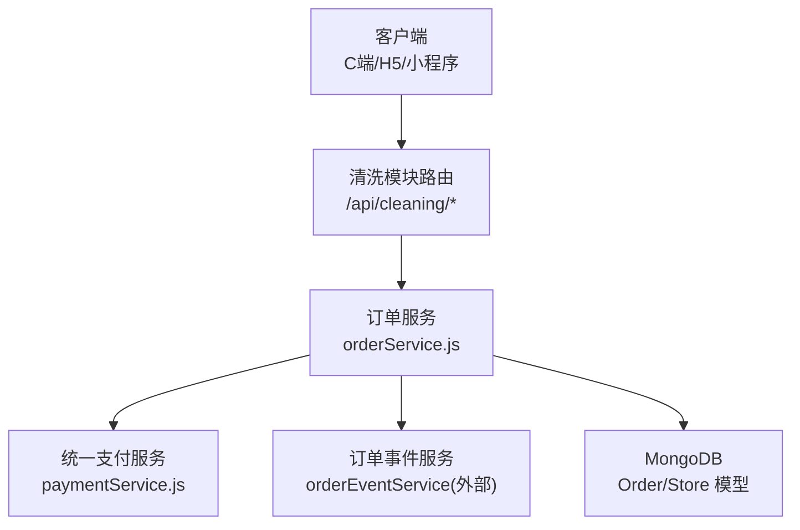
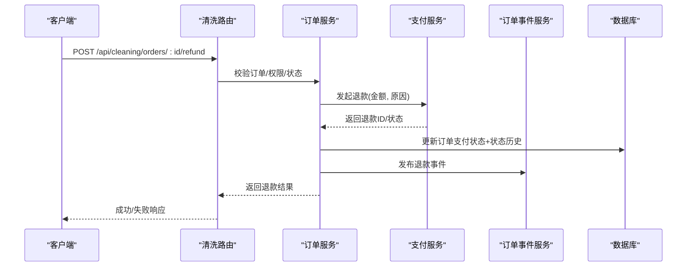
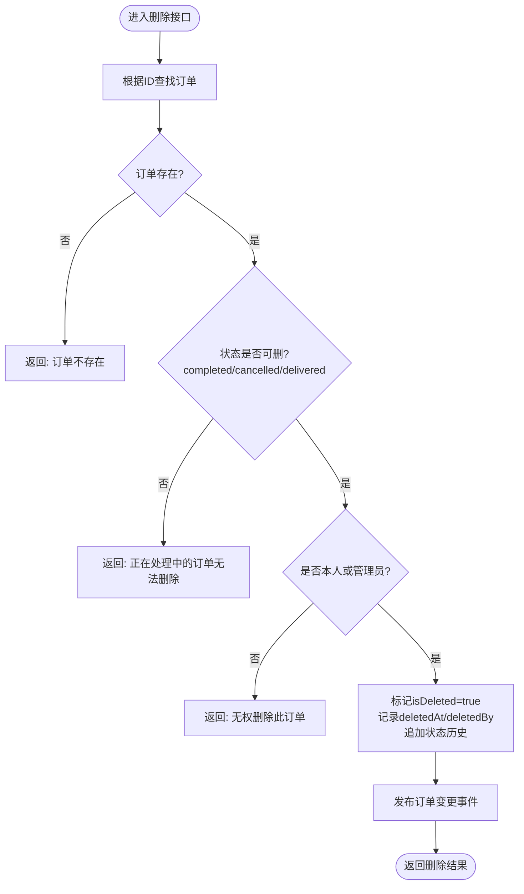
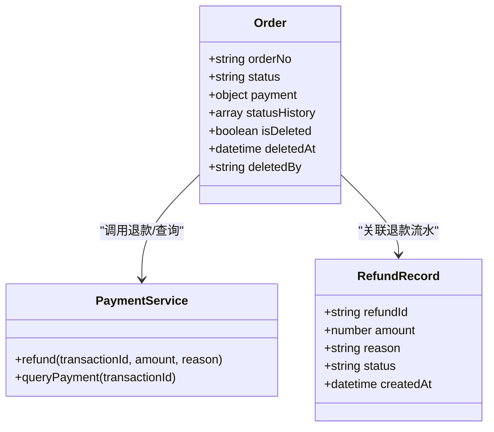
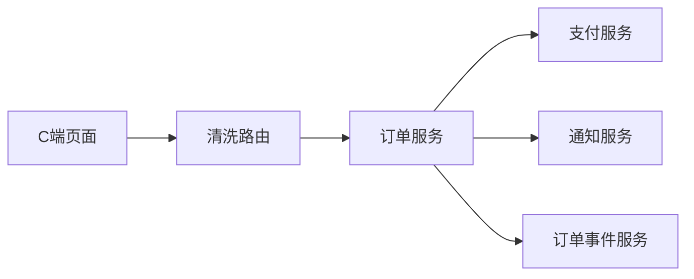

# 订单售后服务接口

<cite>
**本文引用的文件**   
- [backend/modules/cleaning/services/orderService.js](file://backend/modules/cleaning/services/orderService.js)
- [backend/modules/cleaning/routes.js](file://backend/modules/cleaning/routes.js)
- [backend/modules/common/services/paymentService.js](file://backend/modules/common/services/paymentService.js)
- [api/API_DOCUMENTATION.md](file://api/API_DOCUMENTATION.md)
- [api/payment-api.js](file://api/payment-api.js)
- [c-orders.html](file://c-orders.html)
</cite>

## 目录
1. [简介](#简介)
2. [项目结构](#项目结构)
3. [核心组件](#核心组件)
4. [架构总览](#架构总览)
5. [详细组件分析](#详细组件分析)
6. [依赖关系分析](#依赖关系分析)
7. [性能考虑](#性能考虑)
8. [故障排查指南](#故障排查指南)
9. [结论](#结论)
10. [附录：售后接口规范](#附录售后接口规范)

## 简介
本文件为干洗店系统的“订单售后服务”相关接口的完整文档，覆盖以下能力：
- 订单删除（软删除）：状态限制、权限控制、数据保留策略
- 退款申请与跟踪：原因记录、状态流转、与支付系统对接
- 投诉处理与纠纷处理：工单化流程、升级与闭环
- 评价管理：数据结构、评分机制、防刷与审核
- 售后工单管理与客户满意度调查：高级功能接口规范

目标读者包括后端开发、前端/小程序开发、测试与运维人员。

## 项目结构
围绕售后能力的核心代码位于清洗模块与服务层：
- 路由层：提供 HTTP 接口定义与鉴权中间件
- 服务层：实现业务规则、状态机、权限校验、事件发布
- 支付服务：统一支付与退款抽象，预留多通道实现
- 前端示例：C端页面演示取消/退款/删除等交互

图表来源
- [backend/modules/cleaning/routes.js:1-120](file://backend/modules/cleaning/routes.js#L1-L120)
- [backend/modules/cleaning/services/orderService.js:1-120](file://backend/modules/cleaning/services/orderService.js#L1-L120)
- [backend/modules/common/services/paymentService.js:1-60](file://backend/modules/common/services/paymentService.js#L1-L60)

章节来源
- [backend/modules/cleaning/routes.js:1-120](file://backend/modules/cleaning/routes.js#L1-L120)
- [backend/modules/cleaning/services/orderService.js:1-120](file://backend/modules/cleaning/services/orderService.js#L1-L120)
- [backend/modules/common/services/paymentService.js:1-60](file://backend/modules/common/services/paymentService.js#L1-L60)

## 核心组件
- 订单服务（OrderService）
  - 负责订单生命周期、状态机、软删除、权限校验、通知与事件发布
- 统一支付服务（PaymentService）
  - 封装多渠道支付/退款/分账的抽象接口，当前为模拟实现
- 清洗模块路由（routes.js）
  - 暴露 C端/M端/Admin 使用的 REST 接口，包含售后相关路径

章节来源
- [backend/modules/cleaning/services/orderService.js:177-660](file://backend/modules/cleaning/services/orderService.js#L177-L660)
- [backend/modules/common/services/paymentService.js:9-185](file://backend/modules/common/services/paymentService.js#L9-L185)
- [backend/modules/cleaning/routes.js:1-120](file://backend/modules/cleaning/routes.js#L1-L120)

## 架构总览
售后主流程（以“申请退款”为例）：
- 客户端发起退款申请
- 路由层校验参数与权限
- 订单服务校验订单状态与可退条件
- 调用支付服务发起退款并记录退款流水
- 更新订单支付状态与状态历史
- 发布事件同步到 M端/Admin

图表来源
- [backend/modules/cleaning/routes.js:150-200](file://backend/modules/cleaning/routes.js#L150-L200)
- [backend/modules/cleaning/services/orderService.js:560-660](file://backend/modules/cleaning/services/orderService.js#L560-L660)
- [backend/modules/common/services/paymentService.js:175-185](file://backend/modules/common/services/paymentService.js#L175-L185)

## 详细组件分析

### 订单删除（软删除）
- 接口
  - POST /api/cleaning/orders/:id/delete
- 业务规则
  - 仅允许终态订单删除：已完成、已取消、已取件（对应状态枚举中的 completed、cancelled、delivered）
  - 权限控制：仅订单所有者或管理员可删除
  - 软删除：设置 isDeleted=true，记录 deletedAt/deletedBy，并从常规查询中隐藏
  - 事件：触发订单变更事件，用于 M端/Admin 同步
- 错误处理
  - 订单不存在、非终态、无权限时返回明确错误信息
- 数据保留策略
  - 不物理删除，保留审计字段与状态历史，便于追溯

图表来源
- [backend/modules/cleaning/routes.js:175-190](file://backend/modules/cleaning/routes.js#L175-L190)
- [backend/modules/cleaning/services/orderService.js:618-660](file://backend/modules/cleaning/services/orderService.js#L618-L660)

章节来源
- [backend/modules/cleaning/routes.js:175-190](file://backend/modules/cleaning/routes.js#L175-L190)
- [backend/modules/cleaning/services/orderService.js:618-660](file://backend/modules/cleaning/services/orderService.js#L618-L660)

### 退款申请与跟踪
- 接口
  - 建议新增：POST /api/cleaning/orders/:id/refund
  - 支付侧参考：POST /api/payment/refund（见支付API文档）
- 请求体（建议）
  - orderId: 订单ID或订单号
  - amount: 退款金额（元）
  - reason: 退款原因（必填）
  - method: 原路退回标识（可选）
- 业务规则
  - 仅已支付且未完全退款的订单可申请
  - 支持部分退款；累计退款金额不得超过实付金额
  - 退款原因需记录至订单状态历史与退款流水
  - 退款成功后更新订单支付状态为 refunded
- 与支付系统集成
  - 通过统一支付服务 refund(transactionId, amount, reason) 发起
  - 返回退款ID与状态（processing/refunded），后续可通过查询接口轮询
- 错误处理
  - 订单不存在、不可退、金额超限、支付渠道异常等

图表来源
- [backend/modules/cleaning/services/orderService.js:33-151](file://backend/modules/cleaning/services/orderService.js#L33-L151)
- [backend/modules/common/services/paymentService.js:175-185](file://backend/modules/common/services/paymentService.js#L175-L185)

章节来源
- [backend/modules/cleaning/services/orderService.js:518-616](file://backend/modules/cleaning/services/orderService.js#L518-L616)
- [backend/modules/common/services/paymentService.js:175-185](file://backend/modules/common/services/paymentService.js#L175-L185)
- [api/API_DOCUMENTATION.md:80-92](file://api/API_DOCUMENTATION.md#L80-L92)

### 投诉处理与纠纷处理（售后工单）
- 接口
  - 建议新增：
    - POST /api/cleaning/complaints（创建投诉）
    - GET /api/cleaning/complaints/:id（详情）
    - PUT /api/cleaning/complaints/:id（处理/升级/关闭）
    - GET /api/cleaning/complaints?orderId=xxx&status=pending（列表）
- 数据结构（建议）
  - id, orderId, type(质量/配送/其他), level(普通/紧急), status(pending/investigating/resolved/closed),
    description, evidence[], assignee, history[], createdAt, updatedAt
- 业务规则
  - 仅订单完成后可提交投诉；同一订单可多次投诉但需去重
  - 自动分配客服或升级至主管；超时未处理自动升级
  - 处理过程留痕（history），支持附件证据
- 与订单联动
  - 若判定责任在门店，可触发补偿（优惠券/积分）
  - 严重纠纷可冻结订单资金结算（结合支付分账）

章节来源
- [backend/modules/cleaning/services/orderService.js:121-151](file://backend/modules/cleaning/services/orderService.js#L121-L151)
- [backend/modules/common/services/paymentService.js:96-173](file://backend/modules/common/services/paymentService.js#L96-L173)

### 评价管理
- 接口
  - 建议新增：
    - POST /api/cleaning/orders/:id/review（提交评价）
    - GET /api/cleaning/orders/:id/review（查看评价）
    - PUT /api/cleaning/orders/:id/review（修改/申诉）
- 数据结构（建议）
  - orderId, rating(1-5), tags[], comment, photos[], reviewerId, createdAt, isPublic, auditStatus
- 评分机制
  - 用户评分1-5星；平台可加权计算店铺评分
  - 防刷：同用户对同一订单仅一次有效评价；异常评价可人工审核
- 与信用体系联动
  - 提交评价加分；虚假评价扣分（参考信用服务）

章节来源
- [backend/modules/cleaning/services/orderService.js:121-151](file://backend/modules/cleaning/services/orderService.js#L121-L151)
- [backend/modules/common/services/creditService.js:1-121](file://backend/modules/common/services/creditService.js#L1-L121)

### 客户满意度调查
- 接口
  - 建议新增：
    - POST /api/cleaning/surveys（提交满意度）
    - GET /api/cleaning/surveys?orderId=xxx（查看）
- 数据结构（建议）
  - orderId, score(1-10), dimensions{service, delivery, quality}, comments, createdAt
- 业务规则
  - 订单完成后开放；匿名可选；用于运营分析与改进

章节来源
- [backend/modules/cleaning/services/orderService.js:121-151](file://backend/modules/cleaning/services/orderService.js#L121-L151)

## 依赖关系分析
- 路由层依赖订单服务与鉴权中间件
- 订单服务依赖支付服务、通知服务、订单事件服务
- 支付服务为抽象层，具体通道由上层扩展
- 前端示例（c-orders.html）演示了本地删除与网络回退逻辑

图表来源
- [backend/modules/cleaning/routes.js:1-120](file://backend/modules/cleaning/routes.js#L1-L120)
- [backend/modules/cleaning/services/orderService.js:1-120](file://backend/modules/cleaning/services/orderService.js#L1-L120)
- [backend/modules/common/services/paymentService.js:1-60](file://backend/modules/common/services/paymentService.js#L1-L60)
- [c-orders.html:1322-1345](file://c-orders.html#L1322-L1345)

章节来源
- [backend/modules/cleaning/routes.js:1-120](file://backend/modules/cleaning/routes.js#L1-L120)
- [backend/modules/cleaning/services/orderService.js:1-120](file://backend/modules/cleaning/services/orderService.js#L1-L120)
- [backend/modules/common/services/paymentService.js:1-60](file://backend/modules/common/services/paymentService.js#L1-L60)
- [c-orders.html:1322-1345](file://c-orders.html#L1322-L1345)

## 性能考虑
- 软删除查询默认排除已删除记录，避免全表扫描
- 退款操作尽量异步化（事件通知、日志落盘）
- 评价与投诉批量导出采用分页与索引优化
- 支付回调幂等处理，防止重复退款

[本节为通用指导，无需源码引用]

## 故障排查指南
- 删除失败
  - 检查订单状态是否为终态
  - 确认当前用户是否为订单所有者或管理员
  - 查看状态历史是否记录了删除动作
- 退款失败
  - 核对订单支付状态与已退金额
  - 检查支付服务返回码与重试策略
  - 关注退款流水与订单状态一致性
- 评价/投诉异常
  - 检查唯一约束（同订单单次评价）
  - 审核流程是否被跳过或卡住

章节来源
- [backend/modules/cleaning/services/orderService.js:618-660](file://backend/modules/cleaning/services/orderService.js#L618-L660)
- [backend/modules/common/services/paymentService.js:175-185](file://backend/modules/common/services/paymentService.js#L175-L185)

## 结论
本方案基于现有订单与支付服务，构建了完整的售后能力边界与接口规范。通过软删除、退款流水、投诉工单与评价体系的组合，形成可追溯、可扩展的售后闭环。后续可按需接入真实支付通道与消息队列，提升可靠性与实时性。

[本节为总结，无需源码引用]

## 附录：售后接口规范

### 1. 订单删除（软删除）
- 方法/路径
  - POST /api/cleaning/orders/:id/delete
- 认证
  - optionalAuth（支持JWT或userId透传）
- 请求体
  - 无
- 响应
  - success: true/false
  - data: { orderId, orderNo, status, isDeleted }
  - error: 错误信息
- 业务规则
  - 仅终态订单可删；本人或管理员可删；软删除并记录审计字段
- 错误码
  - 400: 订单不存在/非终态/无权限

章节来源
- [backend/modules/cleaning/routes.js:175-190](file://backend/modules/cleaning/routes.js#L175-L190)
- [backend/modules/cleaning/services/orderService.js:618-660](file://backend/modules/cleaning/services/orderService.js#L618-L660)

### 2. 退款申请
- 方法/路径
  - POST /api/cleaning/orders/:id/refund
- 认证
  - optionalAuth
- 请求体
  - amount: number（元）
  - reason: string（必填）
  - method: string（可选，原路退回）
- 响应
  - success: true/false
  - data: { refundId, status, amount }
  - error: 错误信息
- 业务规则
  - 仅已支付且未完全退款；支持部分退款；记录原因与状态历史
- 错误码
  - 400: 订单不存在/不可退/金额超限/支付异常

章节来源
- [backend/modules/cleaning/services/orderService.js:518-616](file://backend/modules/cleaning/services/orderService.js#L518-L616)
- [backend/modules/common/services/paymentService.js:175-185](file://backend/modules/common/services/paymentService.js#L175-L185)
- [api/API_DOCUMENTATION.md:80-92](file://api/API_DOCUMENTATION.md#L80-L92)

### 3. 退款查询
- 方法/路径
  - GET /api/cleaning/orders/:id/refund/:refundId
- 认证
  - optionalAuth
- 响应
  - success: true/false
  - data: { refundId, amount, status, createdAt, updatedAt }
  - error: 错误信息

章节来源
- [backend/modules/common/services/paymentService.js:179-181](file://backend/modules/common/services/paymentService.js#L179-L181)

### 4. 投诉创建
- 方法/路径
  - POST /api/cleaning/complaints
- 认证
  - optionalAuth
- 请求体
  - orderId: string
  - type: enum(quality/delivery/other)
  - level: enum(normal/urgent)
  - description: string
  - evidence: array[string]
- 响应
  - success: true/false
  - data: { id, status, assignee }
  - error: 错误信息

章节来源
- [backend/modules/cleaning/services/orderService.js:121-151](file://backend/modules/cleaning/services/orderService.js#L121-L151)

### 5. 投诉处理
- 方法/路径
  - PUT /api/cleaning/complaints/:id
- 认证
  - optionalAuth（客服/管理员）
- 请求体
  - action: enum(resolve/close/escalate)
  - note: string
- 响应
  - success: true/false
  - data: { id, status, history }
  - error: 错误信息

章节来源
- [backend/modules/cleaning/services/orderService.js:121-151](file://backend/modules/cleaning/services/orderService.js#L121-L151)

### 6. 评价提交
- 方法/路径
  - POST /api/cleaning/orders/:id/review
- 认证
  - optionalAuth
- 请求体
  - rating: int(1-5)
  - tags: array[string]
  - comment: string
  - photos: array[string]
- 响应
  - success: true/false
  - data: { reviewId, auditStatus }
  - error: 错误信息

章节来源
- [backend/modules/cleaning/services/orderService.js:121-151](file://backend/modules/cleaning/services/orderService.js#L121-L151)

### 7. 满意度调查
- 方法/路径
  - POST /api/cleaning/surveys
- 认证
  - optionalAuth
- 请求体
  - orderId: string
  - score: int(1-10)
  - dimensions: object(service, delivery, quality)
  - comments: string
- 响应
  - success: true/false
  - data: { surveyId }
  - error: 错误信息

章节来源
- [backend/modules/cleaning/services/orderService.js:121-151](file://backend/modules/cleaning/services/orderService.js#L121-L151)

### 8. 前端示例说明（删除/取消/退款）
- 删除
  - 前端在调用后端删除失败时，仍执行本地清理并记录已删除ID，防止同步拉回
- 取消/退款
  - 前端构造取消/退款请求，包含原因与原路退回标识，并在成功后刷新订单列表

章节来源
- [c-orders.html:1322-1345](file://c-orders.html#L1322-L1345)
- [c-orders.html:1036-1062](file://c-orders.html#L1036-L1062)