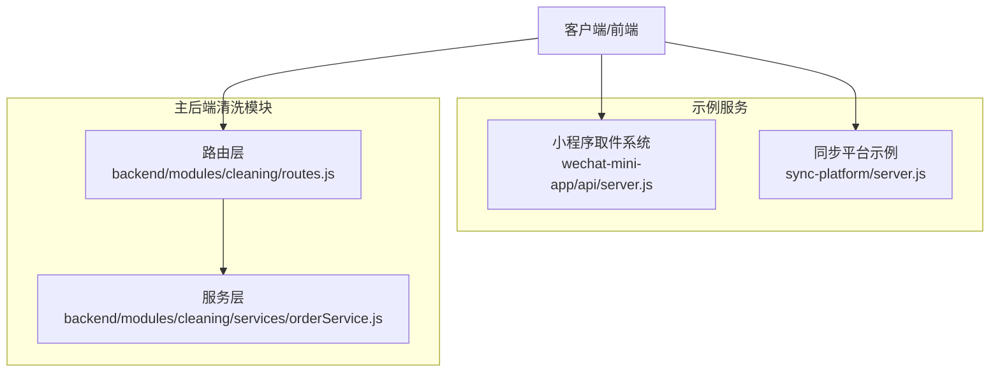
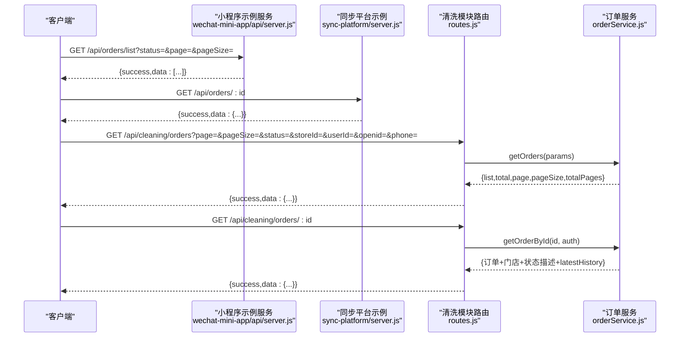
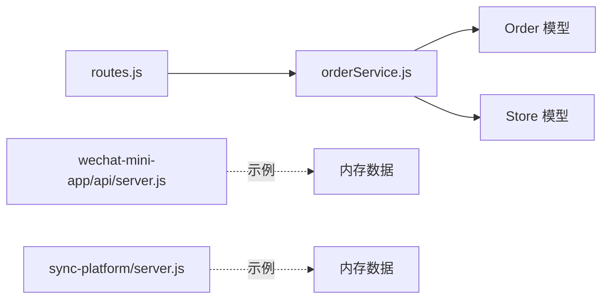

# 订单查询接口

<cite>
**本文引用的文件**
- [backend/modules/cleaning/routes.js](file://backend/modules/cleaning/routes.js)
- [backend/modules/cleaning/services/orderService.js](file://backend/modules/cleaning/services/orderService.js)
- [wechat-mini-app/api/server.js](file://wechat-mini-app/api/server.js)
- [sync-platform/server.js](file://sync-platform/server.js)
</cite>

## 目录
1. [简介](#简介)
2. [项目结构](#项目结构)
3. [核心组件](#核心组件)
4. [架构总览](#架构总览)
5. [详细组件分析](#详细组件分析)
6. [依赖关系分析](#依赖关系分析)
7. [性能考虑](#性能考虑)
8. [故障排查指南](#故障排查指南)
9. [结论](#结论)
10. [附录](#附录)

## 简介
本文件为干洗店“订单查询”接口的完整API文档，聚焦以下两个端点：
- GET /api/orders/list（小程序取件系统示例实现）
- GET /api/orders/:id（同步平台示例实现）

同时补充说明与主后端一致的“清洗模块”订单查询能力（GET /api/cleaning/orders 与 GET /api/cleaning/orders/:id），用于解释跨平台查询机制、权限控制、分页与筛选、排序规则以及详情填充逻辑。

## 项目结构
- 小程序取件系统示例服务：提供 /api/orders/list 的简化实现，包含基础分页与状态映射。
- 同步平台示例服务：提供 /api/orders/:id 的简化实现，按ID返回订单详情。
- 主后端清洗模块：提供生产级订单列表与详情接口，支持多标识跨平台查询、门店信息关联、状态描述与最新历史记录填充等。

图示来源
- [wechat-mini-app/api/server.js:80-118](file://wechat-mini-app/api/server.js#L80-L118)
- [sync-platform/server.js:117-133](file://sync-platform/server.js#L117-L133)
- [backend/modules/cleaning/routes.js:48-81](file://backend/modules/cleaning/routes.js#L48-L81)
- [backend/modules/cleaning/services/orderService.js:295-389](file://backend/modules/cleaning/services/orderService.js#L295-L389)

章节来源
- [wechat-mini-app/api/server.js:80-118](file://wechat-mini-app/api/server.js#L80-L118)
- [sync-platform/server.js:117-133](file://sync-platform/server.js#L117-L133)
- [backend/modules/cleaning/routes.js:48-81](file://backend/modules/cleaning/routes.js#L48-L81)
- [backend/modules/cleaning/services/orderService.js:295-389](file://backend/modules/cleaning/services/orderService.js#L295-L389)

## 核心组件
- 小程序取件系统示例服务
  - 提供 GET /api/orders/list，支持 status、page、pageSize 参数；返回分页后的订单列表，并附带状态文本映射。
- 同步平台示例服务
  - 提供 GET /api/orders/:id，按ID查找订单并返回详情。
- 主后端清洗模块
  - 提供 GET /api/cleaning/orders（列表）与 GET /api/cleaning/orders/:id（详情）。
  - 列表支持 userId/openid/phone 多标识识别、status/storeId 筛选、分页与排序（按创建时间倒序）。
  - 详情支持通过 _id 或 orderNo 查询，自动填充门店信息与状态描述，提取最新历史记录。

章节来源
- [wechat-mini-app/api/server.js:80-118](file://wechat-mini-app/api/server.js#L80-L118)
- [sync-platform/server.js:117-133](file://sync-platform/server.js#L117-L133)
- [backend/modules/cleaning/routes.js:48-81](file://backend/modules/cleaning/routes.js#L48-L81)
- [backend/modules/cleaning/routes.js:146-156](file://backend/modules/cleaning/routes.js#L146-L156)
- [backend/modules/cleaning/services/orderService.js:295-389](file://backend/modules/cleaning/services/orderService.js#L295-L389)
- [backend/modules/cleaning/services/orderService.js:395-516](file://backend/modules/cleaning/services/orderService.js#L395-L516)

## 架构总览
下图展示从请求到响应的调用链，包括示例服务与主后端的差异。

图示来源
- [wechat-mini-app/api/server.js:80-118](file://wechat-mini-app/api/server.js#L80-L118)
- [sync-platform/server.js:117-133](file://sync-platform/server.js#L117-L133)
- [backend/modules/cleaning/routes.js:48-81](file://backend/modules/cleaning/routes.js#L48-L81)
- [backend/modules/cleaning/routes.js:146-156](file://backend/modules/cleaning/routes.js#L146-L156)
- [backend/modules/cleaning/services/orderService.js:295-389](file://backend/modules/cleaning/services/orderService.js#L295-L389)
- [backend/modules/cleaning/services/orderService.js:395-516](file://backend/modules/cleaning/services/orderService.js#L395-L516)

## 详细组件分析

### 接口一：GET /api/orders/list（小程序取件系统示例）
- 功能概述
  - 获取订单列表，支持按状态筛选与分页。
- 路径与方法
  - GET /api/orders/list
- 请求参数（Query）
  - status: string，可选。为空或 all 时不过滤；否则按 exact 匹配。
  - page: number，默认 1。
  - pageSize: number，默认 10。
- 响应体
  - success: boolean
  - data: Array<订单简项>
    - id: string
    - storeName: string
    - status: string
    - statusText: string（中文状态文本）
    - items: Array
    - totalCount: number（物品数量合计）
    - totalPrice: number
    - createdAt: string（本地化时间字符串）
- 行为说明
  - 当 status 非空且不为 all 时，仅返回匹配状态的订单。
  - 使用内存数组进行过滤与切片，未做数据库持久化。
- 错误处理
  - 无显式异常分支，统一以 JSON 形式返回。

章节来源
- [wechat-mini-app/api/server.js:80-118](file://wechat-mini-app/api/server.js#L80-L118)

### 接口二：GET /api/orders/:id（同步平台示例）
- 功能概述
  - 根据订单ID获取订单详情。
- 路径与方法
  - GET /api/orders/:id
- 路径参数
  - id: string，订单唯一标识。
- 响应体
  - success: boolean
  - data: object（订单对象）或 message: string（失败原因）
- 行为说明
  - 在内存数据中查找匹配的订单，不存在则返回失败消息。

章节来源
- [sync-platform/server.js:117-133](file://sync-platform/server.js#L117-L133)

### 接口三（参考）：GET /api/cleaning/orders（主后端列表）
- 功能概述
  - 生产级订单列表查询，支持跨平台多标识识别、门店角色隔离、分页与排序。
- 路径与方法
  - GET /api/cleaning/orders
- 请求参数（Query）
  - page: number，默认 1
  - pageSize: number，默认 20
  - status: string，可选
  - storeId: string，可选（门店角色时使用）
  - userId: string，可选
  - openid: string，可选
  - phone: string，可选（customerPhone）
- 用户识别优先级
  - JWT token 中的用户标识 > 查询参数 userId > openid > phone
- 权限与可见性
  - 若携带用户标识（userId/openid/phone），视为客户视角，可查本人订单或通过手机号关联的订单。
  - 若角色为 store_staff/store_owner，则按 storeId 过滤当前门店订单。
  - 若无任何标识且非门店角色，返回空列表（安全兜底）。
- 排序规则
  - 按创建时间倒序（createdAt: -1）
- 响应体
  - success: boolean
  - data: { list, total, page, pageSize, totalPages }
    - list: 订单数组，已填充 store、storeName、storeAddress 等字段
    - total/page/pageSize/totalPages: 分页元信息
- 关键逻辑
  - 跨平台查询增强：同时匹配 delivery.contactPhone 与 customerPhone，确保同一手机号在不同平台的订单可见。
  - 批量填充门店信息：基于 storeNo 反查 Store 表，注入 store 与 storeName 等。

章节来源
- [backend/modules/cleaning/routes.js:48-81](file://backend/modules/cleaning/routes.js#L48-L81)
- [backend/modules/cleaning/services/orderService.js:295-389](file://backend/modules/cleaning/services/orderService.js#L295-L389)

### 接口四（参考）：GET /api/cleaning/orders/:id（主后端详情）
- 功能概述
  - 根据 _id 或 orderNo 获取订单详情，自动填充门店信息与状态描述，提取最新历史记录。
- 路径与方法
  - GET /api/cleaning/orders/:id
- 路径参数
  - id: string，可为 MongoDB ObjectId 或 orderNo（以 ORD 开头）
- 鉴权与权限
  - 若存在角色信息：
    - 客户角色需与订单 userId 一致
    - 门店员工/店主需与订单 storeId 一致
- 响应体
  - success: boolean
  - data: 订单对象，包含：
    - store、storeName、storeAddress、storePhone（门店信息）
    - statusDescription（状态描述）
    - latestHistory（最新一条状态记录）
    - orderId（兼容字段）
    - amounts.total（兼容计算）
- 关键逻辑
  - ID 解析：优先按 ObjectId 尝试，失败再按 orderNo 查询。
  - 门店信息填充：通过 storeNo 查询 Store 表。
  - 状态描述与最新动态：从状态枚举映射与 statusHistory 末尾构建。

章节来源
- [backend/modules/cleaning/routes.js:146-156](file://backend/modules/cleaning/routes.js#L146-L156)
- [backend/modules/cleaning/services/orderService.js:395-516](file://backend/modules/cleaning/services/orderService.js#L395-L516)

### 跨平台查询机制
- 支持通过以下方式查询订单：
  - 用户ID（userId）
  - 微信OpenID（openid）
  - 手机号（phone/customerPhone）
  - 订单号（orderNo，仅详情接口）
- 列表查询策略
  - 若提供 userId：在 $or 中匹配 userId 与 user._id（兼容不同存储格式）；如同时提供 phone，也加入 delivery.contactPhone 与 customerPhone 匹配。
  - 若仅提供 phone：直接以手机号作为查询条件。
  - 若为门店角色：按 storeId 过滤。
  - 其他情况：返回空列表（安全兜底）。
- 详情查询策略
  - 自动识别输入是 ObjectId 还是 orderNo，分别走 findById 或 findOne(orderNo)。

章节来源
- [backend/modules/cleaning/services/orderService.js:295-389](file://backend/modules/cleaning/services/orderService.js#L295-L389)
- [backend/modules/cleaning/services/orderService.js:395-516](file://backend/modules/cleaning/services/orderService.js#L395-L516)

### 权限控制说明
- C端用户（customer）
  - 必须提供 userId/openid/phone 之一才能查到自身订单。
  - 详情访问需与订单 userId 一致。
- 门店员工/店主（store_staff/store_owner）
  - 列表按 storeId 过滤，仅查看本店订单。
  - 详情访问需与订单 storeId 一致。
- 管理员（admin）
  - 在其它管理接口中具备更广泛权限；本清单聚焦订单查询，不展开。

章节来源
- [backend/modules/cleaning/services/orderService.js:295-389](file://backend/modules/cleaning/services/orderService.js#L295-L389)
- [backend/modules/cleaning/services/orderService.js:434-443](file://backend/modules/cleaning/services/orderService.js#L434-L443)

### 订单详情填充逻辑
- 门店信息关联
  - 通过订单的 storeNo 反查 Store 表，注入 store、storeName、storeAddress、storePhone 等。
- 状态描述转换
  - 将内部状态码映射为可读中文描述。
- 最新历史记录提取
  - 从 statusHistory 末尾抽取最近一次状态变更记录，封装为 latestHistory。

章节来源
- [backend/modules/cleaning/services/orderService.js:445-516](file://backend/modules/cleaning/services/orderService.js#L445-L516)

### 请求与响应示例（路径引用）
- 列表（小程序示例）
  - 请求：GET /api/orders/list?status=ready&page=1&pageSize=10
  - 响应：{ success: true, data: [...] }
  - 参考实现：[wechat-mini-app/api/server.js:80-118](file://wechat-mini-app/api/server.js#L80-L118)
- 详情（同步平台示例）
  - 请求：GET /api/orders/ORD-2025-001
  - 响应：{ success: true, data: {...} } 或 { success: false, message: '订单不存在' }
  - 参考实现：[sync-platform/server.js:117-133](file://sync-platform/server.js#L117-L133)
- 列表（主后端）
  - 请求：GET /api/cleaning/orders?page=1&pageSize=20&status=ready&phone=138xxxx1234
  - 响应：{ success: true, data: { list, total, page, pageSize, totalPages } }
  - 参考实现：[backend/modules/cleaning/routes.js:48-81](file://backend/modules/cleaning/routes.js#L48-L81)
- 详情（主后端）
  - 请求：GET /api/cleaning/orders/ORD-2025-001
  - 响应：{ success: true, data: { ...订单+门店+状态描述+latestHistory } }
  - 参考实现：[backend/modules/cleaning/routes.js:146-156](file://backend/modules/cleaning/routes.js#L146-L156)

## 依赖关系分析
- 路由层依赖服务层
  - routes.js 调用 orderService.js 完成业务逻辑。
- 服务层依赖模型与外部资源
  - orderService.js 使用 Mongoose 模型 Order、Store 进行查询与关联填充。
- 示例服务独立运行
  - wechat-mini-app/api/server.js 与 sync-platform/server.js 为独立示例服务，不依赖主后端。

图示来源
- [backend/modules/cleaning/routes.js:48-81](file://backend/modules/cleaning/routes.js#L48-L81)
- [backend/modules/cleaning/services/orderService.js:295-389](file://backend/modules/cleaning/services/orderService.js#L295-L389)
- [wechat-mini-app/api/server.js:80-118](file://wechat-mini-app/api/server.js#L80-L118)
- [sync-platform/server.js:117-133](file://sync-platform/server.js#L117-L133)

章节来源
- [backend/modules/cleaning/routes.js:48-81](file://backend/modules/cleaning/routes.js#L48-L81)
- [backend/modules/cleaning/services/orderService.js:295-389](file://backend/modules/cleaning/services/orderService.js#L295-L389)

## 性能考虑
- 列表查询
  - 使用索引字段：userId、storeId、status、createdAt 等，配合 skip/limit 分页。
  - 避免不必要的 populate，采用 storeNo 批量反查 Store 表以减少 N+1 问题。
  - 对手机号查询增加索引（delivery.contactPhone、customerPhone）以提升跨平台查询效率。
- 详情查询
  - 先按 ObjectId 快速定位，失败再回退到 orderNo 查询，减少无效扫描。
  - 门店信息按需填充，避免每次返回冗余数据。
- 缓存与轮询
  - 实时状态接口设置 no-cache 头，避免中间层缓存导致状态延迟。
- 示例服务
  - 内存操作适合演示，不建议在生产环境使用。

章节来源
- [backend/modules/cleaning/services/orderService.js:295-389](file://backend/modules/cleaning/services/orderService.js#L295-L389)
- [backend/modules/cleaning/services/orderService.js:395-516](file://backend/modules/cleaning/services/orderService.js#L395-L516)
- [backend/modules/cleaning/routes.js:497-564](file://backend/modules/cleaning/routes.js#L497-L564)

## 故障排查指南
- 常见问题
  - 列表返回空：检查是否提供了 userId/openid/phone 或是否为门店角色；确认 storeId 是否正确。
  - 详情找不到：确认传入的是有效 ObjectId 或 orderNo；注意大小写与前后空格。
  - 权限拒绝：核对角色与归属（userId/storeId）是否匹配。
- 日志定位
  - 列表查询会输出过滤条件与 OR 子句数量，便于排查复杂查询。
  - 详情查询在非轮询场景下输出详细日志，便于定位 ID 解析与权限校验。
- 示例服务
  - 若返回“订单不存在”，请检查内存数据中是否存在对应ID。

章节来源
- [backend/modules/cleaning/services/orderService.js:348-349](file://backend/modules/cleaning/services/orderService.js#L348-L349)
- [backend/modules/cleaning/services/orderService.js:425-428](file://backend/modules/cleaning/services/orderService.js#L425-L428)
- [sync-platform/server.js:117-133](file://sync-platform/server.js#L117-L133)

## 结论
- 示例服务提供了最小可用的订单列表与详情接口，便于快速联调。
- 主后端清洗模块实现了生产级的订单查询能力，涵盖跨平台多标识识别、权限控制、分页排序、门店信息关联、状态描述与最新历史记录填充等关键特性。
- 建议在生产环境中优先使用主后端接口，并按本文的性能与排障建议优化部署与监控。

## 附录

### 查询选项速查表
- 列表（主后端）
  - page: number，默认 1
  - pageSize: number，默认 20
  - status: string，可选
  - storeId: string，可选（门店角色）
  - userId: string，可选
  - openid: string，可选
  - phone: string，可选（customerPhone）
- 列表（小程序示例）
  - status: string，可选
  - page: number，默认 1
  - pageSize: number，默认 10

章节来源
- [backend/modules/cleaning/routes.js:48-81](file://backend/modules/cleaning/routes.js#L48-L81)
- [wechat-mini-app/api/server.js:80-118](file://wechat-mini-app/api/server.js#L80-L118)