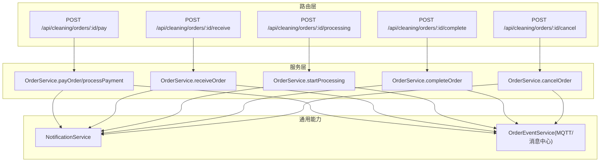
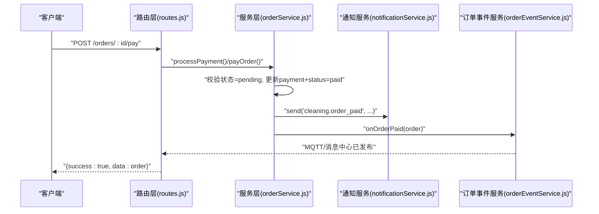
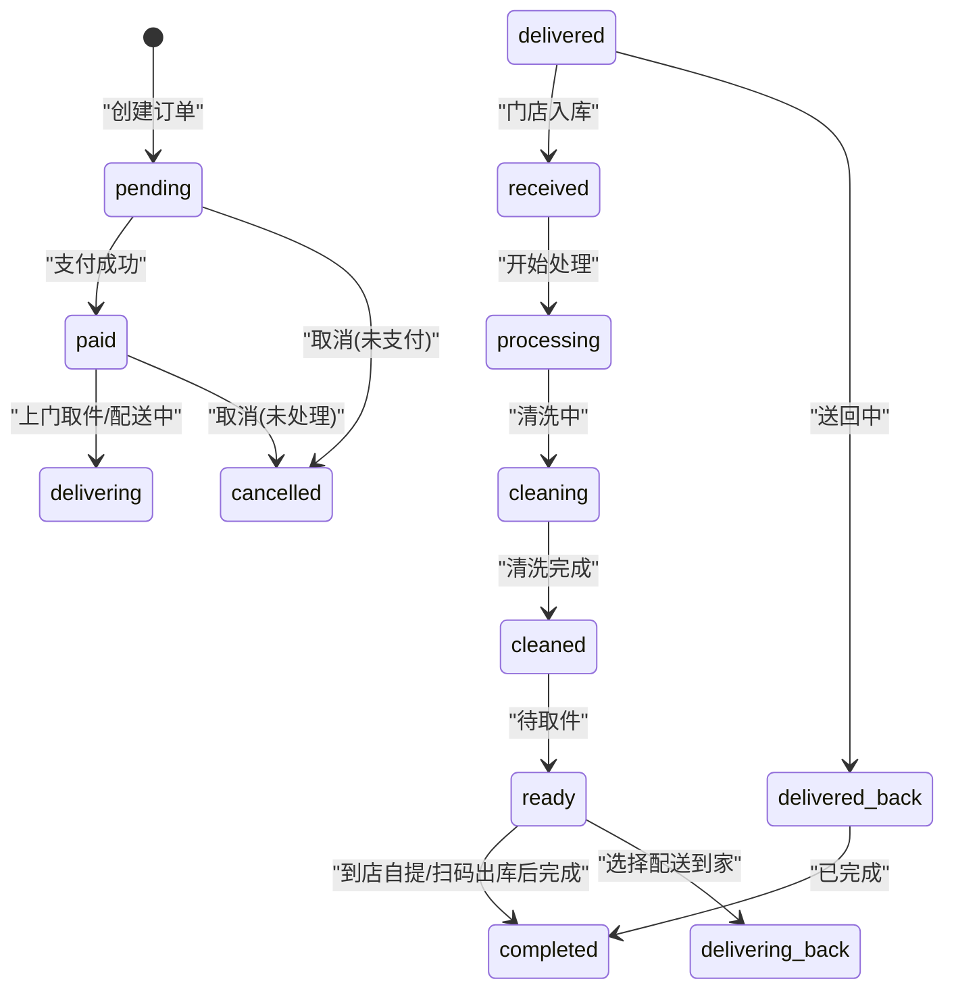
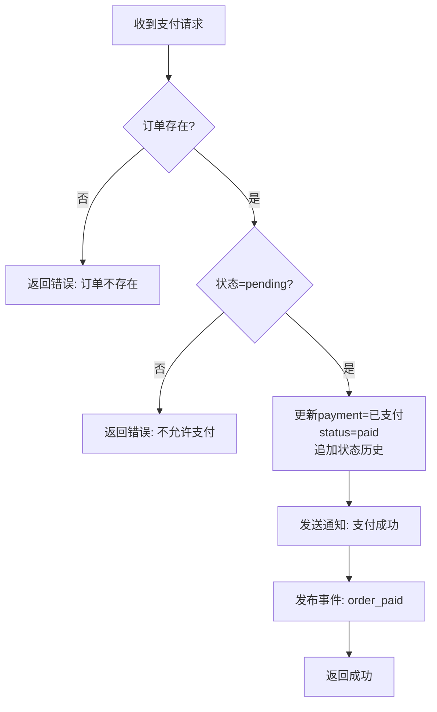
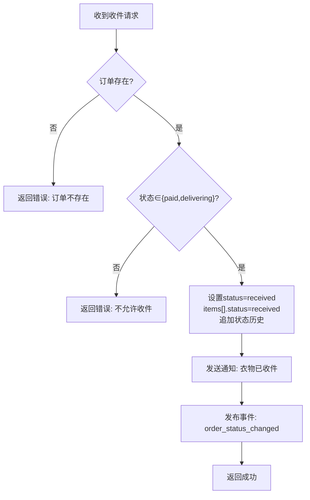
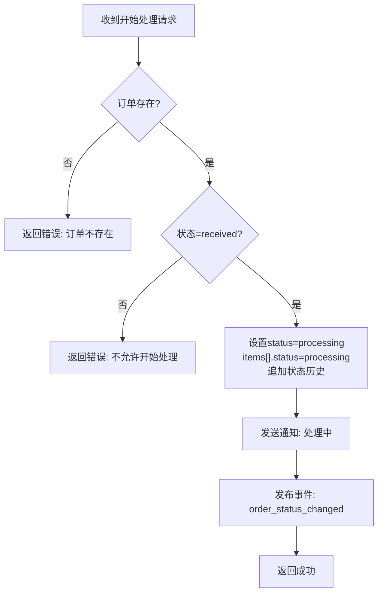
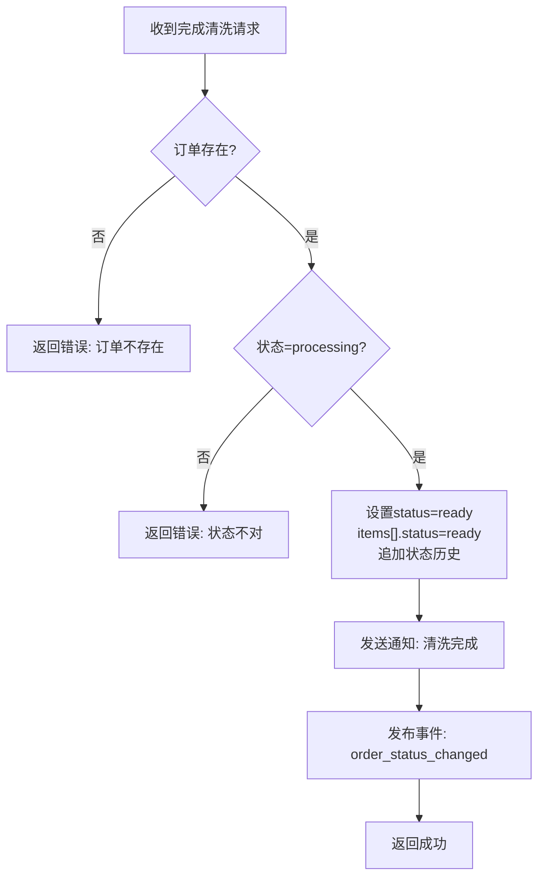
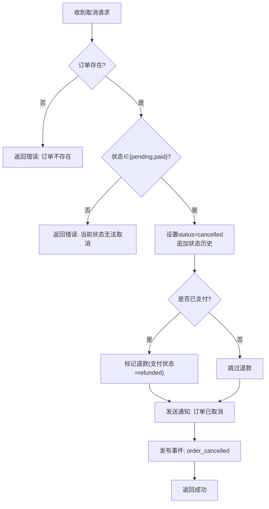
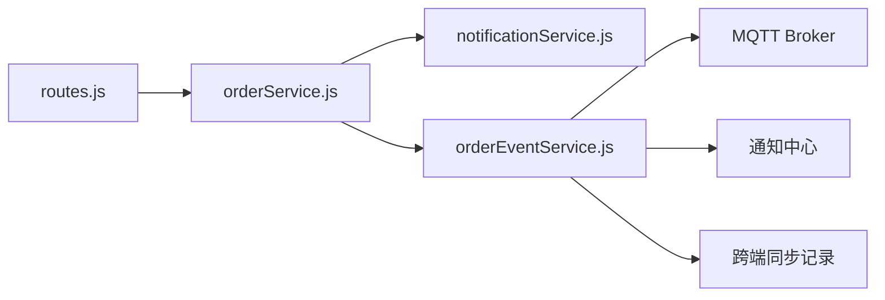

# 订单状态管理接口

<cite>
**本文引用的文件**   
- [backend/modules/cleaning/routes.js](file://backend/modules/cleaning/routes.js)
- [backend/modules/cleaning/services/orderService.js](file://backend/modules/cleaning/services/orderService.js)
- [backend/modules/common/services/notificationService.js](file://backend/modules/common/services/notificationService.js)
- [backend/services/orderEventService.js](file://backend/services/orderEventService.js)
</cite>

## 目录
1. [简介](#简介)
2. [项目结构](#项目结构)
3. [核心组件](#核心组件)
4. [架构总览](#架构总览)
5. [详细组件分析](#详细组件分析)
6. [依赖关系分析](#依赖关系分析)
7. [性能考虑](#性能考虑)
8. [故障排查指南](#故障排查指南)
9. [结论](#结论)
10. [附录](#附录)

## 简介
本文件为干洗店“订单状态管理”接口的权威文档，覆盖从创建到完成的全生命周期关键状态变更接口：支付确认、门店收件、开始处理、完成清洗、取消订单等。文档包含：
- 每个接口的请求参数、响应格式与错误码说明
- 状态转换规则与前置条件验证
- 权限控制逻辑（C端用户、M端门店员工、管理员）
- 完整订单状态机图（从 pending 到 completed）
- 状态历史记录维护机制
- 通知发送逻辑与事件发布流程（MQTT/消息中心）

## 项目结构
干洗模块采用路由层与服务层分离的清晰分层：
- 路由层：定义 HTTP 接口，解析参数，调用服务层
- 服务层：实现业务逻辑、状态机校验、持久化、通知与事件发布
- 通用能力：通知服务、订单事件服务（MQTT/消息中心）

图表来源
- [backend/modules/cleaning/routes.js:474-491](file://backend/modules/cleaning/routes.js#L474-L491)
- [backend/modules/cleaning/routes.js:192-238](file://backend/modules/cleaning/routes.js#L192-L238)
- [backend/modules/cleaning/routes.js:159-173](file://backend/modules/cleaning/routes.js#L159-L173)
- [backend/modules/cleaning/services/orderService.js:518-564](file://backend/modules/cleaning/services/orderService.js#L518-L564)
- [backend/modules/cleaning/services/orderService.js:666-715](file://backend/modules/cleaning/services/orderService.js#L666-L715)
- [backend/modules/cleaning/services/orderService.js:720-757](file://backend/modules/cleaning/services/orderService.js#L720-L757)
- [backend/modules/cleaning/services/orderService.js:762-803](file://backend/modules/cleaning/services/orderService.js#L762-L803)
- [backend/modules/cleaning/services/orderService.js:568-616](file://backend/modules/cleaning/services/orderService.js#L568-L616)
- [backend/modules/common/services/notificationService.js:177-211](file://backend/modules/common/services/notificationService.js#L177-L211)
- [backend/services/orderEventService.js:69-144](file://backend/services/orderEventService.js#L69-L144)

章节来源
- [backend/modules/cleaning/routes.js:1-120](file://backend/modules/cleaning/routes.js#L1-L120)
- [backend/modules/cleaning/services/orderService.js:1-120](file://backend/modules/cleaning/services/orderService.js#L1-L120)

## 核心组件
- 路由层（routes.js）
  - 负责统一入口、鉴权中间件、参数校验、异常捕获与响应封装
  - 暴露的核心接口：支付、收件、开始处理、完成清洗、取消、取件方式选择、配送费支付、扫码取件、批量取货、智能灯条控制等
- 服务层（orderService.js）
  - 实现订单状态机、权限校验、数据持久化、通知与事件发布
  - 提供方法：payOrder/processPayment、receiveOrder、startProcessing、completeOrder、cancelOrder、pickupOrder、selectPickupMethod、scanPickup、setDelivering 等
- 通知服务（notificationService.js）
  - 模板化消息，支持微信、短信、推送、电话等多渠道
- 订单事件服务（orderEventService.js）
  - 基于 MQTT 发布订单事件，同时写入通知中心与跨端同步记录

章节来源
- [backend/modules/cleaning/routes.js:1-120](file://backend/modules/cleaning/routes.js#L1-L120)
- [backend/modules/cleaning/services/orderService.js:177-291](file://backend/modules/cleaning/services/orderService.js#L177-L291)
- [backend/modules/common/services/notificationService.js:177-211](file://backend/modules/common/services/notificationService.js#L177-L211)
- [backend/services/orderEventService.js:69-144](file://backend/services/orderEventService.js#L69-L144)

## 架构总览
订单状态流转由路由层触发，服务层执行状态机校验并持久化，随后通过通知服务与事件服务完成对外广播与实时同步。

图表来源
- [backend/modules/cleaning/routes.js:474-491](file://backend/modules/cleaning/routes.js#L474-L491)
- [backend/modules/cleaning/services/orderService.js:1056-1120](file://backend/modules/cleaning/services/orderService.js#L1056-L1120)
- [backend/modules/common/services/notificationService.js:177-211](file://backend/modules/common/services/notificationService.js#L177-L211)
- [backend/services/orderEventService.js:146-154](file://backend/services/orderEventService.js#L146-L154)

## 详细组件分析

### 订单状态机与生命周期
- 状态集合（部分）：pending、paid、delivering、received、processing、cleaning、cleaned、ready、delivering_back、completed、cancelled
- 典型主路径：pending → paid → delivering → received → processing → cleaning → cleaned → ready → completed
- 备选路径：ready → delivering_back → completed（选择配送到家）
- 取消路径：pending/paid → cancelled

图表来源
- [backend/modules/cleaning/services/orderService.js:121-138](file://backend/modules/cleaning/services/orderService.js#L121-L138)
- [backend/modules/cleaning/services/orderService.js:518-564](file://backend/modules/cleaning/services/orderService.js#L518-L564)
- [backend/modules/cleaning/services/orderService.js:666-715](file://backend/modules/cleaning/services/orderService.js#L666-L715)
- [backend/modules/cleaning/services/orderService.js:720-757](file://backend/modules/cleaning/services/orderService.js#L720-L757)
- [backend/modules/cleaning/services/orderService.js:762-803](file://backend/modules/cleaning/services/orderService.js#L762-L803)
- [backend/modules/cleaning/services/orderService.js:809-846](file://backend/modules/cleaning/services/orderService.js#L809-L846)
- [backend/modules/cleaning/services/orderService.js:936-975](file://backend/modules/cleaning/services/orderService.js#L936-L975)
- [backend/modules/cleaning/services/orderService.js:568-616](file://backend/modules/cleaning/services/orderService.js#L568-L616)

章节来源
- [backend/modules/cleaning/services/orderService.js:121-138](file://backend/modules/cleaning/services/orderService.js#L121-L138)

### 接口一：支付确认（payOrder/processPayment）
- 路由
  - POST /api/cleaning/orders/:id/pay
- 请求体
  - method: 支付方式（如 wechat/alipay），可选
  - transactionId: 交易流水号，可选
- 响应
  - success: boolean
  - data: 订单对象（含 payment.status=paid、status=paid、statusHistory 追加记录）
- 状态转换
  - pending → paid
- 前置条件
  - 订单存在且当前状态为 pending
  - 若使用 payOrder 方法，需校验 userId 匹配
- 权限控制
  - C端用户或具备相应角色的用户可操作
- 副作用
  - 发送通知：cleaning.order_paid
  - 发布事件：order_paid（MQTT/消息中心）
  - 可能启动跑腿跟踪模拟（当为跑腿配送订单时）

图表来源
- [backend/modules/cleaning/routes.js:474-491](file://backend/modules/cleaning/routes.js#L474-L491)
- [backend/modules/cleaning/services/orderService.js:1056-1120](file://backend/modules/cleaning/services/orderService.js#L1056-L1120)
- [backend/modules/cleaning/services/orderService.js:518-564](file://backend/modules/cleaning/services/orderService.js#L518-L564)
- [backend/modules/common/services/notificationService.js:177-211](file://backend/modules/common/services/notificationService.js#L177-L211)
- [backend/services/orderEventService.js:146-154](file://backend/services/orderEventService.js#L146-L154)

章节来源
- [backend/modules/cleaning/routes.js:474-491](file://backend/modules/cleaning/routes.js#L474-L491)
- [backend/modules/cleaning/services/orderService.js:1056-1120](file://backend/modules/cleaning/services/orderService.js#L1056-L1120)
- [backend/modules/cleaning/services/orderService.js:518-564](file://backend/modules/cleaning/services/orderService.js#L518-L564)

### 接口二：门店收件（receiveOrder）
- 路由
  - POST /api/cleaning/orders/:id/receive
- 请求体
  - storeId: 门店ID（可选，用于上下文）
  - staffId: 操作员ID（来自认证上下文）
- 响应
  - success: boolean
  - data: 订单对象（status=received，items[].status=received，追加状态历史）
- 状态转换
  - paid/delivering → received
- 前置条件
  - 订单存在且状态为 paid 或 delivering
- 权限控制
  - 门店员工角色或具备相应权限的用户
- 副作用
  - 发送通知：cleaning.order_received
  - 发布事件：order_status_changed

图表来源
- [backend/modules/cleaning/routes.js:192-206](file://backend/modules/cleaning/routes.js#L192-L206)
- [backend/modules/cleaning/services/orderService.js:666-715](file://backend/modules/cleaning/services/orderService.js#L666-L715)
- [backend/modules/common/services/notificationService.js:177-211](file://backend/modules/common/services/notificationService.js#L177-L211)
- [backend/services/orderEventService.js:161-164](file://backend/services/orderEventService.js#L161-L164)

章节来源
- [backend/modules/cleaning/routes.js:192-206](file://backend/modules/cleaning/routes.js#L192-L206)
- [backend/modules/cleaning/services/orderService.js:666-715](file://backend/modules/cleaning/services/orderService.js#L666-L715)

### 接口三：开始处理（startProcessing）
- 路由
  - POST /api/cleaning/orders/:id/processing
- 请求体
  - 无特殊必填（staffId 来自认证上下文）
- 响应
  - success: boolean
  - data: 订单对象（status=processing，items[].status=processing，追加状态历史）
- 状态转换
  - received → processing
- 前置条件
  - 订单存在且状态为 received
- 权限控制
  - 门店员工角色或具备相应权限的用户
- 副作用
  - 发送通知：cleaning.order_processing
  - 发布事件：order_status_changed

图表来源
- [backend/modules/cleaning/routes.js:208-222](file://backend/modules/cleaning/routes.js#L208-L222)
- [backend/modules/cleaning/services/orderService.js:720-757](file://backend/modules/cleaning/services/orderService.js#L720-L757)
- [backend/modules/common/services/notificationService.js:177-211](file://backend/modules/common/services/notificationService.js#L177-L211)
- [backend/services/orderEventService.js:161-164](file://backend/services/orderEventService.js#L161-L164)

章节来源
- [backend/modules/cleaning/routes.js:208-222](file://backend/modules/cleaning/routes.js#L208-L222)
- [backend/modules/cleaning/services/orderService.js:720-757](file://backend/modules/cleaning/services/orderService.js#L720-L757)

### 接口四：完成清洗（completeOrder）
- 路由
  - POST /api/cleaning/orders/:id/complete
- 请求体
  - actualItems: 实际物品清单（可选，用于替换 items）
- 响应
  - success: boolean
  - data: 订单对象（status=ready，items[].status=ready，追加状态历史）
- 状态转换
  - processing → ready
- 前置条件
  - 订单存在且状态为 processing
- 权限控制
  - 门店员工角色或具备相应权限的用户
- 副作用
  - 发送通知：cleaning.order_completed
  - 发布事件：order_status_changed

图表来源
- [backend/modules/cleaning/routes.js:224-238](file://backend/modules/cleaning/routes.js#L224-L238)
- [backend/modules/cleaning/services/orderService.js:762-803](file://backend/modules/cleaning/services/orderService.js#L762-L803)
- [backend/modules/common/services/notificationService.js:177-211](file://backend/modules/common/services/notificationService.js#L177-L211)
- [backend/services/orderEventService.js:161-164](file://backend/services/orderEventService.js#L161-L164)

章节来源
- [backend/modules/cleaning/routes.js:224-238](file://backend/modules/cleaning/routes.js#L224-L238)
- [backend/modules/cleaning/services/orderService.js:762-803](file://backend/modules/cleaning/services/orderService.js#L762-L803)

### 接口五：取消订单（cancelOrder）
- 路由
  - POST /api/cleaning/orders/:id/cancel
- 请求体
  - reason: 取消原因（可选）
- 响应
  - success: boolean
  - data: 订单对象（status=cancelled，追加状态历史；如已支付则标记退款）
- 状态转换
  - pending/paid → cancelled
- 前置条件
  - 订单存在且状态为 pending 或 paid
- 权限控制
  - 订单所有者或管理员
- 副作用
  - 发送通知：cleaning.order_cancelled
  - 发布事件：order_cancelled

图表来源
- [backend/modules/cleaning/routes.js:159-173](file://backend/modules/cleaning/routes.js#L159-L173)
- [backend/modules/cleaning/services/orderService.js:568-616](file://backend/modules/cleaning/services/orderService.js#L568-L616)
- [backend/modules/common/services/notificationService.js:177-211](file://backend/modules/common/services/notificationService.js#L177-L211)
- [backend/services/orderEventService.js:156-159](file://backend/services/orderEventService.js#L156-L159)

章节来源
- [backend/modules/cleaning/routes.js:159-173](file://backend/modules/cleaning/routes.js#L159-L173)
- [backend/modules/cleaning/services/orderService.js:568-616](file://backend/modules/cleaning/services/orderService.js#L568-L616)

### 补充接口：取件方式选择、配送费支付、扫码取件、取件确认
- 选择取件方式（到店自提/配送到家）
  - POST /api/cleaning/orders/:id/pickup-method
  - 作用：在 ready 状态下选择取件方式；若选择配送到家，进入 delivering_back
- 支付配送费（跑腿配送）
  - POST /api/cleaning/orders/:id/pay-delivery-fee
  - 作用：记录配送费支付，初始化 courier 状态为 awaiting_store_outbound，触发灯条与配送服务
- 用户扫码取件
  - POST /api/cleaning/orders/:id/scan-pickup
  - 作用：将状态推进至 awaiting_store_outbound，等待门店出库
- 用户取件确认
  - POST /api/cleaning/orders/:id/pickup
  - 作用：在 ready/awaiting_pickup_scan/awaiting_store_outbound 下完成取件，进入 completed

章节来源
- [backend/modules/cleaning/routes.js:272-301](file://backend/modules/cleaning/routes.js#L272-L301)
- [backend/modules/cleaning/routes.js:304-334](file://backend/modules/cleaning/routes.js#L304-L334)
- [backend/modules/cleaning/routes.js:364-386](file://backend/modules/cleaning/routes.js#L364-L386)
- [backend/modules/cleaning/routes.js:256-270](file://backend/modules/cleaning/routes.js#L256-L270)
- [backend/modules/cleaning/services/orderService.js:1216-1295](file://backend/modules/cleaning/services/orderService.js#L1216-L1295)
- [backend/modules/cleaning/services/orderService.js:1303-1438](file://backend/modules/cleaning/services/orderService.js#L1303-L1438)
- [backend/modules/cleaning/services/orderService.js:1443-1504](file://backend/modules/cleaning/services/orderService.js#L1443-L1504)
- [backend/modules/cleaning/services/orderService.js:809-846](file://backend/modules/cleaning/services/orderService.js#L809-L846)

## 依赖关系分析
- 路由层依赖服务层进行业务处理
- 服务层依赖通知服务与订单事件服务
- 通知服务提供多通道模板化消息
- 订单事件服务通过 MQTT 发布事件，并写入通知中心与跨端同步记录

图表来源
- [backend/modules/cleaning/routes.js:1-120](file://backend/modules/cleaning/routes.js#L1-L120)
- [backend/modules/cleaning/services/orderService.js:1-120](file://backend/modules/cleaning/services/orderService.js#L1-L120)
- [backend/modules/common/services/notificationService.js:177-211](file://backend/modules/common/services/notificationService.js#L177-L211)
- [backend/services/orderEventService.js:69-144](file://backend/services/orderEventService.js#L69-L144)

章节来源
- [backend/modules/cleaning/routes.js:1-120](file://backend/modules/cleaning/routes.js#L1-L120)
- [backend/modules/cleaning/services/orderService.js:1-120](file://backend/modules/cleaning/services/orderService.js#L1-L120)
- [backend/modules/common/services/notificationService.js:177-211](file://backend/modules/common/services/notificationService.js#L177-L211)
- [backend/services/orderEventService.js:69-144](file://backend/services/orderEventService.js#L69-L144)

## 性能考虑
- 状态更新尽量原子化，避免多次数据库往返
- 通知与事件发布异步执行，不阻塞主流程
- 列表查询使用分页与索引字段（userId、storeId、status）
- 对高频轮询接口（如实时状态）禁用缓存头，确保最新数据

[本节为通用指导，无需代码引用]

## 故障排查指南
- 常见错误
  - 订单不存在：检查 orderId/orderNo 是否正确
  - 状态不允许：核对当前状态是否符合目标接口的允许范围
  - 无权操作：确认用户角色与订单归属（C端用户 vs 门店员工 vs 管理员）
  - 支付失败：检查支付方法与交易流水号
- 定位建议
  - 查看路由层日志输出（创建订单、支付、状态更新等）
  - 检查通知服务模板是否存在对应 key
  - 检查 MQTT 连接与订阅主题是否正常

章节来源
- [backend/modules/cleaning/routes.js:24-42](file://backend/modules/cleaning/routes.js#L24-L42)
- [backend/modules/cleaning/routes.js:474-491](file://backend/modules/cleaning/routes.js#L474-L491)
- [backend/modules/common/services/notificationService.js:177-211](file://backend/modules/common/services/notificationService.js#L177-L211)
- [backend/services/orderEventService.js:97-110](file://backend/services/orderEventService.js#L97-L110)

## 结论
本接口体系围绕清晰的订单状态机展开，通过路由层与服务层的解耦设计，实现了高内聚、低耦合的状态变更流程。配合通知服务与事件服务，确保了端到端的实时同步与用户体验一致性。建议在后续迭代中持续完善权限模型、扩展状态枚举与监控告警能力。

[本节为总结性内容，无需代码引用]

## 附录

### 接口清单与要点速查
- 支付确认
  - 路由：POST /api/cleaning/orders/:id/pay
  - 状态：pending → paid
  - 通知：cleaning.order_paid
  - 事件：order_paid
- 门店收件
  - 路由：POST /api/cleaning/orders/:id/receive
  - 状态：paid/delivering → received
  - 通知：cleaning.order_received
  - 事件：order_status_changed
- 开始处理
  - 路由：POST /api/cleaning/orders/:id/processing
  - 状态：received → processing
  - 通知：cleaning.order_processing
  - 事件：order_status_changed
- 完成清洗
  - 路由：POST /api/cleaning/orders/:id/complete
  - 状态：processing → ready
  - 通知：cleaning.order_completed
  - 事件：order_status_changed
- 取消订单
  - 路由：POST /api/cleaning/orders/:id/cancel
  - 状态：pending/paid → cancelled
  - 通知：cleaning.order_cancelled
  - 事件：order_cancelled

章节来源
- [backend/modules/cleaning/routes.js:159-238](file://backend/modules/cleaning/routes.js#L159-L238)
- [backend/modules/cleaning/services/orderService.js:518-803](file://backend/modules/cleaning/services/orderService.js#L518-L803)
- [backend/modules/common/services/notificationService.js:177-211](file://backend/modules/common/services/notificationService.js#L177-L211)
- [backend/services/orderEventService.js:146-164](file://backend/services/orderEventService.js#L146-L164)