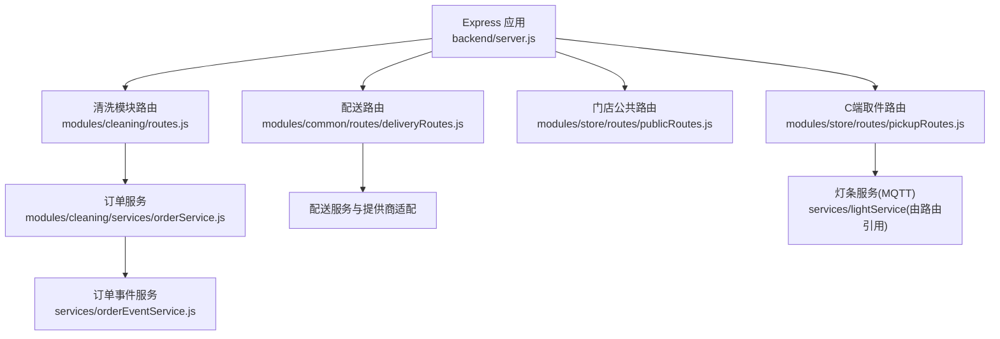
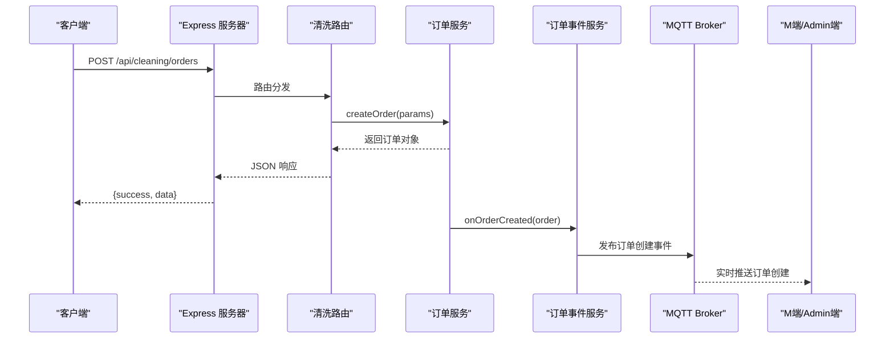
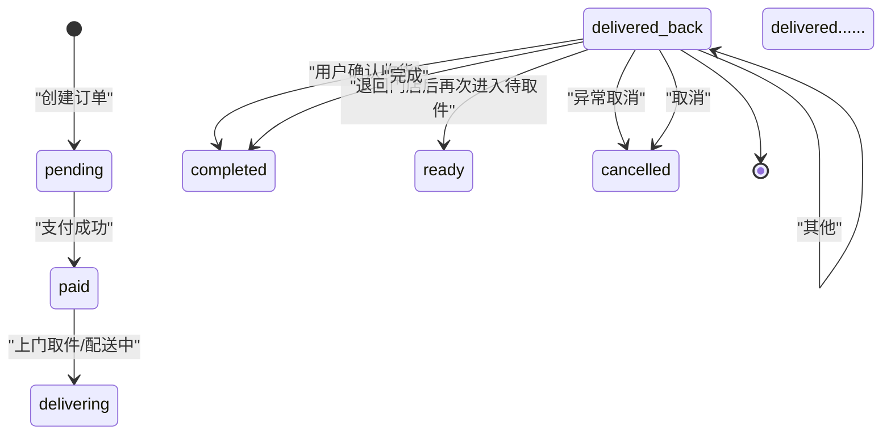
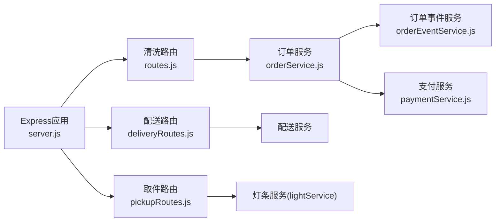

# 订单管理接口

<cite>
**本文引用的文件**   
- [backend/server.js](file://backend/server.js)
- [backend/modules/cleaning/routes.js](file://backend/modules/cleaning/routes.js)
- [backend/modules/cleaning/services/orderService.js](file://backend/modules/cleaning/services/orderService.js)
- [backend/modules/common/routes/deliveryRoutes.js](file://backend/modules/common/routes/deliveryRoutes.js)
- [backend/modules/store/routes/pickupRoutes.js](file://backend/modules/store/routes/pickupRoutes.js)
- [backend/modules/store/routes/publicRoutes.js](file://backend/modules/store/routes/publicRoutes.js)
- [backend/services/orderEventService.js](file://backend/services/orderEventService.js)
- [api/API_DOCUMENTATION.md](file://api/API_DOCUMENTATION.md)
</cite>

## 目录
1. [简介](#简介)
2. [项目结构](#项目结构)
3. [核心组件](#核心组件)
4. [架构总览](#架构总览)
5. [详细组件分析](#详细组件分析)
6. [依赖关系分析](#依赖关系分析)
7. [性能与扩展性](#性能与扩展性)
8. [故障排查指南](#故障排查指南)
9. [结论](#结论)
10. [附录：接口清单与状态机](#附录接口清单与状态机)

## 简介
本文件为干洗店订单管理系统的完整API接口文档，覆盖干洗服务、鞋类护理、奢侈品护理等多业务类型的订单创建、查询、修改、取消、状态跟踪等核心能力；同时包含配送/取件、支付、通知与事件同步等配套接口。文档面向门店操作员与C端用户集成，提供HTTP方法、URL模式、请求参数、响应格式与错误码说明，并给出订单状态机流转规则与高级功能（批量操作、分页、条件筛选）的接入指引。

## 项目结构
后端采用模块化路由与服务分层设计：
- 入口与全局路由挂载：backend/server.js
- 干洗模块路由与业务逻辑：backend/modules/cleaning/routes.js、orderService.js
- 配送聚合路由：backend/modules/common/routes/deliveryRoutes.js
- C端取件与灯条联动：backend/modules/store/routes/pickupRoutes.js、publicRoutes.js
- 订单事件与MQTT广播：backend/services/orderEventService.js
- 历史C端API参考：api/API_DOCUMENTATION.md

图表来源
- [backend/server.js:96-151](file://backend/server.js#L96-L151)
- [backend/modules/cleaning/routes.js:1-20](file://backend/modules/cleaning/routes.js#L1-L20)
- [backend/modules/common/routes/deliveryRoutes.js:1-20](file://backend/modules/common/routes/deliveryRoutes.js#L1-L20)
- [backend/modules/store/routes/pickupRoutes.js:1-20](file://backend/modules/store/routes/pickupRoutes.js#L1-L20)
- [backend/modules/store/routes/publicRoutes.js:1-20](file://backend/modules/store/routes/publicRoutes.js#L1-L20)
- [backend/services/orderEventService.js:1-20](file://backend/services/orderEventService.js#L1-L20)

章节来源
- [backend/server.js:96-151](file://backend/server.js#L96-L151)

## 核心组件
- 订单服务(orderService.js)：实现订单CRUD、支付、取消、收件、处理、完成、取件、批量取件、智能灯条控制、配送费支付、跑腿服务商选择、扫码取件等核心流程，维护订单状态机与状态历史。
- 清洗模块路由(routes.js)：对外暴露订单相关REST API，统一鉴权与可选认证策略，封装参数校验与错误返回。
- 配送路由(deliveryRoutes.js)：聚合多家跑腿服务商报价、下单、状态回调、跟踪模拟等能力，驱动订单courier字段与deliveryStatus更新。
- 取件路由(pickupRoutes.js)：支持到店扫码一键点亮灯条、骑手到店确认、配送完成、取件码验证、店员确认取货等。
- 订单事件服务(orderEventService.js)：通过MQTT发布订单事件，实现小程序→M端/Admin端实时数据同步，并写入通知中心与消息中心。

章节来源
- [backend/modules/cleaning/services/orderService.js:177-291](file://backend/modules/cleaning/services/orderService.js#L177-L291)
- [backend/modules/cleaning/routes.js:20-42](file://backend/modules/cleaning/routes.js#L20-L42)
- [backend/modules/common/routes/deliveryRoutes.js:86-133](file://backend/modules/common/routes/deliveryRoutes.js#L86-L133)
- [backend/modules/store/routes/pickupRoutes.js:80-180](file://backend/modules/store/routes/pickupRoutes.js#L80-L180)
- [backend/services/orderEventService.js:69-144](file://backend/services/orderEventService.js#L69-L144)

## 架构总览
系统以Express为HTTP入口，按业务域划分路由，路由层调用服务层执行业务逻辑，并通过订单事件服务将关键变更通过MQTT推送至订阅端（M端、Admin端），同时结合通知中心与消息中心形成闭环。

图表来源
- [backend/server.js:96-151](file://backend/server.js#L96-L151)
- [backend/modules/cleaning/routes.js:20-42](file://backend/modules/cleaning/routes.js#L20-L42)
- [backend/modules/cleaning/services/orderService.js:177-291](file://backend/modules/cleaning/services/orderService.js#L177-L291)
- [backend/services/orderEventService.js:146-149](file://backend/services/orderEventService.js#L146-L149)

## 详细组件分析

### 订单生命周期与状态机
订单状态枚举与流转定义在订单服务中，涵盖从下单到完成的完整生命周期，包括支付、入库、处理、清洗、完成、取回、完成、取消等阶段，以及新增的“等待出库”“商家已出库”等细粒度状态。

说明：
- 状态定义与描述见订单服务中枚举与映射，包含“pending、paid、delivering、received、processing、cleaning、cleaned、ready、delivering_back、completed、cancelled”以及新增的“awaiting_pickup_scan、awaiting_store_outbound、store_outbound”。
- 各状态变更均记录在statusHistory中，并触发事件推送。

章节来源
- [backend/modules/cleaning/services/orderService.js:121-138](file://backend/modules/cleaning/services/orderService.js#L121-L138)
- [backend/modules/cleaning/routes.js:597-634](file://backend/modules/cleaning/routes.js#L597-L634)

### 订单创建接口
- 方法/路径：POST /api/cleaning/orders
- 鉴权：可选认证（支持openid或userId）
- 请求体关键字段：
  - userId/openid：用户标识（优先使用openid）
  - storeId：门店ID
  - items：物品数组，含name、itemType、serviceType、material、price、quantity、specialReq等
  - delivery：取送方式与地址信息（type、address、contactName、contactPhone、fee）
  - amounts：金额汇总（subtotal、discount、deliveryFee、total）
  - deliveryMethod：store_pickup或courier
  - selectedProvider：已选跑腿服务商
  - categoryId/categoryType：品类与业务类型（cleaning/shoe_care/luxury_care等）
- 响应：返回完整订单对象，包含orderNo、items、amounts、status、statusHistory等

章节来源
- [backend/modules/cleaning/routes.js:20-42](file://backend/modules/cleaning/routes.js#L20-L42)
- [backend/modules/cleaning/services/orderService.js:177-291](file://backend/modules/cleaning/services/orderService.js#L177-L291)

### 订单查询接口
- 列表查询：GET /api/cleaning/orders
  - 查询参数：page、pageSize、status、storeId、userId/openid/phone（跨平台手机号匹配）
  - 权限过滤：customer按userId或手机号；store_staff/store_owner按storeId
  - 返回：分页结果{list, total, page, pageSize, totalPages}，并填充门店信息
- 详情查询：GET /api/cleaning/orders/:id
  - 支持_id或orderNo查询，自动识别格式
  - 返回：订单详情+门店信息+状态描述+最新动态
- 实时状态轮询：GET /api/cleaning/orders/:id/status
  - 返回精简状态数据，禁用缓存，适合前端高频轮询

章节来源
- [backend/modules/cleaning/routes.js:49-81](file://backend/modules/cleaning/routes.js#L49-L81)
- [backend/modules/cleaning/routes.js:146-156](file://backend/modules/cleaning/routes.js#L146-L156)
- [backend/modules/cleaning/routes.js:497-564](file://backend/modules/cleaning/routes.js#L497-L564)
- [backend/modules/cleaning/services/orderService.js:296-389](file://backend/modules/cleaning/services/orderService.js#L296-L389)
- [backend/modules/cleaning/services/orderService.js:395-516](file://backend/modules/cleaning/services/orderService.js#L395-L516)

### 订单修改与取消接口
- 取消订单：POST /api/cleaning/orders/:id/cancel
  - 仅允许pending/paid状态取消，需具备操作权限
  - 如已支付，标记退款处理（预留调用支付退款）
- 删除订单（软删除）：POST /api/cleaning/orders/:id/delete
  - 仅终态订单可删除，设置isDeleted并从常规查询中隐藏
- 更新订单状态（门店端）：PUT /api/cleaning/orders/:id/status
  - 支持批量更新物品状态，驱动订单级状态自动计算

章节来源
- [backend/modules/cleaning/routes.js:162-173](file://backend/modules/cleaning/routes.js#L162-L173)
- [backend/modules/cleaning/routes.js:179-189](file://backend/modules/cleaning/routes.js#L179-L189)
- [backend/modules/cleaning/routes.js:570-594](file://backend/modules/cleaning/routes.js#L570-L594)
- [backend/modules/cleaning/services/orderService.js:569-616](file://backend/modules/cleaning/services/orderService.js#L569-L616)
- [backend/modules/cleaning/services/orderService.js:623-660](file://backend/modules/cleaning/services/orderService.js#L623-L660)

### 门店作业流程接口
- 收件：POST /api/cleaning/orders/:id/receive
  - 状态：paid/delivering → received，记录入库时间
- 开始处理：POST /api/cleaning/orders/:id/processing
  - 状态：received → processing
- 完成清洗：POST /api/cleaning/orders/:id/complete
  - 状态：processing → ready，设置质检通过与取件日期
- 设置配送中：POST /api/cleaning/orders/:id/delivering
  - 用于将订单置为配送中（退回用户场景）
- 用户取件确认：POST /api/cleaning/orders/:id/pickup
  - 用户到店自提确认后进入完成阶段

章节来源
- [backend/modules/cleaning/routes.js:195-270](file://backend/modules/cleaning/routes.js#L195-L270)
- [backend/modules/cleaning/services/orderService.js:667-800](file://backend/modules/cleaning/services/orderService.js#L667-L800)

### 取件方式与跑腿选择
- 选择取件方式：POST /api/cleaning/orders/:id/pickup-method
  - method：store_pickup | home_delivery
  - 支持填写配送地址与联系人
- 选择跑腿服务商：POST /api/cleaning/orders/:id/select-provider
  - provider：服务商ID
- 支付配送费：POST /api/cleaning/orders/:id/pay-delivery-fee
  - 记录provider、fee、payTime
- 扫码取件：POST /api/cleaning/orders/:id/scan-pickup
  - pickupMethod：到店自提或配送到家

章节来源
- [backend/modules/cleaning/routes.js:276-386](file://backend/modules/cleaning/routes.js#L276-L386)

### 智能灯条控制（门店端）
- 点亮取货灯：POST /api/cleaning/store/:storeId/light-up
- 关闭灯：POST /api/cleaning/store/:storeId/light-off
- 获取灯条状态：GET /api/cleaning/store/:storeId/light-status

章节来源
- [backend/modules/cleaning/routes.js:425-471](file://backend/modules/cleaning/routes.js#L425-L471)

### 支付相关接口
- 统一支付创建：POST /api/payment/create
  - paymentMethod：wechat/alipay/unionpay/balance
  - 返回对应支付参数或URL
- 微信支付统一下单（小程序）：POST /api/payment/wechat/unified
  - 未配置时走模拟支付，自动更新订单状态为已支付
- 余额查询/充值：GET /api/balance/:userId、POST /api/balance/recharge

章节来源
- [backend/server.js:411-523](file://backend/server.js#L411-L523)
- [api/API_DOCUMENTATION.md:1-120](file://api/API_DOCUMENTATION.md#L1-L120)

### 配送聚合接口
- 获取服务商接入状态：GET /api/delivery/provider-status
- 获取支持的服务商：GET /api/delivery/providers
- 一键报价：POST /api/delivery/quotes
- 估算费用：POST /api/delivery/estimate
- 创建配送订单：POST /api/delivery/create
- 查询配送状态：GET /api/delivery/status/:deliveryId
- 取消配送：POST /api/delivery/cancel
- 配送回调：POST /api/delivery/callback（由服务商回传，驱动courier字段与deliveryStatus）
- 启动跟踪模拟：POST /api/delivery/:orderId/start-tracking
- 活跃任务列表：GET /api/delivery/tracking/active

章节来源
- [backend/modules/common/routes/deliveryRoutes.js:13-322](file://backend/modules/common/routes/deliveryRoutes.js#L13-L322)

### C端取件与灯条联动
- 获取门店待取件订单：GET /api/store/pickup/store/:storeId/pending
- 一键激活所有待取件灯条：POST /api/store/pickup/store/:storeId/activate-all
- 用户到达提醒：POST /api/store/pickup/store/:storeId/arrive
- 创建配送订单并点亮灯条：POST /api/store/pickup/delivery/create
- 骑手到店确认：POST /api/store/pickup/delivery/:deliveryId/courier-arrive
- 配送完成：POST /api/store/pickup/delivery/:deliveryId/complete
- 验证取件码：POST /api/store/pickup/verify
- 店员确认取货：POST /api/store/pickup/confirm-pickup
- 获取活跃取件：GET /api/store/pickup/store/:storeId/active

章节来源
- [backend/modules/store/routes/pickupRoutes.js:23-746](file://backend/modules/store/routes/pickupRoutes.js#L23-L746)
- [backend/modules/store/routes/publicRoutes.js:9-67](file://backend/modules/store/routes/publicRoutes.js#L9-L67)

### 订单事件与实时同步
- 事件发布：onOrderCreated/onOrderPaid/onOrderCancelled/onOrderStatusChanged
- MQTT主题：
  - dryclean/orders/{storeId}/update（门店级）
  - dryclean/orders/all/update（全局）
- 通知中心与消息中心写入：Admin轮询与C端可见消息

章节来源
- [backend/services/orderEventService.js:69-144](file://backend/services/orderEventService.js#L69-L144)

## 依赖关系分析
- 路由层依赖服务层：routes.js → orderService.js；deliveryRoutes.js → deliveryService；pickupRoutes.js → lightService
- 服务层依赖基础设施：orderService.js → orderEventService.js（MQTT）、paymentService.js（支付）
- 入口server.js挂载所有模块路由，提供健康检查与系统能力查询

图表来源
- [backend/server.js:96-151](file://backend/server.js#L96-L151)
- [backend/modules/cleaning/routes.js:1-20](file://backend/modules/cleaning/routes.js#L1-L20)
- [backend/modules/cleaning/services/orderService.js:1-20](file://backend/modules/cleaning/services/orderService.js#L1-L20)
- [backend/modules/common/routes/deliveryRoutes.js:1-20](file://backend/modules/common/routes/deliveryRoutes.js#L1-L20)
- [backend/modules/store/routes/pickupRoutes.js:1-20](file://backend/modules/store/routes/pickupRoutes.js#L1-L20)
- [backend/services/orderEventService.js:1-20](file://backend/services/orderEventService.js#L1-L20)

章节来源
- [backend/server.js:96-151](file://backend/server.js#L96-L151)

## 性能与扩展性
- 订单列表查询采用分页与索引优化（orderNo、userId、storeId），并按createdAt倒序排序，提升大数据量下的查询性能。
- 实时状态轮询接口禁用缓存，确保前端获取最新状态。
- 订单事件通过MQTT异步广播，避免阻塞主流程。
- 建议：
  - 对高频查询增加Redis缓存（如门店服务列表、价格配置）。
  - 对配送回调进行幂等处理，防止重复更新。
  - 对批量操作（如一键取件）增加事务与重试机制。

[本节为通用指导，不直接分析具体文件]

## 故障排查指南
- 常见错误码与提示：
  - 400：参数校验失败（如缺少必要字段、无效取件方式、未选择跑腿服务商）
  - 404：资源不存在（订单不存在、门店不存在）
  - 500：服务器内部错误（数据库异常、MQTT连接失败等）
- 定位步骤：
  - 查看后端日志输出（创建订单、支付、配送回调等关键节点）
  - 检查MQTT连接状态与订阅主题是否正确
  - 核对订单状态机是否满足前置条件（如取消仅允许pending/paid）
  - 使用实时状态接口确认当前状态与历史变更记录

章节来源
- [backend/modules/cleaning/routes.js:38-42](file://backend/modules/cleaning/routes.js#L38-L42)
- [backend/modules/cleaning/routes.js:153-156](file://backend/modules/cleaning/routes.js#L153-L156)
- [backend/modules/cleaning/routes.js:500-564](file://backend/modules/cleaning/routes.js#L500-L564)

## 结论
本API文档基于代码实现梳理了干洗店订单管理系统的核心接口与状态流转，覆盖多业务类型订单、配送与取件、支付与事件同步等关键环节。通过模块化架构与MQTT实时推送，系统具备良好的可扩展性与用户体验。建议在生产环境完善支付与配送提供商的真实对接，增强幂等与容错机制，并引入缓存与监控以提升稳定性与性能。

[本节为总结，不直接分析具体文件]

## 附录：接口清单与状态机

### 接口清单（节选）
- 订单
  - POST /api/cleaning/orders
  - GET /api/cleaning/orders
  - GET /api/cleaning/orders/:id
  - GET /api/cleaning/orders/:id/status
  - POST /api/cleaning/orders/:id/cancel
  - POST /api/cleaning/orders/:id/delete
  - PUT /api/cleaning/orders/:id/status
  - POST /api/cleaning/orders/:id/receive
  - POST /api/cleaning/orders/:id/processing
  - POST /api/cleaning/orders/:id/complete
  - POST /api/cleaning/orders/:id/delivering
  - POST /api/cleaning/orders/:id/pickup
  - POST /api/cleaning/orders/:id/pickup-method
  - POST /api/cleaning/orders/:id/select-provider
  - POST /api/cleaning/orders/:id/pay-delivery-fee
  - POST /api/cleaning/orders/:id/scan-pickup
  - POST /api/cleaning/orders/batch-pickup
- 灯条控制
  - POST /api/cleaning/store/:storeId/light-up
  - POST /api/cleaning/store/:storeId/light-off
  - GET /api/cleaning/store/:storeId/light-status
- 支付
  - POST /api/payment/create
  - POST /api/payment/wechat/unified
  - GET /api/balance/:userId
  - POST /api/balance/recharge
- 配送
  - GET /api/delivery/provider-status
  - GET /api/delivery/providers
  - POST /api/delivery/quotes
  - POST /api/delivery/estimate
  - POST /api/delivery/create
  - GET /api/delivery/status/:deliveryId
  - POST /api/delivery/cancel
  - POST /api/delivery/callback
  - POST /api/delivery/:orderId/start-tracking
  - GET /api/delivery/tracking/active
- 取件
  - GET /api/store/pickup/store/:storeId/pending
  - POST /api/store/pickup/store/:storeId/activate-all
  - POST /api/store/pickup/store/:storeId/arrive
  - POST /api/store/pickup/delivery/create
  - POST /api/store/pickup/delivery/:deliveryId/courier-arrive
  - POST /api/store/pickup/delivery/:deliveryId/complete
  - POST /api/store/pickup/verify
  - POST /api/store/pickup/confirm-pickup
  - GET /api/store/pickup/store/:storeId/active

章节来源
- [backend/modules/cleaning/routes.js:20-471](file://backend/modules/cleaning/routes.js#L20-L471)
- [backend/modules/common/routes/deliveryRoutes.js:13-322](file://backend/modules/common/routes/deliveryRoutes.js#L13-L322)
- [backend/modules/store/routes/pickupRoutes.js:23-746](file://backend/modules/store/routes/pickupRoutes.js#L23-L746)
- [backend/server.js:411-523](file://backend/server.js#L411-L523)