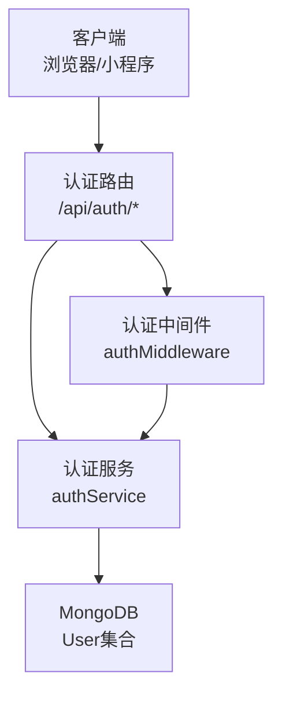
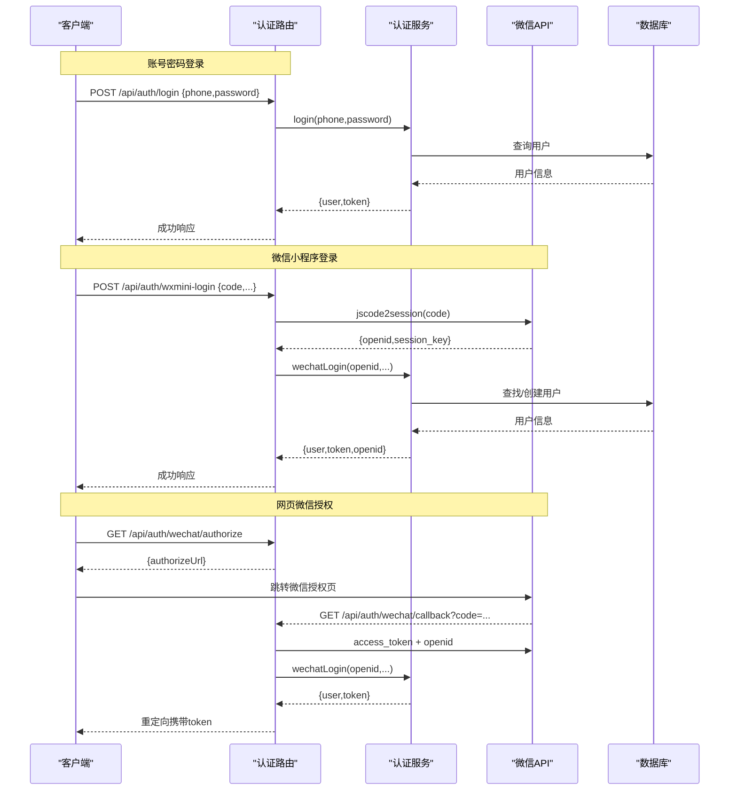
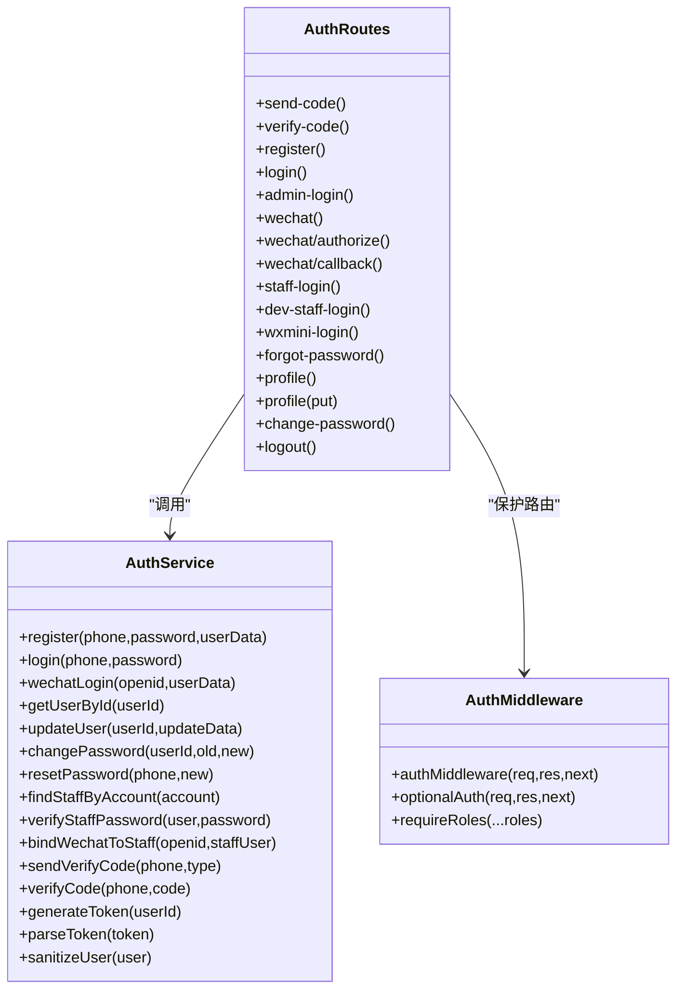
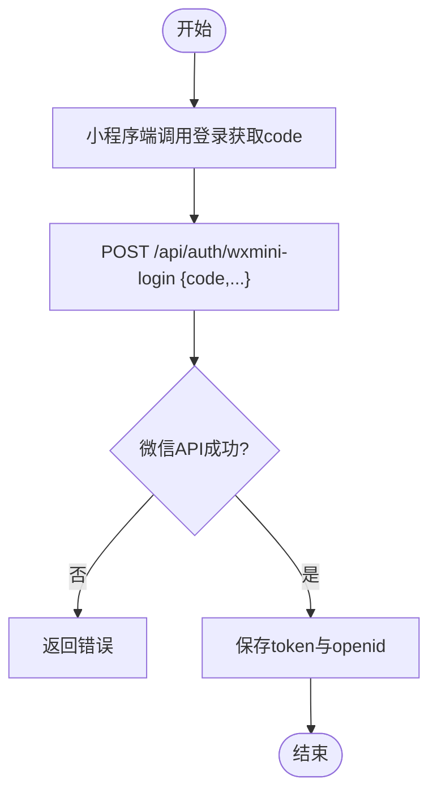
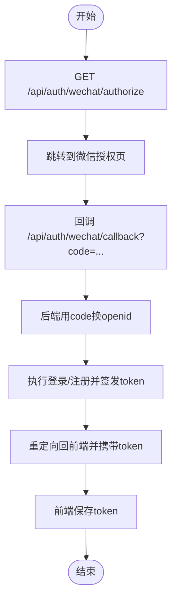
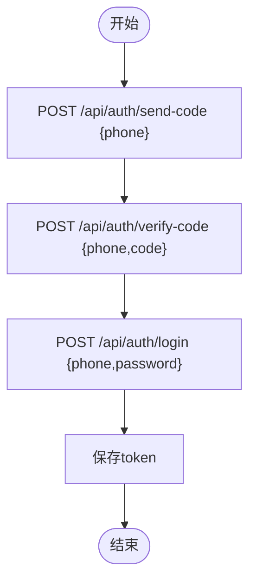

# 认证授权接口

<cite>
**本文引用的文件**   
- [backend/server.js](file://backend/server.js)
- [backend/modules/common/routes/authRoutes.js](file://backend/modules/common/routes/authRoutes.js)
- [backend/modules/common/services/authService.js](file://backend/modules/common/services/authService.js)
- [backend/modules/common/middlewares/auth.js](file://backend/modules/common/middlewares/auth.js)
- [backend/modules/common/middlewares/rbac.js](file://backend/modules/common/middlewares/rbac.js)
</cite>

## 目录
1. [简介](#简介)
2. [项目结构](#项目结构)
3. [核心组件](#核心组件)
4. [架构总览](#架构总览)
5. [详细接口说明](#详细接口说明)
6. [依赖分析](#依赖分析)
7. [性能与安全考虑](#性能与安全考虑)
8. [故障排查指南](#故障排查指南)
9. [结论](#结论)
10. [附录：前端集成与调试建议](#附录前端集成与调试建议)

## 简介
本文件为干洗系统“认证授权”模块的API文档，覆盖用户注册、登录（手机号+密码）、验证码校验、微信登录（网页授权与小程序）、员工登录、令牌管理、权限控制、个人信息维护、密码修改/重置、退出登录等。同时说明Bearer Token认证机制的使用方法、请求头格式与权限控制规则，并提供完整登录流程示例与调试建议。

## 项目结构
认证相关代码主要位于后端公共模块中：
- 路由层：统一挂载于 /api/auth
- 服务层：封装用户模型、注册/登录/微信登录、令牌生成与解析、验证码逻辑等
- 中间件：Barear Token校验、可选认证、角色/权限校验

图表来源
- [backend/server.js:96-98](file://backend/server.js#L96-L98)
- [backend/modules/common/routes/authRoutes.js:1-20](file://backend/modules/common/routes/authRoutes.js#L1-L20)
- [backend/modules/common/services/authService.js:1-20](file://backend/modules/common/services/authService.js#L1-L20)
- [backend/modules/common/middlewares/auth.js:1-20](file://backend/modules/common/middlewares/auth.js#L1-L20)

章节来源
- [backend/server.js:96-98](file://backend/server.js#L96-L98)

## 核心组件
- 认证路由 authRoutes：定义所有认证相关HTTP端点
- 认证服务 authService：实现用户CRUD、登录注册、微信登录、令牌生成/解析、验证码校验、员工绑定等
- 认证中间件 authMiddleware：从Authorization头提取并校验Bearer Token，注入req.user
- RBAC中间件 rbac：基于角色的访问控制（当前未直接用于认证路由，但提供能力）

章节来源
- [backend/modules/common/routes/authRoutes.js:1-20](file://backend/modules/common/routes/authRoutes.js#L1-L20)
- [backend/modules/common/services/authService.js:63-125](file://backend/modules/common/services/authService.js#L63-L125)
- [backend/modules/common/middlewares/auth.js:10-137](file://backend/modules/common/middlewares/auth.js#L10-L137)
- [backend/modules/common/middlewares/rbac.js:1-48](file://backend/modules/common/middlewares/rbac.js#L1-L48)

## 架构总览
认证流程总体分为三类：
- 账号密码登录：手机号+密码 → 校验 → 签发Token
- 微信登录：网页授权或小程序code → 换取openid → 自动注册/登录 → 签发Token
- 员工登录：账号/工号+密码 → 校验 → 签发Token（可绑定openid）

图表来源
- [backend/modules/common/routes/authRoutes.js:66-80](file://backend/modules/common/routes/authRoutes.js#L66-L80)
- [backend/modules/common/routes/authRoutes.js:444-490](file://backend/modules/common/routes/authRoutes.js#L444-L490)
- [backend/modules/common/routes/authRoutes.js:149-192](file://backend/modules/common/routes/authRoutes.js#L149-L192)
- [backend/modules/common/routes/authRoutes.js:198-259](file://backend/modules/common/routes/authRoutes.js#L198-L259)
- [backend/modules/common/services/authService.js:130-198](file://backend/modules/common/services/authService.js#L130-L198)

## 详细接口说明

### 通用约定
- 基础路径：/api/auth
- 认证方式：Bearer Token
  - 请求头：Authorization: Bearer <token>
  - 未携带或无效时返回401，且包含 needLogin: true
- 统一响应体：{ success: boolean, data?: any, error?: string }
- 错误码：业务错误通过error字段描述；HTTP状态码按语义返回（如400/401/403/500）

章节来源
- [backend/modules/common/middlewares/auth.js:10-38](file://backend/modules/common/middlewares/auth.js#L10-38)

### 公开接口（无需登录）

#### 发送验证码
- 方法/路径：POST /api/auth/send-code
- 请求体：
  - phone: string（必填）
  - type: string（选填，默认login）
- 响应：
  - data.success: true
  - data.message: "验证码已发送"
  - 开发环境data.code会返回验证码明文
- 错误：
  - 400：参数不完整或短信服务异常

章节来源
- [backend/modules/common/routes/authRoutes.js:17-27](file://backend/modules/common/routes/authRoutes.js#L17-L27)
- [backend/modules/common/services/authService.js:422-442](file://backend/modules/common/services/authService.js#L422-L442)

#### 验证验证码
- 方法/路径：POST /api/auth/verify-code
- 请求体：
  - phone: string（必填）
  - code: string（必填）
- 响应：
  - data.verified: true
- 错误：
  - 400：验证码不存在/过期/错误

章节来源
- [backend/modules/common/routes/authRoutes.js:33-43](file://backend/modules/common/routes/authRoutes.js#L33-L43)
- [backend/modules/common/services/authService.js:447-465](file://backend/modules/common/services/authService.js#L447-L465)

#### 用户注册
- 方法/路径：POST /api/auth/register
- 请求体：
  - phone: string（必填）
  - password: string（必填）
  - code: string（选填，若传则需先调用send-code/verify-code）
  - name: string（选填）
- 响应：
  - data.user: 用户基本信息（不含敏感字段）
  - data.token: 登录态令牌
- 错误：
  - 400：参数不完整/手机号已注册/验证码失败

章节来源
- [backend/modules/common/routes/authRoutes.js:49-64](file://backend/modules/common/routes/authRoutes.js#L49-L64)
- [backend/modules/common/services/authService.js:67-96](file://backend/modules/common/services/authService.js#L67-L96)

#### 用户登录（手机号+密码）
- 方法/路径：POST /api/auth/login
- 请求体：
  - phone: string（必填）
  - password: string（必填）
- 响应：
  - data.user: 用户基本信息
  - data.token: 登录态令牌
- 错误：
  - 401：用户不存在/被禁用/密码错误

章节来源
- [backend/modules/common/routes/authRoutes.js:70-80](file://backend/modules/common/routes/authRoutes.js#L70-L80)
- [backend/modules/common/services/authService.js:101-125](file://backend/modules/common/services/authService.js#L101-L125)

#### 开发模式管理员登录（仅开发/测试）
- 方法/路径：POST /api/auth/admin-login
- 请求体：
  - roles: array（选填，默认['admin']）
- 行为：
  - 非生产环境：返回虚拟管理员token及用户信息
  - 生产环境：拒绝
- 错误：
  - 401：生产环境需要真实的管理员账户

章节来源
- [backend/modules/common/routes/authRoutes.js:86-121](file://backend/modules/common/routes/authRoutes.js#L86-L121)

#### 微信登录（网页端，传入openid）
- 方法/路径：POST /api/auth/wechat
- 请求体：
  - openid: string（必填）
  - nickname/name/headimgurl/sex: 选填
- 响应：
  - data.user: 用户基本信息
  - data.token: 登录态令牌
  - data.openid: 微信标识
- 错误：
  - 401：openid为空或登录失败

章节来源
- [backend/modules/common/routes/authRoutes.js:127-142](file://backend/modules/common/routes/authRoutes.js#L127-L142)
- [backend/modules/common/services/authService.js:130-198](file://backend/modules/common/services/authService.js#L130-L198)

#### 微信网页授权 - 生成授权URL
- 方法/路径：GET /api/auth/wechat/authorize
- 查询参数：
  - state: string（选填，默认web_login）
- 响应：
  - data.authorizeUrl: 微信授权链接
  - data.appId: 应用ID
  - data.isWebAuthorize: true
- 错误：
  - 400：未配置AppID或本地环境限制

章节来源
- [backend/modules/common/routes/authRoutes.js:149-192](file://backend/modules/common/routes/authRoutes.js#L149-L192)

#### 微信网页授权 - 回调处理
- 方法/路径：GET /api/auth/wechat/callback
- 查询参数：
  - code: string（必填）
  - state: string（选填）
- 行为：
  - 用code换取access_token和openid
  - 可选获取用户信息
  - 执行登录/注册后重定向到根路径并附带token与openid
- 错误：
  - 重定向至/?error=...

章节来源
- [backend/modules/common/routes/authRoutes.js:198-259](file://backend/modules/common/routes/authRoutes.js#L198-L259)

#### 门店员工登录
- 方法/路径：POST /api/auth/staff-login
- 请求体：
  - account: string（必填，手机号或工号）
  - password: string（必填）
  - openid: string（选填，绑定微信）
- 响应：
  - data.token: 登录态令牌
  - data.user: 员工基本信息
  - data.store: 门店信息（如有）
  - data.permissions: 权限对象
  - data.menus: 菜单列表
  - data.openid: 绑定的openid（如有）
- 错误：
  - 401：账号不存在/密码错误

章节来源
- [backend/modules/common/routes/authRoutes.js:267-379](file://backend/modules/common/routes/authRoutes.js#L267-L379)

#### 开发模式快速商家登录（仅开发/测试）
- 方法/路径：POST /api/auth/dev-staff-login
- 请求体：
  - storeId: string（选填，默认ST002）
  - openid: string（选填）
- 行为：
  - 非生产环境：创建或获取测试店长账户并返回token
- 错误：
  - 403：生产环境不可用

章节来源
- [backend/modules/common/routes/authRoutes.js:385-438](file://backend/modules/common/routes/authRoutes.js#L385-L438)

#### 微信小程序登录（通过code换openid）
- 方法/路径：POST /api/auth/wxmini-login
- 请求体：
  - code: string（必填）
  - nickname/avatarUrl/gender: 选填
- 响应：
  - data.user: 用户基本信息
  - data.token: 登录态令牌
  - data.openid: 微信标识
  - data.session_key: 会话密钥（来自微信）
- 错误：
  - 401：配置缺失/微信API错误/登录失败

章节来源
- [backend/modules/common/routes/authRoutes.js:444-490](file://backend/modules/common/routes/authRoutes.js#L444-L490)
- [backend/modules/common/services/authService.js:130-198](file://backend/modules/common/services/authService.js#L130-L198)

#### 忘记密码（重置密码）
- 方法/路径：POST /api/auth/forgot-password
- 请求体：
  - phone: string（必填）
  - code: string（必填）
  - password: string（必填）
- 响应：
  - data.message: "密码重置成功"
- 错误：
  - 400：参数不完整/验证码失败/用户不存在

章节来源
- [backend/modules/common/routes/authRoutes.js:496-508](file://backend/modules/common/routes/authRoutes.js#L496-L508)
- [backend/modules/common/services/authService.js:336-344](file://backend/modules/common/services/authService.js#L336-L344)

### 受保护接口（需Bearer Token）

#### 获取当前用户信息
- 方法/路径：GET /api/auth/profile
- 请求头：Authorization: Bearer <token>
- 响应：
  - data.user: 用户基本信息
- 错误：
  - 401：未登录/登录过期

章节来源
- [backend/modules/common/routes/authRoutes.js:521-528](file://backend/modules/common/routes/authRoutes.js#L521-L528)
- [backend/modules/common/middlewares/auth.js:10-137](file://backend/modules/common/middlewares/auth.js#L10-L137)

#### 更新用户信息
- 方法/路径：PUT /api/auth/profile
- 请求头：Authorization: Bearer <token>
- 请求体（部分字段）：
  - name/nickname: string（nickname将映射为name）
  - avatar: string
  - gender: string
  - birthday: date
  - phone: string（触发跨平台身份合并逻辑）
  - address: array
- 响应：
  - data.user: 更新后的用户信息
  - data.__merged: boolean（是否发生账户合并）
  - data.__mergedFrom: string（合并前的用户ID，仅在合并时返回）
  - data.token: string（合并后返回新token）
- 错误：
  - 400：参数非法/用户不存在/不支持的操作

章节来源
- [backend/modules/common/routes/authRoutes.js:534-559](file://backend/modules/common/routes/authRoutes.js#L534-L559)
- [backend/modules/common/services/authService.js:222-310](file://backend/modules/common/services/authService.js#L222-L310)

#### 修改密码
- 方法/路径：POST /api/auth/change-password
- 请求头：Authorization: Bearer <token>
- 请求体：
  - oldPassword: string（必填）
  - newPassword: string（必填）
- 响应：
  - data.message: "密码修改成功"
- 错误：
  - 400：原密码错误/用户不存在

章节来源
- [backend/modules/common/routes/authRoutes.js:565-575](file://backend/modules/common/routes/authRoutes.js#L565-L575)
- [backend/modules/common/services/authService.js:315-331](file://backend/modules/common/services/authService.js#L315-L331)

#### 退出登录
- 方法/路径：POST /api/auth/logout
- 请求头：Authorization: Bearer <token>
- 响应：
  - data.message: "已退出登录"
- 说明：服务端不维护会话黑名单，客户端应清除本地token

章节来源
- [backend/modules/common/routes/authRoutes.js:581-583](file://backend/modules/common/routes/authRoutes.js#L581-L583)

## 依赖分析
- 路由与服务耦合：authRoutes依赖authService完成业务逻辑
- 中间件解耦：authMiddleware独立于路由，负责鉴权与注入用户上下文
- 数据持久化：authService使用Mongoose操作User集合
- 第三方集成：微信网页授权与小程序登录均依赖微信开放平台API

图表来源
- [backend/modules/common/services/authService.js:63-496](file://backend/modules/common/services/authService.js#L63-L496)
- [backend/modules/common/routes/authRoutes.js:1-586](file://backend/modules/common/routes/authRoutes.js#L1-L586)
- [backend/modules/common/middlewares/auth.js:1-207](file://backend/modules/common/middlewares/auth.js#L1-L207)

章节来源
- [backend/modules/common/services/authService.js:63-496](file://backend/modules/common/services/authService.js#L63-L496)
- [backend/modules/common/routes/authRoutes.js:1-586](file://backend/modules/common/routes/authRoutes.js#L1-L586)
- [backend/modules/common/middlewares/auth.js:1-207](file://backend/modules/common/middlewares/auth.js#L1-L207)

## 性能与安全考虑
- 令牌机制
  - 当前采用Base64编码的简易令牌，包含userId与时间戳，便于解析与扩展
  - 建议后续升级为标准JWT（HS256/RS256），增加exp/iat/iss等声明，支持刷新令牌与吊销
- 密码安全
  - 使用bcrypt进行哈希存储，符合安全实践
- 验证码
  - 当前内存存储，生产环境应替换为Redis并设置TTL与频率限制
- 微信集成
  - 确保环境变量正确配置WX_MINI_APP_ID/WX_MINI_APP_SECRET与网页端AppID/Secret
  - 回调域名需在微信公众平台配置
- 权限控制
  - 提供RBAC中间件，可按需对接口附加角色/权限检查

[本节为通用指导，不涉及具体文件分析]

## 故障排查指南
- 401 未登录/登录过期
  - 检查Authorization头是否为Bearer格式
  - 确认token未被篡改或过期
- 400 参数不完整
  - 核对请求体字段是否齐全
- 微信登录失败
  - 检查环境变量是否配置
  - 查看微信回调域名与授权域是否一致
  - 关注微信API返回的errcode/msg
- 员工登录失败
  - 确认账号存在且角色为store_staff/store_owner
  - 确认密码正确

章节来源
- [backend/modules/common/middlewares/auth.js:10-137](file://backend/modules/common/middlewares/auth.js#L10-L137)
- [backend/modules/common/routes/authRoutes.js:149-192](file://backend/modules/common/routes/authRoutes.js#L149-L192)
- [backend/modules/common/routes/authRoutes.js:198-259](file://backend/modules/common/routes/authRoutes.js#L198-L259)
- [backend/modules/common/routes/authRoutes.js:444-490](file://backend/modules/common/routes/authRoutes.js#L444-L490)

## 结论
本认证授权模块提供了多端登录能力（账号密码、微信网页/小程序、员工），并通过Bearer Token进行鉴权。结合RBAC中间件可扩展细粒度权限控制。建议在后续迭代中引入标准JWT、Redis缓存验证码、完善令牌刷新与吊销机制，以提升安全性与可运维性。

[本节为总结，不涉及具体文件分析]

## 附录：前端集成与调试建议

### Bearer Token使用方法
- 在请求头中添加：Authorization: Bearer <token>
- 首次登录后保存token，后续请求自动带上
- 遇到401需引导用户重新登录

章节来源
- [backend/modules/common/middlewares/auth.js:10-38](file://backend/modules/common/middlewares/auth.js#L10-L38)

### 登录流程示例

#### 微信小程序登录

图表来源
- [backend/modules/common/routes/authRoutes.js:444-490](file://backend/modules/common/routes/authRoutes.js#L444-L490)
- [backend/modules/common/services/authService.js:130-198](file://backend/modules/common/services/authService.js#L130-L198)

#### 网页微信授权登录

图表来源
- [backend/modules/common/routes/authRoutes.js:149-192](file://backend/modules/common/routes/authRoutes.js#L149-L192)
- [backend/modules/common/routes/authRoutes.js:198-259](file://backend/modules/common/routes/authRoutes.js#L198-L259)

#### 手机号验证码登录

图表来源
- [backend/modules/common/routes/authRoutes.js:17-27](file://backend/modules/common/routes/authRoutes.js#L17-L27)
- [backend/modules/common/routes/authRoutes.js:33-43](file://backend/modules/common/routes/authRoutes.js#L33-L43)
- [backend/modules/common/routes/authRoutes.js:70-80](file://backend/modules/common/routes/authRoutes.js#L70-L80)

### 调试工具推荐
- Postman/Apifox：构造请求、保存环境变量、批量测试
- 浏览器开发者工具：Network面板查看请求/响应、Headers中的Authorization
- 日志定位：后端控制台输出包含微信登录与授权关键步骤，便于排查

[本节为通用指导，不涉及具体文件分析]