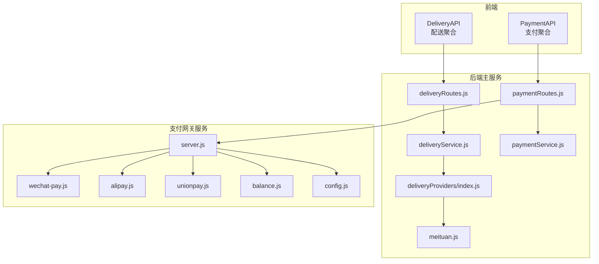
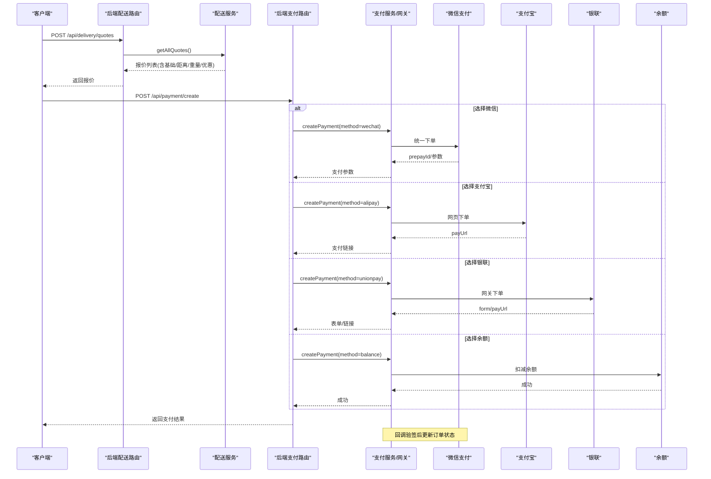
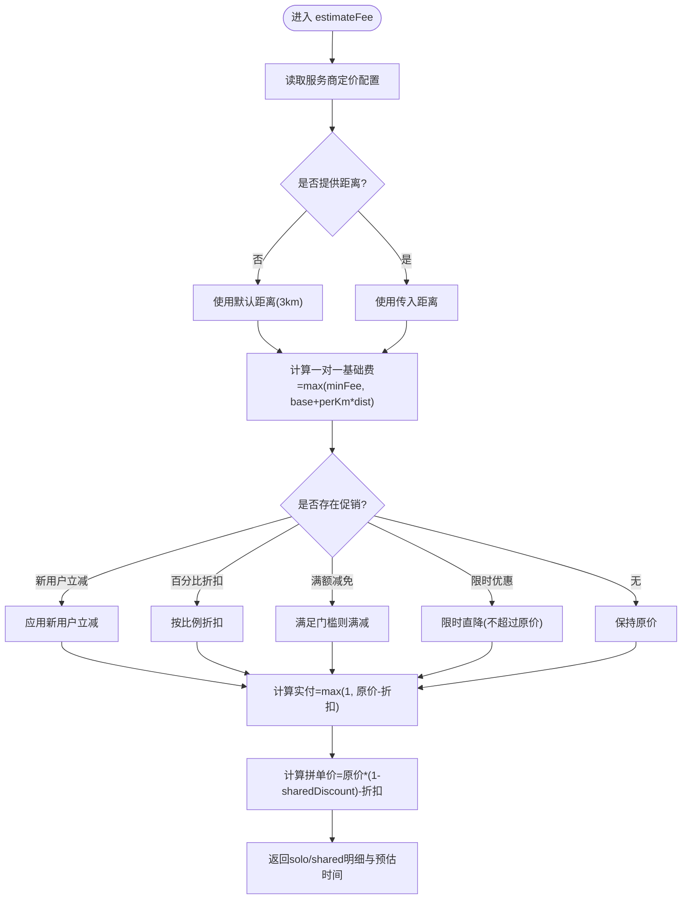
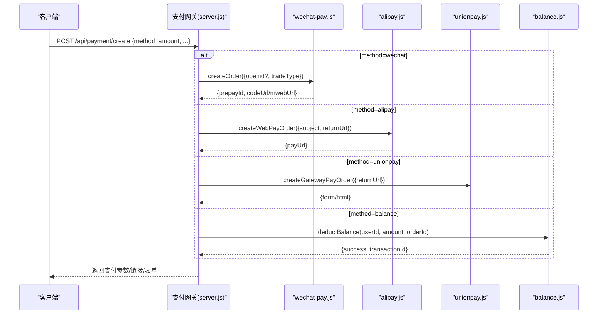
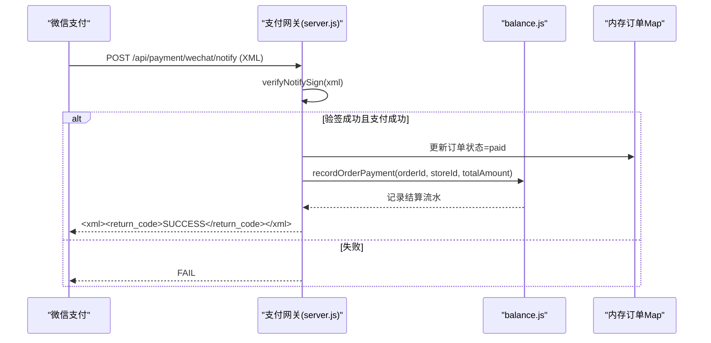
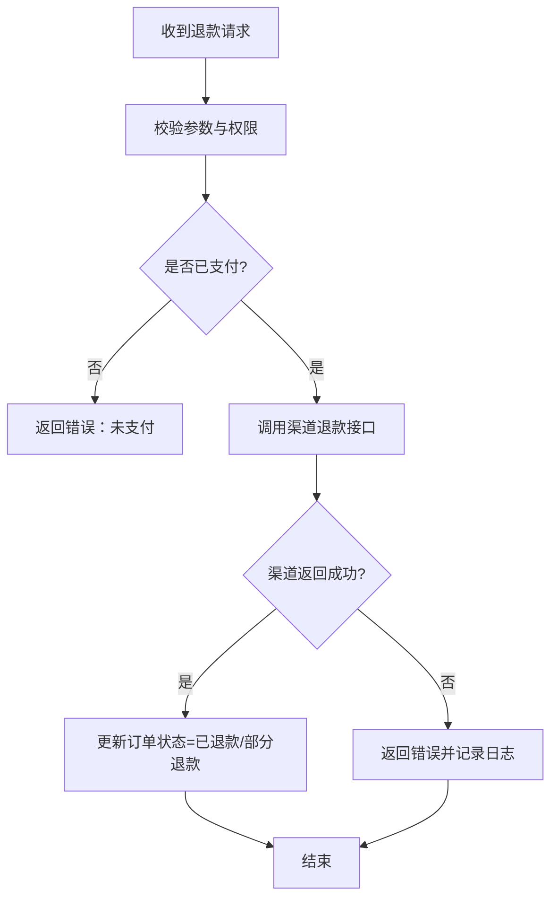
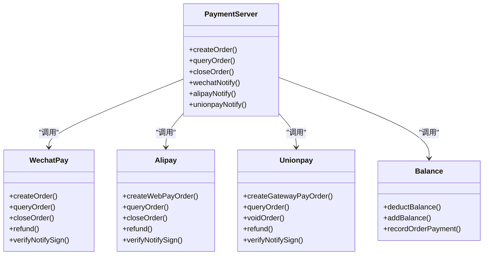

# 配送支付集成

<cite>
**本文引用的文件**   
- [api/payment-api.js](file://api/payment-api.js)
- [api/delivery-api.js](file://api/delivery-api.js)
- [backend/modules/common/services/paymentService.js](file://backend/modules/common/services/paymentService.js)
- [backend/modules/common/services/deliveryService.js](file://backend/modules/common/services/deliveryService.js)
- [backend/modules/common/routes/paymentRoutes.js](file://backend/modules/common/routes/paymentRoutes.js)
- [backend/modules/common/routes/deliveryRoutes.js](file://backend/modules/common/routes/deliveryRoutes.js)
- [api/payment-server/server.js](file://api/payment-server/server.js)
- [api/payment-server/wechat-pay.js](file://api/payment-server/wechat-pay.js)
- [api/payment-server/alipay.js](file://api/payment-server/alipay.js)
- [api/payment-server/unionpay.js](file://api/payment-server/unionpay.js)
- [api/payment-server/balance.js](file://api/payment-server/balance.js)
- [api/payment-server/config.js](file://api/payment-server/config.js)
- [backend/services/deliveryProviders/index.js](file://backend/services/deliveryProviders/index.js)
- [backend/services/deliveryProviders/meituan.js](file://backend/services/deliveryProviders/meituan.js)
</cite>

## 目录
1. [简介](#简介)
2. [项目结构](#项目结构)
3. [核心组件](#核心组件)
4. [架构总览](#架构总览)
5. [详细组件分析](#详细组件分析)
6. [依赖关系分析](#依赖关系分析)
7. [性能与可用性](#性能与可用性)
8. [故障排查指南](#故障排查指南)
9. [结论](#结论)
10. [附录：API 参考](#附录api-参考)

## 简介
本文件为“干洗系统”的配送支付集成完整 API 文档，覆盖以下目标：
- 统一配送费用计算与确认接口（基础运费、距离附加费、重量附加费、优惠券抵扣等）
- 统一支付入口与多支付方式支持（微信支付、支付宝、银联、余额）
- 支付状态同步机制，确保配送订单与支付订单一致性
- 退款处理流程（部分/全额、原因记录）
- 安全验证机制（签名验证、防重放、金额校验）
- 异常处理与故障恢复策略

## 项目结构
围绕“配送+支付”的关键模块分布如下：
- 前端聚合 API（浏览器端）：delivery-api.js、payment-api.js
- 后端业务服务：deliveryService.js、paymentService.js
- 路由层：deliveryRoutes.js、paymentRoutes.js
- 独立支付网关服务：payment-server/server.js 及 wechat/alipay/unionpay/balance 子模块
- 配送服务商接入：deliveryProviders/index.js 与各 provider 实现（如 meituan.js）

图示来源
- [api/delivery-api.js:1-283](file://api/delivery-api.js#L1-L283)
- [api/payment-api.js:1-427](file://api/payment-api.js#L1-L427)
- [backend/modules/common/routes/deliveryRoutes.js:1-323](file://backend/modules/common/routes/deliveryRoutes.js#L1-L323)
- [backend/modules/common/routes/paymentRoutes.js:1-215](file://backend/modules/common/routes/paymentRoutes.js#L1-L215)
- [backend/modules/common/services/deliveryService.js:1-322](file://backend/modules/common/services/deliveryService.js#L1-L322)
- [backend/modules/common/services/paymentService.js:1-185](file://backend/modules/common/services/paymentService.js#L1-L185)
- [backend/services/deliveryProviders/index.js:1-87](file://backend/services/deliveryProviders/index.js#L1-L87)
- [backend/services/deliveryProviders/meituan.js:1-257](file://backend/services/deliveryProviders/meituan.js#L1-L257)
- [api/payment-server/server.js:1-624](file://api/payment-server/server.js#L1-L624)
- [api/payment-server/wechat-pay.js:1-314](file://api/payment-server/wechat-pay.js#L1-L314)
- [api/payment-server/alipay.js:1-336](file://api/payment-server/alipay.js#L1-L336)
- [api/payment-server/unionpay.js:1-501](file://api/payment-server/unionpay.js#L1-L501)
- [api/payment-server/balance.js:1-524](file://api/payment-server/balance.js#L1-524)
- [api/payment-server/config.js:1-80](file://api/payment-server/config.js#L1-L80)

章节来源
- [api/delivery-api.js:1-283](file://api/delivery-api.js#L1-L283)
- [api/payment-api.js:1-427](file://api/payment-api.js#L1-L427)
- [backend/modules/common/routes/deliveryRoutes.js:1-323](file://backend/modules/common/routes/deliveryRoutes.js#L1-L323)
- [backend/modules/common/routes/paymentRoutes.js:1-215](file://backend/modules/common/routes/paymentRoutes.js#L1-L215)
- [backend/modules/common/services/deliveryService.js:1-322](file://backend/modules/common/services/deliveryService.js#L1-L322)
- [backend/modules/common/services/paymentService.js:1-185](file://backend/modules/common/services/paymentService.js#L1-L185)
- [backend/services/deliveryProviders/index.js:1-87](file://backend/services/deliveryProviders/index.js#L1-L87)
- [backend/services/deliveryProviders/meituan.js:1-257](file://backend/services/deliveryProviders/meituan.js#L1-L257)
- [api/payment-server/server.js:1-624](file://api/payment-server/server.js#L1-L624)
- [api/payment-server/wechat-pay.js:1-314](file://api/payment-server/wechat-pay.js#L1-L314)
- [api/payment-server/alipay.js:1-336](file://api/payment-server/alipay.js#L1-L336)
- [api/payment-server/unionpay.js:1-501](file://api/payment-server/unionpay.js#L1-L501)
- [api/payment-server/balance.js:1-524](file://api/payment-server/balance.js#L1-524)
- [api/payment-server/config.js:1-80](file://api/payment-server/config.js#L1-L80)

## 核心组件
- 配送聚合 API（前端）：提供查询可用服务商、创建配送单、取消、状态查询、费用估算等能力。
- 支付聚合 API（前端）：提供获取支付方式列表、创建微信/支付宝/银联/余额支付、查询状态、申请退款、余额充值等。
- 配送服务（后端）：定价规则、报价排序、调用各配送平台（真实或模拟），并标准化响应。
- 支付服务（后端）：统一创建支付、分账逻辑、退款与查询。
- 支付网关服务（独立进程）：统一支付入口、多渠道下单、回调验签、余额与结算、健康检查。
- 配送服务商管理：统一注册与调度各 provider（美团、京东、淘宝、顺丰），支持 real/mock 模式。

章节来源
- [api/delivery-api.js:1-283](file://api/delivery-api.js#L1-L283)
- [api/payment-api.js:1-427](file://api/payment-api.js#L1-L427)
- [backend/modules/common/services/deliveryService.js:1-322](file://backend/modules/common/services/deliveryService.js#L1-L322)
- [backend/modules/common/services/paymentService.js:1-185](file://backend/modules/common/services/paymentService.js#L1-L185)
- [api/payment-server/server.js:1-624](file://api/payment-server/server.js#L1-L624)
- [backend/services/deliveryProviders/index.js:1-87](file://backend/services/deliveryProviders/index.js#L1-L87)

## 架构总览
支付与配送在系统中的交互如下：
- 前端通过 DeliveryAPI/PaymentAPI 发起请求
- 后端路由将请求分发至对应 Service
- 配送 Service 调用 deliveryProviders 下的具体 provider（可 real/mock）
- 支付路由可选择本地 paymentService 或直接转发到支付网关 server.js
- 支付网关负责与微信/支付宝/银联/余额对接，完成下单、查询、关闭、退款、回调验签与结算

图示来源
- [backend/modules/common/routes/deliveryRoutes.js:38-84](file://backend/modules/common/routes/deliveryRoutes.js#L38-L84)
- [backend/modules/common/services/deliveryService.js:173-292](file://backend/modules/common/services/deliveryService.js#L173-L292)
- [backend/modules/common/routes/paymentRoutes.js:13-97](file://backend/modules/common/routes/paymentRoutes.js#L13-L97)
- [api/payment-server/server.js:42-174](file://api/payment-server/server.js#L42-L174)
- [api/payment-server/wechat-pay.js:56-127](file://api/payment-server/wechat-pay.js#L56-L127)
- [api/payment-server/alipay.js:68-104](file://api/payment-server/alipay.js#L68-L104)
- [api/payment-server/unionpay.js:78-123](file://api/payment-server/unionpay.js#L78-L123)
- [api/payment-server/balance.js:91-139](file://api/payment-server/balance.js#L91-L139)

## 详细组件分析

### 配送费用实时计算与确认
- 统一报价接口：POST /api/delivery/quotes
  - 输入：取件/送件坐标、可选距离、服务总金额、是否新用户
  - 输出：各服务商的 solo/shared 两种模式的原价、折扣、实付、预计时间、优惠说明
- 兼容估算接口：POST /api/delivery/estimate
  - 输入：provider、pickup/delivery、deliveryType(solo/shared)、serviceTotal、isNewUser
  - 输出：distance、fee/originalFee/discount、estimatedTime、hasDiscount 等
- 计费规则要点：
  - 基础费用 + 距离附加费（按每公里单价）
  - 可选重量附加费（超过阈值按每单位加价）
  - 促销类型：新用户立减、百分比折扣、满额减免、限时优惠
  - 拼单折扣：基于一对一价格乘以共享折扣系数

图示来源
- [backend/modules/common/services/deliveryService.js:186-292](file://backend/modules/common/services/deliveryService.js#L186-L292)

章节来源
- [backend/modules/common/routes/deliveryRoutes.js:38-84](file://backend/modules/common/routes/deliveryRoutes.js#L38-L84)
- [backend/modules/common/services/deliveryService.js:122-292](file://backend/modules/common/services/deliveryService.js#L122-L292)
- [api/delivery-api.js:260-278](file://api/delivery-api.js#L260-L278)

### 统一支付入口与多渠道下单
- 统一入口（支付网关）：POST /api/payment/create
  - 参数：orderId、amount、subject/body、paymentMethod、userId/openid/returnUrl/clientIp
  - 行为：根据 method 路由到微信/支付宝/银联/余额；生成下单参数并持久化待支付订单
- 渠道实现：
  - 微信支付：JSAPI/NATIVE/H5 下单，生成小程序调起参数或 H5 链接
  - 支付宝：网页/手机网站下单，返回跳转 URL
  - 银联：网关支付，返回自动提交的 HTML 表单
  - 余额：直接校验并扣减用户余额
- 查询与关闭：
  - GET /api/payment/query/:orderId
  - POST /api/payment/close/:orderId

图示来源
- [api/payment-server/server.js:42-174](file://api/payment-server/server.js#L42-L174)
- [api/payment-server/wechat-pay.js:56-127](file://api/payment-server/wechat-pay.js#L56-L127)
- [api/payment-server/alipay.js:68-104](file://api/payment-server/alipay.js#L68-L104)
- [api/payment-server/unionpay.js:78-123](file://api/payment-server/unionpay.js#L78-L123)
- [api/payment-server/balance.js:91-139](file://api/payment-server/balance.js#L91-L139)

章节来源
- [api/payment-server/server.js:42-174](file://api/payment-server/server.js#L42-L174)
- [api/payment-server/wechat-pay.js:56-127](file://api/payment-server/wechat-pay.js#L56-L127)
- [api/payment-server/alipay.js:68-104](file://api/payment-server/alipay.js#L68-L104)
- [api/payment-server/unionpay.js:78-123](file://api/payment-server/unionpay.js#L78-L123)
- [api/payment-server/balance.js:91-139](file://api/payment-server/balance.js#L91-L139)

### 支付状态同步与回调处理
- 微信回调：POST /api/payment/wechat/notify
  - 验签成功后更新内存订单状态为 paid，并记录交易信息
- 支付宝回调：POST /api/payment/alipay/notify
  - RSA2 验签成功后更新状态
- 银联回调：POST /api/payment/unionpay/notify
  - 验签成功后更新状态
- 查询接口：GET /api/payment/query/:orderId
  - 针对外部渠道进行轮询以最终确认状态

图示来源
- [api/payment-server/server.js:312-350](file://api/payment-server/server.js#L312-L350)
- [api/payment-server/balance.js:244-283](file://api/payment-server/balance.js#L244-L283)

章节来源
- [api/payment-server/server.js:312-451](file://api/payment-server/server.js#L312-L451)
- [api/payment-server/balance.js:244-283](file://api/payment-server/balance.js#L244-L283)

### 退款处理流程
- 统一入口（后端路由）：POST /api/payments/refund
  - 参数：orderId、transactionId、amount、reason
  - 行为：调用支付服务执行退款，成功后更新订单退款状态
- 支付网关侧退款：
  - 微信：refund(transactionId, refundId, amount, reason)
  - 支付宝：refund(out_trade_no, refund_amount, refund_reason)
  - 银联：refund(origOrderId, origTxnTime, amount)

图示来源
- [backend/modules/common/routes/paymentRoutes.js:174-212](file://backend/modules/common/routes/paymentRoutes.js#L174-L212)
- [api/payment-server/wechat-pay.js:230-280](file://api/payment-server/wechat-pay.js#L230-L280)
- [api/payment-server/alipay.js:249-298](file://api/payment-server/alipay.js#L249-L298)
- [api/payment-server/unionpay.js:348-401](file://api/payment-server/unionpay.js#L348-L401)

章节来源
- [backend/modules/common/routes/paymentRoutes.js:174-212](file://backend/modules/common/routes/paymentRoutes.js#L174-L212)
- [api/payment-server/wechat-pay.js:230-280](file://api/payment-server/wechat-pay.js#L230-L280)
- [api/payment-server/alipay.js:249-298](file://api/payment-server/alipay.js#L249-L298)
- [api/payment-server/unionpay.js:348-401](file://api/payment-server/unionpay.js#L348-L401)

### 配送订单与支付订单一致性保障
- 支付成功后：
  - 支付网关回调中更新内存订单状态为 paid，并写入结算流水
  - 后端支付路由回调中更新数据库订单支付状态与支付信息
- 配送完成后：
  - 配送回调将服务商状态映射为系统 courierStatus，并通过 MQTT 推送给 C 端
- 建议：
  - 对关键状态变更增加幂等键（如 out_trade_no、refund_id）
  - 引入补偿任务定期拉取第三方状态，修复不一致

章节来源
- [api/payment-server/server.js:312-451](file://api/payment-server/server.js#L312-L451)
- [backend/modules/common/routes/paymentRoutes.js:121-171](file://backend/modules/common/routes/paymentRoutes.js#L121-L171)
- [backend/modules/common/routes/deliveryRoutes.js:174-280](file://backend/modules/common/routes/deliveryRoutes.js#L174-L280)

### 安全验证机制
- 签名验证
  - 微信：MD5/HMAC-SHA256 签名，回调需验签并解密通知体
  - 支付宝：RSA2 验签
  - 银联：SHA256 签名，回调验签
- 防重放攻击
  - 使用 nonceStr/timeStamp 与幂等键（out_trade_no/out_refund_no）
- 金额校验
  - 所有渠道下单前在后端再次校验金额与币种，避免前端篡改

章节来源
- [api/payment-server/wechat-pay.js:285-310](file://api/payment-server/wechat-pay.js#L285-L310)
- [api/payment-server/alipay.js:303-307](file://api/payment-server/alipay.js#L303-L307)
- [api/payment-server/unionpay.js:467-472](file://api/payment-server/unionpay.js#L467-L472)
- [api/payment-server/server.js:56-61](file://api/payment-server/server.js#L56-L61)

### 异常处理与故障恢复
- 超时与重试
  - 前端 API 定义 timeout/retryCount，建议在服务端增加指数退避重试
- 降级策略
  - 配送 provider 在未配置密钥或网络异常时回退 mock 模式
- 幂等与去重
  - 对外部回调与查询接口增加幂等键校验，防止重复处理
- 监控与健康检查
  - 支付网关提供 /api/health，便于探针检测

章节来源
- [api/delivery-api.js:8-12](file://api/delivery-api.js#L8-L12)
- [api/payment-api.js:8-12](file://api/payment-api.js#L8-L12)
- [backend/services/deliveryProviders/meituan.js:88-92](file://backend/services/deliveryProviders/meituan.js#L88-L92)
- [api/payment-server/server.js:582-592](file://api/payment-server/server.js#L582-L592)

## 依赖关系分析
- 路由层依赖服务层，服务层再依赖具体 provider 或支付通道
- 支付网关作为独立服务，集中处理多渠道下单与回调
- 配送 provider 通过统一管理器注册，支持 real/mock 双模式

图示来源
- [api/payment-server/server.js:42-174](file://api/payment-server/server.js#L42-L174)
- [api/payment-server/wechat-pay.js:56-127](file://api/payment-server/wechat-pay.js#L56-L127)
- [api/payment-server/alipay.js:68-104](file://api/payment-server/alipay.js#L68-L104)
- [api/payment-server/unionpay.js:78-123](file://api/payment-server/unionpay.js#L78-L123)
- [api/payment-server/balance.js:91-139](file://api/payment-server/balance.js#L91-L139)

章节来源
- [api/payment-server/server.js:1-624](file://api/payment-server/server.js#L1-L624)
- [api/payment-server/wechat-pay.js:1-314](file://api/payment-server/wechat-pay.js#L1-L314)
- [api/payment-server/alipay.js:1-336](file://api/payment-server/alipay.js#L1-L336)
- [api/payment-server/unionpay.js:1-501](file://api/payment-server/unionpay.js#L1-L501)
- [api/payment-server/balance.js:1-524](file://api/payment-server/balance.js#L1-524)

## 性能与可用性
- 建议指标
  - 下单接口 P95 延迟 < 500ms（不含第三方耗时）
  - 回调处理成功率 > 99.9%
  - 支付查询重试间隔采用指数退避，最大重试次数可控
- 优化建议
  - 对高频查询（支付状态、配送状态）增加缓存与限流
  - 回调处理异步化，先应答第三方，再落库与通知
  - 对配送 provider 的 HTTP 调用设置合理超时与熔断

[本节为通用指导，不直接分析具体文件]

## 故障排查指南
- 常见问题
  - 回调验签失败：检查签名算法、密钥、参数顺序与编码
  - 金额不一致：核对前后端金额单位（元/分）与舍入策略
  - 重复回调：检查幂等键与订单状态机
  - 配送状态不同步：核对 provider 状态映射与回调路径
- 定位步骤
  - 查看支付网关日志与内存订单 Map 状态
  - 核对后端路由回调处理与数据库订单字段
  - 检查配送 provider 日志与 mock/real 模式切换

章节来源
- [api/payment-server/server.js:312-451](file://api/payment-server/server.js#L312-L451)
- [backend/modules/common/routes/paymentRoutes.js:121-171](file://backend/modules/common/routes/paymentRoutes.js#L121-L171)
- [backend/modules/common/routes/deliveryRoutes.js:174-280](file://backend/modules/common/routes/deliveryRoutes.js#L174-L280)

## 结论
本集成方案通过统一的配送与支付入口，结合多渠道实现与严格的验签、幂等与补偿机制，实现了从费用计算、下单、支付、回调到结算的全链路闭环。后续可在高可用、监控告警与风控方面持续增强。

[本节为总结性内容，不直接分析具体文件]

## 附录：API 参考

### 配送相关
- 获取服务商状态（含 REAL/MOCK）
  - GET /api/delivery/provider-status
- 获取支持的配送平台（含报价）
  - GET /api/delivery/providers
- 一键获取所有服务商报价（含一对一和拼单）
  - POST /api/delivery/quotes
  - 请求体：{ pickup, delivery, distance, serviceTotal, isNewUser }
- 估算配送费用（兼容旧接口，支持 deliveryType）
  - POST /api/delivery/estimate
  - 请求体：{ provider, pickup, delivery, deliveryType, serviceTotal, isNewUser }
- 创建配送订单
  - POST /api/delivery/create
  - 请求体：{ orderId, provider, pickup, delivery }
- 查询配送状态
  - GET /api/delivery/status/:deliveryId?provider=...
- 取消配送
  - POST /api/delivery/cancel
  - 请求体：{ deliveryId, provider, reason }
- 配送状态回调（由服务商调用）
  - POST /api/delivery/callback
  - 请求体：{ deliveryId, status, driverInfo, location, timestamp, description }

章节来源
- [backend/modules/common/routes/deliveryRoutes.js:13-323](file://backend/modules/common/routes/deliveryRoutes.js#L13-L323)

### 支付相关（后端路由）
- 创建支付订单
  - POST /api/payments/create
  - 请求体：{ orderId, orderType, amount, method, openid }
- 查询支付状态
  - GET /api/payments/query/:orderId
- 微信支付回调
  - POST /api/payments/wechat/callback
- 申请退款
  - POST /api/payments/refund
  - 请求体：{ orderId, transactionId, amount, reason }

章节来源
- [backend/modules/common/routes/paymentRoutes.js:13-212](file://backend/modules/common/routes/paymentRoutes.js#L13-L212)

### 支付网关（独立服务）
- 统一支付入口
  - POST /api/payment/create
- 查询支付状态
  - GET /api/payment/query/:orderId
- 关闭订单
  - POST /api/payment/close/:orderId
- 微信回调
  - POST /api/payment/wechat/notify
- 支付宝回调
  - POST /api/payment/alipay/notify
- 银联回调
  - POST /api/payment/unionpay/notify
- 余额查询与充值
  - GET /api/balance/:userId
  - GET /api/balance/:userId/transactions
  - POST /api/balance/recharge
- 门店结算
  - GET /api/settlement/store/:storeId
  - GET /api/settlement/store/:storeId/records
  - POST /api/settlement/store/:storeId/settle
  - POST /api/settlement/store/:storeId/withdraw
  - POST /api/settlement/report
- 健康检查
  - GET /api/health

章节来源
- [api/payment-server/server.js:42-624](file://api/payment-server/server.js#L42-L624)
- [api/payment-server/config.js:1-80](file://api/payment-server/config.js#L1-L80)