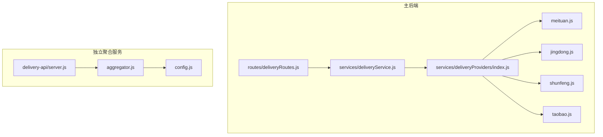
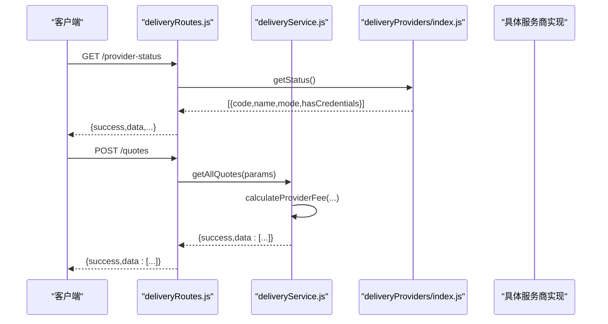
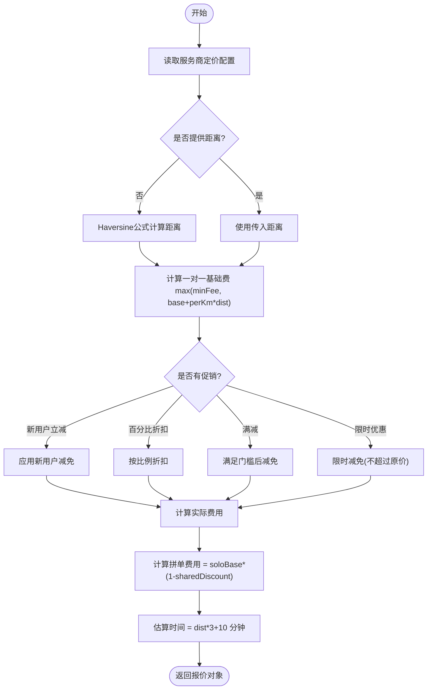
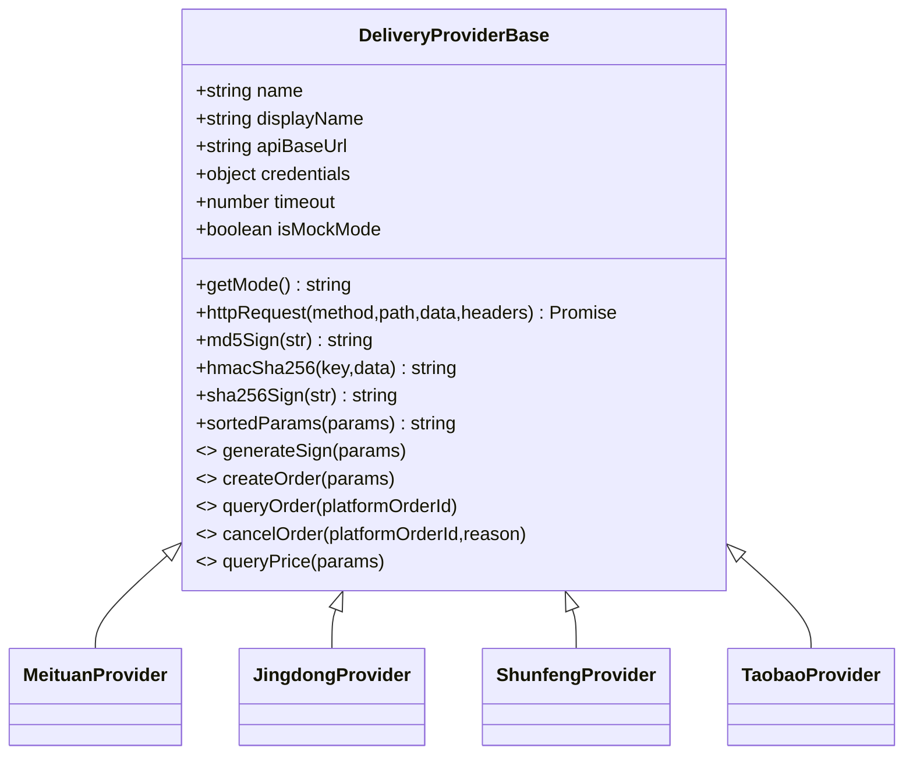
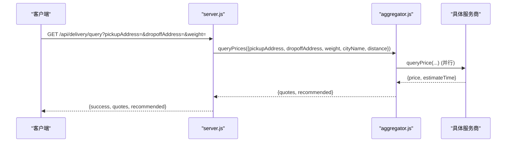
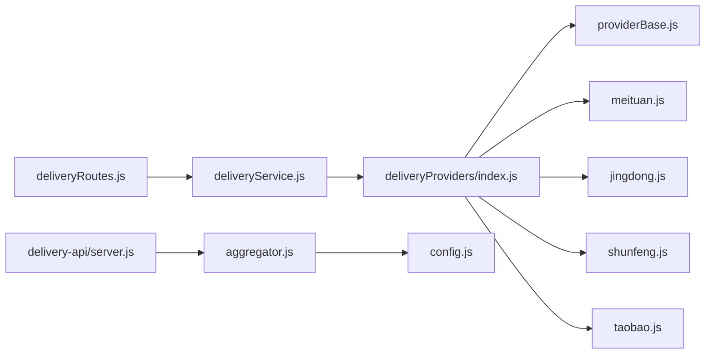

# 配送服务商管理

<cite>
**本文引用的文件列表**
- [backend/modules/common/routes/deliveryRoutes.js](file://backend/modules/common/routes/deliveryRoutes.js)
- [backend/modules/common/services/deliveryService.js](file://backend/modules/common/services/deliveryService.js)
- [backend/services/deliveryProviders/index.js](file://backend/services/deliveryProviders/index.js)
- [backend/services/deliveryProviders/providerBase.js](file://backend/services/deliveryProviders/providerBase.js)
- [backend/services/deliveryProviders/meituan.js](file://backend/services/deliveryProviders/meituan.js)
- [backend/services/deliveryProviders/jingdong.js](file://backend/services/deliveryProviders/jingdong.js)
- [backend/services/deliveryProviders/shunfeng.js](file://backend/services/deliveryProviders/shunfeng.js)
- [backend/services/deliveryProviders/taobao.js](file://backend/services/deliveryProviders/taobao.js)
- [delivery-api/server.js](file://delivery-api/server.js)
- [delivery-api/aggregator.js](file://delivery-api/aggregator.js)
- [delivery-api/config.js](file://delivery-api/config.js)
- [api/delivery-api.js](file://api/delivery-api.js)
</cite>

## 目录
1. [简介](#简介)
2. [项目结构](#项目结构)
3. [核心组件](#核心组件)
4. [架构总览](#架构总览)
5. [详细组件分析](#详细组件分析)
6. [依赖关系分析](#依赖关系分析)
7. [性能与可用性](#性能与可用性)
8. [故障排查指南](#故障排查指南)
9. [结论](#结论)
10. [附录：接入与测试流程](#附录接入与测试流程)

## 简介
本文件为“配送服务商管理”的完整API文档，覆盖多家物流服务商（美团跑腿、京东秒送、顺丰同城、淘宝闪送）的统一接入与管理。内容包括：
- 服务商列表查询、状态管理、配置更新
- 服务商基本信息结构定义（服务ID、名称、图标、预计时间、基础费用、实际费用、评分、折扣信息等）
- 可用性检查接口（按取送地址、物品重量等动态筛选可用服务商）
- 优先级排序算法与智能推荐机制
- 接入配置、认证方式、API密钥管理
- 新增第三方物流服务商的标准化接入指南与测试验证流程

## 项目结构
后端提供两套对外能力：
- 主后端模块：通过路由与服务层暴露统一配送管理能力
- 独立聚合服务 delivery-api：提供聚合询价、下单、查询、取消等接口

图表来源
- [backend/modules/common/routes/deliveryRoutes.js:1-175](file://backend/modules/common/routes/deliveryRoutes.js#L1-L175)
- [backend/modules/common/services/deliveryService.js:1-322](file://backend/modules/common/services/deliveryService.js#L1-L322)
- [backend/services/deliveryProviders/index.js:1-87](file://backend/services/deliveryProviders/index.js#L1-L87)
- [delivery-api/server.js:1-377](file://delivery-api/server.js#L1-L377)
- [delivery-api/aggregator.js:1-237](file://delivery-api/aggregator.js#L1-L237)
- [delivery-api/config.js:1-41](file://delivery-api/config.js#L1-L41)

章节来源
- [backend/modules/common/routes/deliveryRoutes.js:1-175](file://backend/modules/common/routes/deliveryRoutes.js#L1-L175)
- [backend/modules/common/services/deliveryService.js:1-322](file://backend/modules/common/services/deliveryService.js#L1-L322)
- [delivery-api/server.js:1-377](file://delivery-api/server.js#L1-L377)
- [delivery-api/aggregator.js:1-237](file://delivery-api/aggregator.js#L1-L237)
- [delivery-api/config.js:1-41](file://delivery-api/config.js#L1-L41)

## 核心组件
- 路由层：对外暴露REST接口，负责参数校验、鉴权、调用服务层
- 服务层：封装定价计算、报价聚合、订单创建/查询/取消、状态标准化
- 提供商管理器：注册并分发到具体服务商实现（真实或模拟）
- 各服务商实现：美团、京东秒送、顺丰同城、淘宝闪送的统一接口适配
- 独立聚合服务：提供跨服务的聚合询价、下单、查询、取消等能力

章节来源
- [backend/modules/common/routes/deliveryRoutes.js:1-175](file://backend/modules/common/routes/deliveryRoutes.js#L1-L175)
- [backend/modules/common/services/deliveryService.js:1-322](file://backend/modules/common/services/deliveryService.js#L1-L322)
- [backend/services/deliveryProviders/index.js:1-87](file://backend/services/deliveryProviders/index.js#L1-L87)
- [delivery-api/server.js:1-377](file://delivery-api/server.js#L1-L377)
- [delivery-api/aggregator.js:1-237](file://delivery-api/aggregator.js#L1-L237)

## 架构总览
系统采用“路由-服务-提供商适配器”的分层架构，支持多服务商并行询价与智能推荐。

图表来源
- [backend/modules/common/routes/deliveryRoutes.js:1-175](file://backend/modules/common/routes/deliveryRoutes.js#L1-L175)
- [backend/modules/common/services/deliveryService.js:1-322](file://backend/modules/common/services/deliveryService.js#L1-L322)
- [backend/services/deliveryProviders/index.js:1-87](file://backend/services/deliveryProviders/index.js#L1-L87)

## 详细组件分析

### 1. 路由层 API 清单与说明
以下接口由主后端暴露，用于统一管理多家配送服务商。

- 获取服务商接入状态（含REAL/MOCK模式标识）
  - 方法路径：GET /provider-status
  - 功能：返回各服务商的接入模式与凭据情况，便于前端展示与降级策略
  - 响应字段：包含 code、name、mode、hasCredentials 等

- 获取支持的配送平台（含报价信息）
  - 方法路径：GET /providers
  - 功能：返回所有可用服务商的基础信息与定价配置

- 一键获取所有服务商报价（含一对一和拼单两种模式）
  - 方法路径：POST /quotes
  - 请求体字段：pickup、delivery、distance、serviceTotal、isNewUser
  - 功能：基于距离、新用户、满减等规则计算各服务商报价，并返回一对一与拼单价格

- 创建配送订单
  - 方法路径：POST /create
  - 请求体字段：provider、orderId、pickup、delivery、callbackUrl、goodsDesc、weight
  - 功能：根据 provider 选择对应服务商下单；未配置密钥时自动回退至模拟数据

- 查询配送状态
  - 方法路径：GET /status/:deliveryId?provider=xxx
  - 功能：查询指定平台订单状态，返回标准化状态、司机信息、预估时间等

- 取消配送
  - 方法路径：POST /cancel
  - 请求体字段：deliveryId、provider、reason
  - 功能：取消指定平台订单，返回结果

- 配送状态回调（由配送平台调用）
  - 方法路径：POST /callback
  - 功能：接收平台状态推送，驱动C端跟踪状态流转

章节来源
- [backend/modules/common/routes/deliveryRoutes.js:1-175](file://backend/modules/common/routes/deliveryRoutes.js#L1-L175)

### 2. 服务层：定价与报价逻辑
- 定价配置：每个服务商具备 base、perKm、minFee、sharedDiscount、rating、promo 等规则
- 报价计算：
  - 一对一（solo）：基础费 + 里程附加费，应用促销（新用户立减、百分比折扣、满减、限时优惠）
  - 拼单（shared）：在一对一基础上乘以共享折扣系数
- 估算时间：基于距离与固定系数计算分钟区间
- 兼容旧接口：estimateFee 返回历史兼容格式

图表来源
- [backend/modules/common/services/deliveryService.js:117-292](file://backend/modules/common/services/deliveryService.js#L117-L292)

章节来源
- [backend/modules/common/services/deliveryService.js:117-292](file://backend/modules/common/services/deliveryService.js#L117-L292)

### 3. 提供商管理器与基类
- 管理器职责：
  - 注册各服务商实例
  - 提供 get/getAll/getStatus 等方法
  - 转发 createOrder/queryOrder/cancelOrder/queryPrice 调用
- 基类职责：
  - HTTPS 请求封装、超时处理
  - MD5/HMAC-SHA256/SHA256 签名工具
  - 参数排序拼接
  - 抽象接口定义（子类必须实现）

图表来源
- [backend/services/deliveryProviders/providerBase.js:1-124](file://backend/services/deliveryProviders/providerBase.js#L1-L124)
- [backend/services/deliveryProviders/meituan.js:1-257](file://backend/services/deliveryProviders/meituan.js#L1-L257)
- [backend/services/deliveryProviders/jingdong.js:1-278](file://backend/services/deliveryProviders/jingdong.js#L1-L278)
- [backend/services/deliveryProviders/shunfeng.js:1-262](file://backend/services/deliveryProviders/shunfeng.js#L1-L262)
- [backend/services/deliveryProviders/taobao.js:1-263](file://backend/services/deliveryProviders/taobao.js#L1-L263)

章节来源
- [backend/services/deliveryProviders/index.js:1-87](file://backend/services/deliveryProviders/index.js#L1-L87)
- [backend/services/deliveryProviders/providerBase.js:1-124](file://backend/services/deliveryProviders/providerBase.js#L1-L124)

### 4. 各服务商实现要点
- 美团跑腿
  - 签名：MD5(appId + timestamp + secret)
  - 关键接口：创建订单、查询状态、取消、询价
  - Mock：无密钥时返回合理模拟数据
- 京东秒送（达达开放平台）
  - 签名：参数排序拼接后加secret，MD5大写
  - 关键接口：创建订单、查询状态、取消、询价
  - Mock：无密钥时返回合理模拟数据
- 顺丰同城
  - 签名：MD5(timestamp + checkWord)
  - 关键接口：创建订单、查询状态、取消、询价
  - Mock：无密钥时返回合理模拟数据
- 淘宝闪送（蜂鸟即配/饿了么开放平台）
  - 签名：参数排序拼接后加secret，MD5
  - 关键接口：创建订单、查询状态、取消、询价
  - Mock：无密钥时返回合理模拟数据

章节来源
- [backend/services/deliveryProviders/meituan.js:1-257](file://backend/services/deliveryProviders/meituan.js#L1-L257)
- [backend/services/deliveryProviders/jingdong.js:1-278](file://backend/services/deliveryProviders/jingdong.js#L1-L278)
- [backend/services/deliveryProviders/shunfeng.js:1-262](file://backend/services/deliveryProviders/shunfeng.js#L1-L262)
- [backend/services/deliveryProviders/taobao.js:1-263](file://backend/services/deliveryProviders/taobao.js#L1-L263)

### 5. 独立聚合服务（delivery-api）
- 主要接口
  - GET /api/delivery/providers：获取可用服务商列表
  - GET /api/delivery/query：并行询价多家服务商，返回报价与推荐
  - POST /api/delivery/create：创建配送订单（可指定或自动选择最优）
  - GET /api/delivery/:provider/:orderId：查询订单状态
  - POST /api/delivery/:provider/:orderId/cancel：取消订单
- 推荐策略
  - 最低价、最快、综合推荐（价格与时效加权）
- 配置项
  - server.port、各服务商 enabled/test/production 配置与环境变量映射

图表来源
- [delivery-api/server.js:52-83](file://delivery-api/server.js#L52-L83)
- [delivery-api/aggregator.js:54-95](file://delivery-api/aggregator.js#L54-L95)

章节来源
- [delivery-api/server.js:1-377](file://delivery-api/server.js#L1-L377)
- [delivery-api/aggregator.js:1-237](file://delivery-api/aggregator.js#L1-L237)
- [delivery-api/config.js:1-41](file://delivery-api/config.js#L1-L41)

### 6. 服务商基本信息结构与字段定义
以下为前端展示与计费所需的核心字段（来源于服务层定价配置与返回结构）：
- id/code：服务商唯一标识（如 meituan、jingdong、shunfeng、taobao）
- name：服务商名称（如 美团跑腿、京东秒送、顺丰同城、淘宝闪送）
- icon：图标（emoji或图片URL）
- rating：评分（数值）
- distance：距离（km）
- estimatedMinutes：估算分钟数
- estimatedTime：时间区间字符串（如 “30-45分钟”）
- hasDiscount：是否存在折扣
- discountInfo：折扣描述文本
- pricing.solo.originalFee/discount/actualFee：一对一原价、折扣额、实付
- pricing.shared.originalFee/discount/actualFee：拼单原价、折扣额、实付

章节来源
- [backend/modules/common/services/deliveryService.js:117-292](file://backend/modules/common/services/deliveryService.js#L117-L292)
- [api/delivery-api.js:14-55](file://api/delivery-api.js#L14-L55)

### 7. 可用性检查与动态筛选
- 可用性判定依据：
  - 服务商已启用且存在有效凭据（real模式），或处于mock模式仍可展示
  - 距离与地址有效性（若未提供距离，则通过经纬度计算）
  - 重量与城市等参数影响报价与时效
- 动态筛选：
  - 根据 pickup/delivery 坐标计算距离
  - 结合 weight、cityName 等参数进行报价与时效评估
  - 过滤不可用或异常的服务商（在聚合层记录错误并排除）

章节来源
- [backend/modules/common/services/deliveryService.js:173-292](file://backend/modules/common/services/deliveryService.js#L173-L292)
- [delivery-api/aggregator.js:54-95](file://delivery-api/aggregator.js#L54-L95)

### 8. 优先级排序与智能推荐机制
- 排序策略：
  - 最低价优先：按 price 升序
  - 最快优先：按 estimateTime 最小
  - 综合推荐：价格与时效加权评分（示例权重：价格40%、时效60%）
- 推荐输出：
  - 返回推荐服务商及其关键指标，供前端高亮显示

章节来源
- [delivery-api/aggregator.js:102-129](file://delivery-api/aggregator.js#L102-L129)

### 9. 接入配置、认证方式与密钥管理
- 环境变量（主后端）
  - 美团：MEITUAN_APP_ID / MEITUAN_APP_SECRET
  - 京东秒送（达达）：DADA_APP_KEY / DADA_APP_SECRET / DADA_SOURCE_ID
  - 淘宝闪送（蜂鸟）：TAOBAO_FENGNIAO_APP_ID / TAOBAO_FENGNIAO_SECRET / TAOBAO_MERCHANT_ID
  - 顺丰同城：SF_PARTNER_ID / SF_CHECK_WORD
- 独立聚合服务配置（delivery-api/config.js）
  - server.port
  - 各服务商 enabled/test/production 配置与环境变量映射
- 认证与签名
  - 各服务商实现各自签名算法（MD5/HMAC/SHA256）
  - 请求头与参数需遵循平台规范
- 运行模式
  - real：已配置密钥，调用真实API
  - mock：未配置密钥，返回合理模拟数据，便于开发联调

章节来源
- [backend/services/deliveryProviders/index.js:1-49](file://backend/services/deliveryProviders/index.js#L1-L49)
- [delivery-api/config.js:1-41](file://delivery-api/config.js#L1-L41)
- [backend/services/deliveryProviders/providerBase.js:1-124](file://backend/services/deliveryProviders/providerBase.js#L1-L124)

### 10. 新增第三方物流服务商接入指南
步骤概览：
1. 新建服务商实现类
   - 继承 DeliveryProviderBase
   - 实现 generateSign、createOrder、queryOrder、cancelOrder、queryPrice
   - 实现 _mockCreateOrder/_mockQueryOrder/_mockPrice 等模拟方法
2. 注册到提供商管理器
   - 在 index.js 中引入新实现并加入 providers 映射
3. 更新服务层定价配置
   - 在 deliveryService.js 的 getProviderPricingConfig 中添加新服务商定价规则
4. 更新路由与前端展示
   - 确保 /providers 与 /quotes 能返回新服务商
5. 配置环境变量与密钥
   - 设置对应环境变量以切换 real/mock 模式
6. 单元测试与集成测试
   - 验证创建、查询、取消、询价全流程
   - 验证签名与异常回退逻辑

章节来源
- [backend/services/deliveryProviders/providerBase.js:1-124](file://backend/services/deliveryProviders/providerBase.js#L1-L124)
- [backend/services/deliveryProviders/index.js:1-87](file://backend/services/deliveryProviders/index.js#L1-L87)
- [backend/modules/common/services/deliveryService.js:117-168](file://backend/modules/common/services/deliveryService.js#L117-L168)

## 依赖关系分析
- 路由层依赖服务层，服务层依赖提供商管理器，管理器分发到具体服务商实现
- 独立聚合服务通过 aggregator 调度各服务商，config 控制开关与密钥映射
- 基类提供通用HTTP与签名能力，降低重复代码

图表来源
- [backend/modules/common/routes/deliveryRoutes.js:1-175](file://backend/modules/common/routes/deliveryRoutes.js#L1-L175)
- [backend/modules/common/services/deliveryService.js:1-322](file://backend/modules/common/services/deliveryService.js#L1-L322)
- [backend/services/deliveryProviders/index.js:1-87](file://backend/services/deliveryProviders/index.js#L1-L87)
- [backend/services/deliveryProviders/providerBase.js:1-124](file://backend/services/deliveryProviders/providerBase.js#L1-L124)
- [delivery-api/server.js:1-377](file://delivery-api/server.js#L1-L377)
- [delivery-api/aggregator.js:1-237](file://delivery-api/aggregator.js#L1-L237)
- [delivery-api/config.js:1-41](file://delivery-api/config.js#L1-L41)

章节来源
- [backend/modules/common/routes/deliveryRoutes.js:1-175](file://backend/modules/common/routes/deliveryRoutes.js#L1-L175)
- [backend/modules/common/services/deliveryService.js:1-322](file://backend/modules/common/services/deliveryService.js#L1-L322)
- [backend/services/deliveryProviders/index.js:1-87](file://backend/services/deliveryProviders/index.js#L1-L87)
- [delivery-api/server.js:1-377](file://delivery-api/server.js#L1-L377)
- [delivery-api/aggregator.js:1-237](file://delivery-api/aggregator.js#L1-L237)
- [delivery-api/config.js:1-41](file://delivery-api/config.js#L1-L41)

## 性能与可用性
- 并行询价：聚合层使用并发请求同时查询多家服务商，提升整体响应速度
- 超时与降级：基类提供超时控制，失败时回退至模拟数据，保证可用性
- 推荐策略可调：通过配置选择最低价格、最快或综合推荐，平衡成本与体验
- 距离计算：Haversine公式估算距离，避免额外地理服务依赖

[本节为通用指导，不直接分析具体文件]

## 故障排查指南
- 常见问题定位
  - 缺少必要参数：路由层会返回错误提示，检查请求体或查询参数
  - 未知服务商：确认 provider 名称是否在管理器中注册
  - 签名失败：核对各服务商签名算法与参数顺序
  - 网络超时：检查HTTPS请求与超时配置，必要时增大 timeout
- 日志与调试
  - 查看控制台日志中的 “[配送]” 前缀信息
  - 使用 /provider-status 接口确认当前运行模式（real/mock）

章节来源
- [backend/modules/common/routes/deliveryRoutes.js:1-175](file://backend/modules/common/routes/deliveryRoutes.js#L1-L175)
- [backend/services/deliveryProviders/providerBase.js:1-124](file://backend/services/deliveryProviders/providerBase.js#L1-L124)

## 结论
本方案通过分层架构与统一适配器，实现了多家物流服务商的集中管理与灵活扩展。服务层提供稳定的定价与报价逻辑，提供商层屏蔽平台差异，聚合层提供高效并发与智能推荐。配合完善的配置与密钥管理，既保障生产稳定性，又兼顾开发效率。

[本节为总结性内容，不直接分析具体文件]

## 附录：接入与测试流程

### A. 环境准备与密钥配置
- 在主后端环境变量中配置各服务商密钥（见“接入配置、认证方式与密钥管理”）
- 在独立聚合服务 config.js 中配置 server.port 与各服务商 enabled/test/production 映射

章节来源
- [backend/services/deliveryProviders/index.js:1-49](file://backend/services/deliveryProviders/index.js#L1-L49)
- [delivery-api/config.js:1-41](file://delivery-api/config.js#L1-L41)

### B. 本地联调与模拟数据
- 未配置密钥时，系统将进入 mock 模式，返回合理模拟数据
- 使用 /provider-status 与 /providers 接口验证服务商可见性与模式

章节来源
- [backend/modules/common/routes/deliveryRoutes.js:1-175](file://backend/modules/common/routes/deliveryRoutes.js#L1-L175)

### C. 端到端测试用例
- 创建订单：POST /create，验证 platformOrderId 与 status
- 查询状态：GET /status/:deliveryId?provider=xxx，验证状态流转
- 取消订单：POST /cancel，验证成功返回与平台侧同步
- 询价：POST /quotes，验证 solo/shared 价格与折扣信息

章节来源
- [backend/modules/common/routes/deliveryRoutes.js:1-175](file://backend/modules/common/routes/deliveryRoutes.js#L1-L175)
- [backend/modules/common/services/deliveryService.js:173-292](file://backend/modules/common/services/deliveryService.js#L173-L292)

### D. 新增服务商验收清单
- 实现类完成并注册
- 定价配置添加
- 路由与服务层返回正确
- 环境变量配置生效（real/mock）
- 单元测试与集成测试通过

章节来源
- [backend/services/deliveryProviders/providerBase.js:1-124](file://backend/services/deliveryProviders/providerBase.js#L1-L124)
- [backend/services/deliveryProviders/index.js:1-87](file://backend/services/deliveryProviders/index.js#L1-L87)
- [backend/modules/common/services/deliveryService.js:117-168](file://backend/modules/common/services/deliveryService.js#L117-L168)