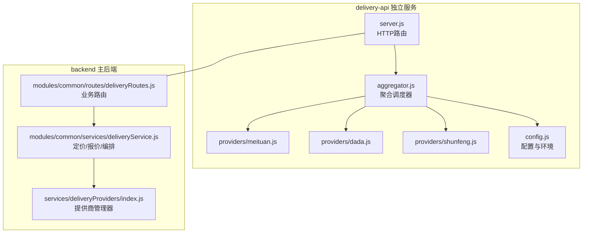
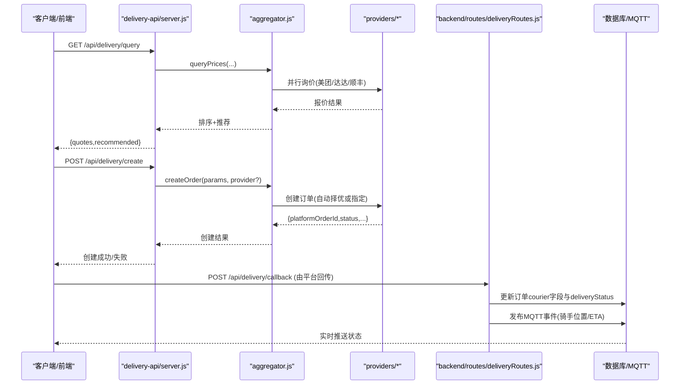
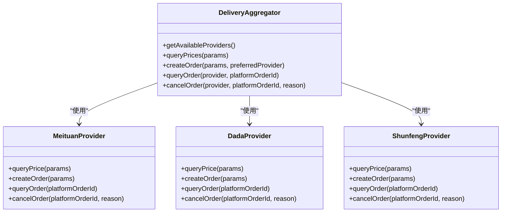
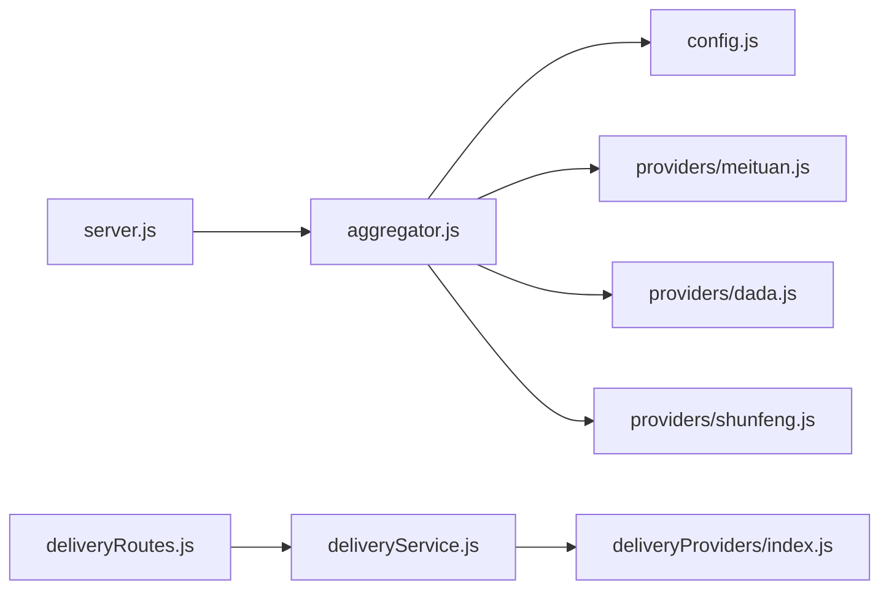

# 配送物流接口

<cite>
**本文引用的文件**   
- [delivery-api/server.js](file://delivery-api/server.js)
- [delivery-api/aggregator.js](file://delivery-api/aggregator.js)
- [delivery-api/config.js](file://delivery-api/config.js)
- [delivery-api/providers/meituan.js](file://delivery-api/providers/meituan.js)
- [delivery-api/providers/dada.js](file://delivery-api/providers/dada.js)
- [delivery-api/providers/shunfeng.js](file://delivery-api/providers/shunfeng.js)
- [backend/modules/common/routes/deliveryRoutes.js](file://backend/modules/common/routes/deliveryRoutes.js)
- [backend/modules/common/services/deliveryService.js](file://backend/modules/common/services/deliveryService.js)
- [backend/services/deliveryProviders/index.js](file://backend/services/deliveryProviders/index.js)
- [api/delivery-api.js](file://api/delivery-api.js)
- [delivery-api/README.md](file://delivery-api/README.md)
- [delivery-api/test-api.js](file://delivery-api/test-api.js)
</cite>

## 目录
1. [简介](#简介)
2. [项目结构](#项目结构)
3. [核心组件](#核心组件)
4. [架构总览](#架构总览)
5. [详细组件分析](#详细组件分析)
6. [依赖关系分析](#依赖关系分析)
7. [性能与可用性](#性能与可用性)
8. [故障排查指南](#故障排查指南)
9. [结论](#结论)
10. [附录：联调与测试说明](#附录联调与测试说明)

## 简介
本文件为多平台配送聚合服务的完整API接口文档，覆盖美团跑腿、京东秒送（达达）、顺丰同城等主流服务商的统一接入。文档包含：
- 统一对外REST API：服务商查询、询价、下单、状态查询、取消订单
- 聚合调度策略：智能比价、最优选择、异常降级
- 实时同步机制：回调驱动的状态更新、骑手位置与ETA推送
- 对接指南：参数规范、响应格式、错误码、联调步骤

## 项目结构
本项目包含两套相关实现：
- delivery-api：独立微服务，提供统一的聚合配送REST API，内部通过Provider抽象适配多家服务商
- backend：主后端模块，提供业务路由与定价/报价逻辑，并通过deliveryProviders统一入口调用各服务商

图表来源
- [delivery-api/server.js:1-377](file://delivery-api/server.js#L1-L377)
- [delivery-api/aggregator.js:1-237](file://delivery-api/aggregator.js#L1-L237)
- [delivery-api/providers/meituan.js:1-231](file://delivery-api/providers/meituan.js#L1-L231)
- [delivery-api/providers/dada.js:1-237](file://delivery-api/providers/dada.js#L1-L237)
- [delivery-api/providers/shunfeng.js:1-256](file://delivery-api/providers/shunfeng.js#L1-L256)
- [delivery-api/config.js:1-93](file://delivery-api/config.js#L1-L93)
- [backend/modules/common/routes/deliveryRoutes.js:1-323](file://backend/modules/common/routes/deliveryRoutes.js#L1-L323)
- [backend/modules/common/services/deliveryService.js:1-322](file://backend/modules/common/services/deliveryService.js#L1-L322)
- [backend/services/deliveryProviders/index.js:1-87](file://backend/services/deliveryProviders/index.js#L1-L87)

章节来源
- [delivery-api/server.js:1-377](file://delivery-api/server.js#L1-L377)
- [delivery-api/aggregator.js:1-237](file://delivery-api/aggregator.js#L1-L237)
- [delivery-api/config.js:1-93](file://delivery-api/config.js#L1-L93)
- [backend/modules/common/routes/deliveryRoutes.js:1-323](file://backend/modules/common/routes/deliveryRoutes.js#L1-L323)
- [backend/modules/common/services/deliveryService.js:1-322](file://backend/modules/common/services/deliveryService.js#L1-L322)
- [backend/services/deliveryProviders/index.js:1-87](file://backend/services/deliveryProviders/index.js#L1-L87)

## 核心组件
- 聚合调度器（DeliveryAggregator）
  - 负责并行询价、推荐策略、自动选择最优服务商并创建订单
  - 支持按名称指定优先服务商或自动择优
- 服务商提供者（Provider）
  - meituan、dada、shunfeng 三类实现，封装签名、请求构造、模拟数据
- 路由层（server.js）
  - 暴露统一REST接口：健康检查、服务商列表、询价、下单、状态查询、取消
- 业务路由（deliveryRoutes.js）
  - 面向主后端的业务接口：获取报价、估算费用、下单、状态查询、取消、回调处理、跟踪启动
- 定价与报价（deliveryService.js）
  - 计算一对一/拼单价格、折扣策略、距离估算、服务商列表与模式标识
- 提供商管理器（index.js）
  - 统一注册/获取各服务商实例，返回运行模式（real/mock）

章节来源
- [delivery-api/aggregator.js:1-237](file://delivery-api/aggregator.js#L1-L237)
- [delivery-api/providers/meituan.js:1-231](file://delivery-api/providers/meituan.js#L1-L231)
- [delivery-api/providers/dada.js:1-237](file://delivery-api/providers/dada.js#L1-L237)
- [delivery-api/providers/shunfeng.js:1-256](file://delivery-api/providers/shunfeng.js#L1-L256)
- [delivery-api/server.js:1-377](file://delivery-api/server.js#L1-L377)
- [backend/modules/common/routes/deliveryRoutes.js:1-323](file://backend/modules/common/routes/deliveryRoutes.js#L1-L323)
- [backend/modules/common/services/deliveryService.js:1-322](file://backend/modules/common/services/deliveryService.js#L1-L322)
- [backend/services/deliveryProviders/index.js:1-87](file://backend/services/deliveryProviders/index.js#L1-L87)

## 架构总览
下图展示从客户端到聚合服务再到具体服务商的调用链路，以及回调驱动的实时状态同步。

图表来源
- [delivery-api/server.js:44-201](file://delivery-api/server.js#L44-L201)
- [delivery-api/aggregator.js:54-197](file://delivery-api/aggregator.js#L54-L197)
- [delivery-api/providers/meituan.js:43-130](file://delivery-api/providers/meituan.js#L43-L130)
- [delivery-api/providers/dada.js:41-136](file://delivery-api/providers/dada.js#L41-L136)
- [delivery-api/providers/shunfeng.js:50-152](file://delivery-api/providers/shunfeng.js#L50-L152)
- [backend/modules/common/routes/deliveryRoutes.js:172-280](file://backend/modules/common/routes/deliveryRoutes.js#L172-L280)

## 详细组件分析

### 统一REST API（delivery-api）
- 健康检查
  - 方法/路径：GET /api/health
  - 功能：返回服务状态与可用服务商列表
- 获取可用服务商
  - 方法/路径：GET /api/delivery/providers
  - 功能：返回已启用的服务商清单
- 询价
  - 方法/路径：GET /api/delivery/query?pickupAddress=&dropoffAddress=&weight=&cityName=
  - 功能：并行查询多家服务商报价，返回排序后的报价与推荐
- 创建订单
  - 方法/路径：POST /api/delivery/create
  - 功能：根据provider可选参数自动择优或直接指定服务商下单
- 查询订单状态
  - 方法/路径：GET /api/delivery/:provider/:orderId
  - 功能：按服务商与平台订单号查询状态
- 取消订单
  - 方法/路径：POST /api/delivery/:provider/:orderId/cancel
  - 功能：提交取消原因并执行取消

请求参数要点
- 取件地址：pickupAddress（必填）
- 收件地址：dropoffAddress（必填）
- 物品重量：weight（默认1kg）
- 城市：cityName（默认北京）
- 客户信息：customerName、customerPhone（下单时必填）
- 商家信息：shopName、shopPhone（可选）
- 商品描述：goodsDesc（可选）
- 外部订单号：orderId（可选）
- 指定服务商：provider（可选）

响应格式要点
- success：布尔值
- data/quotes：报价数组或对象
- recommended：推荐服务商
- platformOrderId：平台侧订单号
- status：订单状态
- error/message：错误信息

错误码与异常
- 缺少必要参数：返回success=false与message提示
- 未知服务商：返回error提示
- 网络或服务端异常：返回error.message

章节来源
- [delivery-api/server.js:44-201](file://delivery-api/server.js#L44-L201)
- [delivery-api/aggregator.js:54-197](file://delivery-api/aggregator.js#L54-L197)
- [delivery-api/providers/meituan.js:43-130](file://delivery-api/providers/meituan.js#L43-L130)
- [delivery-api/providers/dada.js:41-136](file://delivery-api/providers/dada.js#L41-L136)
- [delivery-api/providers/shunfeng.js:50-152](file://delivery-api/providers/shunfeng.js#L50-L152)

### 业务路由与回调（backend）
- 获取服务商接入状态
  - GET /api/delivery/provider-status
  - 返回各服务商代码、名称、模式（real/mock）及活跃跟踪任务数
- 获取服务商列表（含报价信息）
  - GET /api/delivery/providers
- 一键获取所有服务商报价
  - POST /api/delivery/quotes
  - 入参：pickup、delivery、distance、serviceTotal、isNewUser
- 估算配送费用（兼容旧接口，支持deliveryType）
  - POST /api/delivery/estimate
- 创建配送订单
  - POST /api/delivery/create（需鉴权）
  - 成功后可自动启动跟踪模拟
- 查询配送状态
  - GET /api/delivery/status/:deliveryId?provider=
- 取消配送
  - POST /api/delivery/cancel（需鉴权）
- 配送状态回调（由平台回传）
  - POST /api/delivery/callback
  - 将平台状态映射为系统courier状态，更新数据库并通过MQTT推送
- 启动跟踪模拟
  - POST /api/delivery/:orderId/start-tracking
- 查询活跃跟踪任务
  - GET /api/delivery/tracking/active

回调状态映射（示例）
- order_created/accepted → awaiting_store_outbound
- picking_up/arrived_store → picking
- picked_up/delivering → delivering
- arrived → delivering（即将送达）
- delivered → delivered
- cancelled → cancelled
- exception → exception

章节来源
- [backend/modules/common/routes/deliveryRoutes.js:13-323](file://backend/modules/common/routes/deliveryRoutes.js#L13-L323)

### 定价与报价（deliveryService）
- 服务商定价规则
  - 基础费、每公里附加费、最低收费、拼单折扣、评分、促销类型
- 一键报价
  - getAllQuotes：遍历所有服务商，计算一对一与拼单两种模式的报价
- 单个服务商费用计算
  - calculateProviderFee：支持新用户立减、百分比折扣、满减、限时优惠
- 估算费用（兼容旧接口）
  - estimateFee：返回最终费用、原价、折扣、币种、预计时长等
- 距离估算
  - Haversine公式计算经纬度距离

章节来源
- [backend/modules/common/services/deliveryService.js:117-322](file://backend/modules/common/services/deliveryService.js#L117-L322)

### Provider 抽象与实现
- 抽象职责
  - 生成签名、构造请求参数、调用真实或模拟API、返回标准化结果
- 实现类
  - MeituanProvider：MD5签名，模拟价格/时效/状态/骑手
  - DadaProvider：MD5签名（大写），模拟价格/时效/状态/骑手
  - ShunfengProvider：SHA256签名，模拟价格/时效/状态/骑手

图表来源
- [delivery-api/aggregator.js:11-233](file://delivery-api/aggregator.js#L11-L233)
- [delivery-api/providers/meituan.js:7-228](file://delivery-api/providers/meituan.js#L7-L228)
- [delivery-api/providers/dada.js:7-234](file://delivery-api/providers/dada.js#L7-L234)
- [delivery-api/providers/shunfeng.js:8-253](file://delivery-api/providers/shunfeng.js#L8-L253)

章节来源
- [delivery-api/aggregator.js:11-233](file://delivery-api/aggregator.js#L11-L233)
- [delivery-api/providers/meituan.js:7-228](file://delivery-api/providers/meituan.js#L7-L228)
- [delivery-api/providers/dada.js:7-234](file://delivery-api/providers/dada.js#L7-L234)
- [delivery-api/providers/shunfeng.js:8-253](file://delivery-api/providers/shunfeng.js#L8-L253)

### 小程序端预留接口（api/delivery-api.js）
- 提供前端SDK风格的接口定义（当前为模拟实现）
- 包含：查询服务商、创建订单、取消订单、查询状态、费用计算等
- 便于前端快速集成与联调

章节来源
- [api/delivery-api.js:1-283](file://api/delivery-api.js#L1-L283)

## 依赖关系分析
- server.js 依赖 aggregator.js 进行调度
- aggregator.js 依赖 providers/* 与各平台配置 config.js
- backend 的 deliveryRoutes.js 依赖 deliveryService.js 与 deliveryProviders/index.js
- deliveryService.js 依赖 deliveryProviders/index.js 以获取真实或模拟能力

图表来源
- [delivery-api/server.js:1-377](file://delivery-api/server.js#L1-L377)
- [delivery-api/aggregator.js:1-237](file://delivery-api/aggregator.js#L1-L237)
- [delivery-api/config.js:1-93](file://delivery-api/config.js#L1-L93)
- [delivery-api/providers/meituan.js:1-231](file://delivery-api/providers/meituan.js#L1-L231)
- [delivery-api/providers/dada.js:1-237](file://delivery-api/providers/dada.js#L1-L237)
- [delivery-api/providers/shunfeng.js:1-256](file://delivery-api/providers/shunfeng.js#L1-L256)
- [backend/modules/common/routes/deliveryRoutes.js:1-323](file://backend/modules/common/routes/deliveryRoutes.js#L1-L323)
- [backend/modules/common/services/deliveryService.js:1-322](file://backend/modules/common/services/deliveryService.js#L1-L322)
- [backend/services/deliveryProviders/index.js:1-87](file://backend/services/deliveryProviders/index.js#L1-L87)

章节来源
- [delivery-api/server.js:1-377](file://delivery-api/server.js#L1-L377)
- [delivery-api/aggregator.js:1-237](file://delivery-api/aggregator.js#L1-L237)
- [backend/modules/common/routes/deliveryRoutes.js:1-323](file://backend/modules/common/routes/deliveryRoutes.js#L1-L323)
- [backend/modules/common/services/deliveryService.js:1-322](file://backend/modules/common/services/deliveryService.js#L1-L322)
- [backend/services/deliveryProviders/index.js:1-87](file://backend/services/deliveryProviders/index.js#L1-L87)

## 性能与可用性
- 并行询价：聚合层对多家服务商并发询价，降低整体延迟
- 推荐策略：支持最低价、最快、综合推荐三种策略，可按配置切换
- 超时与重试：配置中提供超时与重试次数，建议结合网关限流与熔断
- 降级与容错：任一服务商失败不影响其他报价；无可用服务商时返回明确错误
- 实时推送：回调驱动状态更新，结合MQTT推送至C端，减少轮询开销

[本节为通用指导，不直接分析具体文件]

## 故障排查指南
- 健康检查失败
  - 确认服务端口与进程状态
- 询价返回空
  - 检查环境变量密钥是否配置正确
  - 确认服务商账户状态与服务范围
- 下单失败
  - 校验地址格式与必填字段
  - 查看错误码与日志定位具体服务商
- 回调未收到
  - 确认回调URL公网可达、防火墙放行
  - 核对回调Token与签名验证

章节来源
- [delivery-api/server.js:206-212](file://delivery-api/server.js#L206-L212)
- [delivery-api/README.md:197-216](file://delivery-api/README.md#L197-L216)

## 结论
本方案通过统一的聚合层屏蔽各物流平台的差异，提供一致的REST API与标准化的响应格式；同时结合回调与MQTT实现实时状态同步，满足多平台配送场景下的稳定性与可扩展性需求。

[本节为总结性内容，不直接分析具体文件]

## 附录：联调与测试说明
- 环境准备
  - 安装依赖并启动服务（参考README）
- 测试脚本
  - 使用 test-api.js 依次测试健康检查、服务商列表、询价、下单、状态查询与取消
- 关键流程
  - 先询价再下单，记录platformOrderId用于后续查询与取消
  - 在backend侧启用回调与跟踪模拟，观察C端实时更新

章节来源
- [delivery-api/README.md:1-216](file://delivery-api/README.md#L1-L216)
- [delivery-api/test-api.js:1-175](file://delivery-api/test-api.js#L1-L175)