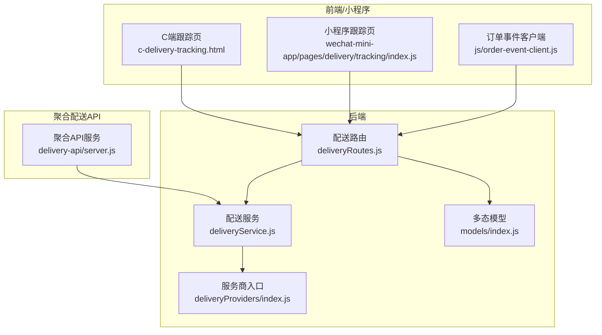
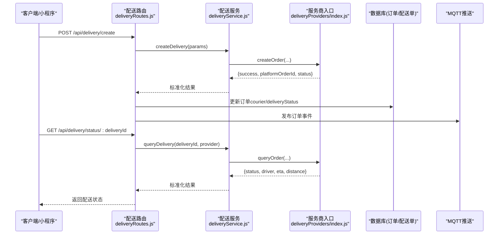
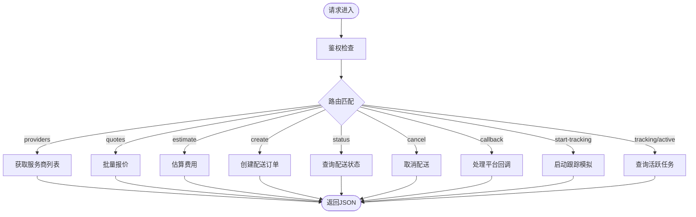
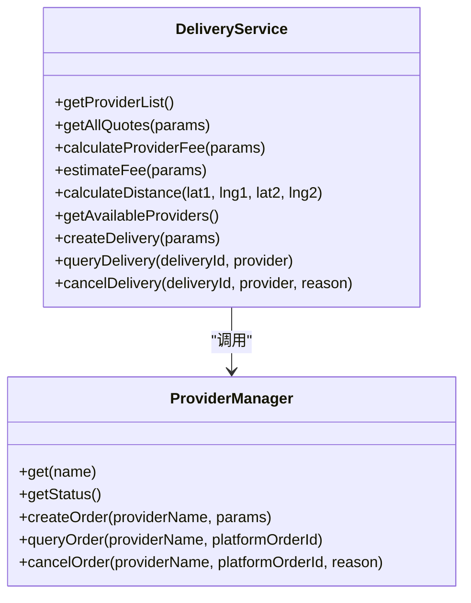
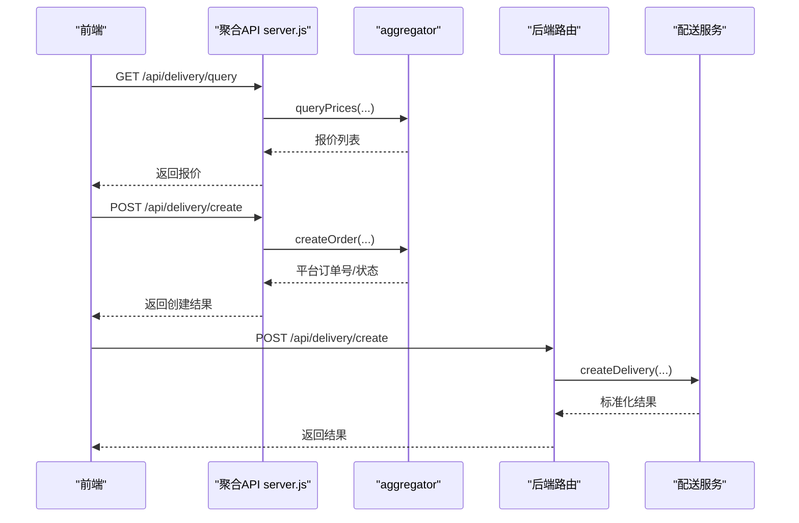
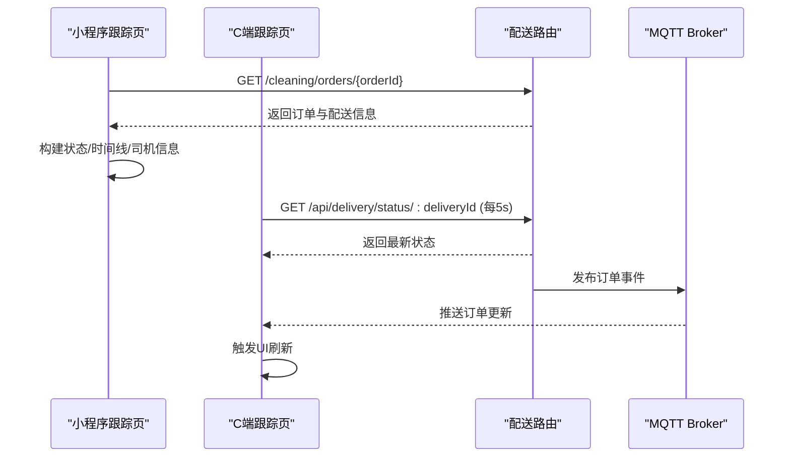
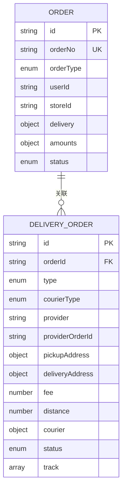
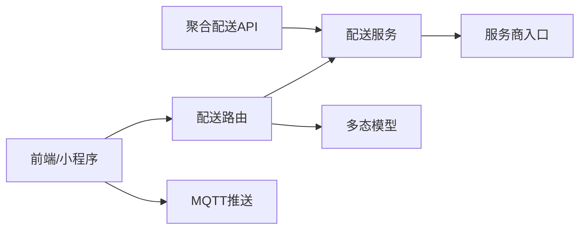
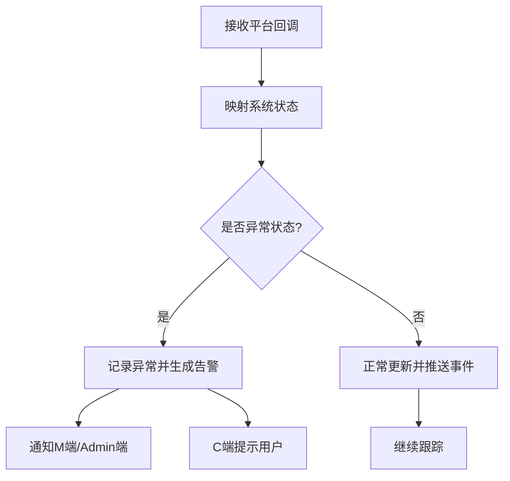

# 配送状态跟踪

<cite>
**本文引用的文件**   
- [deliveryRoutes.js](file://backend/modules/common/routes/deliveryRoutes.js)
- [deliveryService.js](file://backend/modules/common/services/deliveryService.js)
- [index.js（服务商入口）](file://backend/services/deliveryProviders/index.js)
- [server.js（聚合配送API）](file://delivery-api/server.js)
- [delivery-api.js（前端聚合API配置）](file://api/delivery-api.js)
- [tracking/index.js（小程序配送跟踪页）](file://wechat-mini-app/pages/delivery/tracking/index.js)
- [order-event-client.js（订单事件客户端）](file://js/order-event-client.js)
- [c-delivery-tracking.html（C端配送跟踪页面）](file://c-delivery-tracking.html)
- [index.js（多态模型定义）](file://backend/modules/common/models/index.js)
</cite>

## 目录
1. [简介](#简介)
2. [项目结构](#项目结构)
3. [核心组件](#核心组件)
4. [架构总览](#架构总览)
5. [详细组件分析](#详细组件分析)
6. [依赖关系分析](#依赖关系分析)
7. [性能与实时性](#性能与实时性)
8. [异常检测与告警](#异常检测与告警)
9. [可视化与体验优化](#可视化与体验优化)
10. [故障排查指南](#故障排查指南)
11. [结论](#结论)

## 简介
本文件面向“干洗系统”的配送状态跟踪能力，提供端到端的API文档与实现说明。覆盖内容包含：
- 配送订单全生命周期状态管理（待接单、已接单、已取件、配送中、已完成、已取消等）
- 实时状态查询接口（支持REST轮询与WebSocket/MQTT推送两种模式）
- 骑手位置追踪（经纬度、ETA、距离等定位数据）
- 预计到达时间动态计算逻辑（考虑距离、交通、骑手位置等因素）
- 配送异常自动检测与告警（超时未取件、路线偏离、联系不上用户等）
- 可视化展示方案与用户体验优化建议

## 项目结构
围绕配送状态跟踪的关键代码分布在以下模块：
- 后端路由与服务层：负责对外暴露配送相关API、对接多家配送平台、驱动状态流转与回调处理
- 聚合配送API服务：独立进程提供统一询价/下单/查询/取消等接口
- 前端与小程序：提供配送跟踪页面、轮询与MQTT订阅、UI渲染
- 数据模型：订单与配送单的多态数据结构定义

图表来源
- [deliveryRoutes.js:1-323](file://backend/modules/common/routes/deliveryRoutes.js#L1-L323)
- [deliveryService.js:1-322](file://backend/modules/common/services/deliveryService.js#L1-L322)
- [index.js（服务商入口）:1-87](file://backend/services/deliveryProviders/index.js#L1-L87)
- [server.js（聚合配送API）:1-377](file://delivery-api/server.js#L1-L377)
- [c-delivery-tracking.html:889-913](file://c-delivery-tracking.html#L889-L913)
- [tracking/index.js:1-217](file://wechat-mini-app/pages/delivery/tracking/index.js#L1-L217)
- [order-event-client.js:1-45](file://js/order-event-client.js#L1-L45)
- [index.js（多态模型定义）:630-704](file://backend/modules/common/models/index.js#L630-L704)

章节来源
- [deliveryRoutes.js:1-323](file://backend/modules/common/routes/deliveryRoutes.js#L1-L323)
- [deliveryService.js:1-322](file://backend/modules/common/services/deliveryService.js#L1-L322)
- [index.js（服务商入口）:1-87](file://backend/services/deliveryProviders/index.js#L1-L87)
- [server.js（聚合配送API）:1-377](file://delivery-api/server.js#L1-L377)
- [c-delivery-tracking.html:889-913](file://c-delivery-tracking.html#L889-L913)
- [tracking/index.js:1-217](file://wechat-mini-app/pages/delivery/tracking/index.js#L1-L217)
- [order-event-client.js:1-45](file://js/order-event-client.js#L1-L45)
- [index.js（多态模型定义）:630-704](file://backend/modules/common/models/index.js#L630-L704)

## 核心组件
- 配送路由层：提供统一的REST API，包括获取服务商列表、报价、创建配送、查询状态、取消配送、回调处理、跟踪任务管理等
- 配送服务层：封装定价/报价业务逻辑，调用具体配送服务商（真实或模拟），并标准化响应格式
- 服务商接入层：统一管理各平台（美团、京东秒送、淘宝闪送、顺丰同城）的接入模式（real/mock）
- 聚合配送API：独立服务，提供跨平台的询价/下单/查询/取消等接口
- 前端与小程序：提供配送跟踪界面，支持轮询与MQTT推送两种实时更新方式
- 数据模型：订单与配送单的多态结构，包含配送地址、费用、轨迹、状态等字段

章节来源
- [deliveryRoutes.js:1-323](file://backend/modules/common/routes/deliveryRoutes.js#L1-L323)
- [deliveryService.js:1-322](file://backend/modules/common/services/deliveryService.js#L1-L322)
- [index.js（服务商入口）:1-87](file://backend/services/deliveryProviders/index.js#L1-L87)
- [server.js（聚合配送API）:1-377](file://delivery-api/server.js#L1-L377)
- [index.js（多态模型定义）:630-704](file://backend/modules/common/models/index.js#L630-L704)

## 架构总览
系统采用“路由→服务→服务商”的分层架构，结合外部聚合配送API与前端实时通信（轮询+MQTT）。

图表来源
- [deliveryRoutes.js:86-170](file://backend/modules/common/routes/deliveryRoutes.js#L86-L170)
- [deliveryService.js:45-101](file://backend/modules/common/services/deliveryService.js#L45-L101)
- [index.js（服务商入口）:57-76](file://backend/services/deliveryProviders/index.js#L57-L76)
- [order-event-client.js:1-45](file://js/order-event-client.js#L1-L45)

## 详细组件分析

### 配送路由（REST API）
- 获取服务商接入状态与可用列表：用于前端选择配送商与显示接入模式（real/mock）
- 一键报价：根据取/送地址、距离、会员信息计算各平台一对一/拼单价格
- 估算费用：兼容旧接口的单平台费用估算
- 创建配送订单：校验参数、调用服务层、启动跟踪模拟、返回平台订单号
- 查询配送状态：按平台查询并标准化返回
- 取消配送：调用平台取消接口
- 回调处理：将平台状态映射为系统courier状态，持久化并推送事件
- 跟踪任务管理：启动/查询活跃跟踪任务（调试用）

图表来源
- [deliveryRoutes.js:12-323](file://backend/modules/common/routes/deliveryRoutes.js#L12-L323)

章节来源
- [deliveryRoutes.js:12-323](file://backend/modules/common/routes/deliveryRoutes.js#L12-L323)

### 配送服务（定价/报价/调用）
- 定价规则：基础费+每公里附加费+最低收费；支持新用户立减、百分比折扣、满减、限时优惠等
- 拼单折扣：基于一对一基础费乘以共享折扣系数
- 距离估算：Haversine公式计算两点间球面距离
- 平台调用：通过统一入口分发到具体平台（real/mock）
- 标准化响应：统一返回provider、status、driver、eta、distance等字段

图表来源
- [deliveryService.js:117-322](file://backend/modules/common/services/deliveryService.js#L117-L322)
- [index.js（服务商入口）:20-87](file://backend/services/deliveryProviders/index.js#L20-L87)

章节来源
- [deliveryService.js:117-322](file://backend/modules/common/services/deliveryService.js#L117-L322)
- [index.js（服务商入口）:20-87](file://backend/services/deliveryProviders/index.js#L20-L87)

### 聚合配送API（独立服务）
- 健康检查：返回服务状态与可用服务商
- 询价接口：按取/送地址、重量、城市、距离查询多家平台报价
- 创建配送订单：统一入参，内部调用聚合器，落库本地记录
- 查询/取消订单：按平台与平台订单号操作
- 兼容接口：保留旧版CRUD风格接口

图表来源
- [server.js（聚合配送API）:44-201](file://delivery-api/server.js#L44-L201)
- [deliveryRoutes.js:86-133](file://backend/modules/common/routes/deliveryRoutes.js#L86-L133)
- [deliveryService.js:45-70](file://backend/modules/common/services/deliveryService.js#L45-L70)

章节来源
- [server.js（聚合配送API）:44-201](file://delivery-api/server.js#L44-L201)
- [deliveryRoutes.js:86-133](file://backend/modules/common/routes/deliveryRoutes.js#L86-L133)
- [deliveryService.js:45-70](file://backend/modules/common/services/deliveryService.js#L45-L70)

### 前端与小程序（轮询与推送）
- 小程序配送跟踪页：加载订单详情，构建配送状态与时间线，支持联系骑手/门店
- C端跟踪页：支持localStorage跨标签同步与后端状态轮询（约5秒间隔）
- 订单事件客户端：通过MQTT over WebSocket订阅订单更新事件，实现实时刷新

图表来源
- [tracking/index.js:38-71](file://wechat-mini-app/pages/delivery/tracking/index.js#L38-L71)
- [c-delivery-tracking.html:889-913](file://c-delivery-tracking.html#L889-L913)
- [order-event-client.js:1-45](file://js/order-event-client.js#L1-L45)
- [deliveryRoutes.js:135-170](file://backend/modules/common/routes/deliveryRoutes.js#L135-L170)

章节来源
- [tracking/index.js:38-71](file://wechat-mini-app/pages/delivery/tracking/index.js#L38-L71)
- [c-delivery-tracking.html:889-913](file://c-delivery-tracking.html#L889-L913)
- [order-event-client.js:1-45](file://js/order-event-client.js#L1-L45)
- [deliveryRoutes.js:135-170](file://backend/modules/common/routes/deliveryRoutes.js#L135-L170)

### 数据模型（订单与配送单）
- 订单模型：包含配送类型、配送方式、取/送地址、费用明细、支付信息等
- 配送单模型：包含平台、地址、费用、距离、骑手信息、状态、轨迹等
- 枚举与权限：定义物品/订单/支付/配送等枚举，以及角色权限控制

图表来源
- [index.js（多态模型定义）:231-393](file://backend/modules/common/models/index.js#L231-L393)
- [index.js（多态模型定义）:630-704](file://backend/modules/common/models/index.js#L630-L704)

章节来源
- [index.js（多态模型定义）:231-393](file://backend/modules/common/models/index.js#L231-L393)
- [index.js（多态模型定义）:630-704](file://backend/modules/common/models/index.js#L630-L704)

## 依赖关系分析
- 路由层依赖服务层与数据库模型，服务层依赖服务商入口
- 聚合配送API作为独立服务，既可直接被前端调用，也可与后端路由协同工作
- 前端与小程序通过REST轮询与MQTT推送两种方式获取实时状态
- 回调处理将平台状态映射为系统courier状态，并持久化与推送事件

图表来源
- [deliveryRoutes.js:1-323](file://backend/modules/common/routes/deliveryRoutes.js#L1-L323)
- [deliveryService.js:1-322](file://backend/modules/common/services/deliveryService.js#L1-L322)
- [index.js（服务商入口）:1-87](file://backend/services/deliveryProviders/index.js#L1-L87)
- [server.js（聚合配送API）:1-377](file://delivery-api/server.js#L1-L377)
- [order-event-client.js:1-45](file://js/order-event-client.js#L1-L45)

章节来源
- [deliveryRoutes.js:1-323](file://backend/modules/common/routes/deliveryRoutes.js#L1-L323)
- [deliveryService.js:1-322](file://backend/modules/common/services/deliveryService.js#L1-L322)
- [index.js（服务商入口）:1-87](file://backend/services/deliveryProviders/index.js#L1-L87)
- [server.js（聚合配送API）:1-377](file://delivery-api/server.js#L1-L377)
- [order-event-client.js:1-45](file://js/order-event-client.js#L1-L45)

## 性能与实时性
- 轮询策略：C端跟踪页默认每5秒查询一次后端专用状态端点，避免全量订单拉取
- MQTT推送：订单事件服务通过MQTT发布全局/门店级主题，前端订阅后即时刷新
- 报价计算：纯业务逻辑在内存中完成，使用Haversine公式估算距离，复杂度O(1)
- 回调处理：平台回调直接更新数据库并推送事件，减少前端轮询压力

章节来源
- [c-delivery-tracking.html:889-913](file://c-delivery-tracking.html#L889-L913)
- [order-event-client.js:1-45](file://js/order-event-client.js#L1-L45)
- [deliveryService.js:294-303](file://backend/modules/common/services/deliveryService.js#L294-L303)
- [deliveryRoutes.js:172-280](file://backend/modules/common/routes/deliveryRoutes.js#L172-L280)

## 异常检测与告警
当前系统在回调处理中定义了平台状态到系统状态的映射，并支持异常状态标记。可在此基础上扩展自动化检测与告警：
- 超时未取件：若“骑手待取件”状态超过阈值仍未推进至“配送中”，触发告警
- 路线偏离：对比骑手当前位置与预期路径，偏差超过阈值时触发告警
- 联系不上用户：多次尝试联系失败（如电话无法接通）触发告警
- 通知渠道：通过消息中心与MQTT事件推送给M端/Admin端，并在C端提示

图表来源
- [deliveryRoutes.js:172-280](file://backend/modules/common/routes/deliveryRoutes.js#L172-L280)

章节来源
- [deliveryRoutes.js:172-280](file://backend/modules/common/routes/deliveryRoutes.js#L172-L280)

## 可视化与体验优化
- 状态进度条：根据progress字段渲染进度（如5%、20%、50%、70%、90%、100%）
- 时间线视图：按关键节点（已提交、已接单、已取件、配送中、已送达）展示时间与描述
- 地图与轨迹：结合骑手经纬度与历史轨迹数组，绘制移动路径与ETA
- 实时指示：MQTT连接状态与轮询状态可视化，提升用户对实时性的感知
- 交互优化：一键联系骑手/门店、ETA倒计时、异常提示与重试按钮

章节来源
- [tracking/index.js:74-155](file://wechat-mini-app/pages/delivery/tracking/index.js#L74-L155)
- [c-delivery-tracking.html:889-913](file://c-delivery-tracking.html#L889-L913)
- [index.js（多态模型定义）:630-704](file://backend/modules/common/models/index.js#L630-L704)

## 故障排查指南
- 服务商接入模式：确认各平台处于real/mock模式，必要时切换测试
- 回调处理：检查平台回传状态是否在映射表中，未识别状态将被忽略
- 跟踪任务：查询活跃任务列表，确认跟踪是否已启动
- 前端轮询：检查网络与鉴权，确认后端状态端点返回正常
- MQTT推送：检查Broker连接与主题订阅，确保事件能下发到前端

章节来源
- [deliveryRoutes.js:12-26](file://backend/modules/common/routes/deliveryRoutes.js#L12-L26)
- [deliveryRoutes.js:313-323](file://backend/modules/common/routes/deliveryRoutes.js#L313-L323)
- [c-delivery-tracking.html:889-913](file://c-delivery-tracking.html#L889-L913)
- [order-event-client.js:1-45](file://js/order-event-client.js#L1-L45)

## 结论
本系统通过分层架构与多平台接入，实现了配送订单的全生命周期管理与实时状态跟踪。结合轮询与MQTT推送，兼顾了实时性与稳定性。建议在现有基础上完善异常检测与告警机制，并持续优化可视化与用户体验，以提升整体服务质量。