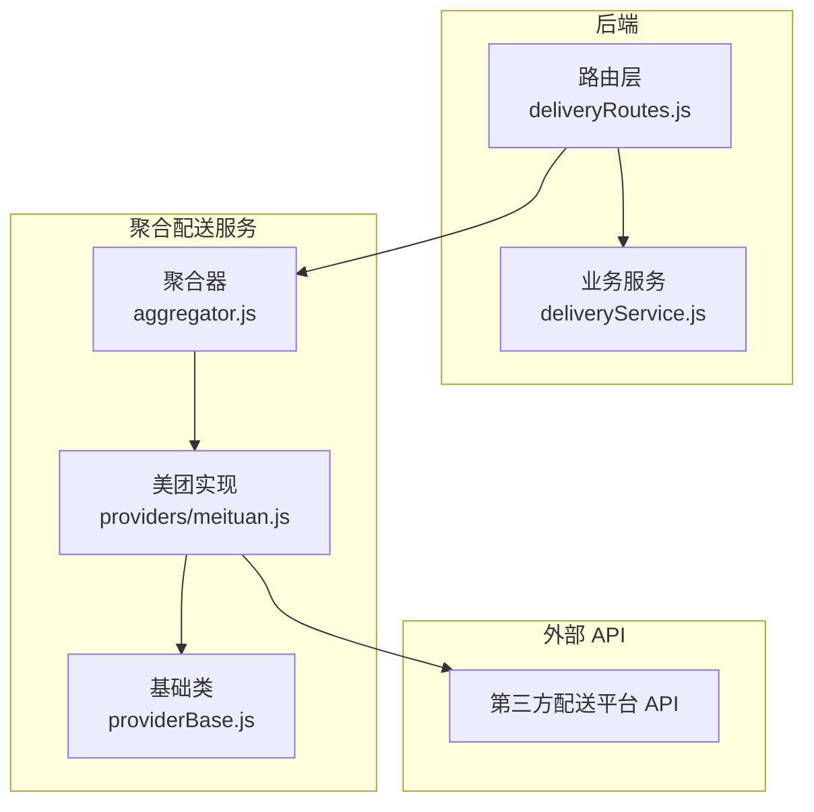
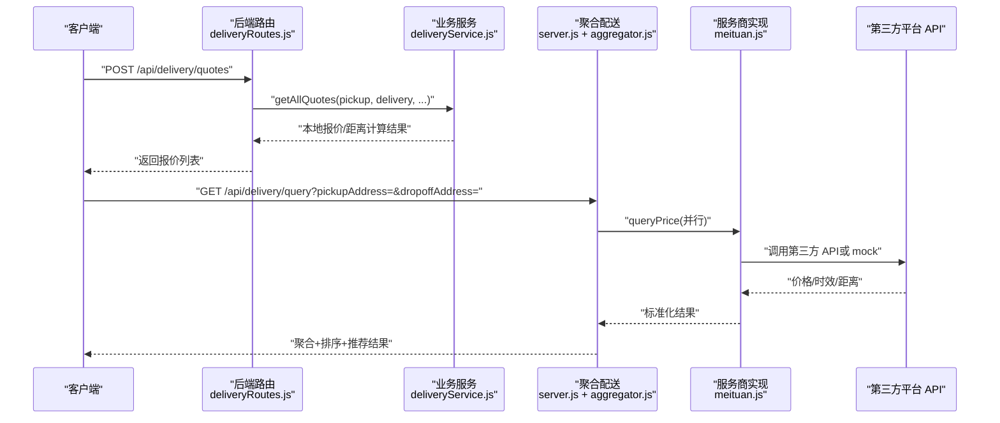
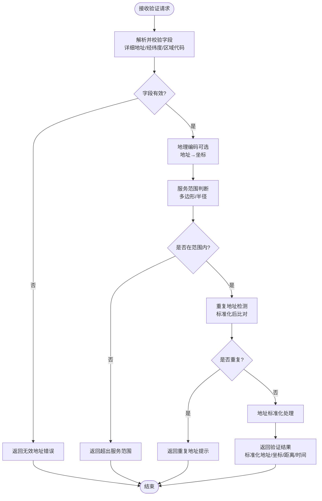
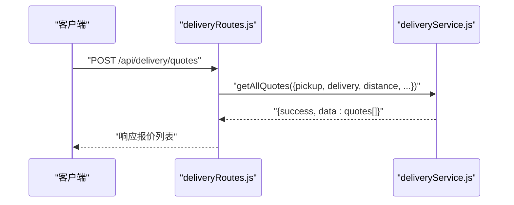
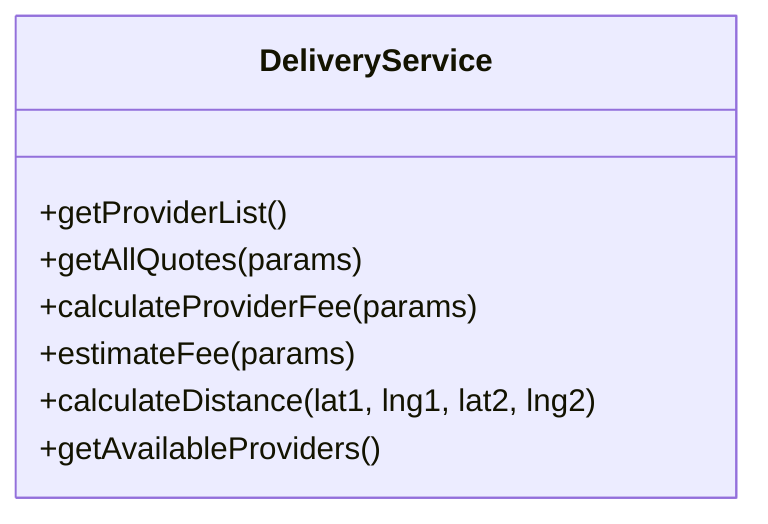
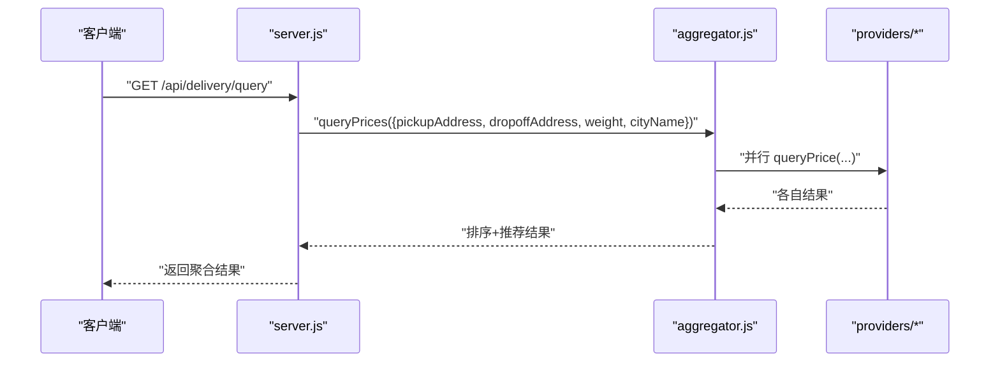
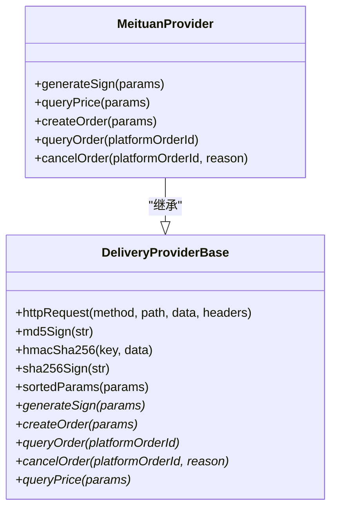
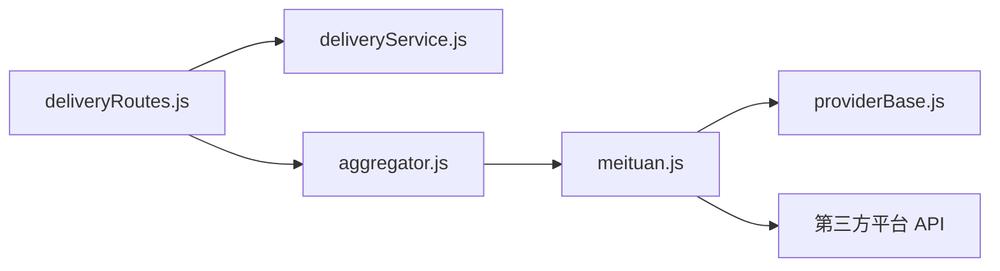

# 地址验证服务

<cite>
**本文引用的文件**   
- [deliveryRoutes.js](file://backend/modules/common/routes/deliveryRoutes.js)
- [deliveryService.js](file://backend/modules/common/services/deliveryService.js)
- [server.js](file://delivery-api/server.js)
- [aggregator.js](file://delivery-api/aggregator.js)
- [meituan.js](file://delivery-api/providers/meituan.js)
- [providerBase.js](file://backend/services/deliveryProviders/providerBase.js)
</cite>

## 目录
1. [简介](#简介)
2. [项目结构](#项目结构)
3. [核心组件](#核心组件)
4. [架构总览](#架构总览)
5. [详细组件分析](#详细组件分析)
6. [依赖关系分析](#依赖关系分析)
7. [性能考虑](#性能考虑)
8. [故障排查指南](#故障排查指南)
9. [结论](#结论)
10. [附录：API 规范与校验规则](#附录api-规范与校验规则)

## 简介
本文件面向“配送地址验证服务”，聚焦取件地址与送件地址的格式校验、完整性检查、地理位置坐标有效性、服务范围判断，以及批量验证的性能优化与缓存设计。结合仓库中现有的聚合配送与报价能力，文档给出可落地的接口规范、错误处理策略与扩展建议，帮助在现有系统上快速补齐“地址验证”能力。

## 项目结构
围绕地址验证相关能力，主要涉及以下模块：
- 后端路由层：提供统一入口，负责参数校验、鉴权、调用业务服务
- 业务服务层：封装定价/距离计算等纯业务逻辑（可作为地址验证的前置或并行步骤）
- 聚合配送层：对外暴露询价、下单、状态查询等接口，内部聚合多家服务商
- 服务商实现：各平台的具体实现（含签名、请求封装、模拟数据）

图表来源
- [deliveryRoutes.js:1-323](file://backend/modules/common/routes/deliveryRoutes.js#L1-L323)
- [deliveryService.js:1-322](file://backend/modules/common/services/deliveryService.js#L1-L322)
- [server.js:1-377](file://delivery-api/server.js#L1-L377)
- [aggregator.js:1-237](file://delivery-api/aggregator.js#L1-L237)
- [meituan.js:1-231](file://delivery-api/providers/meituan.js#L1-L231)
- [providerBase.js:1-124](file://backend/services/deliveryProviders/providerBase.js#L1-L124)

章节来源
- [deliveryRoutes.js:1-323](file://backend/modules/common/routes/deliveryRoutes.js#L1-L323)
- [deliveryService.js:1-322](file://backend/modules/common/services/deliveryService.js#L1-L322)
- [server.js:1-377](file://delivery-api/server.js#L1-L377)
- [aggregator.js:1-237](file://delivery-api/aggregator.js#L1-L237)
- [meituan.js:1-231](file://delivery-api/providers/meituan.js#L1-L231)
- [providerBase.js:1-124](file://backend/services/deliveryProviders/providerBase.js#L1-L124)

## 核心组件
- 路由层（deliveryRoutes.js）
  - 提供获取服务商列表、一键报价、费用估算、创建配送订单、查询状态、取消、回调等接口
  - 对必要参数进行前置校验，失败时返回结构化错误信息
- 业务服务（deliveryService.js）
  - 提供多服务商报价计算、一对一/拼单计费、Haversine 距离估算等纯业务逻辑
  - 不直接依赖外部网络，便于复用和测试
- 聚合配送（server.js + aggregator.js）
  - 对外暴露 /api/delivery/query 等接口，内部并行调用多家服务商并汇总结果
  - 支持按价格/时效/综合推荐策略选择最优服务商
- 服务商实现（meituan.js + providerBase.js）
  - 统一的 HTTPS 请求封装、签名算法、超时控制
  - 未配置密钥自动回退到 mock 模式，保证开发联调可用

章节来源
- [deliveryRoutes.js:1-323](file://backend/modules/common/routes/deliveryRoutes.js#L1-L323)
- [deliveryService.js:1-322](file://backend/modules/common/services/deliveryService.js#L1-L322)
- [server.js:1-377](file://delivery-api/server.js#L1-L377)
- [aggregator.js:1-237](file://delivery-api/aggregator.js#L1-L237)
- [meituan.js:1-231](file://delivery-api/providers/meituan.js#L1-L231)
- [providerBase.js:1-124](file://backend/services/deliveryProviders/providerBase.js#L1-L124)

## 架构总览
下图展示从客户端到聚合配送及服务商的完整链路，同时标注了地址验证可接入的关键节点。

图表来源
- [deliveryRoutes.js:37-59](file://backend/modules/common/routes/deliveryRoutes.js#L37-L59)
- [deliveryService.js:173-181](file://backend/modules/common/services/deliveryService.js#L173-L181)
- [server.js:56-83](file://delivery-api/server.js#L56-L83)
- [aggregator.js:54-95](file://delivery-api/aggregator.js#L54-L95)
- [meituan.js:43-81](file://delivery-api/providers/meituan.js#L43-L81)

## 详细组件分析

### 地址验证服务（新增能力建议）
说明：当前仓库未包含独立的“地址验证服务”实现。建议在现有路由层与服务层之间新增一个轻量验证服务，复用 Haversine 距离计算与服务商询价能力，完成地址有效性判定。

- 职责边界
  - 输入校验：详细地址字符串、经纬度坐标、区域代码等
  - 地理编码：将地址解析为坐标（可对接地图服务商）
  - 范围判断：基于门店服务多边形或半径阈值判断是否在服务范围内
  - 重复检测：基于标准化后的地址/坐标去重
  - 输出：标准化地址、坐标、是否可达、预估距离/时间、错误码与提示

- 关键流程（流程图）

- 与现有系统的集成点
  - 复用 deliveryService.calculateDistance 计算两点间距离
  - 复用聚合配送的 queryPrices 获取各平台报价与时效，作为“可送达性”参考
  - 在 deliveryRoutes.js 新增 /api/delivery/address/validate 路由，集中处理校验与错误

章节来源
- [deliveryService.js:294-303](file://backend/modules/common/services/deliveryService.js#L294-L303)
- [server.js:56-83](file://delivery-api/server.js#L56-L83)
- [aggregator.js:54-95](file://delivery-api/aggregator.js#L54-L95)

### 路由层（deliveryRoutes.js）
- 功能要点
  - 提供 /api/delivery/quotes 一键报价接口，入参包含 pickup、delivery、distance、serviceTotal、isNewUser
  - 提供 /api/delivery/estimate 费用估算接口，兼容旧字段 deliveryType
  - 提供 /api/delivery/create 创建配送订单接口，要求 orderId、pickup、delivery 必填
  - 提供 /api/delivery/status/:deliveryId、/api/delivery/cancel、/api/delivery/callback 等管理接口
- 参数校验与错误处理
  - 缺失必要参数时返回 success=false 与 message
  - 异常捕获后返回 server_error 错误码与友好消息

图表来源
- [deliveryRoutes.js:37-59](file://backend/modules/common/routes/deliveryRoutes.js#L37-L59)
- [deliveryService.js:173-181](file://backend/modules/common/services/deliveryService.js#L173-L181)

章节来源
- [deliveryRoutes.js:1-323](file://backend/modules/common/routes/deliveryRoutes.js#L1-L323)

### 业务服务（deliveryService.js）
- 功能要点
  - getAllQuotes：遍历所有服务商，计算报价（支持一对一/拼单）
  - calculateProviderFee：根据 base/perKm/minFee 与促销规则计算实际费用
  - estimateFee：兼容旧接口的费用估算
  - calculateDistance：使用 Haversine 公式计算球面距离（km）
- 复杂度与性能
  - 单次报价：O(N)，N 为服务商数量
  - 距离计算：常数时间 O(1)

图表来源
- [deliveryService.js:173-322](file://backend/modules/common/services/deliveryService.js#L173-L322)

章节来源
- [deliveryService.js:1-322](file://backend/modules/common/services/deliveryService.js#L1-L322)

### 聚合配送（server.js + aggregator.js）
- 功能要点
  - GET /api/delivery/query：并行查询多家服务商价格，返回排序与推荐
  - POST /api/delivery/create：创建配送订单（支持指定或自动选择服务商）
  - 支持健康检查与历史订单查询（兼容旧接口）
- 并行与容错
  - 使用 Promise.allSettled 并行调用，收集成功与失败结果
  - 按价格排序并提供推荐策略（最低价/最快/综合评分）

图表来源
- [server.js:56-83](file://delivery-api/server.js#L56-L83)
- [aggregator.js:54-95](file://delivery-api/aggregator.js#L54-L95)

章节来源
- [server.js:1-377](file://delivery-api/server.js#L1-L377)
- [aggregator.js:1-237](file://delivery-api/aggregator.js#L1-L237)

### 服务商实现（meituan.js + providerBase.js）
- 功能要点
  - 统一 HTTP 请求封装、MD5/HMAC-SHA256/SHA256 签名、超时控制
  - 未配置凭证自动进入 mock 模式，返回合理模拟数据
  - 美团实现示例：queryPrice、createOrder、queryOrder、cancelOrder
- 错误处理
  - 网络异常/超时抛出错误，上层捕获后返回 success=false 与错误信息

图表来源
- [providerBase.js:1-124](file://backend/services/deliveryProviders/providerBase.js#L1-L124)
- [meituan.js:1-231](file://delivery-api/providers/meituan.js#L1-L231)

章节来源
- [providerBase.js:1-124](file://backend/services/deliveryProviders/providerBase.js#L1-L124)
- [meituan.js:1-231](file://delivery-api/providers/meituan.js#L1-L231)

## 依赖关系分析
- 耦合与内聚
  - 路由层仅依赖服务层与聚合层，职责清晰
  - 服务层为纯业务逻辑，无外部 IO，内聚度高
  - 聚合层通过 Provider 抽象解耦具体平台实现
- 外部依赖
  - 第三方配送平台 API（美团/京东/顺丰等）
  - 可选：地图/地理编码服务（用于地址→坐标转换）

图表来源
- [deliveryRoutes.js:1-323](file://backend/modules/common/routes/deliveryRoutes.js#L1-L323)
- [deliveryService.js:1-322](file://backend/modules/common/services/deliveryService.js#L1-L322)
- [aggregator.js:1-237](file://delivery-api/aggregator.js#L1-L237)
- [meituan.js:1-231](file://delivery-api/providers/meituan.js#L1-L231)
- [providerBase.js:1-124](file://backend/services/deliveryProviders/providerBase.js#L1-L124)

章节来源
- [deliveryRoutes.js:1-323](file://backend/modules/common/routes/deliveryRoutes.js#L1-L323)
- [deliveryService.js:1-322](file://backend/modules/common/services/deliveryService.js#L1-L322)
- [aggregator.js:1-237](file://delivery-api/aggregator.js#L1-L237)
- [meituan.js:1-231](file://delivery-api/providers/meituan.js#L1-L231)
- [providerBase.js:1-124](file://backend/services/deliveryProviders/providerBase.js#L1-L124)

## 性能考虑
- 批量地址验证优化建议
  - 并发控制：对 N 个地址采用限流并发（如每批 10~20），避免压垮下游
  - 去重前置：在内存中对标准化后的地址/坐标做 Set 去重，减少重复计算
  - 分阶段校验：先做轻量规则校验（非空、长度、格式），再执行地理编码与范围判断
  - 异步流水线：校验→编码→范围→重复→标准化，逐阶段短路返回
- 缓存机制设计
  - 地址→坐标缓存：以标准化地址为键，TTL 15~30 分钟，命中率通常较高
  - 坐标→范围结果缓存：以 (lat,lng,storeId) 为键，TTL 5~10 分钟
  - 报价缓存：以 (pickup, delivery, weight, cityName) 为键，TTL 1~5 分钟
  - 缓存存储：Redis 优先；单机场景可使用内存 Map + LRU
  - 失效策略：门店服务区域变更时主动清理相关缓存；地址库更新时按城市/区域批量失效
- 降级与熔断
  - 地理编码失败：回退到用户提供的坐标（若存在），否则标记不可达
  - 服务商询价失败：忽略该服务商，继续聚合其他结果
  - 超时保护：设置合理的请求超时与重试上限

[本节为通用指导，无需源码引用]

## 故障排查指南
- 常见错误与定位
  - 缺少必要参数：检查路由层参数校验分支，确认 pickup/delivery 等字段是否传入
  - 地理编码失败：记录上游错误码与消息，必要时回退到坐标直判
  - 超出服务范围：检查服务多边形/半径配置是否正确，核对坐标精度
  - 重复地址：确认标准化规则（去除空格、全角转半角、标点规范化）是否一致
- 日志与监控
  - 在路由层与服务层增加结构化日志（请求ID、入参摘要、耗时、错误码）
  - 对关键指标埋点：验证成功率、平均耗时、地理编码失败率、超范围比例
- 快速恢复
  - 关闭地理编码开关，允许仅凭坐标验证
  - 临时放宽服务范围阈值，保障业务连续性

章节来源
- [deliveryRoutes.js:86-133](file://backend/modules/common/routes/deliveryRoutes.js#L86-L133)
- [server.js:89-154](file://delivery-api/server.js#L89-L154)

## 结论
通过在现有路由与服务层之间引入“地址验证服务”，可以低成本补齐取件/送件地址的完整性、坐标有效性、服务范围与重复检测能力。结合聚合配送的并行询价与 Haversine 距离计算，既能保证准确性，也能兼顾性能与可扩展性。配合缓存与降级策略，可在高并发场景下稳定运行。

[本节为总结，无需源码引用]

## 附录：API 规范与校验规则

### 地址验证接口（建议新增）
- 路径与方法
  - POST /api/delivery/address/validate
- 请求体字段
  - addresses: Array<AddressItem>
    - AddressItem:
      - address: string | 详细地址字符串（必填）
      - latitude: number | 纬度（可选，若提供则参与范围判断）
      - longitude: number | 经度（可选，若提供则参与范围判断）
      - regionCode: string | 区域代码（可选，用于快速过滤）
      - storeId: string | 门店ID（必填，用于范围判断）
- 响应体
  - success: boolean
  - data: Array<ValidateResult>
    - ValidateResult:
      - originalAddress: string
      - normalizedAddress: string
      - latitude: number | null
      - longitude: number | null
      - inServiceArea: boolean
      - distanceKm: number | null
      - estimatedMinutes: number | null
      - errors: Array<{code: string, message: string}>
- 校验规则
  - 地址完整性：address 非空且长度≥最小阈值（例如≥5）
  - 坐标有效性：latitude ∈ [-90, 90]，longitude ∈ [-180, 180]
  - 范围判断：基于 store.deliveryZone（多边形）或半径阈值
  - 重复检测：对 normalizedAddress 或 (latitude,longitude) 去重
  - 标准化：去除多余空白、全角转半角、统一标点与层级顺序
- 错误码建议
  - INVALID_ADDRESS：地址格式无效
  - MISSING_COORDINATES：缺少必要坐标
  - OUT_OF_SERVICE_AREA：超出服务范围
  - GEOCODING_FAILED：地理编码失败
  - DUPLICATE_ADDRESS：重复地址

章节来源
- [deliveryService.js:294-303](file://backend/modules/common/services/deliveryService.js#L294-L303)

### 现有相关接口（供参考）
- 一键报价
  - POST /api/delivery/quotes
  - 入参：{ pickup, delivery, distance?, serviceTotal?, isNewUser? }
  - 说明：pickup/delivery 为对象，包含 latitude/longitude 等坐标字段
- 费用估算
  - POST /api/delivery/estimate
  - 入参：{ provider?, pickup, delivery, deliveryType?, serviceTotal?, isNewUser? }
- 聚合询价
  - GET /api/delivery/query?pickupAddress=&dropoffAddress=&weight=&cityName=
  - 说明：返回多家服务商报价与推荐

章节来源
- [deliveryRoutes.js:37-84](file://backend/modules/common/routes/deliveryRoutes.js#L37-L84)
- [server.js:56-83](file://delivery-api/server.js#L56-L83)