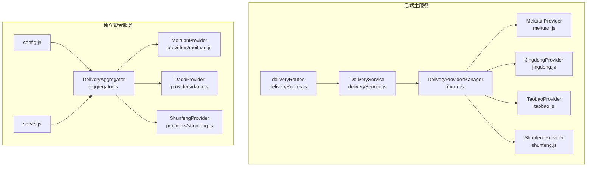
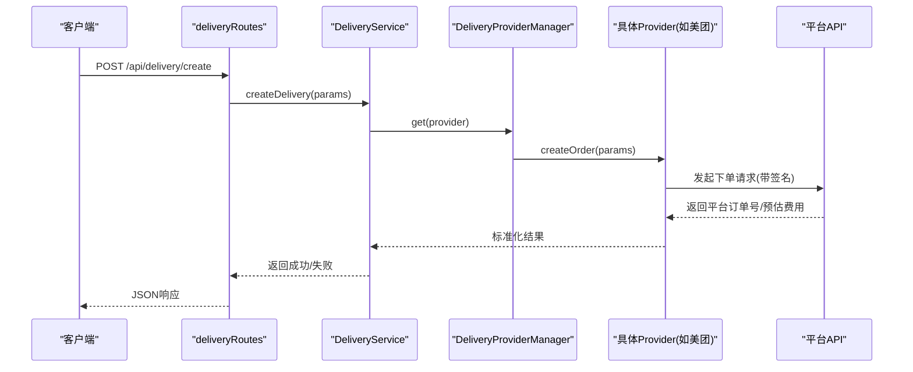
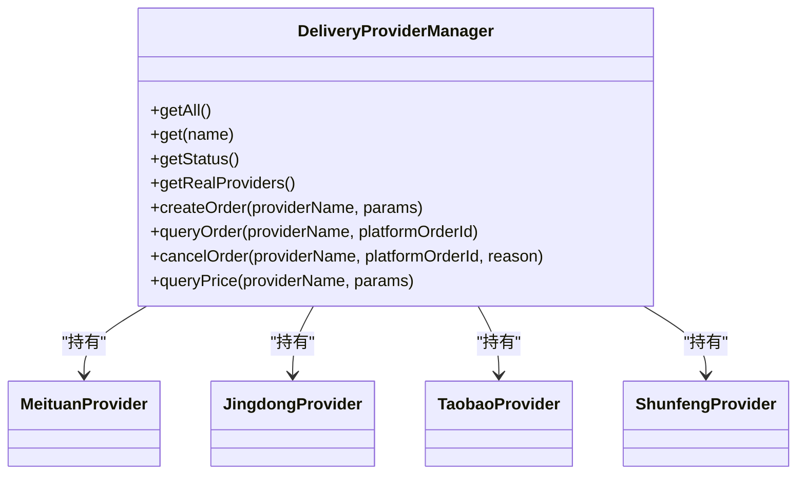
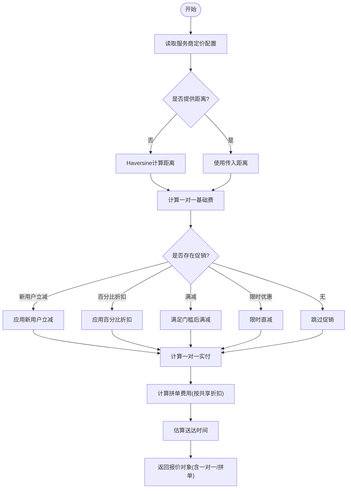
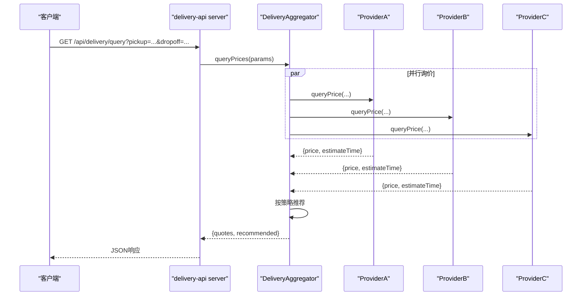
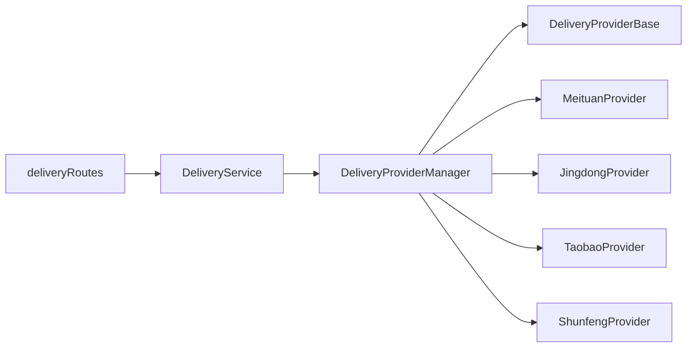

# 配送服务商选择

<cite>
**本文引用的文件**
- [backend/services/deliveryProviders/index.js](file://backend/services/deliveryProviders/index.js)
- [backend/services/deliveryProviders/providerBase.js](file://backend/services/deliveryProviders/providerBase.js)
- [backend/services/deliveryProviders/meituan.js](file://backend/services/deliveryProviders/meituan.js)
- [backend/services/deliveryProviders/jingdong.js](file://backend/services/deliveryProviders/jingdong.js)
- [backend/services/deliveryProviders/taobao.js](file://backend/services/deliveryProviders/taobao.js)
- [backend/services/deliveryProviders/shunfeng.js](file://backend/services/deliveryProviders/shunfeng.js)
- [backend/modules/common/services/deliveryService.js](file://backend/modules/common/services/deliveryService.js)
- [backend/modules/common/routes/deliveryRoutes.js](file://backend/modules/common/routes/deliveryRoutes.js)
- [delivery-api/aggregator.js](file://delivery-api/aggregator.js)
- [delivery-api/config.js](file://delivery-api/config.js)
- [delivery-api/server.js](file://delivery-api/server.js)
- [delivery-api/providers/meituan.js](file://delivery-api/providers/meituan.js)
- [delivery-api/providers/dada.js](file://delivery-api/providers/dada.js)
- [delivery-api/providers/shunfeng.js](file://delivery-api/providers/shunfeng.js)
</cite>

## 目录
1. [简介](#简介)
2. [项目结构](#项目结构)
3. [核心组件](#核心组件)
4. [架构总览](#架构总览)
5. [详细组件分析](#详细组件分析)
6. [依赖关系分析](#依赖关系分析)
7. [性能与可用性](#性能与可用性)
8. [故障排查指南](#故障排查指南)
9. [结论](#结论)
10. [附录：配置项与接口说明](#附录：配置项与接口说明)

## 简介
本系统提供多平台配送服务商的智能选择能力，覆盖美团跑腿、京东秒送（达达）、淘宝闪送（蜂鸟）、顺丰同城等主流运力。系统通过统一入口对多家服务商进行询价、下单、状态查询与取消；在业务层提供定价规则、拼单折扣、新用户优惠等综合评估维度，并支持按价格、时效、评分、可用性等策略进行智能推荐。同时提供独立聚合服务 delivery-api，便于微服务化部署与横向扩展。

## 项目结构
- 后端主服务（backend）
  - 统一入口与提供商管理：backend/services/deliveryProviders/index.js
  - 各平台实现与基类：providerBase.js + meituan/jingdong/taobao/shunfeng.js
  - 业务服务与路由：modules/common/services/deliveryService.js、modules/common/routes/deliveryRoutes.js
- 独立聚合服务（delivery-api）
  - 聚合调度器与配置：aggregator.js、config.js
  - HTTP 服务与兼容接口：server.js
  - 平台适配层：providers/meituan.js、dada.js、shunfeng.js

图表来源
- [backend/services/deliveryProviders/index.js:20-87](file://backend/services/deliveryProviders/index.js#L20-L87)
- [backend/services/deliveryProviders/providerBase.js:10-124](file://backend/services/deliveryProviders/providerBase.js#L10-L124)
- [backend/modules/common/services/deliveryService.js:32-322](file://backend/modules/common/services/deliveryService.js#L32-L322)
- [backend/modules/common/routes/deliveryRoutes.js:1-323](file://backend/modules/common/routes/deliveryRoutes.js#L1-L323)
- [delivery-api/aggregator.js:11-237](file://delivery-api/aggregator.js#L11-L237)
- [delivery-api/config.js:10-93](file://delivery-api/config.js#L10-L93)
- [delivery-api/server.js:1-377](file://delivery-api/server.js#L1-L377)

章节来源
- [backend/services/deliveryProviders/index.js:20-87](file://backend/services/deliveryProviders/index.js#L20-L87)
- [backend/modules/common/services/deliveryService.js:32-322](file://backend/modules/common/services/deliveryService.js#L32-L322)
- [delivery-api/aggregator.js:11-237](file://delivery-api/aggregator.js#L11-L237)
- [delivery-api/config.js:10-93](file://delivery-api/config.js#L10-L93)
- [delivery-api/server.js:1-377](file://delivery-api/server.js#L1-L377)

## 核心组件
- 统一入口 DeliveryProviderManager
  - 负责注册、获取、状态查询与调用具体服务商实例，屏蔽真实/模拟模式差异。
- 服务商基类 DeliveryProviderBase
  - 封装 HTTPS 请求、签名算法（MD5/HMAC-SHA256/SHA256）、参数排序拼接、超时控制等通用能力。
- 平台实现
  - 美团、京东秒送（达达）、淘宝闪送（蜂鸟）、顺丰同城各自实现 createOrder/queryOrder/cancelOrder/queryPrice 及状态映射。
- 业务服务 DeliveryService
  - 提供定价计算、报价列表、拼单折扣、新用户优惠、距离估算、可用服务商列表等纯业务逻辑。
- 路由层 deliveryRoutes
  - 暴露 /api/delivery/* 系列接口，含创建订单、查询状态、取消、回调处理、跟踪启动等。
- 独立聚合服务 DeliveryAggregator
  - 并行询价、策略推荐（最低价/最快/综合推荐）、自动选择最优服务商下单。

章节来源
- [backend/services/deliveryProviders/index.js:20-87](file://backend/services/deliveryProviders/index.js#L20-L87)
- [backend/services/deliveryProviders/providerBase.js:10-124](file://backend/services/deliveryProviders/providerBase.js#L10-L124)
- [backend/modules/common/services/deliveryService.js:117-322](file://backend/modules/common/services/deliveryService.js#L117-L322)
- [backend/modules/common/routes/deliveryRoutes.js:1-323](file://backend/modules/common/routes/deliveryRoutes.js#L1-L323)
- [delivery-api/aggregator.js:54-129](file://delivery-api/aggregator.js#L54-L129)

## 架构总览
系统采用“统一入口 + 多实现 + 业务编排”的分层设计：
- 接入层：HTTP 路由接收请求，校验参数，组装上下文。
- 业务层：DeliveryService 负责定价、折扣、拼单、距离估算与结果标准化。
- 适配层：DeliveryProviderManager 分发到具体 Provider，Provider 基于基类完成签名与网络请求。
- 外部依赖：各平台开放平台 API（美团/达达/蜂鸟/顺丰）。
- 可选独立服务：delivery-api 作为聚合微服务对外提供统一接口。

图表来源
- [backend/modules/common/routes/deliveryRoutes.js:86-133](file://backend/modules/common/routes/deliveryRoutes.js#L86-L133)
- [backend/modules/common/services/deliveryService.js:45-70](file://backend/modules/common/services/deliveryService.js#L45-L70)
- [backend/services/deliveryProviders/index.js:57-62](file://backend/services/deliveryProviders/index.js#L57-L62)
- [backend/services/deliveryProviders/meituan.js:41-93](file://backend/services/deliveryProviders/meituan.js#L41-L93)

## 详细组件分析

### 统一入口与提供商管理（DeliveryProviderManager）
- 职责
  - 维护所有已注册的 Provider 实例，提供 get/getAll/getStatus/getRealProviders 等方法。
  - 转发 createOrder/queryOrder/cancelOrder/queryPrice 调用至对应 Provider。
- 关键特性
  - 自动识别 real/mock 模式：未配置密钥则进入 mock，保障开发联调与生产降级。
  - 提供状态汇总，便于前端展示接入情况。

图表来源
- [backend/services/deliveryProviders/index.js:20-87](file://backend/services/deliveryProviders/index.js#L20-L87)

章节来源
- [backend/services/deliveryProviders/index.js:20-87](file://backend/services/deliveryProviders/index.js#L20-L87)

### 服务商基类（DeliveryProviderBase）
- 职责
  - 统一 HTTPS 请求封装、超时控制、错误处理。
  - 提供 MD5/HMAC-SHA256/SHA256 签名方法与参数排序拼接工具。
  - 定义抽象接口：generateSign、createOrder、queryOrder、cancelOrder、queryPrice。
- 关键特性
  - isMockMode 自动判定：无有效凭证即走 mock。
  - httpRequest 支持自定义超时与异常抛出。

章节来源
- [backend/services/deliveryProviders/providerBase.js:10-124](file://backend/services/deliveryProviders/providerBase.js#L10-L124)

### 平台实现要点（以美团为例）
- 签名与请求
  - 使用 appId/timestamp/secret 生成签名，POST 到平台指定路径。
- 下单流程
  - 构造取件/收件信息、商品描述、重量等，成功后返回平台订单号与预估费用/时间。
- 状态查询与取消
  - 将平台状态码映射为内部统一状态（pending/accepted/picking_up/delivering/delivered/cancelled/exception）。
- Mock 降级
  - 当网络或鉴权失败时回退到本地模拟数据，保证链路可测。

章节来源
- [backend/services/deliveryProviders/meituan.js:30-93](file://backend/services/deliveryProviders/meituan.js#L30-L93)
- [backend/services/deliveryProviders/meituan.js:184-257](file://backend/services/deliveryProviders/meituan.js#L184-L257)

### 业务服务（DeliveryService）
- 定价与报价
  - 提供 getProviderPricingConfig：基础费用、每公里单价、最低起步价、拼单折扣比例、评分、促销活动等。
  - calculateProviderFee：根据距离、用户类型（是否新用户）、活动类型（立减/百分比/满减/限时）计算一对一与拼单实际费用。
  - getAllQuotes：批量计算所有服务商报价，供前端展示与对比。
- 可用服务商
  - getAvailableProviders：结合 provider 状态与定价配置，输出启用状态与接入模式。
- 兼容性
  - estimateFee：兼容旧接口的单一服务商估价。

图表来源
- [backend/modules/common/services/deliveryService.js:186-259](file://backend/modules/common/services/deliveryService.js#L186-L259)
- [backend/modules/common/services/deliveryService.js:294-303](file://backend/modules/common/services/deliveryService.js#L294-L303)

章节来源
- [backend/modules/common/services/deliveryService.js:117-322](file://backend/modules/common/services/deliveryService.js#L117-L322)

### 路由与回调（deliveryRoutes）
- 主要接口
  - GET /api/delivery/provider-status：合并配置信息与接入模式状态。
  - GET /api/delivery/providers：获取服务商列表（含定价与评分）。
  - POST /api/delivery/quotes：一键获取所有服务商报价。
  - POST /api/delivery/estimate：估算单个服务商费用。
  - POST /api/delivery/create：创建配送订单（认证后）。
  - GET /api/delivery/status/:deliveryId：查询配送状态。
  - POST /api/delivery/cancel：取消配送。
  - POST /api/delivery/callback：服务商回调，驱动订单 courier 状态更新与 MQTT 推送。
  - POST /:orderId/start-tracking：启动跟踪模拟（调试用）。
  - GET /api/delivery/tracking/active：查看活跃跟踪任务。
- 回调处理
  - 将平台状态映射为系统 courier 状态，更新数据库并推送实时状态给 C 端。

章节来源
- [backend/modules/common/routes/deliveryRoutes.js:12-323](file://backend/modules/common/routes/deliveryRoutes.js#L12-L323)

### 独立聚合服务（delivery-api）
- 聚合调度器（DeliveryAggregator）
  - 并行询价：Promise.allSettled 并发调用各 Provider.queryPrice，收集成功与错误结果。
  - 策略推荐：支持 lowest_price/fastest/recommended（价格+时效加权）。
  - 自动下单：若无显式 preferredProvider，先询价再选择推荐服务商下单。
- 配置（config.js）
  - 统一管理各平台 test/production 环境 URL 与凭据环境变量。
  - aggregator 默认策略、重试次数、超时等。
- HTTP 服务（server.js）
  - 提供 /api/delivery/* 聚合接口，兼容旧接口，健康检查等。

图表来源
- [delivery-api/aggregator.js:54-129](file://delivery-api/aggregator.js#L54-L129)
- [delivery-api/server.js:56-83](file://delivery-api/server.js#L56-L83)

章节来源
- [delivery-api/aggregator.js:11-237](file://delivery-api/aggregator.js#L11-L237)
- [delivery-api/config.js:10-93](file://delivery-api/config.js#L10-L93)
- [delivery-api/server.js:1-377](file://delivery-api/server.js#L1-L377)

## 依赖关系分析
- 耦合与内聚
  - Provider 仅依赖基类与平台 API，内聚度高；Manager 集中管理实例，降低上层耦合。
  - DeliveryService 不直接访问网络，专注业务规则，易于测试与扩展。
- 外部依赖
  - 各平台开放平台 API（HTTPS），需要正确配置环境变量与证书。
- 潜在循环依赖
  - 当前分层清晰，未见循环引用。
- 接口契约
  - Provider 统一返回 success/平台订单号/状态/价格/预估时间等字段，便于上层标准化。

图表来源
- [backend/modules/common/routes/deliveryRoutes.js:1-323](file://backend/modules/common/routes/deliveryRoutes.js#L1-L323)
- [backend/modules/common/services/deliveryService.js:32-322](file://backend/modules/common/services/deliveryService.js#L32-L322)
- [backend/services/deliveryProviders/index.js:20-87](file://backend/services/deliveryProviders/index.js#L20-L87)
- [backend/services/deliveryProviders/providerBase.js:10-124](file://backend/services/deliveryProviders/providerBase.js#L10-L124)

章节来源
- [backend/modules/common/routes/deliveryRoutes.js:1-323](file://backend/modules/common/routes/deliveryRoutes.js#L1-L323)
- [backend/modules/common/services/deliveryService.js:32-322](file://backend/modules/common/services/deliveryService.js#L32-L322)
- [backend/services/deliveryProviders/index.js:20-87](file://backend/services/deliveryProviders/index.js#L20-L87)
- [backend/services/deliveryProviders/providerBase.js:10-124](file://backend/services/deliveryProviders/providerBase.js#L10-L124)

## 性能与可用性
- 并行询价
  - delivery-api 的聚合器使用 Promise.allSettled 并发询价，显著降低端到端延迟。
- 超时与降级
  - Provider 基类设置请求超时；平台 API 失败时自动降级为 mock，确保链路可用。
- 负载均衡与故障转移
  - 当前推荐策略侧重价格/时效；可在 aggregator.getRecommended 中引入权重与历史成功率，实现更细粒度的负载分配与故障转移。
- 可扩展性
  - 新增服务商只需实现基类接口并在 Manager 中注册；独立聚合服务可按需水平扩展。

[本节为通用指导，无需源码引用]

## 故障排查指南
- 常见问题定位
  - 无法创建订单：检查环境变量（appId/appSecret 等）是否正确；确认 Provider 处于 real 模式。
  - 状态不一致：核对回调接口 /api/delivery/callback 是否可达且签名校验通过；检查平台状态码映射。
  - 报价异常：确认地址坐标与城市参数；检查距离计算与促销条件是否生效。
- 建议日志与监控
  - 记录 Provider 模式（real/mock）、请求耗时、错误堆栈；统计各平台成功率与平均耗时。
  - 对回调事件建立告警，避免长时间状态停滞。

章节来源
- [backend/services/deliveryProviders/providerBase.js:35-74](file://backend/services/deliveryProviders/providerBase.js#L35-L74)
- [backend/modules/common/routes/deliveryRoutes.js:172-280](file://backend/modules/common/routes/deliveryRoutes.js#L172-L280)

## 结论
本系统通过统一的 Provider 抽象与业务编排，实现了多平台配送服务的智能选择与稳定交付。业务层提供丰富的定价与促销模型，适配层屏蔽了各平台差异，聚合服务提升了并发与弹性。后续可在推荐策略中引入更多维度（评分、历史成功率、区域覆盖、时段拥堵等），并结合缓存与限流进一步提升性能与稳定性。

[本节为总结，无需源码引用]

## 附录：配置项与接口说明

### 服务商配置与管理
- 基础费用、每公里单价、最低起步价、拼单折扣比例、评分、促销活动等由 DeliveryService 的定价配置提供，便于动态调整与灰度发布。
- 接入模式（real/mock）由 Provider 初始化时依据环境变量自动判定，可通过 /api/delivery/provider-status 查看。

章节来源
- [backend/modules/common/services/deliveryService.js:122-168](file://backend/modules/common/services/deliveryService.js#L122-L168)
- [backend/modules/common/routes/deliveryRoutes.js:12-26](file://backend/modules/common/routes/deliveryRoutes.js#L12-L26)

### 智能选择算法与业务规则
- 策略
  - 最低价：按 price 升序选择。
  - 最快：按 estimateTime 升序选择。
  - 推荐：综合价格与时效加权评分。
- 优先级与负载均衡
  - 当前为静态策略；可扩展为动态权重（结合历史成功率、区域负载、时段拥堵等）。
- 故障转移
  - 平台 API 失败自动降级 mock；建议在策略层增加失败率阈值，触发切换。

章节来源
- [delivery-api/aggregator.js:102-129](file://delivery-api/aggregator.js#L102-L129)

### 动态管理与运维特性
- 新增服务商接入
  - 实现基类接口，注册到 Manager，并在路由/聚合器中暴露。
- 服务状态监控
  - 通过 /api/delivery/provider-status 获取各平台 mode 与 hasCredentials。
- 自动切换
  - 在聚合器推荐策略中引入健康度指标，实现自动切换。

章节来源
- [backend/services/deliveryProviders/index.js:40-55](file://backend/services/deliveryProviders/index.js#L40-L55)
- [delivery-api/aggregator.js:137-197](file://delivery-api/aggregator.js#L137-L197)

### 历史数据分析与服务质量评估
- 建议采集指标
  - 各平台下单成功率、平均耗时、取消率、异常率、准时率。
  - 价格波动与促销命中率。
- 评估方法
  - 滑动窗口统计成功率与耗时分位；结合策略得分进行动态权重调整。
- 数据来源
  - 回调事件、订单表 courier 字段、Provider 日志。

[本节为通用指导，无需源码引用]

### 关键接口一览
- 获取服务商列表与状态
  - GET /api/delivery/providers
  - GET /api/delivery/provider-status
- 报价与估价
  - POST /api/delivery/quotes
  - POST /api/delivery/estimate
- 订单操作
  - POST /api/delivery/create
  - GET /api/delivery/status/:deliveryId
  - POST /api/delivery/cancel
- 回调与跟踪
  - POST /api/delivery/callback
  - POST /:orderId/start-tracking
  - GET /api/delivery/tracking/active

章节来源
- [backend/modules/common/routes/deliveryRoutes.js:12-323](file://backend/modules/common/routes/deliveryRoutes.js#L12-L323)