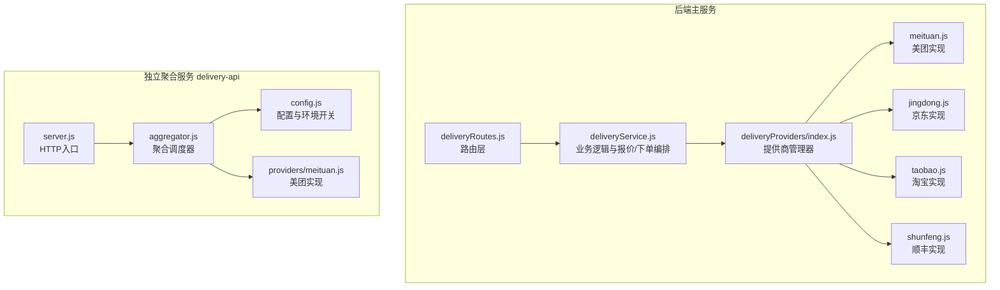
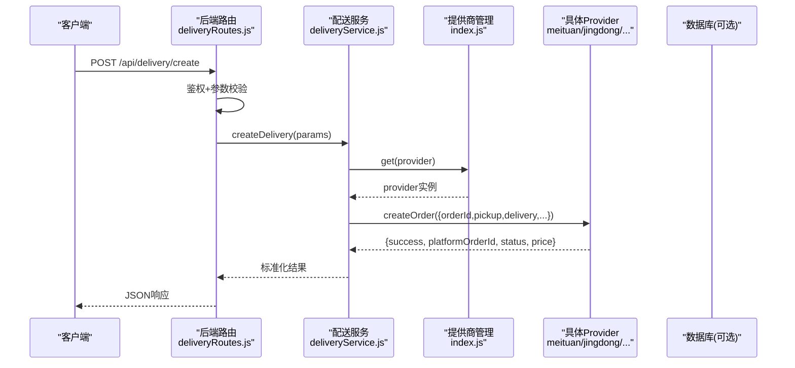
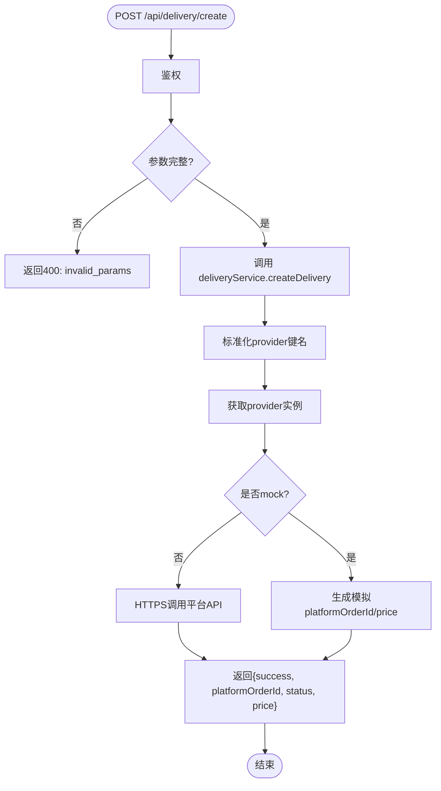
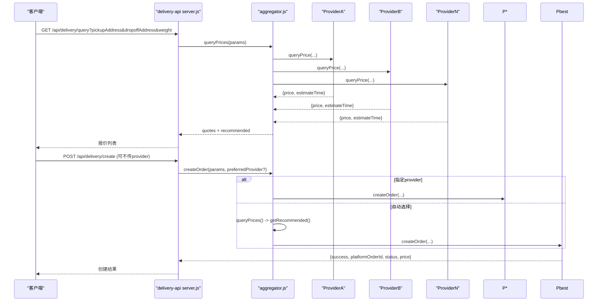
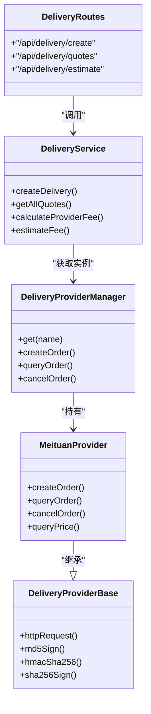

# 配送订单创建

<cite>
**本文引用的文件**   
- [deliveryRoutes.js](file://backend/modules/common/routes/deliveryRoutes.js)
- [deliveryService.js](file://backend/modules/common/services/deliveryService.js)
- [index.js](file://backend/services/deliveryProviders/index.js)
- [providerBase.js](file://backend/services/deliveryProviders/providerBase.js)
- [meituan.js](file://backend/services/deliveryProviders/meituan.js)
- [server.js](file://delivery-api/server.js)
- [aggregator.js](file://delivery-api/aggregator.js)
- [config.js](file://delivery-api/config.js)
- [meituan.js](file://delivery-api/providers/meituan.js)
- [delivery-api.js](file://api/delivery-api.js)
- [delivery.js](file://api/delivery.js)
</cite>

## 目录
1. [简介](#简介)
2. [项目结构](#项目结构)
3. [核心组件](#核心组件)
4. [架构总览](#架构总览)
5. [详细组件分析](#详细组件分析)
6. [依赖关系分析](#依赖关系分析)
7. [性能与扩展性](#性能与扩展性)
8. [故障排查指南](#故障排查指南)
9. [结论](#结论)
10. [附录：接口规范](#附录接口规范)

## 简介
本文件面向“干洗系统”的配送订单创建能力，提供端到端的API文档与实现说明。内容覆盖：
- 订单参数校验、费用智能计算、服务商选择策略
- 请求/响应数据结构定义
- 错误处理机制与异常场景
- 批量创建接口设计与优化建议

## 项目结构
本项目包含两套与配送相关的服务：
- 后端主服务（Express）：通过路由与服务层对接多家配送平台（美团、京东秒送、淘宝闪送、顺丰同城），支持真实API与Mock模式切换。
- 独立聚合配送服务（delivery-api）：对外暴露统一的聚合接口，内部按策略并行询价并自动选择最优服务商下单。

图示来源
- [deliveryRoutes.js:1-120](file://backend/modules/common/routes/deliveryRoutes.js#L1-L120)
- [deliveryService.js:1-120](file://backend/modules/common/services/deliveryService.js#L1-L120)
- [index.js:1-87](file://backend/services/deliveryProviders/index.js#L1-L87)
- [server.js:1-120](file://delivery-api/server.js#L1-L120)
- [aggregator.js:1-120](file://delivery-api/aggregator.js#L1-L120)
- [config.js:1-93](file://delivery-api/config.js#L1-L93)
- [meituan.js:1-120](file://delivery-api/providers/meituan.js#L1-L120)

章节来源
- [deliveryRoutes.js:1-120](file://backend/modules/common/routes/deliveryRoutes.js#L1-L120)
- [deliveryService.js:1-120](file://backend/modules/common/services/deliveryService.js#L1-L120)
- [server.js:1-120](file://delivery-api/server.js#L1-L120)
- [aggregator.js:1-120](file://delivery-api/aggregator.js#L1-L120)

## 核心组件
- 路由层（后端）：统一暴露配送相关REST接口，负责鉴权、入参校验、调用服务层。
- 服务层（后端）：封装定价计算、报价排序、下单/查询/取消等业务流程；根据是否配置密钥决定真实或模拟模式。
- 提供商管理（后端）：统一管理各平台实现，提供状态、模式、方法分发。
- 提供商基类（后端）：统一HTTP请求、签名算法、超时控制与Mock降级。
- 聚合服务（独立）：对外提供统一聚合接口，支持并行询价、推荐策略、自动下单。

章节来源
- [deliveryRoutes.js:1-120](file://backend/modules/common/routes/deliveryRoutes.js#L1-L120)
- [deliveryService.js:120-322](file://backend/modules/common/services/deliveryService.js#L120-L322)
- [index.js:1-87](file://backend/services/deliveryProviders/index.js#L1-L87)
- [providerBase.js:1-124](file://backend/services/deliveryProviders/providerBase.js#L1-L124)
- [server.js:1-120](file://delivery-api/server.js#L1-L120)
- [aggregator.js:1-120](file://delivery-api/aggregator.js#L1-L120)

## 架构总览
后端主服务与独立聚合服务均支持“多服务商接入 + 自动选择”，差异在于：
- 后端主服务：在业务服务层内完成定价与报价计算，再调用具体Provider。
- 独立聚合服务：通过聚合器并行询价，基于策略选择最优服务商后下单。

图示来源
- [deliveryRoutes.js:86-133](file://backend/modules/common/routes/deliveryRoutes.js#L86-L133)
- [deliveryService.js:45-70](file://backend/modules/common/services/deliveryService.js#L45-L70)
- [index.js:57-76](file://backend/services/deliveryProviders/index.js#L57-L76)
- [meituan.js:41-93](file://backend/services/deliveryProviders/meituan.js#L41-L93)

## 详细组件分析

### 后端主服务：配送订单创建流程
- 路由职责
  - 鉴权中间件保护创建接口
  - 校验必要字段：orderId、pickup、delivery
  - 构造回调地址，调用服务层
- 服务层职责
  - 标准化提供商标识
  - 调用对应Provider的createOrder
  - 返回统一格式结果（含平台单号、状态、价格等）
- Provider实现
  - 若未配置密钥则进入Mock模式，返回合理模拟数据
  - 若已配置密钥则发起HTTPS请求至平台开放API，失败时降级为Mock

图示来源
- [deliveryRoutes.js:86-133](file://backend/modules/common/routes/deliveryRoutes.js#L86-L133)
- [deliveryService.js:45-70](file://backend/modules/common/services/deliveryService.js#L45-L70)
- [providerBase.js:35-74](file://backend/services/deliveryProviders/providerBase.js#L35-L74)
- [meituan.js:41-93](file://backend/services/deliveryProviders/meituan.js#L41-L93)

章节来源
- [deliveryRoutes.js:86-133](file://backend/modules/common/routes/deliveryRoutes.js#L86-L133)
- [deliveryService.js:45-70](file://backend/modules/common/services/deliveryService.js#L45-L70)
- [providerBase.js:1-124](file://backend/services/deliveryProviders/providerBase.js#L1-L124)
- [meituan.js:41-93](file://backend/services/deliveryProviders/meituan.js#L41-L93)

### 独立聚合服务：创建与自动选择
- 入口路由
  - GET /api/delivery/query：并行询价多家服务商
  - POST /api/delivery/create：创建订单（可指定provider或不指定）
- 聚合器
  - 并行调用各Provider.queryPrice
  - 按策略（最低价/最快/综合推荐）选择最优
  - 使用推荐Provider下单
- 配置
  - 通过config.js控制各平台开关、测试/生产环境URL、默认策略等

图示来源
- [server.js:56-154](file://delivery-api/server.js#L56-L154)
- [aggregator.js:54-197](file://delivery-api/aggregator.js#L54-L197)
- [config.js:80-93](file://delivery-api/config.js#L80-L93)
- [meituan.js:1-120](file://delivery-api/providers/meituan.js#L1-L120)

章节来源
- [server.js:56-154](file://delivery-api/server.js#L56-L154)
- [aggregator.js:54-197](file://delivery-api/aggregator.js#L54-L197)
- [config.js:1-93](file://delivery-api/config.js#L1-L93)
- [meituan.js:1-120](file://delivery-api/providers/meituan.js#L1-L120)

### 费用计算与优惠券抵扣规则
- 后端主服务（纯业务逻辑，不依赖外部API）
  - 基础费用 = max(最低起步价, 基础单价 + 距离×每公里单价)
  - 优惠类型：新用户立减、百分比折扣、满额减、限时立减
  - 一对一实际费用 = max(1, 基础费用 - 优惠金额)
  - 拼单实际费用 = max(1, 基础费用 × (1 - 拼单折扣率) - 优惠金额)
  - 预估时间 = 距离×分钟系数 + 固定附加分钟
- 独立聚合服务
  - 各Provider各自返回price与estimateTime，由聚合器汇总并按策略排序
  - 计费细节由各Provider实现（如美团Provider中按重量与随机波动模拟）

章节来源
- [deliveryService.js:186-259](file://backend/modules/common/services/deliveryService.js#L186-L259)
- [deliveryService.js:262-292](file://backend/modules/common/services/deliveryService.js#L262-L292)
- [deliveryService.js:294-303](file://backend/modules/common/services/deliveryService.js#L294-L303)
- [meituan.js:203-207](file://delivery-api/providers/meituan.js#L203-L207)

### 服务商选择策略
- 后端主服务
  - 前端可选择provider，或默认meituan
  - 若未配置密钥，Provider以Mock模式运行
- 独立聚合服务
  - 策略：lowest_price / fastest / recommended（价格与时效加权）
  - 支持preferredProvider直接指定

章节来源
- [deliveryRoutes.js:86-133](file://backend/modules/common/routes/deliveryRoutes.js#L86-L133)
- [aggregator.js:102-129](file://delivery-api/aggregator.js#L102-L129)
- [config.js:80-85](file://delivery-api/config.js#L80-L85)

### 请求参数说明与验证规则
以下字段为创建配送订单所需的核心参数（以后端主服务接口为准）：
- orderId：字符串，必填，业务订单ID
- provider：字符串，可选，平台标识（meituan/jingdong/taobao/shunfeng），默认meituan
- pickup：对象，必填
  - address：字符串，必填，取件详细地址
  - latitude：数字，选填，取件纬度
  - longitude：数字，选填，取件经度
  - contactName：字符串，选填，取件联系人
  - contactPhone：字符串，选填，取件联系电话
- delivery：对象，必填
  - address：字符串，必填，送达详细地址
  - latitude：数字，选填，送达纬度
  - longitude：数字，选填，送达经度
  - contactName：字符串，选填，收件人姓名
  - contactPhone：字符串，选填，收件人电话
- goodsDesc：字符串，选填，物品描述（如干洗衣物）
- weight：数字，选填，物品重量（kg），默认1
- callbackUrl：字符串，选填，平台回调地址（服务端自动生成）

验证规则
- 必填项缺失将返回400与错误码invalid_params
- 经纬度为数值型，非必填但影响距离估算与部分平台计费
- 手机号与地址需符合常规格式（建议在网关或前置校验层补充正则校验）

章节来源
- [deliveryRoutes.js:86-133](file://backend/modules/common/routes/deliveryRoutes.js#L86-L133)
- [deliveryService.js:45-70](file://backend/modules/common/services/deliveryService.js#L45-L70)
- [meituan.js:41-93](file://backend/services/deliveryProviders/meituan.js#L41-L93)

### 响应数据结构
成功响应示例字段（标准化）：
- success：布尔
- provider：字符串，平台标识
- platformOrderId：字符串，平台侧订单号
- deliveryId：字符串，内部配送单号（可能等于orderId）
- status：字符串，初始通常为pending
- price：数字，预估或实际费用
- estimateTime：数字，预计时长（分钟）
- _mode：字符串，real或mock（仅后端主服务）

失败响应示例字段：
- success：false
- error：错误码（如unknown_provider、server_error）
- message：人类可读的错误信息

章节来源
- [deliveryRoutes.js:86-133](file://backend/modules/common/routes/deliveryRoutes.js#L86-L133)
- [deliveryService.js:45-70](file://backend/modules/common/services/deliveryService.js#L45-L70)
- [meituan.js:41-93](file://backend/services/deliveryProviders/meituan.js#L41-L93)

### 错误处理机制
- 参数校验失败：返回400与错误码invalid_params
- 不支持的服务商：返回error=unknown_provider
- 网络/平台API异常：Provider捕获异常并降级为Mock模式（后端主服务）
- 未知服务商（聚合服务）：返回error=未知的服务商
- 通用服务器错误：返回500与server_error

章节来源
- [deliveryRoutes.js:86-133](file://backend/modules/common/routes/deliveryRoutes.js#L86-L133)
- [deliveryService.js:45-70](file://backend/modules/common/services/deliveryService.js#L45-L70)
- [index.js:57-76](file://backend/services/deliveryProviders/index.js#L57-L76)
- [providerBase.js:35-74](file://backend/services/deliveryProviders/providerBase.js#L35-L74)
- [meituan.js:88-93](file://backend/services/deliveryProviders/meituan.js#L88-L93)
- [aggregator.js:205-232](file://delivery-api/aggregator.js#L205-L232)

### 批量创建配送订单
当前仓库未提供原生批量创建接口。建议设计如下：
- 接口设计
  - POST /api/delivery/batch-create
  - 请求体：orders数组，每项包含上述单个订单所需字段
  - 响应体：results数组，逐项返回success、platformOrderId、error等
- 并发与限流
  - 使用Promise.allSettled并行调用各Provider
  - 对每个Provider设置并发上限与重试次数
  - 全局速率限制与熔断（如某Provider连续失败超过阈值，暂时隔离）
- 幂等与去重
  - 使用orderId作为幂等键，重复提交返回相同platformOrderId
- 事务与补偿
  - 本地记录待创建批次，成功后落库；失败保留错误明细
  - 提供重试任务与人工干预入口

[本节为概念性设计，无直接代码映射]

## 依赖关系分析
- 路由层依赖服务层
- 服务层依赖提供商管理器
- 提供商管理器持有各Provider实例
- Provider继承基类，复用HTTP与签名能力
- 独立聚合服务通过配置控制平台开关与策略

图示来源
- [deliveryRoutes.js:1-120](file://backend/modules/common/routes/deliveryRoutes.js#L1-L120)
- [deliveryService.js:1-120](file://backend/modules/common/services/deliveryService.js#L1-L120)
- [index.js:1-87](file://backend/services/deliveryProviders/index.js#L1-L87)
- [providerBase.js:1-124](file://backend/services/deliveryProviders/providerBase.js#L1-L124)
- [meituan.js:1-120](file://backend/services/deliveryProviders/meituan.js#L1-L120)

章节来源
- [deliveryRoutes.js:1-120](file://backend/modules/common/routes/deliveryRoutes.js#L1-L120)
- [deliveryService.js:1-120](file://backend/modules/common/services/deliveryService.js#L1-L120)
- [index.js:1-87](file://backend/services/deliveryProviders/index.js#L1-L87)
- [providerBase.js:1-124](file://backend/services/deliveryProviders/providerBase.js#L1-L124)
- [meituan.js:1-120](file://backend/services/deliveryProviders/meituan.js#L1-L120)

## 性能与扩展性
- 并行询价：聚合服务并行调用各Provider，显著降低整体延迟
- 策略化选择：支持最低价/最快/综合推荐，便于后续引入更多维度（评分、履约成功率）
- 降级与容错：Provider失败自动回退到Mock，保障可用性
- 可扩展点
  - 新增Provider只需实现基类接口并注册到管理器
  - 可在服务层增加缓存（如热门路线的预估时间与费用）
  - 引入异步队列处理高并发下单

[本节为通用指导，无直接代码映射]

## 故障排查指南
- 常见问题
  - 缺少必要参数：检查orderId、pickup、delivery是否完整
  - 不支持的服务商：确认provider值是否在支持列表中
  - 平台API失败：查看日志中的错误码与message，确认密钥与网络连通性
  - 回调未触发：确认callbackUrl公网可达且路径正确
- 定位步骤
  - 先查路由层日志，确认入参与鉴权结果
  - 再查服务层日志，确认Provider选择与调用结果
  - 最后查Provider日志，确认HTTP请求与签名是否正确

章节来源
- [deliveryRoutes.js:86-133](file://backend/modules/common/routes/deliveryRoutes.js#L86-L133)
- [deliveryService.js:45-70](file://backend/modules/common/services/deliveryService.js#L45-L70)
- [providerBase.js:35-74](file://backend/services/deliveryProviders/providerBase.js#L35-L74)
- [meituan.js:88-93](file://backend/services/deliveryProviders/meituan.js#L88-L93)

## 结论
本系统在后端主服务与独立聚合服务两条路径上实现了统一的配送订单创建能力：前者侧重业务编排与灵活定价，后者强调并行询价与自动择优。两者均具备完善的错误处理与降级策略，满足开发与生产环境的稳定运行需求。

[本节为总结，无直接代码映射]

## 附录：接口规范

### 后端主服务接口
- 获取服务商列表（含报价）
  - GET /api/delivery/providers
  - 响应：{ success, data: [{ id, name, icon, rating, pricing.solo, pricing.shared, ... }] }
- 一键获取所有服务商报价
  - POST /api/delivery/quotes
  - 请求体：{ pickup, delivery, distance?, serviceTotal?, isNewUser? }
  - 响应：{ success, data: [报价列表] }
- 估算配送费用（兼容旧接口）
  - POST /api/delivery/estimate
  - 请求体：{ provider?, pickup, delivery, deliveryType?, serviceTotal?, isNewUser? }
  - 响应：{ success, data: { provider, distance, fee, originalFee, discount, estimatedMinutes, estimatedTime, hasDiscount, discountInfo, deliveryType } }
- 创建配送订单
  - POST /api/delivery/create
  - 请求体：{ orderId, provider?, pickup, delivery, goodsDesc?, weight? }
  - 响应：{ success, provider, platformOrderId, deliveryId, status, price, estimateTime, _mode? }
- 查询配送状态
  - GET /api/delivery/status/:deliveryId?provider=...
  - 响应：{ success, provider, data: { status, driverName, driverPhone, estimatedTime, distance, _mode? } }
- 取消配送
  - POST /api/delivery/cancel
  - 请求体：{ deliveryId, provider?, reason? }
  - 响应：{ success, provider, message }

章节来源
- [deliveryRoutes.js:28-170](file://backend/modules/common/routes/deliveryRoutes.js#L28-L170)
- [deliveryService.js:156-292](file://backend/modules/common/services/deliveryService.js#L156-L292)

### 独立聚合服务接口
- 健康检查
  - GET /api/health
- 获取可用服务商
  - GET /api/delivery/providers
- 询价
  - GET /api/delivery/query?pickupAddress=&dropoffAddress=&weight=&cityName=&distance=
  - 响应：{ success, quotes: [...], errors?: [...], recommended }
- 创建配送订单
  - POST /api/delivery/create
  - 请求体：{ pickupAddress, dropoffAddress, customerName, customerPhone, shopName?, shopPhone?, goodsDesc?, weight?, orderId?, cityName?, provider? }
  - 响应：{ success, provider, providerName, platformOrderId, status, price, message }
- 查询订单状态
  - GET /api/delivery/:provider/:orderId
- 取消订单
  - POST /api/delivery/:provider/:orderId/cancel

章节来源
- [server.js:44-201](file://delivery-api/server.js#L44-L201)
- [aggregator.js:54-197](file://delivery-api/aggregator.js#L54-L197)

### 前端辅助API（参考）
- 聚合跑腿服务API（前端模块）
  - 查询可用服务商：DeliveryAPI.queryProviders(params)
  - 创建配送订单：DeliveryAPI.createOrder(order)
  - 取消配送订单：DeliveryAPI.cancelOrder(deliveryOrderId)
  - 查询配送状态：DeliveryAPI.queryStatus(deliveryOrderId)
  - 计算配送费用：DeliveryAPI.calculateFee(providerId, params)
- 模拟跑腿服务API（前端模块）
  - createOrder(orderData)
  - getOrderStatus(deliveryOrderId)
  - cancelOrder(deliveryOrderId)

章节来源
- [delivery-api.js:65-142](file://api/delivery-api.js#L65-L142)
- [delivery-api.js:260-278](file://api/delivery-api.js#L260-L278)
- [delivery.js:4-71](file://api/delivery.js#L4-L71)