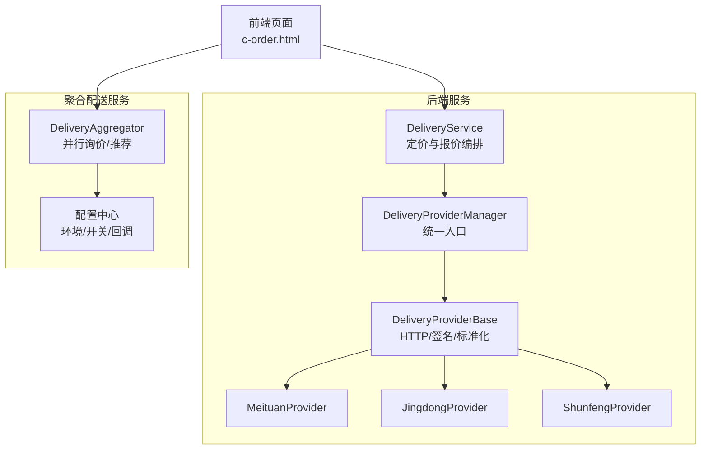
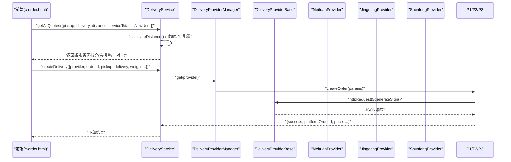
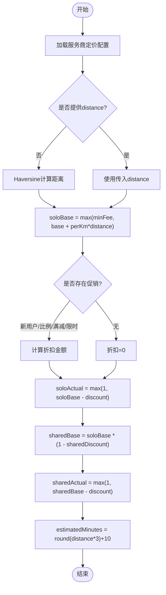
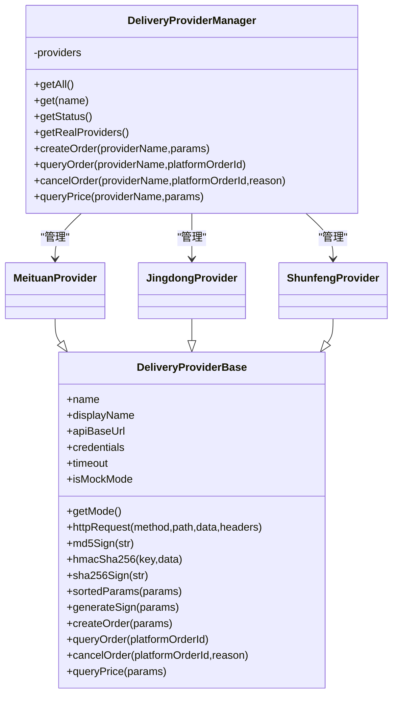
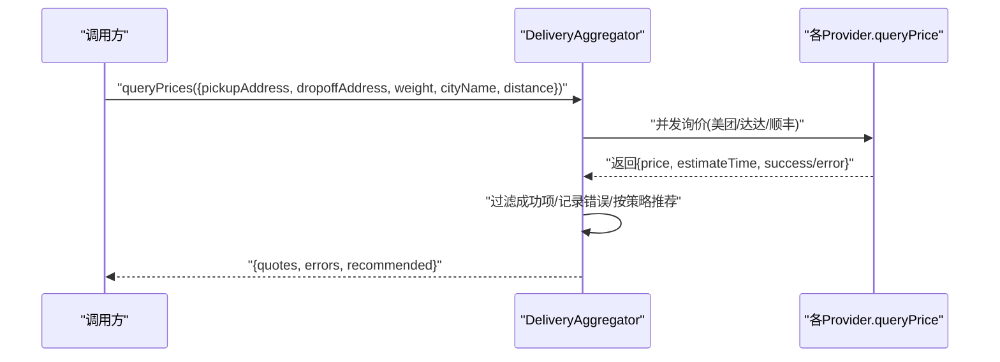
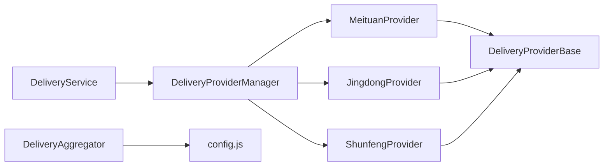

# 配送费用计算

<cite>
**本文引用的文件**   
- [backend/modules/common/services/deliveryService.js](file://backend/modules/common/services/deliveryService.js)
- [backend/services/deliveryProviders/index.js](file://backend/services/deliveryProviders/index.js)
- [backend/services/deliveryProviders/providerBase.js](file://backend/services/deliveryProviders/providerBase.js)
- [backend/services/deliveryProviders/meituan.js](file://backend/services/deliveryProviders/meituan.js)
- [backend/services/deliveryProviders/jingdong.js](file://backend/services/deliveryProviders/jingdong.js)
- [backend/services/deliveryProviders/shunfeng.js](file://backend/services/deliveryProviders/shunfeng.js)
- [delivery-api/aggregator.js](file://delivery-api/aggregator.js)
- [delivery-api/config.js](file://delivery-api/config.js)
- [api/delivery-api.js](file://api/delivery-api.js)
- [c-order.html](file://c-order.html)
</cite>

## 目录
1. [简介](#简介)
2. [项目结构](#项目结构)
3. [核心组件](#核心组件)
4. [架构总览](#架构总览)
5. [详细组件分析](#详细组件分析)
6. [依赖关系分析](#依赖关系分析)
7. [性能与扩展性](#性能与扩展性)
8. [故障排查指南](#故障排查指南)
9. [结论](#结论)
10. [附录：计费规则与测试要点](#附录计费规则与测试要点)

## 简介
本文件系统化梳理“配送费用计算系统”的设计与实现，覆盖以下关键主题：
- 智能计费逻辑：基础费用、距离附加费、重量附加费、优惠券/促销抵扣等
- 输入参数与权重因子：服务商ID、配送距离、物品重量、用户等级（新用户）、订单金额等
- 差异化定价策略：美团跑腿、京东秒送、顺丰同城、淘宝闪送
- 算法细节：阶梯计价、动态调价、高峰期附加费等复杂场景的处理方案
- 单元测试与性能测试方法建议

## 项目结构
本项目在两个层面提供配送能力：
- 后端服务层（backend）：统一的服务商接入与本地定价计算
- 聚合配送服务（delivery-api）：独立微服务，负责多平台询价与下单调度

图表来源
- [backend/modules/common/services/deliveryService.js:1-322](file://backend/modules/common/services/deliveryService.js#L1-L322)
- [backend/services/deliveryProviders/index.js:1-87](file://backend/services/deliveryProviders/index.js#L1-L87)
- [backend/services/deliveryProviders/providerBase.js:1-124](file://backend/services/deliveryProviders/providerBase.js#L1-L124)
- [backend/services/deliveryProviders/meituan.js:1-257](file://backend/services/deliveryProviders/meituan.js#L1-L257)
- [backend/services/deliveryProviders/jingdong.js:1-278](file://backend/services/deliveryProviders/jingdong.js#L1-L278)
- [backend/services/deliveryProviders/shunfeng.js:1-262](file://backend/services/deliveryProviders/shunfeng.js#L1-L262)
- [delivery-api/aggregator.js:1-237](file://delivery-api/aggregator.js#L1-L237)
- [delivery-api/config.js:1-93](file://delivery-api/config.js#L1-L93)
- [c-order.html:1750-1811](file://c-order.html#L1750-L1811)

章节来源
- [backend/modules/common/services/deliveryService.js:1-322](file://backend/modules/common/services/deliveryService.js#L1-L322)
- [backend/services/deliveryProviders/index.js:1-87](file://backend/services/deliveryProviders/index.js#L1-L87)
- [backend/services/deliveryProviders/providerBase.js:1-124](file://backend/services/deliveryProviders/providerBase.js#L1-L124)
- [delivery-api/aggregator.js:1-237](file://delivery-api/aggregator.js#L1-L237)
- [delivery-api/config.js:1-93](file://delivery-api/config.js#L1-L93)
- [c-order.html:1750-1811](file://c-order.html#L1750-L1811)

## 核心组件
- 配送服务 DeliveryService
  - 职责：定价策略、报价排序、一键获取多家报价、兼容旧接口估算费用、Haversine距离计算
  - 关键点：按服务商维度维护 base/perKm/minFee/sharedDiscount/promo 等参数；支持一对一与拼单两种模式；支持新用户、满减、百分比折扣等促销类型
- 服务商管理器 DeliveryProviderManager
  - 职责：统一注册/获取各服务商实例；查询状态；创建/查询/取消订单；查询价格
- 服务商基类 DeliveryProviderBase
  - 职责：HTTPS 请求封装、MD5/HMAC-SHA256/SHA256 签名、参数排序拼接、抽象接口定义
- 具体服务商实现
  - MeituanProvider、JingdongProvider、ShunfengProvider：各自实现签名、下单、状态查询、取消、估价；未配置密钥时自动降级为 Mock 数据
- 聚合配送服务 DeliveryAggregator
  - 职责：并行询价、错误收集、按策略推荐（最低价/最快/综合评分），并基于推荐结果下单
- 前端费用展示 c-order.html
  - 职责：调用后端报价，结合门店促销与服务总价，渲染最终支付金额

章节来源
- [backend/modules/common/services/deliveryService.js:117-303](file://backend/modules/common/services/deliveryService.js#L117-L303)
- [backend/services/deliveryProviders/index.js:20-87](file://backend/services/deliveryProviders/index.js#L20-L87)
- [backend/services/deliveryProviders/providerBase.js:10-124](file://backend/services/deliveryProviders/providerBase.js#L10-L124)
- [backend/services/deliveryProviders/meituan.js:15-257](file://backend/services/deliveryProviders/meituan.js#L15-L257)
- [backend/services/deliveryProviders/jingdong.js:17-278](file://backend/services/deliveryProviders/jingdong.js#L17-L278)
- [backend/services/deliveryProviders/shunfeng.js:15-262](file://backend/services/deliveryProviders/shunfeng.js#L15-L262)
- [delivery-api/aggregator.js:11-237](file://delivery-api/aggregator.js#L11-L237)
- [c-order.html:1750-1811](file://c-order.html#L1750-L1811)

## 架构总览
下图展示了从前端到后端再到第三方平台的完整链路，以及本地定价与外部询价的协作方式。

图表来源
- [backend/modules/common/services/deliveryService.js:173-292](file://backend/modules/common/services/deliveryService.js#L173-L292)
- [backend/services/deliveryProviders/index.js:57-83](file://backend/services/deliveryProviders/index.js#L57-L83)
- [backend/services/deliveryProviders/providerBase.js:35-74](file://backend/services/deliveryProviders/providerBase.js#L35-L74)
- [backend/services/deliveryProviders/meituan.js:41-93](file://backend/services/deliveryProviders/meituan.js#L41-L93)
- [backend/services/deliveryProviders/jingdong.js:50-98](file://backend/services/deliveryProviders/jingdong.js#L50-L98)
- [backend/services/deliveryProviders/shunfeng.js:45-95](file://backend/services/deliveryProviders/shunfeng.js#L45-L95)

## 详细组件分析

### 组件A：DeliveryService（定价与报价编排）
- 定价配置
  - 每个服务商包含：base（起步价）、perKm（每公里单价）、minFee（最低收费）、sharedDiscount（拼单折扣率）、promo（促销策略）
  - 促销类型：newUser（新用户立减）、percent（按比例折扣）、fullReduction（满额减）、limited（限时固定减免）
- 计费流程
  - 计算距离：若未传入 distance，则根据取件/收件坐标使用 Haversine 公式计算
  - 一对一计费：max(minFee, base + perKm * distance)，再应用促销折扣，得到实际费用
  - 拼单计费：在一对一基础上乘以 (1 - sharedDiscount)，再应用相同促销
  - 预估时效：distance * 3 + 10（分钟）
- 兼容接口
  - estimateFee：将 provider、deliveryType 映射到对应 pricing.solo/shared 字段返回

图表来源
- [backend/modules/common/services/deliveryService.js:186-259](file://backend/modules/common/services/deliveryService.js#L186-L259)
- [backend/modules/common/services/deliveryService.js:294-303](file://backend/modules/common/services/deliveryService.js#L294-L303)

章节来源
- [backend/modules/common/services/deliveryService.js:117-303](file://backend/modules/common/services/deliveryService.js#L117-L303)

### 组件B：DeliveryProviderManager 与 ProviderBase（统一接入与网络/签名）
- 统一管理四家服务商实例，暴露 get/getAll/getStatus/createOrder/queryOrder/cancelOrder/queryPrice
- ProviderBase 提供：
  - HTTPS 请求封装（超时、错误处理）
  - 通用签名工具：md5/hmac-sha256/sha256/sortedParams
  - 抽象接口强制子类实现 createOrder/queryOrder/cancelOrder/queryPrice

图表来源
- [backend/services/deliveryProviders/index.js:20-87](file://backend/services/deliveryProviders/index.js#L20-L87)
- [backend/services/deliveryProviders/providerBase.js:10-124](file://backend/services/deliveryProviders/providerBase.js#L10-L124)
- [backend/services/deliveryProviders/meituan.js:15-257](file://backend/services/deliveryProviders/meituan.js#L15-L257)
- [backend/services/deliveryProviders/jingdong.js:17-278](file://backend/services/deliveryProviders/jingdong.js#L17-L278)
- [backend/services/deliveryProviders/shunfeng.js:15-262](file://backend/services/deliveryProviders/shunfeng.js#L15-L262)

章节来源
- [backend/services/deliveryProviders/index.js:1-87](file://backend/services/deliveryProviders/index.js#L1-L87)
- [backend/services/deliveryProviders/providerBase.js:1-124](file://backend/services/deliveryProviders/providerBase.js#L1-L124)

### 组件C：聚合配送服务 DeliveryAggregator（并行询价与推荐）
- 并行询价：Promise.allSettled 并发调用各服务商 queryPrice，汇总成功结果并按价格排序
- 推荐策略：
  - lowest_price：选择最低价
  - fastest：选择预计时效最短
  - recommended：综合评分（价格与时效加权）
- 下单：优先使用指定服务商，否则基于推荐结果下单

图表来源
- [delivery-api/aggregator.js:54-129](file://delivery-api/aggregator.js#L54-L129)

章节来源
- [delivery-api/aggregator.js:1-237](file://delivery-api/aggregator.js#L1-L237)
- [delivery-api/config.js:1-93](file://delivery-api/config.js#L1-L93)

### 组件D：前端费用计算与展示（c-order.html）
- 先计算服务总价与门店促销折扣，再叠加配送费（根据所选服务商与配送类型：一对一/拼单）
- 最终支付金额 = 服务总价（已扣促销）+ 配送费（已扣促销）

章节来源
- [c-order.html:1750-1811](file://c-order.html#L1750-L1811)

## 依赖关系分析
- 耦合与内聚
  - DeliveryService 与 DeliveryProviderManager 解耦良好，通过键名映射访问具体提供商
  - ProviderBase 抽取了通用 HTTP 与签名能力，提升内聚性与可复用性
- 外部依赖
  - 各 Provider 直接调用第三方开放平台 API，具备 Mock 降级能力
  - 聚合服务通过配置文件控制开关、超时、回调地址等
- 潜在循环依赖
  - 当前未见循环引用；ProviderManager 仅持有实例引用，ProviderBase 不反向依赖上层

图表来源
- [backend/modules/common/services/deliveryService.js:1-322](file://backend/modules/common/services/deliveryService.js#L1-L322)
- [backend/services/deliveryProviders/index.js:1-87](file://backend/services/deliveryProviders/index.js#L1-L87)
- [backend/services/deliveryProviders/providerBase.js:1-124](file://backend/services/deliveryProviders/providerBase.js#L1-L124)
- [delivery-api/aggregator.js:1-237](file://delivery-api/aggregator.js#L1-L237)
- [delivery-api/config.js:1-93](file://delivery-api/config.js#L1-L93)

章节来源
- [backend/modules/common/services/deliveryService.js:1-322](file://backend/modules/common/services/deliveryService.js#L1-L322)
- [backend/services/deliveryProviders/index.js:1-87](file://backend/services/deliveryProviders/index.js#L1-L87)
- [delivery-api/aggregator.js:1-237](file://delivery-api/aggregator.js#L1-L237)
- [delivery-api/config.js:1-93](file://delivery-api/config.js#L1-L93)

## 性能与扩展性
- 并发与容错
  - 聚合服务采用 Promise.allSettled 并发询价，失败不影响整体返回，错误单独记录
  - 各 Provider 具备超时与异常捕获，并在真实API失败时回退至 Mock
- 可扩展点
  - 新增服务商：在 ProviderManager 中注册新实例，实现 ProviderBase 抽象接口
  - 定价策略：在 DeliveryService 的 getProviderPricingConfig 中扩展或改为配置化存储
- 复杂度评估
  - 单次报价：O(N) 遍历 N 个服务商
  - 并发询价：时间受最慢外部API影响，空间为 O(N) 保存结果与错误

[本节为通用指导，无需代码来源]

## 故障排查指南
- 常见问题定位
  - 未知服务商：检查 provider 名称映射与 ProviderManager 注册
  - 签名失败：核对各 Provider 的 generateSign 实现与密钥环境变量
  - 超时/网络错误：检查 ProviderBase 的 timeout 设置与目标域名可达性
  - Mock 模式：确认是否缺失必要环境变量导致 isMockMode=true
- 日志与诊断
  - 各 Provider 在错误路径输出控制台日志，便于快速定位
  - 聚合服务返回 errors 列表，便于统计失败原因

章节来源
- [backend/services/deliveryProviders/providerBase.js:65-74](file://backend/services/deliveryProviders/providerBase.js#L65-L74)
- [backend/services/deliveryProviders/meituan.js:86-93](file://backend/services/deliveryProviders/meituan.js#L86-L93)
- [backend/services/deliveryProviders/jingdong.js:92-98](file://backend/services/deliveryProviders/jingdong.js#L92-L98)
- [backend/services/deliveryProviders/shunfeng.js:89-95](file://backend/services/deliveryProviders/shunfeng.js#L89-L95)
- [delivery-api/aggregator.js:54-95](file://delivery-api/aggregator.js#L54-L95)

## 结论
本系统通过“本地定价 + 外部询价”的双轨机制，既保证了稳定的报价体验，又能在真实环境下获得第三方平台的实时价格与时效。模块化设计使新增服务商与调整定价策略变得简单可控，同时提供了完善的 Mock 降级与错误收集能力，满足开发与生产环境的平滑过渡。

[本节为总结性内容，无需代码来源]

## 附录：计费规则与测试要点

### 计费规则与输入参数
- 输入参数
  - 服务商ID：meituan/jingdong/shunfeng/taobao
  - 配送距离：km（可由经纬度计算）
  - 物品重量：kg（用于外部平台估价或作为附加费因子）
  - 用户等级/标识：isNewUser（新用户）
  - 订单金额：serviceTotal（用于满减促销）
  - 配送类型：solo（一对一）/ shared（拼单）
- 计费要素
  - 基础费用：base
  - 距离附加费：perKm × distance
  - 最低收费：minFee
  - 拼单折扣：sharedDiscount
  - 促销抵扣：newUser/percent/fullReduction/limited
- 不同服务商差异化策略（示例值，来源于定价配置）
  - 美团跑腿：base=5, perKm=2, minFee=8, sharedDiscount≈0.35, promo=newUser立减
  - 京东秒送：base=4.5, perKm=2.5, minFee=10, sharedDiscount≈0.40, promo=比例折扣
  - 顺丰同城：base=6, perKm=2, minFee=12, sharedDiscount≈0.30, promo=满额减
  - 淘宝闪送：base=5.5, perKm=1.8, minFee=9, sharedDiscount≈0.38, promo=限时固定减免

章节来源
- [backend/modules/common/services/deliveryService.js:122-154](file://backend/modules/common/services/deliveryService.js#L122-L154)
- [backend/modules/common/services/deliveryService.js:186-259](file://backend/modules/common/services/deliveryService.js#L186-L259)

### 复杂计费场景处理方案
- 阶梯计价
  - 可在 perKm 处引入分段函数（如 0-5km、5-15km、>15km 不同单价），在 calculateProviderFee 中替换线性计算
- 动态调价
  - 引入时段系数（高峰/平峰），在最终费用上乘以系数；或基于外部平台实时报价进行二次修正
- 高峰期附加费
  - 在促销后再次叠加固定附加费或比例附加费，确保不低于最低收费
- 重量附加费
  - 在外部平台估价中体现；或在本地规则中增加 weight > threshold 的额外加价

[本节为方案设计说明，无需代码来源]

### 单元测试用例建议
- 定价模块
  - 验证一对一与拼单在不同距离下的费用边界（≤minFee、=minFee、>minFee）
  - 验证各类促销生效条件与上限（新用户、比例、满减、限时）
  - 验证 Haversine 距离计算精度与单位换算
- 服务商模块
  - 验证签名生成（MD5/HMAC/SHA256）与参数排序一致性
  - 验证 Mock 模式返回结构与 real 模式一致（字段对齐）
  - 验证网络异常时的降级行为
- 聚合服务
  - 验证并发询价的错误收集与推荐策略正确性

[本节为测试方法论，无需代码来源]

### 性能测试方法建议
- 并发询价压测：模拟高并发调用 queryPrices，观察 P95/P99 延迟与错误率
- 外部API稳定性：注入超时/失败场景，验证熔断与回退策略
- 内存与CPU：长时间运行下监控内存泄漏与GC压力

[本节为测试方法论，无需代码来源]