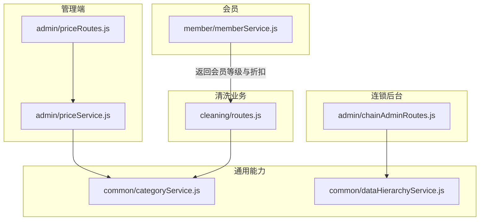
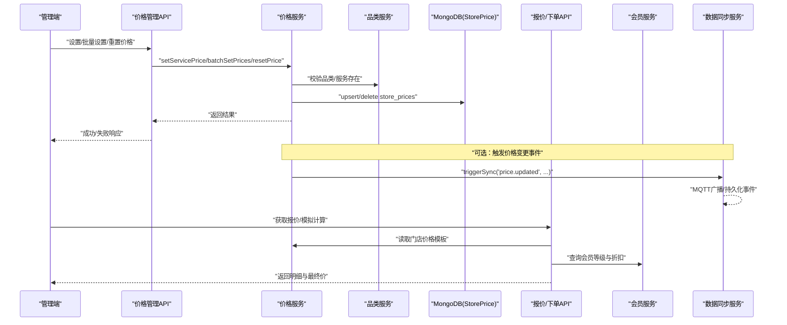
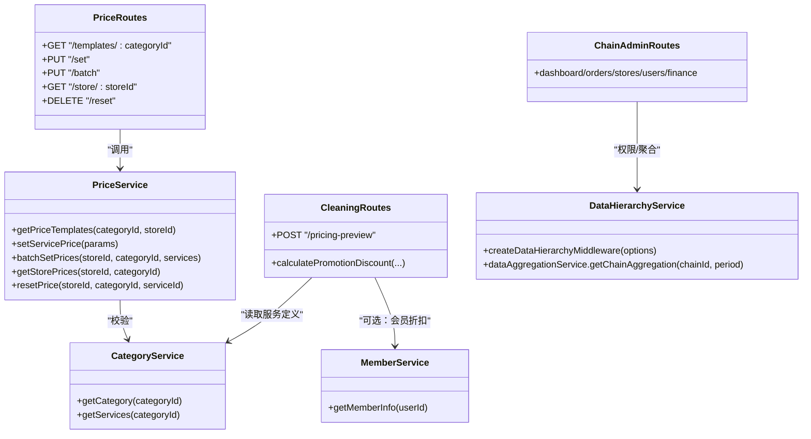
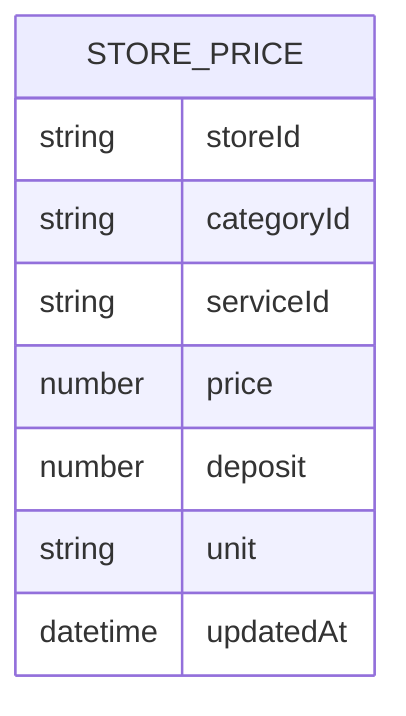
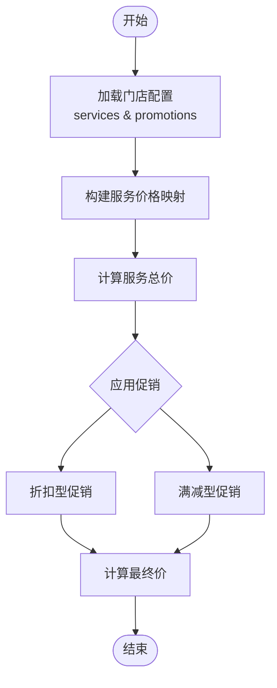

# 价格策略管理接口

<cite>
**本文引用的文件**   
- [priceRoutes.js](file://backend/modules/admin/routes/priceRoutes.js)
- [priceService.js](file://backend/modules/admin/services/priceService.js)
- [categoryService.js](file://backend/modules/common/services/categoryService.js)
- [routes.js](file://backend/modules/cleaning/routes.js)
- [memberService.js](file://backend/modules/member/services/memberService.js)
- [chainAdminRoutes.js](file://backend/modules/admin/routes/chainAdminRoutes.js)
- [dataHierarchyService.js](file://backend/modules/common/services/dataHierarchyService.js)
</cite>

## 目录
1. [简介](#简介)
2. [项目结构](#项目结构)
3. [核心组件](#核心组件)
4. [架构总览](#架构总览)
5. [详细组件分析](#详细组件分析)
6. [依赖分析](#依赖分析)
7. [性能考虑](#性能考虑)
8. [故障排查指南](#故障排查指南)
9. [结论](#结论)
10. [附录](#附录)

## 简介
本文件为干洗店“价格策略管理系统”的完整API接口文档，覆盖以下能力：
- 基础价格设置：按服务类型、门店级别配置价格策略（含押金与计价单位）
- 促销活动管理：限时折扣、满减活动、套餐优惠等营销工具（基于门店配置）
- 会员等级折扣体系：不同会员级别的差异化定价策略（查询与计算）
- 价格版本管理与历史变更：支持记录调整时间与恢复默认
- 价格预览与模拟计算：帮助管理员评估价格策略效果
- 价格同步机制：确保各端价格数据一致性（MQTT事件+聚合统计）
- 连锁品牌统一管控与区域差异化定价：通过连锁后台与数据层级权限实现

## 项目结构
与价格策略相关的后端模块主要位于 backend/modules 下：
- admin 模块：提供门店价格管理路由与服务
- common 模块：品类定义、数据层级权限与同步服务
- cleaning 模块：订单报价与促销计算逻辑
- member 模块：会员信息与等级折扣
- chain-admin 模块：连锁后台数据访问与聚合

图表来源
- [priceRoutes.js:1-79](file://backend/modules/admin/routes/priceRoutes.js#L1-L79)
- [priceService.js:1-131](file://backend/modules/admin/services/priceService.js#L1-L131)
- [categoryService.js:1-289](file://backend/modules/common/services/categoryService.js#L1-L289)
- [routes.js:750-949](file://backend/modules/cleaning/routes.js#L750-L949)
- [memberService.js:1-134](file://backend/modules/member/services/memberService.js#L1-L134)
- [chainAdminRoutes.js:1-800](file://backend/modules/admin/routes/chainAdminRoutes.js#L1-L800)
- [dataHierarchyService.js:1-648](file://backend/modules/common/services/dataHierarchyService.js#L1-L648)

章节来源
- [priceRoutes.js:1-79](file://backend/modules/admin/routes/priceRoutes.js#L1-L79)
- [priceService.js:1-131](file://backend/modules/admin/services/priceService.js#L1-L131)
- [categoryService.js:1-289](file://backend/modules/common/services/categoryService.js#L1-L289)
- [routes.js:750-949](file://backend/modules/cleaning/routes.js#L750-L949)
- [memberService.js:1-134](file://backend/modules/member/services/memberService.js#L1-L134)
- [chainAdminRoutes.js:1-800](file://backend/modules/admin/routes/chainAdminRoutes.js#L1-L800)
- [dataHierarchyService.js:1-648](file://backend/modules/common/services/dataHierarchyService.js#L1-L648)

## 核心组件
- 门店价格管理路由与服务：提供模板获取、单条/批量设置、查询与重置
- 品类服务目录：定义多品类服务项及系统默认价格
- 订单报价与促销计算：根据门店配置与服务选择计算总价与折扣
- 会员服务：根据积分计算会员等级与折扣率
- 连锁后台与数据层级：保障跨层级数据访问与聚合统计
- 数据同步服务：基于MQTT的事件广播与层级同步

章节来源
- [priceRoutes.js:1-79](file://backend/modules/admin/routes/priceRoutes.js#L1-L79)
- [priceService.js:1-131](file://backend/modules/admin/services/priceService.js#L1-L131)
- [categoryService.js:1-289](file://backend/modules/common/services/categoryService.js#L1-L289)
- [routes.js:750-949](file://backend/modules/cleaning/routes.js#L750-L949)
- [memberService.js:1-134](file://backend/modules/member/services/memberService.js#L1-L134)
- [chainAdminRoutes.js:1-800](file://backend/modules/admin/routes/chainAdminRoutes.js#L1-L800)
- [dataHierarchyService.js:1-648](file://backend/modules/common/services/dataHierarchyService.js#L1-L648)

## 架构总览
价格策略在系统中的流转路径如下：
- 管理员/商家通过管理端调用价格管理接口，维护门店级价格与促销配置
- 前端或小程序在下单前调用报价接口，结合门店配置与促销规则进行实时计算
- 会员服务提供会员等级与折扣信息，参与最终支付金额计算
- 连锁后台通过数据层级中间件访问聚合数据，监控价格策略效果
- 数据同步服务将关键变更以事件形式广播，保证多端一致

图表来源
- [priceRoutes.js:1-79](file://backend/modules/admin/routes/priceRoutes.js#L1-L79)
- [priceService.js:1-131](file://backend/modules/admin/services/priceService.js#L1-L131)
- [categoryService.js:1-289](file://backend/modules/common/services/categoryService.js#L1-L289)
- [routes.js:750-949](file://backend/modules/cleaning/routes.js#L750-L949)
- [memberService.js:1-134](file://backend/modules/member/services/memberService.js#L1-L134)
- [dataHierarchyService.js:1-648](file://backend/modules/common/services/dataHierarchyService.js#L1-L648)

## 详细组件分析

### 一、基础价格设置（门店级）
- 功能说明
  - 获取某品类下的服务模板列表（合并系统默认与门店自定义）
  - 设置/修改单条服务价格（含押金与计价单位）
  - 批量设置某品类下所有服务价格
  - 获取门店所有已设价格
  - 删除门店自定义价格（恢复默认）

- 接口清单
  - GET /api/admin/prices/templates/:categoryId
    - 查询参数：storeId（可选）
    - 返回：模板列表，包含默认价格与门店覆盖字段
  - PUT /api/admin/prices/set
    - 请求体：storeId, categoryId, serviceId, price, deposit?, unit?
    - 行为：upsert 门店价格记录
  - PUT /api/admin/prices/batch
    - 请求体：storeId, categoryId, services[]（每项含 serviceId, price, deposit?, unit?）
  - GET /api/admin/prices/store/:storeId
    - 查询参数：categoryId（可选）
    - 返回：该门店的价格记录集合
  - DELETE /api/admin/prices/reset
    - 请求体：storeId, categoryId, serviceId
    - 行为：删除门店自定义价格，回退到系统默认

- 价格计算规则
  - 展示与下单时优先使用门店自定义价格；若不存在则回退至品类服务中的默认价格
  - 支持 deposit（押金）与 unit（计价单位）字段

- 生效时间控制
  - 更新操作会写入 updatedAt 时间戳，便于审计与回溯

- 响应格式
  - 成功：{ success: true, data: ... }
  - 失败：{ success: false, error: "错误信息" }

- 示例路径参考
  - [priceRoutes.js:14-23](file://backend/modules/admin/routes/priceRoutes.js#L14-L23)
  - [priceRoutes.js:26-39](file://backend/modules/admin/routes/priceRoutes.js#L26-L39)
  - [priceRoutes.js:42-53](file://backend/modules/admin/routes/priceRoutes.js#L42-L53)
  - [priceRoutes.js:56-65](file://backend/modules/admin/routes/priceRoutes.js#L56-L65)
  - [priceRoutes.js:68-76](file://backend/modules/admin/routes/priceRoutes.js#L68-L76)
  - [priceService.js:37-64](file://backend/modules/admin/services/priceService.js#L37-L64)
  - [priceService.js:69-88](file://backend/modules/admin/services/priceService.js#L69-L88)
  - [priceService.js:93-106](file://backend/modules/admin/services/priceService.js#L93-L106)
  - [priceService.js:111-115](file://backend/modules/admin/services/priceService.js#L111-L115)
  - [priceService.js:120-122](file://backend/modules/admin/services/priceService.js#L120-L122)

章节来源
- [priceRoutes.js:1-79](file://backend/modules/admin/routes/priceRoutes.js#L1-L79)
- [priceService.js:1-131](file://backend/modules/admin/services/priceService.js#L1-L131)
- [categoryService.js:1-289](file://backend/modules/common/services/categoryService.js#L1-L289)

### 二、促销活动管理（门店级）
- 功能说明
  - 支持折扣型促销（百分比折扣）与满减型促销（满额立减）
  - 支持条件限制：无条件、仅自取、仅首单等
  - 促销启用/禁用由门店配置控制

- 接口清单
  - 门店配置读写接口（用于保存/加载 promotions 与 services）
    - 参考路径：[routes.js:689-700](file://backend/modules/cleaning/routes.js#L689-L700)
  - 报价计算中应用促销（内部函数）
    - 参考路径：[routes.js:752-781](file://backend/modules/cleaning/routes.js#L752-L781)

- 促销计算规则
  - 折扣型：totalDiscount += round(subtotal * discountPercent / 100)，需满足条件
  - 满减型：当 subtotal >= threshold 时，totalDiscount += reduce
  - 条件匹配：pickup（仅自取）、first_order（仅首单）、无（无条件）

- 生效时间控制
  - 通过门店配置中的 enabled 字段控制是否参与计算

- 响应格式
  - 报价接口返回 appliedPromos 明细与 totalDiscount

- 示例路径参考
  - [routes.js:752-781](file://backend/modules/cleaning/routes.js#L752-L781)
  - [routes.js:826-844](file://backend/modules/cleaning/routes.js#L826-L844)

章节来源
- [routes.js:750-949](file://backend/modules/cleaning/routes.js#L750-L949)

### 三、会员等级折扣体系
- 功能说明
  - 根据用户积分自动计算会员等级与对应折扣
  - 返回会员基本信息（等级、折扣、到期时间等）

- 接口清单
  - GET /api/member/info?userId=...
    - 返回：success, member（含 level、discount、expireDate 等）

- 折扣映射
  - 铂金会员：7.5折
  - 黄金会员：8.5折
  - 白银会员：9.0折
  - 普通会员：9.5折

- 计算流程
  - 读取用户 creditScore → 计算等级 → 映射折扣字符串

- 示例路径参考
  - [memberService.js:22-94](file://backend/modules/member/services/memberService.js#L22-L94)
  - [memberService.js:99-117](file://backend/modules/member/services/memberService.js#L99-L117)

章节来源
- [memberService.js:1-134](file://backend/modules/member/services/memberService.js#L1-L134)

### 四、价格预览与模拟计算
- 功能说明
  - 输入用户已选服务与门店ID，返回每个门店的服务总价、促销折扣与最终价
  - 用于前端展示“报价对比”，辅助决策

- 接口清单
  - POST /api/cleaning/pricing-preview
    - 请求体：selectedServices[], storeId
    - 返回：storeId, serviceTotal, discount, finalPrice, matchedItems, appliedPromos

- 计算规则
  - 从门店配置构建服务价格映射，未命中则回退默认价格表
  - 对选中服务求和得到 serviceTotal
  - 应用促销（门店级），生成 appliedPromos 与 totalDiscount
  - finalPrice = max(0, serviceTotal - discount)

- 示例路径参考
  - [routes.js:783-851](file://backend/modules/cleaning/routes.js#L783-L851)

章节来源
- [routes.js:750-949](file://backend/modules/cleaning/routes.js#L750-L949)

### 五、价格版本管理与历史记录
- 功能说明
  - 每次价格更新写入 updatedAt 时间戳
  - 删除门店自定义价格可恢复系统默认
  - 可通过查询门店价格记录进行审计与回溯

- 相关能力
  - 更新：updatedAt 自动写入
  - 恢复：reset 删除门店覆盖记录
  - 查询：getStorePrices 返回门店价格集合

- 示例路径参考
  - [priceService.js:69-88](file://backend/modules/admin/services/priceService.js#L69-L88)
  - [priceService.js:111-122](file://backend/modules/admin/services/priceService.js#L111-L122)

章节来源
- [priceService.js:1-131](file://backend/modules/admin/services/priceService.js#L1-L131)

### 六、价格同步机制（多端一致性）
- 功能说明
  - 通过数据同步服务触发事件（如 price.updated），并尝试通过 MQTT 广播
  - 同时持久化同步事件，便于追踪与重试
  - 连锁后台通过数据聚合服务汇总门店与连锁维度指标

- 关键流程
  - triggerSync(eventType, data, metadata) → broadcastEvent() → logSyncEvent()
  - syncDataHierarchy(eventType, data) 根据事件类型执行层级同步
  - DataAggregationService.getChainAggregation(chainId, period) 聚合订单、用户、收入趋势

- 示例路径参考
  - [dataHierarchyService.js:175-238](file://backend/modules/common/services/dataHierarchyService.js#L175-L238)
  - [dataHierarchyService.js:243-393](file://backend/modules/common/services/dataHierarchyService.js#L243-L393)
  - [dataHierarchyService.js:453-602](file://backend/modules/common/services/dataHierarchyService.js#L453-L602)

章节来源
- [dataHierarchyService.js:1-648](file://backend/modules/common/services/dataHierarchyService.js#L1-L648)

### 七、连锁品牌统一管控与区域差异化定价
- 功能说明
  - 连锁后台具备数据层级权限中间件，确保只能访问自身连锁的数据
  - 提供仪表盘、订单、门店、用户、资金等聚合查询接口
  - 区域差异化定价通过门店级价格覆盖实现（同一连锁下不同门店可设置不同价格）

- 关键能力
  - 数据层级中间件：createDataHierarchyMiddleware
  - 连锁后台路由：链式鉴权与数据边界控制
  - 聚合服务：getChainAggregation 提供多维度统计

- 示例路径参考
  - [chainAdminRoutes.js:1-800](file://backend/modules/admin/routes/chainAdminRoutes.js#L1-L800)
  - [dataHierarchyService.js:15-92](file://backend/modules/common/services/dataHierarchyService.js#L15-L92)
  - [dataHierarchyService.js:453-602](file://backend/modules/common/services/dataHierarchyService.js#L453-L602)

章节来源
- [chainAdminRoutes.js:1-800](file://backend/modules/admin/routes/chainAdminRoutes.js#L1-L800)
- [dataHierarchyService.js:1-648](file://backend/modules/common/services/dataHierarchyService.js#L1-L648)

## 依赖分析
- 组件耦合关系
  - priceRoutes 依赖 priceService
  - priceService 依赖 categoryService（校验品类与服务）
  - cleaning routes 依赖 categoryService（获取服务定义）与门店配置（services/promotions）
  - memberService 独立提供会员等级与折扣
  - chainAdminRoutes 依赖 dataHierarchyService（权限与聚合）

图表来源
- [priceRoutes.js:1-79](file://backend/modules/admin/routes/priceRoutes.js#L1-L79)
- [priceService.js:1-131](file://backend/modules/admin/services/priceService.js#L1-L131)
- [categoryService.js:1-289](file://backend/modules/common/services/categoryService.js#L1-L289)
- [routes.js:750-949](file://backend/modules/cleaning/routes.js#L750-L949)
- [memberService.js:1-134](file://backend/modules/member/services/memberService.js#L1-L134)
- [chainAdminRoutes.js:1-800](file://backend/modules/admin/routes/chainAdminRoutes.js#L1-L800)
- [dataHierarchyService.js:1-648](file://backend/modules/common/services/dataHierarchyService.js#L1-L648)

章节来源
- [priceRoutes.js:1-79](file://backend/modules/admin/routes/priceRoutes.js#L1-L79)
- [priceService.js:1-131](file://backend/modules/admin/services/priceService.js#L1-L131)
- [categoryService.js:1-289](file://backend/modules/common/services/categoryService.js#L1-L289)
- [routes.js:750-949](file://backend/modules/cleaning/routes.js#L750-L949)
- [memberService.js:1-134](file://backend/modules/member/services/memberService.js#L1-L134)
- [chainAdminRoutes.js:1-800](file://backend/modules/admin/routes/chainAdminRoutes.js#L1-L800)
- [dataHierarchyService.js:1-648](file://backend/modules/common/services/dataHierarchyService.js#L1-L648)

## 性能考虑
- 价格模板查询
  - 建议对 store_prices 建立复合索引（storeId, categoryId, serviceId），避免全表扫描
- 批量设置价格
  - 大批量 upsert 建议使用事务或批处理，减少数据库往返
- 报价计算
  - 门店配置缓存：将门店 services/promotions 配置缓存到内存或Redis，降低IO开销
  - 促销计算复杂度为 O(n_promo)，应限制促销数量或采用短路策略
- 数据同步
  - MQTT 不可用时降级为轮询或本地队列，避免阻塞主流程
  - 聚合查询尽量使用 MongoDB 聚合管道，减少多次往返

## 故障排查指南
- 常见错误
  - 缺少必要参数：检查必填字段（storeId, categoryId, serviceId, price 等）
  - 品类或服务不存在：确认 categoryService 中是否存在对应定义
  - 权限不足：连锁/门店角色需正确关联 chainId/storeId
- 定位方法
  - 查看接口返回的 error 字段
  - 检查 MongoDB 中 store_prices 记录是否存在与唯一性约束冲突
  - 检查数据层级中间件是否正确注入 req.dataAccessScope
- 日志与事件
  - 关注数据同步服务的日志输出，确认事件是否广播与持久化

章节来源
- [priceRoutes.js:26-39](file://backend/modules/admin/routes/priceRoutes.js#L26-L39)
- [priceService.js:69-88](file://backend/modules/admin/services/priceService.js#L69-L88)
- [dataHierarchyService.js:15-92](file://backend/modules/common/services/dataHierarchyService.js#L15-L92)

## 结论
本系统围绕“门店级价格覆盖 + 促销规则 + 会员折扣 + 连锁管控 + 数据同步”构建了完整的干洗店价格策略管理能力。通过清晰的接口设计与分层架构，既满足了单店的灵活定价需求，也支撑了连锁品牌的统一管控与区域差异化策略。后续可在促销组合优化、价格版本快照、A/B测试与智能推荐等方面持续演进。

## 附录

### A. 数据模型（门店价格）

图表来源
- [priceService.js:16-27](file://backend/modules/admin/services/priceService.js#L16-L27)

### B. 促销计算流程图

图表来源
- [routes.js:752-781](file://backend/modules/cleaning/routes.js#L752-L781)
- [routes.js:783-851](file://backend/modules/cleaning/routes.js#L783-L851)