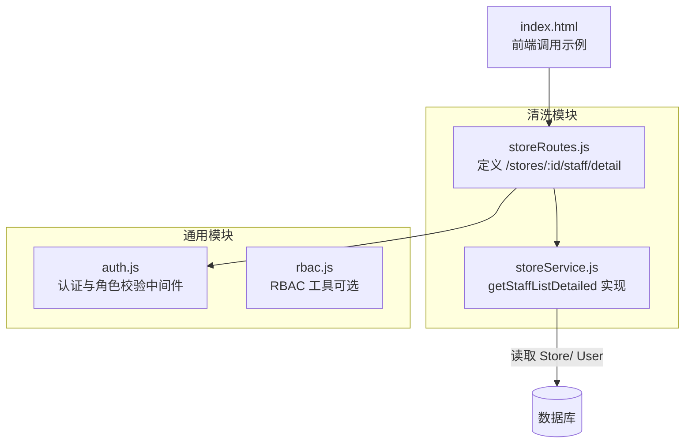
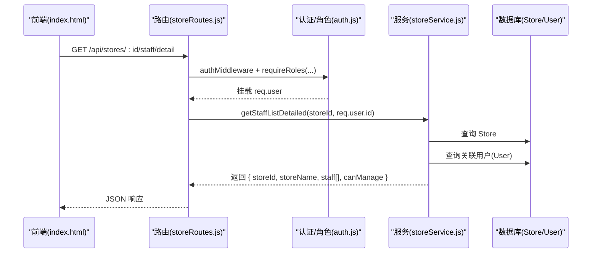
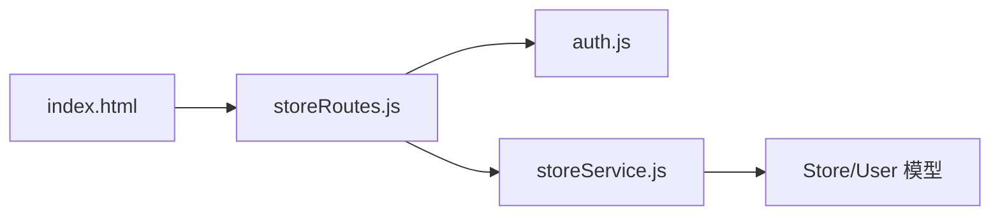

# 员工列表查询接口

<cite>
**本文引用的文件**   
- [storeRoutes.js](file://backend/modules/cleaning/routes/storeRoutes.js)
- [storeService.js](file://backend/modules/cleaning/services/storeService.js)
- [auth.js](file://backend/modules/common/middlewares/auth.js)
- [rbac.js](file://backend/modules/common/middlewares/rbac.js)
- [index.html](file://index.html)
</cite>

## 目录
1. [简介](#简介)
2. [项目结构](#项目结构)
3. [核心组件](#核心组件)
4. [架构总览](#架构总览)
5. [详细组件分析](#详细组件分析)
6. [依赖关系分析](#依赖关系分析)
7. [性能考虑](#性能考虑)
8. [故障排查指南](#故障排查指南)
9. [结论](#结论)
10. [附录](#附录)

## 简介
本文件为干洗店“员工列表查询”接口的详细文档，重点说明 getStaffListDetailed 的实现与使用方式。该接口用于获取指定门店下所有员工的详细信息，包括基本信息、角色权限、最后登录时间等关键字段，并明确数据权限控制机制。同时提供与旧版 getStaffList 接口的兼容性与迁移建议。

注意：当前实现未内置按角色、状态、入职时间等维度的筛选参数；如需扩展筛选能力，可参考“性能考虑”和“附录”中的演进建议。

## 项目结构
与员工列表查询相关的后端代码位于 cleaning 模块中，包含路由与服务层实现，以及通用的认证与权限中间件。前端页面通过调用 /api/stores/:id/staff/detail 获取员工详情数据。

图表来源
- [storeRoutes.js:121-132](file://backend/modules/cleaning/routes/storeRoutes.js#L121-L132)
- [storeService.js:291-341](file://backend/modules/cleaning/services/storeService.js#L291-L341)
- [auth.js:10-138](file://backend/modules/common/middlewares/auth.js#L10-L138)
- [index.html:2153-2163](file://index.html#L2153-L2163)

章节来源
- [storeRoutes.js:1-194](file://backend/modules/cleaning/routes/storeRoutes.js#L1-L194)
- [storeService.js:1-376](file://backend/modules/cleaning/services/storeService.js#L1-L376)
- [auth.js:1-209](file://backend/modules/common/middlewares/auth.js#L1-L209)
- [rbac.js:1-172](file://backend/modules/common/middlewares/rbac.js#L1-L172)
- [index.html:2153-2163](file://index.html#L2153-L2163)

## 核心组件
- 路由层：负责暴露 REST 接口、鉴权与角色校验、参数解析与响应封装。
- 服务层：实现业务逻辑，包括从数据库聚合门店与员工信息、合并去重、构造返回体。
- 认证与权限：统一鉴权、角色校验，确保只有授权人员可访问接口。
- 前端调用：管理后台页面通过 fetch 调用接口渲染员工列表。

章节来源
- [storeRoutes.js:121-132](file://backend/modules/cleaning/routes/storeRoutes.js#L121-L132)
- [storeService.js:291-341](file://backend/modules/cleaning/services/storeService.js#L291-L341)
- [auth.js:10-138](file://backend/modules/common/middlewares/auth.js#L10-L138)

## 架构总览
下图展示了请求从前端到后端的完整链路，以及关键的数据流向与权限校验点。

图表来源
- [storeRoutes.js:121-132](file://backend/modules/cleaning/routes/storeRoutes.js#L121-L132)
- [storeService.js:291-341](file://backend/modules/cleaning/services/storeService.js#L291-L341)
- [auth.js:10-138](file://backend/modules/common/middlewares/auth.js#L10-L138)

## 详细组件分析

### 接口定义与权限控制
- 接口路径与方法
  - GET /api/stores/:id/staff/detail
- 认证与角色
  - 需要登录态（Bearer Token）。
  - 支持角色：admin、store_owner、store_staff。
- 功能说明
  - 返回指定门店的员工详细信息集合，以及是否具备管理能力的标识。

章节来源
- [storeRoutes.js:121-132](file://backend/modules/cleaning/routes/storeRoutes.js#L121-L132)
- [auth.js:190-203](file://backend/modules/common/middlewares/auth.js#L190-L203)

### 服务层实现要点
- 数据来源
  - 先从 Store 模型获取门店信息与 staffIds。
  - 再根据 staffIds 查询对应 User 记录。
  - 同时补充查询 storeId 等于该门店且角色为 store_staff 或 store_owner 的用户，以覆盖未在 staffIds 但已绑定门店的情况。
- 合并与去重
  - 将两类结果合并并按用户 ID 去重，避免重复条目。
- 字段裁剪
  - 查询时排除密码等敏感字段。
- 返回结构
  - 包含门店基本信息、员工数组、以及 canManage 标志（管理员或老板可管理）。

章节来源
- [storeService.js:291-341](file://backend/modules/cleaning/services/storeService.js#L291-L341)

### 返回数据结构
- 顶层字段
  - storeId：门店ID
  - storeName：门店名称
  - storeNo：门店编号
  - staff：员工数组
  - canManage：是否具备管理能力（true/false）
- staff 数组元素字段
  - id：用户ID
  - userNo：用户编号
  - phone：手机号
  - name：姓名
  - roles：角色数组（如 store_staff、store_owner 等）
  - lastLoginAt：最后登录时间（可能为空）
  - status：账号状态（如 active/inactive/banned）
  - createdAt：创建时间

章节来源
- [storeService.js:314-341](file://backend/modules/cleaning/services/storeService.js#L314-L341)

### 请求示例
- 基础请求
  - 方法：GET
  - URL：/api/stores/{storeId}/staff/detail
  - 头部：Authorization: Bearer {token}
- 前端调用片段（路径引用）
  - 参见 index.html 中对 /stores/{id}/staff/detail 的调用与结果处理。

章节来源
- [index.html:2153-2163](file://index.html#L2153-L2163)

### 响应格式规范
- 成功响应
  - 结构：{ success: true, data: { storeId, storeName, storeNo, staff, canManage } }
- 失败响应
  - 结构：{ success: false, error: "错误信息" }
- 常见错误码
  - 401：未登录或令牌无效
  - 403：角色不足
  - 400：参数错误或业务异常（如门店不存在）

章节来源
- [storeRoutes.js:121-132](file://backend/modules/cleaning/routes/storeRoutes.js#L121-L132)
- [auth.js:10-138](file://backend/modules/common/middlewares/auth.js#L10-L138)

### 数据权限控制机制
- 认证
  - 通过 authMiddleware 解析 Token，加载用户上下文至 req.user。
- 角色校验
  - 通过 requireRoles('admin', 'store_owner', 'store_staff') 限制访问者角色。
- 数据范围
  - 仅能查看指定门店下的员工；服务层基于传入的 storeId 进行数据隔离。
- 管理权限
  - canManage 由服务端判断是否为 admin 或 store_owner，供前端决定是否展示管理操作。

章节来源
- [auth.js:10-138](file://backend/modules/common/middlewares/auth.js#L10-L138)
- [storeRoutes.js:121-132](file://backend/modules/cleaning/routes/storeRoutes.js#L121-L132)
- [storeService.js:291-341](file://backend/modules/cleaning/services/storeService.js#L291-L341)

### 分页查询支持
- 现状
  - 当前 getStaffListDetailed 接口未实现分页参数。
- 建议方案（概念性）
  - 在路由层增加 page、pageSize 参数，在服务层对最终 staff 列表进行切片，并返回 total、page、pageSize、totalPages 等分页元信息。
  - 若需按维度筛选后再分页，应在数据库层完成过滤与计数，以减少内存开销。

章节来源
- [storeRoutes.js:121-132](file://backend/modules/cleaning/routes/storeRoutes.js#L121-L132)
- [storeService.js:291-341](file://backend/modules/cleaning/services/storeService.js#L291-L341)

### 查询筛选条件
- 现状
  - 当前接口不支持按角色、状态、入职时间等维度筛选。
- 建议方案（概念性）
  - 在路由层接收 query 参数（如 role、status、createdAtFrom、createdAtTo），在服务层组合查询条件，并在数据库层执行过滤与排序。
  - 对常用筛选字段建立索引以提升查询性能。

章节来源
- [storeRoutes.js:121-132](file://backend/modules/cleaning/routes/storeRoutes.js#L121-L132)
- [storeService.js:291-341](file://backend/modules/cleaning/services/storeService.js#L291-L341)

### 与旧版本 getStaffList 接口的兼容性
- 旧接口
  - GET /api/stores/:id/staff
  - 返回：仅包含员工ID数组（staffIds）
- 新接口
  - GET /api/stores/:id/staff/detail
  - 返回：包含员工详细信息与管理标识
- 迁移建议
  - 逐步替换前端对 /staff 的调用为 /staff/detail。
  - 保留旧接口一段时间，以便灰度切换与回滚。
  - 在客户端侧做兼容处理：当 detail 不可用时降级为仅显示ID列表。

章节来源
- [storeRoutes.js:180-191](file://backend/modules/cleaning/routes/storeRoutes.js#L180-L191)
- [storeRoutes.js:121-132](file://backend/modules/cleaning/routes/storeRoutes.js#L121-L132)
- [storeService.js:343-351](file://backend/modules/cleaning/services/storeService.js#L343-L351)

## 依赖关系分析
- 路由依赖服务层方法，服务层依赖数据库模型（Store、User）。
- 认证与角色中间件贯穿所有受保护接口。
- 前端页面直接调用路由接口。

图表来源
- [storeRoutes.js:121-132](file://backend/modules/cleaning/routes/storeRoutes.js#L121-L132)
- [storeService.js:291-341](file://backend/modules/cleaning/services/storeService.js#L291-L341)
- [auth.js:10-138](file://backend/modules/common/middlewares/auth.js#L10-L138)
- [index.html:2153-2163](file://index.html#L2153-L2163)

章节来源
- [storeRoutes.js:1-194](file://backend/modules/cleaning/routes/storeRoutes.js#L1-L194)
- [storeService.js:1-376](file://backend/modules/cleaning/services/storeService.js#L1-L376)
- [auth.js:1-209](file://backend/modules/common/middlewares/auth.js#L1-L209)
- [index.html:2153-2163](file://index.html#L2153-L2163)

## 性能考虑
- 查询优化
  - 在 User 表上对 roles、storeId、lastLoginAt、createdAt 等常用筛选字段建立索引，可显著提升过滤与排序性能。
  - 减少不必要字段传输，当前已排除 password。
- 合并去重
  - 当前在应用层合并去重，适合中小规模数据；若员工数量较大，建议在数据库层通过唯一约束与更精确的查询条件减少冗余。
- 分页与筛选
  - 引入分页与筛选后，应优先在数据库层完成过滤与计数，避免全量拉取与应用层计算。
- 缓存策略（概念性）
  - 对于不频繁变更的门店员工列表，可在网关或应用层加入短时缓存，降低数据库压力。

[本节为通用性能建议，无需特定文件来源]

## 故障排查指南
- 401 未登录或令牌无效
  - 检查 Authorization 头是否正确携带 Bearer Token。
  - 确认 Token 未过期且有效。
- 403 权限不足
  - 确认当前用户角色包含 admin、store_owner 或 store_staff 之一。
- 400 业务异常
  - 检查门店ID是否存在。
  - 检查请求参数是否符合预期。
- 前端调试
  - 参考 index.html 中的调用位置，观察网络请求与返回结构。

章节来源
- [auth.js:10-138](file://backend/modules/common/middlewares/auth.js#L10-L138)
- [storeRoutes.js:121-132](file://backend/modules/cleaning/routes/storeRoutes.js#L121-L132)
- [index.html:2153-2163](file://index.html#L2153-L2163)

## 结论
getStaffListDetailed 接口提供了门店员工详细信息的集中查询能力，并通过统一的认证与角色校验保障数据安全。当前版本未实现分页与多维筛选，建议后续在路由与服务层逐步增强，以满足大规模数据场景与精细化查询需求。同时，建议平滑迁移至新接口，保留旧接口作为过渡。

[本节为总结性内容，无需特定文件来源]

## 附录

### 常见查询场景（概念性示例）
- 仅查看员工列表（无筛选）
  - 请求：GET /api/stores/{id}/staff/detail
  - 适用：普通员工或店长快速查看名单
- 按角色筛选（概念性）
  - 请求：GET /api/stores/{id}/staff/detail?role=store_staff
  - 适用：仅查看某角色的员工
- 按状态筛选（概念性）
  - 请求：GET /api/stores/{id}/staff/detail?status=active
  - 适用：仅查看启用状态的员工
- 按入职时间范围筛选（概念性）
  - 请求：GET /api/stores/{id}/staff/detail?createdAtFrom=YYYY-MM-DD&createdAtTo=YYYY-MM-DD
  - 适用：统计某时间段入职的员工
- 分页查询（概念性）
  - 请求：GET /api/stores/{id}/staff/detail?page=1&pageSize=20
  - 适用：大数据量场景的分页浏览

[本节为概念性示例，无需特定文件来源]