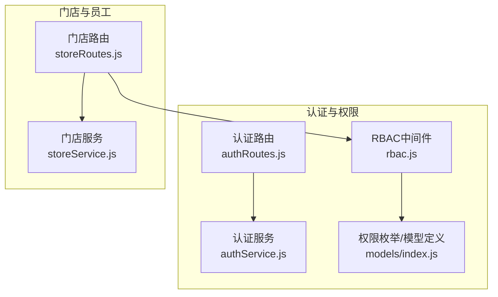
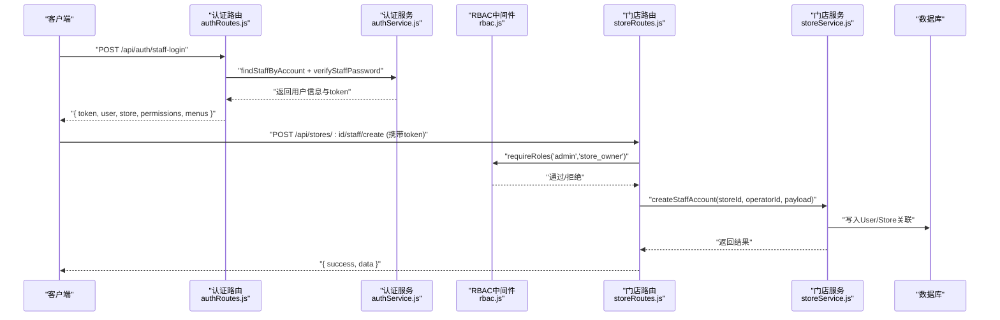
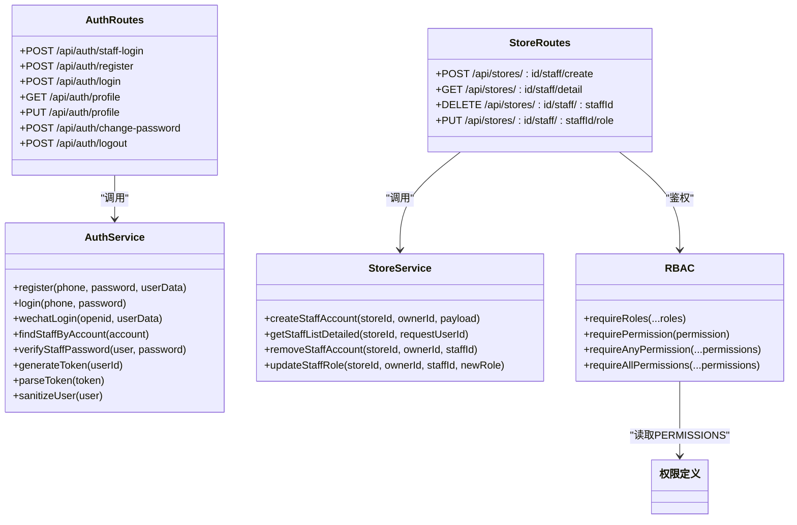

# 员工权限管理接口

<cite>
**本文引用的文件**   
- [authRoutes.js](file://backend/modules/common/routes/authRoutes.js)
- [authService.js](file://backend/modules/common/services/authService.js)
- [rbac.js](file://backend/modules/common/middlewares/rbac.js)
- [storeRoutes.js](file://backend/modules/cleaning/routes/storeRoutes.js)
- [storeService.js](file://backend/modules/cleaning/services/storeService.js)
- [index.js](file://backend/modules/common/models/index.js)
</cite>

## 目录
1. [简介](#简介)
2. [项目结构](#项目结构)
3. [核心组件](#核心组件)
4. [架构总览](#架构总览)
5. [详细组件分析](#详细组件分析)
6. [依赖关系分析](#依赖关系分析)
7. [性能与扩展建议](#性能与扩展建议)
8. [故障排查指南](#故障排查指南)
9. [结论](#结论)

## 简介
本文件为干洗店“门店员工权限管理系统”的完整API接口文档，聚焦以下能力：
- 员工账户创建（支持手机号注册并自动绑定到指定门店）
- 员工角色管理（店长、店员等角色的分配与变更）
- RBAC细粒度权限控制机制说明
- 员工信息查询（按门店、角色、状态筛选）
- 员工登录认证（JWT令牌管理与会话控制）
- 操作日志与安全审计（现状与建议）

## 项目结构
与员工权限相关的后端代码主要分布在 common 模块（认证、RBAC）、cleaning 模块（门店与员工管理路由与服务），以及公共模型定义。

图表来源
- [authRoutes.js:1-120](file://backend/modules/common/routes/authRoutes.js#L1-L120)
- [authService.js:1-120](file://backend/modules/common/services/authService.js#L1-L120)
- [rbac.js:1-172](file://backend/modules/common/middlewares/rbac.js#L1-L172)
- [storeRoutes.js:1-194](file://backend/modules/cleaning/routes/storeRoutes.js#L1-L194)
- [storeService.js:248-319](file://backend/modules/cleaning/services/storeService.js#L248-L319)
- [index.js:735-777](file://backend/modules/common/models/index.js#L735-L777)

章节来源
- [authRoutes.js:1-120](file://backend/modules/common/routes/authRoutes.js#L1-L120)
- [storeRoutes.js:1-194](file://backend/modules/cleaning/routes/storeRoutes.js#L1-L194)

## 核心组件
- 认证服务：提供用户注册、登录、微信登录、员工账号查找、密码校验、Token生成与解析、用户信息脱敏等能力。
- RBAC中间件：基于角色和权限标识进行访问控制，支持单权限、任意权限、全部权限匹配及角色白名单。
- 门店路由与服务：提供门店维度下的员工账户创建、移除、角色更新、员工列表查询等接口。
- 权限定义：集中维护各业务域可被哪些角色访问的权限映射。

章节来源
- [authService.js:1-120](file://backend/modules/common/services/authService.js#L1-L120)
- [rbac.js:1-172](file://backend/modules/common/middlewares/rbac.js#L1-L172)
- [storeRoutes.js:100-194](file://backend/modules/cleaning/routes/storeRoutes.js#L100-L194)
- [storeService.js:248-319](file://backend/modules/cleaning/services/storeService.js#L248-L319)
- [index.js:735-777](file://backend/modules/common/models/index.js#L735-L777)

## 架构总览
下图展示从客户端发起请求到权限校验、业务处理、数据持久化的整体流程。

图表来源
- [authRoutes.js:267-379](file://backend/modules/common/routes/authRoutes.js#L267-L379)
- [authService.js:349-377](file://backend/modules/common/services/authService.js#L349-L377)
- [rbac.js:98-114](file://backend/modules/common/middlewares/rbac.js#L98-L114)
- [storeRoutes.js:106-119](file://backend/modules/cleaning/routes/storeRoutes.js#L106-L119)
- [storeService.js:248-319](file://backend/modules/cleaning/services/storeService.js#L248-L319)

## 详细组件分析

### 一、认证与会话（JWT）
- 员工登录（门店端）
  - 方法：POST
  - URL：/api/auth/staff-login
  - 鉴权：无需登录态
  - 请求体字段：account（手机号或工号）、password；可选 openid（用于绑定微信）
  - 响应：包含 token、user（已脱敏）、store（若有关联）、permissions（布尔型功能开关）、menus（菜单可见性）
  - 行为要点：
    - 根据 account 查找具备门店角色的活跃用户
    - 校验密码成功后生成 token，并记录登录次数与时间
    - 如传入 openid，则尝试将微信身份绑定至该员工账户
    - 返回当前门店信息及权限集合，便于前端渲染菜单与按钮

- 通用用户注册/登录（C端）
  - POST /api/auth/register：手机号+密码注册，返回 token 与用户信息
  - POST /api/auth/login：手机号+密码登录，返回 token 与用户信息

- 微信登录（网页/小程序）
  - POST /api/auth/wechat：openid 直接登录
  - GET /api/auth/wechat/authorize：生成授权URL
  - GET /api/auth/wechat/callback：回调处理，完成登录并重定向回前端
  - POST /api/auth/wxmini-login：小程序 code 换取 openid 后登录

- 个人信息与密码
  - GET /api/auth/profile：获取当前用户信息（需登录）
  - PUT /api/auth/profile：更新个人信息（含跨平台合并逻辑）
  - POST /api/auth/change-password：修改密码（需登录）
  - POST /api/auth/logout：退出登录（无状态，仅返回成功）

- Token 机制
  - 生成：基于 userId、时间戳与随机串拼接后Base64编码
  - 解析：服务端中间件负责解码并注入 req.user
  - 注意：当前实现为简化版，生产环境建议使用标准JWT库与签名校验

章节来源
- [authRoutes.js:267-379](file://backend/modules/common/routes/authRoutes.js#L267-L379)
- [authRoutes.js:49-80](file://backend/modules/common/routes/authRoutes.js#L49-L80)
- [authRoutes.js:127-142](file://backend/modules/common/routes/authRoutes.js#L127-L142)
- [authRoutes.js:149-192](file://backend/modules/common/routes/authRoutes.js#L149-L192)
- [authRoutes.js:198-259](file://backend/modules/common/routes/authRoutes.js#L198-L259)
- [authRoutes.js:444-490](file://backend/modules/common/routes/authRoutes.js#L444-L490)
- [authRoutes.js:521-583](file://backend/modules/common/routes/authRoutes.js#L521-L583)
- [authService.js:67-125](file://backend/modules/common/services/authService.js#L67-L125)
- [authService.js:130-198](file://backend/modules/common/services/authService.js#L130-L198)
- [authService.js:349-406](file://backend/modules/common/services/authService.js#L349-L406)
- [authService.js:470-494](file://backend/modules/common/services/authService.js#L470-L494)

### 二、RBAC权限控制
- 角色体系
  - 系统管理员 admin
  - 门店老板 store_owner
  - 门店员工 store_staff
  - 普通客户 customer
  - 其他角色（回收员、鉴定师、品牌管理员等）在模型中定义，但员工管理相关以 store_owner/store_staff 为主

- 权限判定
  - requireRoles(...roles)：要求具备任一给定角色
  - requirePermission(permission)：基于权限表 PERMISSIONS 判断
  - requireAnyPermission(...permissions)：满足其一即可
  - requireAllPermissions(...permissions)：必须全部满足

- 权限表示例（节选）
  - order.view.store：['store_staff', 'store_owner']
  - store.manage：['store_owner', 'admin']
  - settlement.view：['store_owner', 'brand_admin', 'admin']

- 菜单与功能开关
  - 登录时返回 permissions 与 menus，前端据此控制页面与按钮可见性

章节来源
- [rbac.js:1-172](file://backend/modules/common/middlewares/rbac.js#L1-L172)
- [index.js:735-777](file://backend/modules/common/models/index.js#L735-L777)
- [authRoutes.js:330-362](file://backend/modules/common/routes/authRoutes.js#L330-L362)

### 三、门店员工管理接口

#### 1. 创建门店员工账户
- 方法：POST
- URL：/api/stores/:id/staff/create
- 鉴权：需要登录且具备 admin 或 store_owner 角色
- 请求体字段：
  - phone：必填，手机号
  - password：必填，初始密码
  - name：可选，姓名
  - role：可选，角色类型（例如 store_staff 或 store_owner）
- 响应：{ success, data }
- 行为要点：
  - 校验手机号与密码
  - 调用服务层创建员工账户并绑定到指定门店
  - 返回创建结果

章节来源
- [storeRoutes.js:106-119](file://backend/modules/cleaning/routes/storeRoutes.js#L106-L119)
- [storeService.js:248-319](file://backend/modules/cleaning/services/storeService.js#L248-L319)

#### 2. 获取门店员工列表（含详细信息）
- 方法：GET
- URL：/api/stores/:id/staff/detail
- 鉴权：需要登录且具备 admin、store_owner 或 store_staff 角色
- 查询参数：无（如需分页/筛选可在服务层扩展）
- 响应：{ success, data }，data 中包含员工详细信息（不含敏感字段）
- 行为要点：
  - 校验门店存在性与访问者权限
  - 聚合 staffIds 与 storeId 匹配的用户，去重返回

章节来源
- [storeRoutes.js:125-132](file://backend/modules/cleaning/routes/storeRoutes.js#L125-L132)
- [storeService.js:294-319](file://backend/modules/cleaning/services/storeService.js#L294-L319)

#### 3. 移除门店员工
- 方法：DELETE
- URL：/api/stores/:id/staff/:staffId
- 鉴权：需要登录且具备 admin 或 store_owner 角色
- 路径参数：id（门店ID）、staffId（员工ID）
- 响应：{ success, data }
- 行为要点：
  - 校验门店与员工归属
  - 移除员工在门店中的关联与门店角色

章节来源
- [storeRoutes.js:138-145](file://backend/modules/cleaning/routes/storeRoutes.js#L138-L145)
- [storeService.js:248-319](file://backend/modules/cleaning/services/storeService.js#L248-L319)

#### 4. 更新员工角色
- 方法：PUT
- URL：/api/stores/:id/staff/:staffId/role
- 鉴权：需要登录且具备 admin 或 store_owner 角色
- 请求体字段：
  - role：必填，目标角色（例如 store_staff 或 store_owner）
- 响应：{ success, data }
- 行为要点：
  - 校验角色合法性与员工归属
  - 更新用户 roles 并设置 storeId

章节来源
- [storeRoutes.js:152-162](file://backend/modules/cleaning/routes/storeRoutes.js#L152-L162)
- [storeService.js:262-289](file://backend/modules/cleaning/services/storeService.js#L262-L289)

#### 5. 旧版接口兼容（保留）
- POST /api/stores/:id/staff：通过已有 staffId 添加员工
- GET /api/stores/:id/staff：仅返回员工ID列表
- 鉴权与行为与新版类似，建议逐步迁移至新接口

章节来源
- [storeRoutes.js:168-191](file://backend/modules/cleaning/routes/storeRoutes.js#L168-L191)

### 四、员工信息查询与筛选
- 当前接口提供按门店维度的员工详情查询（/api/stores/:id/staff/detail）。
- 如需按角色、状态筛选，建议在服务层增加查询参数（如 role、status），并在路由中透传至服务层。
- 权限控制：store_staff 仅可查看列表，不可修改。

章节来源
- [storeRoutes.js:125-132](file://backend/modules/cleaning/routes/storeRoutes.js#L125-L132)
- [storeService.js:294-319](file://backend/modules/cleaning/services/storeService.js#L294-L319)

### 五、登录认证与令牌管理
- 员工登录返回 token，后续受保护接口需在请求头携带该 token。
- 服务端中间件负责解析 token 并注入 req.user，随后由 requireRoles 或 requirePermission 进行二次校验。
- 建议生产环境采用标准JWT库，配置过期时间与刷新策略。

章节来源
- [authRoutes.js:267-379](file://backend/modules/common/routes/authRoutes.js#L267-L379)
- [authService.js:470-494](file://backend/modules/common/services/authService.js#L470-L494)
- [rbac.js:98-114](file://backend/modules/common/middlewares/rbac.js#L98-L114)

### 六、操作日志与安全审计
- 现状：
  - 当前代码未实现统一的“操作日志/审计”持久化存储。
  - 登录信息会更新 lastLoginAt、loginCount 等基础字段。
- 建议方案：
  - 新增审计中间件，在关键写操作前后记录操作人、IP、时间、资源与动作。
  - 使用独立集合存储审计日志，并提供查询与导出接口。
  - 对敏感操作（如角色变更、删除员工）强制记录并告警。

[本节为概念性建议，不直接分析具体文件]

## 依赖关系分析

图表来源
- [authService.js:1-120](file://backend/modules/common/services/authService.js#L1-L120)
- [storeService.js:248-319](file://backend/modules/cleaning/services/storeService.js#L248-L319)
- [rbac.js:1-172](file://backend/modules/common/middlewares/rbac.js#L1-L172)
- [authRoutes.js:267-379](file://backend/modules/common/routes/authRoutes.js#L267-L379)
- [storeRoutes.js:106-162](file://backend/modules/cleaning/routes/storeRoutes.js#L106-L162)
- [index.js:735-777](file://backend/modules/common/models/index.js#L735-L777)

## 性能与扩展建议
- 索引优化：用户表 roles、storeId、status 已建立索引，利于按角色与门店快速检索。
- 缓存策略：高频只读场景（如门店服务列表、菜单与权限）可引入短期缓存。
- 令牌安全：建议替换为标准JWT，启用签名与过期时间，并支持刷新令牌。
- 批量操作：员工导入/批量赋权建议提供异步任务与进度查询。
- 审计扩展：引入统一审计中间件与独立存储，避免影响主业务链路性能。

[本节为通用建议，不直接分析具体文件]

## 故障排查指南
- 登录失败
  - 检查账号是否存在且状态为 active
  - 确认密码是否正确
  - 查看是否绑定了正确的门店与角色
- 权限不足
  - 确认当前用户角色是否符合 requireRoles 或 requirePermission 的要求
  - 核对 PERMISSIONS 配置是否覆盖所需权限
- 员工操作异常
  - 校验门店与员工归属关系
  - 检查角色值是否在允许范围内
- 调试技巧
  - 使用开发模式快速登录接口验证流程
  - 关注服务端控制台输出与错误码

章节来源
- [authRoutes.js:267-379](file://backend/modules/common/routes/authRoutes.js#L267-L379)
- [rbac.js:34-92](file://backend/modules/common/middlewares/rbac.js#L34-L92)
- [storeRoutes.js:106-162](file://backend/modules/cleaning/routes/storeRoutes.js#L106-L162)

## 结论
本系统已实现门店员工的创建、移除、角色更新与列表查询，配合 RBAC 中间件完成细粒度权限控制。认证流程支持手机号与微信登录，返回 token 与权限集合供前端控制界面。建议在生产环境中完善JWT规范、引入统一审计日志与更完善的筛选查询能力，以提升安全性与可运维性。