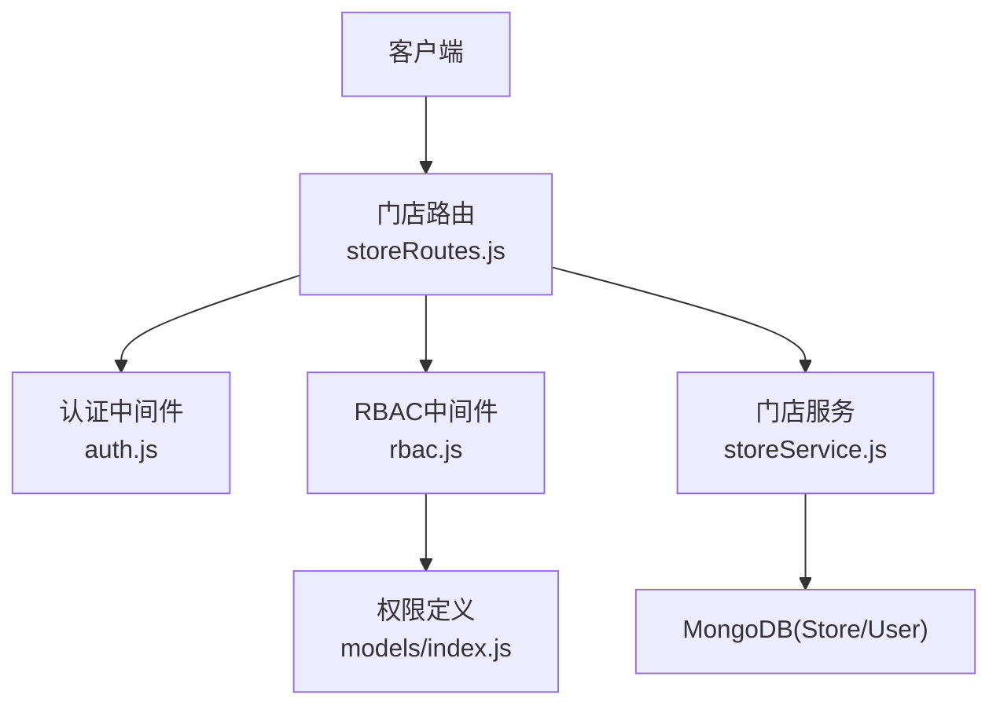
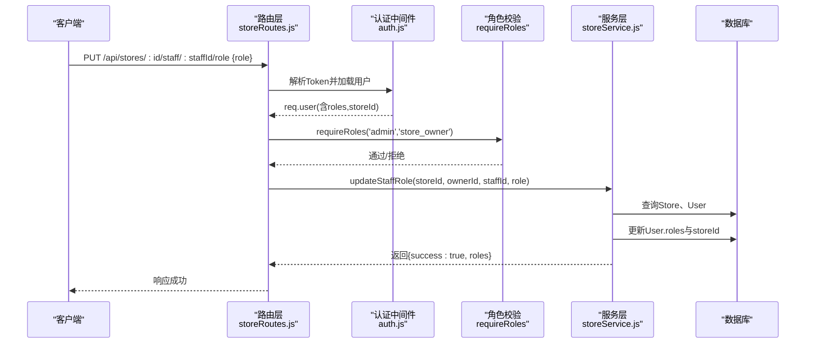
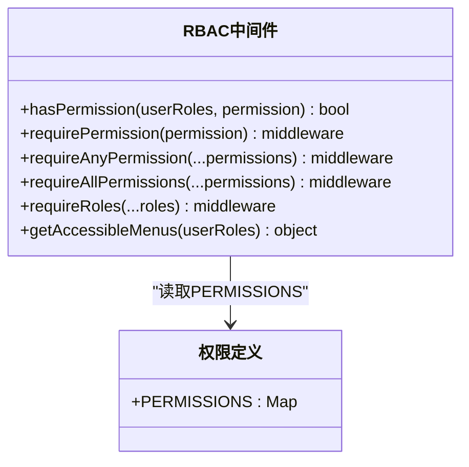
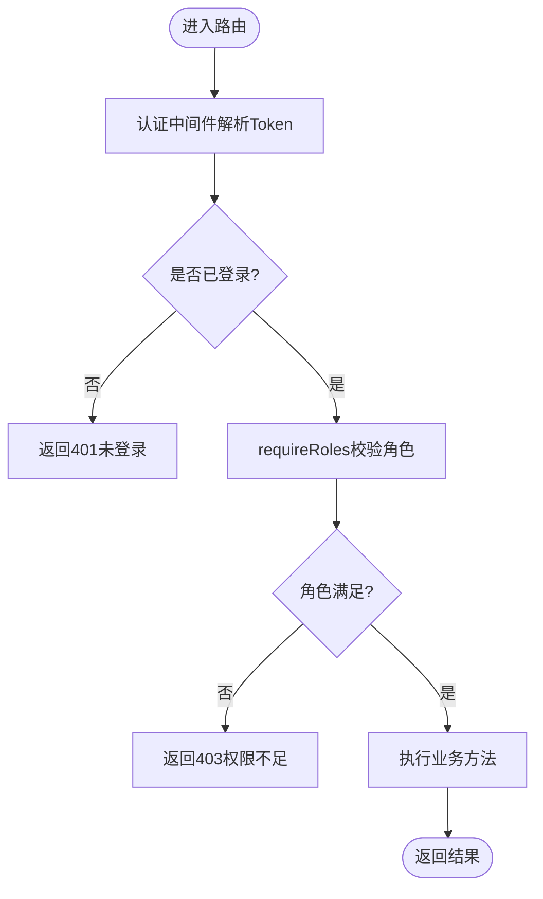
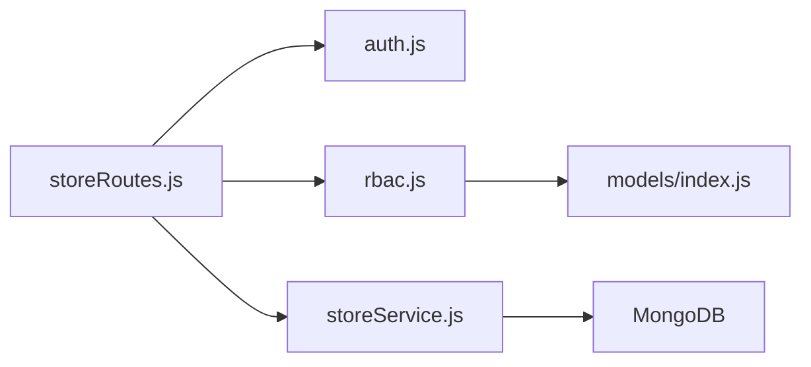

# 员工角色权限管理接口

<cite>
**本文引用的文件**   
- [storeRoutes.js](file://backend/modules/cleaning/routes/storeRoutes.js)
- [storeService.js](file://backend/modules/cleaning/services/storeService.js)
- [auth.js](file://backend/modules/common/middlewares/auth.js)
- [rbac.js](file://backend/modules/common/middlewares/rbac.js)
- [index.js](file://backend/modules/common/models/index.js)
</cite>

## 目录
1. [简介](#简介)
2. [项目结构](#项目结构)
3. [核心组件](#核心组件)
4. [架构总览](#架构总览)
5. [详细组件分析](#详细组件分析)
6. [依赖关系分析](#依赖关系分析)
7. [性能与一致性](#性能与一致性)
8. [故障排查指南](#故障排查指南)
9. [结论](#结论)
10. [附录：权限矩阵与审计方案](#附录权限矩阵与审计方案)

## 简介
本文件面向干洗店系统的“员工角色权限管理”能力，聚焦以下目标：
- 提供 updateStaffRole 接口的完整说明与调用流程
- 阐述 RBAC（基于角色的访问控制）模型在系统中的实现方式
- 明确 store_staff（店员）、store_owner（店长）等角色的权限范围、继承与组合机制
- 给出权限验证流程、角色切换逻辑与数据一致性保证策略
- 补充权限缓存更新、会话刷新等配套机制建议
- 提供权限矩阵表与角色变更审计日志记录方案

## 项目结构
与员工角色权限相关的后端代码主要分布在以下模块：
- 路由层：门店管理路由，包含员工角色更新接口
- 服务层：门店服务，封装员工角色变更的业务逻辑
- 认证中间件：解析 Token、注入用户上下文、校验角色
- RBAC 中间件：基于角色/权限的通用鉴权工具
- 模型与权限定义：枚举、用户/门店模型、全局权限映射

图表来源
- [storeRoutes.js:147-162](file://backend/modules/cleaning/routes/storeRoutes.js#L147-L162)
- [auth.js:10-138](file://backend/modules/common/middlewares/auth.js#L10-L138)
- [rbac.js:1-172](file://backend/modules/common/middlewares/rbac.js#L1-L172)
- [storeService.js:262-289](file://backend/modules/cleaning/services/storeService.js#L262-L289)
- [index.js:734-777](file://backend/modules/common/models/index.js#L734-L777)

章节来源
- [storeRoutes.js:1-194](file://backend/modules/cleaning/routes/storeRoutes.js#L1-L194)
- [storeService.js:1-376](file://backend/modules/cleaning/services/storeService.js#L1-L376)
- [auth.js:1-209](file://backend/modules/common/middlewares/auth.js#L1-L209)
- [rbac.js:1-172](file://backend/modules/common/middlewares/rbac.js#L1-L172)
- [index.js:734-777](file://backend/modules/common/models/index.js#L734-L777)

## 核心组件
- 认证中间件 authMiddleware：从请求头解析 Bearer Token，加载用户信息并挂载到 req.user；支持开发模式下的特殊 token。
- 角色校验 requireRoles：校验当前用户是否具备指定角色之一。
- RBAC 中间件 rbac.js：提供 hasPermission、requirePermission、requireAnyPermission、requireAllPermissions、getAccessibleMenus 等工具，统一权限判定与菜单过滤。
- 门店服务 storeService.updateStaffRole：负责校验操作者权限、目标员工归属、新角色合法性，并持久化更新 roles 与 storeId。
- 权限定义 PERMISSIONS：集中维护各资源/操作的允许角色集合，供 RBAC 中间件使用。

章节来源
- [auth.js:10-138](file://backend/modules/common/middlewares/auth.js#L10-L138)
- [auth.js:190-203](file://backend/modules/common/middlewares/auth.js#L190-L203)
- [rbac.js:1-172](file://backend/modules/common/middlewares/rbac.js#L1-L172)
- [storeService.js:262-289](file://backend/modules/cleaning/services/storeService.js#L262-L289)
- [index.js:734-777](file://backend/modules/common/models/index.js#L734-L777)

## 架构总览
updateStaffRole 的整体调用链路如下：

图表来源
- [storeRoutes.js:147-162](file://backend/modules/cleaning/routes/storeRoutes.js#L147-L162)
- [auth.js:10-138](file://backend/modules/common/middlewares/auth.js#L10-L138)
- [storeService.js:262-289](file://backend/modules/cleaning/services/storeService.js#L262-L289)

## 详细组件分析

### 接口规范：更新员工角色
- 接口路径
  - PUT /api/stores/:id/staff/:staffId/role
- 请求头
  - Authorization: Bearer <token>
- 请求体
  - role: 'store_staff' | 'store_owner'
- 权限要求
  - 需要 admin 或 store_owner 角色
- 业务规则
  - 仅能修改属于该门店的员工
  - 仅允许设置为 store_staff 或 store_owner
  - 更新后清除旧门店角色，再添加新角色，并绑定 storeId
- 成功响应
  - { success: true, data: { roles: [...] } }
- 失败场景
  - 未登录或 Token 无效：401
  - 角色不足：403
  - 参数缺失或非法：400
  - 门店不存在/员工不属于此门店：400

章节来源
- [storeRoutes.js:147-162](file://backend/modules/cleaning/routes/storeRoutes.js#L147-L162)
- [storeService.js:262-289](file://backend/modules/cleaning/services/storeService.js#L262-L289)

### RBAC 模型与权限定义
- 角色体系
  - customer：普通客户
  - store_staff：门店员工
  - store_owner：门店老板
  - admin：系统管理员
  - 其他角色（recycler、appraiser、brand_admin 等）用于回收/租赁等业务
- 权限映射
  - 通过 PERMISSIONS 对象将“操作标识”映射到“允许的角色集合”
  - 支持通配符 '*' 表示所有人可访问
  - admin 拥有所有权限
- 菜单可见性
  - getAccessibleMenus 根据用户角色过滤前端菜单项

图表来源
- [rbac.js:1-172](file://backend/modules/common/middlewares/rbac.js#L1-L172)
- [index.js:734-777](file://backend/modules/common/models/index.js#L734-L777)

章节来源
- [rbac.js:1-172](file://backend/modules/common/middlewares/rbac.js#L1-L172)
- [index.js:734-777](file://backend/modules/common/models/index.js#L734-L777)

### 认证与会话
- Token 解析
  - 从 Authorization 头提取 Bearer Token
  - 解析出 userId 与时间戳，加载用户信息并挂载到 req.user
- 开发模式
  - 支持 dev-admin-*、dev-chain-*、mock_token_* 等特殊格式，便于本地调试
- 会话刷新建议
  - 服务端可在角色变更后主动使旧 Token 失效（例如引入黑名单或缩短有效期），客户端收到角色变更成功后应刷新本地存储的用户信息与 Token

章节来源
- [auth.js:10-138](file://backend/modules/common/middlewares/auth.js#L10-L138)
- [auth.js:190-203](file://backend/modules/common/middlewares/auth.js#L190-L203)

### 权限验证流程
- 路由级角色校验
  - 使用 requireRoles('admin', 'store_owner') 限制只有管理员或门店老板可调用
- 权限级校验（可选）
  - 如需按操作粒度控制，可使用 requirePermission('store.manage') 等
- 菜单级过滤
  - 前端可根据 getAccessibleMenus 返回结果动态渲染菜单

图表来源
- [auth.js:10-138](file://backend/modules/common/middlewares/auth.js#L10-L138)
- [auth.js:190-203](file://backend/modules/common/middlewares/auth.js#L190-L203)
- [storeRoutes.js:147-162](file://backend/modules/cleaning/routes/storeRoutes.js#L147-L162)

### 角色切换逻辑与数据一致性
- 前置校验
  - 操作者必须是 admin 或 store_owner
  - 目标员工必须属于该门店（存在于 store.staffIds）
  - 新角色必须在允许集合内
- 原子更新
  - 移除旧的门店相关角色（store_staff、store_owner）
  - 追加新的门店角色
  - 设置 storeId 为当前门店
- 一致性保障建议
  - 使用数据库事务包裹多步写操作（若驱动支持）
  - 对并发冲突采用乐观锁或版本号字段
  - 变更完成后清理相关缓存（见下节）

章节来源
- [storeService.js:262-289](file://backend/modules/cleaning/services/storeService.js#L262-L289)

### 权限缓存与会话刷新
- 缓存更新
  - 建议在角色变更后，删除或更新与该用户相关的权限缓存键（如 user_roles:{userId}、user_permissions:{userId}）
- 会话刷新
  - 服务端可强制旧 Token 失效（加入黑名单或缩短过期时间）
  - 客户端在角色变更成功后重新拉取用户信息并刷新本地 Token

[本节为通用实践建议，不直接分析具体文件]

## 依赖关系分析
- 路由层依赖认证与角色中间件，确保入口安全
- 服务层依赖 User/Store 模型进行数据读写
- RBAC 中间件依赖全局权限定义，提供统一的权限判断能力

图表来源
- [storeRoutes.js:1-194](file://backend/modules/cleaning/routes/storeRoutes.js#L1-L194)
- [auth.js:1-209](file://backend/modules/common/middlewares/auth.js#L1-L209)
- [rbac.js:1-172](file://backend/modules/common/middlewares/rbac.js#L1-L172)
- [storeService.js:1-376](file://backend/modules/cleaning/services/storeService.js#L1-L376)
- [index.js:734-777](file://backend/modules/common/models/index.js#L734-L777)

章节来源
- [storeRoutes.js:1-194](file://backend/modules/cleaning/routes/storeRoutes.js#L1-L194)
- [auth.js:1-209](file://backend/modules/common/middlewares/auth.js#L1-L209)
- [rbac.js:1-172](file://backend/modules/common/middlewares/rbac.js#L1-L172)
- [storeService.js:1-376](file://backend/modules/cleaning/services/storeService.js#L1-L376)
- [index.js:734-777](file://backend/modules/common/models/index.js#L734-L777)

## 性能与一致性
- 索引优化
  - 用户表 roles、storeId 已建立索引，利于按角色和门店维度查询
- 查询优化
  - 列表接口避免返回敏感字段（如 password）
- 一致性
  - 角色变更涉及多字段更新，建议以事务或幂等设计保障最终一致
- 缓存
  - 高频读场景可引入内存缓存，但需保证角色变更后的失效策略

[本节为通用指导，不直接分析具体文件]

## 故障排查指南
- 401 未登录/Token 无效
  - 检查 Authorization 头是否正确携带 Bearer Token
  - 确认 Token 未被服务端标记失效
- 403 权限不足
  - 确认当前用户角色是否为 admin 或 store_owner
  - 若使用 requirePermission，检查对应权限是否在 PERMISSIONS 中配置
- 400 参数/业务错误
  - 检查 role 值是否为 store_staff 或 store_owner
  - 确认员工属于该门店（store.staffIds 包含该员工ID）
- 角色变更后仍无权限
  - 检查是否存在权限缓存未失效
  - 客户端是否刷新了本地用户信息与 Token

章节来源
- [auth.js:10-138](file://backend/modules/common/middlewares/auth.js#L10-L138)
- [storeService.js:262-289](file://backend/modules/cleaning/services/storeService.js#L262-L289)

## 结论
- updateStaffRole 接口通过路由层角色校验与服务层业务校验双重保障，确保只有授权主体可对所属门店员工进行角色调整
- RBAC 模型以 PERMISSIONS 为中心，结合中间件实现细粒度权限控制与菜单过滤
- 角色切换逻辑清晰、边界条件完备，建议在生产环境补充事务与缓存失效策略，提升一致性与性能

[本节为总结性内容，不直接分析具体文件]

## 附录：权限矩阵与审计方案

### 权限矩阵（部分）
- 角色与基础权限
  - admin：拥有全部权限
  - store_owner：门店管理与结算、订单处理、退款等
  - store_staff：订单创建与处理、物品管理等
  - customer：下单、查看自有订单等
- 示例权限条目（来自 PERMISSIONS）
  - order.create：customer、store_staff、store_owner
  - order.view.store：store_staff、store_owner
  - order.refund：store_owner、admin
  - store.manage：store_owner、admin
  - module.manage：admin

章节来源
- [index.js:734-777](file://backend/modules/common/models/index.js#L734-L777)

### 角色变更审计日志方案
- 审计事件
  - event_type: 'role_update'
  - actor_id: 操作者用户ID
  - target_id: 被变更员工ID
  - store_id: 门店ID
  - old_roles: 变更前角色数组
  - new_roles: 变更后角色数组
  - ip: 操作IP
  - ua: 客户端UA
  - created_at: 操作时间
- 存储建议
  - 独立审计集合，写入时忽略异常，不影响主流程
- 查询与分析
  - 支持按门店、操作者、时间范围检索
  - 定期归档与脱敏

[本节为通用方案建议，不直接分析具体文件]