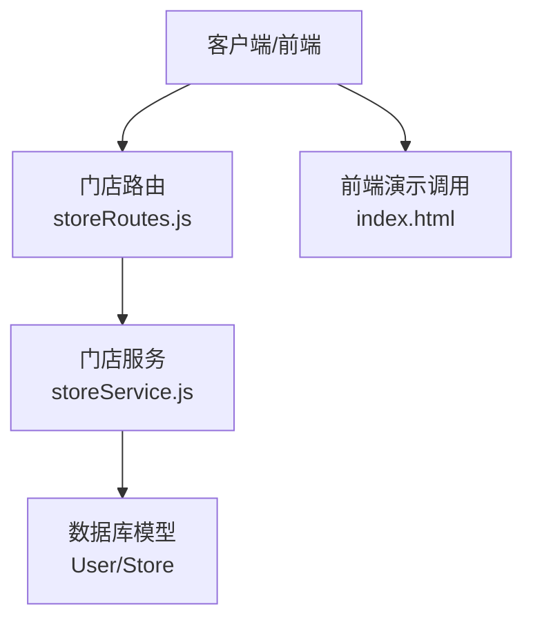
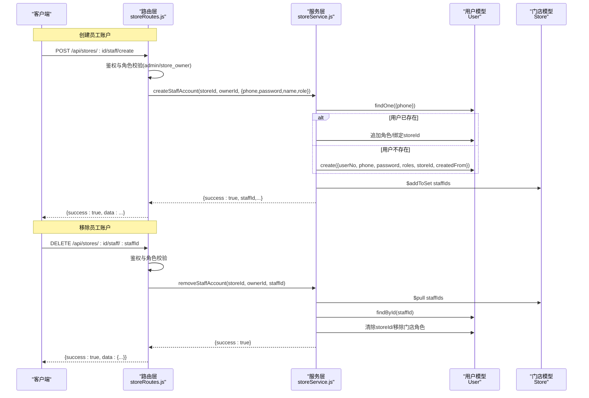
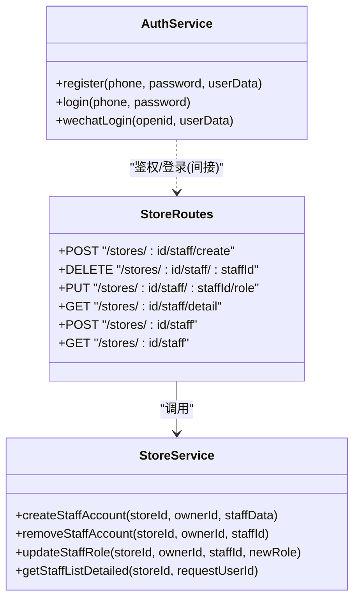

# 员工账户管理接口

<cite>
**本文引用的文件**   
- [storeRoutes.js](file://backend/modules/cleaning/routes/storeRoutes.js)
- [storeService.js](file://backend/modules/cleaning/services/storeService.js)
- [authService.js](file://backend/modules/common/services/authService.js)
- [index.html](file://index.html)
</cite>

## 目录
1. [简介](#简介)
2. [项目结构](#项目结构)
3. [核心组件](#核心组件)
4. [架构总览](#架构总览)
5. [详细接口说明](#详细接口说明)
6. [依赖关系分析](#依赖关系分析)
7. [性能与安全考虑](#性能与安全考虑)
8. [故障排查指南](#故障排查指南)
9. [结论](#结论)

## 简介
本文件为干洗店系统“门店员工账户管理”的API文档，聚焦以下能力：
- 创建员工账户（createStaffAccount）：支持门店管理员/老板为员工创建账户，自动绑定到指定门店并分配角色。
- 移除员工账户（removeStaffAccount）：从门店移除员工并清理相关权限与关联。
- 手机号注册逻辑、用户信息初始化、密码加密存储等安全机制说明。
- 每个接口的HTTP方法、URL模式、请求参数校验规则、响应格式与错误处理。
- 提供完整的请求示例与响应示例，便于快速集成。

## 项目结构
员工账户管理功能位于后端“清洗模块”，由路由层与业务服务层组成：
- 路由层：定义REST端点，进行鉴权与基础参数校验，调用服务层。
- 服务层：实现创建/移除员工、更新角色、查询员工详情等业务逻辑。

图表来源
- [storeRoutes.js:100-194](file://backend/modules/cleaning/routes/storeRoutes.js#L100-L194)
- [storeService.js:170-369](file://backend/modules/cleaning/services/storeService.js#L170-L369)
- [index.html:2253-2279](file://index.html#L2253-L2279)

章节来源
- [storeRoutes.js:100-194](file://backend/modules/cleaning/routes/storeRoutes.js#L100-L194)
- [storeService.js:170-369](file://backend/modules/cleaning/services/storeService.js#L170-L369)

## 核心组件
- 路由层（storeRoutes.js）
  - 负责鉴权与角色校验（admin、store_owner），统一异常返回格式。
  - 暴露员工账户管理的REST接口。
- 服务层（storeService.js）
  - createStaffAccount：按手机号判断是否已存在用户；若不存在则创建新用户并设置默认角色与门店关联；若存在则追加角色并绑定门店。
  - removeStaffAccount：从门店staffIds中移除员工，并清理用户的storeId与门店角色。
  - updateStaffRole：更新员工的门店角色（store_staff / store_owner）。
  - getStaffListDetailed：获取门店员工列表及详细信息。
- 认证与用户模型（authService.js）
  - 提供用户注册/登录、微信登录等通用能力，包含bcrypt密码校验与token生成。
  - 用户模型字段包括roles、storeId等，用于权限与门店归属控制。

章节来源
- [storeRoutes.js:100-194](file://backend/modules/cleaning/routes/storeRoutes.js#L100-L194)
- [storeService.js:170-369](file://backend/modules/cleaning/services/storeService.js#L170-L369)
- [authService.js:60-125](file://backend/modules/common/services/authService.js#L60-L125)

## 架构总览
下图展示“创建员工账户”和“移除员工账户”的端到端流程，以及关键数据交互。

图表来源
- [storeRoutes.js:100-194](file://backend/modules/cleaning/routes/storeRoutes.js#L100-L194)
- [storeService.js:170-369](file://backend/modules/cleaning/services/storeService.js#L170-L369)

## 详细接口说明

### 创建员工账户（createStaffAccount）
- 方法：POST
- URL：/api/stores/:id/staff/create
- 鉴权：需要登录且具备 admin 或 store_owner 角色
- 路径参数
  - id：门店ID（字符串）
- 请求体
  - phone：必填，手机号（字符串）
  - password：必填，明文密码（字符串）
  - name：可选，姓名（字符串）
  - role：可选，角色类型（字符串），默认 store_staff
- 请求示例
  - 请求头
    - Content-Type: application/json
    - Authorization: Bearer <token>
  - 请求体
    - {
      "phone": "13800001111",
      "password": "YourPassword123",
      "name": "张三",
      "role": "store_staff"
    }
- 成功响应
  - 状态码：200
  - 响应体
    - {
      "success": true,
      "data": {
        "success": true,
        "staffId": "<用户ID>",
        "name": "张三",
        "phone": "13800001111",
        "roles": ["store_staff"]
      }
    }
- 失败响应
  - 状态码：400
  - 响应体
    - {
      "success": false,
      "error": "<错误消息>"
    }
- 错误场景
  - 缺少必要参数（如未传phone/password）
  - 操作者无权限（非admin/store_owner）
  - 门店不存在
  - 其他业务异常（例如数据库写入失败）
- 行为说明
  - 若手机号已注册：为该用户追加角色（若尚未包含），并绑定storeId（若为空）。
  - 若手机号未注册：创建新用户，设置默认角色（store_staff）、绑定storeId、标记createdFrom为store_admin。
  - 将用户ID加入门店的staffIds集合。

章节来源
- [storeRoutes.js:100-119](file://backend/modules/cleaning/routes/storeRoutes.js#L100-L119)
- [storeService.js:170-226](file://backend/modules/cleaning/services/storeService.js#L170-L226)

### 移除员工账户（removeStaffAccount）
- 方法：DELETE
- URL：/api/stores/:id/staff/:staffId
- 鉴权：需要登录且具备 admin 或 store_owner 角色
- 路径参数
  - id：门店ID（字符串）
  - staffId：员工用户ID（字符串）
- 请求示例
  - 请求头
    - Content-Type: application/json
    - Authorization: Bearer <token>
- 成功响应
  - 状态码：200
  - 响应体
    - {
      "success": true,
      "data": {
        "success": true
      }
    }
- 失败响应
  - 状态码：400
  - 响应体
    - {
      "success": false,
      "error": "<错误消息>"
    }
- 错误场景
  - 操作者无权限（非admin/store_owner）
  - 门店不存在
  - 员工不存在（在后续更新时）
- 行为说明
  - 从门店staffIds中移除该员工ID。
  - 清空用户的storeId，并移除其门店相关角色（store_staff、store_owner）；若移除后无角色，则回退为customer。

章节来源
- [storeRoutes.js:134-145](file://backend/modules/cleaning/routes/storeRoutes.js#L134-L145)
- [storeService.js:228-257](file://backend/modules/cleaning/services/storeService.js#L228-L257)

### 更新员工角色（updateStaffRole）
- 方法：PUT
- URL：/api/stores/:id/staff/:staffId/role
- 鉴权：需要登录且具备 admin 或 store_owner 角色
- 路径参数
  - id：门店ID（字符串）
  - staffId：员工用户ID（字符串）
- 请求体
  - role：必填，角色类型（字符串），仅允许 store_staff 或 store_owner
- 请求示例
  - 请求体
    - {
      "role": "store_owner"
    }
- 成功响应
  - 状态码：200
  - 响应体
    - {
      "success": true,
      "data": {
        "success": true,
        "roles": ["store_owner"]
      }
    }
- 失败响应
  - 状态码：400
  - 响应体
    - {
      "success": false,
      "error": "<错误消息>"
    }
- 错误场景
  - 缺少role参数
  - 无效的角色类型
  - 员工不属于此门店
- 行为说明
  - 移除旧门店角色，添加新角色，并确保storeId指向当前门店。

章节来源
- [storeRoutes.js:147-162](file://backend/modules/cleaning/routes/storeRoutes.js#L147-L162)
- [storeService.js:259-289](file://backend/modules/cleaning/services/storeService.js#L259-L289)

### 获取门店员工列表（含详细信息）（getStaffListDetailed）
- 方法：GET
- URL：/api/stores/:id/staff/detail
- 鉴权：需要登录且具备 admin、store_owner 或 store_staff 角色
- 路径参数
  - id：门店ID（字符串）
- 成功响应
  - 状态码：200
  - 响应体
    - {
      "success": true,
      "data": {
        "storeId": "<门店ID>",
        "storeName": "门店名称",
        "storeNo": "门店编号",
        "staff": [
          {
            "id": "<用户ID>",
            "userNo": "员工编号",
            "phone": "手机号",
            "name": "姓名",
            "roles": ["store_staff"],
            "lastLoginAt": null,
            "status": "active",
            "createdAt": "时间戳"
          }
        ],
        "canManage": true
      }
    }
- 失败响应
  - 状态码：400
  - 响应体
    - {
      "success": false,
      "error": "<错误消息>"
    }
- 错误场景
  - 门店不存在
  - 无权访问

章节来源
- [storeRoutes.js:121-132](file://backend/modules/cleaning/routes/storeRoutes.js#L121-L132)
- [storeService.js:291-341](file://backend/modules/cleaning/services/storeService.js#L291-L341)

### 兼容旧接口：添加员工（addStaff）
- 方法：POST
- URL：/api/stores/:id/staff
- 鉴权：需要登录且具备 admin 或 store_owner 角色
- 请求体
  - staffId：必填，员工用户ID（字符串）
- 成功响应
  - 状态码：200
  - 响应体
    - {
      "success": true,
      "data": "<门店对象>"
    }
- 失败响应
  - 状态码：400
  - 响应体
    - {
      "success": false,
      "error": "<错误消息>"
    }

章节来源
- [storeRoutes.js:164-178](file://backend/modules/cleaning/routes/storeRoutes.js#L164-L178)

### 兼容旧接口：获取员工列表（仅ID）（getStaffList）
- 方法：GET
- URL：/api/stores/:id/staff
- 鉴权：需要登录且具备 admin、store_owner 或 store_staff 角色
- 成功响应
  - 状态码：200
  - 响应体
    - {
      "success": true,
      "data": ["<员工ID1>", "<员工ID2>"]
    }
- 失败响应
  - 状态码：400
  - 响应体
    - {
      "success": false,
      "error": "<错误消息>"
    }

章节来源
- [storeRoutes.js:180-191](file://backend/modules/cleaning/routes/storeRoutes.js#L180-L191)

## 依赖关系分析
- 路由层依赖中间件进行鉴权与角色校验（authMiddleware、requireRoles）。
- 服务层直接操作User与Store模型，完成员工账户的增删改查。
- 认证服务提供通用的用户注册/登录能力，使用bcrypt进行密码校验。

图表来源
- [storeRoutes.js:100-194](file://backend/modules/cleaning/routes/storeRoutes.js#L100-L194)
- [storeService.js:170-369](file://backend/modules/cleaning/services/storeService.js#L170-L369)
- [authService.js:60-125](file://backend/modules/common/services/authService.js#L60-L125)

章节来源
- [storeRoutes.js:100-194](file://backend/modules/cleaning/routes/storeRoutes.js#L100-L194)
- [storeService.js:170-369](file://backend/modules/cleaning/services/storeService.js#L170-L369)
- [authService.js:60-125](file://backend/modules/common/services/authService.js#L60-L125)

## 性能与安全考虑
- 性能
  - 创建/移除员工涉及两次数据库写操作（用户与门店），建议在高并发场景下对门店staffIds的更新采用幂等策略（$addToSet/$pull天然幂等）。
  - 批量操作可考虑在服务层增加事务或重试机制，确保一致性。
- 安全
  - 密码存储：认证服务使用bcrypt进行密码校验，建议在创建员工账户时也通过pre-save钩子或显式哈希后再持久化，避免明文落库。
  - 鉴权：所有接口均要求登录与角色校验，确保只有admin或store_owner能执行敏感操作。
  - 输入校验：服务端对必填字段进行校验，防止空值注入。
  - 最小权限：移除员工时仅清理门店相关角色与storeId，保留用户其他合法角色。

[本节为通用指导，不直接分析具体文件]

## 故障排查指南
- 常见问题
  - 400错误：检查请求体是否包含必填字段（phone、password、role等），确认角色值合法。
  - 权限不足：确认当前登录用户具备admin或store_owner角色。
  - 门店不存在：确认路径参数中的门店ID有效。
  - 员工不存在：移除或更新角色时，确认staffId有效且属于该门店。
- 调试建议
  - 查看服务端日志输出（路由与服务层的catch块会记录错误消息）。
  - 使用浏览器开发者工具或Postman复现请求，核对请求头与请求体。
  - 参考前端演示调用，验证网络连通性与Token传递。

章节来源
- [storeRoutes.js:100-194](file://backend/modules/cleaning/routes/storeRoutes.js#L100-L194)
- [storeService.js:170-369](file://backend/modules/cleaning/services/storeService.js#L170-L369)
- [index.html:2253-2279](file://index.html#L2253-L2279)

## 结论
本文档围绕“创建员工账户”和“移除员工账户”两大核心能力，提供了详细的接口规范、参数校验、响应格式与错误处理说明，并结合代码实现了手机号注册、用户信息初始化、权限与门店绑定等关键逻辑。开发者可据此快速集成门店员工账户管理功能，并在生产环境中结合安全与性能建议进行优化。