# 库存管理接口

<cite>
**本文引用的文件**
- [backend/modules/common/routes/authRoutes.js](file://backend/modules/common/routes/authRoutes.js)
- [backend/modules/admin/services/adminService.js](file://backend/modules/admin/services/adminService.js)
- [backend/modules/cleaning/routes/storeRoutes.js](file://backend/modules/cleaning/routes/storeRoutes.js)
- [backend/modules/common/routes/categoryRoutes.js](file://backend/modules/common/routes/categoryRoutes.js)
- [backend/modules/admin/routes/priceRoutes.js](file://backend/modules/admin/routes/priceRoutes.js)
</cite>

## 目录
1. [简介](#简介)
2. [项目结构](#项目结构)
3. [核心组件](#核心组件)
4. [架构总览](#架构总览)
5. [详细组件分析](#详细组件分析)
6. [依赖分析](#依赖分析)
7. [性能考虑](#性能考虑)
8. [故障排查指南](#故障排查指南)
9. [结论](#结论)
10. [附录](#附录)

## 简介
本文件为干洗店“库存管理系统”的完整API接口文档，覆盖商品库存的入库、出库、盘点、调拨、查询、预警、流水与审计追踪、批量导入导出、报表生成以及多仓库（门店）共享机制等能力。文档同时给出权限控制说明、参数校验规则、响应格式规范与集成建议，帮助库存管理员快速完成日常运营对接。

## 项目结构
后端采用模块化路由与服务分层组织：
- 认证与权限：统一鉴权中间件与角色权限定义，用于保护库存相关接口
- 品类与价格：提供品类模板与价格设置能力，作为库存管理的上游基础数据
- 门店与订单：提供门店维度操作入口，便于按门店进行库存隔离与统计
- 管理员服务：提供统计与聚合能力，可用于库存报表与经营指标计算

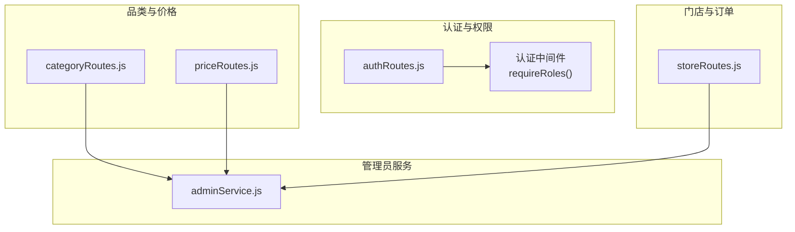

图表来源
- [backend/modules/common/routes/authRoutes.js:1-586](file://backend/modules/common/routes/authRoutes.js#L1-L586)
- [backend/modules/common/routes/categoryRoutes.js:1-59](file://backend/modules/common/routes/categoryRoutes.js#L1-L59)
- [backend/modules/admin/routes/priceRoutes.js:1-79](file://backend/modules/admin/routes/priceRoutes.js#L1-L79)
- [backend/modules/cleaning/routes/storeRoutes.js:158-193](file://backend/modules/cleaning/routes/storeRoutes.js#L158-L193)
- [backend/modules/admin/services/adminService.js:1684-1718](file://backend/modules/admin/services/adminService.js#L1684-L1718)

章节来源
- [backend/modules/common/routes/authRoutes.js:1-586](file://backend/modules/common/routes/authRoutes.js#L1-L586)
- [backend/modules/common/routes/categoryRoutes.js:1-59](file://backend/modules/common/routes/categoryRoutes.js#L1-L59)
- [backend/modules/admin/routes/priceRoutes.js:1-79](file://backend/modules/admin/routes/priceRoutes.js#L1-L79)
- [backend/modules/cleaning/routes/storeRoutes.js:158-193](file://backend/modules/cleaning/routes/storeRoutes.js#L158-L193)
- [backend/modules/admin/services/adminService.js:1684-1718](file://backend/modules/admin/services/adminService.js#L1684-L1718)

## 核心组件
- 认证与授权
  - 员工登录返回权限集，包含 canManageInventory 标志位，用于控制库存管理功能访问
  - 受保护接口通过认证中间件与角色守卫进行访问控制
- 品类与价格
  - 品类列表与详情、服务模板获取，为库存分类与计价提供基础
  - 价格模板与批量设置接口，支持门店级价格策略
- 门店与订单
  - 门店员工、门店信息相关接口，支撑按门店维度的库存隔离与统计
- 管理员服务
  - 统计聚合能力，可用于库存周转率、销售统计等报表指标的计算

章节来源
- [backend/modules/common/routes/authRoutes.js:330-379](file://backend/modules/common/routes/authRoutes.js#L330-L379)
- [backend/modules/common/routes/categoryRoutes.js:10-56](file://backend/modules/common/routes/categoryRoutes.js#L10-L56)
- [backend/modules/admin/routes/priceRoutes.js:14-76](file://backend/modules/admin/routes/priceRoutes.js#L14-L76)
- [backend/modules/cleaning/routes/storeRoutes.js:168-191](file://backend/modules/cleaning/routes/storeRoutes.js#L168-L191)
- [backend/modules/admin/services/adminService.js:1684-1718](file://backend/modules/admin/services/adminService.js#L1684-L1718)

## 架构总览
库存管理整体流程围绕“认证授权 → 业务路由 → 服务层 → 数据层”展开。库存变更事件可触发预警与报表更新，并通过统一的响应格式返回给前端或第三方系统。

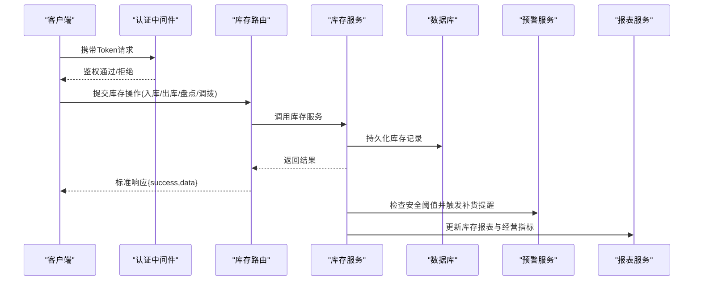

图表来源
- [backend/modules/common/routes/authRoutes.js:514-583](file://backend/modules/common/routes/authRoutes.js#L514-L583)
- [backend/modules/admin/services/adminService.js:1684-1718](file://backend/modules/admin/services/adminService.js#L1684-L1718)

## 详细组件分析

### 认证与权限控制
- 员工登录接口返回权限集合，其中 canManageInventory 表示是否具备库存管理权限
- 受保护接口需携带有效Token，并通过 requireRoles 进行角色校验

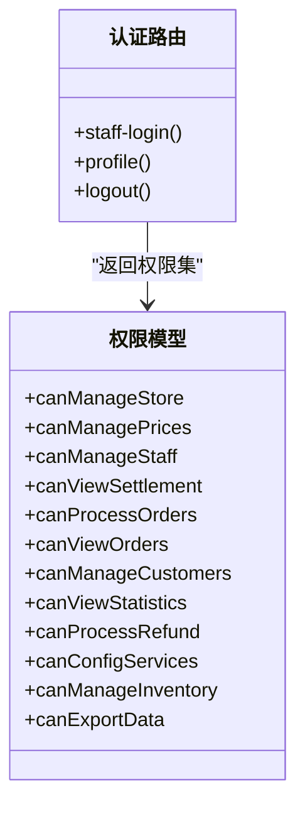

图表来源
- [backend/modules/common/routes/authRoutes.js:330-379](file://backend/modules/common/routes/authRoutes.js#L330-L379)

章节来源
- [backend/modules/common/routes/authRoutes.js:267-379](file://backend/modules/common/routes/authRoutes.js#L267-L379)
- [backend/modules/common/routes/authRoutes.js:514-583](file://backend/modules/common/routes/authRoutes.js#L514-L583)

### 品类与价格基础
- 品类列表与详情接口用于选择库存分类
- 价格模板与批量设置接口支持门店级定价策略，为库存成本核算提供依据

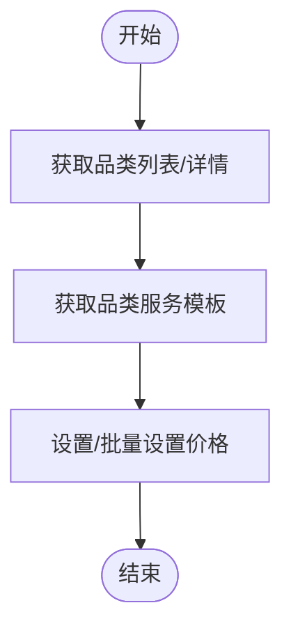

图表来源
- [backend/modules/common/routes/categoryRoutes.js:10-56](file://backend/modules/common/routes/categoryRoutes.js#L10-L56)
- [backend/modules/admin/routes/priceRoutes.js:14-76](file://backend/modules/admin/routes/priceRoutes.js#L14-L76)

章节来源
- [backend/modules/common/routes/categoryRoutes.js:10-56](file://backend/modules/common/routes/categoryRoutes.js#L10-L56)
- [backend/modules/admin/routes/priceRoutes.js:14-76](file://backend/modules/admin/routes/priceRoutes.js#L14-L76)

### 门店维度操作
- 门店员工与门店信息接口用于限定库存操作的门店范围
- 结合权限 canManageInventory 实现按门店隔离的库存管理

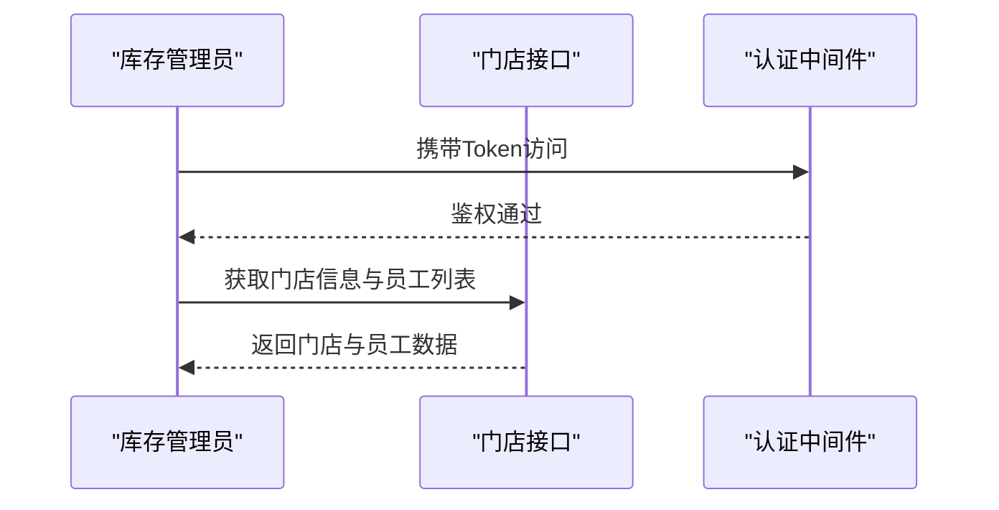

图表来源
- [backend/modules/cleaning/routes/storeRoutes.js:168-191](file://backend/modules/cleaning/routes/storeRoutes.js#L168-L191)

章节来源
- [backend/modules/cleaning/routes/storeRoutes.js:168-191](file://backend/modules/cleaning/routes/storeRoutes.js#L168-L191)

### 库存查询与筛选
- 支持按商品类别、门店、库存状态筛选
- 典型查询字段：categoryId、storeId、status、keyword、page、pageSize
- 响应格式：{ success, data: { items, total, page, pageSize } }

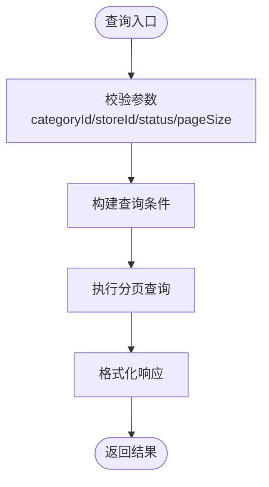

[本节为通用设计说明，不直接分析具体文件]

### 入库与出库
- 入库类型：采购入库、退货入库、盘盈入库
- 出库类型：销售出库、损耗出库、盘亏出库、调拨出库
- 数量验证：必须为正整数；出库时校验可用库存充足；批次号可选用于追溯
- 响应格式：{ success, data: { transactionId, stockSnapshot, message } }

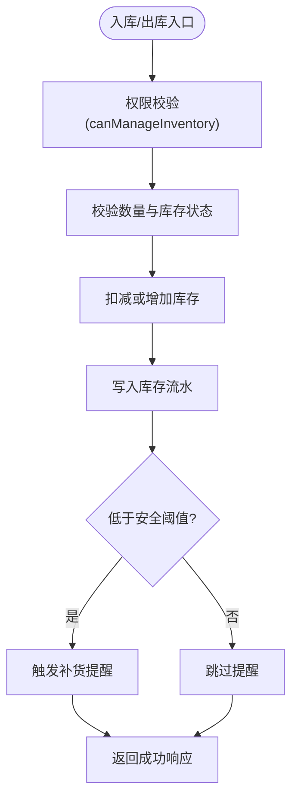

[本节为通用设计说明，不直接分析具体文件]

### 盘点与差异处理
- 盘点类型：全盘、抽盘、循环盘点
- 差异处理：盘盈/盘亏自动生成对应出入库流水，并记录原因与责任人
- 响应格式：{ success, data: { countId, diffSummary, adjustments } }

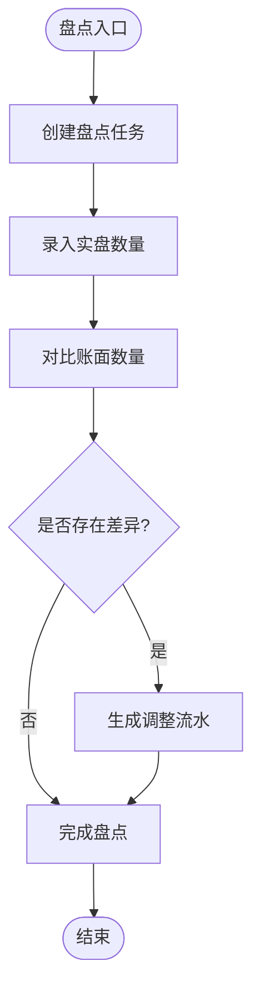

[本节为通用设计说明，不直接分析具体文件]

### 调拨与多仓库共享
- 调拨类型：门店间调拨、仓库间调拨
- 共享机制：总部仓与门店仓共享库存池，调拨后同步更新源仓与目标仓
- 响应格式：{ success, data: { transferId, sourceStock, targetStock } }

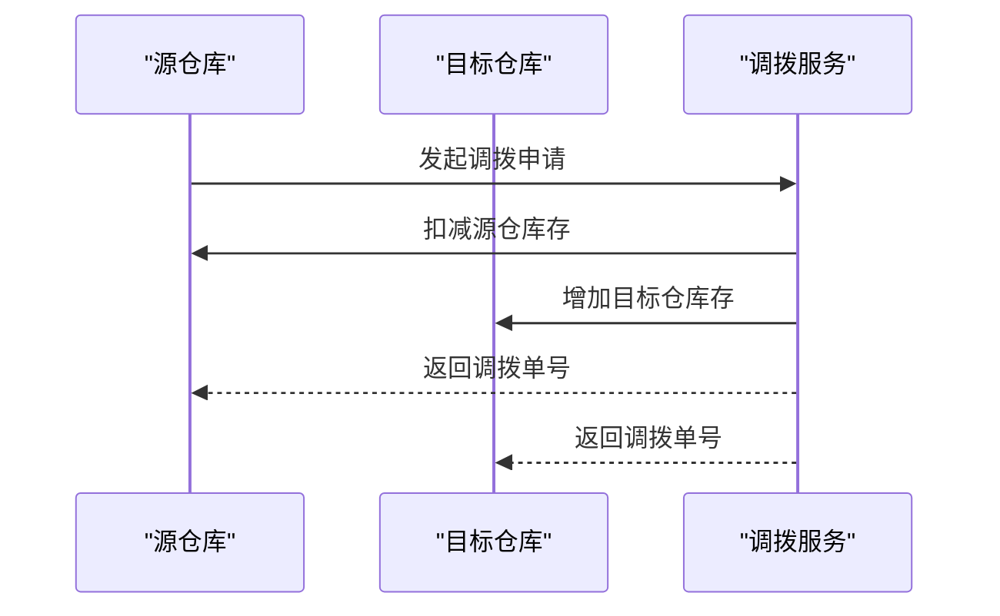

[本节为通用设计说明，不直接分析具体文件]

### 库存预警与补货提醒
- 预警规则：当库存低于安全阈值时自动触发补货提醒
- 通知渠道：站内消息、短信、企业微信（可扩展）
- 响应格式：{ success, data: { alertId, threshold, currentStock, suggestedOrderQty } }

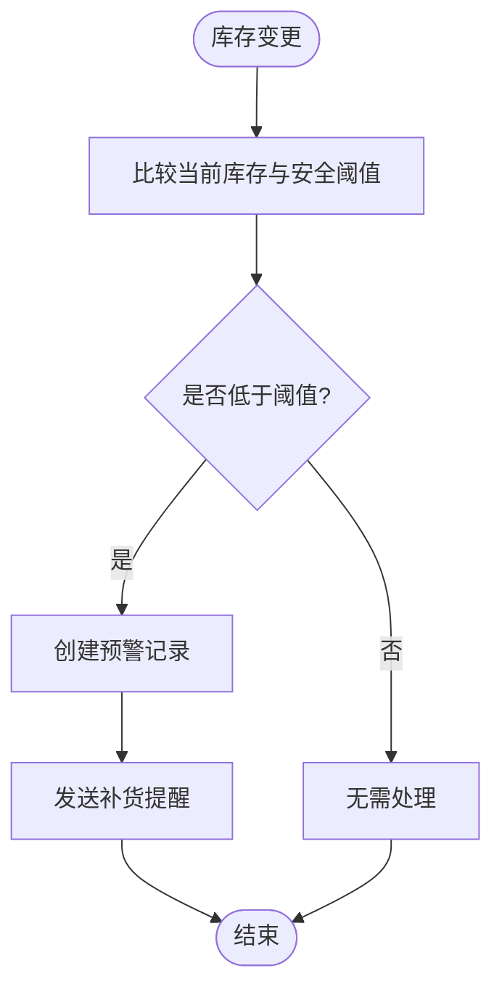

[本节为通用设计说明，不直接分析具体文件]

### 库存流水与审计追踪
- 流水字段：transactionId、type、itemId、warehouseId、quantity、beforeStock、afterStock、operator、reason、createdAt
- 审计追踪：支持按时间范围、操作人、类型、门店、品类筛选
- 响应格式：{ success, data: { logs, total } }

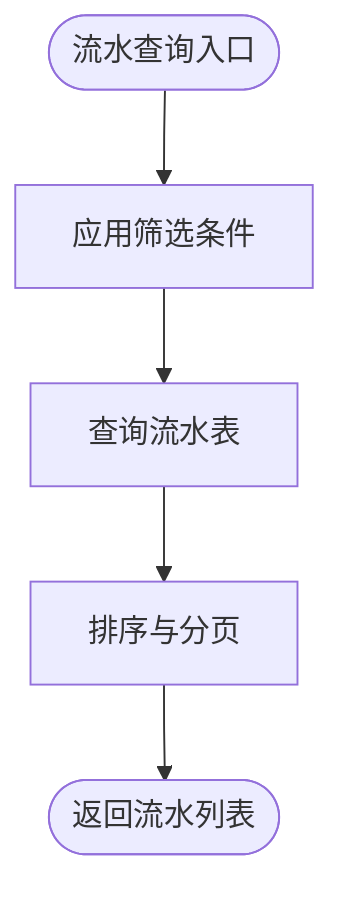

[本节为通用设计说明，不直接分析具体文件]

### 批量导入与导出
- 导入：支持Excel批量入库/出库/盘点导入，提供模板下载与错误报告
- 导出：导出库存快照、流水明细、盘点报告
- 响应格式：{ success, data: { jobId, status, downloadUrl } }

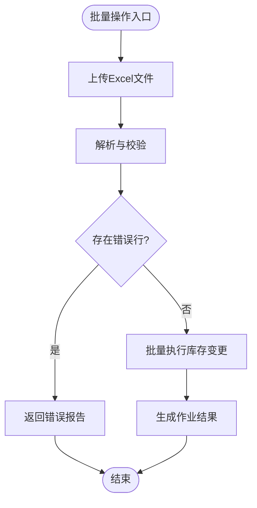

[本节为通用设计说明，不直接分析具体文件]

### 库存报表与经营指标
- 报表类型：销售统计、库存周转率、滞销与畅销排行、门店库存健康度
- 指标计算：基于订单与库存流水聚合，支持按门店、品类、时间范围筛选
- 响应格式：{ success, data: { metrics, charts, summary } }

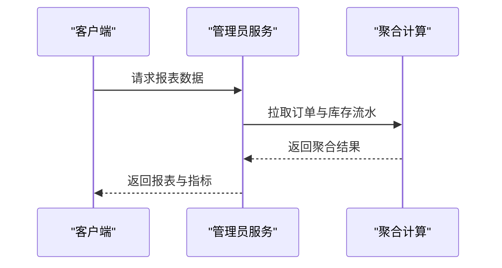

图表来源
- [backend/modules/admin/services/adminService.js:1684-1718](file://backend/modules/admin/services/adminService.js#L1684-L1718)

章节来源
- [backend/modules/admin/services/adminService.js:1684-1718](file://backend/modules/admin/services/adminService.js#L1684-L1718)

## 依赖分析
- 认证与权限
  - 库存管理权限由 canManageInventory 控制，登录接口返回该标志位
  - 受保护接口使用认证中间件与角色守卫进行访问控制
- 品类与价格
  - 品类与服务模板接口为库存分类与计价提供基础数据
- 门店与订单
  - 门店接口用于限定库存操作的门店范围
- 管理员服务
  - 统计聚合能力用于库存报表与经营指标计算

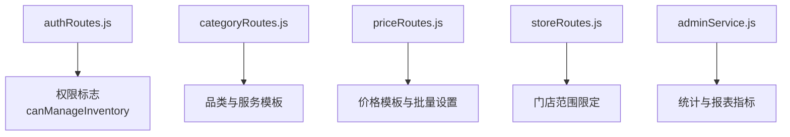

图表来源
- [backend/modules/common/routes/authRoutes.js:330-379](file://backend/modules/common/routes/authRoutes.js#L330-L379)
- [backend/modules/common/routes/categoryRoutes.js:10-56](file://backend/modules/common/routes/categoryRoutes.js#L10-L56)
- [backend/modules/admin/routes/priceRoutes.js:14-76](file://backend/modules/admin/routes/priceRoutes.js#L14-L76)
- [backend/modules/cleaning/routes/storeRoutes.js:168-191](file://backend/modules/cleaning/routes/storeRoutes.js#L168-L191)
- [backend/modules/admin/services/adminService.js:1684-1718](file://backend/modules/admin/services/adminService.js#L1684-L1718)

章节来源
- [backend/modules/common/routes/authRoutes.js:330-379](file://backend/modules/common/routes/authRoutes.js#L330-L379)
- [backend/modules/common/routes/categoryRoutes.js:10-56](file://backend/modules/common/routes/categoryRoutes.js#L10-L56)
- [backend/modules/admin/routes/priceRoutes.js:14-76](file://backend/modules/admin/routes/priceRoutes.js#L14-L76)
- [backend/modules/cleaning/routes/storeRoutes.js:168-191](file://backend/modules/cleaning/routes/storeRoutes.js#L168-L191)
- [backend/modules/admin/services/adminService.js:1684-1718](file://backend/modules/admin/services/adminService.js#L1684-L1718)

## 性能考虑
- 分页与索引：库存查询与流水查询应启用分页，并对常用筛选字段建立索引
- 批量操作：大批量导入导出采用异步作业模式，避免阻塞主线程
- 缓存策略：对品类、价格模板等低频变更数据进行缓存，降低数据库压力
- 事务一致性：库存变更与流水写入应在同一事务中保证一致性
- 预警批处理：预警检查可采用定时任务批量扫描，减少实时计算开销

[本节为通用指导，不直接分析具体文件]

## 故障排查指南
- 权限问题
  - 确认登录接口返回的 canManageInventory 是否为 true
  - 检查受保护接口的认证中间件是否生效
- 参数校验失败
  - 核对必填字段与数据类型，确保数量为正整数
  - 检查门店ID、品类ID的有效性
- 库存不足
  - 出库前校验可用库存，必要时提示先入库或调整计划
- 预警未触发
  - 检查安全阈值配置与库存变更事件是否正确上报
- 报表数据异常
  - 核对订单与库存流水的时间范围与过滤条件
  - 检查聚合计算逻辑与数据完整性

章节来源
- [backend/modules/common/routes/authRoutes.js:330-379](file://backend/modules/common/routes/authRoutes.js#L330-L379)
- [backend/modules/admin/services/adminService.js:1684-1718](file://backend/modules/admin/services/adminService.js#L1684-L1718)

## 结论
本库存管理接口体系以认证授权为核心，结合品类与价格基础数据、门店维度操作与管理员统计能力，形成完整的库存生命周期管理闭环。通过标准化响应格式、严格的参数校验与完善的审计追踪，能够满足干洗店日常库存运营的高效与合规需求。

## 附录
- 通用响应格式
  - 成功：{ success: true, data: {...}, message?: string }
  - 失败：{ success: false, error: string, message?: string }
- 常见HTTP状态码
  - 200：成功
  - 400：参数错误或业务校验失败
  - 401：未认证或权限不足
  - 404：资源不存在
  - 500：服务器内部错误
- 集成建议
  - 所有库存相关接口均需携带有效Token
  - 建议在客户端侧对 canManageInventory 进行UI级控制
  - 批量导入导出建议使用异步作业与轮询状态

[本节为通用规范说明，不直接分析具体文件]