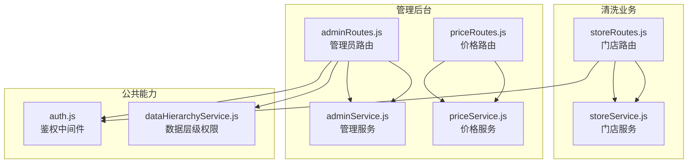
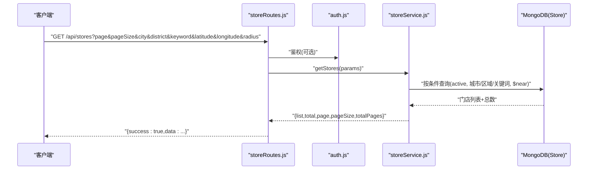
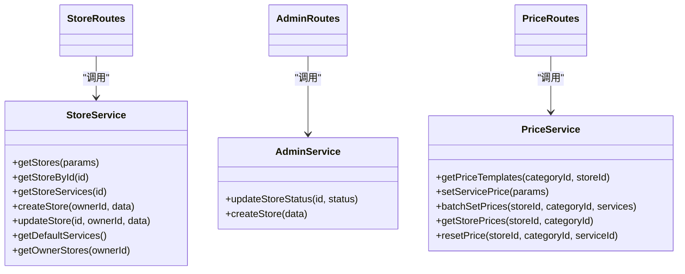
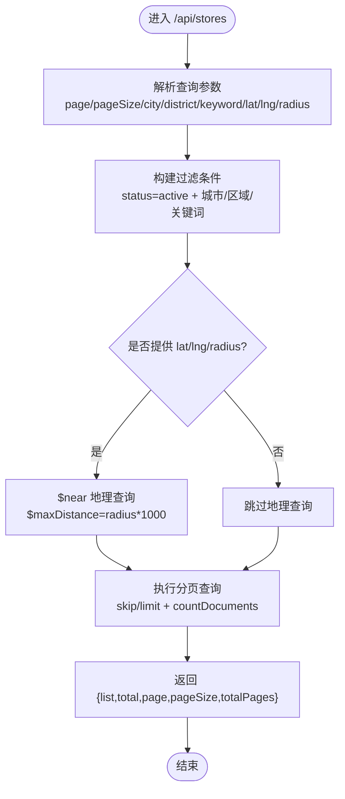

# 门店基本信息管理接口

<cite>
**本文引用的文件**
- [backend/modules/cleaning/routes/storeRoutes.js](file://backend/modules/cleaning/routes/storeRoutes.js)
- [backend/modules/cleaning/services/storeService.js](file://backend/modules/cleaning/services/storeService.js)
- [backend/modules/admin/routes/adminRoutes.js](file://backend/modules/admin/routes/adminRoutes.js)
- [backend/modules/admin/services/adminService.js](file://backend/modules/admin/services/adminService.js)
- [backend/modules/admin/routes/priceRoutes.js](file://backend/modules/admin/routes/priceRoutes.js)
- [backend/modules/admin/services/priceService.js](file://backend/modules/admin/services/priceService.js)
- [backend/modules/common/middlewares/auth.js](file://backend/modules/common/middlewares/auth.js)
- [backend/modules/common/services/dataHierarchyService.js](file://backend/modules/common/services/dataHierarchyService.js)
</cite>

## 目录
1. [简介](#简介)
2. [项目结构](#项目结构)
3. [核心组件](#核心组件)
4. [架构总览](#架构总览)
5. [详细组件分析](#详细组件分析)
6. [依赖关系分析](#依赖关系分析)
7. [性能考虑](#性能考虑)
8. [故障排查指南](#故障排查指南)
9. [结论](#结论)
10. [附录：接口清单与规范](#附录接口清单与规范)

## 简介
本文件为干洗店“门店基本信息管理”的完整API文档，覆盖门店创建、查询、更新、删除（以状态控制为主）、服务配置、地理位置搜索、图片上传与管理、以及数据隔离与权限控制等。文档面向开发者与产品人员，提供清晰的HTTP方法、URL模式、参数校验规则、响应格式与错误码说明，并给出关键流程的时序图与流程图，帮助快速集成与排障。

## 项目结构
与门店信息管理相关的后端模块主要位于 backend/modules/cleaning 与 backend/modules/admin 下：
- cleaning 模块：对外暴露门店基础信息与服务配置的公开与认证接口
- admin 模块：管理员对门店的集中管理与批量导入、状态管控
- price 模块：门店价格模板与自定义价格设置
- common 中间件：鉴权与数据层级权限控制

图表来源
- [backend/modules/cleaning/routes/storeRoutes.js:1-194](file://backend/modules/cleaning/routes/storeRoutes.js#L1-L194)
- [backend/modules/cleaning/services/storeService.js:1-376](file://backend/modules/cleaning/services/storeService.js#L1-L376)
- [backend/modules/admin/routes/adminRoutes.js:1-800](file://backend/modules/admin/routes/adminRoutes.js#L1-L800)
- [backend/modules/admin/services/adminService.js:478-520](file://backend/modules/admin/services/adminService.js#L478-L520)
- [backend/modules/admin/routes/priceRoutes.js:1-78](file://backend/modules/admin/routes/priceRoutes.js#L1-L78)
- [backend/modules/admin/services/priceService.js:1-80](file://backend/modules/admin/services/priceService.js#L1-L80)
- [backend/modules/common/middlewares/auth.js](file://backend/modules/common/middlewares/auth.js)
- [backend/modules/common/services/dataHierarchyService.js:1-130](file://backend/modules/common/services/dataHierarchyService.js#L1-L130)

章节来源
- [backend/modules/cleaning/routes/storeRoutes.js:1-194](file://backend/modules/cleaning/routes/storeRoutes.js#L1-L194)
- [backend/modules/cleaning/services/storeService.js:1-376](file://backend/modules/cleaning/services/storeService.js#L1-L376)
- [backend/modules/admin/routes/adminRoutes.js:1-800](file://backend/modules/admin/routes/adminRoutes.js#L1-L800)
- [backend/modules/admin/services/adminService.js:478-520](file://backend/modules/admin/services/adminService.js#L478-L520)
- [backend/modules/admin/routes/priceRoutes.js:1-78](file://backend/modules/admin/routes/priceRoutes.js#L1-L78)
- [backend/modules/admin/services/priceService.js:1-80](file://backend/modules/admin/services/priceService.js#L1-L80)
- [backend/modules/common/services/dataHierarchyService.js:1-130](file://backend/modules/common/services/dataHierarchyService.js#L1-L130)

## 核心组件
- 门店路由层（storeRoutes）：定义门店CRUD、员工管理、服务列表等REST端点，统一返回 { success, data } 或 { success, error } 结构
- 门店服务层（storeService）：实现门店模型、地理索引、分页、筛选、默认服务初始化、员工绑定与角色管理等业务逻辑
- 管理员路由层（adminRoutes）：提供系统级门店管理（创建、导入、详情、状态更新）
- 价格服务（priceRoutes/priceService）：提供品类服务模板与门店自定义价格设置、批量设置、重置默认等
- 鉴权与数据层级（auth.js / dataHierarchyService.js）：基于角色的访问控制与连锁/门店维度数据边界

章节来源
- [backend/modules/cleaning/routes/storeRoutes.js:1-194](file://backend/modules/cleaning/routes/storeRoutes.js#L1-L194)
- [backend/modules/cleaning/services/storeService.js:1-376](file://backend/modules/cleaning/services/storeService.js#L1-L376)
- [backend/modules/admin/routes/adminRoutes.js:1-800](file://backend/modules/admin/routes/adminRoutes.js#L1-L800)
- [backend/modules/admin/routes/priceRoutes.js:1-78](file://backend/modules/admin/routes/priceRoutes.js#L1-L78)
- [backend/modules/admin/services/priceService.js:1-80](file://backend/modules/admin/services/priceService.js#L1-L80)
- [backend/modules/common/services/dataHierarchyService.js:1-130](file://backend/modules/common/services/dataHierarchyService.js#L1-L130)

## 架构总览
下图展示从客户端到数据库的关键调用路径与权限控制点。

图表来源
- [backend/modules/cleaning/routes/storeRoutes.js:18-30](file://backend/modules/cleaning/routes/storeRoutes.js#L18-L30)
- [backend/modules/cleaning/services/storeService.js:55-94](file://backend/modules/cleaning/services/storeService.js#L55-L94)

## 详细组件分析

### 门店基础信息管理接口
- 获取门店列表（支持分页、城市/区域/关键词、地理位置搜索）
  - 方法/路径：GET /api/stores
  - 查询参数
    - page: 页码，整数，默认1
    - pageSize: 每页条数，整数，默认20
    - city: 字符串，模糊匹配
    - district: 字符串，精确匹配
    - keyword: 字符串，名称/地址模糊匹配
    - latitude: 纬度，数值
    - longitude: 经度，数值
    - radius: 半径，单位km，数值
  - 行为说明
    - 仅返回 status=active 的门店
    - 当同时提供 latitude、longitude、radius 时，使用 MongoDB 2dsphere 的 $near 进行距离排序
  - 成功响应
    - { success: true, data: { list, total, page, pageSize, totalPages } }
  - 失败响应
    - { success: false, error: "错误信息" }，HTTP 400
  - 参考实现
    - [storeRoutes.js:18-30](file://backend/modules/cleaning/routes/storeRoutes.js#L18-L30)
    - [storeService.js:55-94](file://backend/modules/cleaning/services/storeService.js#L55-L94)

- 获取门店详情
  - 方法/路径：GET /api/stores/:id
  - 路径参数
    - id: 门店ID
  - 成功响应
    - { success: true, data: 门店对象 }
  - 失败响应
    - 不存在：{ success: false, error: "门店不存在" }，HTTP 404
  - 参考实现
    - [storeRoutes.js:36-43](file://backend/modules/cleaning/routes/storeRoutes.js#L36-L43)
    - [storeService.js:99-106](file://backend/modules/cleaning/services/storeService.js#L99-L106)

- 创建门店（需认证，角色：admin 或 store_owner）
  - 方法/路径：POST /api/stores
  - 请求体字段（示例）
    - name: 必填
    - address: 必填
    - phone: 必填
    - city/district/location/businessHours/images/description: 可选
  - 成功响应
    - { success: true, data: 新门店对象 }
  - 失败响应
    - 参数错误或业务校验失败：{ success: false, error: "错误信息" }，HTTP 400
  - 参考实现
    - [storeRoutes.js:66-73](file://backend/modules/cleaning/routes/storeRoutes.js#L66-L73)
    - [storeService.js:125-144](file://backend/modules/cleaning/services/storeService.js#L125-L144)

- 更新门店信息（需认证，角色：admin 或 store_owner；仅限所有者或管理员）
  - 方法/路径：PUT /api/stores/:id
  - 路径参数
    - id: 门店ID
  - 请求体：可更新的字段集合（如 name/address/phone/businessHours/images/description 等）
  - 成功响应
    - { success: true, data: 更新后的门店对象 }
  - 失败响应
    - 无权修改或不存在：{ success: false, error: "门店不存在或无权修改" }，HTTP 400
  - 参考实现
    - [storeRoutes.js:79-86](file://backend/modules/cleaning/routes/storeRoutes.js#L79-L86)
    - [storeService.js:149-157](file://backend/modules/cleaning/services/storeService.js#L149-L157)

- 获取我的门店列表（需认证，角色：admin 或 store_owner）
  - 方法/路径：GET /api/stores/owner/my
  - 成功响应
    - { success: true, data: 门店数组 }
  - 失败响应
    - { success: false, error: "错误信息" }，HTTP 400
  - 参考实现
    - [storeRoutes.js:92-99](file://backend/modules/cleaning/routes/storeRoutes.js#L92-L99)
    - [storeService.js:369-372](file://backend/modules/cleaning/services/storeService.js#L369-L372)

- 删除门店
  - 说明：当前未提供直接删除接口。建议通过“状态管理”将门店置为 inactive/suspended，以实现软删除效果。
  - 参考：门店状态枚举与默认值见 Store 模型定义
    - [storeService.js:30](file://backend/modules/cleaning/services/storeService.js#L30)

章节来源
- [backend/modules/cleaning/routes/storeRoutes.js:18-99](file://backend/modules/cleaning/routes/storeRoutes.js#L18-L99)
- [backend/modules/cleaning/services/storeService.js:55-157](file://backend/modules/cleaning/services/storeService.js#L55-L157)

### 门店服务配置接口
- 获取门店服务列表（仅返回启用服务）
  - 方法/路径：GET /api/stores/:id/services
  - 成功响应
    - { success: true, data: { storeId, storeName, services: [...] } }
  - 失败响应
    - 不存在：{ success: false, error: "门店不存在" }，HTTP 400
  - 参考实现
    - [storeRoutes.js:49-56](file://backend/modules/cleaning/routes/storeRoutes.js#L49-L56)
    - [storeService.js:111-120](file://backend/modules/cleaning/services/storeService.js#L111-L120)

- 门店价格模板与自定义价格
  - 获取品类服务模板（含门店自定义价格）
    - 方法/路径：GET /api/price/templates/:categoryId?storeId=...
    - 成功响应
      - { success: true, data: 模板数组（包含 defaultPrice/customPrice 等）}
    - 失败响应
      - { success: false, error: "错误信息" }，HTTP 500
    - 参考实现
      - [priceRoutes.js:14-23](file://backend/modules/admin/routes/priceRoutes.js#L14-L23)
      - [priceService.js:37-64](file://backend/modules/admin/services/priceService.js#L37-L64)
  - 设置单条服务价格
    - 方法/路径：PUT /api/price/set
    - 请求体
      - storeId, categoryId, serviceId, price（必填）
      - deposit, unit（可选）
    - 成功响应
      - { success: true, data: 结果 }
    - 失败响应
      - 参数缺失：{ success: false, error: "缺少必要参数" }，HTTP 400
    - 参考实现
      - [priceRoutes.js:26-39](file://backend/modules/admin/routes/priceRoutes.js#L26-L39)
      - [priceService.js:69-80](file://backend/modules/admin/services/priceService.js#L69-L80)
  - 批量设置某品类下所有服务价格
    - 方法/路径：PUT /api/price/batch
    - 请求体
      - storeId, categoryId, services: [{ serviceId, price, deposit?, unit? }]
    - 成功响应
      - { success: true, data: 结果 }
    - 失败响应
      - 参数缺失：{ success: false, error: "缺少必要参数" }，HTTP 400
    - 参考实现
      - [priceRoutes.js:42-53](file://backend/modules/admin/routes/priceRoutes.js#L42-L53)
  - 获取门店已设价格
    - 方法/路径：GET /api/price/store/:storeId?categoryId=...
    - 成功响应
      - { success: true, data: 价格映射 }
    - 失败响应
      - { success: false, error: "错误信息" }，HTTP 500
    - 参考实现
      - [priceRoutes.js:56-65](file://backend/modules/admin/routes/priceRoutes.js#L56-L65)
  - 恢复默认价格
    - 方法/路径：DELETE /api/price/reset
    - 请求体
      - storeId, categoryId, serviceId
    - 成功响应
      - { success: true, message: "已恢复默认价格" }
    - 失败响应
      - { success: false, error: "错误信息" }，HTTP 500
    - 参考实现
      - [priceRoutes.js:68-76](file://backend/modules/admin/routes/priceRoutes.js#L68-L76)

章节来源
- [backend/modules/cleaning/routes/storeRoutes.js:49-56](file://backend/modules/cleaning/routes/storeRoutes.js#L49-L56)
- [backend/modules/cleaning/services/storeService.js:111-120](file://backend/modules/cleaning/services/storeService.js#L111-L120)
- [backend/modules/admin/routes/priceRoutes.js:14-76](file://backend/modules/admin/routes/priceRoutes.js#L14-L76)
- [backend/modules/admin/services/priceService.js:37-80](file://backend/modules/admin/services/priceService.js#L37-L80)

### 门店状态管理接口
- 管理员更新门店状态
  - 方法/路径：PUT /api/admin/stores/:id/status
  - 请求体
    - status: 目标状态（例如 active/inactive/suspended）
  - 成功响应
    - { success: true, data: 更新后的门店对象 }
  - 失败响应
    - 不存在：{ success: false, error: "门店不存在" }，HTTP 400
    - 其他异常：{ success: false, error: "server_error", message: "..." }，HTTP 500
  - 参考实现
    - [adminRoutes.js:118-131](file://backend/modules/admin/routes/adminRoutes.js#L118-L131)
    - [adminService.js:478-492](file://backend/modules/admin/services/adminService.js#L478-L492)

- 连锁后台更新门店状态（带连锁数据边界校验）
  - 方法/路径：PUT /api/chain-admin/stores/:id/status
  - 成功响应
    - { success: true, message: "门店状态更新成功", data: { storeId, status } }
  - 失败响应
    - 不存在：{ success: false, error: "store_not_found", message: "门店不存在" }，HTTP 404
    - 越权：{ success: false, error: "permission_denied", message: "无权访问该门店" }，HTTP 403
    - 服务器错误：{ success: false, error: "server_error", message: "更新门店状态失败" }，HTTP 500
  - 参考实现
    - [chainAdminRoutes.js:1022-1059](file://backend/modules/admin/routes/chainAdminRoutes.js#L1022-L1059)

章节来源
- [backend/modules/admin/routes/adminRoutes.js:118-131](file://backend/modules/admin/routes/adminRoutes.js#L118-L131)
- [backend/modules/admin/services/adminService.js:478-492](file://backend/modules/admin/services/adminService.js#L478-L492)
- [backend/modules/admin/routes/chainAdminRoutes.js:1022-1059](file://backend/modules/admin/routes/chainAdminRoutes.js#L1022-L1059)

### 门店图片上传与管理
- 现状说明
  - 门店模型包含 images 字段（字符串数组），用于存储图片URL
  - 当前代码库未发现专门的图片上传接口实现
- 建议方案
  - 新增上传接口：POST /api/stores/:id/images
    - 请求体：{ urls: ["url1","url2"] } 或分片上传后合并
    - 鉴权：需要 store_owner 或 admin
    - 返回：{ success: true, data: { images: [...] } }
  - 替换/追加/删除图片
    - PUT /api/stores/:id/images/replace
    - POST /api/stores/:id/images/append
    - DELETE /api/stores/:id/images/remove
  - 安全与合规
    - 限制文件大小与类型
    - 生成签名临时链接
    - 清理孤儿文件
- 参考字段
  - Store.images: [String]
    - [storeService.js:31](file://backend/modules/cleaning/services/storeService.js#L31)

章节来源
- [backend/modules/cleaning/services/storeService.js:31](file://backend/modules/cleaning/services/storeService.js#L31)

### 数据隔离与权限控制
- 角色与范围
  - admin：全局访问
  - chain_admin：仅能访问其连锁下的门店数据
  - store_owner/store_staff：仅能访问其门店数据
- 实现方式
  - 鉴权中间件：authMiddleware + requireRoles
  - 数据层级中间件：createDataHierarchyMiddleware 自动注入 req.dataAccessScope
- 典型场景
  - 连锁后台在查询订单/用户/门店时，强制限定 chainId 或 storeIds
  - 门店员工操作必须携带 storeId 上下文
- 参考实现
  - [auth.js](file://backend/modules/common/middlewares/auth.js)
  - [dataHierarchyService.js:15-92](file://backend/modules/common/services/dataHierarchyService.js#L15-L92)
  - [chainAdminRoutes.js:295-399](file://backend/modules/admin/routes/chainAdminRoutes.js#L295-L399)

章节来源
- [backend/modules/common/middlewares/auth.js](file://backend/modules/common/middlewares/auth.js)
- [backend/modules/common/services/dataHierarchyService.js:15-92](file://backend/modules/common/services/dataHierarchyService.js#L15-L92)
- [backend/modules/admin/routes/chainAdminRoutes.js:295-399](file://backend/modules/admin/routes/chainAdminRoutes.js#L295-L399)

## 依赖关系分析
- 路由层依赖服务层：storeRoutes -> storeService；adminRoutes -> adminService；priceRoutes -> priceService
- 服务层依赖数据库模型：Store、StorePrice 等
- 鉴权与权限贯穿各路由：authMiddleware、requireRoles、createDataHierarchyMiddleware

图表来源
- [backend/modules/cleaning/services/storeService.js:51-376](file://backend/modules/cleaning/services/storeService.js#L51-L376)
- [backend/modules/admin/services/priceService.js:1-80](file://backend/modules/admin/services/priceService.js#L1-L80)
- [backend/modules/admin/services/adminService.js:478-520](file://backend/modules/admin/services/adminService.js#L478-L520)
- [backend/modules/cleaning/routes/storeRoutes.js:1-194](file://backend/modules/cleaning/routes/storeRoutes.js#L1-L194)
- [backend/modules/admin/routes/adminRoutes.js:1-800](file://backend/modules/admin/routes/adminRoutes.js#L1-L800)
- [backend/modules/admin/routes/priceRoutes.js:1-78](file://backend/modules/admin/routes/priceRoutes.js#L1-L78)

## 性能考虑
- 地理位置查询
  - 使用 2dsphere 索引与 $near，建议在 location 字段上建立索引（已在模型中声明）
  - 合理设置 radius，避免过大范围导致全表扫描
- 分页与投影
  - 列表接口采用 skip/limit 分页，注意大数据量时的偏移成本
  - 使用 lean() 减少对象开销
- 并发聚合
  - 统计类接口使用 Promise.all 并行查询，降低RT
- 缓存建议
  - 门店列表与价格模板可引入短期缓存（Redis）以提升热点读取性能

[本节为通用指导，无需源码引用]

## 故障排查指南
- 常见错误码
  - 400：参数校验失败或业务校验失败（如“请提供手机号”、“无效的角色类型”）
  - 403：权限不足或越权访问（如“无权访问该门店”）
  - 404：资源不存在（如“门店不存在”）
  - 500：服务端异常（如“获取仪表盘数据失败”）
- 定位步骤
  - 检查鉴权是否通过（Token、角色）
  - 确认数据边界（chainId/storeId）是否正确
  - 查看日志中的错误堆栈与消息
- 参考位置
  - 错误处理与返回结构在各路由 try/catch 块中
    - [storeRoutes.js:27-29](file://backend/modules/cleaning/routes/storeRoutes.js#L27-L29)
    - [adminRoutes.js:123-131](file://backend/modules/admin/routes/adminRoutes.js#L123-L131)
    - [chainAdminRoutes.js:1049-1056](file://backend/modules/admin/routes/chainAdminRoutes.js#L1049-L1056)

章节来源
- [backend/modules/cleaning/routes/storeRoutes.js:27-29](file://backend/modules/cleaning/routes/storeRoutes.js#L27-L29)
- [backend/modules/admin/routes/adminRoutes.js:123-131](file://backend/modules/admin/routes/adminRoutes.js#L123-L131)
- [backend/modules/admin/routes/chainAdminRoutes.js:1049-1056](file://backend/modules/admin/routes/chainAdminRoutes.js#L1049-L1056)

## 结论
本接口体系围绕门店基本信息、服务与价格配置、状态管理展开，结合鉴权与数据层级权限，确保多租户与连锁场景下的数据安全与隔离。建议后续补充图片上传与管理接口，并对高频查询引入缓存策略，进一步提升整体性能与用户体验。

[本节为总结性内容，无需源码引用]

## 附录：接口清单与规范

### 通用响应格式
- 成功
  - { success: true, data: ... }
- 失败
  - { success: false, error: "错误码/信息", message?: "描述" }

### 接口清单
- GET /api/stores
  - 功能：获取门店列表（支持分页、城市/区域/关键词、地理位置）
  - 鉴权：否
  - 参考：[storeRoutes.js:18-30](file://backend/modules/cleaning/routes/storeRoutes.js#L18-L30)
- GET /api/stores/:id
  - 功能：获取门店详情
  - 鉴权：否
  - 参考：[storeRoutes.js:36-43](file://backend/modules/cleaning/routes/storeRoutes.js#L36-L43)
- POST /api/stores
  - 功能：创建门店
  - 鉴权：是（admin/store_owner）
  - 参考：[storeRoutes.js:66-73](file://backend/modules/cleaning/routes/storeRoutes.js#L66-L73)
- PUT /api/stores/:id
  - 功能：更新门店信息
  - 鉴权：是（admin/store_owner）
  - 参考：[storeRoutes.js:79-86](file://backend/modules/cleaning/routes/storeRoutes.js#L79-L86)
- GET /api/stores/owner/my
  - 功能：获取我的门店列表
  - 鉴权：是（admin/store_owner）
  - 参考：[storeRoutes.js:92-99](file://backend/modules/cleaning/routes/storeRoutes.js#L92-L99)
- GET /api/stores/:id/services
  - 功能：获取门店服务列表（仅启用）
  - 鉴权：否
  - 参考：[storeRoutes.js:49-56](file://backend/modules/cleaning/routes/storeRoutes.js#L49-L56)
- PUT /api/admin/stores/:id/status
  - 功能：管理员更新门店状态
  - 鉴权：是（admin）
  - 参考：[adminRoutes.js:118-131](file://backend/modules/admin/routes/adminRoutes.js#L118-L131)
- PUT /api/chain-admin/stores/:id/status
  - 功能：连锁后台更新门店状态（带链属校验）
  - 鉴权：是（chain_admin）
  - 参考：[chainAdminRoutes.js:1022-1059](file://backend/modules/admin/routes/chainAdminRoutes.js#L1022-L1059)
- GET /api/price/templates/:categoryId?storeId=...
  - 功能：获取品类服务模板（含门店自定义价格）
  - 鉴权：视部署策略而定
  - 参考：[priceRoutes.js:14-23](file://backend/modules/admin/routes/priceRoutes.js#L14-L23)
- PUT /api/price/set
  - 功能：设置单条服务价格
  - 鉴权：视部署策略而定
  - 参考：[priceRoutes.js:26-39](file://backend/modules/admin/routes/priceRoutes.js#L26-L39)
- PUT /api/price/batch
  - 功能：批量设置某品类下所有服务价格
  - 鉴权：视部署策略而定
  - 参考：[priceRoutes.js:42-53](file://backend/modules/admin/routes/priceRoutes.js#L42-L53)
- GET /api/price/store/:storeId?categoryId=...
  - 功能：获取门店已设价格
  - 鉴权：视部署策略而定
  - 参考：[priceRoutes.js:56-65](file://backend/modules/admin/routes/priceRoutes.js#L56-L65)
- DELETE /api/price/reset
  - 功能：恢复默认价格
  - 鉴权：视部署策略而定
  - 参考：[priceRoutes.js:68-76](file://backend/modules/admin/routes/priceRoutes.js#L68-L76)

### 关键流程图：地理位置搜索

图表来源
- [backend/modules/cleaning/services/storeService.js:55-94](file://backend/modules/cleaning/services/storeService.js#L55-L94)