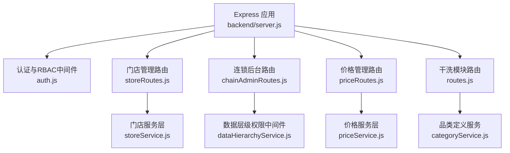
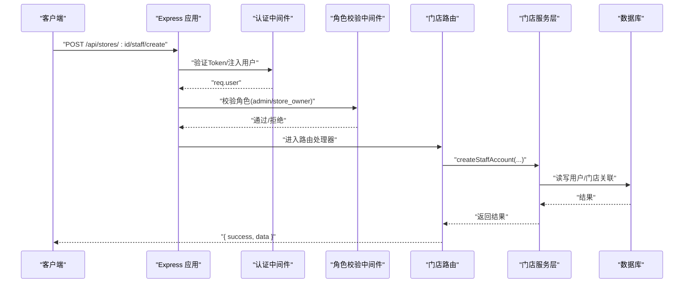
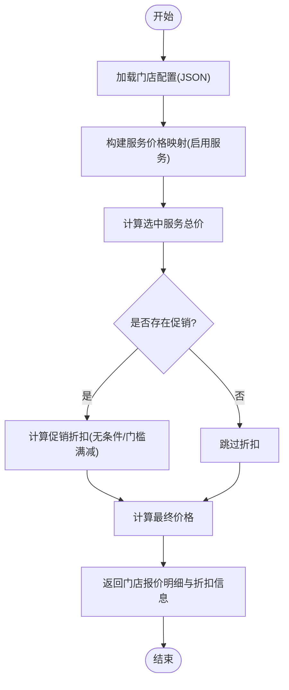
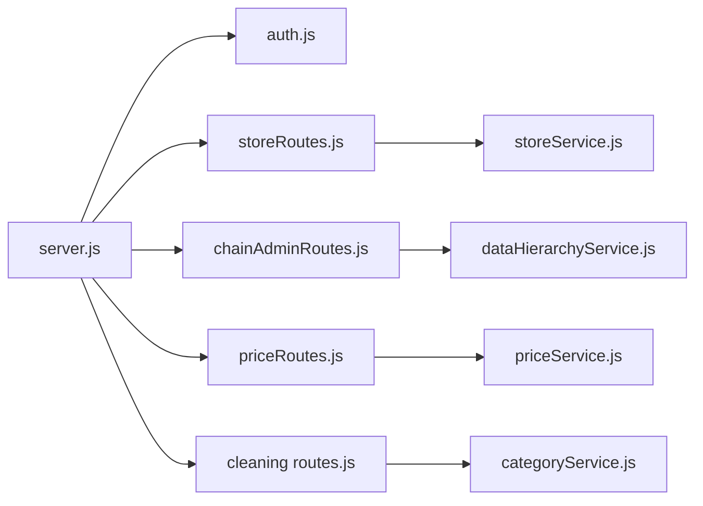

# 门店管理接口

<cite>
**本文引用的文件**   
- [backend/server.js](file://backend/server.js)
- [backend/modules/cleaning/routes/storeRoutes.js](file://backend/modules/cleaning/routes/storeRoutes.js)
- [backend/modules/cleaning/services/storeService.js](file://backend/modules/cleaning/services/storeService.js)
- [backend/modules/common/middlewares/auth.js](file://backend/modules/common/middlewares/auth.js)
- [backend/modules/admin/routes/chainAdminRoutes.js](file://backend/modules/admin/routes/chainAdminRoutes.js)
- [backend/modules/common/services/dataHierarchyService.js](file://backend/modules/common/services/dataHierarchyService.js)
- [backend/modules/admin/routes/priceRoutes.js](file://backend/modules/admin/routes/priceRoutes.js)
- [backend/modules/admin/services/priceService.js](file://backend/modules/admin/services/priceService.js)
- [backend/modules/cleaning/routes.js](file://backend/modules/cleaning/routes.js)
- [backend/modules/common/services/categoryService.js](file://backend/modules/common/services/categoryService.js)
</cite>

## 目录
1. [简介](#简介)
2. [项目结构](#项目结构)
3. [核心组件](#核心组件)
4. [架构总览](#架构总览)
5. [详细组件分析](#详细组件分析)
6. [依赖关系分析](#依赖关系分析)
7. [性能与扩展性](#性能与扩展性)
8. [故障排查指南](#故障排查指南)
9. [结论](#结论)
10. [附录：接口清单与错误码](#附录接口清单与错误码)

## 简介
本文件为干洗店“门店管理系统”的完整API接口文档，覆盖以下能力：
- 门店信息管理：基本信息维护、营业时间设置、服务范围配置、门店列表与详情查询
- 员工权限控制：店长、店员、收银员等角色创建、变更、移除与查看
- 库存与服务定价：服务模板价格获取与设置（按品类/服务维度）
- 促销活动与报价：基于门店配置的促销规则与实时报价计算
- 连锁品牌管理：多门店统一管理与数据隔离（连锁管理员视角）
- 日常运营集成：面向门店操作员的常用接口与调用流程

所有接口均提供HTTP方法、URL模式、请求参数、响应格式与错误码说明，并明确数据隔离机制与权限校验路径。

## 项目结构
后端采用模块化路由+中间件鉴权+服务层实现的分层架构。入口文件集中挂载各模块路由，认证与RBAC通过中间件统一处理；业务逻辑下沉至服务层，数据访问由模型完成。

图表来源
- [backend/server.js](file://backend/server.js)
- [backend/modules/cleaning/routes/storeRoutes.js](file://backend/modules/cleaning/routes/storeRoutes.js)
- [backend/modules/admin/routes/chainAdminRoutes.js](file://backend/modules/admin/routes/chainAdminRoutes.js)
- [backend/modules/admin/routes/priceRoutes.js](file://backend/modules/admin/routes/priceRoutes.js)
- [backend/modules/cleaning/routes.js](file://backend/modules/cleaning/routes.js)
- [backend/modules/common/middlewares/auth.js](file://backend/modules/common/middlewares/auth.js)
- [backend/modules/common/services/dataHierarchyService.js](file://backend/modules/common/services/dataHierarchyService.js)
- [backend/modules/cleaning/services/storeService.js](file://backend/modules/cleaning/services/storeService.js)
- [backend/modules/admin/services/priceService.js](file://backend/modules/admin/services/priceService.js)
- [backend/modules/common/services/categoryService.js](file://backend/modules/common/services/categoryService.js)

章节来源
- [backend/server.js](file://backend/server.js)

## 核心组件
- 认证与授权中间件
  - 负责解析Token、注入用户上下文、开发环境Mock支持、角色校验工厂
- 门店服务层
  - 门店CRUD、员工账户管理、角色更新、员工列表聚合
- 连锁后台路由
  - 连锁维度的门店/订单/用户/资金概览等只读或受限写接口
- 价格管理路由与服务
  - 按品类/服务维度获取模板价格与设置门店自定义价格
- 干洗模块路由
  - 订单、门店配置、报价计算等通用能力
- 品类服务目录
  - 多品类服务项、状态流、默认价格等基础数据

章节来源
- [backend/modules/common/middlewares/auth.js](file://backend/modules/common/middlewares/auth.js)
- [backend/modules/cleaning/services/storeService.js](file://backend/modules/cleaning/services/storeService.js)
- [backend/modules/admin/routes/chainAdminRoutes.js](file://backend/modules/admin/routes/chainAdminRoutes.js)
- [backend/modules/admin/routes/priceRoutes.js](file://backend/modules/admin/routes/priceRoutes.js)
- [backend/modules/admin/services/priceService.js](file://backend/modules/admin/services/priceService.js)
- [backend/modules/cleaning/routes.js](file://backend/modules/cleaning/routes.js)
- [backend/modules/common/services/categoryService.js](file://backend/modules/common/services/categoryService.js)

## 架构总览
系统以Express作为HTTP入口，统一注册各模块路由；认证与RBAC在路由前拦截；连锁后台使用数据层级中间件确保跨门店数据边界清晰。

图表来源
- [backend/server.js](file://backend/server.js)
- [backend/modules/common/middlewares/auth.js](file://backend/modules/common/middlewares/auth.js)
- [backend/modules/cleaning/routes/storeRoutes.js](file://backend/modules/cleaning/routes/storeRoutes.js)
- [backend/modules/cleaning/services/storeService.js](file://backend/modules/cleaning/services/storeService.js)

## 详细组件分析

### 门店信息管理接口
- 公开接口
  - GET /api/stores
    - 功能：分页检索门店列表，支持城市、区域、关键词、经纬度半径筛选
    - 参数：page, pageSize, city, district, keyword, latitude, longitude, radius
    - 响应：{ success, data: { list, total, page, pageSize, totalPages } }
  - GET /api/stores/:id
    - 功能：获取门店详情
    - 响应：{ success, data: store }
  - GET /api/stores/:id/services
    - 功能：获取门店启用的服务列表
    - 响应：{ success, data: { storeId, storeName, services } }
- 需认证接口（admin/store_owner）
  - POST /api/stores
    - 功能：创建门店
    - 请求体：name, address, city, district, location, phone, businessHours, images, description
    - 响应：{ success, data: store }
  - PUT /api/stores/:id
    - 功能：更新门店信息（仅所有者）
    - 响应：{ success, data: store }
  - GET /api/stores/owner/my
    - 功能：获取我的门店列表（所有者）
    - 响应：{ success, data: stores[] }
- 错误码
  - 400：参数错误或业务校验失败
  - 404：门店不存在
  - 401：未登录
  - 403：无权限

章节来源
- [backend/modules/cleaning/routes/storeRoutes.js](file://backend/modules/cleaning/routes/storeRoutes.js)
- [backend/modules/cleaning/services/storeService.js](file://backend/modules/cleaning/services/storeService.js)

### 员工权限控制接口
- 创建员工账户（注册新用户并绑定到门店）
  - POST /api/stores/:id/staff/create
  - 请求体：phone, password, name, role
  - 权限：admin/store_owner
  - 行为：若手机号已存在则更新角色与门店关联；否则创建新用户并加入门店staffIds
- 获取门店员工列表（含详细信息）
  - GET /api/stores/:id/staff/detail
  - 权限：admin/store_owner/store_staff
  - 行为：合并staffIds与storeId匹配的用户，去重后返回
- 移除门店员工
  - DELETE /api/stores/:id/staff/:staffId
  - 权限：admin/store_owner
  - 行为：从门店staffIds移除，并清理用户门店角色与storeId
- 更新员工角色
  - PUT /api/stores/:id/staff/:staffId/role
  - 请求体：role (store_staff | store_owner)
  - 权限：admin/store_owner
  - 行为：替换旧门店角色并写入新角色
- 兼容旧接口
  - POST /api/stores/:id/staff（添加员工ID）
  - GET /api/stores/:id/staff（仅返回员工ID列表）
- 错误码
  - 400：缺少必要参数/无效角色/员工不属于此门店
  - 401：未登录
  - 403：权限不足
  - 404：门店或员工不存在

章节来源
- [backend/modules/cleaning/routes/storeRoutes.js](file://backend/modules/cleaning/routes/storeRoutes.js)
- [backend/modules/cleaning/services/storeService.js](file://backend/modules/cleaning/services/storeService.js)

### 库存管理与服务定价接口
- 获取品类服务模板（含当前门店自定义价格）
  - GET /api/store/prices/templates/:categoryId?storeId=...
  - 权限：无需额外角色（受模块开关控制）
  - 行为：优先取门店自定义价格，否则回退系统默认
- 设置/修改单条服务价格
  - PUT /api/store/prices/set
  - 请求体：storeId, categoryId, serviceId, price, deposit?, unit?
  - 行为：写入门店维度价格覆盖
- 错误码
  - 400：缺少必要参数
  - 500：服务异常

章节来源
- [backend/modules/admin/routes/priceRoutes.js](file://backend/modules/admin/routes/priceRoutes.js)
- [backend/modules/admin/services/priceService.js](file://backend/modules/admin/services/priceService.js)

### 促销活动与报价接口
- 保存门店配置（服务、促销等）
  - POST /api/cleaning/store-config
  - 请求体：storeId, categories[], services[], promotions[]
  - 行为：持久化到本地JSON文件（便于快速迭代）
- 读取门店配置
  - GET /api/cleaning/store-config/:storeId
  - 行为：返回对应门店的配置或空
- 实时报价计算（含促销折扣）
  - POST /api/cleaning/stores/pricing
  - 请求体：selectedServices[{ name, icon, ... }]
  - 行为：加载门店配置，匹配服务价格，计算促销折扣，返回每家门店的总价与明细
- 错误码
  - 400：参数校验失败
  - 500：服务异常

章节来源
- [backend/modules/cleaning/routes.js](file://backend/modules/cleaning/routes.js)

### 连锁品牌管理接口（多门店统一管理）
- 前置条件
  - 需要链管角色 chain_admin，且用户具备chainId
  - 所有接口均通过数据层级中间件限制访问范围
- 关键接口
  - GET /api/chain-admin/info
    - 获取当前连锁企业信息
  - GET /api/chain-admin/dashboard
    - 获取连锁仪表盘数据（汇总订单、营收、用户增长等）
  - GET /api/chain-admin/orders
    - 获取连锁下门店订单列表（支持分页、关键字、时间范围、门店过滤）
  - GET /api/chain-admin/orders/:id
    - 获取订单详情（校验订单所属门店是否属于当前连锁）
  - GET /api/chain-admin/stores
    - 获取连锁门店列表（带当日订单/营收/用户统计）
  - GET /api/chain-admin/stores/:id
    - 获取门店详情（带多维统计）
  - GET /api/chain-admin/users
    - 获取连锁下客户用户列表（按门店归属过滤）
  - GET /api/chain-admin/users/:id
    - 获取用户详情（补充门店信息与订单统计）
  - 资金与结算相关（概览、流水、趋势、门店统计）
    - GET /api/chain-admin/finance/overview
    - GET /api/chain-admin/finance/records
    - GET /api/chain-admin/finance/trend
    - GET /api/chain-admin/finance/stores
    - GET /api/chain-admin/settlement/overview
- 错误码
  - 401：未登录
  - 403：无权访问（未关联连锁/非本连锁数据）
  - 404：资源不存在
  - 500：服务异常

章节来源
- [backend/modules/admin/routes/chainAdminRoutes.js](file://backend/modules/admin/routes/chainAdminRoutes.js)
- [backend/modules/common/services/dataHierarchyService.js](file://backend/modules/common/services/dataHierarchyService.js)

### 数据隔离与权限控制机制
- 认证与角色
  - 通过Bearer Token解析用户身份，支持开发环境Mock令牌
  - requireRoles用于路由级角色白名单校验
- 数据层级权限
  - admin：全量访问
  - chain_admin：仅能访问其chainId下的门店与数据
  - store_owner/store_staff：仅能访问其storeId下的数据
  - customer：仅能访问自身数据
- 典型实现
  - 连锁后台路由普遍使用 createDataHierarchyMiddleware 限定数据范围
  - 门店服务层在增删改时校验操作者角色与所有权

章节来源
- [backend/modules/common/middlewares/auth.js](file://backend/modules/common/middlewares/auth.js)
- [backend/modules/common/services/dataHierarchyService.js](file://backend/modules/common/services/dataHierarchyService.js)
- [backend/modules/admin/routes/chainAdminRoutes.js](file://backend/modules/admin/routes/chainAdminRoutes.js)
- [backend/modules/cleaning/services/storeService.js](file://backend/modules/cleaning/services/storeService.js)

### 业务流程图：门店报价计算

图表来源
- [backend/modules/cleaning/routes.js](file://backend/modules/cleaning/routes.js)

## 依赖关系分析
- Express应用集中挂载路由，形成清晰的模块边界
- 认证与RBAC中间件贯穿所有受保护接口
- 连锁后台强依赖数据层级中间件进行数据边界控制
- 价格管理依赖品类服务目录与门店自定义价格覆盖策略
- 门店服务层依赖用户与门店模型，维护员工与门店的关联关系

图表来源
- [backend/server.js](file://backend/server.js)
- [backend/modules/cleaning/routes/storeRoutes.js](file://backend/modules/cleaning/routes/storeRoutes.js)
- [backend/modules/admin/routes/chainAdminRoutes.js](file://backend/modules/admin/routes/chainAdminRoutes.js)
- [backend/modules/admin/routes/priceRoutes.js](file://backend/modules/admin/routes/priceRoutes.js)
- [backend/modules/cleaning/routes.js](file://backend/modules/cleaning/routes.js)
- [backend/modules/cleaning/services/storeService.js](file://backend/modules/cleaning/services/storeService.js)
- [backend/modules/admin/services/priceService.js](file://backend/modules/admin/services/priceService.js)
- [backend/modules/common/services/dataHierarchyService.js](file://backend/modules/common/services/dataHierarchyService.js)
- [backend/modules/common/services/categoryService.js](file://backend/modules/common/services/categoryService.js)

## 性能与扩展性
- 门店列表支持分页与地理空间索引，建议在高并发场景开启缓存层
- 报价计算涉及文件IO，建议在高频调用场景引入内存缓存或迁移至数据库
- 连锁后台聚合查询较多，建议对热点指标建立预聚合表或物化视图
- 员工列表合并去重逻辑可在大数据量时优化为一次性聚合查询

[本节为通用指导，不直接分析具体文件]

## 故障排查指南
- 常见错误
  - 401 未登录：检查Authorization头是否为Bearer Token，确认Token有效
  - 403 权限不足：确认用户角色包含所需角色，连锁管理员需具备chainId
  - 400 参数错误：核对必填字段与枚举值（如role）
  - 404 资源不存在：确认门店/员工/订单ID正确
  - 500 服务器错误：查看服务端日志定位异常堆栈
- 定位建议
  - 使用健康检查接口确认服务可用性
  - 针对报价与配置问题，检查门店配置文件是否存在与格式是否正确
  - 连锁后台权限问题，确认用户chainId与目标资源归属一致

章节来源
- [backend/server.js](file://backend/server.js)
- [backend/modules/cleaning/routes.js](file://backend/modules/cleaning/routes.js)

## 结论
本系统通过模块化路由与中间件实现了清晰的权限与数据隔离，覆盖门店管理、员工权限、服务定价与促销报价、连锁后台管理等核心能力。建议在生产环境完善缓存与监控，并对高并发接口进行压测与优化。

[本节为总结性内容，不直接分析具体文件]

## 附录：接口清单与错误码

### 门店管理
- GET /api/stores
- GET /api/stores/:id
- GET /api/stores/:id/services
- POST /api/stores
- PUT /api/stores/:id
- GET /api/stores/owner/my

### 员工权限
- POST /api/stores/:id/staff/create
- GET /api/stores/:id/staff/detail
- DELETE /api/stores/:id/staff/:staffId
- PUT /api/stores/:id/staff/:staffId/role
- POST /api/stores/:id/staff（兼容）
- GET /api/stores/:id/staff（兼容）

### 价格与促销
- GET /api/store/prices/templates/:categoryId?storeId=...
- PUT /api/store/prices/set
- POST /api/cleaning/store-config
- GET /api/cleaning/store-config/:storeId
- POST /api/cleaning/stores/pricing

### 连锁后台
- GET /api/chain-admin/info
- GET /api/chain-admin/dashboard
- GET /api/chain-admin/orders
- GET /api/chain-admin/orders/:id
- GET /api/chain-admin/stores
- GET /api/chain-admin/stores/:id
- GET /api/chain-admin/users
- GET /api/chain-admin/users/:id
- GET /api/chain-admin/finance/overview
- GET /api/chain-admin/finance/records
- GET /api/chain-admin/finance/trend
- GET /api/chain-admin/finance/stores
- GET /api/chain-admin/settlement/overview

### 通用错误码
- 200：成功
- 400：参数或业务校验失败
- 401：未登录或Token无效
- 403：权限不足
- 404：资源不存在
- 500：服务器内部错误

章节来源
- [backend/modules/cleaning/routes/storeRoutes.js](file://backend/modules/cleaning/routes/storeRoutes.js)
- [backend/modules/admin/routes/priceRoutes.js](file://backend/modules/admin/routes/priceRoutes.js)
- [backend/modules/cleaning/routes.js](file://backend/modules/cleaning/routes.js)
- [backend/modules/admin/routes/chainAdminRoutes.js](file://backend/modules/admin/routes/chainAdminRoutes.js)