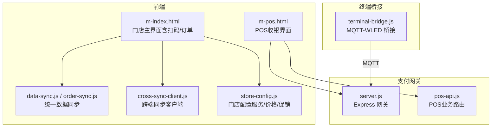
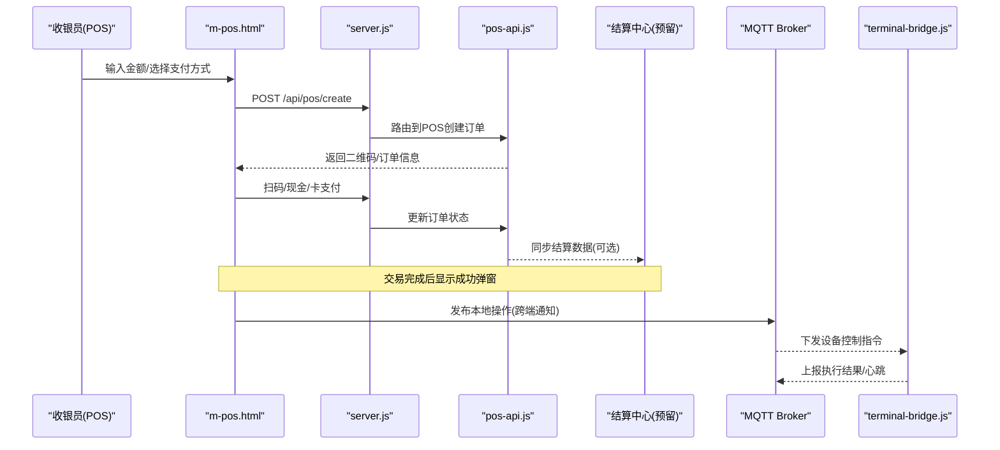
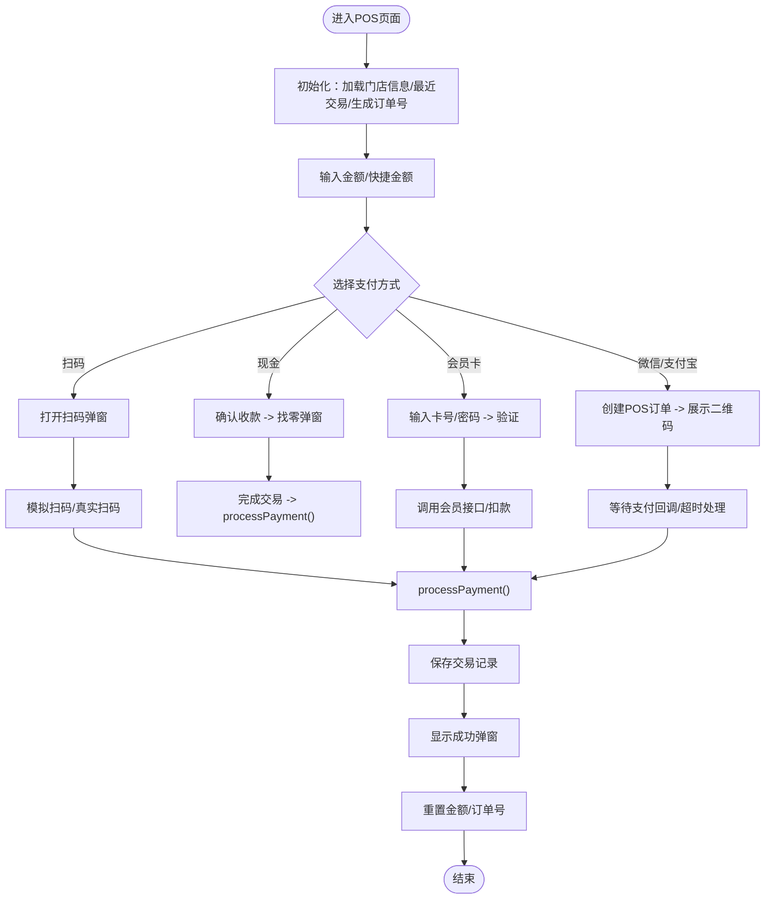
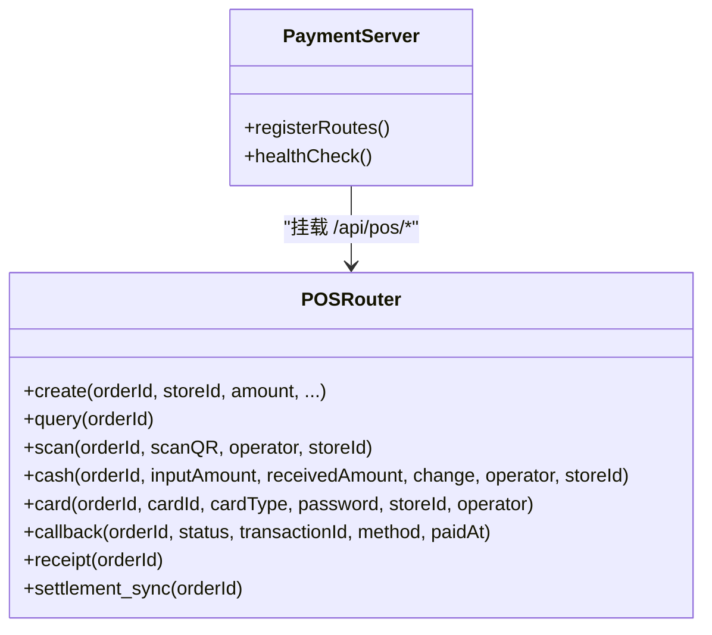
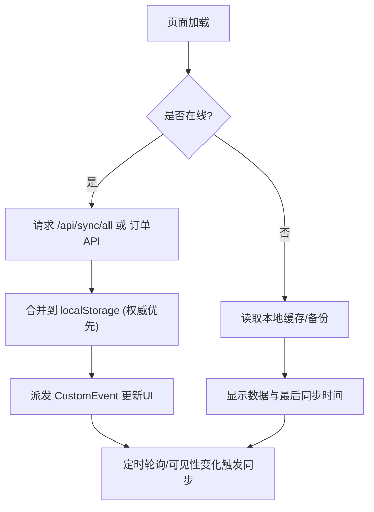
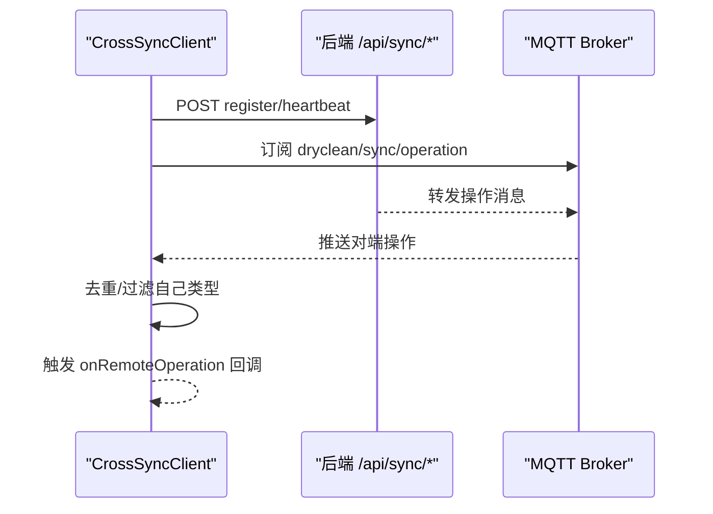
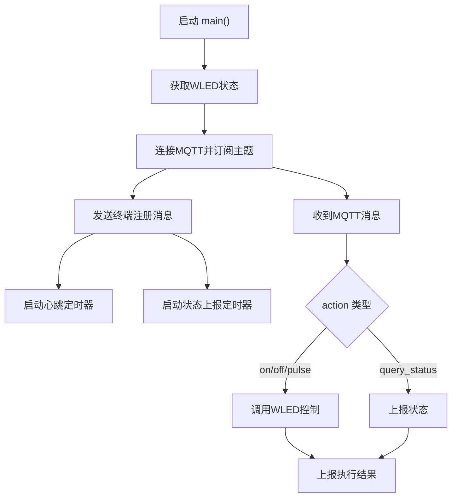
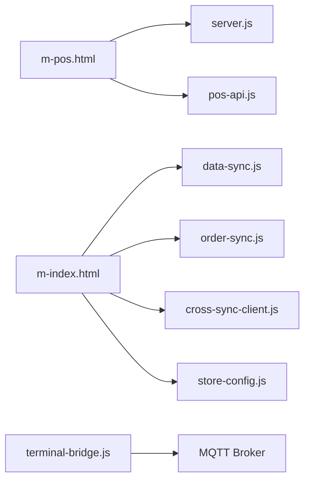

# POS终端界面

<cite>
**本文引用的文件列表**
- [m-pos.html](file://m-pos.html)
- [server.js](file://api/payment-server/server.js)
- [pos-api.js](file://api/payment-server/pos-api.js)
- [data-sync.js](file://js/data-sync.js)
- [order-sync.js](file://js/order-sync.js)
- [cross-sync-client.js](file://js/cross-sync-client.js)
- [store-config.js](file://js/store-config.js)
- [terminal-bridge.js](file://terminal-bridge/terminal-bridge.js)
- [m-index.html](file://m-index.html)
</cite>

## 目录
1. [简介](#简介)
2. [项目结构](#项目结构)
3. [核心组件](#核心组件)
4. [架构总览](#架构总览)
5. [详细组件分析](#详细组件分析)
6. [依赖关系分析](#依赖关系分析)
7. [性能考虑](#性能考虑)
8. [故障排查指南](#故障排查指南)
9. [结论](#结论)
10. [附录](#附录)

## 简介
本文件面向POS终端界面的开发与部署，聚焦干洗店场景下的收银结算、扫码入库、库存管理、离线模式与硬件集成等能力。文档基于仓库中现有实现进行梳理，给出系统架构、交互流程、数据同步策略、安全机制与性能优化建议，帮助团队快速落地并稳定运行POS终端应用。

## 项目结构
POS相关的前端入口为移动端收银页面，后端提供支付网关与POS接口，同时具备跨端同步、统一数据同步与终端桥接能力。

图表来源
- [m-pos.html:1-739](file://m-pos.html#L1-L739)
- [server.js:1-624](file://api/payment-server/server.js#L1-L624)
- [pos-api.js:1-556](file://api/payment-server/pos-api.js#L1-L556)
- [data-sync.js:1-348](file://js/data-sync.js#L1-L348)
- [order-sync.js:1-352](file://js/order-sync.js#L1-L352)
- [cross-sync-client.js:1-399](file://js/cross-sync-client.js#L1-L399)
- [store-config.js:1-183](file://js/store-config.js#L1-L183)
- [terminal-bridge.js:1-480](file://terminal-bridge/terminal-bridge.js#L1-L480)

章节来源
- [m-pos.html:1-739](file://m-pos.html#L1-L739)
- [server.js:1-624](file://api/payment-server/server.js#L1-L624)
- [pos-api.js:1-556](file://api/payment-server/pos-api.js#L1-L556)
- [data-sync.js:1-348](file://js/data-sync.js#L1-L348)
- [order-sync.js:1-352](file://js/order-sync.js#L1-L352)
- [cross-sync-client.js:1-399](file://js/cross-sync-client.js#L1-L399)
- [store-config.js:1-183](file://js/store-config.js#L1-L183)
- [terminal-bridge.js:1-480](file://terminal-bridge/terminal-bridge.js#L1-L480)

## 核心组件
- POS收银界面：提供大按钮数字键盘、快捷金额、支付方式选择、扫码/会员卡/现金/二维码支付流程、交易记录展示与找零提示。
- 支付网关与POS API：提供创建POS订单、扫码支付、现金支付、会员卡支付、查询、回调、小票数据生成与结算中心同步接口。
- 数据同步：统一数据同步管理器与订单同步器，支持定时轮询、事件驱动、本地缓存与权威源合并。
- 跨端同步：通过REST心跳与MQTT订阅广播操作，抑制回显、感知对端在线状态。
- 终端桥接：将MQTT命令转换为WLED设备控制，上报状态与心跳。
- 门店配置：按门店维度维护服务类别、价格与促销规则，支持本地持久化与异步同步到后端。

章节来源
- [m-pos.html:1-739](file://m-pos.html#L1-L739)
- [pos-api.js:1-556](file://api/payment-server/pos-api.js#L1-L556)
- [data-sync.js:1-348](file://js/data-sync.js#L1-L348)
- [order-sync.js:1-352](file://js/order-sync.js#L1-L352)
- [cross-sync-client.js:1-399](file://js/cross-sync-client.js#L1-L399)
- [terminal-bridge.js:1-480](file://terminal-bridge/terminal-bridge.js#L1-L480)
- [store-config.js:1-183](file://js/store-config.js#L1-L183)

## 架构总览
POS终端采用“前端收银 + 支付网关 + 数据同步 + 终端桥接”的分层架构。前端负责触摸友好的交互与本地缓存；网关集中处理支付与POS业务；同步模块保障多端一致性；桥接服务连接外设（如灯条）。

图表来源
- [m-pos.html:322-739](file://m-pos.html#L322-L739)
- [server.js:29-31](file://api/payment-server/server.js#L29-L31)
- [pos-api.js:22-106](file://api/payment-server/pos-api.js#L22-L106)
- [pos-api.js:498-553](file://api/payment-server/pos-api.js#L498-L553)
- [cross-sync-client.js:342-371](file://js/cross-sync-client.js#L342-L371)
- [terminal-bridge.js:192-257](file://terminal-bridge/terminal-bridge.js#L192-L257)

## 详细组件分析

### POS收银界面（m-pos.html）
- 触摸友好设计
  - 大尺寸数字键盘与快捷金额按钮，减少误触概率。
  - 支付方式卡片式布局，选中态高亮，弹窗式交互降低层级复杂度。
- 核心交互流程
  - 金额输入与校验：限制长度、保留两位小数。
  - 支付方式分支：扫码、现金、会员卡、微信/支付宝二维码。
  - 交易记录：最近交易列表持久化至localStorage。
  - 成功反馈：完成弹窗后重置状态，便于连续收款。
- 与后端对接
  - 创建POS订单、发起二维码支付、提交现金/扫码/会员卡支付、同步结算中心。
  - 失败降级：网络异常时模拟支付成功，保证体验连续性。

图表来源
- [m-pos.html:322-739](file://m-pos.html#L322-L739)

章节来源
- [m-pos.html:1-739](file://m-pos.html#L1-L739)

### 支付网关与POS API（server.js + pos-api.js）
- 路由挂载：在网关中注册POS路由，暴露统一的POS接口。
- 订单生命周期
  - 创建：参数校验、幂等检查、生成二维码与过期时间。
  - 查询：返回当前状态，自动处理过期。
  - 扫码支付：校验订单存在且未过期，写入流水号与支付信息。
  - 现金支付：校验实收金额，计算找零，落盘流水。
  - 会员卡支付：调用会员扣减逻辑，更新余额与流水。
  - 回调：接收外部支付回调，更新订单状态。
  - 小票：聚合订单、支付信息与备注，供打印使用。
  - 结算同步：将已支付订单推送至结算中心（预留）。
- 错误处理
  - 缺失参数、订单不存在、状态异常、过期等均有明确返回。

图表来源
- [server.js:29-31](file://api/payment-server/server.js#L29-L31)
- [pos-api.js:22-106](file://api/payment-server/pos-api.js#L22-L106)
- [pos-api.js:108-149](file://api/payment-server/pos-api.js#L108-L149)
- [pos-api.js:151-238](file://api/payment-server/pos-api.js#L151-L238)
- [pos-api.js:240-327](file://api/payment-server/pos-api.js#L240-L327)
- [pos-api.js:329-404](file://api/payment-server/pos-api.js#L329-L404)
- [pos-api.js:406-441](file://api/payment-server/pos-api.js#L406-L441)
- [pos-api.js:443-495](file://api/payment-server/pos-api.js#L443-L495)
- [pos-api.js:497-553](file://api/payment-server/pos-api.js#L497-L553)

章节来源
- [server.js:1-624](file://api/payment-server/server.js#L1-L624)
- [pos-api.js:1-556](file://api/payment-server/pos-api.js#L1-L556)

### 数据同步与离线模式（data-sync.js + order-sync.js）
- 统一数据同步管理器
  - 启动/停止：定时拉取全量数据，支持手动触发。
  - 权威源：后端为唯一权威，本地做智能diff合并。
  - 事件驱动：变更通过CustomEvent通知页面刷新。
  - 兼容旧版：保留OrderSyncManager转发接口。
- 订单同步器
  - 按页面类型选择不同API端点与认证方式。
  - 过滤与格式化：标准化字段名、金额计算、状态映射。
  - 可见性恢复：页面从后台切回时主动同步。
- 离线策略
  - 网络不可用时读取本地缓存，显示历史数据与最后同步时间。
  - 冲突解决：以服务端为准，本地独有项保留，避免覆盖权威数据。

图表来源
- [data-sync.js:78-190](file://js/data-sync.js#L78-L190)
- [data-sync.js:195-251](file://js/data-sync.js#L195-L251)
- [order-sync.js:74-194](file://js/order-sync.js#L74-L194)
- [order-sync.js:196-320](file://js/order-sync.js#L196-L320)

章节来源
- [data-sync.js:1-348](file://js/data-sync.js#L1-L348)
- [order-sync.js:1-352](file://js/order-sync.js#L1-L352)

### 跨端同步（cross-sync-client.js）
- 功能要点
  - 注册与心跳：定期POST注册/心跳，保持在线状态。
  - MQTT订阅：订阅操作广播与心跳主题，感知对端在线。
  - 去重机制：记录本地操作ID，抑制回显与重复处理。
  - 状态轮询：作为MQTT的补充，兜底获取跨端状态。
- 使用方式
  - 传入类型（admin/store）、回调函数，自动启动。
  - 发布本地操作，由后端广播到MQTT。

图表来源
- [cross-sync-client.js:111-157](file://js/cross-sync-client.js#L111-L157)
- [cross-sync-client.js:159-232](file://js/cross-sync-client.js#L159-L232)
- [cross-sync-client.js:234-278](file://js/cross-sync-client.js#L234-L278)
- [cross-sync-client.js:342-371](file://js/cross-sync-client.js#L342-L371)

章节来源
- [cross-sync-client.js:1-399](file://js/cross-sync-client.js#L1-L399)

### 终端桥接（terminal-bridge.js）
- 职责
  - 连接MQTT，订阅门店灯条控制主题。
  - 将MQTT命令转换为WLED HTTP API调用。
  - 上报终端注册、心跳、执行结果与状态。
- 关键流程
  - 启动：解析参数、获取WLED初始状态、连接MQTT、订阅主题、发送注册。
  - 命令处理：开灯/关灯/闪烁/查询状态等。
  - 定时任务：心跳与状态上报。

图表来源
- [terminal-bridge.js:409-459](file://terminal-bridge/terminal-bridge.js#L409-L459)
- [terminal-bridge.js:192-257](file://terminal-bridge/terminal-bridge.js#L192-L257)
- [terminal-bridge.js:259-302](file://terminal-bridge/terminal-bridge.js#L259-L302)
- [terminal-bridge.js:304-337](file://terminal-bridge/terminal-bridge.js#L304-L337)
- [terminal-bridge.js:339-405](file://terminal-bridge/terminal-bridge.js#L339-L405)

章节来源
- [terminal-bridge.js:1-480](file://terminal-bridge/terminal-bridge.js#L1-L480)

### 门店配置与库存关联（store-config.js）
- 按门店维度管理服务类别、价格与促销规则，默认值与用户自定义合并。
- 本地持久化，并在可用时异步同步到后端。
- 促销计算：支持折扣、满减、条件匹配（自取、首单等）。
- 与库存联动建议：可将服务项映射到SKU，结合扫码入库与出库流程，形成库存变动闭环。

章节来源
- [store-config.js:1-183](file://js/store-config.js#L1-L183)

### 扫码入库与库存管理（m-index.html）
- 扫码能力
  - 集成html5-qrcode库，支持相机取景、切换镜头、手电筒辅助。
  - 支持条码/二维码识别，适配多种码制。
- 入库流程
  - 扫描商品条码后，根据条码查询商品信息与服务项，创建或追加订单行。
  - 支持搜索模式与扫码模式切换，提升操作效率。
- 库存联动
  - 建议在入库成功后调用库存扣减/增加接口（可接入后端库存服务），并触发数据同步。
  - 结合POS收银时的服务项与价格，确保前后端一致。

章节来源
- [m-index.html:1-200](file://m-index.html#L1-L200)
- [m-index.html:4272-4300](file://m-index.html#L4272-L4300)
- [m-index.html:13448-13472](file://m-index.html#L13448-L13472)

## 依赖关系分析
- 前端依赖
  - m-pos.html 依赖 Tailwind CSS、Font Awesome、浏览器API与本地存储。
  - data-sync.js / order-sync.js 依赖 fetch、AbortSignal、localStorage。
  - cross-sync-client.js 依赖 mqtt.js（可选，失败降级为轮询）。
  - terminal-bridge.js 依赖 Node.js、mqtt、http、fs、path。
- 后端依赖
  - server.js 使用 Express、cors、body-parser，挂载POS与会员路由。
  - pos-api.js 使用内存Map模拟数据库，提供POS业务接口。

图表来源
- [m-pos.html:1-739](file://m-pos.html#L1-L739)
- [server.js:1-624](file://api/payment-server/server.js#L1-L624)
- [pos-api.js:1-556](file://api/payment-server/pos-api.js#L1-L556)
- [data-sync.js:1-348](file://js/data-sync.js#L1-L348)
- [order-sync.js:1-352](file://js/order-sync.js#L1-L352)
- [cross-sync-client.js:1-399](file://js/cross-sync-client.js#L1-L399)
- [store-config.js:1-183](file://js/store-config.js#L1-L183)
- [terminal-bridge.js:1-480](file://terminal-bridge/terminal-bridge.js#L1-L480)

章节来源
- [m-pos.html:1-739](file://m-pos.html#L1-L739)
- [server.js:1-624](file://api/payment-server/server.js#L1-L624)
- [pos-api.js:1-556](file://api/payment-server/pos-api.js#L1-L556)
- [data-sync.js:1-348](file://js/data-sync.js#L1-L348)
- [order-sync.js:1-352](file://js/order-sync.js#L1-L352)
- [cross-sync-client.js:1-399](file://js/cross-sync-client.js#L1-L399)
- [store-config.js:1-183](file://js/store-config.js#L1-L183)
- [terminal-bridge.js:1-480](file://terminal-bridge/terminal-bridge.js#L1-L480)

## 性能考虑
- 前端渲染与交互
  - 使用Tailwind CDN与Font Awesome CDN，注意CDN容灾与本地备用资源。
  - 大按钮与简化弹窗减少DOM操作与重排，提升触控响应。
- 网络与同步
  - 合理设置同步间隔（默认15秒），避免频繁请求。
  - 使用AbortSignal设置超时，防止阻塞。
  - 页面可见性变化时触发同步，兼顾实时性与资源消耗。
- 内存与存储
  - 交易记录仅保留最近若干条，避免localStorage膨胀。
  - 订单合并使用Map去重，减少重复写入。
- 终端桥接
  - 心跳与状态上报间隔可调，避免过多MQTT消息。
  - WLED控制批量更新，减少HTTP请求次数。

[本节为通用指导，不直接分析具体文件]

## 故障排查指南
- POS收银常见问题
  - 金额输入异常：检查长度限制与小数点处理。
  - 支付方式无响应：确认后端服务端口与路由挂载。
  - 交易记录丢失：检查localStorage权限与容量。
- 数据同步问题
  - 认证失败（401）：检查token键名与有效期。
  - 同步失败：查看控制台日志，确认API地址与网络连通。
  - 数据不一致：以服务端为准，强制重新同步。
- 跨端同步问题
  - MQTT未连接：检查WebSocket地址与Broker可用性。
  - 操作重复：确认本地操作ID去重缓存大小与清理策略。
- 终端桥接问题
  - WLED不可达：检查IP与端口，重试策略。
  - MQTT断线：观察重连日志，必要时重启桥接服务。

章节来源
- [data-sync.js:182-190](file://js/data-sync.js#L182-L190)
- [order-sync.js:183-194](file://js/order-sync.js#L183-L194)
- [cross-sync-client.js:217-232](file://js/cross-sync-client.js#L217-L232)
- [terminal-bridge.js:426-459](file://terminal-bridge/terminal-bridge.js#L426-L459)

## 结论
POS终端界面在本仓库中提供了完整的收银流程、支付网关与数据同步能力，并通过跨端同步与终端桥接扩展了系统与外设的联动。建议在生产环境中完善以下方面：
- 引入持久化数据库替代内存Map，增强可靠性与审计能力。
- 强化安全机制：签名校验、敏感数据加密传输、操作审计日志。
- 完善库存锁定与并发控制，确保多终端一致性。
- 建立完善的监控与告警体系，提升运维稳定性。

[本节为总结，不直接分析具体文件]

## 附录

### 关键API定义（POS）
- 创建POS订单
  - 方法：POST
  - 路径：/api/pos/create
  - 说明：生成二维码与订单信息，支持过期控制。
- 查询POS订单
  - 方法：GET
  - 路径：/api/pos/query/:orderId
  - 说明：返回订单状态与支付信息。
- 扫码支付
  - 方法：POST
  - 路径：/api/pos/scan
  - 说明：录入用户付款码，更新订单为已支付。
- 现金支付
  - 方法：POST
  - 路径：/api/pos/cash
  - 说明：输入实收金额，计算找零并记录流水。
- 会员卡支付
  - 方法：POST
  - 路径：/api/pos/card
  - 说明：验证并扣减会员卡余额，更新订单。
- 支付回调
  - 方法：POST
  - 路径：/api/pos/callback
  - 说明：接收外部支付回调，更新订单状态。
- 获取小票数据
  - 方法：GET
  - 路径：/api/pos/receipt/:orderId
  - 说明：聚合订单与支付信息，用于打印。
- 同步结算中心
  - 方法：POST
  - 路径：/api/pos/settlement/sync
  - 说明：将已支付订单推送至结算中心。

章节来源
- [pos-api.js:22-106](file://api/payment-server/pos-api.js#L22-L106)
- [pos-api.js:108-149](file://api/payment-server/pos-api.js#L108-L149)
- [pos-api.js:151-238](file://api/payment-server/pos-api.js#L151-L238)
- [pos-api.js:240-327](file://api/payment-server/pos-api.js#L240-L327)
- [pos-api.js:329-404](file://api/payment-server/pos-api.js#L329-L404)
- [pos-api.js:406-441](file://api/payment-server/pos-api.js#L406-L441)
- [pos-api.js:443-495](file://api/payment-server/pos-api.js#L443-L495)
- [pos-api.js:497-553](file://api/payment-server/pos-api.js#L497-L553)

### 硬件集成接口（预留）
- 扫码枪
  - 前端已集成html5-qrcode，支持相机扫码；可外接USB扫码枪，通过输入框事件捕获条码。
- 打印机
  - 预留小票数据接口，后续可对接Web打印或蓝牙/网络热敏打印机。
- 钱箱
  - 预留钱箱状态与控制接口，可通过串口或网络驱动控制。
- 刷卡器
  - 预留银行卡/会员卡读写接口，结合会员扣减逻辑完成支付。

章节来源
- [m-index.html:13448-13472](file://m-index.html#L13448-L13472)
- [pos-api.js:443-495](file://api/payment-server/pos-api.js#L443-L495)