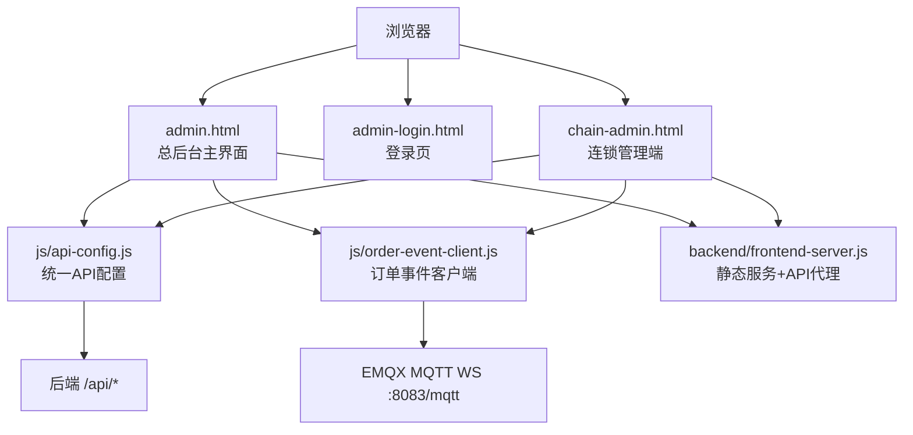
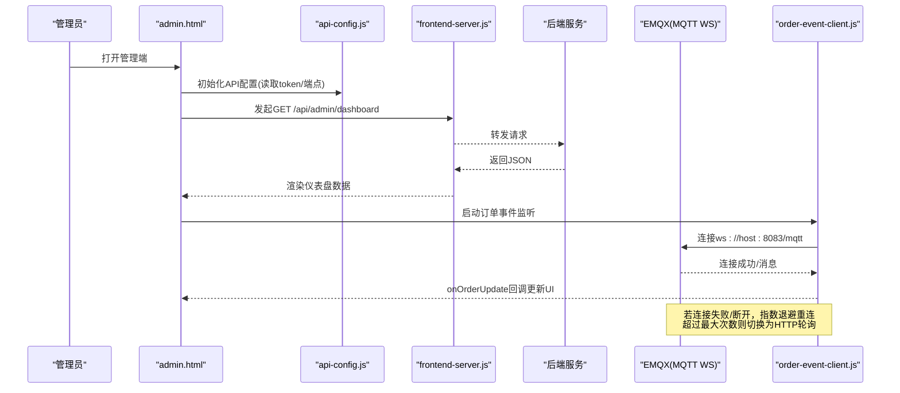
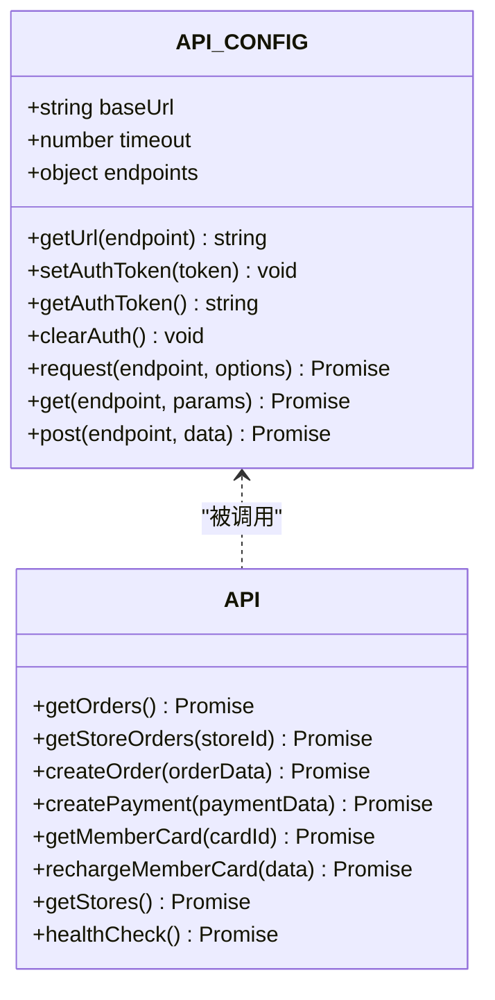
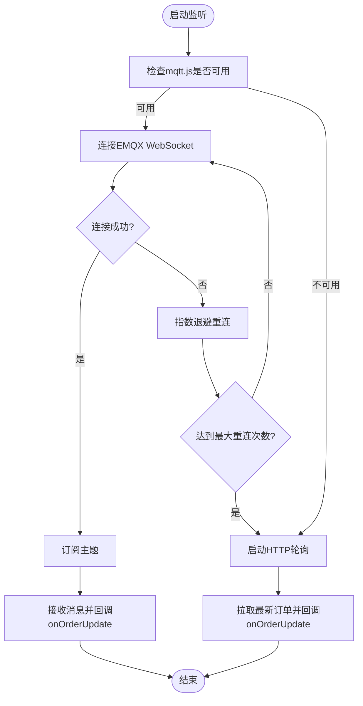
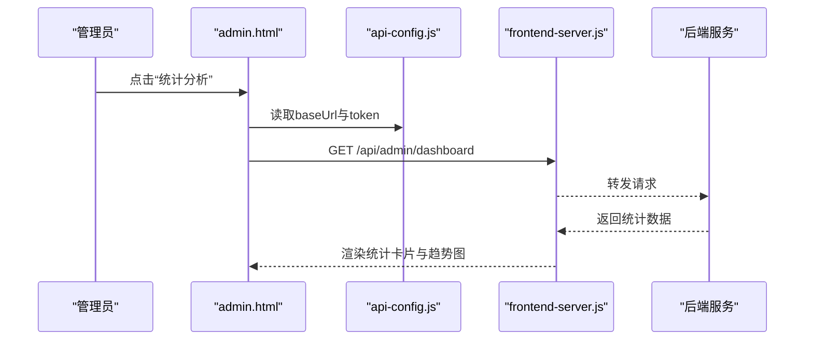
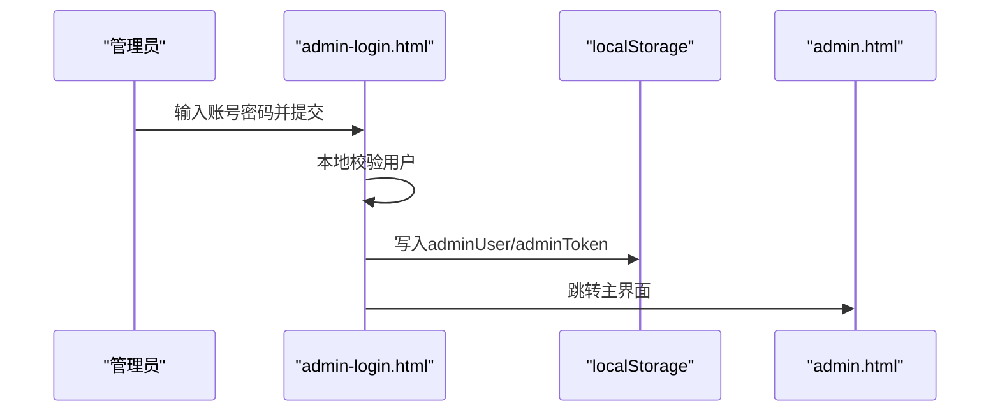
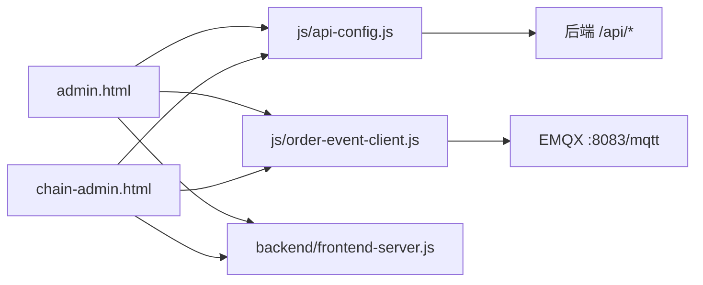

# Web管理端前端

<cite>
**本文引用的文件**
- [admin.html](file://admin.html)
- [admin-login.html](file://admin-login.html)
- [chain-admin.html](file://chain-admin.html)
- [api-config.js](file://js/api-config.js)
- [order-event-client.js](file://js/order-event-client.js)
- [frontend-server.js](file://backend/frontend-server.js)
- [PRODUCTION_GUIDE.md](file://PRODUCTION_GUIDE.md)
</cite>

## 目录
1. [简介](#简介)
2. [项目结构](#项目结构)
3. [核心组件](#核心组件)
4. [架构总览](#架构总览)
5. [详细组件分析](#详细组件分析)
6. [依赖关系分析](#依赖关系分析)
7. [性能与构建部署](#性能与构建部署)
8. [安全与合规](#安全与合规)
9. [故障排查指南](#故障排查指南)
10. [结论](#结论)

## 简介
本文件面向Web管理端前端的架构设计与实现说明，覆盖单页应用（SPA）模式、模块化组织、组件复用策略、响应式布局、API客户端封装、实时通信集成、构建与部署方案以及安全考虑。该管理端由多个HTML页面组成，通过原生JavaScript与Tailwind CSS完成交互与样式，使用统一API配置与订单事件客户端进行数据获取与实时更新。

## 项目结构
管理端前端采用“多入口HTML + 共享JS模块”的轻量SPA形态：
- 入口页面
  - admin.html：总后台主界面，包含侧边栏导航、仪表盘、业务管理、门店管理、系统管理等模块。
  - admin-login.html：管理员登录页，本地模拟用户校验并写入令牌后跳转至主界面。
  - chain-admin.html：连锁企业管理平台，独立登录态与页面路由。
- 共享脚本
  - js/api-config.js：统一API地址、端点定义、认证Token管理与通用请求封装。
  - js/order-event-client.js：基于MQTT over WebSocket的订单事件订阅与断线重连/轮询降级。
- 前端静态服务
  - backend/frontend-server.js：Express静态文件服务与/api代理转发到后端。

图表来源
- [admin.html:1-800](file://admin.html#L1-L800)
- [admin-login.html:1-187](file://admin-login.html#L1-L187)
- [chain-admin.html:1-800](file://chain-admin.html#L1-L800)
- [api-config.js:1-225](file://js/api-config.js#L1-L225)
- [order-event-client.js:1-270](file://js/order-event-client.js#L1-L270)
- [frontend-server.js:1-87](file://backend/frontend-server.js#L1-L87)

章节来源
- [admin.html:1-800](file://admin.html#L1-L800)
- [admin-login.html:1-187](file://admin-login.html#L1-L187)
- [chain-admin.html:1-800](file://chain-admin.html#L1-L800)
- [api-config.js:1-225](file://js/api-config.js#L1-L225)
- [order-event-client.js:1-270](file://js/order-event-client.js#L1-L270)
- [frontend-server.js:1-87](file://backend/frontend-server.js#L1-L87)

## 核心组件
- 统一API配置与客户端
  - 提供baseUrl动态推导、端点集中管理、自动附加Authorization头、超时控制与错误包装。
  - 暴露便捷方法API.getOrders()等，便于页面直接调用。
- 订单事件客户端
  - 基于mqtt.js连接EMQX的WebSocket，支持按门店或全局主题订阅、断线指数退避重连、达到上限后切换为HTTP轮询降级。
  - 暴露switchStore用于运行时切换门店并重新订阅。
- 前端静态服务与API代理
  - Express托管静态资源，并将/api请求反向代理到后端，简化跨域与开发体验。

章节来源
- [api-config.js:1-225](file://js/api-config.js#L1-L225)
- [order-event-client.js:1-270](file://js/order-event-client.js#L1-L270)
- [frontend-server.js:1-87](file://backend/frontend-server.js#L1-L87)

## 架构总览
管理端整体采用“静态HTML + 原生JS + TailwindCSS”的轻量SPA架构，通过统一API配置访问后端REST接口；同时通过MQTT实现订单状态实时推送，并在不可用时回退为定时轮询。

图表来源
- [admin.html:1-800](file://admin.html#L1-L800)
- [api-config.js:1-225](file://js/api-config.js#L1-L225)
- [order-event-client.js:1-270](file://js/order-event-client.js#L1-L270)
- [frontend-server.js:1-87](file://backend/frontend-server.js#L1-L87)

## 详细组件分析

### 统一API客户端（api-config.js）
- 功能要点
  - baseUrl根据当前页面端口自动推导，适配开发环境。
  - endpoints集中管理所有接口路径，支持函数式端点生成。
  - setAuthToken/getAuthToken/clearAuth管理localStorage中的auth_token。
  - request封装fetch，自动注入Authorization头、AbortController超时、非2xx错误包装。
  - get/post便捷方法与API命名空间下的常用方法。
- 复杂度与性能
  - 时间复杂度O(1)，空间复杂度O(1)。
  - 通过AbortController避免长时间挂起请求。
- 扩展建议
  - 增加重试机制（如网络抖动时指数退避）。
  - 增加请求日志与埋点。
  - 增加Mock开关以支持离线联调。

图表来源
- [api-config.js:1-225](file://js/api-config.js#L1-L225)

章节来源
- [api-config.js:1-225](file://js/api-config.js#L1-L225)

### 订单事件客户端（order-event-client.js）
- 功能要点
  - start(options)初始化配置并建立连接。
  - connect()通过mqtt.connect(wsUrl)连接EMQX，设置clientId、keepalive、reconnectPeriod等。
  - onConnect()订阅主题，onMessage()解析payload并回调onOrderUpdate。
  - scheduleReconnect()指数退避重连，达到maxReconnect后切换到startPolling()轮询。
  - switchStore(newStoreId)在运行时切换门店并重新订阅。
- 主题设计
  - 门店模式：订阅具体门店与全量主题。
  - 全局模式：订阅通配符主题。
- 降级策略
  - 当mqtt不可用或连接失败，启用每8秒轮询最近订单列表，保证基本可用性。

图表来源
- [order-event-client.js:1-270](file://js/order-event-client.js#L1-L270)

章节来源
- [order-event-client.js:1-270](file://js/order-event-client.js#L1-L270)

### 管理端主界面（admin.html）
- 页面结构
  - 左侧固定侧边栏，右侧主内容区，顶部工具栏。
  - 使用Tailwind栅格与响应式类实现移动端折叠与桌面端展开。
- 路由与视图
  - 通过锚点与DOM显隐实现SPA式页面切换（dashboard、orders、members、statistics等）。
- 数据加载
  - 各Tab通过window.loadXxx函数调用后端接口，携带Authorization头。
  - 统计卡片与表格动态渲染。
- 实时状态
  - 引入mqtt.min.js异步加载，失败不影响页面；结合order-event-client.js实现实时刷新。

图表来源
- [admin.html:1-800](file://admin.html#L1-L800)
- [api-config.js:1-225](file://js/api-config.js#L1-L225)
- [frontend-server.js:1-87](file://backend/frontend-server.js#L1-L87)

章节来源
- [admin.html:1-800](file://admin.html#L1-L800)

### 登录流程（admin-login.html）
- 流程说明
  - 表单提交后本地校验用户名/密码，成功后将用户信息与管理员令牌写入localStorage。
  - 跳转到admin.html进入主界面。
- 安全提示
  - 当前为开发模式本地校验，生产应替换为服务端鉴权与JWT签发。

图表来源
- [admin-login.html:1-187](file://admin-login.html#L1-L187)

章节来源
- [admin-login.html:1-187](file://admin-login.html#L1-L187)

### 连锁管理端（chain-admin.html）
- 特点
  - 独立登录态与页面路由，侧边栏导航切换控制台、门店管理、订单管理、员工管理、数据分析、资金管理、结算中心、企业设置等。
  - 使用API_BASE与API_CONFIG.setAuthToken同步令牌。
  - 控制台展示关键指标与趋势图，支持点击进入详情页。

章节来源
- [chain-admin.html:1-800](file://chain-admin.html#L1-L800)

## 依赖关系分析
- 页面依赖
  - admin.html与chain-admin.html均依赖js/api-config.js与js/order-event-client.js。
  - 页面通过window对象暴露的方法进行交互（如loadUsers、loadMembers、loadStatistics等）。
- 服务依赖
  - frontend-server.js提供静态资源与/api代理，屏蔽跨域问题。
  - order-event-client.js依赖EMQX的WebSocket端口（默认8083）。

图表来源
- [admin.html:1-800](file://admin.html#L1-L800)
- [chain-admin.html:1-800](file://chain-admin.html#L1-L800)
- [api-config.js:1-225](file://js/api-config.js#L1-L225)
- [order-event-client.js:1-270](file://js/order-event-client.js#L1-L270)
- [frontend-server.js:1-87](file://backend/frontend-server.js#L1-L87)

章节来源
- [admin.html:1-800](file://admin.html#L1-L800)
- [chain-admin.html:1-800](file://chain-admin.html#L1-L800)
- [api-config.js:1-225](file://js/api-config.js#L1-L225)
- [order-event-client.js:1-270](file://js/order-event-client.js#L1-L270)
- [frontend-server.js:1-87](file://backend/frontend-server.js#L1-L87)

## 性能与构建部署
- 资源优化
  - 当前使用CDN引入Tailwind与Font Awesome，生产环境可替换为国内镜像或本地化，参考生产指南。
  - 建议对静态资源进行压缩与缓存，开启Gzip/Brotli。
- 代码分割
  - 当前为单页HTML直出，无打包器；后续可引入Vite/Webpack进行按需加载与分包。
- CDN加速
  - 使用CloudBase静态托管或Nginx反向代理，结合缓存策略提升首屏速度。
- 部署参考
  - 生产指南提供了CDN替换、本地化、PWA与Nginx配置示例。

章节来源
- [PRODUCTION_GUIDE.md:1-223](file://PRODUCTION_GUIDE.md#L1-L223)

## 安全与合规
- XSS防护
  - 避免直接使用innerHTML渲染未过滤的用户输入；优先使用文本节点或模板引擎转义。
- CSRF防护
  - 使用同源策略与CORS白名单；对于写操作建议使用SameSite Cookie或自定义Header校验。
- 敏感信息加密
  - 传输层强制HTTPS；避免在URL中传递敏感参数；令牌仅存于localStorage并设置合理过期。
- 权限控制
  - 前端仅做展示层权限控制，后端需严格校验角色与资源访问。

[本节为通用安全建议，不直接分析具体文件]

## 故障排查指南
- API请求失败
  - 检查frontend-server.js代理是否正确转发到后端，确认后端服务已启动。
  - 查看浏览器Network面板，确认Authorization头与请求路径。
- 实时连接异常
  - 检查EMQX WebSocket端口是否开放，浏览器控制台是否有连接错误。
  - 观察order-event-client.js的重连日志与轮询降级行为。
- 登录状态问题
  - 检查localStorage中token是否存在且有效，必要时使用诊断工具重置。

章节来源
- [frontend-server.js:1-87](file://backend/frontend-server.js#L1-L87)
- [order-event-client.js:1-270](file://js/order-event-client.js#L1-L270)

## 结论
本管理端前端采用轻量SPA架构，通过统一API配置与订单事件客户端实现了稳定的数据获取与实时能力。在生产环境中，建议完善资源本地化、构建打包、CDN缓存与安全加固，以提升性能与可靠性。