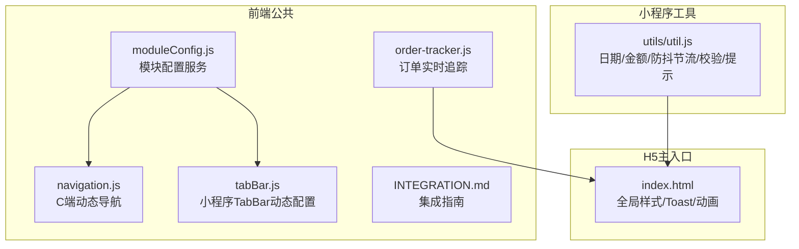
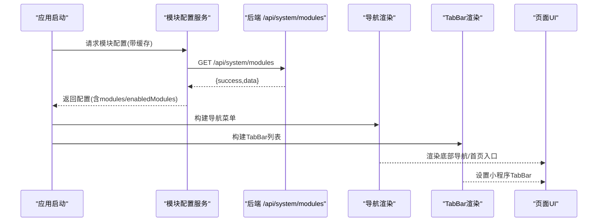
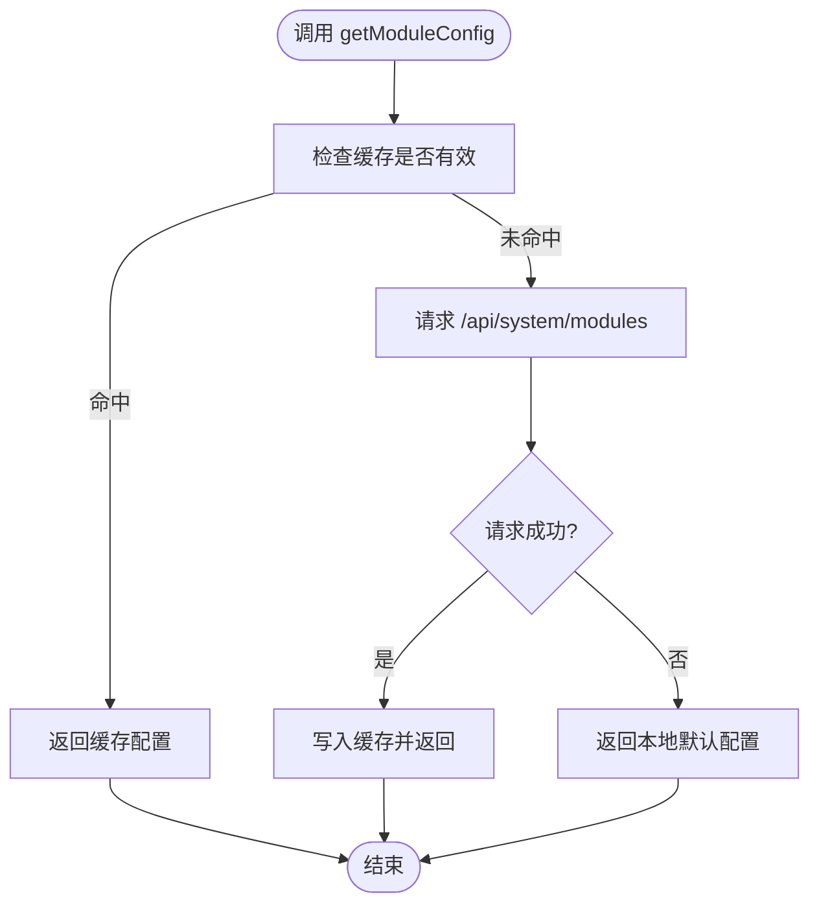
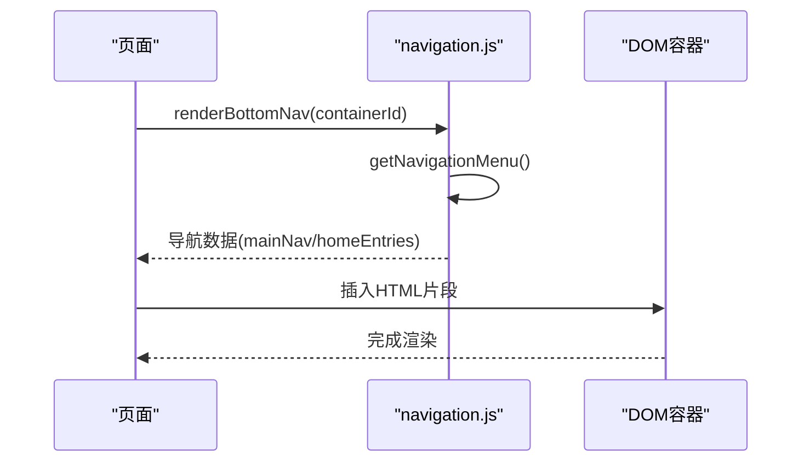
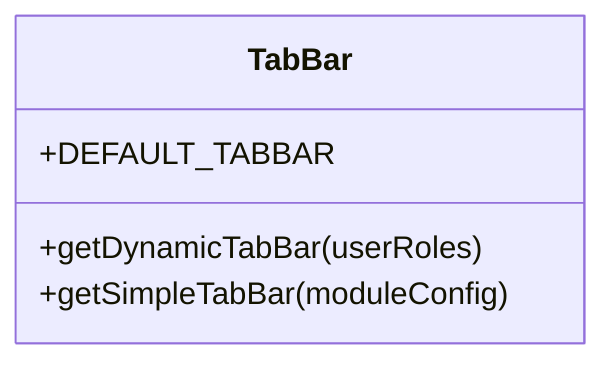
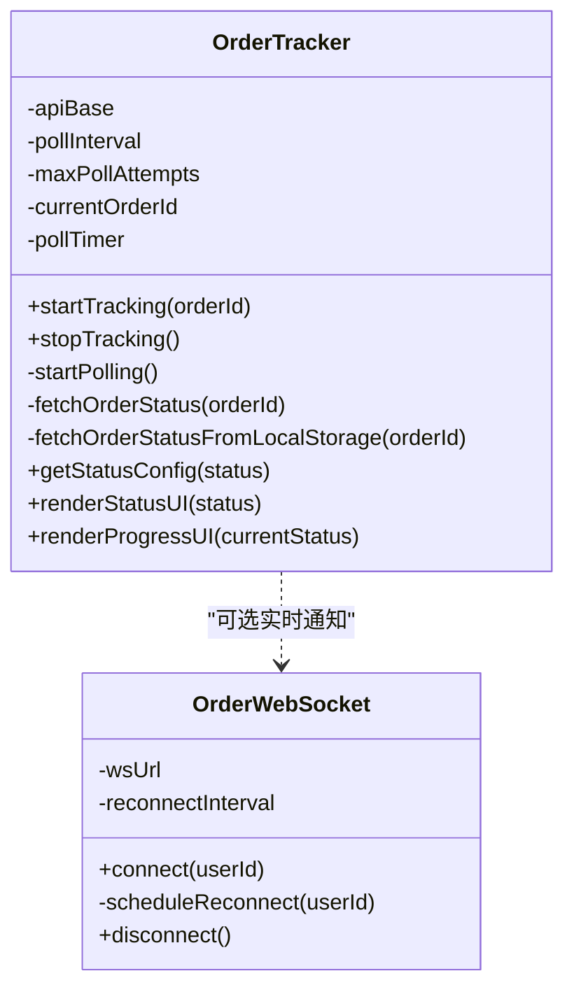
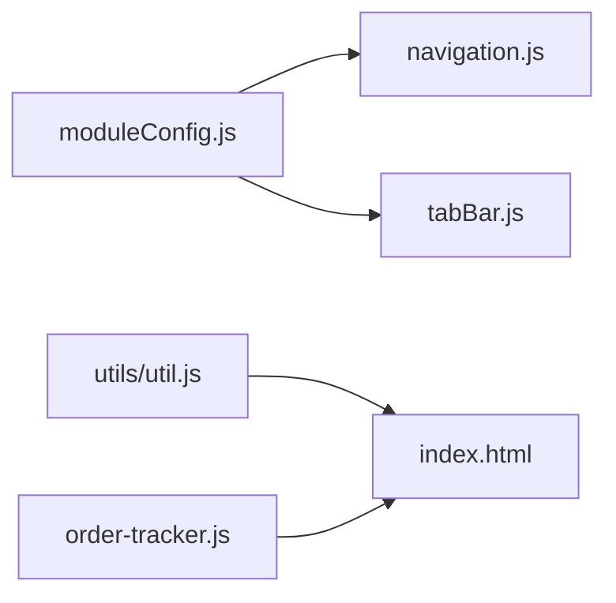

# 前端公共组件库

<cite>
**本文引用的文件**   
- [frontend/common/moduleConfig.js](file://frontend/common/moduleConfig.js)
- [frontend/common/navigation.js](file://frontend/common/navigation.js)
- [frontend/common/tabBar.js](file://frontend/common/tabBar.js)
- [frontend/INTEGRATION.md](file://frontend/INTEGRATION.md)
- [frontend/order-tracker.js](file://frontend/order-tracker.js)
- [index.html](file://index.html)
- [wechat-mini-app/utils/util.js](file://wechat-mini-app/utils/util.js)
</cite>

## 目录
1. [简介](#简介)
2. [项目结构](#项目结构)
3. [核心组件](#核心组件)
4. [架构总览](#架构总览)
5. [详细组件分析](#详细组件分析)
6. [依赖关系分析](#依赖关系分析)
7. [性能与内存优化](#性能与内存优化)
8. [故障排查指南](#故障排查指南)
9. [结论](#结论)
10. [附录：开发规范与文档生成](#附录开发规范与文档生成)

## 简介
本文件面向前端团队，系统化梳理并沉淀“干洗店管理系统”的前端公共能力，包括可复用UI组件、业务组件、工具函数封装与设计模式；阐述组件分层、依赖管理、事件通信、状态共享等机制；说明导航系统（路由、菜单动态生成、权限控制、面包屑）的实现思路；详解模块化配置系统（功能开关、插件化、动态加载、热重载建议）；给出标签栏组件的多标签页管理、页面缓存、内存优化方案；并提供统一的开发规范与文档生成策略，帮助团队建立一致的组件开发标准与高效体验。

## 项目结构
前端公共能力集中在 frontend/common 目录，提供模块配置、导航渲染与小程序 TabBar 动态配置；同时包含订单实时追踪的通用逻辑与集成指南。

图表来源
- [frontend/common/moduleConfig.js:1-191](file://frontend/common/moduleConfig.js#L1-L191)
- [frontend/common/navigation.js:1-317](file://frontend/common/navigation.js#L1-L317)
- [frontend/common/tabBar.js:1-138](file://frontend/common/tabBar.js#L1-L138)
- [frontend/order-tracker.js:1-441](file://frontend/order-tracker.js#L1-L441)
- [frontend/INTEGRATION.md:1-208](file://frontend/INTEGRATION.md#L1-L208)
- [index.html:1-200](file://index.html#L1-L200)
- [wechat-mini-app/utils/util.js:1-180](file://wechat-mini-app/utils/util.js#L1-L180)

章节来源
- [frontend/INTEGRATION.md:1-208](file://frontend/INTEGRATION.md#L1-L208)

## 核心组件
- 模块配置服务：统一从后端获取模块启用状态，构建菜单与首页入口，具备本地降级与缓存策略。
- C端动态导航：根据模块配置动态生成底部导航与首页功能入口，支持禁用态与提示信息。
- 小程序 TabBar 动态配置：按角色与模块状态动态生成 TabBar 列表。
- 订单实时追踪：轮询+可选WebSocket的订单状态更新，提供进度条与状态UI渲染。
- 工具函数库：日期/金额格式化、唯一ID、防抖节流、深拷贝、表单校验、Loading/Toast、节点尺寸查询等。
- H5全局UI能力：Toast提示、主题与动画配置等。

章节来源
- [frontend/common/moduleConfig.js:1-191](file://frontend/common/moduleConfig.js#L1-L191)
- [frontend/common/navigation.js:1-317](file://frontend/common/navigation.js#L1-L317)
- [frontend/common/tabBar.js:1-138](file://frontend/common/tabBar.js#L1-L138)
- [frontend/order-tracker.js:1-441](file://frontend/order-tracker.js#L1-L441)
- [wechat-mini-app/utils/util.js:1-180](file://wechat-mini-app/utils/util.js#L1-L180)
- [index.html:7780-7799](file://index.html#L7780-L7799)

## 架构总览
整体采用“配置驱动 + 动态渲染”的分层架构：
- 配置层：后端返回模块状态，前端通过 moduleConfig 聚合为菜单、入口、TabBar 数据。
- 渲染层：navigation 与 tabBar 负责将配置转换为DOM或小程序TabBar。
- 业务层：order-tracker 提供跨端订单追踪能力，结合轮询与可选WebSocket。
- 工具层：util.js 提供跨端通用工具；index.html 提供H5全局UI能力。

图表来源
- [frontend/common/moduleConfig.js:16-40](file://frontend/common/moduleConfig.js#L16-L40)
- [frontend/common/navigation.js:16-39](file://frontend/common/navigation.js#L16-L39)
- [frontend/common/tabBar.js:47-113](file://frontend/common/tabBar.js#L47-L113)

## 详细组件分析

### 模块配置服务（moduleConfig.js）
- 职责
  - 从后端拉取模块配置，维护内存缓存与过期时间，失败时回退到本地默认配置。
  - 提供 isModuleEnabled、getModuleMenus、getHomeEntries 等方法，供导航与首页入口使用。
- 关键设计
  - 缓存策略：基于时间戳与TTL避免频繁请求。
  - 降级策略：网络异常或接口不可用时使用本地默认配置保证可用性。
  - 扩展点：新增模块只需在 getModuleMenus/getHomeEntries 中追加分支。
- 复杂度
  - 时间复杂度：O(n)，n为模块数量。
  - 空间复杂度：O(n)，用于缓存配置与菜单数组。
- 错误处理
  - 捕获异常并输出日志，最终返回本地配置，确保界面可用。

图表来源
- [frontend/common/moduleConfig.js:16-40](file://frontend/common/moduleConfig.js#L16-L40)
- [frontend/common/moduleConfig.js:45-71](file://frontend/common/moduleConfig.js#L45-L71)
- [frontend/common/moduleConfig.js:84-132](file://frontend/common/moduleConfig.js#L84-L132)
- [frontend/common/moduleConfig.js:137-179](file://frontend/common/moduleConfig.js#L137-L179)

章节来源
- [frontend/common/moduleConfig.js:1-191](file://frontend/common/moduleConfig.js#L1-L191)

### C端动态导航（navigation.js）
- 职责
  - 根据模块配置构建主导航、用户菜单、首页功能入口，并渲染到底部容器。
  - 对未启用的模块提供 disabled/disabledMessage 展示。
- 关键设计
  - 构建器模式：buildNavigation/buildHomeEntries 将配置映射为视图数据。
  - 渲染器：renderBottomNav/renderHomeEntries 将数据转为HTML并注入容器。
  - 图标资源：内置SVG图标集合，减少外部依赖。
- 交互流程

图表来源
- [frontend/common/navigation.js:231-261](file://frontend/common/navigation.js#L231-L261)
- [frontend/common/navigation.js:266-293](file://frontend/common/navigation.js#L266-L293)
- [frontend/common/navigation.js:44-118](file://frontend/common/navigation.js#L44-L118)

章节来源
- [frontend/common/navigation.js:1-317](file://frontend/common/navigation.js#L1-L317)

### 小程序 TabBar 动态配置（tabBar.js）
- 职责
  - 根据后端模块状态与用户角色动态生成小程序 TabBar 列表。
  - 提供简化版 TabBar 适配C端H5场景。
- 关键设计
  - 条件渲染：仅当任一业务模块启用时才显示“服务”Tab。
  - 角色控制：员工/老板角色额外显示“管理”Tab。
  - 容错：接口失败返回默认配置。

图表来源
- [frontend/common/tabBar.js:11-42](file://frontend/common/tabBar.js#L11-L42)
- [frontend/common/tabBar.js:47-113](file://frontend/common/tabBar.js#L47-L113)
- [frontend/common/tabBar.js:118-131](file://frontend/common/tabBar.js#L118-L131)

章节来源
- [frontend/common/tabBar.js:1-138](file://frontend/common/tabBar.js#L1-L138)

### 订单实时追踪（order-tracker.js）
- 职责
  - 定时轮询订单状态，触发回调更新UI；支持可选WebSocket实时推送。
  - 提供状态配置、进度条与状态卡片渲染方法。
- 关键设计
  - 轮询控制：最大尝试次数、超时停止、失败重试。
  - 离线兜底：API失败时尝试从 localStorage 读取最近状态。
  - 生命周期：startTracking/stopTracking 管理定时器与状态。
- 类图

图表来源
- [frontend/order-tracker.js:94-104](file://frontend/order-tracker.js#L94-L104)
- [frontend/order-tracker.js:109-179](file://frontend/order-tracker.js#L109-L179)
- [frontend/order-tracker.js:184-228](file://frontend/order-tracker.js#L184-L228)
- [frontend/order-tracker.js:233-255](file://frontend/order-tracker.js#L233-L255)
- [frontend/order-tracker.js:368-430](file://frontend/order-tracker.js#L368-L430)

章节来源
- [frontend/order-tracker.js:1-441](file://frontend/order-tracker.js#L1-L441)

### 工具函数库（wechat-mini-app/utils/util.js）
- 能力清单
  - 格式化：日期、金额
  - 算法：防抖、节流、深拷贝
  - 校验：手机号、邮箱
  - 交互：Loading、Toast
  - 布局：获取元素矩形信息
- 适用性
  - 小程序与H5均可复用，建议抽取为独立工具包以跨端共享。

章节来源
- [wechat-mini-app/utils/util.js:1-180](file://wechat-mini-app/utils/util.js#L1-L180)

### H5全局UI能力（index.html）
- 能力清单
  - Toast提示：统一样式与自动消失
  - Tailwind主题与自定义动画
- 建议
  - 将Toast抽象为独立模块，便于多页面复用与主题切换。

章节来源
- [index.html:7780-7799](file://index.html#L7780-L7799)
- [index.html:1-200](file://index.html#L1-L200)

## 依赖关系分析
- 模块配置服务被导航与TabBar共同依赖，形成“配置中心”角色。
- 导航与TabBar分别负责不同端的渲染，降低耦合。
- 订单追踪独立于导航与配置，属于业务通用能力。
- 工具函数与全局UI作为横切能力被多处引用。

图表来源
- [frontend/common/moduleConfig.js:1-191](file://frontend/common/moduleConfig.js#L1-L191)
- [frontend/common/navigation.js:1-317](file://frontend/common/navigation.js#L1-L317)
- [frontend/common/tabBar.js:1-138](file://frontend/common/tabBar.js#L1-L138)
- [frontend/order-tracker.js:1-441](file://frontend/order-tracker.js#L1-L441)
- [wechat-mini-app/utils/util.js:1-180](file://wechat-mini-app/utils/util.js#L1-L180)
- [index.html:1-200](file://index.html#L1-L200)

## 性能与内存优化
- 配置缓存
  - 模块配置与服务端响应均做内存缓存与TTL控制，减少重复请求。
- 渲染优化
  - 导航与TabBar按需渲染，避免全量重绘；禁用态直接跳过跳转。
- 轮询优化
  - 订单追踪限制最大轮询次数，完成后主动停止；失败快速回退本地状态。
- 内存回收
  - 页面销毁时务必调用 stopTracking 清理定时器，防止泄漏。
- 建议
  - 引入虚拟滚动/分页加载长列表。
  - 图片与图标使用雪碧图或CDN缓存。
  - 对高频操作使用防抖/节流。

[本节为通用指导，不直接分析具体文件]

## 故障排查指南
- 模块配置无法加载
  - 检查后端 /api/system/modules 可达性与返回格式。
  - 确认本地降级配置是否生效。
- 导航未渲染
  - 确认容器ID是否存在且未被覆盖。
  - 检查 navigation.js 的渲染函数是否被调用。
- TabBar未更新
  - 确认角色参数是否正确传入。
  - 检查接口返回的 modules 字段是否包含 enabled 标志。
- 订单状态不更新
  - 查看轮询是否达到最大次数或被提前停止。
  - 检查 localStorage 中是否有最新订单数据。
  - 若启用WebSocket，确认连接与重连逻辑。

章节来源
- [frontend/common/moduleConfig.js:25-40](file://frontend/common/moduleConfig.js#L25-L40)
- [frontend/common/navigation.js:231-261](file://frontend/common/navigation.js#L231-L261)
- [frontend/common/tabBar.js:47-113](file://frontend/common/tabBar.js#L47-L113)
- [frontend/order-tracker.js:130-179](file://frontend/order-tracker.js#L130-L179)

## 结论
本公共组件库以“配置驱动 + 动态渲染”为核心，实现了跨端一致的导航与TabBar能力，并通过订单追踪与工具函数提升开发效率。建议在后续迭代中完善插件化与热重载能力，统一命名与接口契约，持续沉淀可复用的UI与业务组件，形成团队级前端资产。

[本节为总结性内容，不直接分析具体文件]

## 附录：开发规范与文档生成

### 组件分层与依赖管理
- 分层
  - 配置层：moduleConfig.js
  - 渲染层：navigation.js、tabBar.js
  - 业务层：order-tracker.js
  - 工具层：utils/util.js
  - 全局UI：index.html
- 依赖原则
  - 低耦合：渲染层只消费配置数据，不感知后端细节。
  - 单一职责：每个模块聚焦一个领域，避免相互侵入。

章节来源
- [frontend/common/moduleConfig.js:1-191](file://frontend/common/moduleConfig.js#L1-L191)
- [frontend/common/navigation.js:1-317](file://frontend/common/navigation.js#L1-L317)
- [frontend/common/tabBar.js:1-138](file://frontend/common/tabBar.js#L1-L138)
- [frontend/order-tracker.js:1-441](file://frontend/order-tracker.js#L1-L441)
- [wechat-mini-app/utils/util.js:1-180](file://wechat-mini-app/utils/util.js#L1-L180)
- [index.html:1-200](file://index.html#L1-L200)

### 事件通信与状态共享
- 事件通信
  - 订单追踪通过回调 onStatusChange/onError 通知上层更新。
  - WebSocket 通过 onmessage 分发消息。
- 状态共享
  - 模块配置通过全局变量或应用实例 globalData 共享。
  - 建议在小程序中集中管理，在H5中通过单例或事件总线共享。

章节来源
- [frontend/order-tracker.js:94-104](file://frontend/order-tracker.js#L94-L104)
- [frontend/order-tracker.js:368-430](file://frontend/order-tracker.js#L368-L430)
- [frontend/INTEGRATION.md:30-91](file://frontend/INTEGRATION.md#L30-L91)

### 导航系统与权限控制
- 路由管理
  - 导航项包含 path 与 active 标识，用于高亮当前页。
- 菜单动态生成
  - 依据 modules.enabled 动态过滤可见项。
- 权限控制
  - userMenu 支持 roles 字段进行角色过滤（可扩展）。
- 面包屑导航
  - 可在导航层维护路径栈，根据当前path计算面包屑。

章节来源
- [frontend/common/navigation.js:44-118](file://frontend/common/navigation.js#L44-L118)
- [frontend/common/navigation.js:231-261](file://frontend/common/navigation.js#L231-L261)

### 模块化配置系统
- 功能开关
  - modules.cleaning/recycle/rental.enabled 控制模块显隐。
- 插件机制
  - 通过 getModuleMenus/getHomeEntries 扩展新模块。
- 动态加载
  - 可按需加载模块脚本（建议配合懒加载与路由守卫）。
- 热重载
  - 开发环境监听配置变更，刷新导航与入口（建议实现）。

章节来源
- [frontend/common/moduleConfig.js:84-179](file://frontend/common/moduleConfig.js#L84-L179)
- [frontend/INTEGRATION.md:116-184](file://frontend/INTEGRATION.md#L116-L184)

### 标签栏组件（多标签页管理、缓存与优化）
- 多标签页管理
  - 维护已打开标签集合，支持关闭、切换、排序。
- 页面缓存
  - 使用 keep-alive 或内存缓存对象保存页面状态。
- 内存优化
  - 限制最大标签数，超出则淘汰最久未使用的标签。
  - 大对象序列化前清理无用属性，避免循环引用。
- 用户体验
  - 预加载常用标签，切换时优先展示缓存内容。

[本节为概念性说明，不直接分析具体文件]

### 组件使用规范
- 命名约定
  - 模块名小写驼峰，如 cleaning、recycle、rental。
  - 组件文件以功能语义命名，如 order-tracker.js。
- 接口定义
  - 对外暴露稳定方法签名，内部实现可演进。
  - 配置对象保持向后兼容，新增字段默认值明确。
- 样式规范
  - 统一颜色、字号、间距；优先使用Tailwind原子类与主题变量。
- 测试要求
  - 单元测试覆盖核心逻辑（配置解析、渲染结果、轮询边界）。
  - 集成测试验证导航渲染与TabBar生成。

[本节为通用规范，不直接分析具体文件]

### 组件文档生成
- API文档
  - 自动生成方法签名、参数类型、返回值与示例。
- 示例代码
  - 提供最小可运行示例与在线演示链接。
- 在线演示
  - 将组件打包为Storybook或静态站点，支持交互式预览。

[本节为通用实践，不直接分析具体文件]