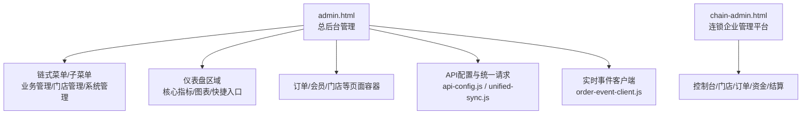
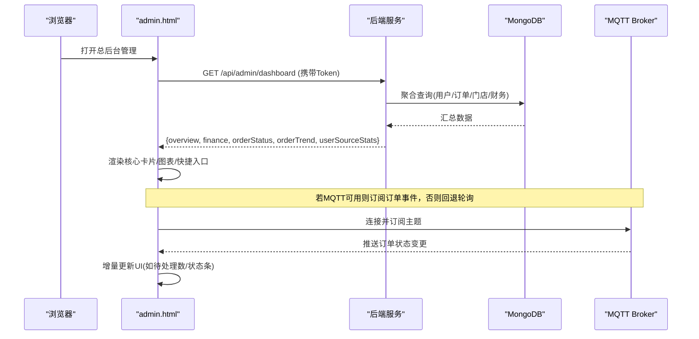
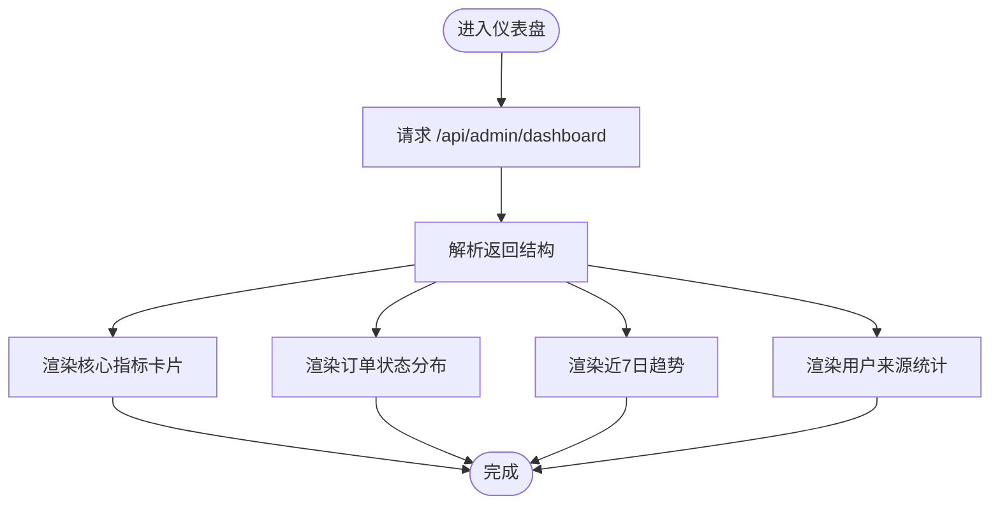
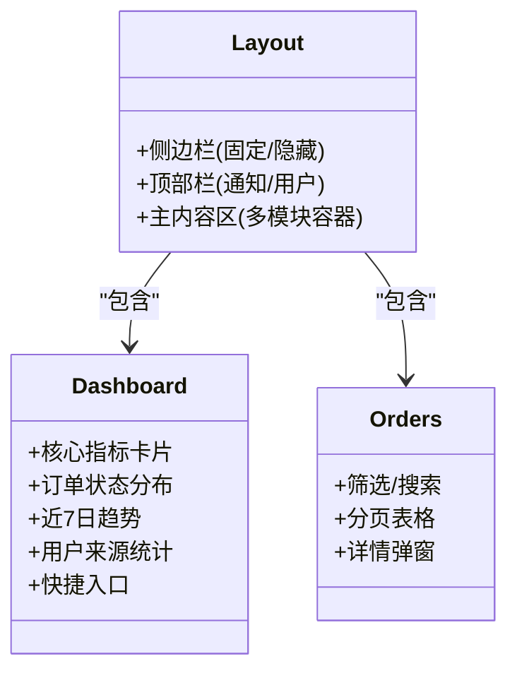
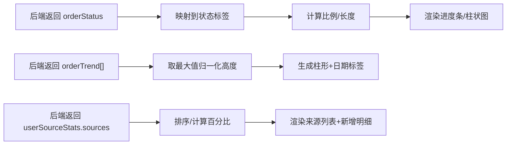
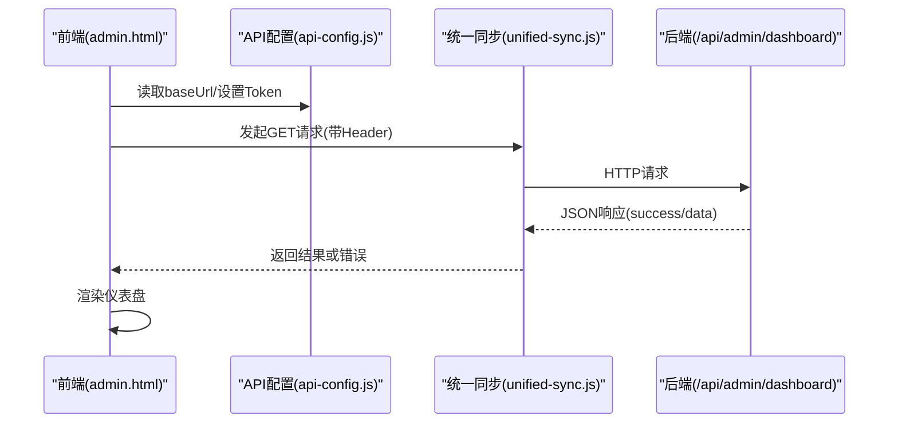
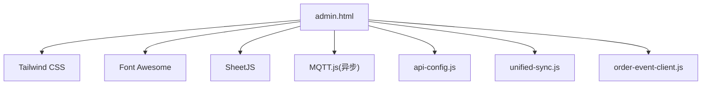

# 管理员仪表盘界面

<cite>
**本文引用的文件**
- [admin.html](file://admin.html)
- [chain-admin.html](file://chain-admin.html)
- [adminService.js](file://backend/modules/admin/services/adminService.js)
- [api-config.js](file://js/api-config.js)
- [unified-sync.js](file://js/unified-sync.js)
- [order-event-client.js](file://js/order-event-client.js)
</cite>

## 目录
1. [简介](#简介)
2. [项目结构](#项目结构)
3. [核心组件](#核心组件)
4. [架构总览](#架构总览)
5. [详细组件分析](#详细组件分析)
6. [依赖分析](#依赖分析)
7. [性能考虑](#性能考虑)
8. [故障排查指南](#故障排查指南)
9. [结论](#结论)
10. [附录](#附录)

## 简介
本文件面向前端开发者，系统化梳理“总后台管理系统”的仪表盘能力与实现方案。内容覆盖：
- 实时数据展示、业务概览统计、快捷操作入口
- 响应式布局（侧边栏导航、主内容区、移动端适配）
- 数据可视化（订单状态分布、近7日趋势、用户来源统计等）
- API集成（数据获取、实时更新、错误处理）
- UI组件复用策略（卡片、表格、模态框）
- 性能优化建议（缓存、懒加载、虚拟滚动）
并提供可落地的开发指南与最佳实践。

## 项目结构
总后台管理以单页应用形式组织，通过侧边栏切换不同模块页面，仪表盘作为默认首页，聚合关键指标与图表。连锁企业管理平台提供独立登录与多门店视角的数据看板。

图示来源
- [admin.html:58-288](file://admin.html#L58-L288)
- [chain-admin.html:218-261](file://chain-admin.html#L218-L261)

章节来源
- [admin.html:58-288](file://admin.html#L58-L288)
- [chain-admin.html:218-261](file://chain-admin.html#L218-L261)

## 核心组件
- 侧边栏导航：支持多级折叠、高亮当前项、移动端滑出/收起
- 顶部工具栏：通知、用户信息、刷新时间戳
- 仪表盘核心卡片：消费者用户、日活/月活、新增用户、活跃门店、总订单、今日订单、总营收
- 可视化面板：订单状态分布、近7日订单趋势、用户来源统计
- 业务模块快捷入口：按功能模块快速跳转
- 订单/会员/门店等列表页：筛选、搜索、分页、详情弹窗
- 连锁管理控制台：多门店聚合指标、趋势图、排行、资金与结算中心

章节来源
- [admin.html:317-443](file://admin.html#L317-L443)
- [admin.html:445-566](file://admin.html#L445-L566)
- [admin.html:584-736](file://admin.html#L584-L736)
- [chain-admin.html:264-344](file://chain-admin.html#L264-L344)

## 架构总览
前后端交互采用REST风格，仪表盘通过后端聚合接口一次性返回多维指标；同时引入MQTT异步消息通道用于订单事件实时推送，失败时自动降级为轮询。

图示来源
- [admin.html:5691-5720](file://admin.html#L5691-L5720)
- [adminService.js:289-322](file://backend/modules/admin/services/adminService.js#L289-L322)
- [admin.html:13-17](file://admin.html#L13-L17)

章节来源
- [admin.html:5691-5720](file://admin.html#L5691-L5720)
- [adminService.js:289-322](file://backend/modules/admin/services/adminService.js#L289-L322)

## 详细组件分析

### 仪表盘数据流与渲染
- 数据获取：调用后端聚合接口，解析overview/finance/orderStatus/orderTrend/userSourceStats
- 核心指标：填充用户、DAU/MAU、新增、门店、订单、营收等数字
- 订单状态分布：将后端状态计数映射为进度条/柱状图
- 近7日趋势：根据每日订单量计算柱高，点击可跳转到当日订单过滤视图
- 用户来源统计：按来源维度统计总量与新增，显示占比与明细

图示来源
- [admin.html:5691-5720](file://admin.html#L5691-L5720)
- [admin.html:5747-5786](file://admin.html#L5747-L5786)
- [admin.html:5786-5822](file://admin.html#L5786-L5822)

章节来源
- [admin.html:5691-5720](file://admin.html#L5691-L5720)
- [admin.html:5747-5786](file://admin.html#L5747-L5786)
- [admin.html:5786-5822](file://admin.html#L5786-L5822)

### 响应式布局与导航
- 桌面端：固定左侧侧边栏+右侧主内容区
- 平板/手机：侧边栏隐藏，通过按钮滑出；主内容自适应宽度
- 网格系统：使用Tailwind栅格在2/4/8列间自适应切换
- 交互细节：悬停位移、阴影增强、过渡动画

图示来源
- [admin.html:58-288](file://admin.html#L58-L288)
- [admin.html:317-443](file://admin.html#L317-L443)
- [admin.html:445-566](file://admin.html#L445-L566)

章节来源
- [admin.html:58-288](file://admin.html#L58-L288)
- [admin.html:317-443](file://admin.html#L317-L443)
- [admin.html:445-566](file://admin.html#L445-L566)

### 数据可视化组件
- 订单状态分布：基于后端orderStatus键值对渲染条形/进度条
- 近7日趋势：根据orderTrend数组计算柱高，支持点击跳转当日订单
- 用户来源统计：按来源维度展示总量、占比、今日/本周/本月新增

图示来源
- [admin.html:5747-5786](file://admin.html#L5747-L5786)
- [admin.html:5786-5822](file://admin.html#L5786-L5822)

章节来源
- [admin.html:5747-5786](file://admin.html#L5747-L5786)
- [admin.html:5786-5822](file://admin.html#L5786-L5822)

### API集成方案
- 认证与基础地址：通过全局API配置注入baseUrl与Token
- 仪表盘接口：GET /api/admin/dashboard，返回overview/finance/orderStatus/orderTrend/userSourceStats
- 统一请求封装：统一添加Authorization头、超时控制、错误日志
- 实时事件：优先使用MQTT订阅订单事件，失败时降级为轮询

图示来源
- [api-config.js:196-224](file://js/api-config.js#L196-L224)
- [unified-sync.js:150-190](file://js/unified-sync.js#L150-L190)
- [admin.html:5691-5720](file://admin.html#L5691-L5720)

章节来源
- [api-config.js:196-224](file://js/api-config.js#L196-L224)
- [unified-sync.js:150-190](file://js/unified-sync.js#L150-L190)
- [admin.html:5691-5720](file://admin.html#L5691-L5720)

### 实时更新机制
- 优先路径：页面加载后尝试连接MQTT，订阅订单相关主题，收到消息后增量更新UI
- 降级路径：若MQTT脚本加载失败或连接异常，启用定时轮询拉取最新数据
- 用户体验：在顶部显示更新时间戳，避免频繁全量刷新造成闪烁

章节来源
- [admin.html:13-17](file://admin.html#L13-L17)
- [admin.html:5691-5720](file://admin.html#L5691-L5720)
- [order-event-client.js](file://js/order-event-client.js)

### UI组件复用策略
- 卡片组件：统一的圆角、阴影、悬停效果，图标+标题+数值+说明文案
- 表格组件：表头固定、横向滚动、空状态占位、行悬停高亮
- 模态框组件：遮罩层、点击外部关闭、内部阻止冒泡、滚动隔离
- 颜色体系：通过Tailwind自定义色板保持品牌一致性

章节来源
- [admin.html:333-399](file://admin.html#L333-L399)
- [admin.html:540-566](file://admin.html#L540-L566)
- [admin.html:569-581](file://admin.html#L569-L581)

### 连锁管理控制台（对比参考）
- 登录鉴权：独立登录流程，成功后加载连锁信息与控制台数据
- 控制台指标：门店总数、活跃门店、今日订单、今日营收、日新增用户
- 趋势与排行：近7天订单趋势、门店营收排行
- 资金管理：流水、趋势、分布、门店资金统计
- 结算中心：结算单列表、明细、权限管理

章节来源
- [chain-admin.html:686-787](file://chain-admin.html#L686-L787)
- [chain-admin.html:789-843](file://chain-admin.html#L789-L843)
- [chain-admin.html:1201-1486](file://chain-admin.html#L1201-L1486)
- [chain-admin.html:1492-1599](file://chain-admin.html#L1492-L1599)

## 依赖分析
- 前端依赖
  - Tailwind CSS：样式与响应式布局
  - Font Awesome：图标库
  - SheetJS：Excel导入导出
  - MQTT.js：实时消息（异步加载，失败不影响页面）
- 运行时依赖
  - API配置与统一请求封装
  - 订单事件客户端（可选）

图示来源
- [admin.html:8-17](file://admin.html#L8-L17)
- [api-config.js:196-224](file://js/api-config.js#L196-L224)
- [unified-sync.js:150-190](file://js/unified-sync.js#L150-L190)
- [order-event-client.js](file://js/order-event-client.js)

章节来源
- [admin.html:8-17](file://admin.html#L8-L17)
- [api-config.js:196-224](file://js/api-config.js#L196-L224)
- [unified-sync.js:150-190](file://js/unified-sync.js#L150-L190)
- [order-event-client.js](file://js/order-event-client.js)

## 性能考虑
- 数据缓存
  - 对仪表盘聚合数据做短时内存缓存，减少重复请求
  - 对静态资源（图标、字体）开启浏览器缓存
- 懒加载
  - 非首屏模块（如订单/会员/门店）按需加载与渲染
  - 图表仅在可见时初始化，避免无谓计算
- 虚拟滚动
  - 大数据表格采用虚拟滚动，仅渲染可视区域行
- 增量更新
  - 通过MQTT推送进行局部DOM更新，避免整页刷新
- 网络优化
  - 统一超时与重试策略，失败快速回退
  - 合并请求，减少并发压力

[本节为通用指导，不直接分析具体文件]

## 故障排查指南
- 无法连接后端
  - 检查API_BASE_URL与Token是否正确注入
  - 查看网络面板是否返回401/403/5xx
- 仪表盘数据为空
  - 确认后端聚合接口返回success与data字段完整
  - 检查数据库连接与索引是否正常
- 实时事件未生效
  - 检查MQTT脚本是否成功加载（onload/onerror回调）
  - 若失败，确认已启用轮询降级逻辑
- 图表不渲染
  - 检查对应容器ID是否存在且可见
  - 确认数据格式符合预期（数组/对象键值）

章节来源
- [admin.html:13-17](file://admin.html#L13-L17)
- [admin.html:5691-5720](file://admin.html#L5691-L5720)
- [unified-sync.js:150-190](file://js/unified-sync.js#L150-L190)

## 结论
总后台管理仪表盘以聚合接口为核心，结合MQTT实时推送，实现了高可读性的业务概览与高效的操作体验。通过响应式布局与组件化设计，兼顾了桌面与移动端的可用性。建议在后续迭代中持续完善缓存与虚拟化策略，进一步提升大数据场景下的流畅度与稳定性。

[本节为总结性内容，不直接分析具体文件]

## 附录
- 开发建议
  - 统一错误提示与日志埋点，便于定位问题
  - 为所有图表增加空状态与错误状态占位
  - 为敏感操作增加二次确认与权限校验
- 扩展方向
  - 接入更多维度的KPI与自定义报表
  - 引入更丰富的交互（拖拽排序、批量操作）
  - 强化审计与合规记录

[本节为通用指导，不直接分析具体文件]