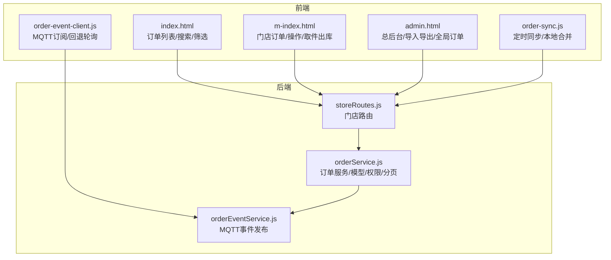
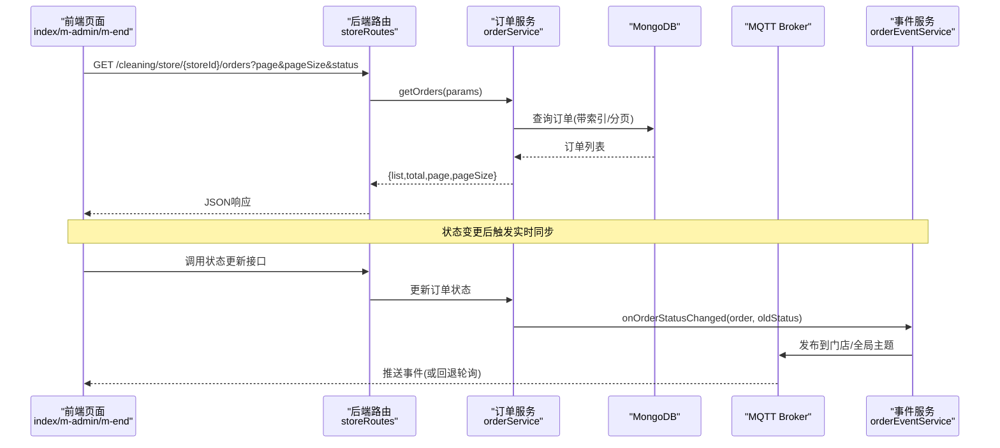
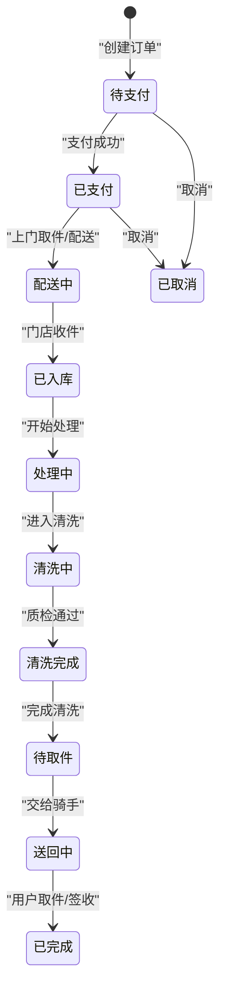
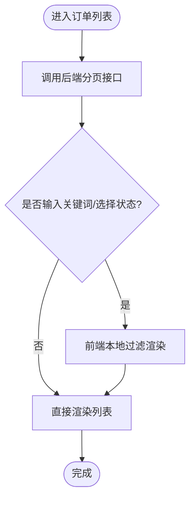
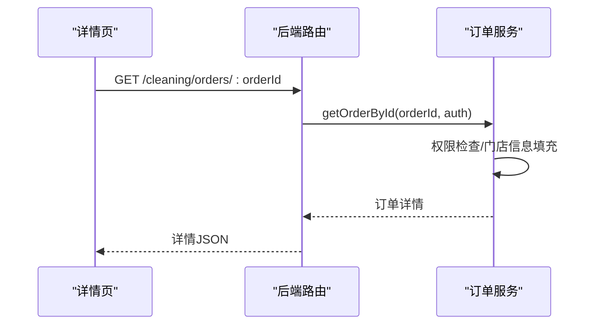
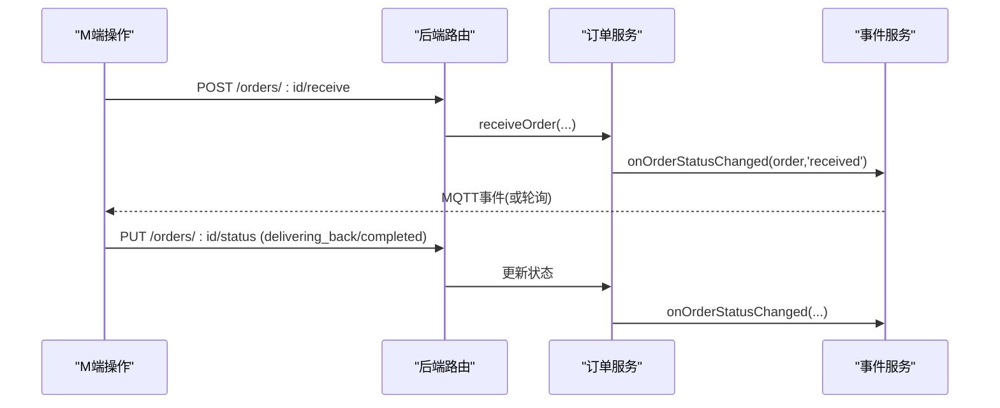
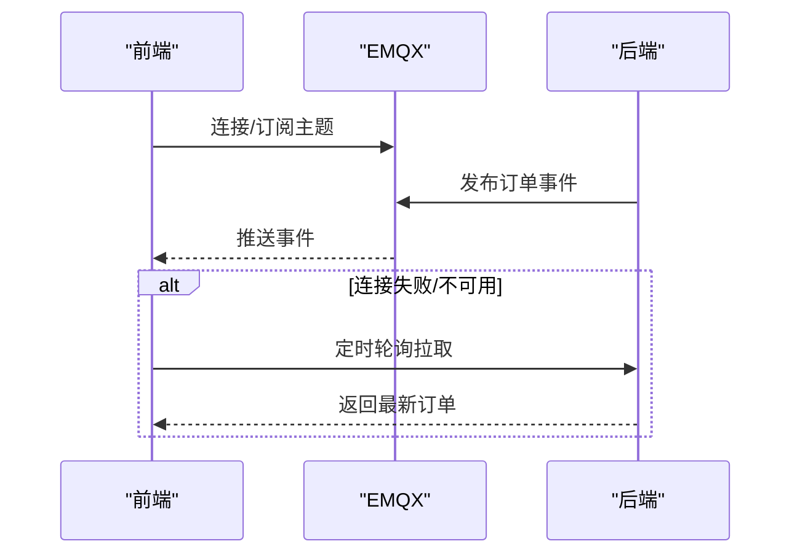
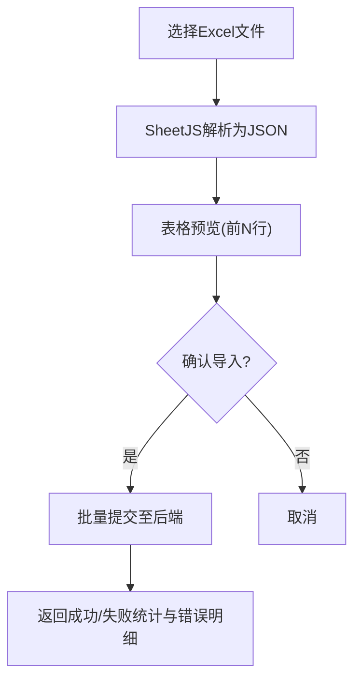
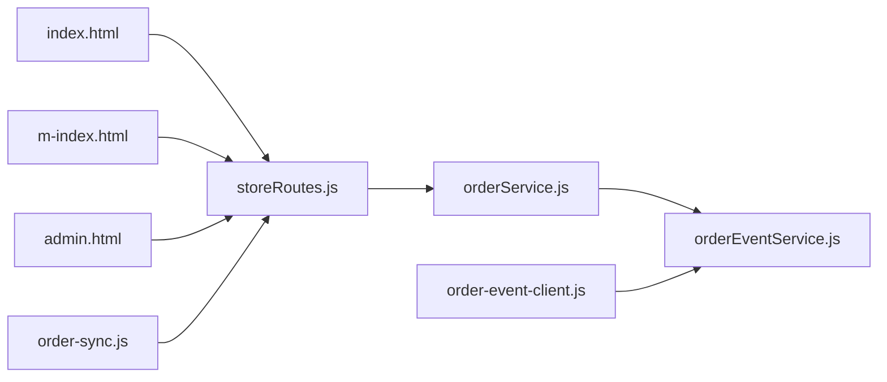

# 订单管理界面

<cite>
**本文引用的文件**   
- [orderService.js](file://backend/modules/cleaning/services/orderService.js)
- [storeRoutes.js](file://backend/modules/cleaning/routes/storeRoutes.js)
- [orderEventService.js](file://backend/services/orderEventService.js)
- [order-sync.js](file://js/order-sync.js)
- [order-event-client.js](file://js/order-event-client.js)
- [index.html](file://index.html)
- [m-index.html](file://m-index.html)
- [admin.html](file://admin.html)
</cite>

## 目录
1. [简介](#简介)
2. [项目结构](#项目结构)
3. [核心组件](#核心组件)
4. [架构总览](#架构总览)
5. [详细组件分析](#详细组件分析)
6. [依赖关系分析](#依赖关系分析)
7. [性能与优化](#性能与优化)
8. [故障排查指南](#故障排查指南)
9. [结论](#结论)
10. [附录](#附录)

## 简介
本文件面向“订单管理界面”的开发者与实施人员，系统性梳理订单列表展示、筛选搜索、状态流转、实时同步、导出等关键能力，并给出数据模型、接口契约、前端交互流程与后端处理逻辑的完整说明。文档同时提供架构图、时序图与流程图，帮助快速理解与扩展。

## 项目结构
围绕订单管理的代码分布在前后端多处：
- 后端服务层：订单领域模型与服务方法（创建、查询、支付、取消、收件、处理、完成、删除等）
- 路由层：门店相关路由（含订单按门店获取等）
- 事件服务：基于 MQTT 的订单事件发布（跨端实时同步）
- 前端页面：门店端（m-index）、总后台（admin）、通用管理页（index）
- 前端同步模块：轮询/合并策略与 MQTT 客户端

图表来源
- [index.html:6048-6206](file://index.html#L6048-L6206)
- [m-index.html:8000-8500](file://m-index.html#L8000-L8500)
- [admin.html:2870-3042](file://admin.html#L2870-L3042)
- [order-sync.js:74-194](file://js/order-sync.js#L74-L194)
- [order-event-client.js:118-178](file://js/order-event-client.js#L118-L178)
- [storeRoutes.js:1-194](file://backend/modules/cleaning/routes/storeRoutes.js#L1-L194)
- [orderService.js:296-389](file://backend/modules/cleaning/services/orderService.js#L296-L389)
- [orderEventService.js:69-144](file://backend/services/orderEventService.js#L69-L144)

章节来源
- [index.html:6048-6206](file://index.html#L6048-L6206)
- [m-index.html:8000-8500](file://m-index.html#L8000-L8500)
- [admin.html:2870-3042](file://admin.html#L2870-L3042)
- [order-sync.js:74-194](file://js/order-sync.js#L74-L194)
- [order-event-client.js:118-178](file://js/order-event-client.js#L118-L178)
- [storeRoutes.js:1-194](file://backend/modules/cleaning/routes/storeRoutes.js#L1-L194)
- [orderService.js:296-389](file://backend/modules/cleaning/services/orderService.js#L296-L389)
- [orderEventService.js:69-144](file://backend/services/orderEventService.js#L69-L144)

## 核心组件
- 订单数据模型与状态机
  - 字段覆盖：订单基本信息、客户信息、门店信息、配送与骑手、支付、清洗进度、状态历史等
  - 状态枚举：pending/paid/delivering/received/processing/cleaning/cleaned/ready/delivering_back/completed/cancelled 及若干中间态
- 订单服务
  - 创建、分页查询（支持用户/手机号/门店角色过滤）、详情（兼容 _id 与 orderNo）、支付、取消、软删除、收件、开始处理、完成等
- 事件服务
  - 通过 MQTT 发布订单事件（门店级与全局主题），并写入通知中心与跨端同步记录
- 前端同步与实时
  - 轮询同步（OrderSyncManager）+ MQTT 实时订阅（OrderEventClient），失败自动降级为轮询
- 页面功能
  - index.html：订单列表渲染、搜索、状态筛选
  - m-index.html：门店订单操作（确认收货、出库、确认取件、联系骑手、状态更新）
  - admin.html：批量导入模板与结果展示（用于门店/数据导入场景）

章节来源
- [orderService.js:33-151](file://backend/modules/cleaning/services/orderService.js#L33-L151)
- [orderService.js:177-291](file://backend/modules/cleaning/services/orderService.js#L177-L291)
- [orderService.js:296-389](file://backend/modules/cleaning/services/orderService.js#L296-L389)
- [orderService.js:395-516](file://backend/modules/cleaning/services/orderService.js#L395-L516)
- [orderService.js:521-616](file://backend/modules/cleaning/services/orderService.js#L521-L616)
- [orderService.js:667-715](file://backend/modules/cleaning/services/orderService.js#L667-L715)
- [orderService.js:721-757](file://backend/modules/cleaning/services/orderService.js#L721-L757)
- [orderService.js:763-800](file://backend/modules/cleaning/services/orderService.js#L763-L800)
- [orderEventService.js:69-144](file://backend/services/orderEventService.js#L69-L144)
- [order-sync.js:74-194](file://js/order-sync.js#L74-L194)
- [order-event-client.js:118-178](file://js/order-event-client.js#L118-L178)
- [index.html:6048-6206](file://index.html#L6048-L6206)
- [m-index.html:8000-8500](file://m-index.html#L8000-L8500)
- [admin.html:2870-3042](file://admin.html#L2870-L3042)

## 架构总览
订单管理采用“前端多端 + 后端服务 + MQTT 实时事件”的分层架构。前端通过 REST 拉取订单数据，结合 MQTT 推送实现低延迟刷新；后端在服务层统一封装业务规则与权限校验，并通过事件服务广播变更。

图表来源
- [storeRoutes.js:1-194](file://backend/modules/cleaning/routes/storeRoutes.js#L1-L194)
- [orderService.js:296-389](file://backend/modules/cleaning/services/orderService.js#L296-L389)
- [orderEventService.js:69-144](file://backend/services/orderEventService.js#L69-L144)
- [order-event-client.js:118-178](file://js/order-event-client.js#L118-L178)

## 详细组件分析

### 数据模型与状态机
- 订单主对象关键字段
  - 基本信息：orderNo、orderType、categoryId、userId、storeId、createdFrom、remark、isDeleted/deletedAt/deletedBy
  - 客户信息：customerPhone、customerName
  - 物品明细：items[]（itemId/name/itemType/serviceType/material/price/quantity/subtotal/specialReq/pickupCode/status）
  - 金额：amounts.subtotal/discount/deliveryFee/total
  - 配送：delivery.type/address/contactName/contactPhone/fee；courier.provider/name/phone/orderId/fee/status/progress/distance/eta/assignedAt/estimatedPickup/actualPickup/paidAt；deliveryMethod/selectedProvider/deliveryFee
  - 支付：payment.status/method/transactionId/paidAt
  - 清洗：cleaning.storeReceivedAt/storeCompletedAt/returnDate/qualityCheckPassed
  - 状态：status（含多种枚举）、statusHistory[]（status/time/actorId/note）
- 状态流转要点
  - pending → paid → delivering → received → processing → cleaning → cleaned → ready → delivering_back → completed
  - 支持取消与若干中间态（awaiting_pickup_scan/awaiting_store_outbound/store_outbound）
  - 每次状态变更均记录 history 并触发事件

图表来源
- [orderService.js:121-138](file://backend/modules/cleaning/services/orderService.js#L121-L138)
- [orderService.js:521-616](file://backend/modules/cleaning/services/orderService.js#L521-L616)
- [orderService.js:667-715](file://backend/modules/cleaning/services/orderService.js#L667-L715)
- [orderService.js:721-757](file://backend/modules/cleaning/services/orderService.js#L721-L757)
- [orderService.js:763-800](file://backend/modules/cleaning/services/orderService.js#L763-L800)

章节来源
- [orderService.js:33-151](file://backend/modules/cleaning/services/orderService.js#L33-L151)
- [orderService.js:121-138](file://backend/modules/cleaning/services/orderService.js#L121-L138)

### 订单列表与筛选搜索
- 列表加载
  - 门店端：按 storeId 拉取；管理员端：全量；C端：按 userId/phone
  - 服务端返回分页结构 {list,total,page,pageSize,totalPages}
- 搜索与筛选
  - 前端：关键词匹配（订单号/姓名/电话）、状态下拉筛选
  - 后端：支持 status、storeId、customerPhone 等条件过滤
- 门店信息填充
  - 根据 storeId（实际存储为 storeNo）批量查询 Store 并回填 store/storeName/storeAddress 等

图表来源
- [index.html:6048-6206](file://index.html#L6048-L6206)
- [orderService.js:296-389](file://backend/modules/cleaning/services/orderService.js#L296-L389)

章节来源
- [index.html:6048-6206](file://index.html#L6048-L6206)
- [orderService.js:296-389](file://backend/modules/cleaning/services/orderService.js#L296-L389)

### 订单详情查看
- 支持通过 _id 或 orderNo 查询
- 权限校验：customer 仅能看自己的订单；store_staff/store_owner 仅能看所属门店订单
- 自动填充门店信息与状态描述、最新动态

图表来源
- [orderService.js:395-516](file://backend/modules/cleaning/services/orderService.js#L395-L516)

章节来源
- [orderService.js:395-516](file://backend/modules/cleaning/services/orderService.js#L395-L516)

### 状态更新与业务流程
- 支付：pending → paid，记录支付方式与时间，发送通知与事件
- 取消：pending/paid 可取消，必要时标记退款
- 收件：paid/delivering → received，记录入库时间
- 开始处理：received → processing
- 完成清洗：processing → ready，设置完成时间与取件时间
- 出库/取件：ready → delivering_back → completed（M端分支：自提/跑腿）

图表来源
- [orderService.js:521-616](file://backend/modules/cleaning/services/orderService.js#L521-L616)
- [orderService.js:667-715](file://backend/modules/cleaning/services/orderService.js#L667-L715)
- [orderService.js:721-757](file://backend/modules/cleaning/services/orderService.js#L721-L757)
- [orderService.js:763-800](file://backend/modules/cleaning/services/orderService.js#L763-L800)
- [orderEventService.js:69-144](file://backend/services/orderEventService.js#L69-L144)
- [m-index.html:8000-8500](file://m-index.html#L8000-L8500)

章节来源
- [orderService.js:521-616](file://backend/modules/cleaning/services/orderService.js#L521-L616)
- [orderService.js:667-715](file://backend/modules/cleaning/services/orderService.js#L667-L715)
- [orderService.js:721-757](file://backend/modules/cleaning/services/orderService.js#L721-L757)
- [orderService.js:763-800](file://backend/modules/cleaning/services/orderService.js#L763-L800)
- [m-index.html:8000-8500](file://m-index.html#L8000-L8500)

### 实时同步机制（MQTT + 轮询回退）
- 后端事件发布
  - 订单创建/支付/取消/状态变更时，向门店级与全局主题发布消息
- 前端订阅
  - OrderEventClient 连接 EMQX WebSocket，订阅对应主题；若 mqtt.js 不可用或连接失败，自动降级为轮询
- 轮询同步
  - OrderSyncManager 定时从后端拉取最新订单，合并到 localStorage，并触发页面更新

图表来源
- [orderEventService.js:69-144](file://backend/services/orderEventService.js#L69-L144)
- [order-event-client.js:118-178](file://js/order-event-client.js#L118-L178)
- [order-sync.js:74-194](file://js/order-sync.js#L74-L194)

章节来源
- [orderEventService.js:69-144](file://backend/services/orderEventService.js#L69-L144)
- [order-event-client.js:118-178](file://js/order-event-client.js#L118-L178)
- [order-sync.js:74-194](file://js/order-sync.js#L74-L194)

### 订单导出与导入
- 导出（Excel）
  - 使用 SheetJS 在浏览器端生成 Excel 文件并下载（参考 admin.html 中的导入/导出模板与解析逻辑）
- 导入（Excel）
  - 支持 .xlsx/.xls/.csv 上传、预览、批量提交，返回成功/失败统计与错误行定位

图表来源
- [admin.html:2870-3042](file://admin.html#L2870-L3042)

章节来源
- [admin.html:2870-3042](file://admin.html#L2870-L3042)

## 依赖关系分析
- 组件耦合
  - 路由层依赖服务层；服务层依赖数据库与事件服务；前端依赖路由与事件服务
- 外部依赖
  - MongoDB（订单/门店数据）
  - EMQX（MQTT Broker）
  - SheetJS（Excel 解析）
- 潜在循环依赖
  - 事件服务延迟加载 lightService/notificationHub/crossSync/messageService，避免循环依赖

图表来源
- [storeRoutes.js:1-194](file://backend/modules/cleaning/routes/storeRoutes.js#L1-L194)
- [orderService.js:296-389](file://backend/modules/cleaning/services/orderService.js#L296-L389)
- [orderEventService.js:69-144](file://backend/services/orderEventService.js#L69-L144)
- [index.html:6048-6206](file://index.html#L6048-L6206)
- [m-index.html:8000-8500](file://m-index.html#L8000-L8500)
- [admin.html:2870-3042](file://admin.html#L2870-L3042)
- [order-sync.js:74-194](file://js/order-sync.js#L74-L194)
- [order-event-client.js:118-178](file://js/order-event-client.js#L118-L178)

章节来源
- [storeRoutes.js:1-194](file://backend/modules/cleaning/routes/storeRoutes.js#L1-L194)
- [orderService.js:296-389](file://backend/modules/cleaning/services/orderService.js#L296-L389)
- [orderEventService.js:69-144](file://backend/services/orderEventService.js#L69-L144)
- [index.html:6048-6206](file://index.html#L6048-L6206)
- [m-index.html:8000-8500](file://m-index.html#L8000-L8500)
- [admin.html:2870-3042](file://admin.html#L2870-L3042)
- [order-sync.js:74-194](file://js/order-sync.js#L74-L194)
- [order-event-client.js:118-178](file://js/order-event-client.js#L118-L178)

## 性能与优化
- 分页与索引
  - 列表查询使用 page/pageSize 分页；对 orderNo、userId、storeId、status、isDeleted 建立索引以提升查询效率
- 并发与批处理
  - 列表返回后批量填充门店信息，减少 N+1 查询
- 前端渲染
  - 列表渲染采用局部更新与虚拟滚动（建议）；搜索与筛选优先本地过滤，减少请求
- 实时通道
  - 优先 MQTT 推送；失败自动降级轮询，避免阻塞
- 大数据量
  - 建议后端增加时间范围、门店维度聚合查询；前端按需加载与懒渲染

[本节为通用指导，不直接分析具体文件]

## 故障排查指南
- 认证失败（401）
  - 检查 Token 是否过期或丢失；确保 Authorization 头正确携带
- 无权限查看订单
  - 确认当前用户角色与订单归属（用户ID/门店ID）一致
- MQTT 未连接
  - 检查 EMQX 端口与证书配置；观察前端日志，确认是否回退到轮询
- 列表为空
  - 检查查询参数（userId/phone/storeId/status）；确认 isDeleted 过滤逻辑
- 状态不一致
  - 核对事件是否发布成功；检查前端合并策略与本地缓存键名

章节来源
- [order-sync.js:183-194](file://js/order-sync.js#L183-L194)
- [orderService.js:395-516](file://backend/modules/cleaning/services/orderService.js#L395-L516)
- [order-event-client.js:190-217](file://js/order-event-client.js#L190-L217)

## 结论
本方案以清晰的数据模型与状态机为基础，结合 REST 与 MQTT 的双通道同步，实现了订单管理的高效、可靠与可扩展。前端提供完善的列表、搜索、筛选与操作流程，后端保障权限与一致性，事件服务确保多端实时联动。建议在后续迭代中引入更细粒度的权限控制、审计日志与性能监控，进一步提升系统稳定性与可观测性。

[本节为总结性内容，不直接分析具体文件]

## 附录
- 常用接口路径（示例）
  - 获取门店订单：GET /api/cleaning/store/{storeId}/orders
  - 获取订单详情：GET /api/cleaning/orders/{orderId}
  - 支付订单：POST /api/cleaning/orders/{orderId}/pay
  - 取消订单：POST /api/cleaning/orders/{orderId}/cancel
  - 门店收件：POST /api/cleaning/orders/{orderId}/receive
  - 更新状态：PUT /api/cleaning/orders/{orderId}/status
- 前端入口
  - 门店端：m-index.html
  - 总后台：admin.html
  - 通用管理：index.html

[本节为补充信息，不直接分析具体文件]