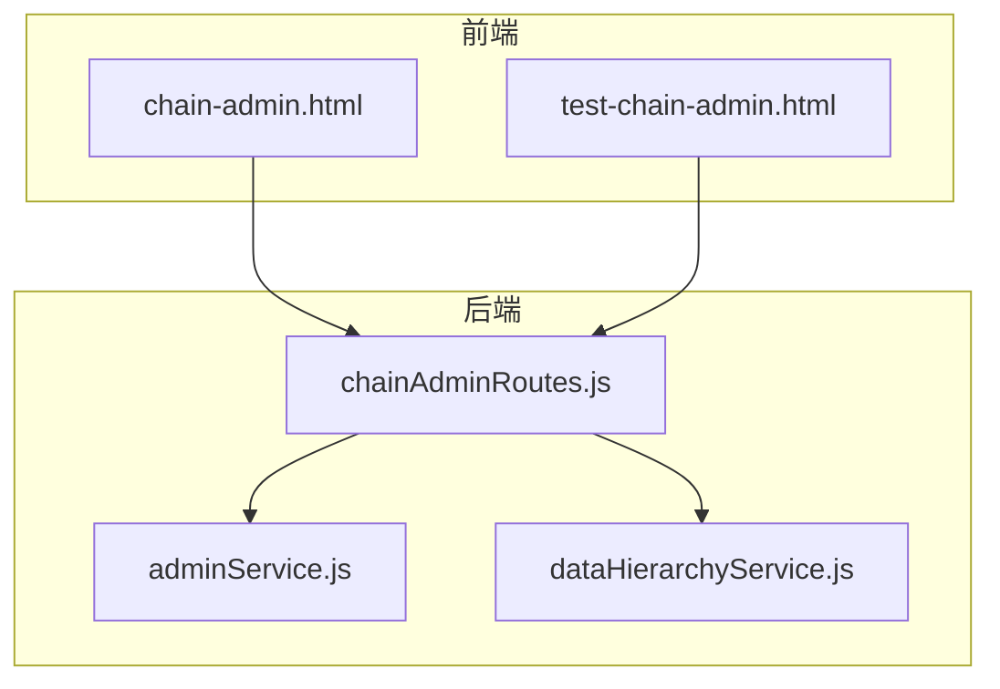
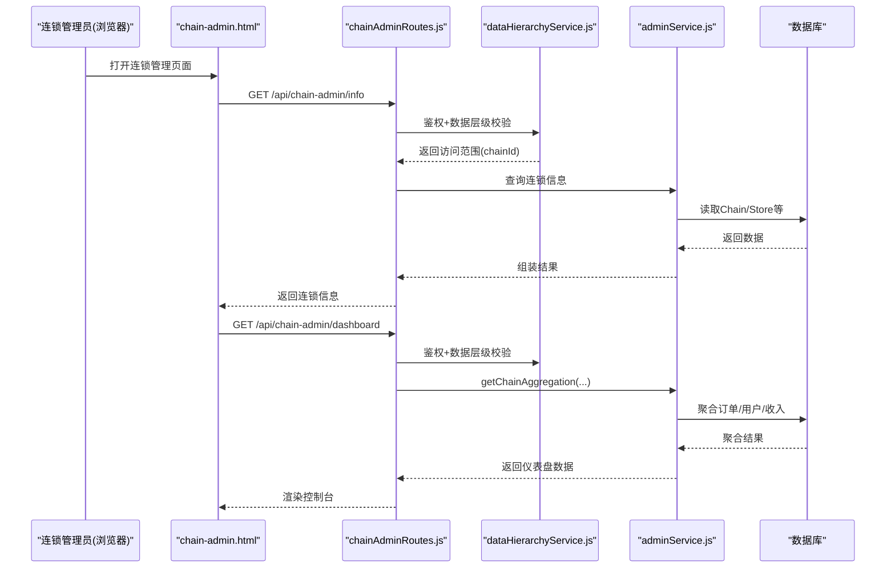
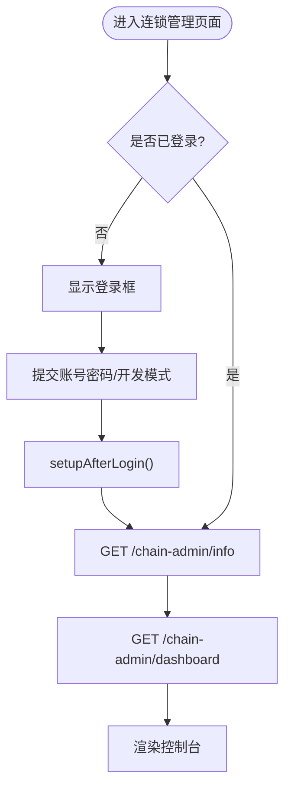
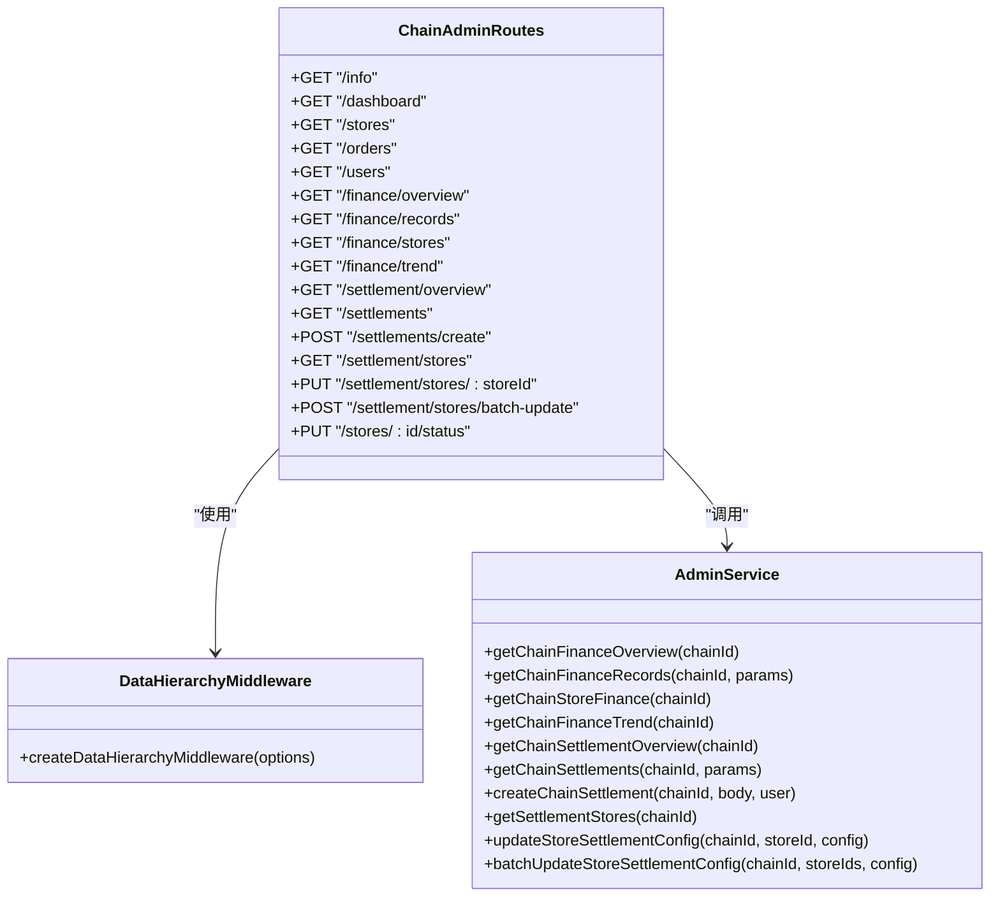
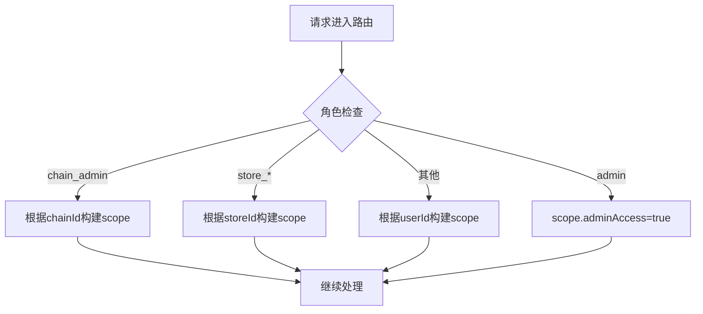
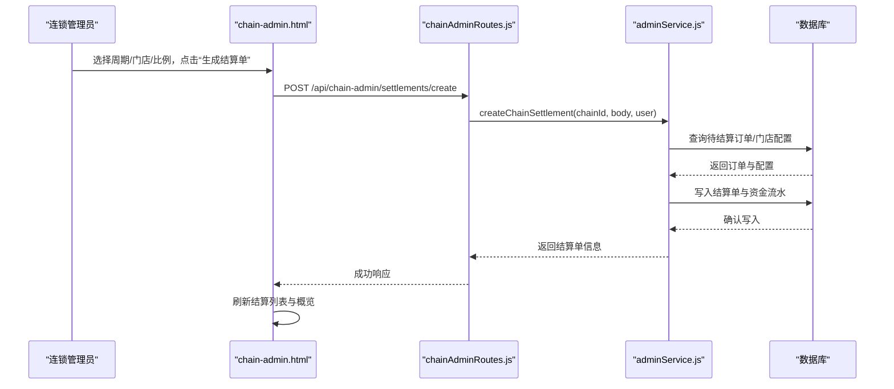
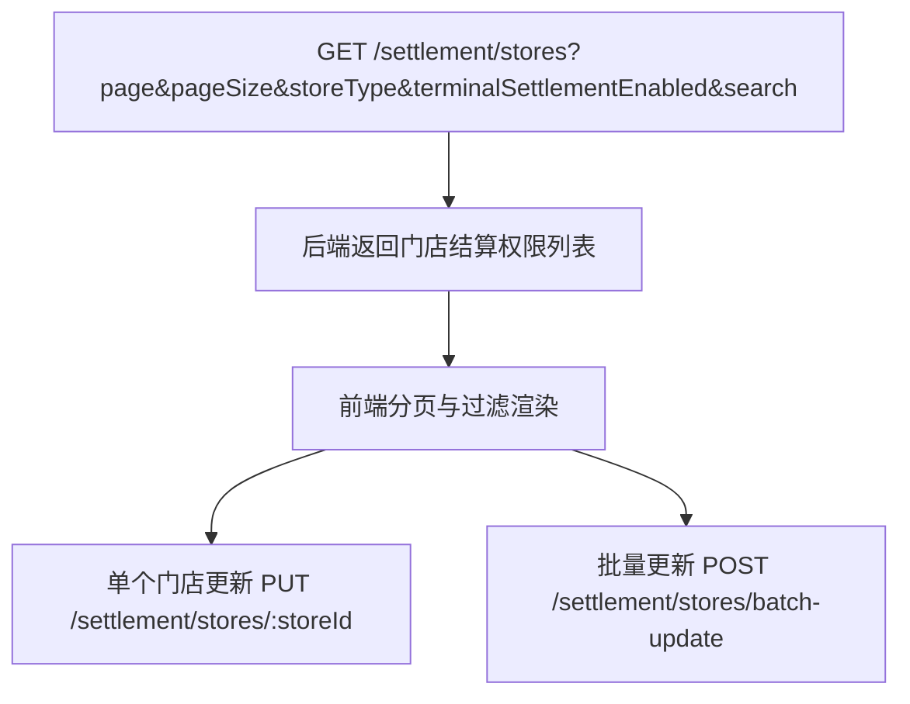
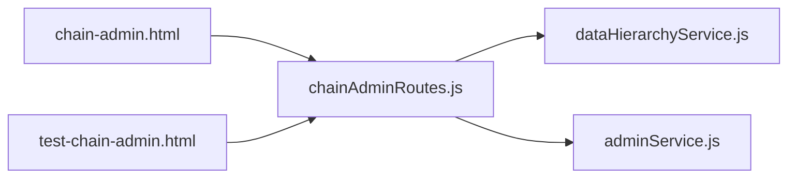

# 连锁管理平台界面

<cite>
**本文引用的文件**   
- [chain-admin.html](file://chain-admin.html)
- [CHAIN_ADMIN_PLATFORM.md](file://CHAIN_ADMIN_PLATFORM.md)
- [backend/modules/admin/routes/chainAdminRoutes.js](file://backend/modules/admin/routes/chainAdminRoutes.js)
- [backend/modules/common/services/dataHierarchyService.js](file://backend/modules/common/services/dataHierarchyService.js)
- [backend/modules/admin/services/adminService.js](file://backend/modules/admin/services/adminService.js)
- [test-chain-admin.html](file://test-chain-admin.html)
- [资金管理与结算中心使用指南.md](file://资金管理与结算中心使用指南.md)
</cite>

## 目录
1. [简介](#简介)
2. [项目结构](#项目结构)
3. [核心组件](#核心组件)
4. [架构总览](#架构总览)
5. [详细组件分析](#详细组件分析)
6. [依赖关系分析](#依赖关系分析)
7. [性能与可用性](#性能与可用性)
8. [故障排查指南](#故障排查指南)
9. [结论](#结论)
10. [附录](#附录)

## 简介
本文件面向“干洗系统”的连锁企业管理平台，聚焦前端界面与后端支撑能力，覆盖连锁企业管控、多门店管理、数据分析、财务结算、供应链与数据同步等高级功能。文档以用户可理解的方式解释总部-分公司-门店层级、数据隔离策略、权限继承机制，并给出关键流程的可视化说明与排障建议。

## 项目结构
- 前端入口：连锁管理页面 chain-admin.html，提供控制台、门店管理、订单管理、员工管理、数据分析、资金管理、结算中心与企业设置等模块。
- 后端路由：chainAdminRoutes.js 暴露 /api/chain-admin/* 系列接口，统一鉴权与数据层级访问控制。
- 权限与聚合：dataHierarchyService.js 提供数据层级中间件与跨层级聚合服务；adminService.js 提供业务服务（含资金、结算等）。
- 测试与文档：test-chain-admin.html 用于快速验证 API；CHAIN_ADMIN_PLATFORM.md 与“资金管理与结算中心使用指南.md”提供使用说明与模型定义。

图表来源
- [chain-admin.html](file://chain-admin.html)
- [backend/modules/admin/routes/chainAdminRoutes.js](file://backend/modules/admin/routes/chainAdminRoutes.js)
- [backend/modules/admin/services/adminService.js](file://backend/modules/admin/services/adminService.js)
- [backend/modules/common/services/dataHierarchyService.js](file://backend/modules/common/services/dataHierarchyService.js)
- [test-chain-admin.html](file://test-chain-admin.html)

章节来源
- [chain-admin.html](file://chain-admin.html)
- [CHAIN_ADMIN_PLATFORM.md](file://CHAIN_ADMIN_PLATFORM.md)

## 核心组件
- 连锁管理前端页面（chain-admin.html）
  - 登录与角色识别：支持开发模式与真实登录，登录后根据用户角色加载连锁信息。
  - 控制台仪表盘：展示门店总数、活跃门店、今日订单、今日营收、日新增用户、近30天指标与趋势图、门店排行。
  - 门店管理：列表、状态切换（启用/停用）、进入门店管理页。
  - 订单管理：按状态/门店/关键词筛选，分页展示。
  - 员工管理：展示连锁管理员与各门店员工汇总。
  - 数据分析：门店订单对比、月度营收概览。
  - 资金管理：资金概览、流水记录、门店资金统计、资金趋势。
  - 结算中心：结算概览、创建结算单、结算单列表、门店结算权限管理（类型、终端结算开关、结算比例、批量设置）。
  - 企业设置：企业名称、电话、地址、订阅套餐只读展示。

- 连锁后台路由（chainAdminRoutes.js）
  - 统一鉴权与角色校验：所有链管接口需 chain_admin 角色。
  - 数据层级中间件：createDataHierarchyMiddleware 确保仅能访问自身连锁数据。
  - 主要接口：info、dashboard、stores、orders、users、finance/*、settlement/*、stores/:id/status 等。

- 数据层级与聚合（dataHierarchyService.js）
  - 数据层级中间件：基于角色构建 dataAccessScope（admin/chain/store/user）。
  - 数据同步服务：通过 MQTT 或轮询触发层级事件（user/order/store），更新各层级统计。
  - 数据聚合服务：getChainAggregation 聚合订单、用户、收入趋势与门店排名。

- 管理服务（adminService.js）
  - 提供连锁维度下的资金概览、流水、门店资金统计、趋势、结算概览与结算单管理等方法。
  - 内置 Chain/Store/User/Order 等模型定义，便于在本地环境运行。

章节来源
- [chain-admin.html](file://chain-admin.html)
- [backend/modules/admin/routes/chainAdminRoutes.js](file://backend/modules/admin/routes/chainAdminRoutes.js)
- [backend/modules/common/services/dataHierarchyService.js](file://backend/modules/common/services/dataHierarchyService.js)
- [backend/modules/admin/services/adminService.js](file://backend/modules/admin/services/adminService.js)

## 架构总览
连锁管理平台采用前后端分离架构，前端通过 REST API 获取连锁维度数据，后端通过数据层级中间件保障数据边界，结合聚合服务输出报表所需指标。

图表来源
- [chain-admin.html](file://chain-admin.html)
- [backend/modules/admin/routes/chainAdminRoutes.js](file://backend/modules/admin/routes/chainAdminRoutes.js)
- [backend/modules/common/services/dataHierarchyService.js](file://backend/modules/common/services/dataHierarchyService.js)
- [backend/modules/admin/services/adminService.js](file://backend/modules/admin/services/adminService.js)

## 详细组件分析

### 连锁前台界面（chain-admin.html）
- 导航与页面切换：侧边栏点击切换页面，动态更新标题与子标题，按需加载对应数据。
- 控制台：调用 dashboard 接口，渲染统计卡片、近7天订单趋势、门店营收排行。
- 门店管理：拉取 stores 列表，支持启用/停用门店（PUT /stores/:id/status），跳转门店管理页。
- 订单管理：支持关键词、状态、门店筛选与分页，自动填充门店下拉。
- 员工管理：拉取连锁及门店信息，展示各门店员工汇总。
- 数据分析：拉取门店列表与每日统计，绘制横向对比条与月度营收摘要。
- 资金管理：展示资金概览、流水、门店资金统计与分布，支持日期与类型筛选。
- 结算中心：展示结算概览、最近结算单、明细表格；支持创建结算单（周期、门店、比例）；支持门店结算权限管理（类型、终端结算开关、结算比例、批量设置）。
- 企业设置：只读展示企业信息与套餐。

图表来源
- [chain-admin.html](file://chain-admin.html)

章节来源
- [chain-admin.html](file://chain-admin.html)

### 连锁后台路由（chainAdminRoutes.js）
- 鉴权与角色：全局 requireRoles('chain_admin')，确保只有连锁管理员可访问。
- 数据层级：每个路由挂载 createDataHierarchyMiddleware，限定只能访问当前 chainId 的数据。
- 核心接口：
  - info：返回连锁基本信息。
  - dashboard：聚合当日/周/月指标与趋势。
  - stores/orders/users：分页、过滤、排序，补充关联信息（如门店名称）。
  - finance/*：资金概览、流水、门店资金统计、趋势。
  - settlement/*：结算概览、结算单列表、创建结算单、门店结算权限列表/更新/批量更新。
  - stores/:id/status：启用/停用门店。

图表来源
- [backend/modules/admin/routes/chainAdminRoutes.js](file://backend/modules/admin/routes/chainAdminRoutes.js)
- [backend/modules/common/services/dataHierarchyService.js](file://backend/modules/common/services/dataHierarchyService.js)
- [backend/modules/admin/services/adminService.js](file://backend/modules/admin/services/adminService.js)

章节来源
- [backend/modules/admin/routes/chainAdminRoutes.js](file://backend/modules/admin/routes/chainAdminRoutes.js)

### 数据层级与聚合（dataHierarchyService.js）
- 数据层级中间件：
  - admin：全量访问。
  - chain_admin：限制到 user.chainId，并可预取该连锁下门店集合。
  - store_owner/store_staff：限制到 user.storeId。
  - 其他角色：仅访问自身数据。
- 数据同步服务：
  - 通过 MQTT 广播与持久化事件，触发层级统计更新（用户、订单、门店）。
- 数据聚合服务：
  - getChainAggregation：按 period 计算订单、用户、收入趋势与门店排名。

图表来源
- [backend/modules/common/services/dataHierarchyService.js](file://backend/modules/common/services/dataHierarchyService.js)

章节来源
- [backend/modules/common/services/dataHierarchyService.js](file://backend/modules/common/services/dataHierarchyService.js)

### 管理服务（adminService.js）
- 提供连锁维度的资金与结算相关方法，包括概览、流水、门店资金统计、趋势、结算概览与结算单管理。
- 内置 Chain/Store/User/Order 模型，便于本地运行与联调。

章节来源
- [backend/modules/admin/services/adminService.js](file://backend/modules/admin/services/adminService.js)

### 结算中心流程（创建结算单）

图表来源
- [chain-admin.html](file://chain-admin.html)
- [backend/modules/admin/routes/chainAdminRoutes.js](file://backend/modules/admin/routes/chainAdminRoutes.js)
- [backend/modules/admin/services/adminService.js](file://backend/modules/admin/services/adminService.js)

章节来源
- [chain-admin.html](file://chain-admin.html)
- [backend/modules/admin/routes/chainAdminRoutes.js](file://backend/modules/admin/routes/chainAdminRoutes.js)
- [backend/modules/admin/services/adminService.js](file://backend/modules/admin/services/adminService.js)

### 门店结算权限管理
- 支持门店类型（自营/加盟/联营）、终端结算开关、结算比例设置。
- 支持搜索与分页，以及批量更新配置。

图表来源
- [backend/modules/admin/routes/chainAdminRoutes.js](file://backend/modules/admin/routes/chainAdminRoutes.js)
- [chain-admin.html](file://chain-admin.html)

章节来源
- [backend/modules/admin/routes/chainAdminRoutes.js](file://backend/modules/admin/routes/chainAdminRoutes.js)
- [chain-admin.html](file://chain-admin.html)

## 依赖关系分析
- 前端依赖：
  - chain-admin.html 依赖 API_BASE 与认证 token，通过 fetch 调用 /api/chain-admin/*。
  - test-chain-admin.html 用于独立验证各接口。
- 后端依赖：
  - chainAdminRoutes.js 依赖 auth 中间件、requireRoles、createDataHierarchyMiddleware。
  - adminService.js 封装业务逻辑与数据模型。
  - dataHierarchyService.js 提供权限与聚合能力。

图表来源
- [chain-admin.html](file://chain-admin.html)
- [test-chain-admin.html](file://test-chain-admin.html)
- [backend/modules/admin/routes/chainAdminRoutes.js](file://backend/modules/admin/routes/chainAdminRoutes.js)
- [backend/modules/common/services/dataHierarchyService.js](file://backend/modules/common/services/dataHierarchyService.js)
- [backend/modules/admin/services/adminService.js](file://backend/modules/admin/services/adminService.js)

章节来源
- [chain-admin.html](file://chain-admin.html)
- [test-chain-admin.html](file://test-chain-admin.html)
- [backend/modules/admin/routes/chainAdminRoutes.js](file://backend/modules/admin/routes/chainAdminRoutes.js)
- [backend/modules/common/services/dataHierarchyService.js](file://backend/modules/common/services/dataHierarchyService.js)
- [backend/modules/admin/services/adminService.js](file://backend/modules/admin/services/adminService.js)

## 性能与可用性
- 前端渲染优化：
  - 控制台与列表采用分页与懒加载，减少首屏压力。
  - 图表使用轻量级 DOM 渲染，避免重型库开销。
- 后端聚合优化：
  - 使用聚合管道一次性计算订单/用户/收入趋势，降低多次往返。
  - 对常用字段建立索引（如 storeId、createdAt、status），提升查询效率。
- 可扩展性：
  - 数据层级中间件可复用至其他模块，保证一致的数据边界。
  - 结算与资金模块通过服务层解耦，便于后续接入支付网关与税务合规扩展。

[本节为通用指导，不直接分析具体文件]

## 故障排查指南
- 登录失败或无权限
  - 现象：401/403 错误。
  - 排查：确认 token 有效、用户具备 chain_admin 角色、chainId 存在。
- 数据为空或加载失败
  - 现象：控制台/列表无数据。
  - 排查：确认数据库中存在订单/门店数据；检查 chainId 是否正确；查看网络请求与后端日志。
- 结算单创建失败
  - 现象：创建结算单报错。
  - 排查：确认门店有待结算订单、结算比例合法；查看后端日志定位错误原因。
- 门店状态切换无效
  - 现象：启用/停用后未生效。
  - 排查：确认 PUT /stores/:id/status 返回成功；检查缓存或前端状态是否刷新。

章节来源
- [CHAIN_ADMIN_PLATFORM.md](file://CHAIN_ADMIN_PLATFORM.md)
- [资金管理与结算中心使用指南.md](file://资金管理与结算中心使用指南.md)

## 结论
连锁管理平台以 chain-admin.html 为核心前端入口，配合 chainAdminRoutes.js 提供的 REST 接口与 dataHierarchyService.js 的数据层级控制，实现了总部-门店的数据隔离与聚合分析。资金管理、结算中心与门店结算权限管理等功能形成闭环，满足连锁企业的日常运营与财务结算需求。建议在后续版本中完善移动端适配、报表导出、消息通知与更丰富的经营洞察能力。

[本节为总结性内容，不直接分析具体文件]

## 附录
- 使用说明与模型定义参考：
  - [CHAIN_ADMIN_PLATFORM.md](file://CHAIN_ADMIN_PLATFORM.md)
  - [资金管理与结算中心使用指南.md](file://资金管理与结算中心使用指南.md)
- 接口测试工具：
  - [test-chain-admin.html](file://test-chain-admin.html)

章节来源
- [CHAIN_ADMIN_PLATFORM.md](file://CHAIN_ADMIN_PLATFORM.md)
- [资金管理与结算中心使用指南.md](file://资金管理与结算中心使用指南.md)
- [test-chain-admin.html](file://test-chain-admin.html)