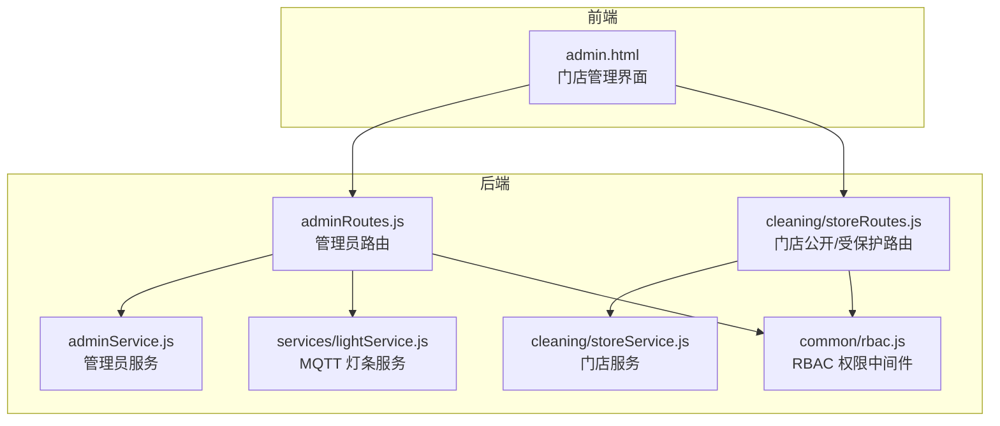
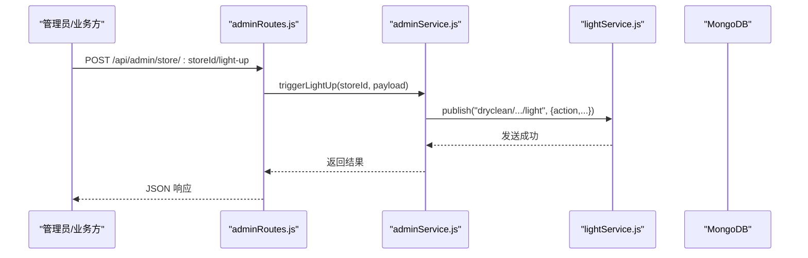
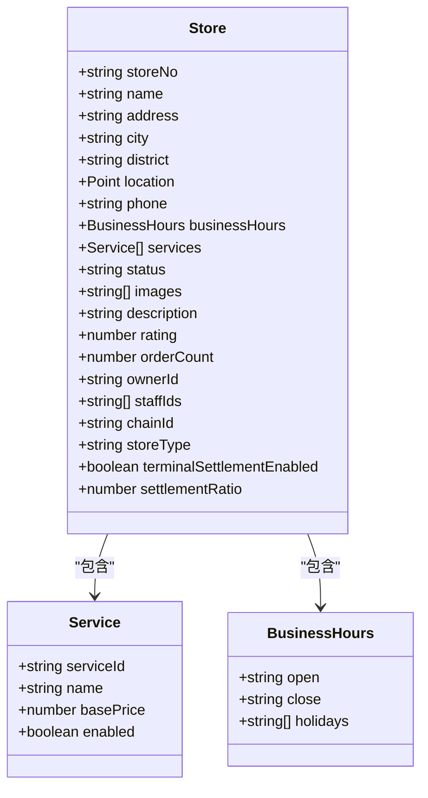
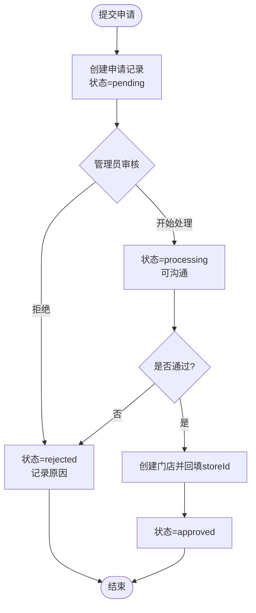
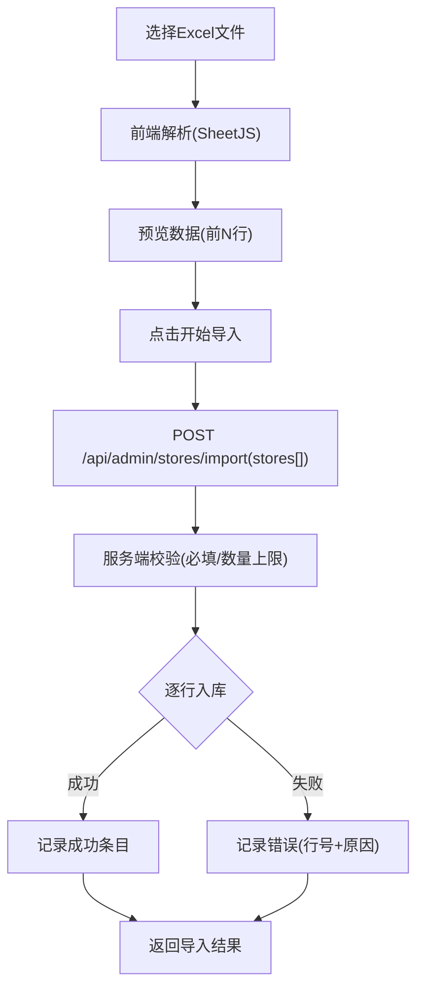
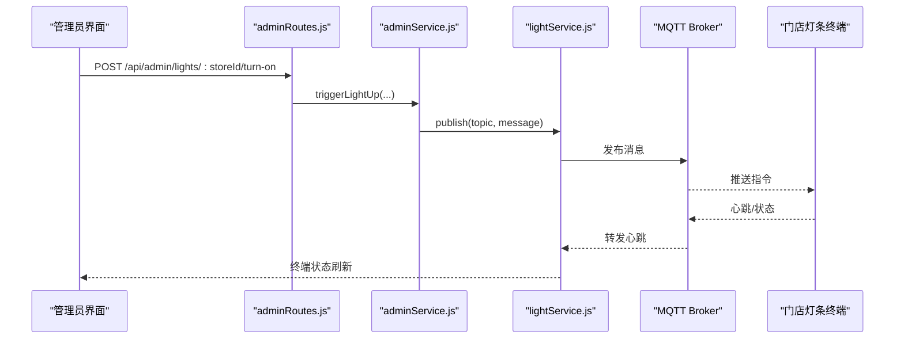
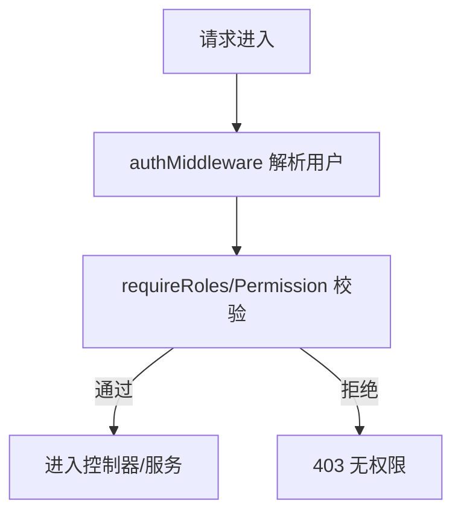
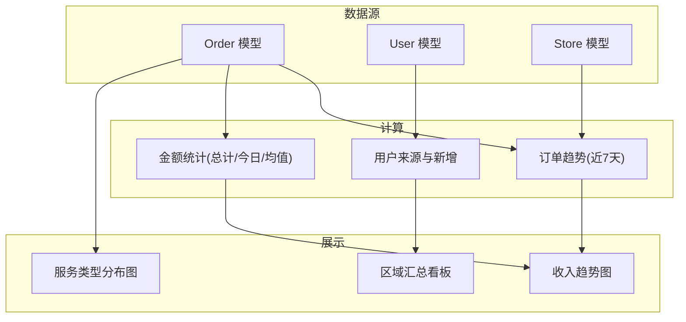
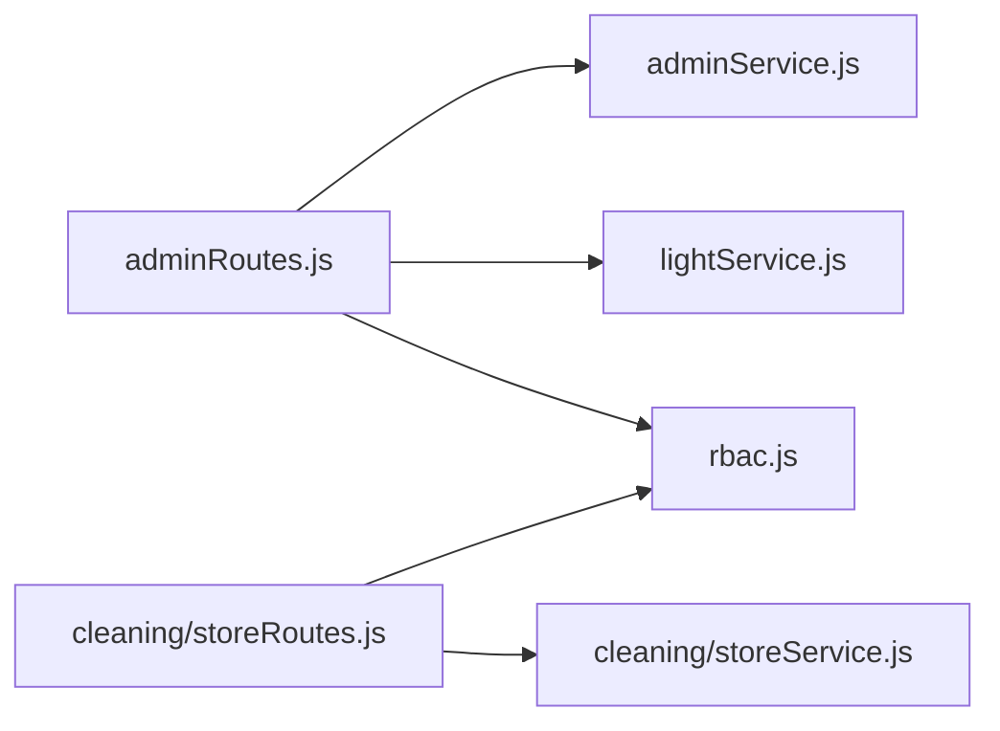

# 门店管理界面

<cite>
**本文引用的文件**   
- [storeService.js](file://backend/modules/cleaning/services/storeService.js)
- [storeRoutes.js](file://backend/modules/cleaning/routes/storeRoutes.js)
- [adminService.js](file://backend/modules/admin/services/adminService.js)
- [adminRoutes.js](file://backend/modules/admin/routes/adminRoutes.js)
- [lightService.js](file://backend/services/lightService.js)
- [rbac.js](file://backend/modules/common/middlewares/rbac.js)
- [admin.html](file://admin.html)
</cite>

## 目录
1. [简介](#简介)
2. [项目结构](#项目结构)
3. [核心组件](#核心组件)
4. [架构总览](#架构总览)
5. [详细组件分析](#详细组件分析)
6. [依赖关系分析](#依赖关系分析)
7. [性能与可扩展性](#性能与可扩展性)
8. [故障排查指南](#故障排查指南)
9. [结论](#结论)
10. [附录](#附录)

## 简介
本文件面向“门店管理界面”的开发者与运维人员，系统性梳理门店信息管理、入驻申请审批、区域汇总、智能灯条集成、批量导入、权限控制与统计分析等模块。文档基于后端服务与前端管理页面源码进行技术解读，提供数据模型、接口契约、流程时序与可视化建议，帮助快速定位问题并指导二次开发。

## 项目结构
围绕门店管理相关能力，系统采用前后端分离与模块化设计：
- 前端管理页（admin.html）提供门店列表、批量导入、区域汇总、智能灯条控制台、入驻申请与审批等交互入口。
- 后端按功能域划分模块：
  - cleaning 模块：对外暴露门店查询、员工管理等通用接口。
  - admin 模块：面向管理员的门店创建/导入、入驻申请审批、终端设备管理等接口。
  - common 中间件：认证与 RBAC 权限控制。
  - services：MQTT 智能灯条服务，负责与终端设备通信。

图表来源
- [admin.html:1-200](file://admin.html#L1-L200)
- [adminRoutes.js:1-120](file://backend/modules/admin/routes/adminRoutes.js#L1-L120)
- [storeRoutes.js:1-60](file://backend/modules/cleaning/routes/storeRoutes.js#L1-L60)
- [adminService.js:1-120](file://backend/modules/admin/services/adminService.js#L1-L120)
- [storeService.js:1-60](file://backend/modules/cleaning/services/storeService.js#L1-L60)
- [rbac.js:1-60](file://backend/modules/common/middlewares/rbac.js#L1-L60)
- [lightService.js:1-60](file://backend/services/lightService.js#L1-L60)

章节来源
- [admin.html:1-200](file://admin.html#L1-L200)
- [adminRoutes.js:1-120](file://backend/modules/admin/routes/adminRoutes.js#L1-L120)
- [storeRoutes.js:1-60](file://backend/modules/cleaning/routes/storeRoutes.js#L1-L60)
- [adminService.js:1-120](file://backend/modules/admin/services/adminService.js#L1-L120)
- [storeService.js:1-60](file://backend/modules/cleaning/services/storeService.js#L1-L60)
- [rbac.js:1-60](file://backend/modules/common/middlewares/rbac.js#L1-L60)
- [lightService.js:1-60](file://backend/services/lightService.js#L1-L60)

## 核心组件
- 门店服务（cleaning/storeService.js）
  - 提供门店增删改查、地理位置检索、默认服务配置、员工账户创建与角色管理、老板门店列表等。
  - 使用 Mongoose Schema 定义 Store 模型，包含门店编号、名称、地址、城市/区县、经纬度、营业时间、服务项、状态、图片、描述、评分、订单计数、归属者、员工ID集合、连锁字段、结算开关与比例等。
- 管理员服务（adminService.js）
  - 提供仪表盘统计、用户/门店管理、批量导入、入驻申请全生命周期管理、灯条控制封装、配送与会员等扩展能力。
  - 内置 StoreApplication 模型用于记录申请信息、审批历史与沟通消息。
- 路由层
  - cleaning/storeRoutes.js：面向C端与M端的门店查询、详情与服务列表；以及需要认证的门店员工管理接口。
  - admin/adminRoutes.js：面向后台管理员的门店创建/导入、入驻申请、灯条控制、终端监控等接口。
- 权限控制（rbac.js）
  - 提供基于角色的访问控制中间件，支持单权限、任意/全部多权限组合校验，以及菜单可见性过滤。
- 智能灯条服务（lightService.js）
  - 基于 MQTT 连接 Broker，维护终端注册表与心跳检测，提供订阅/发布、终端状态聚合、门店灯条查询等能力。

章节来源
- [storeService.js:1-120](file://backend/modules/cleaning/services/storeService.js#L1-L120)
- [adminService.js:1-120](file://backend/modules/admin/services/adminService.js#L1-L120)
- [storeRoutes.js:1-120](file://backend/modules/cleaning/routes/storeRoutes.js#L1-L120)
- [adminRoutes.js:1-120](file://backend/modules/admin/routes/adminRoutes.js#L1-L120)
- [rbac.js:1-120](file://backend/modules/common/middlewares/rbac.js#L1-L120)
- [lightService.js:1-120](file://backend/services/lightService.js#L1-L120)

## 架构总览
从请求到响应的典型路径如下：
- 前台/中台调用门店公开或受保护接口 → 路由层鉴权 → 服务层执行业务逻辑 → 数据库读写。
- 后台管理员操作（如灯条控制、批量导入、入驻审批）→ 管理员路由鉴权 → 管理员服务/灯条服务 → 数据库/MQTT。

图表来源
- [adminRoutes.js:560-612](file://backend/modules/admin/routes/adminRoutes.js#L560-L612)
- [adminService.js:1-120](file://backend/modules/admin/services/adminService.js#L1-L120)
- [lightService.js:180-234](file://backend/services/lightService.js#L180-L234)

## 详细组件分析

### 门店数据模型与基础能力
- 数据模型要点
  - 基本信息：storeNo、name、address、city、district、phone、images、description、rating、orderCount。
  - 地理位置：location 为 GeoJSON Point，支持 $near 半径搜索。
  - 服务配置：services 数组，含 serviceId、name、basePrice、enabled。
  - 运营属性：businessHours（open/close/holidays）、status（active/inactive/suspended）。
  - 组织与结算：ownerId、chainId、storeType（self/franchise/joint）、terminalSettlementEnabled、settlementRatio。
  - 员工关联：staffIds 数组，配合 User 模型 roles 实现门店级角色。
- 关键能力
  - 列表分页与筛选：支持 city/district/keyword 与地理半径检索。
  - 详情与服务：按 ID 获取详情，过滤启用服务。
  - 员工管理：创建/移除/更新角色、获取详细列表（合并 staffIds 与 storeId 绑定用户）。

图表来源
- [storeService.js:8-44](file://backend/modules/cleaning/services/storeService.js#L8-L44)

章节来源
- [storeService.js:55-120](file://backend/modules/cleaning/services/storeService.js#L55-L120)
- [storeService.js:125-172](file://backend/modules/cleaning/services/storeService.js#L125-L172)
- [storeService.js:180-289](file://backend/modules/cleaning/services/storeService.js#L180-L289)
- [storeService.js:294-341](file://backend/modules/cleaning/services/storeService.js#L294-L341)
- [storeService.js:356-372](file://backend/modules/cleaning/services/storeService.js#L356-L372)

### 门店入驻申请与审批流程
- 申请模型（StoreApplication）
  - 关键字段：applicationId、申请人信息、门店信息、营业时段、资质材料、BD信息、状态机（pending/processing/approved/rejected）、审批历史、沟通消息。
- 流程说明
  - 提交申请：前端表单提交至管理员服务，生成申请记录。
  - 开始审批：管理员将状态置为 processing，并可添加沟通消息。
  - 审批通过：自动调用门店创建接口，生成门店并回填 storeId。
  - 审批拒绝：记录拒绝原因与审计历史。
- 前端交互
  - admin.html 提供申请列表、筛选、详情弹窗、开始/通过/拒绝按钮及 BD 聊天面板。

图表来源
- [adminService.js:635-778](file://backend/modules/admin/services/adminService.js#L635-L778)
- [adminRoutes.js:245-333](file://backend/modules/admin/routes/adminRoutes.js#L245-L333)
- [admin.html:4478-4574](file://admin.html#L4478-L4574)

章节来源
- [adminService.js:635-778](file://backend/modules/admin/services/adminService.js#L635-L778)
- [adminRoutes.js:245-333](file://backend/modules/admin/routes/adminRoutes.js#L245-L333)
- [admin.html:4178-4574](file://admin.html#L4178-L4574)

### 批量导入功能（Excel）
- 模板设计
  - 前端提供下载模板功能，包含门店名称、联系电话、地址、城市、区域、营业开始/结束时间、描述等列。
- 解析与预览
  - 使用 SheetJS 在浏览器端解析 .xlsx/.xls/.csv，展示前若干行预览与总数。
- 服务端验证与落库
  - 管理员路由接收 stores 数组，限制单次最大条数。
  - 管理员服务逐行校验必填字段，生成唯一编号，写入门店数据，记录成功/失败明细与错误行号。
- 错误处理与日志
  - 前端显示成功/失败统计与错误列表；后端逐行捕获异常并记录。

图表来源
- [admin.html:2946-3042](file://admin.html#L2946-L3042)
- [adminRoutes.js:158-206](file://backend/modules/admin/routes/adminRoutes.js#L158-L206)
- [adminService.js:546-628](file://backend/modules/admin/services/adminService.js#L546-L628)

章节来源
- [admin.html:2871-3042](file://admin.html#L2871-L3042)
- [adminRoutes.js:158-206](file://backend/modules/admin/routes/adminRoutes.js#L158-L206)
- [adminService.js:546-628](file://backend/modules/admin/services/adminService.js#L546-L628)

### 智能灯条系统集成（MQTT）
- 连接与订阅
  - 服务启动时连接 Broker，订阅终端状态、心跳与主消息主题。
  - 定期健康检查确保重连。
- 终端注册与心跳
  - 终端上报心跳/注册消息，服务维护门店-灯条映射与最后活跃时间。
  - 超过阈值的心跳视为离线，清理无效灯条。
- 远程控制
  - 管理员通过 API 触发点亮/关闭/全部关闭等操作，服务向对应主题发布指令。
- 前端控制台
  - 展示 MQTT 连接状态、终端监控面板、门店灯条卡片、批量控制与操作日志。

图表来源
- [adminRoutes.js:633-682](file://backend/modules/admin/routes/adminRoutes.js#L633-L682)
- [lightService.js:29-90](file://backend/services/lightService.js#L29-L90)
- [lightService.js:110-187](file://backend/services/lightService.js#L110-L187)
- [admin.html:3320-3373](file://admin.html#L3320-L3373)

章节来源
- [lightService.js:1-234](file://backend/services/lightService.js#L1-L234)
- [adminRoutes.js:560-746](file://backend/modules/admin/routes/adminRoutes.js#L560-L746)
- [admin.html:1072-1252](file://admin.html#L1072-L1252)

### 权限控制机制（RBAC）
- 角色与权限
  - 支持 admin、store_owner、store_staff 等角色；admin 拥有所有权限。
  - 提供 requireRoles、requirePermission、requireAnyPermission、requireAllPermissions 等中间件。
- 菜单可见性
  - 根据用户角色动态过滤可访问菜单项，避免越权展示。
- 应用点
  - 门店员工管理、门店信息修改、管理员专属接口均通过中间件校验。

图表来源
- [rbac.js:1-172](file://backend/modules/common/middlewares/rbac.js#L1-L172)
- [storeRoutes.js:66-120](file://backend/modules/cleaning/routes/storeRoutes.js#L66-L120)
- [adminRoutes.js:12-15](file://backend/modules/admin/routes/adminRoutes.js#L12-L15)

章节来源
- [rbac.js:1-172](file://backend/modules/common/middlewares/rbac.js#L1-L172)
- [storeRoutes.js:66-120](file://backend/modules/cleaning/routes/storeRoutes.js#L66-L120)
- [adminRoutes.js:12-15](file://backend/modules/admin/routes/adminRoutes.js#L12-L15)

### 区域汇总与统计分析
- 区域汇总
  - 前端已预留“区域汇总”页面占位，可按城市/区县维度聚合门店与订单指标。
- 营收报表与服务统计
  - 管理员仪表盘提供今日/本周/本月订单趋势、金额统计、订单状态分布等。
  - 前端图表渲染收入趋势与服务类型分布（折线/环形图）。
- 客户分析
  - 用户来源统计、新增用户趋势、活跃度（DAU/MAU）等。

图表来源
- [adminService.js:174-322](file://backend/modules/admin/services/adminService.js#L174-L322)
- [index.html:2929-3022](file://index.html#L2929-L3022)
- [admin.html:1064-1070](file://admin.html#L1064-L1070)

章节来源
- [adminService.js:174-322](file://backend/modules/admin/services/adminService.js#L174-L322)
- [index.html:2929-3022](file://index.html#L2929-L3022)
- [admin.html:1064-1070](file://admin.html#L1064-L1070)

## 依赖关系分析
- 模块耦合
  - adminRoutes 依赖 adminService 与 lightService；cleaning/storeRoutes 依赖 storeService。
  - 两者均依赖 common 中间件完成鉴权。
- 外部依赖
  - MongoDB（Mongoose）：持久化存储。
  - MQTT（mqtt 客户端）：与终端设备通信。
  - SheetJS（前端）：Excel 解析。
- 潜在循环依赖
  - 当前未见直接循环引用；注意在运行时动态 require 的场景需保证初始化顺序。

图表来源
- [adminRoutes.js:1-120](file://backend/modules/admin/routes/adminRoutes.js#L1-L120)
- [storeRoutes.js:1-60](file://backend/modules/cleaning/routes/storeRoutes.js#L1-L60)
- [rbac.js:1-60](file://backend/modules/common/middlewares/rbac.js#L1-L60)

章节来源
- [adminRoutes.js:1-120](file://backend/modules/admin/routes/adminRoutes.js#L1-L120)
- [storeRoutes.js:1-60](file://backend/modules/cleaning/routes/storeRoutes.js#L1-L60)
- [rbac.js:1-60](file://backend/modules/common/middlewares/rbac.js#L1-L60)

## 性能与可扩展性
- 查询优化
  - 门店列表使用索引（status、city、location 2dsphere），分页 skip/limit 控制返回量。
  - 详情接口 populate 仅取必要字段，减少负载。
- 并发与批处理
  - 批量导入逐行处理，失败不中断整体流程，便于重试与补偿。
- 实时通信
  - MQTT 心跳超时清理避免内存泄漏；定时 ensureConnected 保障重连。
- 可扩展建议
  - 引入缓存层（Redis）缓存热点门店与服务配置。
  - 对导入任务异步化（队列）提升吞吐。
  - 灯条控制增加幂等与重试策略。

[本节为通用建议，无需代码来源]

## 故障排查指南
- 登录/鉴权失败
  - 确认 authMiddleware 与 requireRoles 是否正确挂载；检查用户 roles 是否包含所需角色。
- 门店数据异常
  - 检查 StoreSchema 必填字段与唯一约束；确认地理位置坐标格式与索引生效。
- 批量导入失败
  - 核对 Excel 模板列名与必填字段；查看服务端错误行号与具体原因。
- 灯条无法控制
  - 检查 MQTT Broker 连通性与端口；确认终端心跳是否到达；查看终端在线列表。
- 审批流程卡住
  - 检查申请状态流转与审批历史；确认通过时门店创建是否成功并回填 storeId。

章节来源
- [rbac.js:34-114](file://backend/modules/common/middlewares/rbac.js#L34-L114)
- [storeService.js:8-44](file://backend/modules/cleaning/services/storeService.js#L8-L44)
- [adminService.js:546-628](file://backend/modules/admin/services/adminService.js#L546-L628)
- [lightService.js:110-187](file://backend/services/lightService.js#L110-L187)
- [admin.html:4478-4574](file://admin.html#L4478-L4574)

## 结论
本方案以清晰的模块化分层与 RBAC 权限控制为基础，实现了门店信息管理、入驻审批、批量导入、智能灯条集成与统计分析等核心能力。通过完善的数据模型、健壮的接口设计与实时通信机制，既满足日常运营需求，也为后续扩展（如区域聚合看板、设备诊断告警、导入任务队列化）提供了良好基础。

[本节为总结，无需代码来源]

## 附录
- 常用接口速览（节选）
  - 门店列表/详情/服务：GET /api/stores、GET /api/stores/:id、GET /api/stores/:id/services
  - 门店员工管理：POST/PUT/DELETE /api/stores/:id/staff*
  - 管理员门店导入：POST /api/admin/stores/import
  - 入驻申请：POST/GET/PUT /api/admin/store-applications*
  - 灯条控制：POST /api/admin/lights/:storeId/turn-on|turn-off|turn-on-all|turn-off-all
  - 终端监控：GET /api/admin/terminals、GET /api/admin/store/:storeId/terminal-lights

章节来源
- [storeRoutes.js:1-194](file://backend/modules/cleaning/routes/storeRoutes.js#L1-L194)
- [adminRoutes.js:158-746](file://backend/modules/admin/routes/adminRoutes.js#L158-L746)