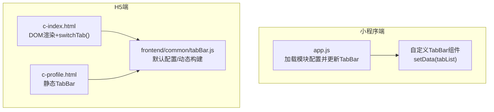
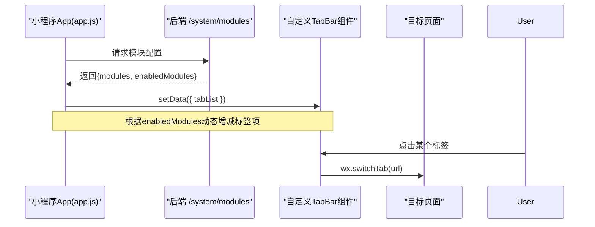
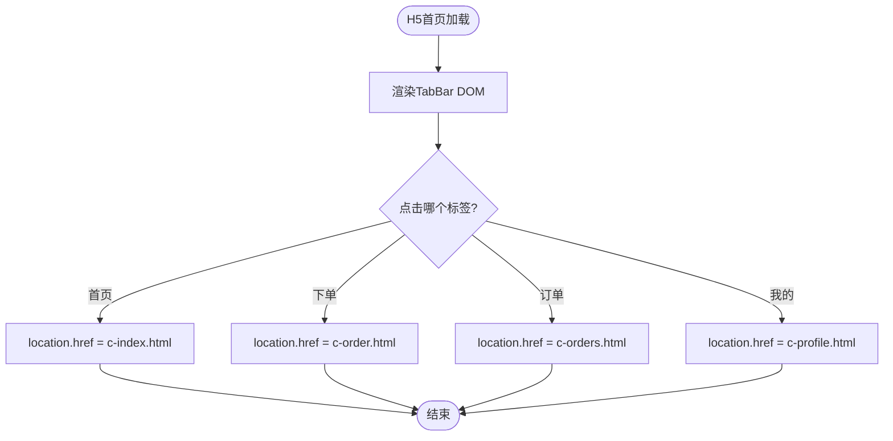
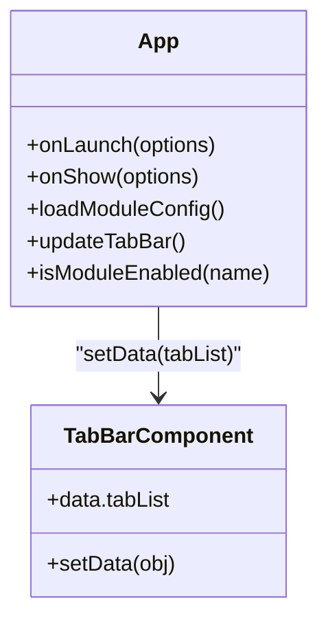
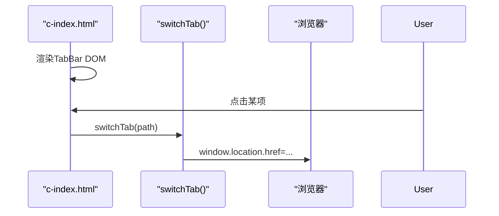
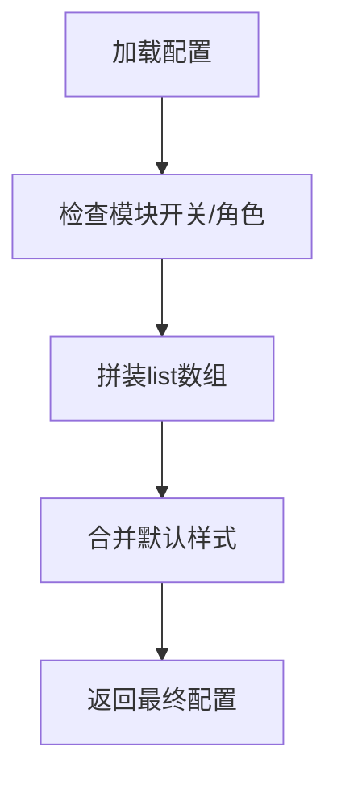
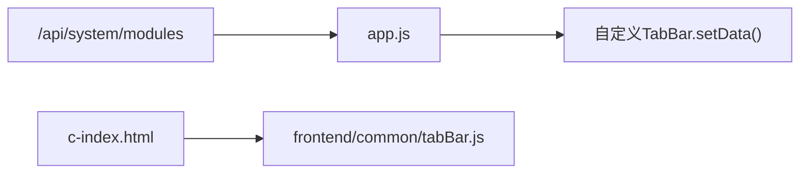

# TabBar组件

<cite>
**本文引用的文件**   
- [frontend/common/tabBar.js](file://frontend/common/tabBar.js)
- [wechat-mini-app/app.js](file://wechat-mini-app/app.js)
- [c-index.html](file://c-index.html)
- [c-profile.html](file://c-profile.html)
- [frontend/INTEGRATION.md](file://frontend/INTEGRATION.md)
</cite>

## 目录
1. [简介](#简介)
2. [项目结构](#项目结构)
3. [核心组件](#核心组件)
4. [架构总览](#架构总览)
5. [详细组件分析](#详细组件分析)
6. [依赖关系分析](#依赖关系分析)
7. [性能与移动端适配](#性能与移动端适配)
8. [故障排查指南](#故障排查指南)
9. [结论](#结论)
10. [附录：使用示例与最佳实践](#附录使用示例与最佳实践)

## 简介
本文件围绕仓库中的“底部标签栏（TabBar）”能力进行系统化文档化，覆盖小程序端与C端H5两套实现。重点说明：
- 动态配置与渲染：根据后端模块开关与用户角色生成标签项
- 状态同步与路由跳转：激活态切换、页面导航
- 交互行为：点击事件处理、键盘导航与无障碍支持建议
- 缓存策略：本地缓存与降级兜底
- 配置选项：文本、图标、角标等
- 集成方式：小程序与H5的接入步骤与注意事项

## 项目结构
与TabBar相关的代码主要分布在以下位置：
- 小程序端：应用入口中负责加载模块配置并更新TabBar
- H5端：首页内嵌TabBar DOM与JS逻辑，以及通用配置模块
- 公共配置：提供默认配置与动态构建方法

图表来源
- [wechat-mini-app/app.js:170-192](file://wechat-mini-app/app.js#L170-L192)
- [c-index.html:383-403](file://c-index.html#L383-L403)
- [c-profile.html:278-306](file://c-profile.html#L278-L306)
- [frontend/common/tabBar.js:11-42](file://frontend/common/tabBar.js#L11-L42)

章节来源
- [wechat-mini-app/app.js:117-192](file://wechat-mini-app/app.js#L117-L192)
- [c-index.html:383-403](file://c-index.html#L383-L403)
- [c-profile.html:278-306](file://c-profile.html#L278-L306)
- [frontend/common/tabBar.js:1-137](file://frontend/common/tabBar.js#L1-L137)

## 核心组件
- 小程序端TabBar
  - 由应用入口在首次显示后异步加载模块配置，再调用自定义TabBar组件的setData更新tabList
  - 通过wx.switchTab完成标签页切换
- H5端TabBar
  - 在首页HTML中直接渲染TabBar节点，点击时更新active样式并执行window.location跳转
  - 提供简化版TabBar构建函数用于快速组合菜单项

章节来源
- [wechat-mini-app/app.js:170-192](file://wechat-mini-app/app.js#L170-L192)
- [c-index.html:805-828](file://c-index.html#L805-L828)
- [frontend/common/tabBar.js:118-131](file://frontend/common/tabBar.js#L118-L131)

## 架构总览
下图展示小程序端从启动到TabBar渲染的关键流程，以及H5端的渲染与切换流程。

图表来源
- [wechat-mini-app/app.js:117-192](file://wechat-mini-app/app.js#L117-L192)

图表来源
- [c-index.html:383-403](file://c-index.html#L383-L403)
- [c-index.html:805-828](file://c-index.html#L805-L828)

## 详细组件分析

### 小程序端TabBar（动态配置与渲染）
- 初始化时机
  - onLaunch仅做极速恢复缓存；onShow延迟加载模块配置并更新TabBar，避免阻塞首屏
- 配置获取
  - 通过wx.request请求/system/modules，超时保护与失败降级为默认启用清洗模块
- 动态构建
  - 基于enabledModules决定是否添加“服务”等标签项
- 渲染与切换
  - 通过getTabBar().setData({ tabList })更新自定义TabBar
  - 页面内部使用wx.switchTab跳转到已配置的pagePath

图表来源
- [wechat-mini-app/app.js:117-192](file://wechat-mini-app/app.js#L117-L192)

章节来源
- [wechat-mini-app/app.js:117-192](file://wechat-mini-app/app.js#L117-L192)

### H5端TabBar（DOM渲染与切换）
- 渲染
  - 在首页HTML中固定容器id="tab-bar"，根据模块配置动态拼接HTML
- 切换
  - switchTab统一处理active样式与页面跳转
- 静态页面
  - 个人中心页包含一个静态TabBar，结构与首页一致

图表来源
- [c-index.html:383-403](file://c-index.html#L383-L403)
- [c-index.html:805-828](file://c-index.html#L805-L828)

章节来源
- [c-index.html:383-403](file://c-index.html#L383-L403)
- [c-index.html:805-828](file://c-index.html#L805-L828)
- [c-profile.html:278-306](file://c-profile.html#L278-L306)

### 通用配置与动态构建（小程序/H5共用思路）
- 默认配置
  - 定义颜色、边框、列表项（含pagePath、text、iconPath、selectedIconPath）
- 动态构建
  - getDynamicTabBar：读取/system/modules，按模块开关与用户角色拼装list
  - getSimpleTabBar：为H5提供轻量级构建，按需插入“服务”入口

图表来源
- [frontend/common/tabBar.js:11-42](file://frontend/common/tabBar.js#L11-L42)
- [frontend/common/tabBar.js:47-113](file://frontend/common/tabBar.js#L47-L113)
- [frontend/common/tabBar.js:118-131](file://frontend/common/tabBar.js#L118-L131)

章节来源
- [frontend/common/tabBar.js:1-137](file://frontend/common/tabBar.js#L1-L137)

## 依赖关系分析
- 小程序端
  - app.js依赖后端/system/modules接口，依赖自定义TabBar组件的setData能力
- H5端
  - c-index.html依赖前端/common/tabBar.js提供的默认配置与构建函数（可选），同时自身维护DOM渲染与跳转逻辑
- 文档参考
  - frontend/INTEGRATION.md提供了小程序端集成与菜单配置的参考路径

图表来源
- [wechat-mini-app/app.js:117-192](file://wechat-mini-app/app.js#L117-L192)
- [frontend/common/tabBar.js:47-113](file://frontend/common/tabBar.js#L47-L113)
- [c-index.html:383-403](file://c-index.html#L383-L403)

章节来源
- [wechat-mini-app/app.js:117-192](file://wechat-mini-app/app.js#L117-L192)
- [frontend/common/tabBar.js:47-113](file://frontend/common/tabBar.js#L47-L113)
- [c-index.html:383-403](file://c-index.html#L383-L403)
- [frontend/INTEGRATION.md:141-161](file://frontend/INTEGRATION.md#L141-L161)

## 性能与移动端适配
- 渲染时机
  - 小程序端将网络请求与TabBar更新放在onShow延迟执行，避免阻塞onLaunch，提升冷启动体验
- 降级与容错
  - 模块配置请求失败或超时时回退到默认启用清洗模块，保证基础功能可用
- 样式与布局
  - H5端TabBar使用固定定位与safe-area-inset-bottom适配刘海屏
- 动画与手势
  - 当前实现以点击切换为主，未内置滑动切换与复杂动画；如需增强可引入CSS过渡或手势库
- 键盘导航与无障碍
  - 建议为每个tab-item增加tabindex与aria-label，监听Enter/Space触发点击，提升键盘与读屏可用性

[本节为通用指导，不直接分析具体文件]

## 故障排查指南
- 模块配置接口不可用
  - 现象：TabBar未按预期增减标签项
  - 排查：确认/system/modules可达、响应格式正确；查看控制台错误日志
- 小程序TabBar未更新
  - 现象：新增模块但底部无新标签
  - 排查：确认updateTabBar是否被调用；检查getTabBar()是否存在且返回实例
- H5端跳转无效
  - 现象：点击TabBar无反应或跳转404
  - 排查：核对switchTab内的path映射与对应页面文件存在性

章节来源
- [wechat-mini-app/app.js:117-192](file://wechat-mini-app/app.js#L117-L192)
- [c-index.html:805-828](file://c-index.html#L805-L828)

## 结论
本项目的小程序与H5两端均实现了“动态TabBar”的核心能力：依据后端模块开关与用户角色动态生成标签项，并在各自平台完成渲染与跳转。小程序端采用组件化更新与框架API切换，H5端采用DOM直出与原生跳转。整体方案简洁可靠，具备良好降级与扩展性。后续可按需补充滑动切换、入场动画、角标与更完善的无障碍支持。

[本节为总结性内容，不直接分析具体文件]

## 附录：使用示例与最佳实践

### 小程序端集成要点
- 在应用启动后加载模块配置并调用updateTabBar
- 页面内使用wx.switchTab跳转到已配置的pagePath
- 自定义TabBar组件需提供tabList数据绑定

章节来源
- [frontend/INTEGRATION.md:141-161](file://frontend/INTEGRATION.md#L141-L161)
- [wechat-mini-app/app.js:170-192](file://wechat-mini-app/app.js#L170-L192)

### H5端集成要点
- 在首页保留id="tab-bar"容器，按模块配置动态渲染
- 使用switchTab统一处理active样式与页面跳转
- 可在其他页面复用相同结构的TabBar（如个人中心页）

章节来源
- [c-index.html:383-403](file://c-index.html#L383-L403)
- [c-index.html:805-828](file://c-index.html#L805-L828)
- [c-profile.html:278-306](file://c-profile.html#L278-L306)

### 配置项说明（字段含义）
- 全局样式
  - color：未选中文字色
  - selectedColor：选中文字色
  - backgroundColor：背景色
  - borderStyle：边框样式
- 列表项
  - pagePath：小程序页面路径
  - text：标签文案
  - iconPath：未选中图标路径
  - selectedIconPath：选中图标路径
- 角标
  - 当前默认配置未包含角标字段；若需显示，可在渲染层追加badge相关字段与样式

章节来源
- [frontend/common/tabBar.js:11-42](file://frontend/common/tabBar.js#L11-L42)

### 交互行为清单
- 点击事件：两端均已实现
- 滑动切换：当前未内置，可按需扩展
- 键盘导航：建议为tab-item增加tabindex与aria-label，并监听Enter/Space
- 无障碍：为图标与文本提供语义化描述，确保读屏可读

[本节为通用指导，不直接分析具体文件]