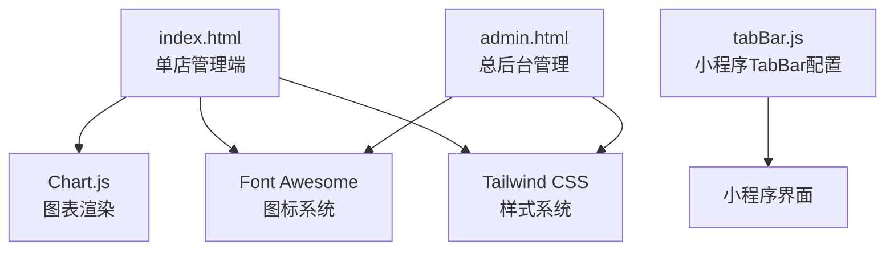
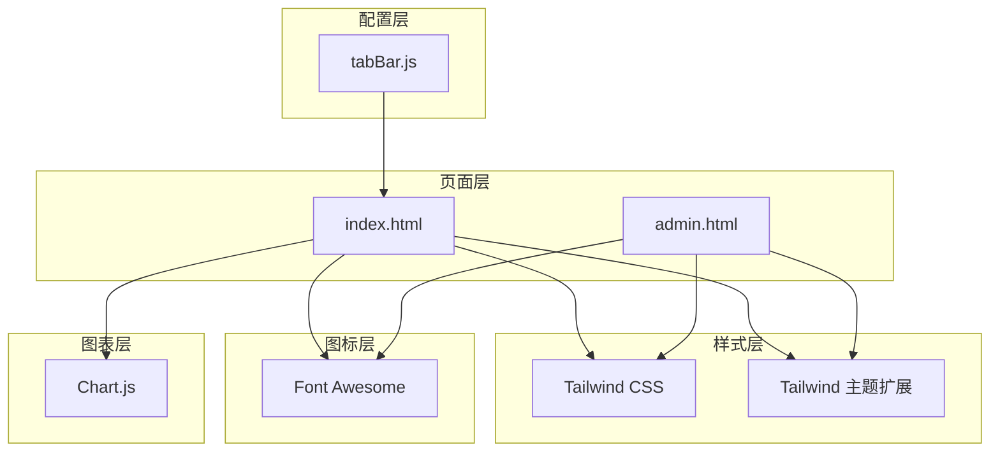
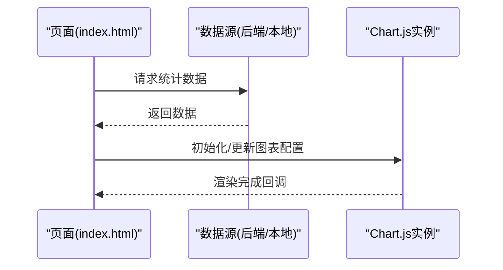
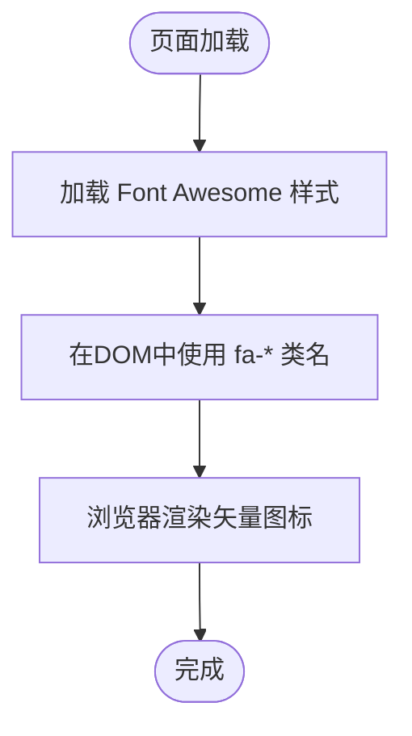
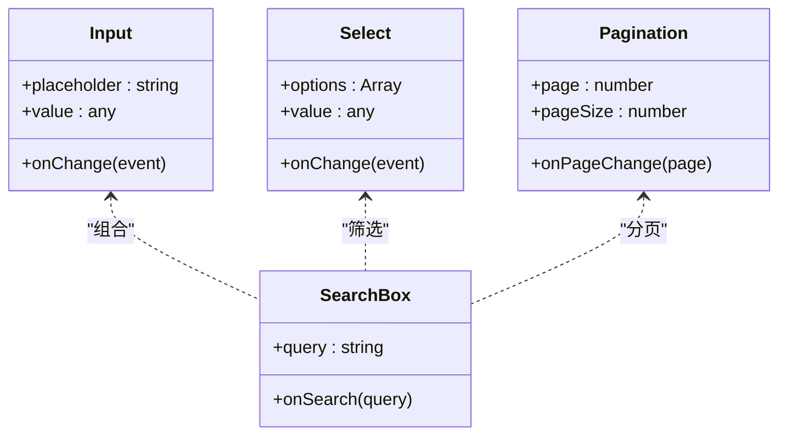
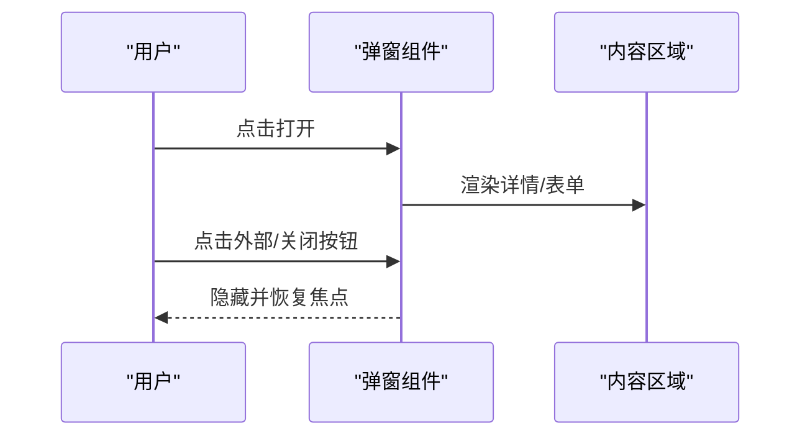
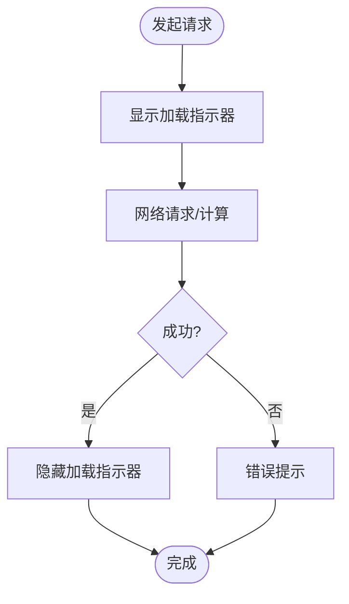
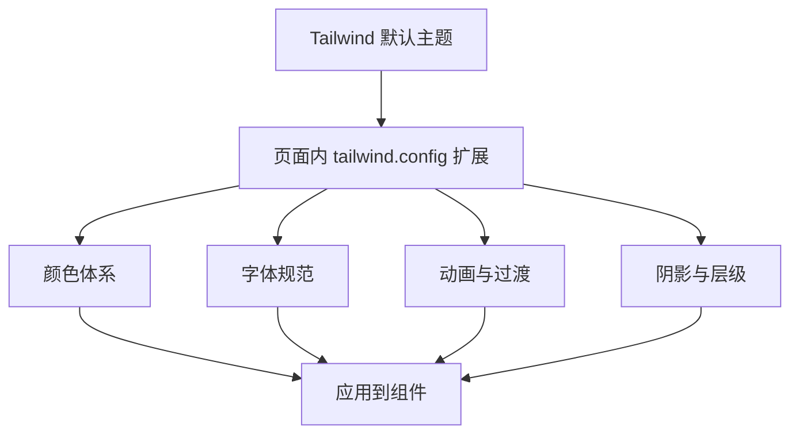
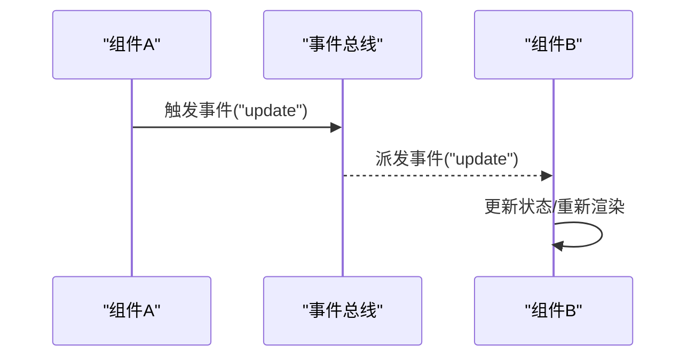
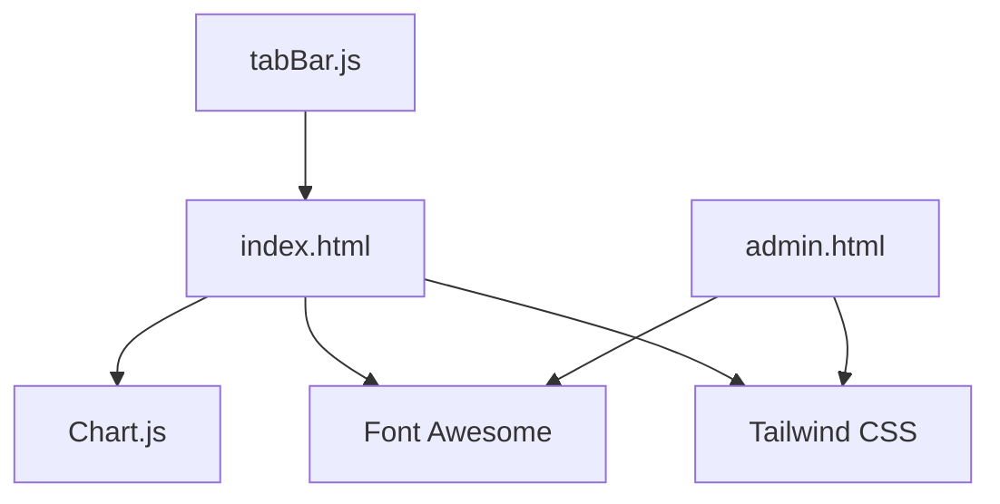

# UI基础组件

<cite>
**本文引用的文件**   
- [index.html](file://index.html)
- [admin.html](file://admin.html)
- [font-awesome.min.css](file://lib/font-awesome.min.css)
- [tailwind.css](file://lib/tailwind.css)
- [chart.umd.min.js](file://libs/chart.umd.min.js)
- [tabBar.js](file://frontend/common/tabBar.js)
</cite>

## 目录
1. [引言](#引言)
2. [项目结构](#项目结构)
3. [核心组件](#核心组件)
4. [架构总览](#架构总览)
5. [详细组件分析](#详细组件分析)
6. [依赖关系分析](#依赖关系分析)
7. [性能考量](#性能考量)
8. [故障排查指南](#故障排查指南)
9. [结论](#结论)
10. [附录](#附录)

## 引言
本文件面向前端开发者，系统化梳理本项目中“UI基础组件”的架构与设计理念。重点覆盖：
- 组件抽象层次与组合模式
- 样式系统（Tailwind CSS + 自定义主题）
- 主题机制（颜色、字体、动画、阴影等）
- 核心组件：图表（Chart.js）、图标（Font Awesome）、表单控件、弹窗、加载指示器
- 组件通信机制：事件总线、状态共享、生命周期钩子
- 使用示例与最佳实践：组件组合、样式定制、国际化支持
- 响应式设计与无障碍访问
- 性能优化方案

## 项目结构
从页面级入口与资源组织看，UI基础能力由以下部分构成：
- 页面入口：单店管理端 index.html、总后台管理 admin.html
- 第三方库：Chart.js（图表）、Font Awesome（图标）、Tailwind CSS（原子化样式）
- 公共配置：TabBar 动态配置（小程序侧）

图示来源
- [index.html:1-120](file://index.html#L1-L120)
- [admin.html:1-60](file://admin.html#L1-L60)
- [tabBar.js:1-56](file://frontend/common/tabBar.js#L1-L56)

章节来源
- [index.html:1-120](file://index.html#L1-L120)
- [admin.html:1-60](file://admin.html#L1-L60)
- [tabBar.js:1-56](file://frontend/common/tabBar.js#L1-L56)

## 核心组件
- 图表组件（Chart.js集成）
  - 通过CDN引入 Chart.js UMD 版本，在页面内创建 canvas 并初始化图表实例，用于收入趋势、服务类型分布等可视化展示。
  - 典型用法路径参考：[index.html:638-653](file://index.html#L638-L653)

- 图标系统（Font Awesome）
  - 通过CDN或本地CSS引入 Font Awesome 4.7，提供丰富的矢量图标能力，贯穿导航、按钮、状态提示等场景。
  - 典型用法路径参考：[index.html:9-11](file://index.html#L9-L11)、[admin.html:9-11](file://admin.html#L9-L11)、[font-awesome.min.css](file://lib/font-awesome.min.css)

- 表单控件
  - 基于原生HTML表单元素与 Tailwind 原子类构建输入框、下拉选择、搜索框、分页器等通用控件，强调一致性与可复用性。
  - 典型用法路径参考：[admin.html:502-537](file://admin.html#L502-L537)

- 弹窗组件
  - 以固定定位遮罩+内容容器实现模态对话框，支持点击外部关闭、阻止冒泡、滚动隔离等交互细节。
  - 典型用法路径参考：[admin.html:568-581](file://admin.html#L568-L581)

- 加载指示器
  - 使用CSS关键帧与旋转/闪烁动画实现轻量加载效果，避免阻塞主线程。
  - 典型用法路径参考：[index.html:169-201](file://index.html#L169-L201)

章节来源
- [index.html:638-653](file://index.html#L638-L653)
- [index.html:9-11](file://index.html#L9-L11)
- [admin.html:9-11](file://admin.html#L9-L11)
- [admin.html:502-537](file://admin.html#L502-L537)
- [admin.html:568-581](file://admin.html#L568-L581)
- [index.html:169-201](file://index.html#L169-L201)
- [font-awesome.min.css](file://lib/font-awesome.min.css)

## 架构总览
UI基础组件采用“页面驱动 + 第三方库 + 原子化样式”的组合方式：
- 页面层：index.html、admin.html 作为入口，负责布局、导航、模块切换与数据绑定
- 样式层：Tailwind CSS 提供原子化样式，配合页面内 tailwind.config 扩展主题（颜色、动画、阴影、字体）
- 图标层：Font Awesome 提供统一图标语义与视觉一致性
- 图表层：Chart.js 负责数据可视化渲染
- 配置层：tabBar.js 提供小程序端 TabBar 的动态配置能力

图示来源
- [index.html:25-101](file://index.html#L25-L101)
- [admin.html:18-55](file://admin.html#L18-L55)
- [tabBar.js:1-56](file://frontend/common/tabBar.js#L1-L56)

## 详细组件分析

### 图表组件（Chart.js集成）
- 职责：将业务数据转化为可视化图表（折线图、饼图、柱状图等），支撑仪表盘与统计分析
- 数据流：页面获取数据 → 构造数据集 → 调用 Chart.js API 渲染到 canvas
- 生命周期：初始化图表实例 → 更新数据 → 销毁/重建（按需）
- 性能：大数据集建议分页/采样；避免频繁重绘；合理设置动画时长

图示来源
- [index.html:638-653](file://index.html#L638-L653)

章节来源
- [index.html:638-653](file://index.html#L638-L653)

### 图标系统（Font Awesome）
- 职责：为按钮、导航、状态提示等提供一致的图标语义与视觉风格
- 接入方式：CDN 或本地 CSS 引入，使用 fa-* 类名挂载图标
- 最佳实践：优先使用语义化图标；保持尺寸与间距一致；注意无障碍标签

图示来源
- [index.html:9-11](file://index.html#L9-L11)
- [admin.html:9-11](file://admin.html#L9-L11)
- [font-awesome.min.css](file://lib/font-awesome.min.css)

章节来源
- [index.html:9-11](file://index.html#L9-L11)
- [admin.html:9-11](file://admin.html#L9-L11)
- [font-awesome.min.css](file://lib/font-awesome.min.css)

### 表单控件
- 职责：提供输入、选择、搜索、分页等通用交互能力
- 设计要点：统一的边框、圆角、焦点态、禁用态；键盘可达性与屏幕阅读器友好
- 组合模式：将基础控件组合为复合组件（如带搜索的下拉、带分页的表格）

章节来源
- [admin.html:502-537](file://admin.html#L502-L537)

### 弹窗组件
- 职责：承载详情、确认、编辑等上下文相关操作
- 交互流程：触发打开 → 显示遮罩与内容 → 处理内部操作 → 关闭并清理状态
- 注意事项：阻止背景滚动、聚焦管理、ESC关闭、点击外部关闭

图示来源
- [admin.html:568-581](file://admin.html#L568-L581)

章节来源
- [admin.html:568-581](file://admin.html#L568-L581)

### 加载指示器
- 职责：反馈异步操作的进行中状态
- 实现方式：CSS动画（旋转、闪烁、点阵）；避免阻塞主线程
- 使用建议：与骨架屏结合；控制最小显示时间，避免闪烁

图示来源
- [index.html:169-201](file://index.html#L169-L201)

章节来源
- [index.html:169-201](file://index.html#L169-L201)

### 样式系统与主题机制
- 样式框架：Tailwind CSS 原子化类，提升开发效率与一致性
- 主题扩展：在页面内通过 tailwind.config 扩展颜色、字体、动画、阴影等
- 规范建议：
  - 颜色：定义 primary、secondary、success、warning、danger 等语义色
  - 字体：统一 sans/mono 族，标题与正文层级清晰
  - 间距：遵循 4px 网格体系，使用 Tailwind spacing 变量
  - 动画：统一缓动函数与时长，避免过度动效

图示来源
- [index.html:25-101](file://index.html#L25-L101)
- [admin.html:18-55](file://admin.html#L18-L55)

章节来源
- [index.html:25-101](file://index.html#L25-L101)
- [admin.html:18-55](file://admin.html#L18-L55)

### 组件通信机制
- 事件总线：通过全局事件对象或自定义事件分发跨组件消息
- 状态共享：使用集中式状态对象或模块级变量，配合发布订阅模式
- 生命周期钩子：在组件初始化、更新、销毁阶段执行副作用（如图表重建、资源释放）

章节来源
- [index.html:1-120](file://index.html#L1-L120)
- [admin.html:1-60](file://admin.html#L1-L60)

### 使用示例与最佳实践
- 组件组合模式：将基础控件组合为复合组件（如搜索+筛选+分页）
- 样式定制：通过 tailwind.config 统一管理主题，避免硬编码
- 国际化支持：抽取文案到语言包，按 locale 切换
- 响应式设计：利用 Tailwind 断点与栅格，适配移动端与桌面端
- 无障碍访问：为图标添加 aria-label，确保键盘可达与焦点顺序正确

章节来源
- [index.html:25-101](file://index.html#L25-L101)
- [admin.html:18-55](file://admin.html#L18-L55)

## 依赖关系分析
- 页面依赖：
  - index.html 依赖 Chart.js、Font Awesome、Tailwind CSS
  - admin.html 依赖 Font Awesome、Tailwind CSS
- 配置依赖：
  - tabBar.js 提供小程序端 TabBar 动态配置，影响页面导航结构

图示来源
- [index.html:1-120](file://index.html#L1-L120)
- [admin.html:1-60](file://admin.html#L1-L60)
- [tabBar.js:1-56](file://frontend/common/tabBar.js#L1-L56)

章节来源
- [index.html:1-120](file://index.html#L1-L120)
- [admin.html:1-60](file://admin.html#L1-L60)
- [tabBar.js:1-56](file://frontend/common/tabBar.js#L1-L56)

## 性能考量
- 图表渲染：
  - 大数据集分页/采样，减少每次渲染的数据量
  - 合理设置动画时长与是否启用动画
- 图标加载：
  - 使用CDN缓存或预加载，减少首屏延迟
- 样式编译：
  - 使用 Tailwind 按需生成，避免冗余CSS
- 内存管理：
  - 组件销毁时释放图表实例与事件监听，防止内存泄漏

## 故障排查指南
- 图表不显示：
  - 检查 canvas 是否存在且可见
  - 确认 Chart.js 已加载且未报错
  - 查看控制台是否有数据格式错误
- 图标不显示：
  - 确认 Font Awesome CSS 已加载
  - 检查类名是否正确（fa-*）
- 弹窗异常：
  - 检查遮罩 z-index 与事件冒泡处理
  - 确认关闭逻辑与焦点恢复

章节来源
- [index.html:638-653](file://index.html#L638-L653)
- [index.html:9-11](file://index.html#L9-L11)
- [admin.html:568-581](file://admin.html#L568-L581)

## 结论
本项目UI基础组件以页面为驱动，结合 Tailwind CSS 原子化样式、Font Awesome 图标系统与 Chart.js 图表能力，形成高效、一致、可扩展的前端UI体系。通过主题扩展、组件组合与通信机制，能够满足多端、多角色的复杂业务需求。后续可进一步抽象为可复用的组件库，完善文档与测试用例，提升团队协同效率。

## 附录
- 快速上手：
  - 在页面引入 Tailwind、Font Awesome、Chart.js
  - 使用 tailwind.config 扩展主题
  - 在 canvas 上初始化图表实例
- 参考路径：
  - 主题扩展：[index.html:25-101](file://index.html#L25-L101)、[admin.html:18-55](file://admin.html#L18-L55)
  - 图表使用：[index.html:638-653](file://index.html#L638-L653)
  - 图标使用：[index.html:9-11](file://index.html#L9-L11)、[admin.html:9-11](file://admin.html#L9-L11)
  - 弹窗实现：[admin.html:568-581](file://admin.html#L568-L581)
  - 加载动画：[index.html:169-201](file://index.html#L169-L201)
  - 小程序TabBar配置：[tabBar.js:1-56](file://frontend/common/tabBar.js#L1-L56)