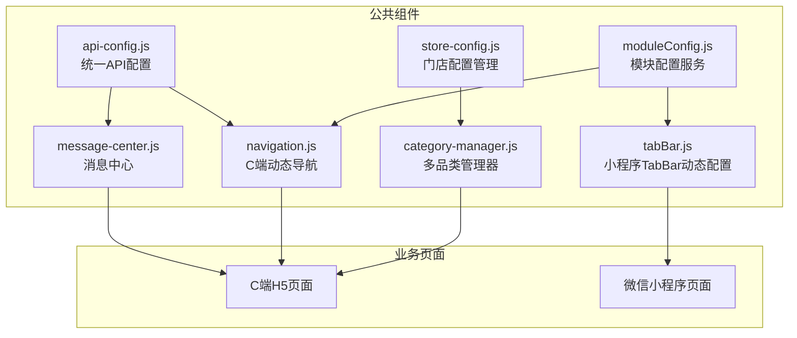
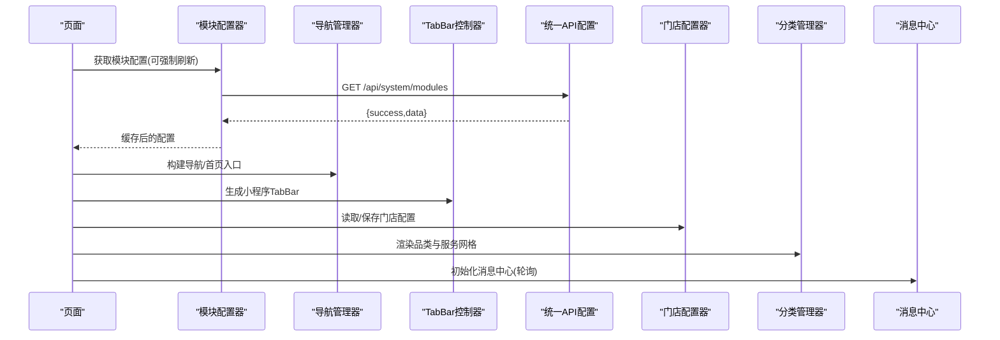
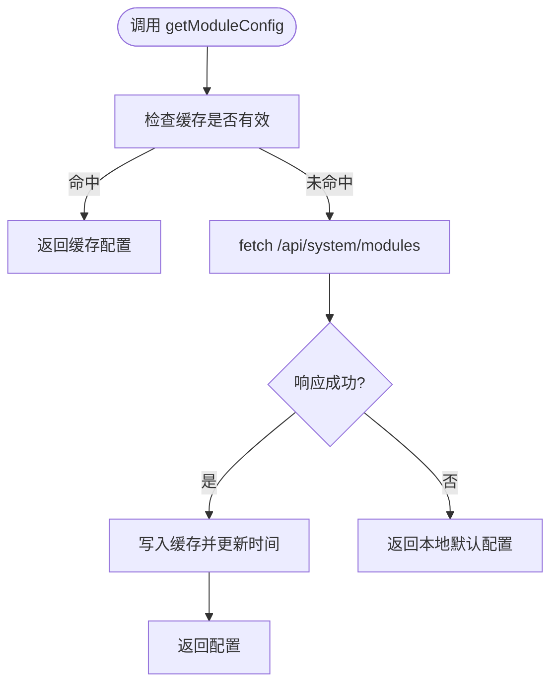
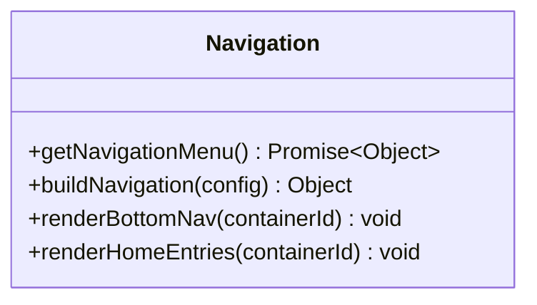
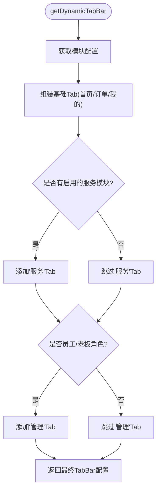
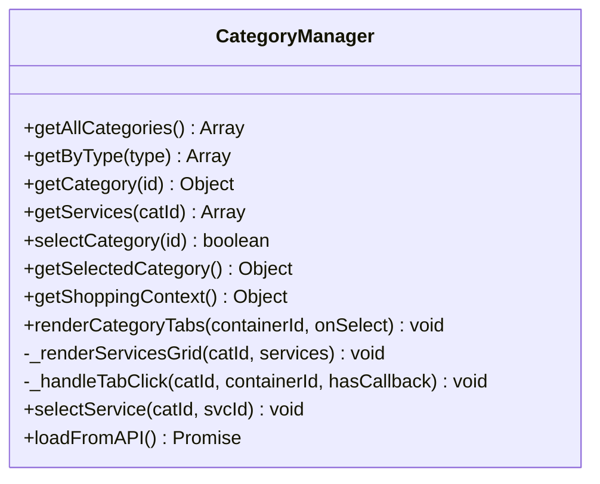
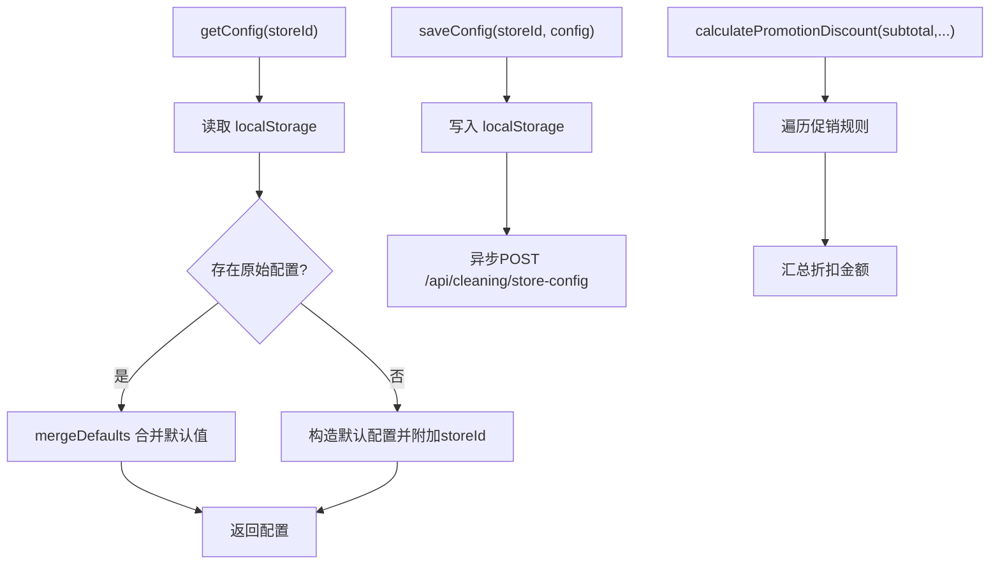
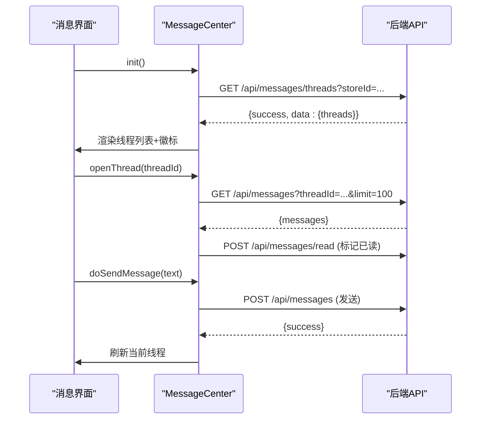
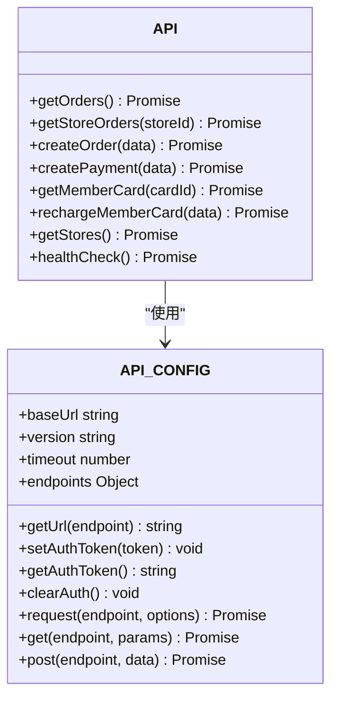
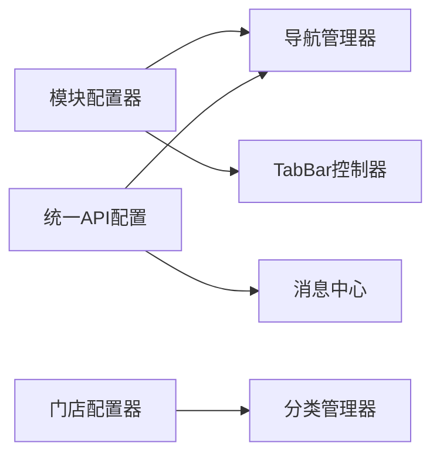

# 公共组件库

<cite>
**本文引用的文件**   
- [frontend/common/moduleConfig.js](file://frontend/common/moduleConfig.js)
- [frontend/common/navigation.js](file://frontend/common/navigation.js)
- [frontend/common/tabBar.js](file://frontend/common/tabBar.js)
- [js/category-manager.js](file://js/category-manager.js)
- [js/store-config.js](file://js/store-config.js)
- [js/message-center.js](file://js/message-center.js)
- [js/api-config.js](file://js/api-config.js)
- [frontend/INTEGRATION.md](file://frontend/INTEGRATION.md)
</cite>

## 目录
1. [引言](#引言)
2. [项目结构](#项目结构)
3. [核心组件](#核心组件)
4. [架构总览](#架构总览)
5. [详细组件分析](#详细组件分析)
6. [依赖关系分析](#依赖关系分析)
7. [性能与可用性](#性能与可用性)
8. [样式与主题系统](#样式与主题系统)
9. [配置机制与验证](#配置机制与验证)
10. [使用示例与最佳实践](#使用示例与最佳实践)
11. [测试与质量保证](#测试与质量保证)
12. [故障排查指南](#故障排查指南)
13. [结论](#结论)

## 引言
本文件面向前端开发者，系统化梳理并文档化仓库中的“公共组件库”。重点覆盖：
- 组件抽象层次与接口规范
- 事件通信与数据流
- 导航管理器、模块配置器、TabBar控制器、分类管理器等核心能力
- 样式系统与主题切换思路
- 动态配置加载、默认值处理与校验策略
- 使用示例、组合模式、性能优化与兼容性建议
- 测试方法与质量保障流程

## 项目结构
公共组件主要分布在以下位置：
- frontend/common：模块配置、导航、TabBar等通用逻辑
- js：品类管理、门店配置、消息中心、统一API配置等
- frontend/INTEGRATION.md：集成说明与约定

图表来源
- [frontend/common/moduleConfig.js:1-191](file://frontend/common/moduleConfig.js#L1-L191)
- [frontend/common/navigation.js:1-317](file://frontend/common/navigation.js#L1-L317)
- [frontend/common/tabBar.js:1-138](file://frontend/common/tabBar.js#L1-L138)
- [js/category-manager.js:1-281](file://js/category-manager.js#L1-L281)
- [js/store-config.js:1-183](file://js/store-config.js#L1-L183)
- [js/message-center.js:1-352](file://js/message-center.js#L1-L352)
- [js/api-config.js:1-225](file://js/api-config.js#L1-L225)

章节来源
- [frontend/INTEGRATION.md:1-208](file://frontend/INTEGRATION.md#L1-L208)

## 核心组件
- 模块配置器（Module Config）：从后端拉取模块开关与元信息，提供缓存与降级策略，生成菜单与首页入口。
- 导航管理器（Navigation）：基于模块配置构建主导航、用户菜单与首页功能入口，支持禁用态与提示。
- TabBar控制器（TabBar）：为小程序端根据模块状态与角色动态生成底部Tab列表。
- 分类管理器（Category Manager）：维护服务与租赁两类品类及对应服务项，提供选择上下文与渲染UI。
- 门店配置器（Store Config）：以门店为单位管理类别、服务、促销，提供默认合并、保存与同步。
- 消息中心（Message Center）：聚合客户消息与账户通讯，支持轮询刷新、已读标记与快捷回复。
- 统一API配置（API Config）：集中管理基础URL、端点、超时、认证头与请求封装。

章节来源
- [frontend/common/moduleConfig.js:1-191](file://frontend/common/moduleConfig.js#L1-L191)
- [frontend/common/navigation.js:1-317](file://frontend/common/navigation.js#L1-L317)
- [frontend/common/tabBar.js:1-138](file://frontend/common/tabBar.js#L1-L138)
- [js/category-manager.js:1-281](file://js/category-manager.js#L1-L281)
- [js/store-config.js:1-183](file://js/store-config.js#L1-L183)
- [js/message-center.js:1-352](file://js/message-center.js#L1-L352)
- [js/api-config.js:1-225](file://js/api-config.js#L1-L225)

## 架构总览
整体采用“配置驱动 + 动态渲染”的架构：
- 配置层：后端返回模块状态；前端本地缓存+降级默认配置。
- 适配层：将配置转换为导航、TabBar、首页入口等结构化数据。
- 展示层：按容器ID注入HTML或更新小程序TabBar。
- 数据层：品类、门店配置、消息会话等通过localStorage与后端API协同。

图表来源
- [frontend/common/moduleConfig.js:17-40](file://frontend/common/moduleConfig.js#L17-L40)
- [frontend/common/navigation.js:16-39](file://frontend/common/navigation.js#L16-L39)
- [frontend/common/tabBar.js:47-113](file://frontend/common/tabBar.js#L47-L113)
- [js/store-config.js:48-88](file://js/store-config.js#L48-L88)
- [js/category-manager.js:147-176](file://js/category-manager.js#L147-L176)
- [js/message-center.js:15-19](file://js/message-center.js#L15-L19)
- [js/api-config.js:111-156](file://js/api-config.js#L111-L156)

## 详细组件分析

### 模块配置器（Module Config）
职责
- 从后端获取模块状态，带内存缓存与TTL过期控制。
- 失败时回退到本地默认配置。
- 暴露方法：是否启用某模块、生成菜单、生成首页入口。

关键流程
- getModuleConfig(forceRefresh)：检查缓存→请求后端→缓存结果→失败降级。
- isModuleEnabled(moduleName, config)：判断模块开关。
- getModuleMenus/getHomeEntries：根据enabled字段拼装数据结构。

图表来源
- [frontend/common/moduleConfig.js:17-40](file://frontend/common/moduleConfig.js#L17-L40)
- [frontend/common/moduleConfig.js:45-71](file://frontend/common/moduleConfig.js#L45-L71)
- [frontend/common/moduleConfig.js:76-132](file://frontend/common/moduleConfig.js#L76-L132)

章节来源
- [frontend/common/moduleConfig.js:1-191](file://frontend/common/moduleConfig.js#L1-L191)

### 导航管理器（Navigation）
职责
- 根据模块配置构建主导航、用户菜单、首页入口。
- 支持禁用态与提示信息。
- 提供渲染函数，向指定容器注入HTML。

关键点
- buildNavigation：过滤visible=false的项，设置disabled/disabledMessage。
- renderBottomNav/renderHomeEntries：按容器ID渲染，绑定禁用点击提示。

图表来源
- [frontend/common/navigation.js:16-39](file://frontend/common/navigation.js#L16-L39)
- [frontend/common/navigation.js:44-118](file://frontend/common/navigation.js#L44-L118)
- [frontend/common/navigation.js:231-293](file://frontend/common/navigation.js#L231-L293)

章节来源
- [frontend/common/navigation.js:1-317](file://frontend/common/navigation.js#L1-L317)

### TabBar控制器（TabBar）
职责
- 为小程序端动态生成底部Tab列表。
- 根据模块启用情况与用户角色决定是否显示“服务/管理”等Tab。

关键点
- getDynamicTabBar(userRoles)：始终包含首页、订单、我的；当任一服务模块启用时加入“服务”；特定角色加入“管理”。
- getSimpleTabBar(moduleConfig)：用于C端H5的简化版Tab。

图表来源
- [frontend/common/tabBar.js:47-113](file://frontend/common/tabBar.js#L47-L113)
- [frontend/common/tabBar.js:118-131](file://frontend/common/tabBar.js#L118-L131)

章节来源
- [frontend/common/tabBar.js:1-138](file://frontend/common/tabBar.js#L1-L138)

### 分类管理器（Category Manager）
职责
- 维护服务与租赁两大品类的静态数据与兜底服务项。
- 提供选择上下文（品类+服务），持久化到localStorage。
- 渲染品类标签与服务网格，支持跳转到下单页。

关键点
- getAllCategories/getByType/getCategory/getServices/selectCategory/getShoppingContext
- renderCategoryTabs/_renderServicesGrid/_handleTabClick/selectService
- loadFromAPI：可选地从后端合并品类数据

图表来源
- [js/category-manager.js:91-142](file://js/category-manager.js#L91-L142)
- [js/category-manager.js:147-249](file://js/category-manager.js#L147-L249)
- [js/category-manager.js:252-268](file://js/category-manager.js#L252-L268)

章节来源
- [js/category-manager.js:1-281](file://js/category-manager.js#L1-L281)

### 门店配置器（Store Config）
职责
- 以门店维度管理类别、服务、促销，提供默认合并与保存。
- 计算优惠折扣，支持异步同步到后端。

关键点
- getConfig/saveConfig/resetConfig：读取/保存/重置，mergeDefaults保证字段完整。
- getPublicServices/getPublicPromotions：对外暴露可用数据。
- calculatePromotionDiscount：按条件计算折扣。

图表来源
- [js/store-config.js:48-88](file://js/store-config.js#L48-L88)
- [js/store-config.js:91-110](file://js/store-config.js#L91-L110)
- [js/store-config.js:133-162](file://js/store-config.js#L133-L162)

章节来源
- [js/store-config.js:1-183](file://js/store-config.js#L1-L183)

### 消息中心（Message Center）
职责
- 聚合客户消息与账户通讯，支持线程列表、聊天详情、已读标记、快捷回复与轮询刷新。

关键点
- init/loadThreads/openThread/renderChatDetail/doSendMessage/startPolling
- 自动标记已读、侧边栏未读数徽标更新

图表来源
- [js/message-center.js:15-19](file://js/message-center.js#L15-L19)
- [js/message-center.js:58-71](file://js/message-center.js#L58-L71)
- [js/message-center.js:129-154](file://js/message-center.js#L129-L154)
- [js/message-center.js:280-329](file://js/message-center.js#L280-L329)
- [js/message-center.js:337-345](file://js/message-center.js#L337-L345)

章节来源
- [js/message-center.js:1-352](file://js/message-center.js#L1-L352)

### 统一API配置（API Config）
职责
- 统一管理API基础地址、版本、超时、端点定义。
- 提供带认证头的通用请求封装与便捷方法。

关键点
- baseUrl动态检测端口
- request封装AbortController超时、错误标准化
- setAuthToken/getAuthToken/clearAuth
- 便捷API对象：orders/payment/stores等

图表来源
- [js/api-config.js:12-172](file://js/api-config.js#L12-L172)
- [js/api-config.js:175-212](file://js/api-config.js#L175-L212)

章节来源
- [js/api-config.js:1-225](file://js/api-config.js#L1-L225)

## 依赖关系分析
- 模块配置器与导航管理器共享同一后端模块配置源，前者负责获取与缓存，后者负责构建视图模型。
- TabBar控制器同样依赖模块配置，但输出目标为小程序TabBar结构。
- 分类管理器与门店配置器在数据层面互补：前者提供通用品类与服务兜底，后者提供门店级定制。
- 消息中心独立于上述组件，通过轮询与后端交互，不直接依赖模块配置。
- 统一API配置被多个组件间接或直接使用（如导航、消息中心）。

图表来源
- [frontend/common/moduleConfig.js:17-40](file://frontend/common/moduleConfig.js#L17-L40)
- [frontend/common/navigation.js:16-39](file://frontend/common/navigation.js#L16-L39)
- [frontend/common/tabBar.js:47-113](file://frontend/common/tabBar.js#L47-L113)
- [js/message-center.js:58-71](file://js/message-center.js#L58-L71)
- [js/api-config.js:111-156](file://js/api-config.js#L111-L156)

章节来源
- [frontend/common/moduleConfig.js:1-191](file://frontend/common/moduleConfig.js#L1-L191)
- [frontend/common/navigation.js:1-317](file://frontend/common/navigation.js#L1-L317)
- [frontend/common/tabBar.js:1-138](file://frontend/common/tabBar.js#L1-L138)
- [js/category-manager.js:1-281](file://js/category-manager.js#L1-L281)
- [js/store-config.js:1-183](file://js/store-config.js#L1-L183)
- [js/message-center.js:1-352](file://js/message-center.js#L1-L352)
- [js/api-config.js:1-225](file://js/api-config.js#L1-L225)

## 性能与可用性
- 缓存策略
  - 模块配置与导航均实现内存缓存与TTL过期，减少重复网络请求。
  - 建议在应用启动时预加载模块配置，并在需要时强制刷新。
- 降级与容错
  - 模块配置失败时回退到本地默认配置，确保基本功能可用。
  - TabBar与导航在异常情况下仍返回默认结构，避免白屏。
- 渲染优化
  - 分类管理器在服务网格渲染时使用一次性innerHTML拼接，减少多次DOM操作。
  - 消息中心对长列表采用分页限制与滚动到底部优化。
- 轮询与节流
  - 消息中心使用固定间隔轮询，可在无活动线程时降低频率或暂停轮询。

[本节为通用指导，无需源码引用]

## 样式与主题系统
- 组件本身不内嵌全局CSS变量体系，主要通过内联样式与类名进行表现。
- 主题切换建议
  - 在根节点定义CSS变量（如颜色、字号、间距），由组件通过var(--xxx)引用。
  - 通过切换data-theme属性或body类名实现明暗主题。
- 响应式设计
  - 使用flex/grid布局与媒体查询，结合移动端触摸滑动体验（如分类标签横向滚动）。
- 动画效果
  - 使用轻量CSS动画（如fadeIn）提升交互反馈，避免过度动画影响性能。

[本节为通用指导，无需源码引用]

## 配置机制与验证
- 动态配置加载
  - 模块配置：优先从后端获取，失败降级到本地默认配置。
  - 门店配置：优先读取localStorage，缺失则返回默认配置并附带storeId。
- 默认值处理
  - 门店配置的mergeDefaults确保categories/services/promotions数组存在且类型正确。
- 配置验证
  - 建议在入口处增加最小校验（非空、类型、枚举值），并在控制台输出警告以便定位问题。
  - 对于敏感字段（如价格、阈值）应做范围校验。

章节来源
- [frontend/common/moduleConfig.js:17-40](file://frontend/common/moduleConfig.js#L17-L40)
- [js/store-config.js:66-72](file://js/store-config.js#L66-L72)

## 使用示例与最佳实践
- 在页面中引入并使用模块配置
  - 参考集成文档中的示例，在应用启动时加载模块配置并更新全局状态。
- 组合模式
  - 将导航与TabBar作为“壳”，业务模块按需挂载到各自路由或页面。
- 性能优化技巧
  - 批量渲染：尽量一次拼接HTML后插入DOM。
  - 防抖/节流：对频繁触发的事件（如滚动、输入）进行节流。
  - 延迟加载：非首屏内容按需加载。
- 兼容性处理
  - fetch与AbortController在现代浏览器普遍支持，如需兼容旧环境需polyfill。
  - 小程序端注意TabBar图片路径与平台差异。

章节来源
- [frontend/INTEGRATION.md:30-91](file://frontend/INTEGRATION.md#L30-L91)
- [frontend/INTEGRATION.md:93-114](file://frontend/INTEGRATION.md#L93-L114)

## 测试与质量保证
- 单元测试建议
  - 针对纯函数（如isModuleEnabled、calculatePromotionDiscount）编写断言用例。
  - 模拟fetch返回，验证缓存与降级分支。
- 集成测试建议
  - 模拟后端模块配置与消息接口，验证导航渲染与消息列表更新。
- 端到端测试建议
  - 使用浏览器自动化脚本，覆盖登录、选择品类、下单、支付等关键路径。
- 质量门禁
  - 代码审查清单：命名规范、错误处理、日志级别、注释完整性。
  - 性能基线：首屏时间、关键交互耗时监控。

[本节为通用指导，无需源码引用]

## 故障排查指南
- 模块配置无法加载
  - 检查后端/api/system/modules是否可达，确认跨域与鉴权。
  - 查看控制台错误与Network面板，确认响应结构与success字段。
- 导航或TabBar未显示
  - 确认模块enabled状态，检查渲染容器ID是否存在。
  - 若禁用，检查disabledMessage是否正确传递。
- 消息中心无数据
  - 检查storeId是否正确，确认轮询定时器是否运行。
  - 查看/api/messages与/api/messages/threads返回结构。
- 门店配置不同步
  - 检查localStorage键名与格式，确认异步POST是否成功。
  - 监听storage事件，验证多标签页同步逻辑。

章节来源
- [frontend/common/navigation.js:231-260](file://frontend/common/navigation.js#L231-L260)
- [js/message-center.js:58-71](file://js/message-center.js#L58-L71)
- [js/store-config.js:91-110](file://js/store-config.js#L91-L110)

## 结论
本公共组件库围绕“配置驱动、动态渲染、分层解耦”展开，提供了模块配置、导航、TabBar、品类、门店配置与消息中心等核心能力。通过统一的API配置与完善的降级策略，保证了在不同环境与异常场景下的可用性。建议在此基础上进一步完善CSS变量主题体系、补充单元与集成测试，并持续优化性能与可观测性。