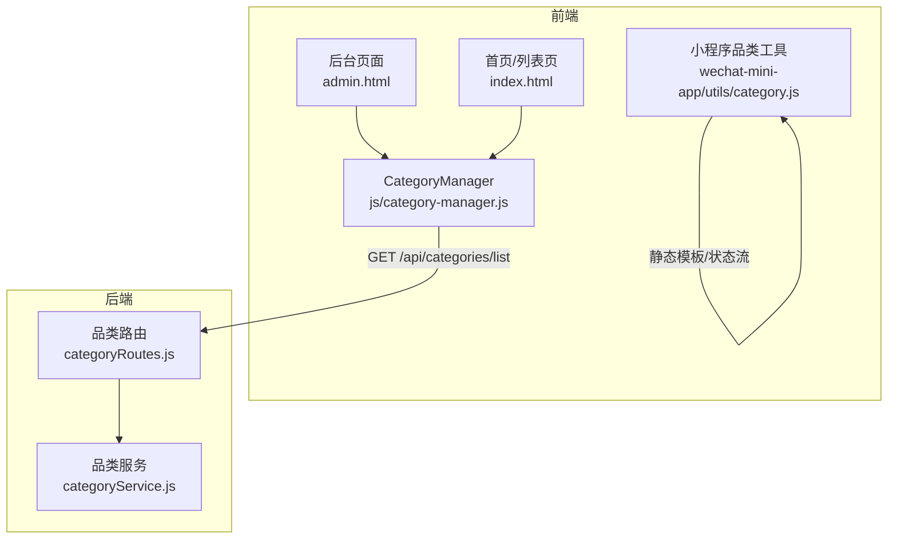
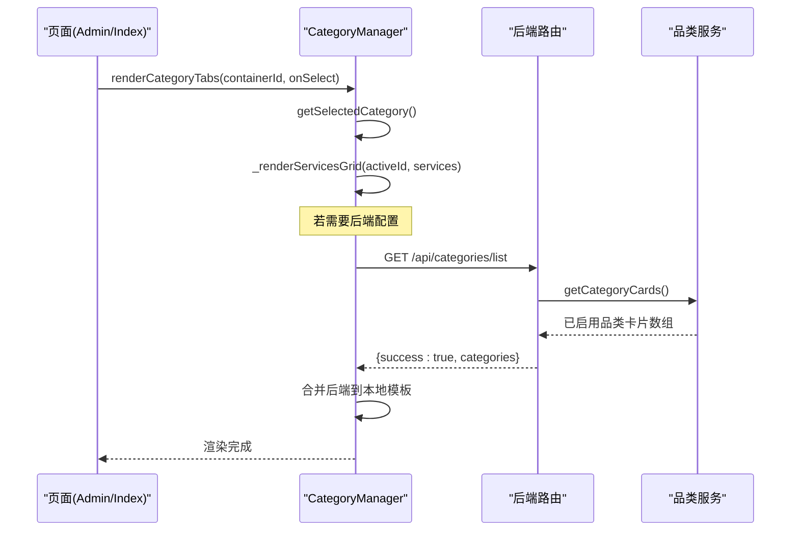
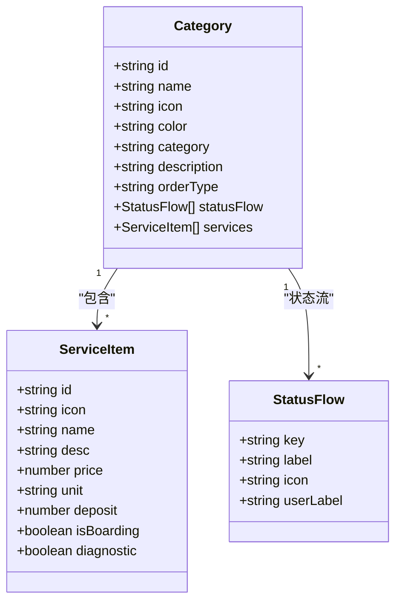
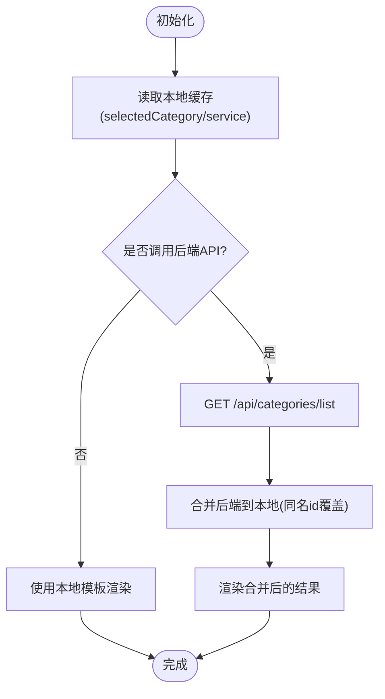
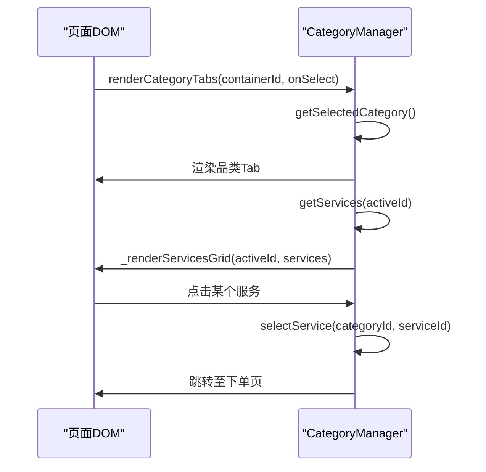
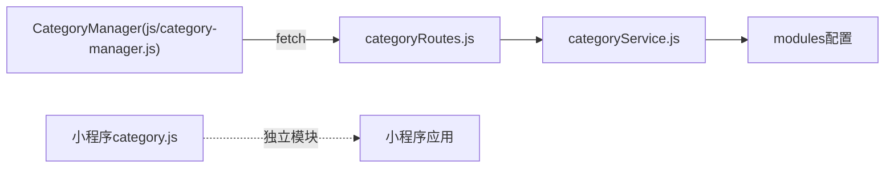

# 分类管理器组件

<cite>
**本文引用的文件**   
- [js/category-manager.js](file://js/category-manager.js)
- [backend/modules/common/services/categoryService.js](file://backend/modules/common/services/categoryService.js)
- [backend/modules/common/routes/categoryRoutes.js](file://backend/modules/common/routes/categoryRoutes.js)
- [wechat-mini-app/utils/category.js](file://wechat-mini-app/utils/category.js)
- [index.html](file://index.html)
- [admin.html](file://admin.html)
</cite>

## 目录
1. [简介](#简介)
2. [项目结构](#项目结构)
3. [核心组件](#核心组件)
4. [架构总览](#架构总览)
5. [详细组件分析](#详细组件分析)
6. [依赖关系分析](#依赖关系分析)
7. [性能与大数据优化](#性能与大数据优化)
8. [故障排查指南](#故障排查指南)
9. [结论](#结论)
10. [附录：使用示例与最佳实践](#附录使用示例与最佳实践)

## 简介
本文件围绕“分类管理器组件”进行系统化文档化，覆盖商品与服务分类的管理机制、数据模型、CRUD能力、搜索过滤与排序、数据同步（本地缓存/远程同步/冲突解决/增量更新）、以及前端渲染与交互。该组件同时服务于C端/M端页面与小程序侧，提供一致的品类选择与服务展示体验，并支持从后端API动态加载配置以增强可运营性。

## 项目结构
与分类管理相关的核心代码分布在以下位置：
- 前端通用分类管理器：js/category-manager.js
- 后端品类服务与路由：backend/modules/common/services/categoryService.js、backend/modules/common/routes/categoryRoutes.js
- 小程序端品类工具：wechat-mini-app/utils/category.js
- 后台管理与首页入口：admin.html、index.html（用于演示搜索/筛选等通用能力）

图表来源
- [js/category-manager.js:1-281](file://js/category-manager.js#L1-L281)
- [backend/modules/common/routes/categoryRoutes.js:1-59](file://backend/modules/common/routes/categoryRoutes.js#L1-L59)
- [backend/modules/common/services/categoryService.js:1-289](file://backend/modules/common/services/categoryService.js#L1-L289)
- [wechat-mini-app/utils/category.js:1-138](file://wechat-mini-app/utils/category.js#L1-L138)
- [admin.html:1-200](file://admin.html#L1-L200)
- [index.html:6403-6432](file://index.html#L6403-L6432)

章节来源
- [js/category-manager.js:1-281](file://js/category-manager.js#L1-L281)
- [backend/modules/common/routes/categoryRoutes.js:1-59](file://backend/modules/common/routes/categoryRoutes.js#L1-L59)
- [backend/modules/common/services/categoryService.js:1-289](file://backend/modules/common/services/categoryService.js#L1-L289)
- [wechat-mini-app/utils/category.js:1-138](file://wechat-mini-app/utils/category.js#L1-L138)
- [admin.html:1-200](file://admin.html#L1-L200)
- [index.html:6403-6432](file://index.html#L6403-L6432)

## 核心组件
- 前端分类管理器（CategoryManager）
  - 职责：维护本地品类与服务模板、渲染品类Tab与服务网格、保存选购上下文（品类+服务）、可选从后端API合并配置。
  - 关键API：getAllCategories、getByType、getCategory、getServices、selectCategory、getSelectedCategory、getShoppingContext、renderCategoryTabs、_renderServicesGrid、selectService、loadFromAPI。
- 后端品类服务（categoryService）
  - 职责：定义各品类的元信息、状态流、服务项；按模块开关过滤启用品类；对外暴露查询接口。
  - 关键函数：getEnabledCategories、getCategoriesByType、getCategory、getStatusFlow、getServices、getCategoryCards。
- 后端品类路由（categoryRoutes）
  - 职责：暴露REST API，如获取已启用品类、品类详情、品类服务列表、品类状态流。
- 小程序品类工具（utils/category.js）
  - 职责：为小程序端提供静态品类与服务模板、状态流、便捷查询方法。

章节来源
- [js/category-manager.js:91-269](file://js/category-manager.js#L91-L269)
- [backend/modules/common/services/categoryService.js:223-288](file://backend/modules/common/services/categoryService.js#L223-L288)
- [backend/modules/common/routes/categoryRoutes.js:9-56](file://backend/modules/common/routes/categoryRoutes.js#L9-L56)
- [wechat-mini-app/utils/category.js:101-138](file://wechat-mini-app/utils/category.js#L101-L138)

## 架构总览
分类管理采用“前端本地模板 + 后端权威配置”的混合模式：
- 前端默认携带品类与服务模板，保证离线可用与首屏快速渲染。
- 启动时可选择调用后端API，将后端返回的品类卡片/详情与本地模板合并，实现“热更新”。
- 小程序端通过独立工具模块提供同类能力，保持多端一致。

图表来源
- [js/category-manager.js:147-268](file://js/category-manager.js#L147-L268)
- [backend/modules/common/routes/categoryRoutes.js:9-17](file://backend/modules/common/routes/categoryRoutes.js#L9-L17)
- [backend/modules/common/services/categoryService.js:266-278](file://backend/modules/common/services/categoryService.js#L266-L278)

## 详细组件分析

### 数据模型与树形结构
- 品类节点属性（前端模板）
  - id、name、icon、color、category（service/rental）、desc、keywords（用于搜索）。
- 服务项属性
  - id、icon、name、desc、price、unit、deposit（租赁押金）、isBoarding（是否寄养）、diagnostic（是否需要诊断）等。
- 层级关系
  - 当前实现为“品类 -> 服务项”两层结构，未实现多级子分类树。如需扩展为树形，可在品类对象中增加children字段，并在渲染逻辑中递归展开。
- 显示顺序
  - 前端模板数组顺序即为展示顺序；后端通过getCategoryCards映射生成卡片数组，顺序由后端枚举顺序决定。
- 状态标记
  - 每个品类定义statusFlow，包含状态键值、标签、图标及用户可见文案，用于订单流程可视化。

图表来源
- [backend/modules/common/services/categoryService.js:15-214](file://backend/modules/common/services/categoryService.js#L15-L214)
- [js/category-manager.js:15-86](file://js/category-manager.js#L15-L86)

章节来源
- [backend/modules/common/services/categoryService.js:15-214](file://backend/modules/common/services/categoryService.js#L15-L214)
- [js/category-manager.js:15-86](file://js/category-manager.js#L15-L86)

### CRUD操作与动态增删改查
- 读（Read）
  - 前端：getAllCategories、getByType、getCategory、getServices、getSelectedCategory、getShoppingContext。
  - 后端：/api/categories/list、/:categoryId、/:categoryId/services、/:categoryId/status-flow。
- 写（Create/Update/Delete）
  - 当前前端CategoryManager未暴露直接写入后端的API；后端也未提供品类/服务的创建、更新、删除接口。
  - 建议扩展：在后端新增品类与服务的CRUD路由，并在CategoryManager中封装对应的异步方法，结合权限校验与变更日志。

章节来源
- [js/category-manager.js:91-142](file://js/category-manager.js#L91-L142)
- [backend/modules/common/routes/categoryRoutes.js:9-56](file://backend/modules/common/routes/categoryRoutes.js#L9-L56)

### 搜索与过滤
- 前端模板中的品类具备keywords字段，可用于关键词匹配。
- 现有页面（index.html）展示了通用的搜索与分类筛选逻辑，可作为参考实现思路：监听输入事件，对数据进行过滤并重新渲染。
- 建议在CategoryManager中增加searchCategories(query)、filterByType(type)等方法，统一封装搜索与过滤逻辑。

章节来源
- [js/category-manager.js:15-25](file://js/category-manager.js#L15-L25)
- [index.html:6403-6432](file://index.html#L6403-L6432)

### 排序功能
- 当前未内置排序能力。
- 建议扩展：在getServices或getCategoryCards中支持orderBy参数（如按价格升序/降序、按名称字母序），并提供UI控制按钮切换排序策略。

[本节为通用建议，不直接分析具体文件]

### 数据同步机制
- 本地缓存
  - CategoryManager使用localStorage持久化selectedCategory与selectedService，保障跨页面跳转的上下文一致性。
- 远程同步
  - loadFromAPI调用/api/categories/list，成功后将后端返回的categories与本地模板合并（同名id覆盖）。
- 冲突解决
  - 当前采用“后端覆盖本地同名项”的策略；可扩展为字段级合并或版本比较。
- 增量更新
  - 当前为全量拉取；后续可引入lastSyncTime或ETag/版本号，仅拉取变更部分。

图表来源
- [js/category-manager.js:112-142](file://js/category-manager.js#L112-L142)
- [js/category-manager.js:251-268](file://js/category-manager.js#L251-L268)
- [backend/modules/common/routes/categoryRoutes.js:9-17](file://backend/modules/common/routes/categoryRoutes.js#L9-L17)

章节来源
- [js/category-manager.js:112-142](file://js/category-manager.js#L112-L142)
- [js/category-manager.js:251-268](file://js/category-manager.js#L251-L268)
- [backend/modules/common/routes/categoryRoutes.js:9-17](file://backend/modules/common/routes/categoryRoutes.js#L9-L17)

### 渲染与交互
- 渲染品类Tab与服务网格
  - renderCategoryTabs负责注入容器并渲染Tab；_renderServicesGrid根据当前品类渲染服务卡片网格。
- 选择与跳转
  - selectCategory保存选中品类与服务；selectService保存上下文并跳转到下单页。
- 回调与事件
  - 支持传入onSelect回调（当前实现预留），便于上层业务处理选中事件。

图表来源
- [js/category-manager.js:147-249](file://js/category-manager.js#L147-L249)

章节来源
- [js/category-manager.js:147-249](file://js/category-manager.js#L147-L249)

### 小程序端适配
- utils/category.js提供与前端类似的API：getAllCategories、getByType、getCategory、getServices、getStatusFlow、getHomeServices。
- 适用于小程序环境下的静态模板与状态流展示。

章节来源
- [wechat-mini-app/utils/category.js:101-138](file://wechat-mini-app/utils/category.js#L101-L138)

## 依赖关系分析
- 前端CategoryManager依赖：
  - DOM API（getElementById、innerHTML）
  - localStorage
  - fetch（可选，用于loadFromAPI）
- 后端categoryRoutes依赖：
  - Express Router
  - categoryService
- categoryService依赖：
  - modules配置（控制模块开关）

图表来源
- [js/category-manager.js:251-268](file://js/category-manager.js#L251-L268)
- [backend/modules/common/routes/categoryRoutes.js:1-8](file://backend/modules/common/routes/categoryRoutes.js#L1-L8)
- [backend/modules/common/services/categoryService.js:9-10](file://backend/modules/common/services/categoryService.js#L9-L10)

章节来源
- [js/category-manager.js:251-268](file://js/category-manager.js#L251-L268)
- [backend/modules/common/routes/categoryRoutes.js:1-8](file://backend/modules/common/routes/categoryRoutes.js#L1-L8)
- [backend/modules/common/services/categoryService.js:9-10](file://backend/modules/common/services/categoryService.js#L9-L10)

## 性能与大数据优化
- 渲染优化
  - 使用DocumentFragment批量插入，减少重排重绘。
  - 虚拟滚动：当服务项数量较大时，按需渲染可视区域。
- 数据层优化
  - 索引与缓存：对常用查询（按type、按id）建立内存索引。
  - 增量同步：引入lastSyncTime或版本号，避免全量拉取。
- 网络优化
  - 请求去抖与重试：对loadFromAPI增加防抖与失败重试。
  - 压缩与分页：后端返回大量数据时支持分页。
- 用户体验
  - 骨架屏与占位图：提升感知速度。
  - 错误降级：后端不可用时自动回退到本地模板。

[本节为通用建议，不直接分析具体文件]

## 故障排查指南
- 常见问题
  - 后端API不可用：CategoryManager会打印提示并使用本地配置。检查网络与后端服务状态。
  - 本地缓存异常：清理localStorage中selectedCategory与selectedService后重试。
  - 渲染容器缺失：确保传入的containerId存在且可访问。
- 调试建议
  - 打开浏览器控制台查看日志输出。
  - 手动触发loadFromAPI并观察响应体。
  - 验证后端路由是否正常挂载与响应格式是否符合预期。

章节来源
- [js/category-manager.js:251-268](file://js/category-manager.js#L251-L268)

## 结论
分类管理器组件在当前仓库中提供了稳定的“品类+服务”两级结构与前后端协同的数据加载方案，满足C端/M端的基础展示与交互需求。为实现更完善的“分类树形结构、动态增删改查、搜索过滤与排序、增量同步”，建议在现有基础上扩展后端CRUD接口、完善前端搜索/排序API、引入增量同步策略，并对大数据场景进行渲染与网络层面的优化。

[本节为总结性内容，不直接分析具体文件]

## 附录：使用示例与最佳实践

### 初始化与配置
- 在页面中引入CategoryManager脚本。
- 准备一个容器元素（例如id="category-tabs"）用于渲染品类Tab。
- 调用renderCategoryTabs(containerId, onSelect)完成初始化。

章节来源
- [js/category-manager.js:147-176](file://js/category-manager.js#L147-L176)

### 数据绑定与上下文
- 使用getSelectedCategory与getShoppingContext获取当前选中的品类与服务。
- 在下单页读取URL参数category与service，并结合CategoryManager提供的API进行二次确认与展示。

章节来源
- [js/category-manager.js:126-142](file://js/category-manager.js#L126-L142)
- [js/category-manager.js:237-249](file://js/category-manager.js#L237-L249)

### 事件处理
- 在renderCategoryTabs时传入onSelect回调，捕获品类切换事件，执行自定义逻辑（如埋点、统计、联动筛选）。
- 在服务卡片点击时，selectService会自动保存上下文并跳转下单页。

章节来源
- [js/category-manager.js:147-176](file://js/category-manager.js#L147-176)
- [js/category-manager.js:237-249](file://js/category-manager.js#L237-L249)

### 搜索与过滤示例思路
- 基于keywords字段实现关键词搜索。
- 基于category/type实现类型筛选。
- 参考index.html中的搜索与分类筛选实现，将其抽象为CategoryManager的方法。

章节来源
- [js/category-manager.js:15-25](file://js/category-manager.js#L15-L25)
- [index.html:6403-6432](file://index.html#L6403-L6432)

### 后端集成要点
- 确保/api/categories/list返回格式为{ success: true, categories: [...] }。
- 后端通过categoryService.getCategoryCards生成卡片数据，注意模块开关enabled的影响。

章节来源
- [backend/modules/common/routes/categoryRoutes.js:9-17](file://backend/modules/common/routes/categoryRoutes.js#L9-L17)
- [backend/modules/common/services/categoryService.js:266-278](file://backend/modules/common/services/categoryService.js#L266-L278)