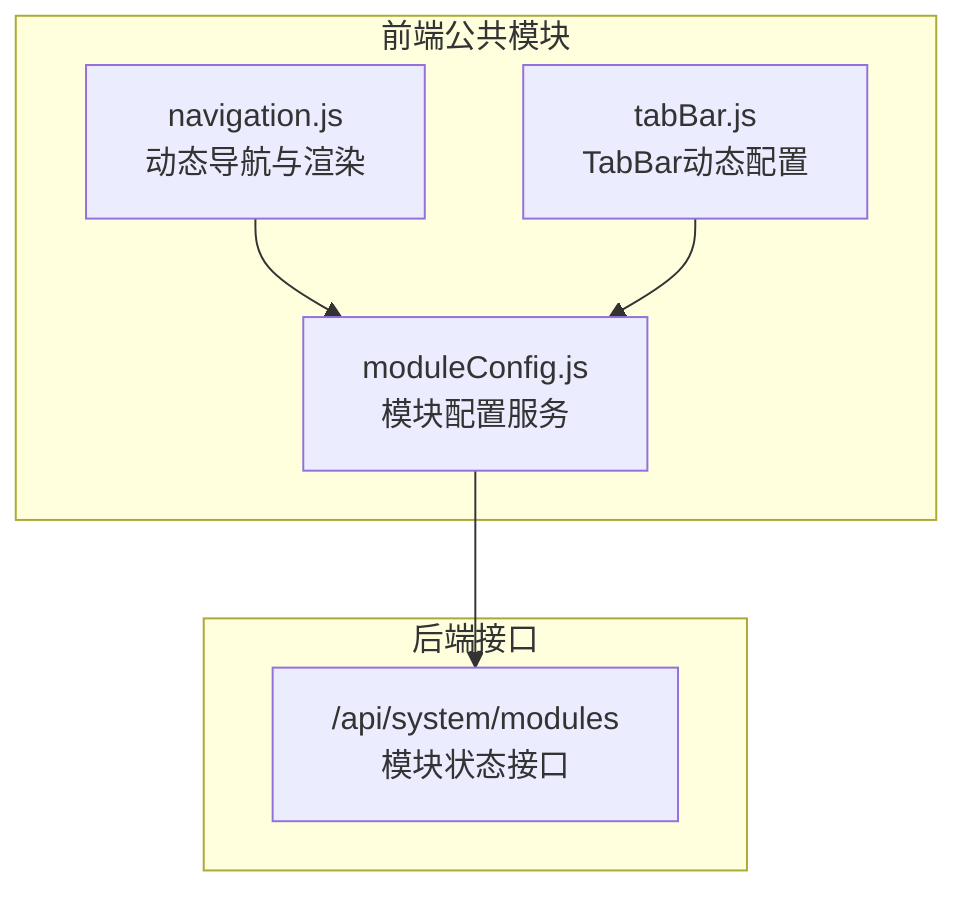
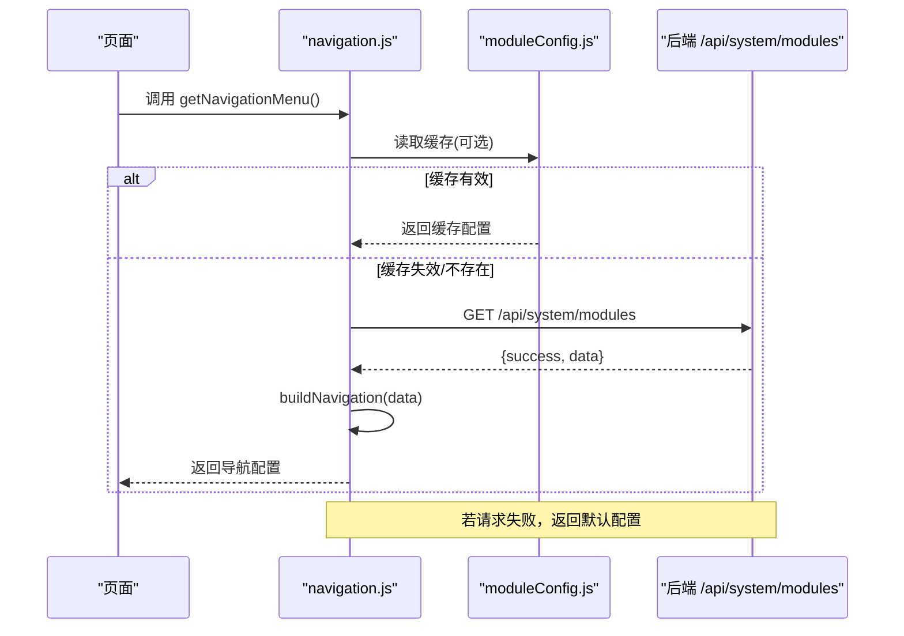
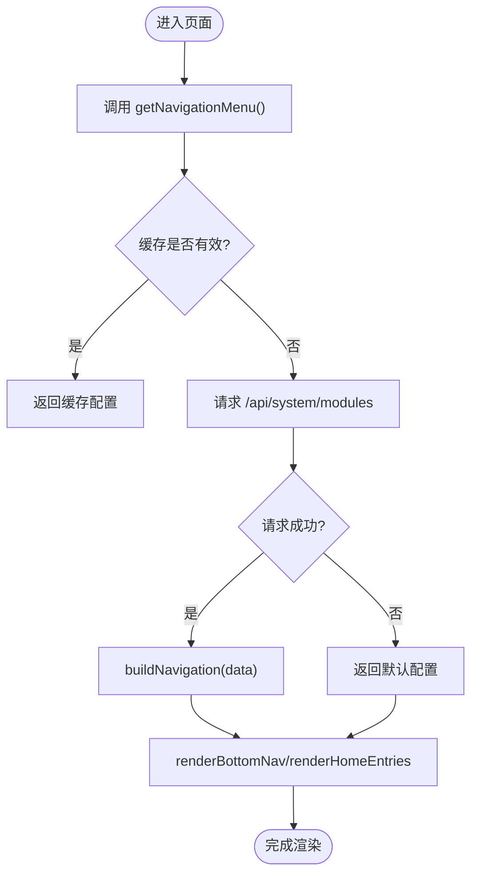
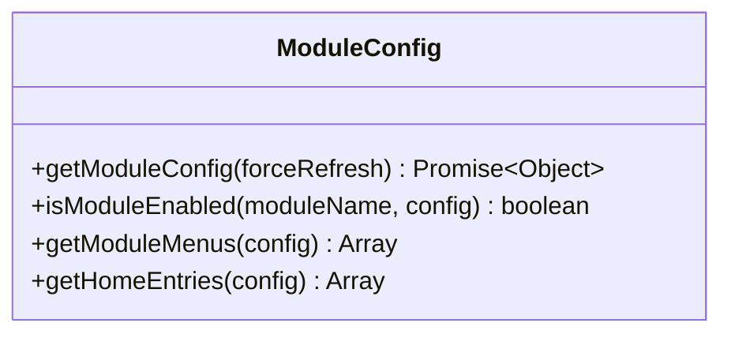
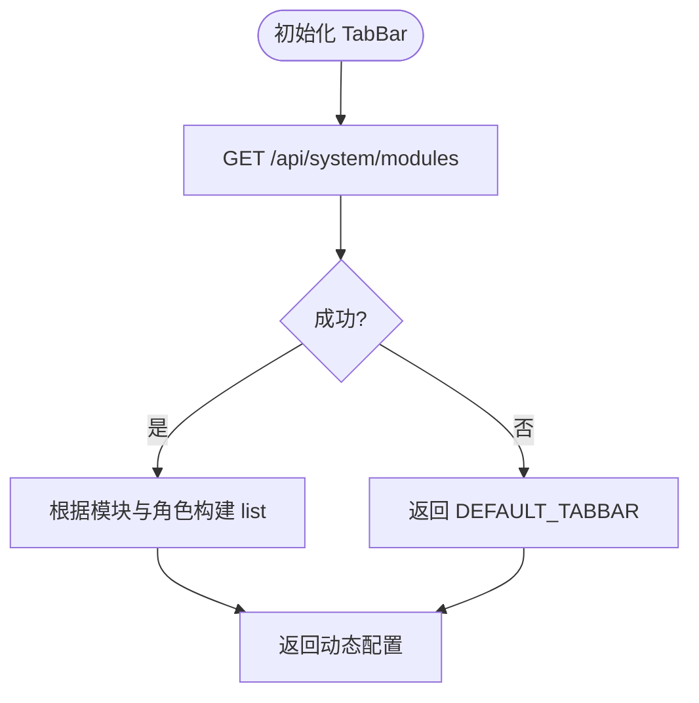
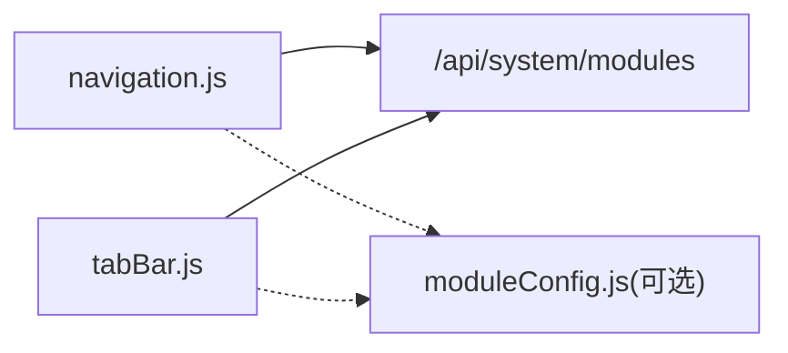

# 导航组件

<cite>
**本文引用的文件**   
- [navigation.js](file://frontend/common/navigation.js)
- [moduleConfig.js](file://frontend/common/moduleConfig.js)
- [tabBar.js](file://frontend/common/tabBar.js)
- [INTEGRATION.md](file://frontend/INTEGRATION.md)
</cite>

## 目录
1. [简介](#简介)
2. [项目结构](#项目结构)
3. [核心组件](#核心组件)
4. [架构总览](#架构总览)
5. [详细组件分析](#详细组件分析)
6. [依赖关系分析](#依赖关系分析)
7. [性能与兼容性](#性能与兼容性)
8. [故障排查指南](#故障排查指南)
9. [结论](#结论)
10. [附录：使用示例与最佳实践](#附录使用示例与最佳实践)

## 简介
本文件面向前端开发者，系统化阐述“导航组件”的设计与实现。该组件基于后端模块配置动态生成菜单、构建首页功能入口、管理用户菜单，并提供缓存策略与降级处理；同时涵盖图标系统集成、DOM 渲染优化、事件绑定与响应式适配等关键能力。文档提供完整的集成步骤、扩展规范与性能优化建议，帮助快速落地并稳定演进。

## 项目结构
导航相关代码集中在 frontend/common 目录下，包含三个核心模块：
- navigation.js：C端 H5 的动态导航（主导航、用户菜单、首页入口）与渲染逻辑
- moduleConfig.js：模块配置服务（获取/缓存/降级），为导航与 TabBar 提供数据源
- tabBar.js：小程序 TabBar 动态配置（根据模块状态与角色动态生成）

图表来源
- [navigation.js:1-316](file://frontend/common/navigation.js#L1-L316)
- [moduleConfig.js:1-191](file://frontend/common/moduleConfig.js#L1-L191)
- [tabBar.js:1-138](file://frontend/common/tabBar.js#L1-L138)

章节来源
- [INTEGRATION.md:1-208](file://frontend/INTEGRATION.md#L1-L208)

## 核心组件
- 动态导航（navigation.js）
  - 从后端 /system/modules 拉取模块配置，构建主导航、用户菜单与首页入口
  - 内置本地缓存与过期时间，失败时回退到默认配置
  - 提供 renderBottomNav 与 renderHomeEntries 两个渲染函数，支持禁用态、徽章、活跃态
- 模块配置服务（moduleConfig.js）
  - 统一对外暴露 getModuleConfig/isModuleEnabled/getModuleMenus/getHomeEntries
  - 具备 5 分钟 TTL 的内存缓存与本地降级配置
- TabBar 动态配置（tabBar.js）
  - 根据模块启用状态与用户角色动态生成小程序底部 TabBar
  - 提供简化版 getSimpleTabBar 用于 C 端 H5 场景

章节来源
- [navigation.js:1-316](file://frontend/common/navigation.js#L1-L316)
- [moduleConfig.js:1-191](file://frontend/common/moduleConfig.js#L1-L191)
- [tabBar.js:1-138](file://frontend/common/tabBar.js#L1-L138)

## 架构总览
导航系统的数据流遵循“配置驱动 + 缓存优先 + 降级兜底”的模式：
- 启动阶段调用 getNavigationMenu 或 getModuleConfig
- 命中缓存则直接返回；未命中则请求后端 /api/system/modules
- 成功则更新缓存并返回；失败则返回本地默认配置
- 渲染层根据配置对象生成 DOM，并绑定交互事件

图表来源
- [navigation.js:15-39](file://frontend/common/navigation.js#L15-L39)
- [moduleConfig.js:17-40](file://frontend/common/moduleConfig.js#L17-L40)

## 详细组件分析

### 动态导航（navigation.js）
- 设计理念
  - 以“模块开关”为核心：通过 modules.cleaning/recycle/rental.enabled 控制可见性与可用性
  - 将“展示层”与“配置层”解耦：buildNavigation 仅做映射，render* 负责 DOM 输出
  - 强调健壮性：网络异常或字段缺失时自动降级
- 数据结构
  - mainNav：主导航项数组，支持 id/name/path/icon/visible/disabled/badge/disabledMessage/active 等属性
  - userMenu：用户菜单项数组，支持 roles 权限过滤
  - homeEntries：首页功能入口数组，支持 title/subtitle/icon/color/tags/disabled/path
- 渲染机制
  - renderBottomNav(containerId)：按当前路径匹配 active，注入 disabled 与 badge，并为禁用项绑定点击提示
  - renderHomeEntries(containerId)：按模块状态生成卡片，禁用态显示“敬请期待”
- 图标系统
  - getIcon(type) 内建 SVG 片段映射，避免外部字体依赖，提升首屏稳定性
- 事件与交互
  - 禁用项拦截 click，阻止跳转并弹出提示信息
  - 活跃态通过 window.location.pathname 与 item.path 比对

图表来源
- [navigation.js:15-39](file://frontend/common/navigation.js#L15-L39)
- [navigation.js:44-118](file://frontend/common/navigation.js#L44-L118)
- [navigation.js:230-293](file://frontend/common/navigation.js#L230-L293)

章节来源
- [navigation.js:1-316](file://frontend/common/navigation.js#L1-L316)

### 模块配置服务（moduleConfig.js）
- 职责
  - 统一获取模块状态，维护内存缓存与本地降级配置
  - 提供 isModuleEnabled 判断、getModuleMenus 与 getHomeEntries 工具方法
- 缓存策略
  - 全局变量缓存 + 时间戳校验，TTL=5 分钟
  - 支持 forceRefresh 强制刷新
- 降级策略
  - 请求失败或字段缺失时返回本地默认配置，保证 UI 可用

图表来源
- [moduleConfig.js:17-40](file://frontend/common/moduleConfig.js#L17-L40)
- [moduleConfig.js:76-79](file://frontend/common/moduleConfig.js#L76-L79)
- [moduleConfig.js:84-132](file://frontend/common/moduleConfig.js#L84-L132)
- [moduleConfig.js:137-179](file://frontend/common/moduleConfig.js#L137-L179)

章节来源
- [moduleConfig.js:1-191](file://frontend/common/moduleConfig.js#L1-L191)

### TabBar 动态配置（tabBar.js）
- 职责
  - 根据模块启用状态与用户角色动态生成小程序 TabBar
  - 提供简化版 getSimpleTabBar 用于 H5 场景
- 规则
  - 首页、订单始终显示
  - 当任一业务模块启用时显示“服务”
  - 特定角色显示“管理”
  - 我的始终显示

图表来源
- [tabBar.js:47-113](file://frontend/common/tabBar.js#L47-L113)
- [tabBar.js:118-131](file://frontend/common/tabBar.js#L118-L131)

章节来源
- [tabBar.js:1-138](file://frontend/common/tabBar.js#L1-L138)

## 依赖关系分析
- navigation.js 依赖 moduleConfig.js 提供的模块状态（或直接调用后端 /system/modules）
- tabBar.js 同样依赖 /api/system/modules 接口
- 三者共享同一份模块配置语义，确保多端一致性

图表来源
- [navigation.js:24-38](file://frontend/common/navigation.js#L24-L38)
- [tabBar.js:47-113](file://frontend/common/tabBar.js#L47-L113)
- [moduleConfig.js:25-40](file://frontend/common/moduleConfig.js#L25-L40)

章节来源
- [navigation.js:1-316](file://frontend/common/navigation.js#L1-L316)
- [tabBar.js:1-138](file://frontend/common/tabBar.js#L1-L138)
- [moduleConfig.js:1-191](file://frontend/common/moduleConfig.js#L1-L191)

## 性能与兼容性
- 性能优化
  - 内存缓存：navigation.js 与 moduleConfig.js 均实现 5 分钟 TTL 的内存缓存，减少重复请求
  - 按需渲染：仅在容器存在时执行 innerHTML 写入，避免无效操作
  - 事件最小化：禁用项在渲染后批量绑定一次监听器，避免重复注册
  - 图标内联：SVG 片段直接内嵌，减少额外资源加载
- 兼容性处理
  - 降级策略：网络异常或字段缺失时返回默认配置，保障基础体验
  - 路径兼容：path 为空时使用 javascript:void(0)，防止空链接报错
  - 环境差异：moduleConfig.js 支持 process.env.API_BASE 覆盖，便于不同环境部署

[本节为通用指导，不直接分析具体文件]

## 故障排查指南
- 常见问题
  - 菜单不显示：检查 modules.xxx.enabled 是否为 true；确认 visible 过滤逻辑
  - 禁用项可点击：确认 data-disabled 与 click 拦截逻辑是否生效
  - 徽章不显示：确认配置中是否存在 badge 字段且非空
  - 图标缺失：确认 icon/type 是否在 getIcon 映射中存在
- 定位步骤
  - 打开控制台查看 [Navigation]/[ModuleConfig]/[TabBar] 日志
  - 验证 /api/system/modules 返回结构与 success 字段
  - 对比默认配置与后端返回的差异，逐步缩小范围

章节来源
- [navigation.js:33-38](file://frontend/common/navigation.js#L33-L38)
- [navigation.js:252-259](file://frontend/common/navigation.js#L252-L259)
- [moduleConfig.js:34-40](file://frontend/common/moduleConfig.js#L34-L40)
- [tabBar.js:109-113](file://frontend/common/tabBar.js#L109-L113)

## 结论
导航组件通过“配置驱动 + 缓存优先 + 降级兜底”的架构，实现了跨端一致的动态菜单与入口构建。其清晰的职责划分、完善的错误处理与良好的可扩展性，使其既能满足现有业务需求，也便于后续新增模块与权限控制的平滑接入。

[本节为总结性内容，不直接分析具体文件]

## 附录：使用示例与最佳实践

### 初始化方法
- 在页面加载完成后调用渲染函数
  - 底部导航：renderBottomNav('bottom-nav-container')
  - 首页入口：renderHomeEntries('home-entries-container')
- 小程序侧
  - 在 app.js 中调用 getDynamicTabBar 并设置到框架配置

章节来源
- [navigation.js:230-293](file://frontend/common/navigation.js#L230-L293)
- [tabBar.js:47-113](file://frontend/common/tabBar.js#L47-L113)
- [INTEGRATION.md:30-91](file://frontend/INTEGRATION.md#L30-L91)

### 自定义配置
- 新增模块
  - 在后端 /api/system/modules 返回中增加对应模块 enabled 字段
  - 在 navigation.js 的 buildNavigation 中添加主导航与首页入口映射
  - 在 tabBar.js 中补充 TabBar 条目（如需）
- 权限控制
  - 用户菜单支持 roles 字段，可在上层根据当前用户角色过滤
- 样式定制
  - 通过 CSS 类名 nav-item、nav-badge、home-entry 等进行主题定制
  - 图标颜色可通过 entry.color 动态注入

章节来源
- [navigation.js:44-118](file://frontend/common/navigation.js#L44-L118)
- [navigation.js:230-293](file://frontend/common/navigation.js#L230-L293)
- [tabBar.js:47-113](file://frontend/common/tabBar.js#L47-L113)
- [INTEGRATION.md:140-184](file://frontend/INTEGRATION.md#L140-L184)

### 扩展开发规范
- 命名约定
  - 模块 key 使用小写英文，如 cleaning/recycle/rental
  - 导航项 id 唯一且语义清晰
- 配置契约
  - 必须包含 enabled 布尔字段；可选 message 用于禁用提示
  - 首页入口需包含 path 或明确 disabled 行为
- 变更流程
  - 先改后端配置，再在前端添加映射与渲染逻辑
  - 保持默认配置与后端一致，确保降级可用

章节来源
- [moduleConfig.js:45-71](file://frontend/common/moduleConfig.js#L45-L71)
- [navigation.js:204-226](file://frontend/common/navigation.js#L204-L226)
- [INTEGRATION.md:186-208](file://frontend/INTEGRATION.md#L186-L208)