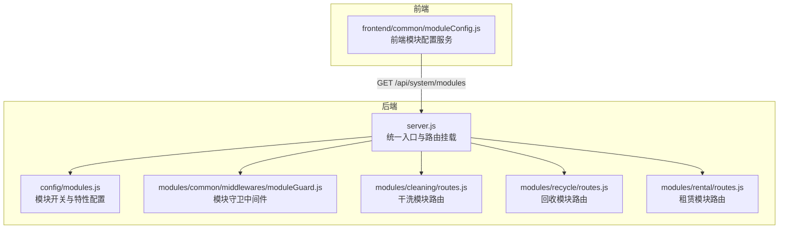
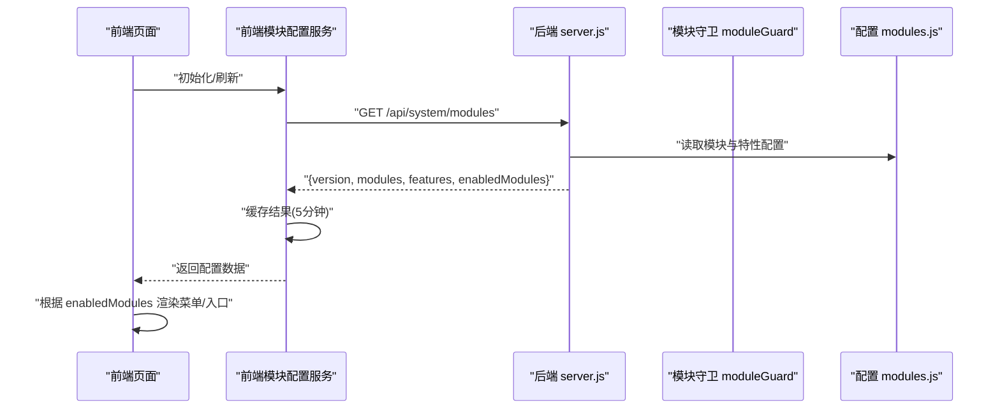
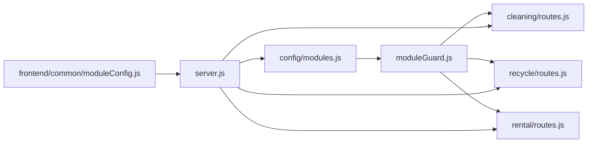

# 模块配置组件

<cite>
**本文引用的文件**   
- [backend/server.js](file://backend/server.js)
- [backend/config/modules.js](file://backend/config/modules.js)
- [backend/modules/common/middlewares/moduleGuard.js](file://backend/modules/common/middlewares/moduleGuard.js)
- [backend/modules/cleaning/routes.js](file://backend/modules/cleaning/routes.js)
- [backend/modules/recycle/routes.js](file://backend/modules/recycle/routes.js)
- [backend/modules/rental/routes.js](file://backend/modules/rental/routes.js)
- [frontend/common/moduleConfig.js](file://frontend/common/moduleConfig.js)
- [js/store-config.js](file://js/store-config.js)
- [backend/data/store-configs/ST001.json](file://backend/data/store-configs/ST001.json)
</cite>

## 目录
1. [简介](#简介)
2. [项目结构](#项目结构)
3. [核心组件](#核心组件)
4. [架构总览](#架构总览)
5. [详细组件分析](#详细组件分析)
6. [依赖分析](#依赖分析)
7. [性能考虑](#性能考虑)
8. [故障排查指南](#故障排查指南)
9. [结论](#结论)
10. [附录](#附录)

## 简介
本文件面向“模块配置组件”的完整使用与开发指南，围绕模块化架构的配置管理机制展开，涵盖：
- 模块注册、动态加载、依赖管理与版本控制
- 模块生命周期管理、配置验证、错误处理、热重载支持
- 配置结构定义（模块元数据、API接口声明、路由映射、权限配置）
- 加载机制（异步加载、懒加载、预加载策略）
- 配置示例与最佳实践（模块开发规范、配置模板、调试工具）
- 性能优化方案与故障排查指南

该体系以“后端集中式配置 + 前端按需消费”的方式实现，通过统一的系统接口暴露模块状态，前端据此动态生成菜单与入口。

## 项目结构
本项目采用“按功能域分模块”的组织方式，核心模块位于 backend/modules 下，每个模块包含 routes 与 services；配置集中在 backend/config；前端在 frontend/common 提供模块配置服务，用于动态渲染导航与入口。

图表来源
- [backend/server.js:59-82](file://backend/server.js#L59-L82)
- [backend/config/modules.js:11-97](file://backend/config/modules.js#L11-L97)
- [backend/modules/common/middlewares/moduleGuard.js:13-42](file://backend/modules/common/middlewares/moduleGuard.js#L13-L42)
- [backend/modules/cleaning/routes.js:1-14](file://backend/modules/cleaning/routes.js#L1-L14)
- [backend/modules/recycle/routes.js:1-11](file://backend/modules/recycle/routes.js#L1-L11)
- [backend/modules/rental/routes.js:1-14](file://backend/modules/rental/routes.js#L1-L14)
- [frontend/common/moduleConfig.js:17-40](file://frontend/common/moduleConfig.js#L17-L40)

章节来源
- [backend/server.js:59-82](file://backend/server.js#L59-L82)
- [backend/config/modules.js:11-97](file://backend/config/modules.js#L11-L97)
- [frontend/common/moduleConfig.js:17-40](file://frontend/common/moduleConfig.js#L17-L40)

## 核心组件
- 模块配置中心：集中维护模块元数据、启用状态、版本、消息提示等，并暴露系统接口供前端查询。
- 模块守卫中间件：对模块级路由进行统一鉴权与可用性检查，未启用时返回友好提示。
- 前端模块配置服务：从后端拉取模块状态，缓存并降级到本地默认配置，动态生成菜单与首页入口。
- 店面配置管理：基于门店维度的服务类别、价格与促销配置，支持前后端同步与持久化。

章节来源
- [backend/config/modules.js:11-97](file://backend/config/modules.js#L11-L97)
- [backend/modules/common/middlewares/moduleGuard.js:13-42](file://backend/modules/common/middlewares/moduleGuard.js#L13-L42)
- [frontend/common/moduleConfig.js:17-40](file://frontend/common/moduleConfig.js#L17-L40)
- [js/store-config.js:48-88](file://js/store-config.js#L48-L88)

## 架构总览
下图展示了“系统模块状态获取”的端到端流程：前端调用系统接口，后端读取集中配置并返回，前端据此构建菜单与入口。

图表来源
- [backend/server.js:59-70](file://backend/server.js#L59-L70)
- [backend/config/modules.js:11-97](file://backend/config/modules.js#L11-L97)
- [frontend/common/moduleConfig.js:17-40](file://frontend/common/moduleConfig.js#L17-L40)

## 详细组件分析

### 模块配置中心（后端）
- 职责
  - 维护全局版本号与各模块元数据（名称、图标、分类、启用状态、上线说明等）。
  - 维护功能开关（配送、会员、积分、优惠券、押金、信用评估等）。
  - 维护支付分账规则与通知模板列表。
- 关键要点
  - 所有模块均具备 version 字段，便于前端展示与兼容性判断。
  - enabled 字段决定模块是否可用；message/launchDate 用于向用户提示。
  - features 作为横切能力开关，可被各模块复用。
- 扩展建议
  - 新增模块时，需在配置中登记元数据与消息提示，并在路由层挂载对应 router。
  - 如需灰度发布，可在 features 中增加按租户或门店的开关维度。

章节来源
- [backend/config/modules.js:11-97](file://backend/config/modules.js#L11-L97)

### 模块守卫中间件
- 职责
  - 校验模块是否存在且已启用；未启用则返回 503 及提示信息。
  - 将模块名与配置注入请求上下文，供后续中间件或控制器使用。
- 行为
  - 模块不存在：404。
  - 模块未启用：503，携带 message、moduleName、launchDate 等字段。
  - 模块启用：继续执行后续逻辑。
- 使用方式
  - 在各模块路由顶层使用守卫，确保该模块所有接口受控。

章节来源
- [backend/modules/common/middlewares/moduleGuard.js:13-42](file://backend/modules/common/middlewares/moduleGuard.js#L13-L42)

### 干洗模块路由（示例）
- 特点
  - 在路由顶层应用模块守卫，确保 cleaning 模块启用后才响应。
  - 提供订单全生命周期接口（创建、查询、状态流转、支付、取件等）。
  - 提供定价与门店服务配置相关接口。
- 典型流程
  - 创建订单：接收参数 -> 校验 -> 生成单号 -> 落库 -> 返回结果。
  - 状态轮询：返回精简状态信息，禁用缓存头，保证实时性。

章节来源
- [backend/modules/cleaning/routes.js:1-14](file://backend/modules/cleaning/routes.js#L1-L14)
- [backend/modules/cleaning/routes.js:24-42](file://backend/modules/cleaning/routes.js#L24-L42)
- [backend/modules/cleaning/routes.js:496-564](file://backend/modules/cleaning/routes.js#L496-L564)

### 回收模块路由（占位）
- 现状
  - 所有接口返回“V2功能即将上线”，体现模块开关与渐进式交付。
- 价值
  - 提前暴露接口契约，便于前端联调与埋点准备。

章节来源
- [backend/modules/recycle/routes.js:1-11](file://backend/modules/recycle/routes.js#L1-L11)
- [backend/modules/recycle/routes.js:14-36](file://backend/modules/recycle/routes.js#L14-L36)

### 租赁模块路由（双向跑腿模型）
- 特点
  - 明确“发货（门店→用户）”和“归还（用户→门店）”两程流程。
  - 提供商品、订单、押金、信用评估等接口。
- 适用场景
  - 服饰与小件商品的短期租借业务。

章节来源
- [backend/modules/rental/routes.js:1-14](file://backend/modules/rental/routes.js#L1-L14)
- [backend/modules/rental/routes.js:21-40](file://backend/modules/rental/routes.js#L21-L40)
- [backend/modules/rental/routes.js:82-121](file://backend/modules/rental/routes.js#L82-L121)

### 前端模块配置服务
- 职责
  - 从后端获取模块状态，缓存 5 分钟，失败时降级到本地默认配置。
  - 提供方法：是否启用某模块、生成菜单、生成首页入口等。
- 设计要点
  - 缓存 TTL 避免频繁请求。
  - 降级策略保障离线或异常时的基本体验。
  - 对外暴露 API_BASE，便于环境切换。

章节来源
- [frontend/common/moduleConfig.js:17-40](file://frontend/common/moduleConfig.js#L17-L40)
- [frontend/common/moduleConfig.js:76-132](file://frontend/common/moduleConfig.js#L76-L132)
- [frontend/common/moduleConfig.js:137-179](file://frontend/common/moduleConfig.js#L137-L179)

### 店面配置管理（Store Config）
- 职责
  - 以门店为单位管理服务类别、服务价格、促销活动。
  - 支持本地存储与后端同步，提供计算优惠折扣的方法。
- 数据流
  - 前端读取/保存配置 -> 可选异步同步至后端 -> 后端持久化为 JSON 文件。
- 一致性
  - 后端提供与前端一致的促销计算逻辑，确保报价一致。

章节来源
- [js/store-config.js:48-88](file://js/store-config.js#L48-L88)
- [js/store-config.js:133-162](file://js/store-config.js#L133-L162)
- [backend/modules/cleaning/routes.js:688-722](file://backend/modules/cleaning/routes.js#L688-L722)
- [backend/data/store-configs/ST001.json:1-142](file://backend/data/store-configs/ST001.json#L1-L142)

## 依赖分析
- 耦合关系
  - server.js 依赖 config/modules.js 与模块守卫中间件，负责挂载各模块路由。
  - 各模块路由依赖模块守卫，形成“路由层统一鉴权”的强内聚。
  - 前端模块配置服务依赖后端系统接口，形成松耦合的前后端契约。
- 外部依赖
  - 数据库连接由后端配置模块统一管理，与模块配置解耦。
- 潜在风险
  - 若模块配置与路由挂载不一致，会导致“配置启用但路由缺失”或反之。
  - 前端缓存过期时间过长可能导致新模块上线后延迟可见。

图表来源
- [backend/server.js:59-82](file://backend/server.js#L59-L82)
- [backend/config/modules.js:11-97](file://backend/config/modules.js#L11-L97)
- [backend/modules/common/middlewares/moduleGuard.js:13-42](file://backend/modules/common/middlewares/moduleGuard.js#L13-L42)
- [backend/modules/cleaning/routes.js:1-14](file://backend/modules/cleaning/routes.js#L1-L14)
- [backend/modules/recycle/routes.js:1-11](file://backend/modules/recycle/routes.js#L1-L11)
- [backend/modules/rental/routes.js:1-14](file://backend/modules/rental/routes.js#L1-L14)
- [frontend/common/moduleConfig.js:17-40](file://frontend/common/moduleConfig.js#L17-L40)

章节来源
- [backend/server.js:59-82](file://backend/server.js#L59-L82)
- [backend/modules/common/middlewares/moduleGuard.js:13-42](file://backend/modules/common/middlewares/moduleGuard.js#L13-L42)

## 性能考虑
- 前端缓存
  - 模块配置缓存 5 分钟，降低网络开销与后端压力。
- 接口轻量化
  - 状态轮询接口仅返回必要字段，减少传输体积。
- 降级策略
  - 后端不可用时，前端回退到本地默认配置，保障基础体验。
- 磁盘 I/O
  - 门店配置以 JSON 文件持久化，适合小规模部署；规模扩大后可迁移至数据库。

[本节为通用指导，不直接分析具体文件]

## 故障排查指南
- 模块未启用导致 503
  - 现象：访问模块接口返回 503，携带 message 与 launchDate。
  - 排查：确认 config/modules.js 中对应模块 enabled 是否为 true。
- 前端菜单不更新
  - 现象：后端已启用模块，但前端未显示。
  - 排查：清除前端缓存或强制刷新；检查 API_BASE 是否正确。
- 门店配置不同步
  - 现象：前端修改后未生效。
  - 排查：检查后端 store-config 接口是否成功写入；确认 data/store-configs 目录下文件存在。
- 端口冲突或服务启动失败
  - 现象：启动时报端口占用或未捕获异常。
  - 排查：查看 server.js 的错误处理日志，关闭占用进程或更换端口。

章节来源
- [backend/modules/common/middlewares/moduleGuard.js:25-42](file://backend/modules/common/middlewares/moduleGuard.js#L25-L42)
- [frontend/common/moduleConfig.js:17-40](file://frontend/common/moduleConfig.js#L17-L40)
- [backend/modules/cleaning/routes.js:688-722](file://backend/modules/cleaning/routes.js#L688-L722)
- [backend/server.js:656-696](file://backend/server.js#L656-L696)

## 结论
本模块配置组件通过“集中配置 + 守卫中间件 + 前端动态渲染”的组合，实现了模块的灵活启停、版本管理与渐进式交付。配合店面配置与系统接口，既保证了运行期的可控性与可观测性，也兼顾了前端的用户体验与稳定性。建议在新增模块时严格遵循配置与路由对齐、接口契约稳定、错误码与提示清晰的原则，以获得更好的可维护性与可扩展性。

[本节为总结，不直接分析具体文件]

## 附录

### 配置结构定义（参考）
- 模块元数据
  - 关键字段：enabled、version、name、nameEn、category、icon、message、launchDate
- 功能开关
  - 关键字段：enabled、providers/levels/exchangeRate 等
- 支付分账
  - 关键字段：receivers、recycle、rental 比例
- 通知模板
  - 关键字段：按模块划分的消息事件集合

章节来源
- [backend/config/modules.js:11-97](file://backend/config/modules.js#L11-L97)

### 加载机制与最佳实践
- 异步加载
  - 前端在初始化阶段异步获取模块配置，避免阻塞首屏。
- 懒加载
  - 仅在模块启用时渲染对应菜单与入口，减少无用资源。
- 预加载策略
  - 对高概率使用的模块（如干洗下单）可提前预取相关静态资源。
- 模块开发规范
  - 新增模块需完成三件事：配置登记、路由挂载、守卫应用。
- 配置模板
  - 参考现有模块配置项，保持字段一致，便于前端解析。
- 调试工具
  - 使用浏览器控制台查看模块配置缓存；在后端日志中定位 503 原因。

章节来源
- [frontend/common/moduleConfig.js:17-40](file://frontend/common/moduleConfig.js#L17-L40)
- [backend/modules/cleaning/routes.js:1-14](file://backend/modules/cleaning/routes.js#L1-L14)