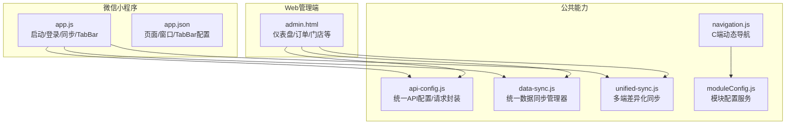
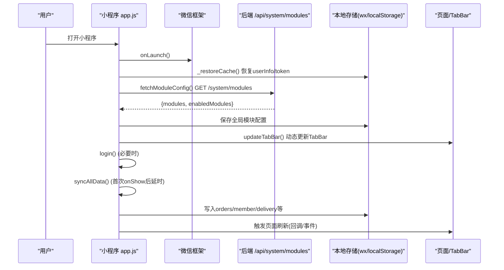
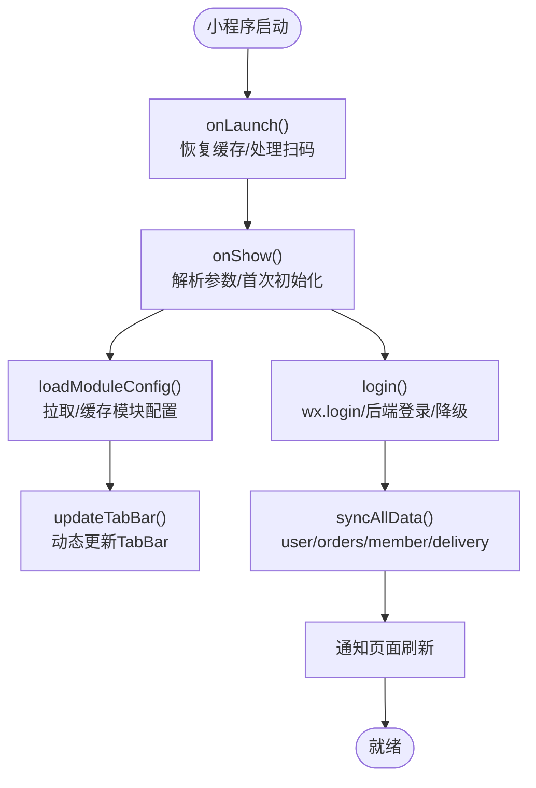
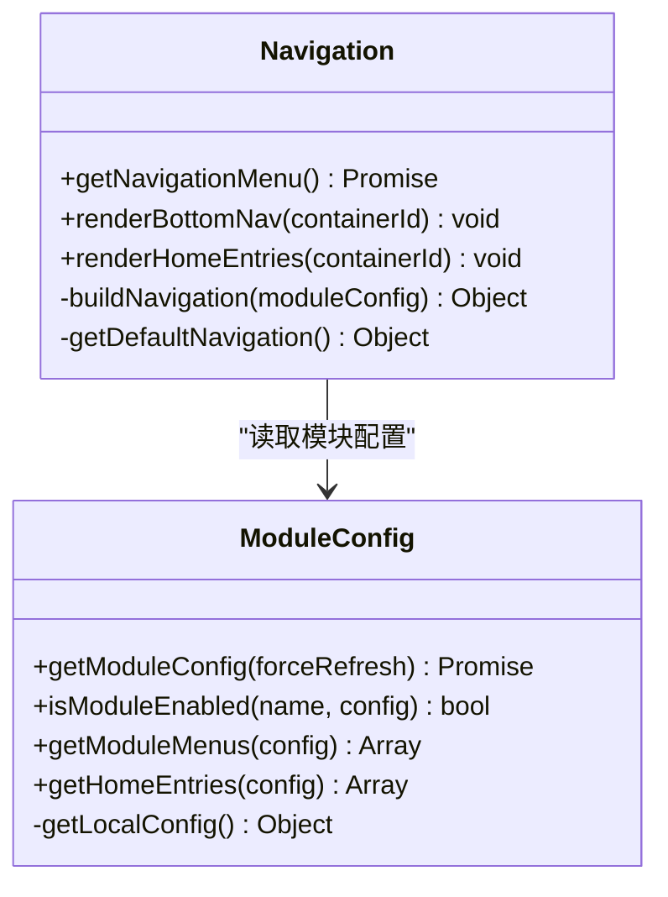
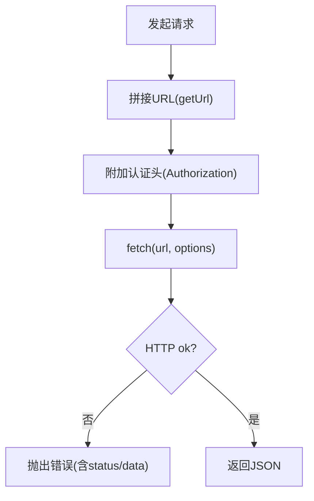
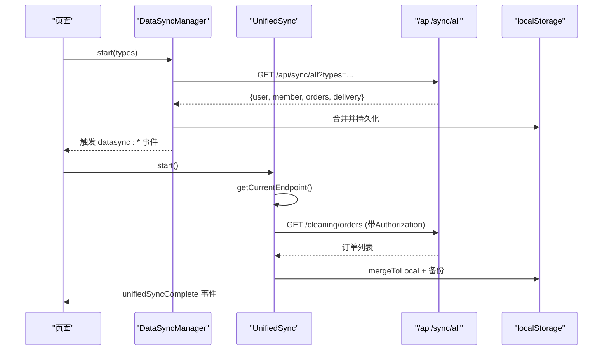
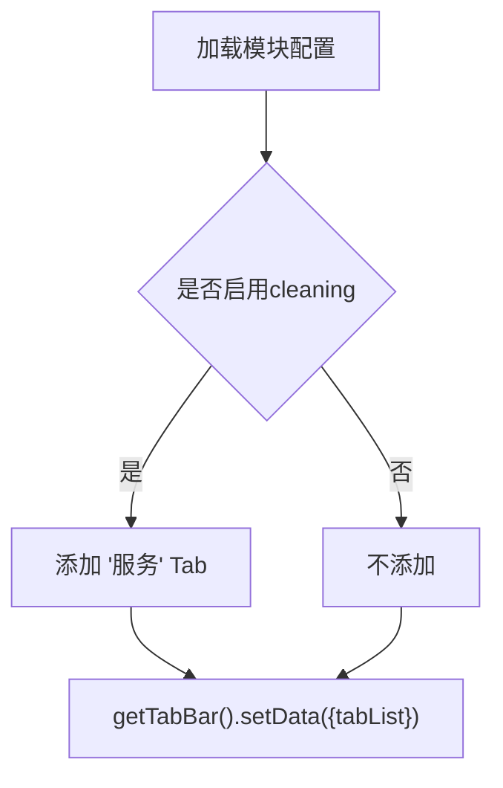
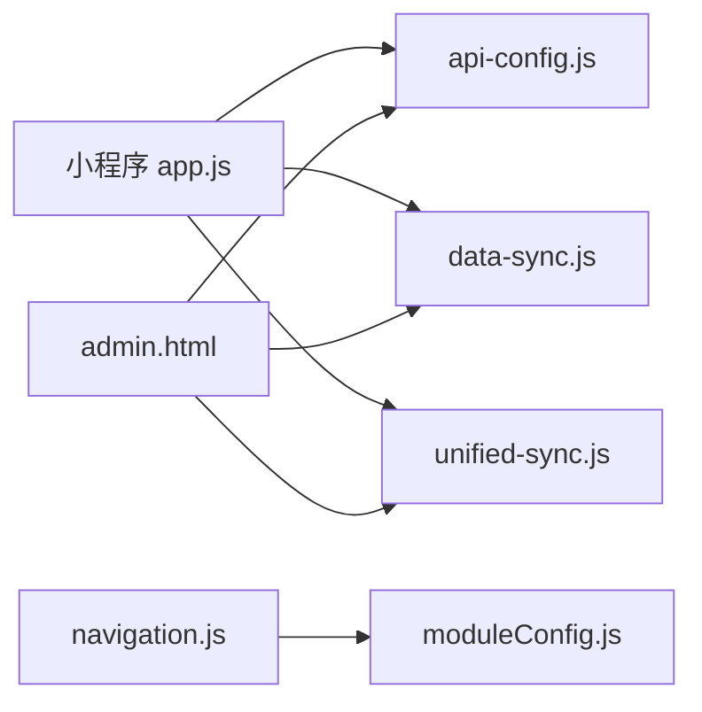

# 前端应用架构

<cite>
**本文引用的文件**   
- [wechat-mini-app/app.js](file://wechat-mini-app/app.js)
- [wechat-mini-app/app.json](file://wechat-mini-app/app.json)
- [frontend/common/navigation.js](file://frontend/common/navigation.js)
- [frontend/common/moduleConfig.js](file://frontend/common/moduleConfig.js)
- [js/api-config.js](file://js/api-config.js)
- [js/data-sync.js](file://js/data-sync.js)
- [js/unified-sync.js](file://js/unified-sync.js)
- [admin.html](file://admin.html)
</cite>

## 目录
1. [简介](#简介)
2. [项目结构](#项目结构)
3. [核心组件](#核心组件)
4. [架构总览](#架构总览)
5. [详细组件分析](#详细组件分析)
6. [依赖关系分析](#依赖关系分析)
7. [性能与构建优化](#性能与构建优化)
8. [监控、错误追踪与性能分析](#监控错误追踪与性能分析)
9. [开发规范与最佳实践](#开发规范与最佳实践)
10. [故障排查指南](#故障排查指南)
11. [结论](#结论)

## 简介
本文件为干洗店管理系统的前端应用架构文档，覆盖微信小程序与Web管理端的整体设计。重点说明：
- 应用初始化流程、全局状态管理与路由导航
- 模块配置与动态菜单生成
- 跨端数据同步机制（本地缓存、离线支持、增量/全量策略）
- 组件复用策略（公共库、页面模板、样式主题）
- 响应式布局、无障碍访问与用户体验优化
- 构建流程、打包优化与生产部署建议
- 监控、错误追踪与性能分析工具配置
- 面向前端的开发规范与最佳实践

## 项目结构
前端代码按“平台 + 公共能力”组织：
- 微信小程序端：位于 wechat-mini-app，包含应用入口、页面与小程序特有逻辑
- Web管理端：以单页HTML为主（如 admin.html），通过脚本引入统一API与同步模块
- 公共能力：
  - API配置与请求封装：js/api-config.js
  - 数据同步：js/data-sync.js（C/M/Admin通用）、js/unified-sync.js（多端差异化）
  - 模块配置与导航：frontend/common/moduleConfig.js、frontend/common/navigation.js

图表来源
- [wechat-mini-app/app.js:1-120](file://wechat-mini-app/app.js#L1-L120)
- [wechat-mini-app/app.json:1-53](file://wechat-mini-app/app.json#L1-L53)
- [js/api-config.js:1-120](file://js/api-config.js#L1-L120)
- [js/data-sync.js:1-120](file://js/data-sync.js#L1-L120)
- [js/unified-sync.js:1-120](file://js/unified-sync.js#L1-L120)
- [frontend/common/navigation.js:1-120](file://frontend/common/navigation.js#L1-L120)
- [frontend/common/moduleConfig.js:1-80](file://frontend/common/moduleConfig.js#L1-L80)
- [admin.html:1-60](file://admin.html#L1-L60)

章节来源
- [wechat-mini-app/app.js:1-120](file://wechat-mini-app/app.js#L1-L120)
- [wechat-mini-app/app.json:1-53](file://wechat-mini-app/app.json#L1-L53)
- [js/api-config.js:1-120](file://js/api-config.js#L1-L120)
- [js/data-sync.js:1-120](file://js/data-sync.js#L1-L120)
- [js/unified-sync.js:1-120](file://js/unified-sync.js#L1-L120)
- [frontend/common/navigation.js:1-120](file://frontend/common/navigation.js#L1-L120)
- [frontend/common/moduleConfig.js:1-80](file://frontend/common/moduleConfig.js#L1-L80)
- [admin.html:1-60](file://admin.html#L1-L60)

## 核心组件
- 应用初始化与生命周期
  - 小程序：在 onLaunch/onShow 中恢复本地缓存、加载模块配置、执行登录与延迟同步
  - Web管理端：通过引入 api-config.js 与同步模块，自动或手动触发同步
- 全局状态管理
  - 小程序 globalData 集中存放用户信息、Token、模块配置、配送信息等
  - Web端使用 localStorage 持久化 Token、用户信息与订单快照
- 路由与导航
  - 小程序：app.json 声明页面与 TabBar；运行时根据模块配置动态更新 TabBar
  - Web端：基于锚点与侧边栏的SPA风格导航；C端H5通过 navigation.js 动态渲染底部导航与首页入口
- 模块配置与动态菜单
  - 从后端 /system/modules 获取模块开关与文案，驱动菜单与功能入口
- 数据同步
  - 提供两套方案：
    - data-sync.js：统一事件驱动的同步器，适合C/M/Admin通用场景
    - unified-sync.js：针对C/M/Admin不同存储键与过滤规则的多端差异化同步
- API配置与请求封装
  - api-config.js 提供统一的baseUrl、端点定义、认证头注入、超时控制与便捷方法

章节来源
- [wechat-mini-app/app.js:1-120](file://wechat-mini-app/app.js#L1-L120)
- [wechat-mini-app/app.js:118-205](file://wechat-mini-app/app.js#L118-L205)
- [wechat-mini-app/app.json:1-53](file://wechat-mini-app/app.json#L1-L53)
- [frontend/common/navigation.js:1-120](file://frontend/common/navigation.js#L1-L120)
- [frontend/common/moduleConfig.js:1-80](file://frontend/common/moduleConfig.js#L1-L80)
- [js/api-config.js:1-120](file://js/api-config.js#L1-L120)
- [js/data-sync.js:1-120](file://js/data-sync.js#L1-L120)
- [js/unified-sync.js:1-120](file://js/unified-sync.js#L1-L120)

## 架构总览
下图展示小程序与Web管理端的核心交互路径：应用启动、模块配置加载、登录态恢复、数据同步与UI渲染。

图表来源
- [wechat-mini-app/app.js:1-120](file://wechat-mini-app/app.js#L1-L120)
- [wechat-mini-app/app.js:118-205](file://wechat-mini-app/app.js#L118-L205)
- [wechat-mini-app/app.js:336-426](file://wechat-mini-app/app.js#L336-L426)

章节来源
- [wechat-mini-app/app.js:1-120](file://wechat-mini-app/app.js#L1-L120)
- [wechat-mini-app/app.js:118-205](file://wechat-mini-app/app.js#L118-L205)
- [wechat-mini-app/app.js:336-426](file://wechat-mini-app/app.js#L336-L426)

## 详细组件分析

### 小程序应用初始化与全局状态
- 启动流程
  - onLaunch：处理扫码进入参数、恢复本地缓存、标记首次显示
  - onShow：解析扫码参数、设置待取件码、首次显示时加载模块配置并登录，随后延时执行全量同步
- 全局状态
  - globalData 维护 userInfo、token、isLoggedIn、storeId、storeName、pendingPickupCode、scanPayOrder、scanStoreId、currentOrder、orders、apiBaseUrl、deliveryApi、moduleConfig、enabledModules
- 模块配置与TabBar
  - loadModuleConfig：拉取 /system/modules，计算 enabledModules，调用 updateTabBar 动态更新
  - isModuleEnabled/getModuleMessage：用于业务判断与提示
- 登录与降级
  - login：wx.login -> 后端登录接口 -> 落盘userInfo/token；失败或超时回退到模拟登录
  - request：统一请求封装，带硬超时保护、401清理登录态、Mock降级
- 数据同步
  - syncAllData：按类型(user, orders, member, delivery)合并后端数据到本地，通知页面刷新
- 配送能力
  - deliveryInfo：存取配送信息
  - delivery：查询服务商报价、创建配送订单、查询状态、取消订单（含Mock降级）

图表来源
- [wechat-mini-app/app.js:1-120](file://wechat-mini-app/app.js#L1-L120)
- [wechat-mini-app/app.js:118-205](file://wechat-mini-app/app.js#L118-L205)
- [wechat-mini-app/app.js:336-426](file://wechat-mini-app/app.js#L336-L426)

章节来源
- [wechat-mini-app/app.js:1-120](file://wechat-mini-app/app.js#L1-L120)
- [wechat-mini-app/app.js:118-205](file://wechat-mini-app/app.js#L118-L205)
- [wechat-mini-app/app.js:336-426](file://wechat-mini-app/app.js#L336-L426)
- [wechat-mini-app/app.js:801-950](file://wechat-mini-app/app.js#L801-L950)

### Web管理端与C端H5导航
- Web管理端(admin.html)
  - 引入 Tailwind、Font Awesome、SheetJS、MQTT、api-config.js、order-event-client.js
  - 侧边栏+主内容区布局，仪表盘/订单/门店/会员等模块
- C端H5导航(navigation.js)
  - getNavigationMenu：从 /api/system/modules 拉取模块配置，构建 mainNav/userMenu/homeEntries
  - renderBottomNav/renderHomeEntries：动态渲染底部导航与首页入口，支持禁用与提示
  - 默认配置降级：网络异常时使用内置默认导航
- 模块配置(moduleConfig.js)
  - getModuleConfig：拉取 /api/system/modules，5分钟缓存，失败降级到本地配置
  - getModuleMenus/getHomeEntries：根据模块开关生成菜单与入口

图表来源
- [frontend/common/navigation.js:1-120](file://frontend/common/navigation.js#L1-L120)
- [frontend/common/navigation.js:118-317](file://frontend/common/navigation.js#L118-L317)
- [frontend/common/moduleConfig.js:1-80](file://frontend/common/moduleConfig.js#L1-L80)
- [frontend/common/moduleConfig.js:84-191](file://frontend/common/moduleConfig.js#L84-L191)

章节来源
- [admin.html:1-60](file://admin.html#L1-L60)
- [frontend/common/navigation.js:1-120](file://frontend/common/navigation.js#L1-L120)
- [frontend/common/navigation.js:118-317](file://frontend/common/navigation.js#L118-L317)
- [frontend/common/moduleConfig.js:1-80](file://frontend/common/moduleConfig.js#L1-L80)
- [frontend/common/moduleConfig.js:84-191](file://frontend/common/moduleConfig.js#L84-L191)

### 统一API配置与请求封装
- baseUrl 自动检测当前端口，统一版本与超时
- endpoints 集中管理所有接口路径（订单、支付、会员卡、POS、余额、门店、连锁管理等）
- 认证Token管理：setAuthToken/getAuthToken/clearAuth，自动附加 Authorization 头
- request/get/post：AbortController超时、错误包装、JSON解析
- 便捷API对象：提供常用接口的快捷方法

图表来源
- [js/api-config.js:1-120](file://js/api-config.js#L1-L120)
- [js/api-config.js:110-172](file://js/api-config.js#L110-L172)

章节来源
- [js/api-config.js:1-120](file://js/api-config.js#L1-L120)
- [js/api-config.js:110-172](file://js/api-config.js#L110-L172)

### 数据同步机制（跨端一致性）
- data-sync.js（通用型）
  - start/stop：定时同步，立即执行一次
  - syncAll：调用 /api/sync/all?types=user,orders,member,delivery
  - 合并策略：
    - 用户资料：后端覆盖本地字段
    - 订单：Map去重，后端优先，保留本地独有项
    - 配送：保存默认地址/已存信息
  - 事件：datasync:user/datasync:orders/datasync:member/datasync:delivery
  - 自动触发：DOMContentLoaded、visibilitychange、storage、bfcache恢复
- unified-sync.js（多端差异化）
  - 端点配置：c/m/admin 分别定义 storageKey、backupKey、endpoint、getToken、getStoreId/getUserId
  - getCurrentEndpoint：根据URL路径识别端类型
  - mergeToLocal：服务器优先合并，保留本地特有字段，排序并备份
  - 状态：getLocalOrders 返回本地订单与同步状态（时间差判定）
  - 监听：visibilitychange、storage变化（Token切换）

图表来源
- [js/data-sync.js:1-120](file://js/data-sync.js#L1-L120)
- [js/data-sync.js:149-348](file://js/data-sync.js#L149-L348)
- [js/unified-sync.js:1-120](file://js/unified-sync.js#L1-L120)
- [js/unified-sync.js:221-420](file://js/unified-sync.js#L221-L420)

章节来源
- [js/data-sync.js:1-120](file://js/data-sync.js#L1-L120)
- [js/data-sync.js:149-348](file://js/data-sync.js#L149-L348)
- [js/unified-sync.js:1-120](file://js/unified-sync.js#L1-L120)
- [js/unified-sync.js:221-420](file://js/unified-sync.js#L221-L420)

### 小程序路由与TabBar动态更新
- app.json 静态声明 pages/window/tabBar
- app.js 运行时根据 enabledModules 动态更新 tabBar.list，实现按需启用“服务”等Tab

图表来源
- [wechat-mini-app/app.json:26-53](file://wechat-mini-app/app.json#L26-L53)
- [wechat-mini-app/app.js:170-192](file://wechat-mini-app/app.js#L170-L192)

章节来源
- [wechat-mini-app/app.json:26-53](file://wechat-mini-app/app.json#L26-L53)
- [wechat-mini-app/app.js:170-192](file://wechat-mini-app/app.js#L170-L192)

## 依赖关系分析
- 小程序依赖
  - 微信原生API（wx.*）
  - 全局状态 globalData
  - 数据同步模块（data-sync.js/unified-sync.js）
  - API配置（api-config.js）
- Web管理端依赖
  - Tailwind CSS、Font Awesome、SheetJS、MQTT（可选）
  - api-config.js、order-event-client.js
  - data-sync.js/unified-sync.js
- 公共模块
  - moduleConfig.js：被 navigation.js 与小程序共同消费
  - navigation.js：仅用于C端H5动态导航

图表来源
- [wechat-mini-app/app.js:1-120](file://wechat-mini-app/app.js#L1-L120)
- [admin.html:1-60](file://admin.html#L1-L60)
- [frontend/common/navigation.js:1-120](file://frontend/common/navigation.js#L1-L120)
- [frontend/common/moduleConfig.js:1-80](file://frontend/common/moduleConfig.js#L1-L80)

章节来源
- [wechat-mini-app/app.js:1-120](file://wechat-mini-app/app.js#L1-L120)
- [admin.html:1-60](file://admin.html#L1-L60)
- [frontend/common/navigation.js:1-120](file://frontend/common/navigation.js#L1-L120)
- [frontend/common/moduleConfig.js:1-80](file://frontend/common/moduleConfig.js#L1-L80)

## 性能与构建优化
- 首屏与启动
  - 小程序 onLaunch 保持轻量，仅恢复缓存；网络操作推迟到 onShow 并延时执行
  - 模块配置与登录采用短超时与Mock降级，避免阻塞
- 网络与缓存
  - 模块配置5分钟TTL缓存
  - 数据同步定时器间隔可配置（默认秒级），结合 visibilitychange/storage 事件减少无效请求
  - 请求层统一超时与AbortController，防止长尾请求
- 渲染与DOM
  - C端H5导航与首页入口按需渲染，避免一次性大量DOM操作
- 构建与打包（建议）
  - 使用Vite/webpack对HTML/CSS/JS进行压缩、Tree-shaking与分包
  - 静态资源CDN化，开启Gzip/Brotli
  - 图片与图标使用雪碧图或SVG内联，减少请求数
  - 小程序分包加载，按需引入第三方库（如Chart.js）
- 生产部署
  - 将静态资源托管至Nginx/CDN，反向代理/api到后端
  - 配置HTTPS与HSTS，安全头部（CSP、X-Frame-Options等）
  - 环境变量区分开发与生产（API_BASE、超时、日志级别）

[本节为通用指导，无需特定文件引用]

## 监控、错误追踪与性能分析
- 错误上报
  - 在request层捕获异常并上报（错误消息、URL、状态码、堆栈）
  - 小程序端可在 wx.request fail/超时分支收集错误
- 性能埋点
  - 关键节点打点：onLaunch/onShow耗时、模块配置拉取耗时、登录耗时、首次同步耗时
  - 页面级：首屏渲染时间、列表滚动帧率
- 日志与调试
  - 开发环境输出详细日志，生产环境关闭verbose
  - 利用浏览器Performance面板与小程序开发者工具Profiler定位瓶颈
- 可用性监控
  - 心跳与健康检查（/health）
  - 关键接口成功率与P95/P99延迟监控

[本节为通用指导，无需特定文件引用]

## 开发规范与最佳实践
- 命名与结构
  - 模块配置与导航分离，避免耦合
  - 同步逻辑集中在独立模块，页面只订阅事件
- 状态管理
  - 小程序使用globalData集中管理；Web端使用localStorage并按端隔离键名
- 网络请求
  - 统一封装，强制超时与错误分类；401自动清理登录态
- 数据同步
  - 后端为权威数据源；本地仅做缓存与差异合并
  - 使用事件驱动更新UI，避免直接强耦合
- 组件复用
  - 公共组件库：按钮、表单、卡片、空状态、加载骨架
  - 页面模板：列表页、详情页、表单页模板
  - 样式主题：颜色、字号、间距、阴影、动画统一变量
- 可访问性
  - 语义化标签、aria属性、键盘可达、对比度达标
- 测试
  - 单元测试：同步合并逻辑、格式化函数
  - 集成测试：登录-同步-渲染链路
  - Mock：网络失败、超时、401场景

[本节为通用指导，无需特定文件引用]

## 故障排查指南
- 登录问题
  - 检查wx.login是否成功、后端是否返回openid/token、超时降级是否生效
  - 参考：[wechat-mini-app/app.js:250-330](file://wechat-mini-app/app.js#L250-L330)
- 模块配置未生效
  - 确认 /api/system/modules 返回结构与enabled字段
  - 检查缓存TTL与降级逻辑
  - 参考：[frontend/common/moduleConfig.js:17-40](file://frontend/common/moduleConfig.js#L17-L40)、[frontend/common/navigation.js:16-39](file://frontend/common/navigation.js#L16-L39)
- 数据不同步
  - 查看同步定时器是否运行、visibilitychange/storage事件是否触发
  - 检查Token是否正确、/api/sync/all是否返回success
  - 参考：[js/data-sync.js:78-120](file://js/data-sync.js#L78-L120)、[js/unified-sync.js:89-120](file://js/unified-sync.js#L89-L120)
- 请求超时/失败
  - 检查AbortController超时、后端响应时间、网络状况
  - 参考：[js/api-config.js:110-172](file://js/api-config.js#L110-L172)

章节来源
- [wechat-mini-app/app.js:250-330](file://wechat-mini-app/app.js#L250-L330)
- [frontend/common/moduleConfig.js:17-40](file://frontend/common/moduleConfig.js#L17-L40)
- [frontend/common/navigation.js:16-39](file://frontend/common/navigation.js#L16-L39)
- [js/data-sync.js:78-120](file://js/data-sync.js#L78-L120)
- [js/unified-sync.js:89-120](file://js/unified-sync.js#L89-L120)
- [js/api-config.js:110-172](file://js/api-config.js#L110-L172)

## 结论
本架构通过“统一API配置 + 模块化配置 + 双轨数据同步”实现了小程序与Web管理端的一致体验与高可用。模块开关驱动动态菜单与TabBar，数据同步保证多端一致性，配合完善的错误降级与性能优化策略，满足干洗店系统在生产环境的稳定性与扩展性需求。后续可按需接入更完善的监控与自动化构建体系，进一步提升交付效率与质量。