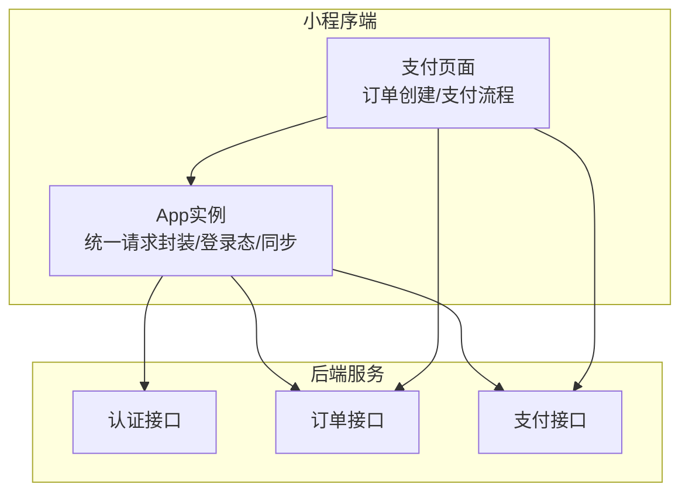
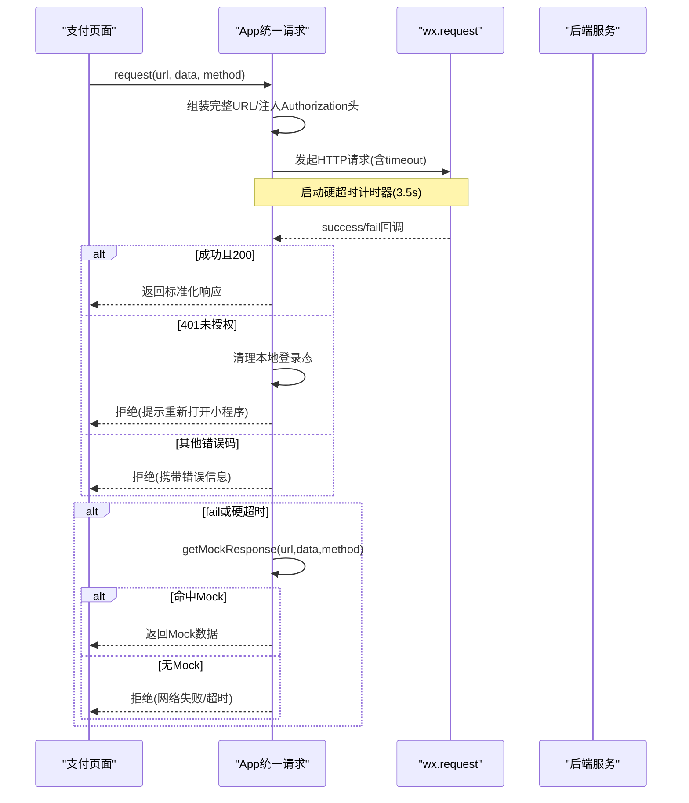
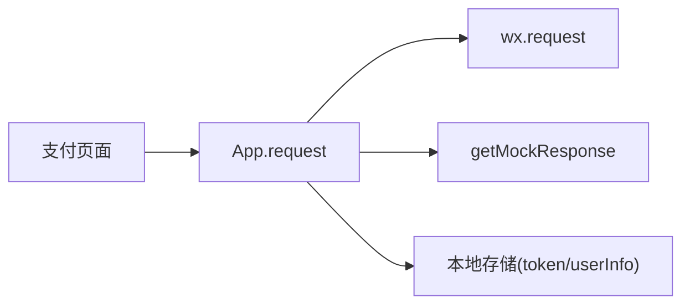

# API请求封装

<cite>
**本文引用的文件**   
- [app.js](file://wechat-mini-app/app.js)
- [index.js（支付页面）](file://wechat-mini-app/pages/order/payment/index.js)
</cite>

## 目录
1. [引言](#引言)
2. [项目结构](#项目结构)
3. [核心组件](#核心组件)
4. [架构总览](#架构总览)
5. [详细组件分析](#详细组件分析)
6. [依赖关系分析](#依赖关系分析)
7. [性能与监控](#性能与监控)
8. [故障排查指南](#故障排查指南)
9. [结论](#结论)
10. [附录：最佳实践与规范](#附录最佳实践与规范)

## 引言
本文件围绕微信小程序端的API请求封装进行系统化说明，重点解析统一request方法的实现原理、错误处理机制、Mock降级策略、Token管理以及拦截器方案。同时结合支付页面的调用链路，给出可落地的优化建议与调试手段，帮助开发者在复杂网络环境下获得稳定、可观测的接口体验。

## 项目结构
小程序端的核心请求能力集中在应用入口文件中，提供统一的请求封装、模拟数据降级、登录态管理与全局同步逻辑；业务页面通过该封装发起具体业务请求。

图表来源
- [app.js:439-497](file://wechat-mini-app/app.js#L439-L497)
- [index.js（支付页面）:95-163](file://wechat-mini-app/pages/order/payment/index.js#L95-L163)

章节来源
- [app.js:439-497](file://wechat-mini-app/app.js#L439-L497)
- [index.js（支付页面）:95-163](file://wechat-mini-app/pages/order/payment/index.js#L95-L163)

## 核心组件
- 统一请求方法：对wx.request进行Promise化封装，自动附加认证头、超时保护、响应标准化、失败降级到Mock。
- Mock数据降级：当网络异常或硬超时触发时，按URL与方法匹配返回预设数据结构，保障开发联调与弱网可用性。
- Token管理：从全局状态读取并注入Authorization头；遇到401时清理本地登录态并拒绝当前请求。
- 全局同步：登录后定时拉取用户、会员、订单、配送等数据，保证多端一致性。
- 业务调用示例：支付页面使用统一request完成订单校验、余额查询、下单与支付确认。

章节来源
- [app.js:439-497](file://wechat-mini-app/app.js#L439-L497)
- [app.js:500-687](file://wechat-mini-app/app.js#L500-L687)
- [app.js:250-330](file://wechat-mini-app/app.js#L250-L330)
- [app.js:336-426](file://wechat-mini-app/app.js#L336-L426)
- [index.js（支付页面）:95-163](file://wechat-mini-app/pages/order/payment/index.js#L95-L163)

## 架构总览
下图展示了从页面发起请求到后端返回的全链路，包括超时兜底与Mock降级路径。

图表来源
- [app.js:439-497](file://wechat-mini-app/app.js#L439-L497)
- [app.js:500-687](file://wechat-mini-app/app.js#L500-L687)

## 详细组件分析

### 统一请求方法（request）
- 功能要点
  - 拼接基础URL与相对路径，打印请求日志。
  - 设置content-type与Authorization头，若存在token则自动附加Bearer前缀。
  - 为每次请求设置3秒超时，并在外层增加3.5秒“硬超时”兜底，防止底层不回调导致Promise悬挂。
  - 成功分支：仅接受200状态码，直接返回响应体；401分支：清除本地userInfo与token，拒绝并提示重新打开小程序；其他错误码：拒绝并透传错误信息。
  - 失败分支：优先尝试getMockResponse进行Mock降级；若无Mock则拒绝并返回errMsg或通用错误。
- 复杂度与性能
  - 时间复杂度O(1)，空间复杂度O(1)。
  - 硬超时避免长时间阻塞UI线程，提升用户体验。
- 可扩展点
  - 可在success/fail前后插入请求/响应拦截器逻辑（见后文“拦截器方案”）。
  - 可在此处接入性能埋点（耗时统计、成功率、错误分类）。

章节来源
- [app.js:439-497](file://wechat-mini-app/app.js#L439-L497)

### Mock数据降级机制（getMockResponse）
- 覆盖范围
  - 登录相关：微信登录、手机号登录/注册、验证码发送等。
  - 业务相关：取件码验证、生成取件码、订单列表、待取件订单、会员信息等。
- 行为特征
  - 根据url与method精确匹配，返回符合业务预期的结构化数据。
  - 在网络失败或硬超时场景下被调用，确保页面可继续渲染与交互。
- 扩展建议
  - 将Mock规则抽离至独立配置模块，便于按环境开关与按需加载。
  - 支持基于正则或通配符的路由匹配，减少硬编码分支。

章节来源
- [app.js:500-687](file://wechat-mini-app/app.js#L500-L687)

### Token管理机制
- 自动附加认证头
  - 在请求头中注入Authorization字段，值为Bearer + token。
- 过期处理
  - 收到401时，主动移除本地userInfo与token，并向调用方返回明确错误提示。
- 刷新策略
  - 当前实现未包含自动刷新令牌逻辑。建议在401分支内增加一次静默刷新接口调用，成功后重试原请求；若刷新失败再走现有清理与提示流程。

章节来源
- [app.js:439-497](file://wechat-mini-app/app.js#L439-L497)

### 登录态与全局同步
- 登录流程
  - 启动时尝试恢复缓存中的userInfo与token；若不存在则执行wx.login获取code，调用后端登录接口，成功后持久化token与用户信息。
  - 若wx.login失败或超时，进入模拟登录模式，保证开发联调可用。
- 数据同步
  - 首次显示后延迟执行全量同步，拉取用户、会员、订单、配送等信息，并写入本地存储与全局状态。
  - 同步失败静默降级，不影响主流程。

章节来源
- [app.js:250-330](file://wechat-mini-app/app.js#L250-L330)
- [app.js:336-426](file://wechat-mini-app/app.js#L336-L426)

### 业务调用示例：支付页面
- 订单校验
  - 进入支付页时，先通过统一request校验订单是否存在且处于可支付状态。
- 余额查询
  - 调用统一request获取用户余额，失败时使用默认值。
- 下单与支付
  - 先创建真实订单，再根据支付方式调用对应支付流程；若后端未接入，回退到模拟支付。
- 结果处理
  - 支付成功后更新全局订单列表并跳转成功页；失败则提示并重试。

章节来源
- [index.js（支付页面）:95-163](file://wechat-mini-app/pages/order/payment/index.js#L95-L163)
- [index.js（支付页面）:239-337](file://wechat-mini-app/pages/order/payment/index.js#L239-L337)
- [index.js（支付页面）:449-586](file://wechat-mini-app/pages/order/payment/index.js#L449-L586)

## 依赖关系分析
- 页面层依赖App提供的request方法，形成松耦合的调用关系。
- App内部依赖wx.request与本地存储，承担网络、鉴权、降级与同步职责。
- 业务页面不直接操作wx.request，降低重复代码与不一致风险。

图表来源
- [app.js:439-497](file://wechat-mini-app/app.js#L439-L497)
- [app.js:500-687](file://wechat-mini-app/app.js#L500-L687)
- [index.js（支付页面）:95-163](file://wechat-mini-app/pages/order/payment/index.js#L95-L163)

## 性能与监控
- 超时控制
  - 请求级timeout=3000ms，外层硬超时=3500ms，双重保护避免长尾请求影响体验。
- 降级策略
  - 失败与超时均尝试Mock，保障弱网与开发环境的可用性。
- 监控建议
  - 在request入口处记录开始时间戳，在success/fail/硬超时分支记录结束时间戳，计算耗时并上报。
  - 统计各接口的成功率、平均耗时、错误类型分布（网络错误、超时、401、业务错误），用于定位瓶颈。
  - 对关键路径（如支付下单）增加端到端埋点，串联订单ID与用户标识。

[本节为通用指导，无需源码引用]

## 故障排查指南
- 常见问题
  - 401未授权：检查是否已登录、token是否有效；确认后端是否要求Bearer格式。
  - 网络失败：检查域名白名单、证书、代理与DNS；查看errMsg定位具体原因。
  - 超时：增大timeout或优化后端响应；必要时开启重试或降级。
  - Mock未命中：核对url与method是否与getMockResponse匹配。
- 定位步骤
  - 在request的success/fail分支打印完整响应体与错误对象。
  - 在硬超时分支输出触发时间与请求参数，判断是否为后端慢查询。
  - 在401分支确认本地token是否被清理，必要时增加刷新流程后再重试。

章节来源
- [app.js:439-497](file://wechat-mini-app/app.js#L439-L497)
- [app.js:500-687](file://wechat-mini-app/app.js#L500-L687)

## 结论
当前小程序端已具备稳定的统一请求封装能力，涵盖自动鉴权、超时保护、错误处理与Mock降级，满足开发与弱网联调需求。后续可在401自动刷新、拦截器体系、性能监控与日志上报方面进一步完善，以提升系统健壮性与可观测性。

[本节为总结，无需源码引用]

## 附录：最佳实践与规范
- 请求封装
  - 所有网络请求必须通过统一request发起，禁止页面直接使用wx.request。
  - 合理设置timeout，避免长尾请求；必要时引入重试与熔断。
- 错误处理
  - 区分网络错误、超时、鉴权失败与业务错误，分别给出用户友好提示。
  - 401应触发静默刷新或引导重新登录，避免频繁弹窗。
- Mock策略
  - 将Mock规则集中管理，按环境开关；尽量覆盖高频接口。
  - Mock数据需与真实接口保持一致的结构与语义，减少联调差异。
- Token管理
  - 统一注入Authorization头；实现刷新令牌与失败重试，避免二次登录。
- 拦截器方案
  - 请求拦截器：统一添加traceId、设备信息、语言、版本等头；对敏感数据进行脱敏。
  - 响应拦截器：统一解包data字段、转换时间格式、错误码映射、权限校验。
- 性能与日志
  - 记录关键指标：耗时、成功率、错误分类、Mock命中率。
  - 生产环境关闭冗余日志，保留必要告警信息；开发环境开启详细日志。
- 安全与合规
  - 不在前端明文保存敏感信息；token采用短期有效+刷新机制。
  - 对外部输入进行校验与转义，防止注入与越权访问。

[本节为通用指导，无需源码引用]