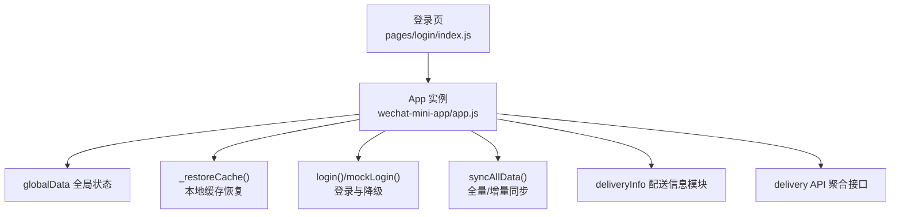
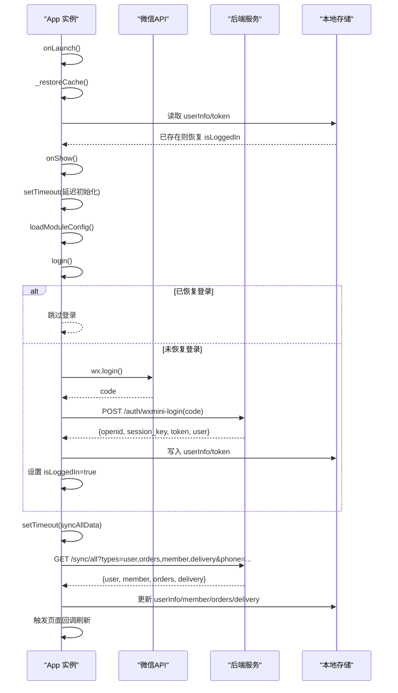
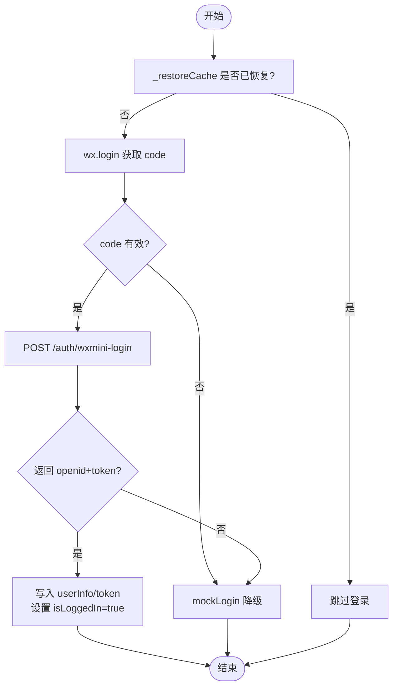
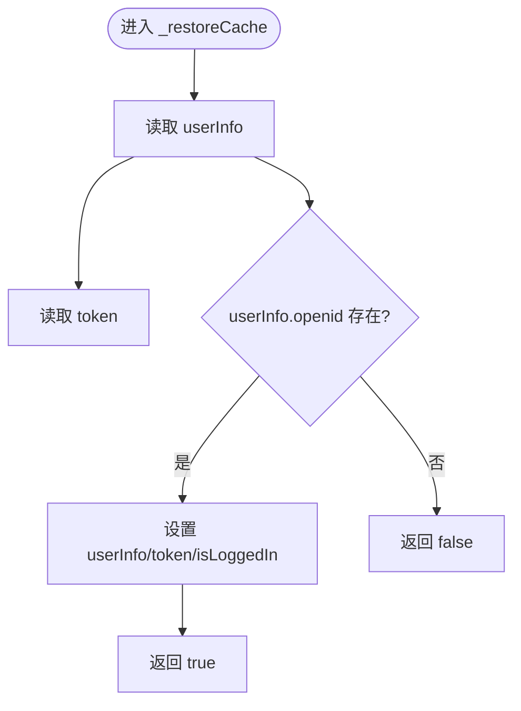
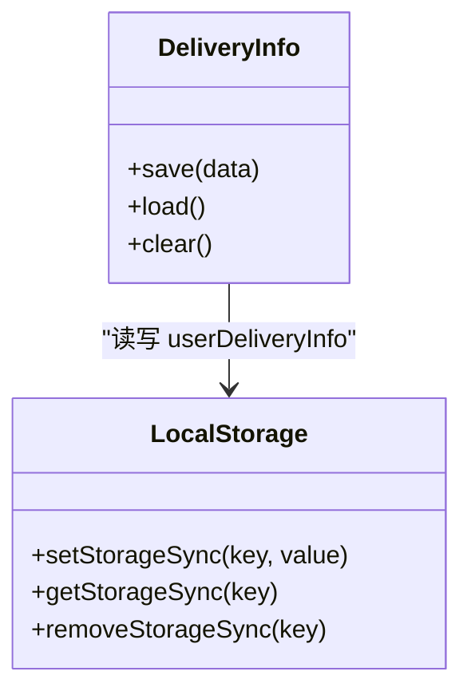
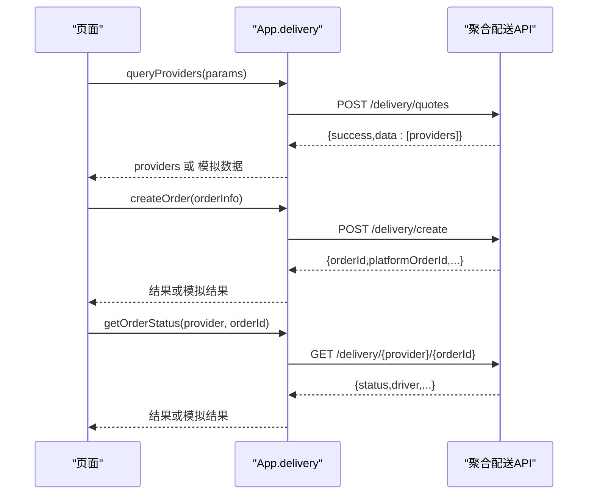
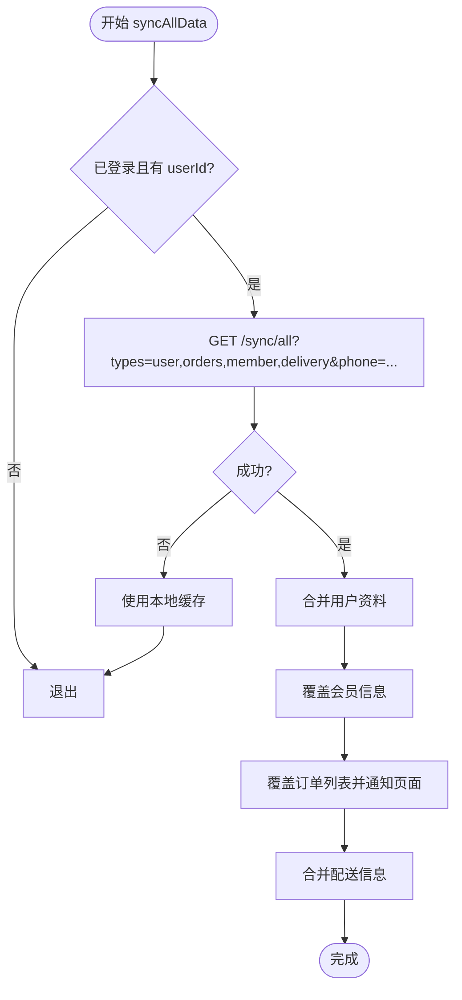
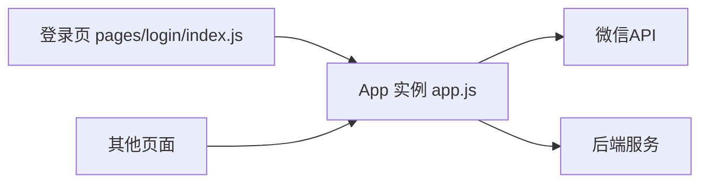

# 全局状态管理

<cite>
**本文引用的文件**
- [wechat-mini-app/app.js](file://wechat-mini-app/app.js)
- [wechat-mini-app/pages/login/index.js](file://wechat-mini-app/pages/login/index.js)
</cite>

## 目录
1. [简介](#简介)
2. [项目结构](#项目结构)
3. [核心组件](#核心组件)
4. [架构总览](#架构总览)
5. [详细组件分析](#详细组件分析)
6. [依赖分析](#依赖分析)
7. [性能考虑](#性能考虑)
8. [故障排查指南](#故障排查指南)
9. [结论](#结论)
10. [附录](#附录)

## 简介
本文件围绕微信小程序的全局状态管理进行系统化说明，重点覆盖以下方面：
- globalData 对象的设计模式与存储结构（用户信息、令牌、订单数据、模块配置等）
- 登录状态管理机制（微信登录流程、模拟登录降级、Token 过期处理）
- 缓存恢复机制 _restoreCache 的实现原理与一致性保证
- 配送信息管理模块（地址记忆、联系人信息持久化）
- 状态同步策略（增量同步、冲突解决、离线数据处理）
- 错误处理与异常恢复机制
- 状态管理的最佳实践

## 项目结构
小程序端的核心状态管理与生命周期逻辑集中在应用入口文件中，页面级登录流程在登录页中实现。整体组织遵循“单例 App + 页面调用”的模式，所有跨页面的共享状态通过 App.globalData 暴露。

图表来源
- [wechat-mini-app/app.js:210-234](file://wechat-mini-app/app.js#L210-L234)
- [wechat-mini-app/app.js:236-248](file://wechat-mini-app/app.js#L236-L248)
- [wechat-mini-app/app.js:250-330](file://wechat-mini-app/app.js#L250-L330)
- [wechat-mini-app/app.js:336-426](file://wechat-mini-app/app.js#L336-L426)
- [wechat-mini-app/app.js:712-734](file://wechat-mini-app/app.js#L712-L734)
- [wechat-mini-app/app.js:736-949](file://wechat-mini-app/app.js#L736-L949)
- [wechat-mini-app/pages/login/index.js:1-100](file://wechat-mini-app/pages/login/index.js#L1-L100)

章节来源
- [wechat-mini-app/app.js:1-41](file://wechat-mini-app/app.js#L1-L41)
- [wechat-mini-app/pages/login/index.js:1-100](file://wechat-mini-app/pages/login/index.js#L1-L100)

## 核心组件
- globalData 全局状态容器
  - 用户信息与认证：userInfo、token、isLoggedIn
  - 业务数据：orders、currentOrder、storeId/storeName
  - 扫码上下文：scanPayOrder、scanStoreId、pendingPickupCode
  - 模块配置：moduleConfig、enabledModules
  - API 基址与聚合配送配置：apiBaseUrl、deliveryApi
- 缓存恢复器 _restoreCache
  - 从本地存储读取 userInfo/token，恢复 isLoggedIn
- 登录流程 login 与降级 mockLogin
  - wx.login 获取 code → 后端 /auth/wxmini-login → 落盘 token/userInfo
  - 超时或失败时回退到 mockLogin
- 统一请求封装 request
  - 硬超时保护、401 自动登出、失败降级为 Mock
- 数据同步 syncAllData
  - 以 /sync/all 为权威源，合并用户、会员、订单、配送信息
- 配送信息 deliveryInfo
  - 保存/加载/清除 userDeliveryInfo（联系人、电话、取件地址、更新时间）
- 聚合配送 delivery
  - 查询报价、创建订单、查询状态、取消订单、获取司机位置

章节来源
- [wechat-mini-app/app.js:210-234](file://wechat-mini-app/app.js#L210-L234)
- [wechat-mini-app/app.js:236-248](file://wechat-mini-app/app.js#L236-L248)
- [wechat-mini-app/app.js:250-330](file://wechat-mini-app/app.js#L250-L330)
- [wechat-mini-app/app.js:439-497](file://wechat-mini-app/app.js#L439-L497)
- [wechat-mini-app/app.js:336-426](file://wechat-mini-app/app.js#L336-L426)
- [wechat-mini-app/app.js:712-734](file://wechat-mini-app/app.js#L712-L734)
- [wechat-mini-app/app.js:736-949](file://wechat-mini-app/app.js#L736-L949)

## 架构总览
下图展示了小程序启动、登录、缓存恢复与数据同步的整体时序。

图表来源
- [wechat-mini-app/app.js:1-41](file://wechat-mini-app/app.js#L1-L41)
- [wechat-mini-app/app.js:236-248](file://wechat-mini-app/app.js#L236-L248)
- [wechat-mini-app/app.js:250-330](file://wechat-mini-app/app.js#L250-L330)
- [wechat-mini-app/app.js:336-426](file://wechat-mini-app/app.js#L336-L426)

## 详细组件分析

### globalData 设计模式与存储结构
- 设计目标
  - 单一事实来源：App 作为唯一状态持有者，页面只读或通过方法间接修改
  - 可恢复性：应用冷启动优先从本地存储恢复会话
  - 可扩展性：按领域划分字段（用户、订单、模块、配送等），便于维护
- 关键结构与职责
  - 用户与认证：userInfo、token、isLoggedIn
  - 业务数据：orders、currentOrder
  - 扫码上下文：scanPayOrder、scanStoreId、pendingPickupCode
  - 模块配置：moduleConfig、enabledModules
  - API 与配送：apiBaseUrl、deliveryApi
- 复杂度与访问模式
  - 读写均为 O(1)，适合高频访问；注意避免在渲染周期内频繁 setData 导致重绘

章节来源
- [wechat-mini-app/app.js:210-234](file://wechat-mini-app/app.js#L210-L234)

### 登录状态管理机制
- 微信登录主流程
  - 调用 wx.login 获取 code
  - 使用 request 调用 /auth/wxmini-login
  - 成功后写入 userInfo/token 并设置 isLoggedIn
- 模拟登录降级
  - 当 wx.login 失败、后端返回无 openid 或网络超时时，进入 mockLogin
  - 生成临时 openid 与 token，保持开发体验
- Token 过期处理
  - 统一请求封装在 401 响应时清理本地 userInfo/token，并拒绝后续操作
- 页面侧登录
  - 登录页同样基于 wx.login + request 完成登录，成功后跳转首页

图表来源
- [wechat-mini-app/app.js:236-248](file://wechat-mini-app/app.js#L236-L248)
- [wechat-mini-app/app.js:250-330](file://wechat-mini-app/app.js#L250-L330)
- [wechat-mini-app/app.js:439-497](file://wechat-mini-app/app.js#L439-L497)
- [wechat-mini-app/pages/login/index.js:1-100](file://wechat-mini-app/pages/login/index.js#L1-L100)

章节来源
- [wechat-mini-app/app.js:250-330](file://wechat-mini-app/app.js#L250-L330)
- [wechat-mini-app/app.js:439-497](file://wechat-mini-app/app.js#L439-L497)
- [wechat-mini-app/pages/login/index.js:1-100](file://wechat-mini-app/pages/login/index.js#L1-L100)

### 缓存恢复机制 _restoreCache
- 实现要点
  - 从本地存储读取 userInfo 与 token
  - 若存在有效 openid，则恢复 userInfo、token 与 isLoggedIn
  - 供 onLaunch 与 login 复用，确保快速冷启动
- 数据一致性保证
  - 仅恢复必要字段，避免脏数据污染
  - 登录成功后再执行全量同步，确保服务端权威数据覆盖本地

图表来源
- [wechat-mini-app/app.js:236-248](file://wechat-mini-app/app.js#L236-L248)

章节来源
- [wechat-mini-app/app.js:236-248](file://wechat-mini-app/app.js#L236-L248)

### 配送信息管理模块
- 功能范围
  - 保存/加载/清除 userDeliveryInfo（联系人姓名、电话、取件地址、更新时间）
  - 与同步流程联动：将默认地址或 savedInfo 合并入本地
- 使用建议
  - 在下单前加载，减少用户输入成本
  - 在用户编辑后及时保存，保证下次打开自动填充

图表来源
- [wechat-mini-app/app.js:712-734](file://wechat-mini-app/app.js#L712-L734)

章节来源
- [wechat-mini-app/app.js:712-734](file://wechat-mini-app/app.js#L712-L734)

### 聚合配送 API 集成
- 能力清单
  - 查询服务商报价（支持距离、服务金额、新用户标识）
  - 创建配送订单（取/送地址、商品信息、重量、城市等）
  - 查询订单状态（含司机信息与位置）
  - 取消订单
- 降级策略
  - 网络失败或后端不可用时，返回模拟数据以保证流程完整

图表来源
- [wechat-mini-app/app.js:736-949](file://wechat-mini-app/app.js#L736-L949)

章节来源
- [wechat-mini-app/app.js:736-949](file://wechat-mini-app/app.js#L736-L949)

### 状态同步策略（增量、冲突、离线）
- 权威源与拉取时机
  - 以 /sync/all 为权威源，首次 onShow 后延迟触发
  - 根据手机号进行跨平台订单匹配
- 增量与合并
  - 用户资料：后端覆盖本地关键字段（昵称、头像、性别、生日、积分等）
  - 会员信息：直接覆盖
  - 订单列表：以服务器为准，同时通知页面刷新
  - 配送信息：合并 savedInfo/defaultAddress 到本地
- 冲突解决
  - 采用“服务端覆盖本地”的策略，避免多端并发导致的脏写
- 离线处理
  - 网络失败时静默降级，继续使用本地缓存
  - 统一请求层提供 Mock 响应兜底，保障交互流畅

图表来源
- [wechat-mini-app/app.js:336-426](file://wechat-mini-app/app.js#L336-L426)

章节来源
- [wechat-mini-app/app.js:336-426](file://wechat-mini-app/app.js#L336-L426)

### 错误处理与异常恢复
- 登录阶段
  - wx.login 失败或后端未返回 openid 时，自动降级为 mockLogin
- 请求阶段
  - 硬超时保护：超过阈值强制结束，返回 Mock 或失败
  - 401 自动登出：清理本地凭证并提示重新登录
  - 网络异常：优先尝试 Mock，否则返回结构化错误
- 同步阶段
  - 网络失败时静默降级，不中断业务流程

章节来源
- [wechat-mini-app/app.js:250-330](file://wechat-mini-app/app.js#L250-L330)
- [wechat-mini-app/app.js:439-497](file://wechat-mini-app/app.js#L439-L497)
- [wechat-mini-app/app.js:336-426](file://wechat-mini-app/app.js#L336-L426)

## 依赖分析
- 内部依赖
  - 登录页依赖 App.request 与 App.globalData
  - 各页面通过 getApp() 访问全局状态与方法
- 外部依赖
  - 微信原生 API：wx.login、wx.request、wx.setStorageSync 等
  - 后端 API：/auth/wxmini-login、/sync/all、/delivery/* 等

图表来源
- [wechat-mini-app/pages/login/index.js:1-100](file://wechat-mini-app/pages/login/index.js#L1-L100)
- [wechat-mini-app/app.js:1-41](file://wechat-mini-app/app.js#L1-L41)

章节来源
- [wechat-mini-app/pages/login/index.js:1-100](file://wechat-mini-app/pages/login/index.js#L1-L100)
- [wechat-mini-app/app.js:1-41](file://wechat-mini-app/app.js#L1-L41)

## 性能考虑
- 启动优化
  - onLaunch 仅做缓存恢复，避免阻塞
  - 模块配置与登录在 onShow 后延迟执行，降低首屏压力
- 请求优化
  - 统一超时与降级，避免长尾请求拖慢界面
- 数据同步
  - 仅在登录后且首次显示后触发，减少无效请求
  - 使用回调通知页面局部刷新，避免全量重渲染

[本节为通用指导，无需源码引用]

## 故障排查指南
- 常见问题定位
  - 无法登录：检查 wx.login 是否返回 code；确认 /auth/wxmini-login 可达
  - 401 频繁出现：确认 token 是否被正确携带；必要时重新登录
  - 数据不同步：查看 /sync/all 返回结构；确认手机号参数是否正确
  - 配送报价为空：检查聚合配送 API 连通性与鉴权
- 日志与断点
  - 关注控制台中的 [登录]、[API请求]、[同步] 等标记日志
  - 在 request 的 success/fail 分支添加断点，观察响应体与状态码

章节来源
- [wechat-mini-app/app.js:250-330](file://wechat-mini-app/app.js#L250-L330)
- [wechat-mini-app/app.js:439-497](file://wechat-mini-app/app.js#L439-L497)
- [wechat-mini-app/app.js:336-426](file://wechat-mini-app/app.js#L336-L426)

## 结论
该全局状态管理方案以 App.globalData 为核心，结合本地缓存恢复、统一请求封装与权威源同步，实现了高可用、易扩展的状态体系。通过严格的降级与错误处理策略，系统在弱网与后端异常场景下仍能提供稳定体验。建议在后续迭代中持续完善增量同步粒度与冲突检测，进一步提升一致性与性能。

[本节为总结性内容，无需源码引用]

## 附录
- 术语
  - 权威源：指后端服务，用于覆盖本地不一致数据
  - 降级：在网络或服务异常时使用本地或模拟数据维持基本功能
- 参考路径
  - 全局状态定义与恢复：[wechat-mini-app/app.js:210-248](file://wechat-mini-app/app.js#L210-L248)
  - 登录与降级：[wechat-mini-app/app.js:250-330](file://wechat-mini-app/app.js#L250-L330)
  - 统一请求封装：[wechat-mini-app/app.js:439-497](file://wechat-mini-app/app.js#L439-L497)
  - 数据同步：[wechat-mini-app/app.js:336-426](file://wechat-mini-app/app.js#L336-L426)
  - 配送信息模块：[wechat-mini-app/app.js:712-734](file://wechat-mini-app/app.js#L712-L734)
  - 聚合配送 API：[wechat-mini-app/app.js:736-949](file://wechat-mini-app/app.js#L736-L949)
  - 登录页流程：[wechat-mini-app/pages/login/index.js:1-100](file://wechat-mini-app/pages/login/index.js#L1-L100)