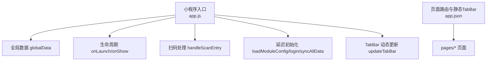
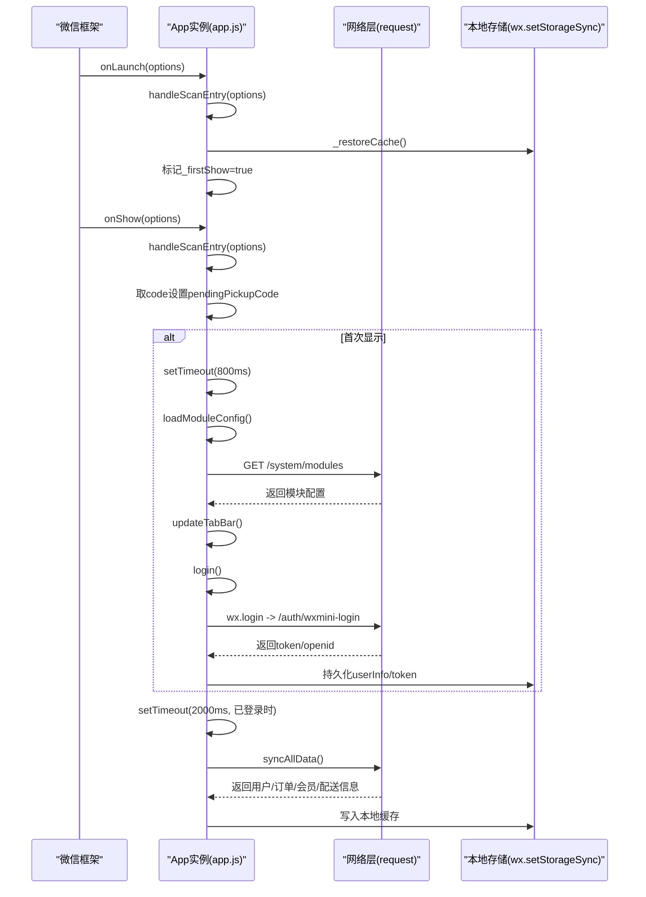
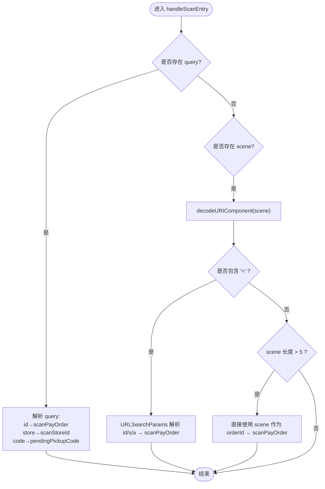
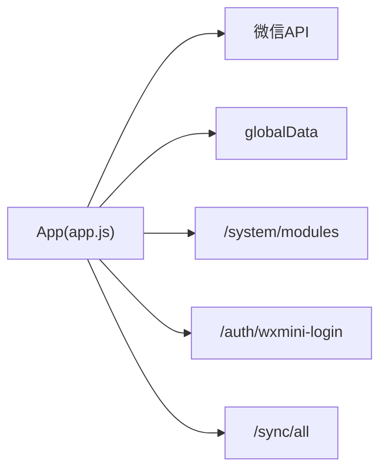

# 应用初始化与生命周期

<cite>
**本文引用的文件**   
- [wechat-mini-app/app.js](file://wechat-mini-app/app.js)
- [wechat-mini-app/app.json](file://wechat-mini-app/app.json)
</cite>

## 目录
1. [简介](#简介)
2. [项目结构](#项目结构)
3. [核心组件](#核心组件)
4. [架构总览](#架构总览)
5. [详细组件分析](#详细组件分析)
6. [依赖分析](#依赖分析)
7. [性能考虑](#性能考虑)
8. [故障排查指南](#故障排查指南)
9. [结论](#结论)

## 简介
本文件聚焦微信小程序的启动与生命周期，重点解析 onLaunch 与 onShow 的执行流程、扫码进入处理、登录状态恢复机制、延迟初始化策略、模块配置加载与 TabBar 动态更新。文档旨在帮助开发者理解“如何在不阻塞 onLaunch 的前提下完成必要的初始化”，并给出最佳实践与性能优化建议。

## 项目结构
小程序入口位于 wechat-mini-app 目录，核心逻辑集中在 app.js，页面路由与静态 TabBar 定义在 app.json。

图表来源
- [wechat-mini-app/app.js:1-41](file://wechat-mini-app/app.js#L1-L41)
- [wechat-mini-app/app.json:1-53](file://wechat-mini-app/app.json#L1-L53)

章节来源
- [wechat-mini-app/app.js:1-41](file://wechat-mini-app/app.js#L1-L41)
- [wechat-mini-app/app.json:1-53](file://wechat-mini-app/app.json#L1-L53)

## 核心组件
- 生命周期钩子：onLaunch、onShow
- 扫码入口处理：handleScanEntry
- 登录与缓存恢复：_restoreCache、login、mockLogin
- 延迟初始化：loadModuleConfig、updateTabBar
- 数据同步：syncAllData
- 统一请求封装：request（含硬超时与降级）

章节来源
- [wechat-mini-app/app.js:1-41](file://wechat-mini-app/app.js#L1-L41)
- [wechat-mini-app/app.js:44-109](file://wechat-mini-app/app.js#L44-L109)
- [wechat-mini-app/app.js:117-192](file://wechat-mini-app/app.js#L117-L192)
- [wechat-mini-app/app.js:236-330](file://wechat-mini-app/app.js#L236-L330)
- [wechat-mini-app/app.js:336-431](file://wechat-mini-app/app.js#L336-L431)
- [wechat-mini-app/app.js:439-497](file://wechat-mini-app/app.js#L439-L497)

## 架构总览
下图展示了小程序从启动到首次显示的关键时序，包括扫码参数解析、登录状态恢复、延迟初始化与数据同步。

图表来源
- [wechat-mini-app/app.js:1-41](file://wechat-mini-app/app.js#L1-L41)
- [wechat-mini-app/app.js:117-192](file://wechat-mini-app/app.js#L117-L192)
- [wechat-mini-app/app.js:236-330](file://wechat-mini-app/app.js#L236-L330)
- [wechat-mini-app/app.js:336-431](file://wechat-mini-app/app.js#L336-L431)

## 详细组件分析

### onLaunch 与 onShow 执行流程
- onLaunch
  - 立即处理扫码参数，确保场景信息尽早可用
  - 仅做本地缓存恢复，避免任何耗时操作
  - 设置 _firstShow 标志，用于后续延迟初始化
- onShow
  - 再次处理扫码参数与取件码，保证跨次显示的参数一致性
  - 首次显示时通过 setTimeout 延迟执行模块配置加载与登录，确保所有页面 onLoad/onShow 已完成
  - 若已登录，再延迟触发数据同步

章节来源
- [wechat-mini-app/app.js:1-41](file://wechat-mini-app/app.js#L1-L41)

### 扫码进入处理 handleScanEntry
该函数负责解析小程序码场景参数，支持以下三类场景：
- 订单支付场景
  - 优先读取 query.id；若无则尝试从 scene 中解析 id=s&amount=a 等 URL 参数
  - 将结果写入 globalData.scanPayOrder（包含 orderId、storeId、amount）
- 门店场景
  - 读取 query.store，写入 globalData.scanStoreId
- 取件码场景
  - 读取 query.code，写入 globalData.pendingPickupCode

scene 兼容策略：
- 当存在 scene 且无 query 时，先尝试 decodeURIComponent(scene)
- 若 scene 为 URL 参数格式（包含 =），使用 URLSearchParams 解析 id/s/a
- 否则若 scene 长度大于阈值，直接作为订单ID使用

章节来源
- [wechat-mini-app/app.js:44-109](file://wechat-mini-app/app.js#L44-L109)

#### 扫码参数解析流程图

图表来源
- [wechat-mini-app/app.js:44-109](file://wechat-mini-app/app.js#L44-L109)

### 登录状态恢复机制
- _restoreCache
  - 从本地存储恢复 userInfo 与 token，并设置 isLoggedIn
  - 供 onLaunch 与 login 复用，避免重复网络请求
- login
  - 若已恢复登录则跳过
  - 使用 wx.login 获取 code，调用后端 /auth/wxmini-login
  - 成功则持久化 userInfo 与 token，失败或超时时回退到 mockLogin
- mockLogin
  - 开发测试用，生成模拟 openid 与 token，并持久化

章节来源
- [wechat-mini-app/app.js:236-330](file://wechat-mini-app/app.js#L236-L330)

### 延迟初始化与 _firstShow 标志
- _firstShow 的作用
  - 标记是否为首次 onShow，确保只在首次显示时执行延迟初始化
  - 防止每次 onShow 都重复拉取配置与登录
- 延迟策略
  - 在 onShow 内使用 setTimeout(800ms) 触发 loadModuleConfig 与 login
  - 目的：等待所有页面的 onLoad/onShow 完成，避免首屏卡顿
- 数据同步时机
  - 仅在已登录状态下，于首次初始化后再延迟 2000ms 触发 syncAllData

章节来源
- [wechat-mini-app/app.js:14-41](file://wechat-mini-app/app.js#L14-L41)
- [wechat-mini-app/app.js:117-192](file://wechat-mini-app/app.js#L117-L192)
- [wechat-mini-app/app.js:336-431](file://wechat-mini-app/app.js#L336-L431)

### 模块配置加载与 TabBar 动态更新
- loadModuleConfig
  - 调用 fetchModuleConfig 获取 /system/modules
  - 将 enabledModules 写入 globalData，并调用 updateTabBar
  - 失败时使用默认配置（至少启用 cleaning 模块）
- fetchModuleConfig
  - 使用 wx.request 发起请求，设置 4s 安全兜底，防止永不回调
- updateTabBar
  - 根据 enabledModules 动态构建 tabList
  - 通过 this.getTabBar().setData 更新运行时 TabBar

章节来源
- [wechat-mini-app/app.js:117-192](file://wechat-mini-app/app.js#L117-L192)

### 统一数据同步 syncAllData
- 触发条件：已登录且在首次初始化之后
- 功能范围：用户资料、会员信息、订单列表、配送信息
- 幂等与降级：网络失败时静默降级，使用本地缓存

章节来源
- [wechat-mini-app/app.js:336-431](file://wechat-mini-app/app.js#L336-L431)

### 统一请求封装 request
- 硬超时保护：3.5s 强制结束，避免 Promise 永远挂起
- 401 自动清理登录态
- 失败或超时情况下可降级到 getMockResponse 提供的模拟数据

章节来源
- [wechat-mini-app/app.js:439-497](file://wechat-mini-app/app.js#L439-L497)

## 依赖分析
- App 实例依赖
  - 微信原生 API：wx.login、wx.request、wx.setStorageSync、wx.getStorageSync、getTabBar
  - 全局数据 globalData：保存登录态、扫码上下文、模块配置、API 地址等
- 外部接口
  - /system/modules：模块配置
  - /auth/wxmini-login：微信登录
  - /sync/all：全量数据同步

图表来源
- [wechat-mini-app/app.js:117-192](file://wechat-mini-app/app.js#L117-L192)
- [wechat-mini-app/app.js:236-330](file://wechat-mini-app/app.js#L236-L330)
- [wechat-mini-app/app.js:336-431](file://wechat-mini-app/app.js#L336-L431)

章节来源
- [wechat-mini-app/app.js:117-192](file://wechat-mini-app/app.js#L117-L192)
- [wechat-mini-app/app.js:236-330](file://wechat-mini-app/app.js#L236-L330)
- [wechat-mini-app/app.js:336-431](file://wechat-mini-app/app.js#L336-L431)

## 性能考虑
- 避免阻塞 onLaunch
  - onLaunch 只做本地缓存恢复与轻量逻辑，所有网络请求推迟到 onShow
- 合理设置超时时间
  - 模块配置请求设置 4s 安全兜底
  - 通用 request 设置 3.5s 硬超时，防止 Promise 悬挂
- 延迟初始化
  - 使用 setTimeout(800ms) 确保页面全部就绪后再拉取配置与登录
  - 数据同步进一步延后 2000ms，降低首屏压力
- 降级与容错
  - 登录失败或超时回退到 mockLogin
  - 网络异常时降级到模拟数据，保障用户体验

[本节为通用指导，不直接分析具体文件]

## 故障排查指南
- 扫码参数未生效
  - 检查 onShow 是否再次调用 handleScanEntry，确认 query 与 scene 分支均被覆盖
  - 确认 scene 是否经过 decodeURIComponent 与 URLSearchParams 正确解析
- 登录状态未恢复
  - 检查 _restoreCache 是否正确读取 userInfo 与 token
  - 确认 login 是否因超时或失败回退到 mockLogin
- 模块配置未加载
  - 检查 /system/modules 接口可达性与鉴权头
  - 关注 4s 安全兜底是否触发
- TabBar 未动态更新
  - 确认 getTabBar 是否可用，以及 setData 是否成功
- 数据不同步
  - 确认已登录且首次初始化完成后才触发 syncAllData
  - 检查 /sync/all 响应结构与字段映射

章节来源
- [wechat-mini-app/app.js:44-109](file://wechat-mini-app/app.js#L44-L109)
- [wechat-mini-app/app.js:117-192](file://wechat-mini-app/app.js#L117-L192)
- [wechat-mini-app/app.js:236-330](file://wechat-mini-app/app.js#L236-L330)
- [wechat-mini-app/app.js:336-431](file://wechat-mini-app/app.js#L336-L431)

## 结论
通过将网络请求与重逻辑推迟至 onShow 并使用 _firstShow 控制首次初始化，小程序实现了快速启动与稳定的首屏体验。handleScanEntry 对多种扫码场景提供了健壮的参数解析能力，配合统一的 request 封装与超时降级策略，提升了整体鲁棒性。建议在后续迭代中继续遵循“非阻塞 onLaunch”的原则，并根据业务需要微调延迟时间与超时阈值。