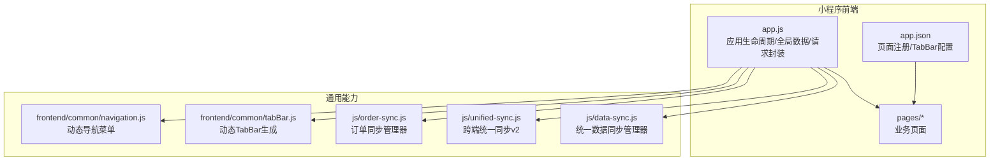
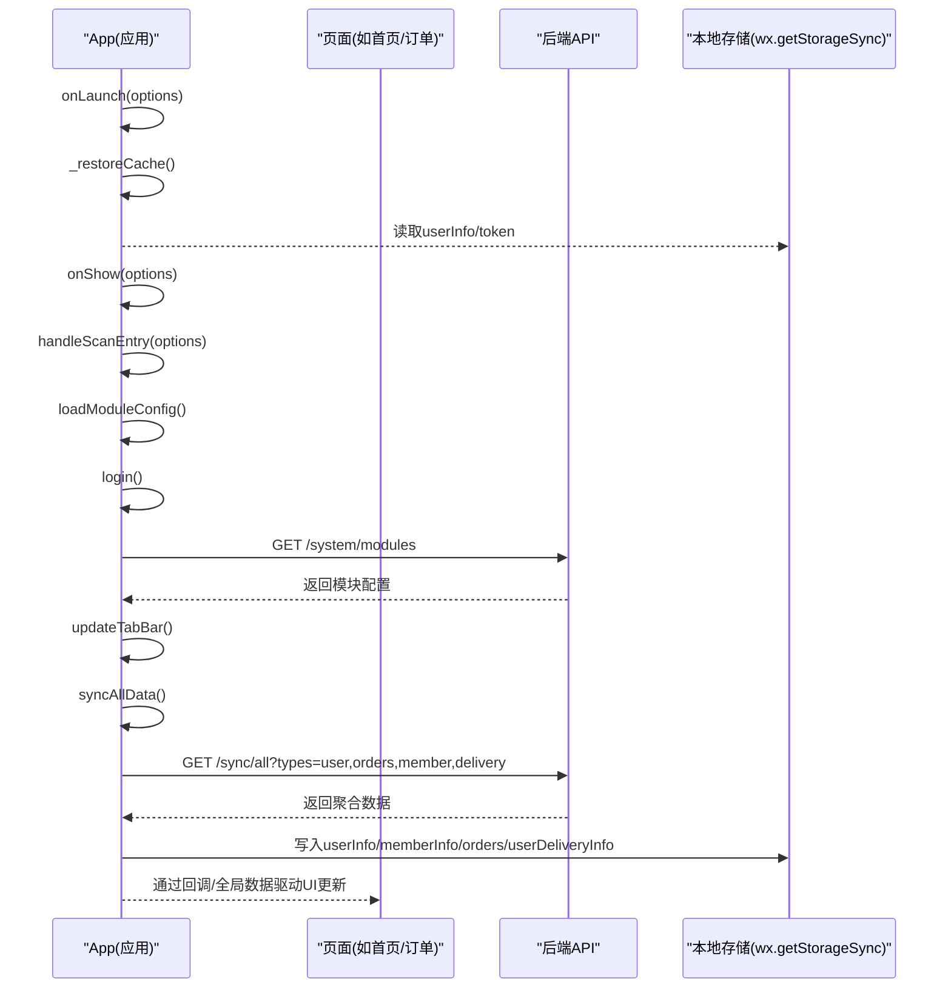
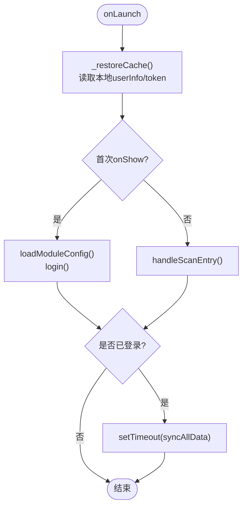
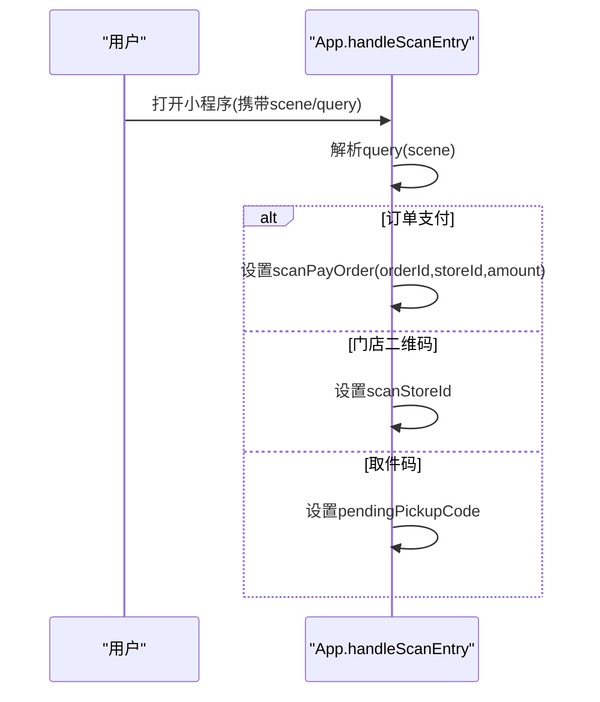
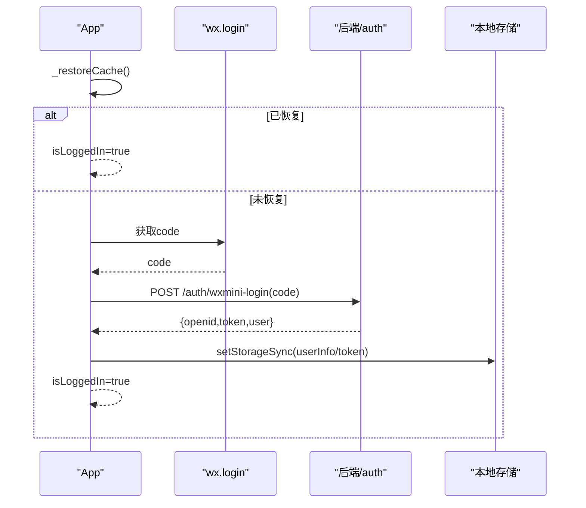
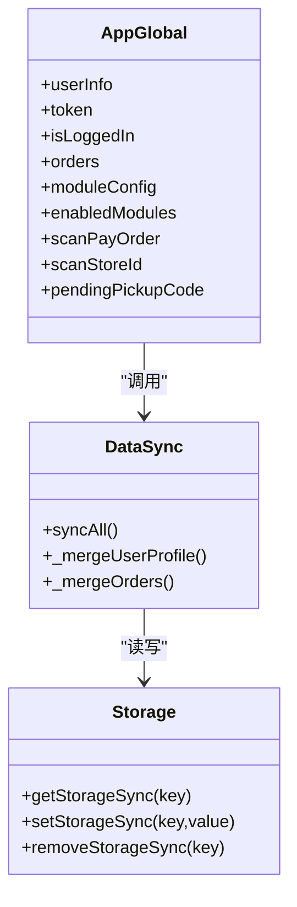
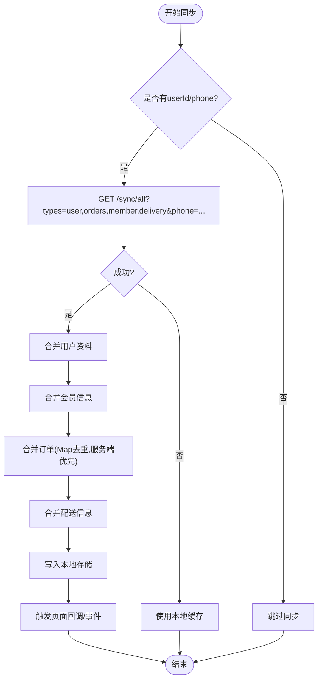
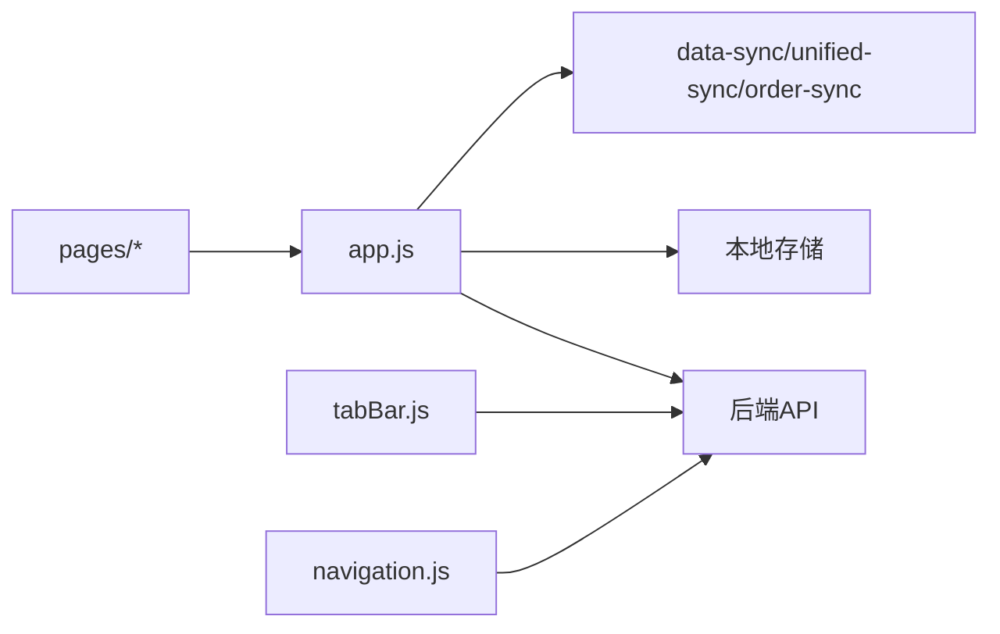

# 微信小程序架构

<cite>
**本文引用的文件**   
- [wechat-mini-app/app.js](file://wechat-mini-app/app.js)
- [wechat-mini-app/app.json](file://wechat-mini-app/app.json)
- [wechat-mini-app/pages/index/index.js](file://wechat-mini-app/pages/index/index.js)
- [wechat-mini-app/pages/login/index.js](file://wechat-mini-app/pages/login/index.js)
- [wechat-mini-app/pages/order/create/index.js](file://wechat-mini-app/pages/order/create/index.js)
- [wechat-mini-app/pages/orders/index.js](file://wechat-mini-app/pages/orders/index.js)
- [js/data-sync.js](file://js/data-sync.js)
- [js/unified-sync.js](file://js/unified-sync.js)
- [js/order-sync.js](file://js/order-sync.js)
- [frontend/common/tabBar.js](file://frontend/common/tabBar.js)
- [frontend/common/navigation.js](file://frontend/common/navigation.js)
</cite>

## 目录
1. [简介](#简介)
2. [项目结构](#项目结构)
3. [核心组件](#核心组件)
4. [架构总览](#架构总览)
5. [详细组件分析](#详细组件分析)
6. [依赖关系分析](#依赖关系分析)
7. [性能优化方案](#性能优化方案)
8. [故障排查与监控](#故障排查与监控)
9. [结论](#结论)
10. [附录：开发规范与最佳实践](#附录开发规范与最佳实践)

## 简介
本文件面向微信小程序端，系统化梳理应用初始化流程、扫码进入处理、登录状态恢复、全局数据管理、页面路由导航、数据同步机制（增量/离线/冲突）、以及性能优化与错误处理策略。文档同时给出可视化架构图与时序图，帮助开发者快速理解并落地实现。

## 项目结构
小程序前端位于 wechat-mini-app 目录，包含应用入口、页面与工具模块；通用同步与导航能力在 js 与 frontend/common 中提供，供多端复用。



图表来源
- [wechat-mini-app/app.js:1-950](file://wechat-mini-app/app.js#L1-L950)
- [wechat-mini-app/app.json:1-53](file://wechat-mini-app/app.json#L1-L53)
- [js/data-sync.js:1-348](file://js/data-sync.js#L1-L348)
- [js/unified-sync.js:1-420](file://js/unified-sync.js#L1-L420)
- [js/order-sync.js:1-352](file://js/order-sync.js#L1-L352)
- [frontend/common/tabBar.js:1-138](file://frontend/common/tabBar.js#L1-L138)
- [frontend/common/navigation.js:1-317](file://frontend/common/navigation.js#L1-L317)

章节来源
- [wechat-mini-app/app.js:1-950](file://wechat-mini-app/app.js#L1-L950)
- [wechat-mini-app/app.json:1-53](file://wechat-mini-app/app.json#L1-L53)

## 核心组件
- 应用入口与生命周期
  - onLaunch/onShow：仅做轻量缓存恢复与首次延迟初始化，避免阻塞启动。
  - handleScanEntry：解析扫码场景参数（query/scene），设置支付订单、门店ID或取件码等上下文。
  - login/_restoreCache：优先从本地恢复登录态，失败则走微信登录或模拟登录兜底。
  - syncAllData：登录后触发全量同步，合并用户、会员、订单、配送信息到本地存储。
  - request：统一网络请求封装，带硬超时保护、Mock降级、Token过期处理。
- 页面层
  - 首页：延迟加载待取件订单与附近门店，支持扫码取件与服务选择跳转。
  - 登录页：调用 wx.login 获取 code，完成后端登录并持久化 token。
  - 下单创建：品类切换、服务选择、寄养详情弹窗、跳转到门店选择。
  - 订单列表：按用户标识+手机号跨平台查询，分页加载与下拉刷新。
- 通用能力
  - data-sync/unified-sync/order-sync：提供跨端一致的同步策略、增量合并、离线备份与事件通知。
  - tabBar/navigation：根据后端模块配置动态生成 TabBar 与导航菜单。

章节来源
- [wechat-mini-app/app.js:1-950](file://wechat-mini-app/app.js#L1-L950)
- [wechat-mini-app/pages/index/index.js:1-218](file://wechat-mini-app/pages/index/index.js#L1-L218)
- [wechat-mini-app/pages/login/index.js:1-100](file://wechat-mini-app/pages/login/index.js#L1-L100)
- [wechat-mini-app/pages/order/create/index.js:1-250](file://wechat-mini-app/pages/order/create/index.js#L1-L250)
- [wechat-mini-app/pages/orders/index.js:1-271](file://wechat-mini-app/pages/orders/index.js#L1-L271)
- [js/data-sync.js:1-348](file://js/data-sync.js#L1-L348)
- [js/unified-sync.js:1-420](file://js/unified-sync.js#L1-L420)
- [js/order-sync.js:1-352](file://js/order-sync.js#L1-L352)
- [frontend/common/tabBar.js:1-138](file://frontend/common/tabBar.js#L1-L138)
- [frontend/common/navigation.js:1-317](file://frontend/common/navigation.js#L1-L317)

## 架构总览
小程序采用“应用层 + 页面层 + 通用同步/导航”的分层架构。应用层负责生命周期、全局数据、网络封装与同步调度；页面层专注交互与展示；通用层提供跨端一致的数据同步与动态导航能力。



图表来源
- [wechat-mini-app/app.js:1-950](file://wechat-mini-app/app.js#L1-L950)
- [wechat-mini-app/app.json:1-53](file://wechat-mini-app/app.json#L1-L53)

## 详细组件分析

### 应用初始化与生命周期
- onLaunch
  - 仅执行缓存恢复与标记首次显示，确保极速返回。
- onShow
  - 解析扫码参数（订单支付、门店、取件码）。
  - 首次 onShow 延迟加载模块配置与登录，随后在已登录状态下延迟触发数据同步。
- handleScanEntry
  - 兼容 query 与 scene 两种传参方式，支持 URLSearchParams 解析与直接作为订单ID的兜底逻辑。
- login/_restoreCache
  - 优先从本地恢复登录态；若未恢复，使用 wx.login 换取后端会话，失败则启用模拟登录兜底。
- syncAllData
  - 以 /sync/all 为权威源，合并用户、会员、订单、配送信息至本地存储，并通过回调通知页面刷新。
- request
  - 统一请求封装：硬超时保护、Mock降级、401 自动清理登录态。



图表来源
- [wechat-mini-app/app.js:1-950](file://wechat-mini-app/app.js#L1-L950)

章节来源
- [wechat-mini-app/app.js:1-950](file://wechat-mini-app/app.js#L1-L950)

### 扫码进入处理
- 支持两类场景：
  - 订单支付：id/s/a 参数或 scene 中的 id=xxx&s=xxx&a=xxx。
  - 门店/取件码：store/code 参数。
- 解析顺序：优先 query，其次 scene；scene 支持 URL 编码 JSON 或直接作为订单ID。



图表来源
- [wechat-mini-app/app.js:44-109](file://wechat-mini-app/app.js#L44-L109)

章节来源
- [wechat-mini-app/app.js:44-109](file://wechat-mini-app/app.js#L44-L109)

### 登录与状态恢复
- 恢复策略：onLaunch 阶段从本地恢复 userInfo/token，若存在则跳过登录。
- 登录流程：wx.login 获取 code -> 后端 /auth/wxmini-login -> 保存 token/openid -> 持久化本地。
- 兜底策略：wx.login 超时或失败时启用 mockLogin，保证开发体验。



图表来源
- [wechat-mini-app/app.js:236-330](file://wechat-mini-app/app.js#L236-L330)
- [wechat-mini-app/pages/login/index.js:1-100](file://wechat-mini-app/pages/login/index.js#L1-L100)

章节来源
- [wechat-mini-app/app.js:236-330](file://wechat-mini-app/app.js#L236-L330)
- [wechat-mini-app/pages/login/index.js:1-100](file://wechat-mini-app/pages/login/index.js#L1-L100)

### 全局数据管理与同步策略
- 全局数据
  - 用户信息、令牌、登录态、当前订单、订单列表、模块配置、配送信息等。
- 同步策略
  - 权威源：后端 /sync/all。
  - 增量合并：用户资料字段级合并；订单以后端为准保留本地特有字段；配送信息合并默认地址。
  - 离线缓存：所有关键数据落盘本地存储；网络失败静默降级。
  - 冲突解决：服务端覆盖本地同名字段，保留本地扩展字段（如 _localUpdated）。
- 页面订阅
  - 通过 onOrdersSynced 回调通知页面刷新。



图表来源
- [wechat-mini-app/app.js:210-436](file://wechat-mini-app/app.js#L210-L436)
- [js/data-sync.js:186-251](file://js/data-sync.js#L186-L251)

章节来源
- [wechat-mini-app/app.js:210-436](file://wechat-mini-app/app.js#L210-L436)
- [js/data-sync.js:1-348](file://js/data-sync.js#L1-L348)

### 页面路由与导航系统
- 静态路由：app.json 声明 pages 与 tabBar。
- 动态 TabBar：根据 /system/modules 返回的模块开关动态构建 tabList，并通过 getTabBar().setData 更新。
- 页面间传参：
  - URL 参数：如 category、from、id、type 等。
  - globalData：跨页面共享上下文（如 selectedStore、selectedServices、boardingDetail、pendingServiceFromDetail）。
- 页面栈管理：
  - switchTab 用于 TabBar 页跳转；navigateTo 用于普通页跳转；reLaunch 作为兜底。

```mermaid
sequenceDiagram
participant Home as "首页"
participant Create as "下单创建"
participant Stores as "门店选择"
participant App as "App.updateTabBar"
Home->>Create : navigateTo(url含category/from)
Create->>App : 设置globalData(selectedServices/boardingDetail)
Create->>Stores : navigateTo('/pages/order/stores/index')
App->>App : loadModuleConfig()
App->>App : updateTabBar()
App->>App : getTabBar().setData({tabList})
```

图表来源
- [wechat-mini-app/pages/index/index.js:152-218](file://wechat-mini-app/pages/index/index.js#L152-L218)
- [wechat-mini-app/pages/order/create/index.js:35-250](file://wechat-mini-app/pages/order/create/index.js#L35-L250)
- [wechat-mini-app/app.js:118-192](file://wechat-mini-app/app.js#L118-L192)
- [frontend/common/tabBar.js:47-113](file://frontend/common/tabBar.js#L47-L113)

章节来源
- [wechat-mini-app/app.json:1-53](file://wechat-mini-app/app.json#L1-L53)
- [wechat-mini-app/app.js:118-192](file://wechat-mini-app/app.js#L118-L192)
- [wechat-mini-app/pages/index/index.js:1-218](file://wechat-mini-app/pages/index/index.js#L1-L218)
- [wechat-mini-app/pages/order/create/index.js:1-250](file://wechat-mini-app/pages/order/create/index.js#L1-L250)
- [frontend/common/tabBar.js:1-138](file://frontend/common/tabBar.js#L1-L138)

### 数据同步机制（增量/离线/冲突）
- 增量同步
  - 基于 /sync/all 拉取最新数据，按类型分别合并。
- 离线缓存
  - 所有关键数据落盘本地存储；网络失败时使用 Mock 响应或本地数据。
- 冲突解决
  - 用户资料：服务端字段覆盖本地，保留 openid 等关键标识。
  - 订单：Map 去重，服务端优先，保留本地特有字段（如 _localUpdated）。
  - 配送：合并默认地址与历史保存信息。



图表来源
- [wechat-mini-app/app.js:336-436](file://wechat-mini-app/app.js#L336-L436)
- [js/data-sync.js:111-190](file://js/data-sync.js#L111-L190)
- [js/unified-sync.js:207-264](file://js/unified-sync.js#L207-L264)
- [js/order-sync.js:196-234](file://js/order-sync.js#L196-L234)

章节来源
- [wechat-mini-app/app.js:336-436](file://wechat-mini-app/app.js#L336-L436)
- [js/data-sync.js:1-348](file://js/data-sync.js#L1-L348)
- [js/unified-sync.js:1-420](file://js/unified-sync.js#L1-L420)
- [js/order-sync.js:1-352](file://js/order-sync.js#L1-L352)

## 依赖关系分析
- 应用层依赖
  - app.js 依赖 wx.* 接口、本地存储、后端 API、以及通用同步模块。
- 页面层依赖
  - 各页面依赖 app.request 进行网络请求，依赖 app.globalData 传递上下文。
- 通用层依赖
  - data-sync/unified-sync/order-sync 依赖 localStorage/fetch（H5侧）或对应小程序环境适配。
  - tabBar/navigation 依赖 /system/modules 动态配置。



图表来源
- [wechat-mini-app/app.js:1-950](file://wechat-mini-app/app.js#L1-L950)
- [js/data-sync.js:1-348](file://js/data-sync.js#L1-L348)
- [js/unified-sync.js:1-420](file://js/unified-sync.js#L1-L420)
- [js/order-sync.js:1-352](file://js/order-sync.js#L1-L352)
- [frontend/common/tabBar.js:1-138](file://frontend/common/tabBar.js#L1-L138)
- [frontend/common/navigation.js:1-317](file://frontend/common/navigation.js#L1-L317)

章节来源
- [wechat-mini-app/app.js:1-950](file://wechat-mini-app/app.js#L1-L950)
- [frontend/common/tabBar.js:1-138](file://frontend/common/tabBar.js#L1-L138)
- [frontend/common/navigation.js:1-317](file://frontend/common/navigation.js#L1-L317)

## 性能优化方案
- 分包加载
  - 将非首屏页面拆分至分包，减少主包体积，提升冷启动速度。
- 图片优化
  - 使用 WebP/压缩图片，按需懒加载，避免首屏大图阻塞渲染。
- 内存管理
  - 及时释放大对象引用，避免长列表一次性渲染，使用虚拟滚动或分页加载。
- 网络优化
  - 合理设置超时与重试，批量请求合并，利用缓存与 ETag。
- 渲染优化
  - 减少 setData 粒度与频率，合并多次更新，避免频繁 DOM 操作。
- 代码分割与按需引入
  - 仅在需要时引入工具库，避免全局污染。

[本节为通用指导，不直接分析具体文件]

## 故障排查与监控
- 常见问题定位
  - 登录失败：检查 wx.login 返回值、后端 /auth/wxmini-login 响应、本地 token 是否持久化。
  - 同步异常：查看 /sync/all 返回结构与字段映射，确认 userId/phone 是否正确。
  - 401 未授权：request 会清理本地登录态，需重新登录。
- 日志与调试
  - 使用 console.log 输出关键路径（如扫码解析、同步结果、请求/响应）。
  - 使用 Mock 响应保障离线可用性，便于联调。
- 监控建议
  - 记录关键指标：登录成功率、同步耗时、接口成功率、Mock 降级次数。
  - 对超时与异常进行告警，结合后端日志关联排查。

章节来源
- [wechat-mini-app/app.js:439-687](file://wechat-mini-app/app.js#L439-L687)
- [wechat-mini-app/pages/login/index.js:1-100](file://wechat-mini-app/pages/login/index.js#L1-L100)
- [js/data-sync.js:111-190](file://js/data-sync.js#L111-L190)

## 结论
该小程序采用清晰的分层架构与稳健的初始化流程，通过统一的网络封装与数据同步机制，实现了良好的用户体验与可维护性。动态 TabBar 与导航配置提升了产品灵活性；离线缓存与 Mock 降级保障了弱网与开发效率。建议在后续迭代中持续完善监控与性能优化，进一步提升稳定性与性能。

[本节为总结，不直接分析具体文件]

## 附录：开发规范与最佳实践
- 生命周期
  - onLaunch 只做轻量恢复，复杂逻辑推迟到 onShow 并使用 setTimeout 延迟执行。
- 扫码处理
  - 同时兼容 query 与 scene，做好 URL 解码与兜底解析。
- 登录态
  - 优先本地恢复，失败再走 wx.login，失败则启用 mockLogin。
- 数据同步
  - 以 /sync/all 为权威源，严格字段合并策略，保留本地扩展字段。
- 路由与传参
  - 优先使用 URL 参数，必要时使用 globalData 传递复杂上下文。
- 错误处理
  - 统一 request 封装，硬超时、Mock 降级、401 清理登录态。
- 性能
  - 控制 setData 粒度，分页加载，按需引入，图片与资源优化。

[本节为通用指导，不直接分析具体文件]